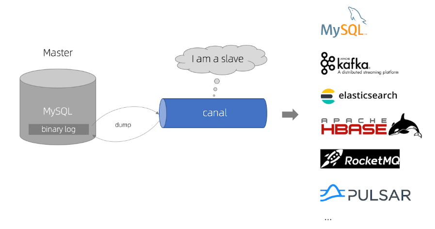
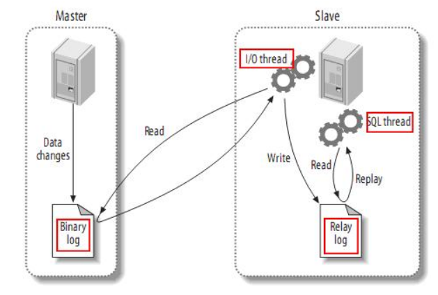
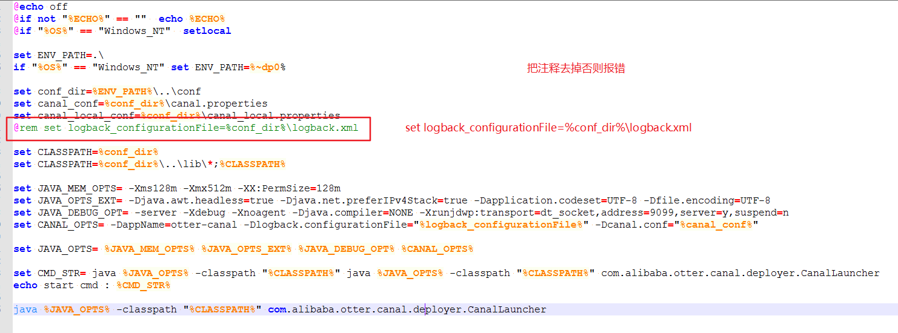

<!-- TOC -->

- [1、简介](#1简介)
- [2、本地调试](#2本地调试)
    - [1、修改本地MySQL数据的my.ini文件](#1修改本地mysql数据的myini文件)
    - [2、源码构建打包](#2源码构建打包)
    - [3、idea启动测试类](#3idea启动测试类)
    - [4、canal-admin web页面启动](#4canal-admin-web页面启动)
- [参考](#参考)

<!-- /TOC -->


# 1、简介




canal [kə'næl]，译意为水道/管道/沟渠，主要用途是基于 MySQL 数据库增量日志解析，提供增量数据订阅和消费


> MySQL主备复制原理



- MySQL master 将数据变更写入二进制日志( binary log, 其中记录叫做二进制日志事件binary log events，可以通过 show binlog events 进行查看)
- MySQL slave 将 master 的 binary log events 拷贝到它的中继日志(relay log)
- MySQL slave 重放 relay log 中事件，将数据变更反映它自己的数据


> 工作原理

- canal 模拟 MySQL slave 的交互协议，伪装自己为 MySQL slave ，向 MySQL master 发送 dump 协议
- MySQL master 收到 dump 请求，开始推送 binary log 给 slave (即 canal )
- canal 解析 binary log 对象(原始为 byte 流)


# 2、本地调试


## 1、修改本地MySQL数据的my.ini文件

Windows本地MySQL的配置文件\my.ini路径，C:\ProgramData\MySQL\MySQL Server 5.7

- 1、对于自建 MySQL , 需要先开启 Binlog 写入功能，配置 binlog-format 为 ROW 模式，my.cnf 中配置如下

```
[mysqld]

log-bin=mysql-bin # 开启 binlog

binlog-format=ROW # 选择 ROW 模式

server_id=1 # 配置 MySQL replaction 需要定义，不要和 canal 的 slaveId 重复
```

- 2、授权 canal 链接 MySQL 账号具有作为 MySQL slave 的权限, 如果已有账户可直接 grant


```
CREATE USER canal IDENTIFIED BY 'canal';  
GRANT SELECT, REPLICATION SLAVE, REPLICATION CLIENT ON *.* TO 'canal'@'%';
-- GRANT ALL PRIVILEGES ON *.* TO 'canal'@'%' ;
FLUSH PRIVILEGES;
```


## 2、源码构建打包

参考：

https://github.com/alibaba/canal/wiki/QuickStart

https://github.com/alibaba/canal/wiki/AdminGuide

mvn clean install -Denv=release

执行完成后，会在canal工程根目录下生成一个target目录，里面会包含一个 canal.deployer-$verion.tar.gz

- bin
- conf
- lib
- logs

修改配置

vi conf/example/instance.properties

```
## mysql serverId
canal.instance.mysql.slaveId = 1234

#username/password，需要改成自己的数据库信息
canal.instance.dbUsername = canal  
canal.instance.dbPassword = canal

```

Windows下启动startup.bat，但是会出现一个异常，需要修改下



解决办法：

https://github.com/alibaba/canal/issues/2197

https://github.com/alibaba/canal/issues/2152


## 3、idea启动测试类

com.alibaba.otter.canal.example.SimpleCanalClientTest

在数据库插入一条数据

```sql
CREATE TABLE `t` (
  `id` int(11) NOT NULL AUTO_INCREMENT,
  `c` int(11) DEFAULT NULL,
  PRIMARY KEY (`id`)
) ENGINE=InnoDB AUTO_INCREMENT=1006 DEFAULT CHARSET=latin1;

INSERT into t (c) VALUES (2222);
```

观察输出日志

```

****************************************************
* Batch Id: [2] ,count : [3] , memsize : [147] , Time : 2020-06-16 21:59:07
* Start : [mysql-bin.000001:4251:1592315947000(2020-06-16 21:59:07)] 
* End : [mysql-bin.000001:4412:1592315947000(2020-06-16 21:59:07)] 
****************************************************

================> binlog[mysql-bin.000001:4251] , executeTime : 1592315947000(2020-06-16 21:59:07) , gtid : () , delay : 309ms
 BEGIN ----> Thread id: 234
----------------> binlog[mysql-bin.000001:4368] , name[test,t] , eventType : INSERT , executeTime : 1592315947000(2020-06-16 21:59:07) , gtid : () , delay : 311 ms
id : 1021    type=int(11)    update=true
c : 2222    type=int(11)    update=true
----------------
 END ----> transaction id: 11774
================> binlog[mysql-bin.000001:4412] , executeTime : 1592315947000(2020-06-16 21:59:07) , gtid : () , delay : 312ms
```

## 4、canal-admin web页面启动

参考： https://github.com/alibaba/canal/wiki/Canal-Admin-QuickStart

访问：http://127.0.0.1:8089/

默认密码：admin/123456

 


# 参考

- [源码学习分支](https://github.com/lishuai2016/canal/tree/b_f_1.1.4_20200616)

- [官方文档](https://github.com/alibaba/canal/wiki)