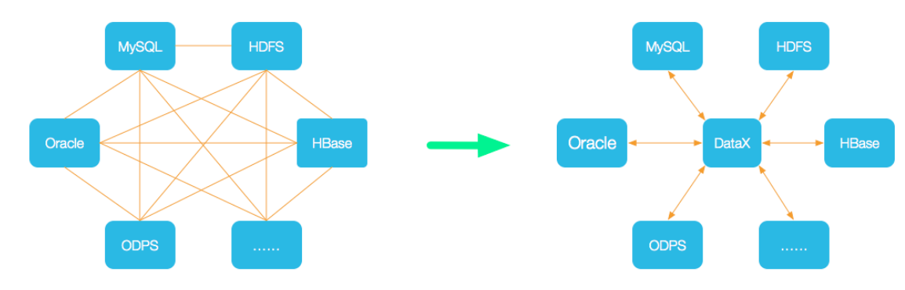
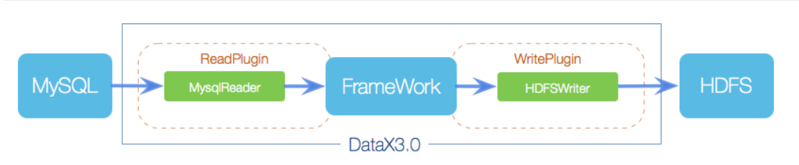
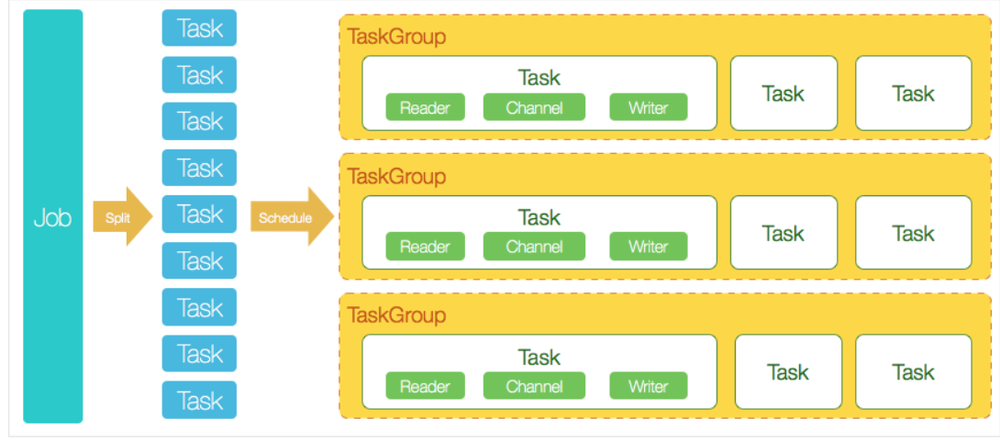
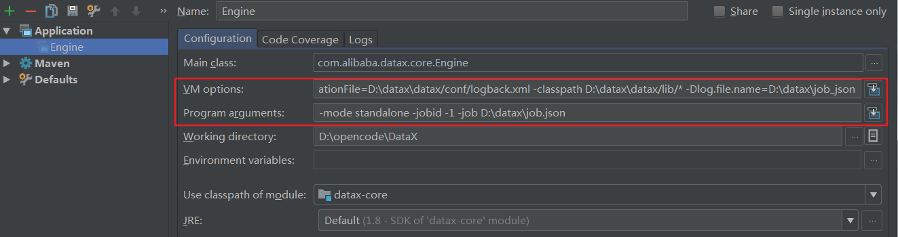
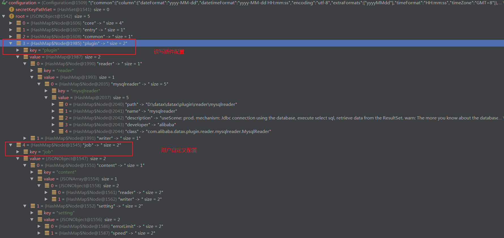
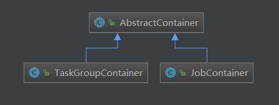
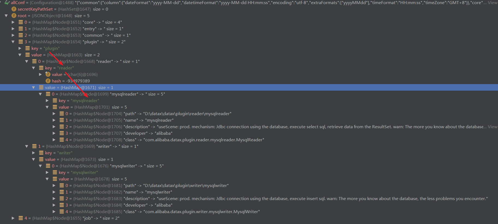

<!-- TOC -->

- [1、datax简介](#1datax简介)
- [2、DataX3.0框架设计](#2datax30框架设计)
- [2、源码构建和idea运行启动](#2源码构建和idea运行启动)
- [3、源码分析](#3源码分析)
    - [1、Job&Task概念](#1jobtask概念)
- [参考](#参考)

<!-- /TOC -->


# 1、datax简介

DataX 是阿里巴巴集团内被广泛使用的离线数据同步工具/平台，实现包括 MySQL、Oracle、SqlServer、Postgre、HDFS、Hive、ADS、HBase、TableStore(OTS)、MaxCompute(ODPS)、DRDS 等各种异构数据源之间高效的数据同步功能。



> 设计理念

为了解决异构数据源同步问题，DataX将复杂的网状的同步链路变成了星型数据链路，DataX作为中间传输载体负责连接各种数据源。当需要接入一个新的数据源的时候，只需要将此数据源对接到DataX，便能跟已有的数据源做到无缝数据同步。

> 当前使用现状

DataX在阿里巴巴集团内被广泛使用，承担了所有大数据的离线同步业务，并已持续稳定运行了6年之久。目前每天完成同步8w多道作业，每日传输数据量超过300TB。


# 2、DataX3.0框架设计



DataX本身作为离线数据同步框架，采用Framework + plugin架构构建。将数据源读取和写入抽象成为Reader/Writer插件，纳入到整个同步框架中。

- Reader：Reader为数据采集模块，负责采集数据源的数据，将数据发送给Framework。
- Writer： Writer为数据写入模块，负责不断向Framework取数据，并将数据写入到目的端。
- Framework：Framework用于连接reader和writer，作为两者的数据传输通道，并处理缓冲，流控，并发，数据转换等核心技术问题。

DataX本身作为数据同步框架，将不同数据源的同步抽象为从源头数据源读取数据的Reader插件，以及向目标端写入数据的Writer插件，理论上DataX框架可以支持任意数据源类型的数据同步工作。同时DataX插件体系作为一套生态系统, 每接入一套新数据源该新加入的数据源即可实现和现有的数据源互通。


DataX 3.0 开源版本支持单机多线程模式完成同步作业运行，下图按一个DataX作业生命周期的时序图，从整体架构设计非常简要说明DataX各个模块相互关系。




> 核心模块介绍：

- DataX完成单个数据同步的作业，我们称之为Job，DataX接受到一个Job之后，将启动一个进程来完成整个作业同步过程。DataX Job模块是单个作业的中枢管理节点，承担了数据清理、子任务切分(将单一作业计算转化为多个子Task)、TaskGroup管理等功能。

- 2、DataXJob启动后，会根据不同的源端切分策略，将Job切分成多个小的Task(子任务)，以便于并发执行。Task便是DataX作业的最小单元，每一个Task都会负责一部分数据的同步工作。

- 3、切分多个Task之后，DataX Job会调用Scheduler模块，根据配置的并发数据量，将拆分成的Task重新组合，组装成TaskGroup(任务组)。每一个TaskGroup负责以一定的并发运行完毕分配好的所有Task，默认单个任务组的并发数量为5。

- 4、每一个Task都由TaskGroup负责启动，Task启动后，会固定启动Reader—>Channel—>Writer的线程来完成任务同步工作。

- 5、DataX作业运行起来之后， Job监控并等待多个TaskGroup模块任务完成，等待所有TaskGroup任务完成后Job成功退出。否则，异常退出，进程退出值非0


> DataX调度流程：
举例来说，用户提交了一个DataX作业，并且配置了20个并发，目的是将一个100张分表的mysql数据同步到odps里面。 DataX的调度决策思路是：

- 1、DataXJob根据分库分表切分成了100个Task。[这里如何切分的？]
- 2、根据20个并发，DataX计算共需要分配4个TaskGroup。[如何计算的？规则？]
- 3、4个TaskGroup平分切分好的100个Task，每一个TaskGroup负责以5个并发共计运行25个Task。


# 2、源码构建和idea运行启动

mvn -U clean package assembly:assembly -Dmaven.test.skip=true

在windows的cmd窗口输入：python D:\datax\datax\bin\datax.py D:\datax\job.json

在执行日志中会打印如下启动命令：

```
java -server -Xms1g -Xmx1g -XX:+HeapDumpOnOutOfMemoryError -XX:HeapDumpPath=D:\datax\datax/log -Xms1g -Xmx1g -XX:+HeapDumpOnOutOfMemoryError -XX:HeapDumpPath=D:\datax\datax/log -Dloglevel=info -Dfile.encoding=UTF-8 -Dlogback.statusListenerClass=ch.qos.logback.core.status.NopStatusListener -Djava.security.egd=file:///dev/urandom -Ddatax.home=D:\datax\datax -Dlogback.configurationFile=D:\datax\datax/conf/logback.xml -classpath D:\datax\datax/lib/*  -Dlog.file.name=D:\datax\job_json com.alibaba.datax.core.Engine -mode standalone -jobid -1 -job D:\datax\job.json
```

备注：需要在datax.py脚本中添加一行打印启动命令函数print(startCommand)





VM options

```
-server -Xms1g -Xmx1g -XX:+HeapDumpOnOutOfMemoryError -XX:HeapDumpPath=D:\datax\datax/log -Xms1g -Xmx1g -XX:+HeapDumpOnOutOfMemoryError -XX:HeapDumpPath=D:\datax\datax/log -Dloglevel=info -Dfile.encoding=UTF-8 -Dlogback.statusListenerClass=ch.qos.logback.core.status.NopStatusListener -Djava.security.egd=file:///dev/urandom -Ddatax.home=D:\datax\datax -Dlogback.configurationFile=D:\datax\datax/conf/logback.xml -classpath D:\datax\datax/lib/*  -Dlog.file.name=D:\datax\job_json
```

Program arguments

```
-mode standalone -jobid -1 -job D:\datax\job.json
```


job.json文件内容

```json
{
    "job": {
        "content": [
            {
                "reader": {
                    "name": "mysqlreader",
                    "parameter": {
                        "username": "root",
                        "password": "123456",
                        "column": [
                            "id",
                            "name"
                        ],
                        "connection": [
                            {
                                "table": [
                                    "table1"
                                ],
                                "jdbcUrl": [
                                    "jdbc:mysql://localhost:3306/datax?characterEncoding=utf8"
                                ]
                            }
                        ]
                    }
                },
                "writer": {
                    "name": "mysqlwriter",
                    "parameter": {
                        "username": "root",
                        "password": "123456",
                        "column": [
                            "id",
                            "name"
                        ],
                        "connection": [
                            {
                                "table": [
                                    "table2"
                                ],
                                "jdbcUrl": "jdbc:mysql://localhost:3306/datax?characterEncoding=utf8"
                            }
                        ]
                    }
                }
            }
        ],
        "setting": {
            "speed": {
                "channel": 1,
                "byte": 104857600
            },
            "errorLimit": {
                "record": 10,
                "percentage": 0.05
            }
        }
    }
}
```


运行日志输出


```
D:\soft-install\jdk8\bin\java -server -Xms1g -Xmx1g -XX:+HeapDumpOnOutOfMemoryError -XX:HeapDumpPath=D:\datax\datax/log -Xms1g -Xmx1g -XX:+HeapDumpOnOutOfMemoryError -XX:HeapDumpPath=D:\datax\datax/log -Dloglevel=info -Dfile.encoding=UTF-8 -Dlogback.statusListenerClass=ch.qos.logback.core.status.NopStatusListener -Djava.security.egd=file:///dev/urandom -Ddatax.home=D:\datax\datax -Dlogback.configurationFile=D:\datax\datax/conf/logback.xml -classpath D:\datax\datax/lib/* -Dlog.file.name=D:\datax\job_json "-javaagent:D:\idea-2017-new\IntelliJ IDEA 2017.2.2\lib\idea_rt.jar=52112:D:\idea-2017-new\IntelliJ IDEA 2017.2.2\bin" com.alibaba.datax.core.Engine -mode standalone -jobid -1 -job D:\datax\job.json
2020-06-13 11:20:34.510 [main] INFO  VMInfo - VMInfo# operatingSystem class => sun.management.OperatingSystemImpl
2020-06-13 11:20:34.525 [main] INFO  Engine - the machine info  => 

	osInfo:	Oracle Corporation 1.8 25.181-b13
	jvmInfo:	Windows 7 amd64 6.1
	cpu num:	4

	totalPhysicalMemory:	-0.00G
	freePhysicalMemory:	-0.00G
	maxFileDescriptorCount:	-1
	currentOpenFileDescriptorCount:	-1

	GC Names	[PS MarkSweep, PS Scavenge]

	MEMORY_NAME                    | allocation_size                | init_size                      
	PS Eden Space                  | 256.00MB                       | 256.00MB                       
	Code Cache                     | 240.00MB                       | 2.44MB                         
	Compressed Class Space         | 1,024.00MB                     | 0.00MB                         
	PS Survivor Space              | 42.50MB                        | 42.50MB                        
	PS Old Gen                     | 683.00MB                       | 683.00MB                       
	Metaspace                      | -0.00MB                        | 0.00MB                         


2020-06-13 11:20:34.556 [main] INFO  Engine - 
{
	"content":[
		{
			"reader":{
				"name":"mysqlreader",
				"parameter":{
					"column":[
						"id",
						"name"
					],
					"connection":[
						{
							"jdbcUrl":[
								"jdbc:mysql://localhost:3306/datax?characterEncoding=utf8"
							],
							"table":[
								"table1"
							]
						}
					],
					"password":"******",
					"username":"root"
				}
			},
			"writer":{
				"name":"mysqlwriter",
				"parameter":{
					"column":[
						"id",
						"name"
					],
					"connection":[
						{
							"jdbcUrl":"jdbc:mysql://localhost:3306/datax?characterEncoding=utf8",
							"table":[
								"table2"
							]
						}
					],
					"password":"******",
					"username":"root"
				}
			}
		}
	],
	"setting":{
		"errorLimit":{
			"percentage":0.05,
			"record":10
		},
		"speed":{
			"byte":104857600,
			"channel":1
		}
	}
}

2020-06-13 11:20:34.596 [main] WARN  Engine - prioriy set to 0, because NumberFormatException, the value is: null
2020-06-13 11:20:34.598 [main] INFO  PerfTrace - PerfTrace traceId=job_-1, isEnable=false, priority=0
2020-06-13 11:20:34.598 [main] INFO  JobContainer - DataX jobContainer starts job.
2020-06-13 11:20:34.599 [main] INFO  JobContainer - Set jobId = 0
2020-06-13 11:20:35.886 [job-0] INFO  OriginalConfPretreatmentUtil - Available jdbcUrl:jdbc:mysql://localhost:3306/datax?characterEncoding=utf8&yearIsDateType=false&zeroDateTimeBehavior=convertToNull&tinyInt1isBit=false&rewriteBatchedStatements=true.
2020-06-13 11:20:35.898 [job-0] INFO  OriginalConfPretreatmentUtil - table:[table1] has columns:[id,name].
2020-06-13 11:20:36.948 [job-0] INFO  OriginalConfPretreatmentUtil - table:[table2] all columns:[
id,name
].
2020-06-13 11:20:36.959 [job-0] INFO  OriginalConfPretreatmentUtil - Write data [
INSERT INTO %s (id,name) VALUES(?,?)
], which jdbcUrl like:[jdbc:mysql://localhost:3306/datax?characterEncoding=utf8&yearIsDateType=false&zeroDateTimeBehavior=convertToNull&tinyInt1isBit=false&rewriteBatchedStatements=true]
2020-06-13 11:20:36.959 [job-0] INFO  JobContainer - jobContainer starts to do prepare ...
2020-06-13 11:20:36.960 [job-0] INFO  JobContainer - DataX Reader.Job [mysqlreader] do prepare work .
2020-06-13 11:20:36.961 [job-0] INFO  JobContainer - DataX Writer.Job [mysqlwriter] do prepare work .
2020-06-13 11:20:36.961 [job-0] INFO  JobContainer - jobContainer starts to do split ...
2020-06-13 11:20:36.962 [job-0] INFO  JobContainer - Job set Max-Byte-Speed to 104857600 bytes.
2020-06-13 11:20:36.966 [job-0] INFO  JobContainer - DataX Reader.Job [mysqlreader] splits to [1] tasks.
2020-06-13 11:20:36.966 [job-0] INFO  JobContainer - DataX Writer.Job [mysqlwriter] splits to [1] tasks.
2020-06-13 11:20:36.985 [job-0] INFO  JobContainer - jobContainer starts to do schedule ...
2020-06-13 11:20:36.988 [job-0] INFO  JobContainer - Scheduler starts [1] taskGroups.
2020-06-13 11:20:36.990 [job-0] INFO  JobContainer - Running by standalone Mode.
2020-06-13 11:20:36.998 [taskGroup-0] INFO  TaskGroupContainer - taskGroupId=[0] start [1] channels for [1] tasks.
2020-06-13 11:20:37.013 [taskGroup-0] INFO  Channel - Channel set byte_speed_limit to -1, No bps activated.
2020-06-13 11:20:37.013 [taskGroup-0] INFO  Channel - Channel set record_speed_limit to -1, No tps activated.
2020-06-13 11:20:37.028 [taskGroup-0] INFO  TaskGroupContainer - taskGroup[0] taskId[0] attemptCount[1] is started
2020-06-13 11:20:37.031 [0-0-0-reader] INFO  CommonRdbmsReader$Task - Begin to read record by Sql: [select id,name from table1 
] jdbcUrl:[jdbc:mysql://localhost:3306/datax?characterEncoding=utf8&yearIsDateType=false&zeroDateTimeBehavior=convertToNull&tinyInt1isBit=false&rewriteBatchedStatements=true].
2020-06-13 11:20:37.067 [0-0-0-reader] INFO  CommonRdbmsReader$Task - Finished read record by Sql: [select id,name from table1 
] jdbcUrl:[jdbc:mysql://localhost:3306/datax?characterEncoding=utf8&yearIsDateType=false&zeroDateTimeBehavior=convertToNull&tinyInt1isBit=false&rewriteBatchedStatements=true].
2020-06-13 11:20:37.129 [taskGroup-0] INFO  TaskGroupContainer - taskGroup[0] taskId[0] is successed, used[102]ms
2020-06-13 11:20:37.129 [taskGroup-0] INFO  TaskGroupContainer - taskGroup[0] completed it's tasks.
2020-06-13 11:20:47.019 [job-0] INFO  StandAloneJobContainerCommunicator - Total 4 records, 12 bytes | Speed 1B/s, 0 records/s | Error 0 records, 0 bytes |  All Task WaitWriterTime 0.000s |  All Task WaitReaderTime 0.000s | Percentage 100.00%
2020-06-13 11:20:47.019 [job-0] INFO  AbstractScheduler - Scheduler accomplished all tasks.
2020-06-13 11:20:47.020 [job-0] INFO  JobContainer - DataX Writer.Job [mysqlwriter] do post work.
2020-06-13 11:20:47.022 [job-0] INFO  JobContainer - DataX Reader.Job [mysqlreader] do post work.
2020-06-13 11:20:47.022 [job-0] INFO  JobContainer - DataX jobId [0] completed successfully.
2020-06-13 11:20:47.024 [job-0] INFO  HookInvoker - No hook invoked, because base dir not exists or is a file: D:\datax\datax\hook
2020-06-13 11:20:47.037 [job-0] INFO  JobContainer - 
	 [total cpu info] => 
		averageCpu                     | maxDeltaCpu                    | minDeltaCpu                    
		-1.00%                         | -1.00%                         | -1.00%
                        

	 [total gc info] => 
		 NAME                 | totalGCCount       | maxDeltaGCCount    | minDeltaGCCount    | totalGCTime        | maxDeltaGCTime     | minDeltaGCTime     
		 PS MarkSweep         | 0                  | 0                  | 0                  | 0.000s             | 0.000s             | 0.000s             
		 PS Scavenge          | 0                  | 0                  | 0                  | 0.000s             | 0.000s             | 0.000s             

2020-06-13 11:20:47.037 [job-0] INFO  JobContainer - PerfTrace not enable!
2020-06-13 11:20:47.045 [job-0] INFO  StandAloneJobContainerCommunicator - Total 4 records, 12 bytes | Speed 1B/s, 0 records/s | Error 0 records, 0 bytes |  All Task WaitWriterTime 0.000s |  All Task WaitReaderTime 0.000s | Percentage 100.00%
2020-06-13 11:20:47.051 [job-0] INFO  JobContainer - 
任务启动时刻                    : 2020-06-13 11:20:34
任务结束时刻                    : 2020-06-13 11:20:47
任务总计耗时                    :                 12s
任务平均流量                    :                1B/s
记录写入速度                    :              0rec/s
读出记录总数                    :                   4
读写失败总数                    :                   0


Process finished with exit code 0


```


# 3、源码分析

DataX的框架的核心部分：一块是配置贯穿DataX，all in configuration，将配置的json用到了极致；另一块是通过URLClassLoader实现插件的热加载。

## 1、Job&Task概念

 在DataX的逻辑模型中包括job、task两个维度，通过将job进行task拆分，然后将task合并到taskGroup进行运行。

job实例运行在jobContainer容器中，它是所有任务的master，负责初始化、拆分、调度、运行、回收、监控和汇报，但它并不做实际的数据同步操作。

Job: Job是DataX用以描述从一个源头到一个目的端的同步作业，是DataX数据同步的最小业务单元。比如：从一张mysql的表同步到odps的一个表的特定分区。

Task: Task是为最大化而把Job拆分得到的最小执行单元。比如：读一张有1024个分表的mysql分库分表的Job，拆分成1024个读Task，用若干个并发执行。

TaskGroup: 描述的是一组Task集合。在同一个TaskGroupContainer执行下的Task集合称之为TaskGroup。

JobContainer: job实例运行在jobContainer容器中，它是所有任务的master，负责初始化、拆分、调度、运行、回收、监控和汇报。但它并不做实际的数据同步操作。类似Yarn中的JobTracker。

TaskGroupContainer: TaskGroup执行器，负责执行一组Task的工作单元，类似Yarn中的TaskTracker。

简而言之， Job拆分成Task，在分别在框架提供的容器中执行，插件只需要实现Job和Task两部分逻辑。








LoadUtil.pluginRegisterCenter 在启动的时候会把当前配置job的读写插件解析到plugin节点。




> 模块说明

- datax-common 基础模块，定义读写接口；

- datax-transformer 转化模块，引入datax-common包；

- datax-core 核心模块，引入datax-transformer包；

- plugin-rdbms-util 关系型数据库读写模块公用，引入datax-common包；


> DataX的数据传输

跟一般的生产者-消费者模式一样，Reader插件和Writer插件之间也是通过channel来实现数据的传输的。channel可以是内存的，也可能是持久化的，插件不必关心。插件通过RecordSender往channel写入数据，通过RecordReceiver从channel读取数据。

channel中的一条数据为一个Record的对象，Record中可以放多个Column对象，这可以简单理解为数据库中的记录和列。


# 参考

- [datax的安装和使用（windows）](https://www.cnblogs.com/Aduorisk/p/12408559.html)


- [datax-web-ui](https://github.com/lishuai2016/datax-web-ui)
- [datax-web](https://github.com/lishuai2016/datax-web)
- [DataX](https://github.com/alibaba/DataX)
- [DataX工作原理](https://github.com/alibaba/DataX/blob/master/introduction.md)

- [PowerShell使用教程](https://www.cnblogs.com/lsdb/p/9531338.html)

- [datax源码阅读一：python文件](https://yq.aliyun.com/articles/696846?spm=a2c4e.11153940.0.0.1505b9ceZiannM)
- [DataX的执行流程分析](https://www.jianshu.com/p/b10fbdee7e56)


