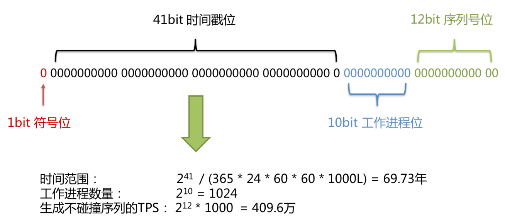

# 分布式主键

## 1、UUID

采用 UUID.randomUUID() 的方式产生分布式主键。

## 2、SNOWFLAKE

雪花算法（snowflake）生成 64bit 的长整型数据。

雪花算法是由 Twitter 公布的分布式主键生成算法，它能够保证不同进程主键的不重复性，以及相同进程主键的有序性。

在同一个进程中，它首先是通过时间位保证不重复，如果时间相同则是通过序列位保证。 同时由于时间位是单调递增的，且各个服务器如果大体做了时间同步，那么生成的主键在分布式环境可以认为是总体有序的，这就保证了对索引字段的插入的高效性。例如 MySQL 的 Innodb 存储引擎的主键。

使用雪花算法生成的主键，二进制表示形式包含 4 部分，从高位到低位分表为：1bit 符号位、41bit 时间戳位、10bit 工作进程位以及 12bit 序列号位。

- 1、符号位(1bit)：预留的符号位，恒为零。

- 2、时间戳位(41bit)：41 位的时间戳可以容纳的毫秒数是 2 的 41 次幂，一年所使用的毫秒数是：365 * 24 * 60 * 60 * 1000。通过计算可知：Math.pow(2, 41) / (365 * 24 * 60 * 60 * 1000L);结果约等于 69.73 年。Apache ShardingSphere的雪花算法的时间纪元从2016年11月1日零点开始，可以使用到2086年，相信能满足绝大部分系统的要求。

- 3、工作进程位(10bit)：该标志在 Java 进程内是唯一的，如果是分布式应用部署应保证每个工作进程的 id 是不同的。该值默认为 0，可通过属性设置。

- 2、序列号位(12bit)：该序列是用来在同一个毫秒内生成不同的 ID。如果在这个毫秒内生成的数量超过 4096 (2的12次幂)，那么生成器会等待到下个毫秒继续生成。

雪花算法主键的详细结构见下图。

# 参考
- [官方文档](http://shardingsphere.apache.org/document/current/cn/overview/)
- [源码学习分支](https://github.com/lishuai2016/shardingsphere/tree/b_f_4.1.1_20200615)
- [shardingsphere-example](https://github.com/apache/shardingsphere-example)

- [样例sharding-spring-boot-mybatis-example分析](https://cloud.tencent.com/developer/article/1476234)

