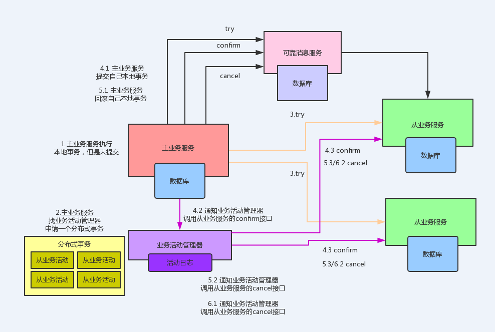

<!-- TOC -->

- [1、通用性TCC技术方案](#1通用性tcc技术方案)
- [2、异步确保型TCC技术方案](#2异步确保型tcc技术方案)
- [3、补偿性TCC解决方案](#3补偿性tcc解决方案)
- [4、TCC方案使用细节](#4tcc方案使用细节)
    - [1、接口拆分问题](#1接口拆分问题)
    - [2、接口的几种特殊情况](#2接口的几种特殊情况)
    - [3、接口的幂等性保证](#3接口的幂等性保证)
    - [4、tcc分布式事务框架](#4tcc分布式事务框架)
- [9、tcc开源组件](#9tcc开源组件)

<!-- /TOC -->

TCC事务机制相比于XA，解决了其几个缺点:
- 1.解决了协调者单点，由主业务方发起并完成这个业务活动。业务活动管理器也变成多点，引入集群。
- 2.同步阻塞:引入超时，超时后进行补偿，并且不会锁定整个资源，将资源转换为业务逻辑形式，粒度变小。
- 3.数据一致性，有了补偿机制之后，由业务活动管理器控制一致性

对于TCC的解释:
- Try阶段：尝试执行,完成所有业务检查（一致性）,预留必须业务资源（准隔离性）
- Confirm阶段：确认执行真正执行业务，不作任何业务检查，只使用Try阶段预留的业务资源，Confirm操作满足幂等性。要求具备幂等设计，Confirm失败后需要进行重试。
- Cancel阶段：取消执行，释放Try阶段预留的业务资源Cancel操作满足幂等性Cancel阶段的异常和Confirm阶段异常处理方案基本上一致。

# 1、通用性TCC技术方案

其实所谓的TCC思想，画一张图来说，大致说起来就很简单，我们就用自己的流量充值中心来举个例子好了，你要是不考虑具体的技术实现的话，大概来说呢，相当于就是下面这样的思路：

- （1）主业务服务：相当于流量充值中心的服务，他就是TCC事务的主控服务，主要控制的服务，负责整个分布式事务的编排和管理，执行，回滚，都是他来控制
- （2）从业务服务：相当于我们的资金服务、订单服务、积分服务、抽奖服务、流量券服务，主要就是提供了3个接口try-confirm-cancel，try接口里是锁定资源，confirm是业务逻辑，cancel是回滚逻辑
- （3）业务活动管理器：管理具体的分布式事务的状态，分布式事务中各个服务对应的子事务的状态，包括就是他会负责去触发各个从业务服务的confirm和cancel接口的执行和调用。。。

- （1）try阶段，资源的锁定，先冻结掉用户的账户资金，将一部分资金转出到冻结资金字段里去；可以创建一个充值订单，但是状态是“交易中”
- （2）confirm阶段，就是将用户的冻结资金口减掉，转移到商户的账户里去；同时将充值订单的状态修改为“交易成功”；完成抽奖机会、积分、流量券的新增
- （3）cancel阶段，try阶段任何一个服务有问题的话，那么就cancel掉，相当于是将冻结的资金还回去，将订单状态修改为“交易失败”；如果confirm阶段任何一个服务有问题的话，也是cancel掉，相当于是将商户账户里的资金还到用户账户里去，同时将订单的状态修改为“交易失败”

有一张比较经典的图，就是主业务服务->数据库，然后几个从业务服务->数据库，接着主业务服务会访问业务活动管理器（有活动日志），主业务服务发起执行try，然后主业务服务通知业务活动管理器，业务活动管理器再通知各个从业务发起confirm或者是cancel操作，可以把这张图给体现一下

这里主业务服务其实就是总控整套逻辑的，然后从业务服务就是干活儿的，业务活动管理器主要是记录整个分布式事务活动状态的，这个还是挺有必要的吧，这样保存分布式事务进行过程中的各种状态才可以啊，兄弟！

不然分布式事务临时终端了，你系统重启，谁知道你之前跑到哪一步了啊，哥儿们！

所以他会记录整个分布式事务的状态，分布式事务里各个服务代表的子事务的状态，而且他是负责在提交分布式事务的时候，调用各个从业务服务的confirm接口的，如果出问题的话也是他调用各个从业务服务的cancel接口的

所以说这里的一个执行流程和步骤大概是这样子的：

（1）主业务服务会先在本地开启一个本地事务（这个本地事务说白了，就是你的主业务服务是不是也可能会干点儿什么事儿）
（2）主业务服务向业务活动管理器申请启动一个分布式事务活动，主业务服务向业务活动管理器注册各个从业务活动
（3）接着主业务服务负责调用各个从业务服务的try接口
（4）如果所有从业务服务的try接口都调用成功的话，那么主业务服务就提交本地事务，然后通知业务活动管理器调用各个从业务服务的confirm接口
（5）如果有某个服务的try接口调用失败的话，那么主业务服务回滚本地事务，然后通知业务活动管理器调用各个从业务服务的cancel接口
（6）如果主业务服务触发了confirm操作，但是如果confirm过程中有失败，那么也会让业务活动管理器通知各个从业务服务cancel
（7）最后分布式事务结束

# 2、异步确保型TCC技术方案

如果要接入到一个TCC分布式事务中来，从业务服务必须改造自己的接口，本来就是一个接口，现在要新增两个接口，try接口，cancel接口。改造起来比较麻烦

这个大概来说就是把之前的通用型TCC方案给改造了一下，就是在主业务服务和从业务服务之间加了一个可靠消息服务，但是这个可靠消息服务可不是在请求什么MQ之类的东西，而是将消息放在数据库里的

大致来说呢，就是主业务服务的try、confirm和canel操作都调用可靠消息服务，然后可靠消息服务在try阶段插入一条消息到本地数据库；接着主业务服务执行confirm操作，可靠消息服务就是根据之前的消息，调用从业务服务实际的业务接口；如果要是这个调用失败的话，那么主业务服务发起cancel，可靠消息服务删除自己本地的消息即可

这种方案大家可以看到，其实说白了最大的优点，就是不需要从业务服务配合改造，提供try、confirm和cancel三个接口了，本来人家可能就一个接口，现在你楞是要求人家提供三个接口，真尴尬

那要是用了这种方案，就可以用可靠消息服务替代各个从业务服务提供TCC三个接口了

# 3、补偿性TCC解决方案

这个其实是跟通用型的TCC方案类似的，只不过从业务服务就提供俩接口就ok了，Do和Compensate，就是执行接口和补偿接口，这种方案的好处就是折中一下了，不需要从业务服务改造出来一个T接口，就是锁定资源的接口，只需要加一个补偿接口，如果业务逻辑执行失败之后，进行补偿

这样就可以少做一个接口了，但是因为没有做资源的一个锁定，那么大家需要自己注意类似资金转账的余额检查之类的事儿了，还有就是补偿的时候，因为你没做资源锁定，所以要注意一下补偿机制是否一定会成功

其实说实话，这个补偿性的TCC方案还是蛮不错挺有吸引力的

Do接口，Compensate接口，不要try接口，不要锁定资源，直接执行业务逻辑，如果有失败就调用Compensate接口，补偿接口，回滚刚才的操作

# 4、TCC方案使用细节

## 1、接口拆分问题

首先就是，从业务服务的每个接口都要拆分为三个接口，一个是try接口，一个是confirm接口，一个是cancel接口，也就是说要提供分布式事务实现的业务接口，自己就要考虑好这个，要提供3个接口

虽然真是够麻烦的，不过也没办法

try接口里，一般就是预留资源，比如说经典的资金转账，卡掉一些锁定资金，你要是不这么干，万一别的分布式事务给你干掉了一些资金，那你实际执行confirm的时候一旦检查资金余额就会发现转账失败，余额不足了

有些接口，没有资源锁定的操作，try接口就留空

confirm就是原来的业务方法，该干嘛干嘛

cnacel接口，要提供回滚的方法，就是把try或者confirm里的操作给他回滚了

就比如说，如果是try阶段，资金服务的try成功了，资金被冻结了24块钱，结果订单服务的try失败了，主业务服务就会通知回滚，调用资金服务的cancel接口，就要检查一下lock_amount字段里的值，将里面的24块钱转回到原来的amount字段里面去

confirm阶段，资金服务，都把24块钱从id=1的账号里转移到id=2的账号里去了，lock_amount也扣减掉了24块钱。结果积分服务的confirm失败了，整个分布式事务回滚，调用各个接口的cancel接口

资金服务，就变成了需要将id=2的账号的amount字段扣减掉24块钱，给id=1的账户增加24块钱

## 2、接口的几种特殊情况

（1）空回滚：那要是try阶段，比如网络问题，人家压根儿没调通你的try接口，结果就认定失败，直接调用你的cancel接口，咋办？所以你这个时候啥都不能干

（2）try回滚以及confirm回滚：try阶段如果执行了，但是其他服务try失败了，那么会调用cancel来回滚，你要可以回滚掉try阶段的操作；confirm阶段要是你执行了，但是有别的服务失败了，此时你就要回滚掉confirm阶段的操作

（3）倒置请求：比如说人家调用try接口，中间网络超时了，结果认定失败，直接调用cancel空回滚了；结果过了几秒钟try接口请求到来，此时咋整呢？尴尬了吧，你要在这个时候不允许执行try接口操作；同理啊，confirm请求超时了，结果都cancel掉了，但是过了几秒请求来了，让你confirm，你能干这事儿吗？

## 3、接口的幂等性保证

你有没有考虑过一个问题，就是try、confirm和cancel都可能被多次调用，所以无论怎么样，你都得保证这几个接口的幂等性，分布式接口幂等性那必须依赖第三方的中间件来实现，可以考虑使用经典的zk，zk非常适用于分布式系统的协调类操作

所以一个接口对同一个参数调用，只能调用一次，保证幂等操作

## 4、tcc分布式事务框架

我们的主业务服务那块，那必须得用tcc事务框架，不然各种接口调用，还有就是业务活动管理器，难不成都大家自己来写代码搞？？？？那就废掉了啊！所以必须要选用一种tcc分布式事务框架，来实现主业务服务的各种try confirm concel控制逻辑，同时实现业务活动的管理

> 总结

玩儿tcc初步来讲主要就是上述那些问题，其实说白了，一个就是从业务服务那块的接口的问题，还有一个其实就是主业务服务那块的业务活动管理器的控制，以及整个分布式事务的控制

# 9、tcc开源组件

- https://github.com/lishuai2016/ByteTCC
- https://github.com/lishuai2016/hmily
- https://github.com/lishuai2016/tcc-transaction

> 总结

TCC分布式事务的核心思想，说白了，就是当遇到下面这些情况时，某个服务的数据库宕机了；某个服务自己挂了；那个服务的redis、elasticsearch、MQ等基础设施故障了；某些资源不足了，比如说库存不够这些。先来Try一下，不要把业务逻辑完成，先试试看，看各个服务能不能基本正常运转，能不能先冻结我需要的资源。如果Try都ok，也就是说，底层的数据库、redis、elasticsearch、MQ都是可以写入数据的，并且你保留好了需要使用的一些资源（比如冻结了一部分库存）。接着，再执行各个服务的Confirm逻辑，基本上Confirm就可以很大概率保证一个分布式事务的完成了。那如果Try阶段某个服务就失败了，比如说底层的数据库挂了，或者redis挂了，等等。此时就自动执行各个服务的Cancel逻辑，把之前的Try逻辑都回滚，所有服务都不要执行任何设计的业务逻辑。保证大家要么一起成功，要么一起失败。

写到这里，本文差不多该结束了。等一等，你有没有想到一个问题？
如果有一些意外的情况发生了，比如说订单服务突然挂了，然后再次重启，TCC分布式事务框架是如何保证之前没执行完的分布式事务继续执行的呢？
所以，TCC事务框架都是要记录一些分布式事务的活动日志的，可以在磁盘上的日志文件里记录，也可以在数据库里记录。
保存下来分布式事务运行的各个阶段和状态。

