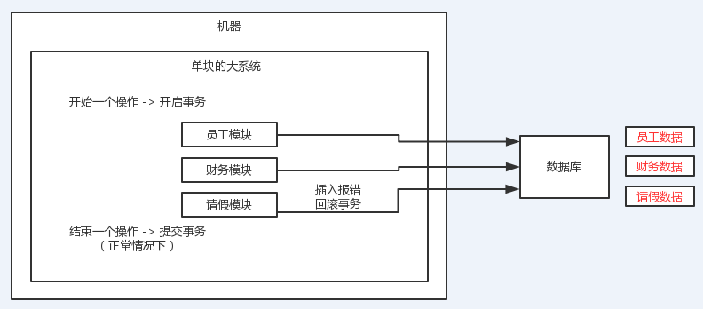
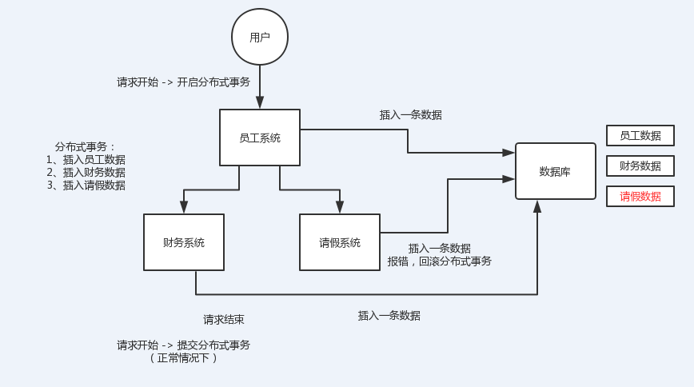
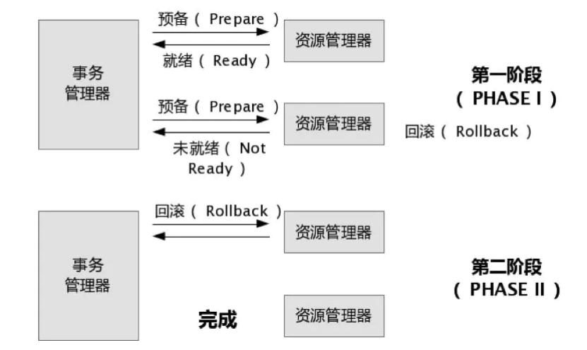
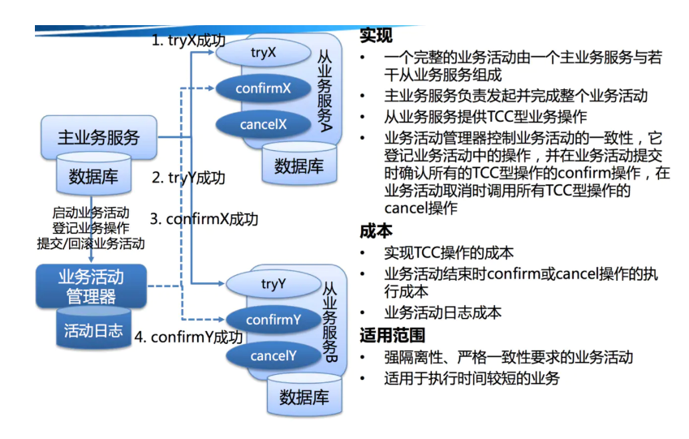
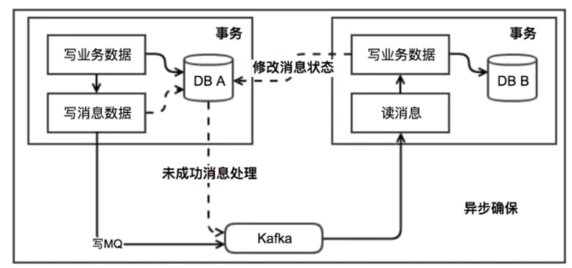
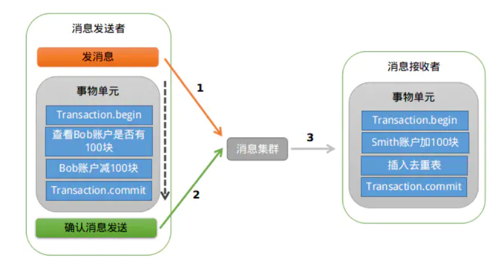
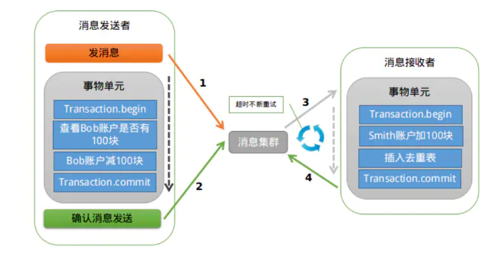
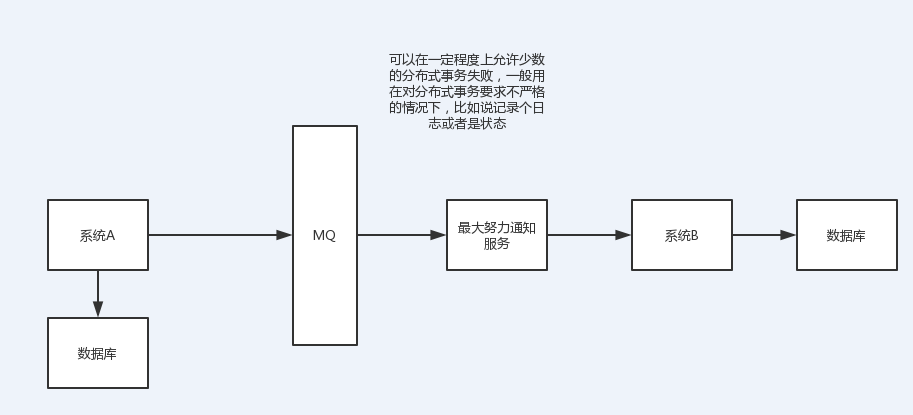

<!-- TOC -->

- [（1）两阶段提交方案/XA方案](#1两阶段提交方案xa方案)
- [（2）TCC方案](#2tcc方案)
- [（3）本地消息表](#3本地消息表)
- [（4）MQ事务(可靠消息最终一致性方案)](#4mq事务可靠消息最终一致性方案)
- [（5）最大努力通知方案](#5最大努力通知方案)
- [（6）Saga事务](#6saga事务)
- [7、总结](#7总结)

<!-- /TOC -->

`重点是前四种方案，其他的了解即可`

问题：分布式事务了解吗？你们如何解决分布式事务问题的？

只要聊到你做了分布式系统，必问分布式事务，你对分布式事务一无所知的话，确实会很坑，你起码得知道有哪些方案，一般怎么来做，每个方案的优缺点是什么。

现在面试，分布式系统成了标配，而分布式系统带来的分布式事务也成了标配了。因为你做系统肯定要用事务吧，那你用事务的话，分布式系统之后肯定要用分布式事务吧。。。呵呵。。。先不说你搞过没有，起码你得明白有哪几种方案，每种方案可能有啥坑？比如TCC方案的网络问题、XA方案的一致性问题

> 什么是分布式事务？

分布式事务就是指事务的参与者、支持事务的服务器、资源服务器以及事务管理器分别位于不同的分布式系统的不同节点之上。简单的说，就是一次大的操作由不同的小操作组成，这些小的操作分布在不同的服务器上，且属于不同的应用，、分布式事务需要保证这些小操作要么全部成功，要么全部失败。本质上来说，分布式事务就是为了保证不同数据库的数据一致性。

# （1）两阶段提交方案/XA方案

在XA协议中分为两阶段:
- 第一阶段：事务管理器要求每个涉及到事务的数据库预提交(precommit)此操作，并反映是否可以提交.
- 第二阶段：事务协调器要求每个数据库提交数据，或者回滚数据。

优点： 尽量保证了数据的强一致，实现成本较低，在各大主流数据库都有自己实现，对于MySQL是从5.5开始支持。

缺点:

- 单点问题:事务管理器在整个流程中扮演的角色很关键，如果其宕机，比如在第一阶段已经完成，在第二阶段正准备提交的时候事务管理器宕机，资源管理器就会一直阻塞，导致数据库无法使用。
- 同步阻塞:在准备就绪之后，资源管理器中的资源一直处于阻塞，直到提交完成，释放资源。
- 数据不一致:两阶段提交协议虽然为分布式数据强一致性所设计，但仍然存在数据不一致性的可能，比如在第二阶段中，假设协调者发出了事务commit的通知，但是因为网络问题该通知仅被一部分参与者所收到并执行了commit操作，其余的参与者则因为没有收到通知一直处于阻塞状态，这时候就产生了数据的不一致性。

总的来说，XA协议比较简单，成本较低，但是其单点问题，以及不能支持高并发(由于同步阻塞)依然是其最大的弱点。

# （2）TCC方案

关于TCC（Try-Confirm-Cancel）的概念，最早是由Pat Helland于2007年发表的一篇名为《Life beyond Distributed Transactions:an Apostate’s Opinion》的论文提出。

TCC事务机制相比于上面介绍的XA，解决了其几个缺点:
- 1.解决了协调者单点，由主业务方发起并完成这个业务活动。业务活动管理器也变成多点，引入集群。
- 2.同步阻塞:引入超时，超时后进行补偿，并且不会锁定整个资源，将资源转换为业务逻辑形式，粒度变小。
- 3.数据一致性，有了补偿机制之后，由业务活动管理器控制一致性

TCC的全程是：Try、Confirm、Cancel。

对于TCC的解释:

- Try阶段：尝试执行,完成所有业务检查（一致性）,预留必须业务资源（准隔离性）

- Confirm阶段：确认执行真正执行业务，不作任何业务检查，只使用Try阶段预留的业务资源，Confirm操作满足幂等性。要求具备幂等设计，Confirm失败后需要进行重试。

- Cancel阶段：取消执行，释放Try阶段预留的业务资源,Cancel操作满足幂等性Cancel阶段的异常和Confirm阶段异常处理方案基本上一致。

给大家举个例子吧，比如说跨银行转账的时候，要涉及到两个银行的分布式事务，如果用TCC方案来实现，思路是这样的：

- 1）Try阶段：先把两个银行账户中的资金给它冻结住就不让操作了
- 2）Confirm阶段：执行实际的转账操作，A银行账户的资金扣减，B银行账户的资金增加
- 3）Cancel阶段：如果任何一个银行的操作执行失败，那么就需要回滚进行补偿，就是比如A银行账户如果已经扣减了，但是B银行账户资金增加失败了，那么就得把A银行账户资金给加回去

这种方案说实话几乎很少用人使用，我们用的也比较少，但是也有使用的场景。因为这个事务回滚实际上是严重依赖于你自己写代码来回滚和补偿了，会造成补偿代码巨大，非常之恶心。

比如说我们，一般来说跟钱相关的，跟钱打交道的，支付、交易相关的场景，我们会用TCC，严格严格保证分布式事务要么全部成功，要么全部自动回滚，严格保证资金的正确性，在资金上出现问题

比较适合的场景：这个就是除非你是真的一致性要求太高，是你系统中核心之核心的场景，比如常见的就是资金类的场景，那你可以用TCC方案了，自己编写大量的业务逻辑，自己判断一个事务中的各个环节是否ok，不ok就执行补偿/回滚代码。

而且最好是你的各个业务执行的时间都比较短。

但是说实话，一般尽量别这么搞，自己手写回滚逻辑，或者是补偿逻辑，实在太恶心了，那个业务代码很难维护。

> 对于TCC来说适合一些:
- 强隔离性，严格一致性要求的活动业务。
- 执行时间较短的业务

# （3）本地消息表

本地消息表这个方案最初是ebay提出的 ebay的完整方案 

https://queue.acm.org/detail.cfm?id=1394128

此方案的核心是将需要分布式处理的任务通过消息日志的方式来异步执行。消息日志可以存储到本地文本、数据库或消息队列，再通过业务规则自动或人工发起重试。人工重试更多的是应用于支付场景，通过对账系统对事后问题的处理。

对于本地消息队列来说核心是把大事务转变为小事务。还是举上面用100元去买一瓶水的例子。

- 1.当你扣钱的时候，你需要在你扣钱的服务器上新增加一个本地消息表，你需要把你扣钱和写入减去水的库存到本地消息表放入同一个事务(依靠数据库本地事务保证一致性。

- 2.这个时候有个定时任务去轮询这个本地事务表，把没有发送的消息，扔给商品库存服务器，叫他减去水的库存，到达商品服务器之后这个时候得先写入这个服务器的事务表，然后进行扣减，扣减成功后，更新事务表中的状态。

- 3.商品服务器通过定时任务扫描消息表或者直接通知扣钱服务器，扣钱服务器本地消息表进行状态更新。

- 4.针对一些异常情况，定时扫描未成功处理的消息，进行重新发送，在商品服务器接到消息之后，首先判断是否是重复的，如果已经接收，在判断是否执行，如果执行在马上又进行通知事务，如果未执行，需要重新执行需要由业务保证幂等，也就是不会多扣一瓶水。

本地消息队列是BASE理论，是最终一致模型，适用于对一致性要求不高的。实现这个模型时需要注意重试的幂等。

这个方案说实话最大的问题就在于严重依赖于数据库的消息表来管理事务啥的？？？这个会导致如果是高并发场景咋办呢？咋扩展呢？所以一般确实很少用

# （4）MQ事务(可靠消息最终一致性方案)

在RocketMQ中实现了分布式事务，实际上其实是对本地消息表的一个封装，将本地消息表移动到了MQ内部。

基本流程如下:
- 第一阶段Prepared消息，会拿到消息的地址。
- 第二阶段执行本地事务。
- 第三阶段通过第一阶段拿到的地址去访问消息，并修改状态。消息接受者就能使用这个消息。

如果确认消息失败，在RocketMq Broker中提供了定时扫描没有更新状态的消息，如果有消息没有得到确认，会向消息发送者发送消息，来判断是否提交，在rocketmq中是以listener的形式给发送者，用来处理。

如果消费超时，则需要一直重试，消息接收端需要保证幂等。如果消息消费失败，这个就需要人工进行处理，因为这个概率较低，如果为了这种小概率时间而设计这个复杂的流程反而得不偿失

这个的意思，就是干脆不要用本地的消息表了，直接基于MQ来实现事务。比如阿里的RocketMQ就支持消息事务。

大概的意思就是：
- 1）A系统先发送一个prepared消息到mq，如果这个prepared消息发送失败那么就直接取消操作别执行了
- 2）如果这个消息发送成功过了，那么接着执行本地事务，如果成功就告诉mq发送确认消息，如果失败就告诉mq回滚消息
- 3）如果发送了确认消息，那么此时B系统会接收到确认消息，然后执行本地的事务
- 4）mq会自动定时轮询所有prepared消息回调你的接口，问你，这个消息是不是本地事务处理失败了，所有没发送确认消息？那是继续重试还是回滚？一般来说这里你就可以查下数据库看之前本地事务是否执行，如果回滚了，那么这里也回滚吧。这个就是避免可能本地事务执行成功了，别确认消息发送失败了。
- 5）这个方案里，要是系统B的事务失败了咋办？重试咯，自动不断重试直到成功，如果实在是不行，要么就是针对重要的资金类业务进行回滚，比如B系统本地回滚后，想办法通知系统A也回滚；或者是发送报警由人工来手工回滚和补偿

这个还是比较合适的，目前国内互联网公司大都是这么玩儿的，要不你举用RocketMQ支持的，要不你就自己基于类似ActiveMQ？RabbitMQ？自己封装一套类似的逻辑出来，总之思路就是这样子的

# （5）最大努力通知方案

这个方案的大致意思就是：

- 1）系统A本地事务执行完之后，发送个消息到MQ
- 2）这里会有个专门消费MQ的最大努力通知服务，这个服务会消费MQ然后写入数据库中记录下来，或者是放入个内存队列也可以，接着调用系统B的接口
- 3）要是系统B执行成功就ok了；要是系统B执行失败了，那么最大努力通知服务就定时尝试重新调用系统B，反复N次，最后还是不行就放弃

> 你们公司是如何处理分布式事务的？

这个，说真的，确实我们这个课程没法带着大家来实战，因为定位不是这个。但是如果你真的被问到，你可以这么说，我们某某特别严格的场景，用的是TCC来保证强一致性；然后其他的一些场景基于了阿里的RocketMQ来实现了分布式事务。

你找一个严格资金要求绝对不能错的场景，你可以说你是用的TCC方案；如果是一般的分布式事务场景，订单插入之后要调用库存服务更新库存，库存数据没有资金那么的敏感，可以用可靠消息最终一致性方案

友情提示一下，rocketmq 3.2.6之前的版本，是可以按照上面的思路来的，但是之后接口做了一些改变，我这里不再赘述了。

当然如果你愿意，你可以参考可靠消息最终一致性方案来自己实现一套分布式事务，比如基于rabbitmq来玩儿。

> 昨天学员给我提的一个问题

老师，我们现在想保证我们的某个系统非常的可靠，任何一个数据都不能错，我们用的是微服务架构，几十个服务。结果我们一盘点，发现，如果到处都要搞的话，一个系统要做几十个分布式事务出来。

我们的经验，我带几十人的team，最大的一个项目，起码几百个服务，复杂的分布式大型系统，里面其实也没几个分布式事务。

你其实用任何一个分布式事务的这么一个方案，都会导致你那块儿代码会复杂10倍。很多情况下，系统A调用系统B、系统C、系统D，我们可能根本就不做分布式事务。如果调用报错会打印异常日志。

每个月也就那么几个bug，很多bug是功能性的，体验性的，真的是涉及到数据层面的一些bug，一个月就几个，两三个？如果你为了确保系统自动保证数据100%不能错，上了几十个分布式事务，代码太复杂；性能太差，系统吞吐量、性能大幅度下跌。

99%的分布式接口调用，不要做分布式事务，直接就是监控（发邮件、发短信）、记录日志（一旦出错，完整的日志）、事后快速的定位、排查和出解决方案、修复数据。

每个月，每隔几个月，都会对少量的因为代码bug，导致出错的数据，进行人工的修复数据，自己临时动手写个程序，可能要补一些数据，可能要删除一些数据，可能要修改一些字段的值。

比你做50个分布式事务，成本要来的低上百倍，低几十倍

trade off，权衡，要用分布式事务的时候，一定是有成本，代码会很复杂，开发很长时间，性能和吞吐量下跌，系统更加复杂更加脆弱反而更加容易出bug；好处，如果做好了，TCC、可靠消息最终一致性方案，一定可以100%保证你那快数据不会出错。

1%，0.1%，0.01%的业务，资金、交易、订单，我们会用分布式事务方案来保证，会员积分、优惠券、商品信息，其实不要这么搞了

# （6）Saga事务

Saga是30年前一篇数据库伦理提到的一个概念。其核心思想是将长事务拆分为多个本地短事务，由Saga事务协调器协调，如果正常结束那就正常完成，如果某个步骤失败，则根据相反顺序一次调用补偿操作。

Saga的组成：
- 每个Saga由一系列sub-transaction Ti 组成
- 每个Ti 都有对应的补偿动作Ci，补偿动作用于撤销Ti造成的结果,这里的每个T，都是一个本地事务。

可以看到，和TCC相比，Saga没有“预留 try”动作，它的Ti就是直接提交到库。

Saga的执行顺序有两种：
- T1, T2, T3, ..., Tn
- T1, T2, ..., Tj, Cj,..., C2, C1，其中0 < j < n

Saga定义了两种恢复策略：

- 向后恢复，即上面提到的第二种执行顺序，其中j是发生错误的sub-transaction，这种做法的效果是撤销掉之前所有成功的sub-transation，使得整个Saga的执行结果撤销。

- 向前恢复，适用于必须要成功的场景，执行顺序是类似于这样的：T1, T2, ..., Tj(失败), Tj(重试),..., Tn，其中j是发生错误的sub-transaction。该情况下不需要Ci。

这里要注意的是，在saga模式中不能保证隔离性，因为没有锁住资源，其他事务依然可以覆盖或者影响当前事务。

还是拿100元买一瓶水的例子来说，这里定义
- T1=扣100元 T2=给用户加一瓶水 T3=减库存一瓶水
- C1=加100元 C2=给用户减一瓶水 C3=给库存加一瓶水

我们一次进行T1,T2，T3如果发生问题，就执行发生问题的C操作的反向。

上面说到的隔离性的问题会出现在，如果执行到T3这个时候需要执行回滚，但是这个用户已经把水喝了(另外一个事务)，回滚的时候就会发现，无法给用户减一瓶水了。这就是事务之间没有隔离性的问题

可以看见saga模式没有隔离性的影响还是较大，可以参照华为的解决方案:从业务层面入手加入一 Session 以及锁的机制来保证能够串行化操作资源。也可以在业务层面通过预先冻结资金的方式隔离这部分资源， 最后在业务操作的过程中可以通过及时读取当前状态的方式获取到最新的更新。

具体实例:可以参考华为的servicecomb

# 7、总结

分布式事务常见的几种方案：

- （1）XA分布式事务，一般用于单系统多库的场景，当然要是多系统多库，也可以，但是就很麻烦了，不适用于这个方案了
- （2）TCC方案，try-confirm-cancel方案
- （3）可靠消息最终一致性方案，都不能叫做分布式事务的方案，事务，分布式一致性的方案
- （4）最大努力通知方案
- （5）适合长事务（分布式）的sagas方案，之前在分布式事务解决方案的筑基里面，没有提到sagas，不会放在流量充值中心系统里面来实战，会放到后面我们的实际的大电商项目里去实战

在我们这里而言，非常简单

（1）TCC方案，适合于，你的多个服务的操作都比较快

TCC相当于是一堆同步服务调用的操作，包裹在一个事务里面，同步，关键词，人家给你发起一个请求，触发了一个复杂的TCC事务，人家要等你这个事务完成结束了，然后才能接续往下走的

假如你的TCC事务里面涉及了10来个服务的调用，要10来秒才能结束，太不靠谱了

TCC方案应对的其实是大量的同步服务调用的复杂的事务场景，如果要用TCC来保证分布式事务的执行，一般来说尽量确保每个服务的调用都比较快，一般来说确保一个TCC分布式事务的执行，大概需要总共1秒以内的时间

资金转账、创建订单、抽奖机会、积分、流量券相关的服务调用的逻辑，包裹在一个分布式事务内，用TCC来控制这个分布式事务，因为这里的一些操作基本都是在流量充值中心内部的一些服务，都比较快

TCC来控制，try他们一把，锁定一些资源；confirm一把，执行各个服务的业务逻辑；如果任何一个服务出现报错和失败；那么tcc就去cancel掉各个服务的逻辑，各个服务通过补偿来的方法逻辑，去回滚之前做出的数据变动

（2）可靠消息最终一致性的方案

这个方案，适合于那那种比较耗时的操作，通过这个消息中间件做成异步调用，发送一个消息出去，人家服务消费消息来执行业务逻辑，CAP理论，C（最终一致性），也就是说包裹在一个事务中的多个操作，其中有些操作可能在一定时间内是没执行的

可能要等过一段时间之后，然后才能去执行，最终一定会执行的，最终一致性的方案，通过MQ消息中间件保证消息的可靠性，最终来实现最终一致性的方案

调用起来很耗时的操作，比如说流量充值内，调用第三方运营商的系统接口完成流量充值，坑爹了，很可能会出问题，网络调用超时，人家系统代码写的太烂，一个流量充值要耗费个10秒钟才能完成

你就很不适合包裹在TCC里面了，因为这个东西调用第三方的系统接口，如果一旦超时了，很容易影响系统本地其他服务的操作

而且的话呢，一般来说，如果你充值话费，或者是充值流量，肯定不是说你刚付钱充值完毕，人家会通知你充值成功了，发你一个短信，告诉你说，具体是否充值到账，请以运营商那边的信息为准

你付钱之后，其实流量还没充值好，在一段时间内是没充值的，最终过一段时间，几分钟之后，人家一定会保证给你把流量充值到位

调用第三方运营商系统接口的操作，很适合用可靠消息最终一致性的方案

（3）最大努力通知方案

跟可靠消息最终一致性方案是类似的，可靠消息最终一致性方案，会保证最终必须要让那个执行成功的，但是最大努力通知方案，不一定保证最终一定会成功，可能会失败，但是他会尽力给你去给你通知那个服务的执行

比较适合那种不太核心一些服务调用的操作，比如说消息服务，充值好了以后发送短信，一般来说肯定是要发出去短信的，但是如果真的不小心发送失败了，发送短信失败了也无所谓的。。。

可以一共最大努力通知方案

