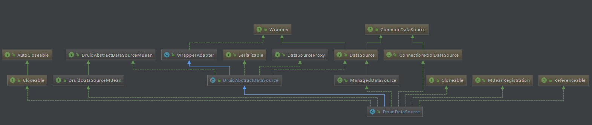
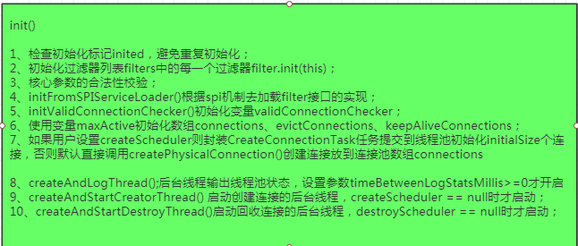
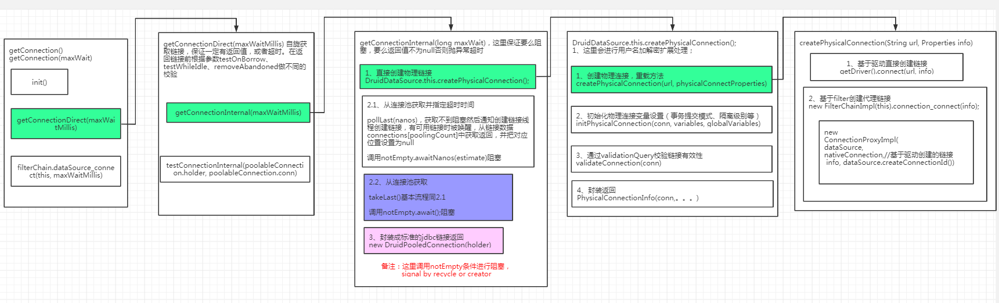
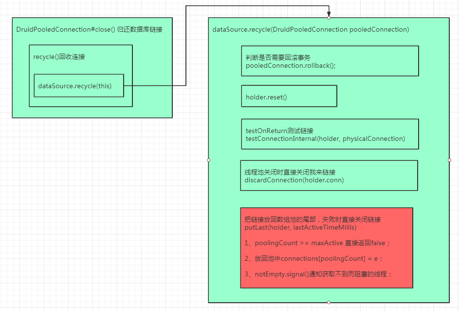
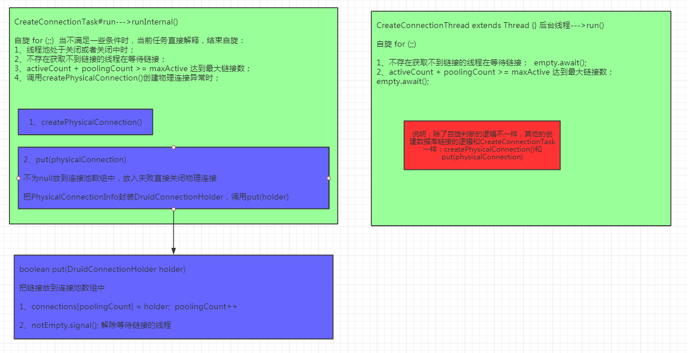
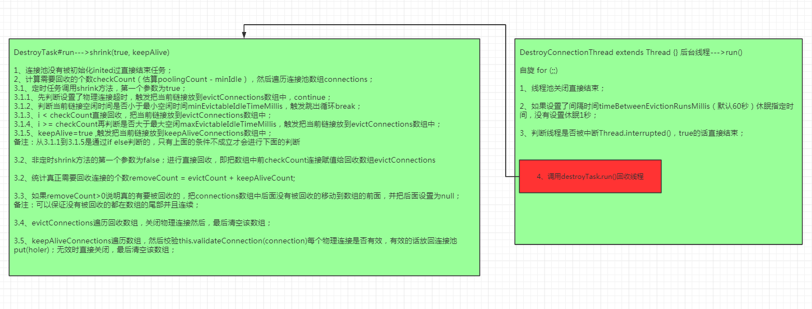
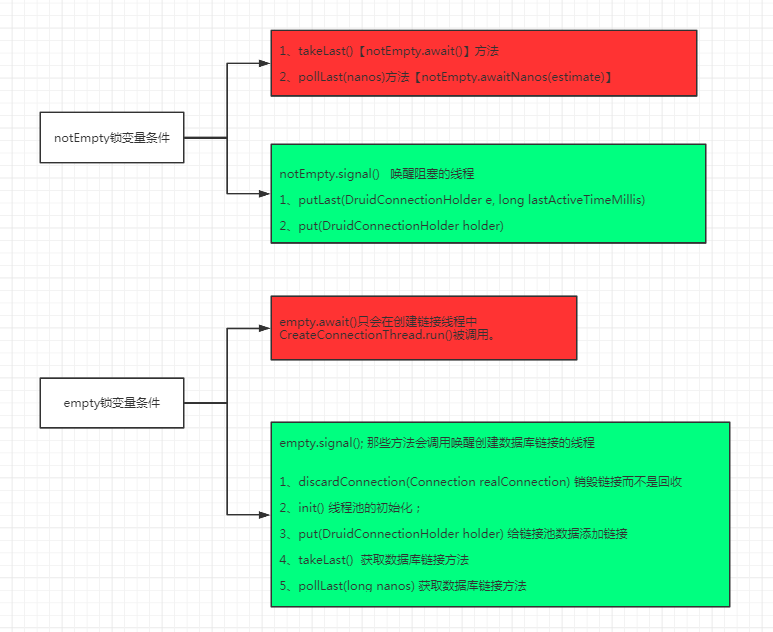

<!-- TOC -->

- [1、DruidDataSource类的全景图](#1druiddatasource类的全景图)
- [2、源码解析](#2源码解析)
    - [1、构造函数](#1构造函数)
    - [2、初始化函数init()](#2初始化函数init)
    - [3、获取数据库连接DruidPooledConnection#getConnection()\getConnection(maxWait)](#3获取数据库连接druidpooledconnectiongetconnection\getconnectionmaxwait)
    - [4、归还数据库连接DruidPooledConnection#close](#4归还数据库连接druidpooledconnectionclose)
    - [5、创建数据库连接后台线程CreateConnectionThread](#5创建数据库连接后台线程createconnectionthread)
    - [6、回收空闲的数据库连接后台线程DestroyConnectionThread](#6回收空闲的数据库连接后台线程destroyconnectionthread)
    - [7、锁条件变量notEmpty和empty](#7锁条件变量notempty和empty)
    - [8、DruidPooledConnection](#8druidpooledconnection)
        - [1、DruidPooledConnection构造函数](#1druidpooledconnection构造函数)
        - [2、DruidConnectionHolder构造函数](#2druidconnectionholder构造函数)
        - [3、PhysicalConnectionInfo构造函数](#3physicalconnectioninfo构造函数)
- [3、常用的属性设置](#3常用的属性设置)

<!-- /TOC -->


总结：整体流程在连接池初始化的时候会创建initialSize个数据库连接（没有开启异步初始化话asyncInit默认false）。初始化完成后，用户通过getConnection()\getConnection(maxWait)获取连接时，会去连接池数组connections中看是否有空闲链接（poolingCount>0），有的话直接获取；没有的话会阻塞，等待后台创建链接的线程CreateConnectionThread创建链接放到连接池数组connections并唤醒正在等待获取链接的线程，或者有其他线程归数据库链接还到链接池并唤醒阻塞线程。`生产者和消费者模式，基于可重入锁，条件变量notEmpty和empty实现阻塞和唤醒线程`

备注：获取链接而获取不到会阻塞在条件变量notEmpty.await()\notEmpty.awaitNanos(estimate)上，而链接的close（开启了keepalive时回收空闲线程）会唤醒当前阻塞，用户线程拿到链接返回。

数据库链接的创建委托给一个专门的后台线程CreateConnectionThread，同样，回收空闲的数据库链接也委托给一个专门的后台线程DestroyConnectionThread。而且支持用户传入调度线程池来运行创建链接和回收连接的任务。

用户通过getConnection()\getConnection(maxWait)获得到的链接其实是真正的物理数据库链接的代理对象DruidPooledConnection（通过静态代理模式实现），


# 1、DruidDataSource类的全景图





# 2、源码解析

DruidDataSource--->DruidAbstractDataSource


## 1、构造函数

```java

 public DruidDataSource(){//构造函数
        this(false);
    }

    public DruidDataSource(boolean fairLock){//构造函数
        super(fairLock);//父类创建一个锁ReentrantLock，并在锁上创建了两个条件变量notEmpty和empty

        configFromPropety(System.getProperties());//取出系统属性设置配置项
    }
```

可以看出这两个构建函数很简单，只是初始化了一个可重入锁以及把系统变量设置到对象中去。


## 2、初始化函数init()

核心处理逻辑




## 3、获取数据库连接DruidPooledConnection#getConnection()\getConnection(maxWait)





## 4、归还数据库连接DruidPooledConnection#close

最后调用putLast(holder, lastActiveTimeMillis)把数据库链接放回到链接池




## 5、创建数据库连接后台线程CreateConnectionThread

备注：用户可以通过dataSource.setCreateScheduler(调度线程池)方法设置参数createScheduler来执行创建连接的CreateConnectionTask，如果用户没有主动设置，这里会启动后台线程CreateConnectionThread来执行创建数据库连接。

`两者只会存在一个，可能用户可以通过自定义定时调度线程池可以提高创建连接池的效率。`





## 6、回收空闲的数据库连接后台线程DestroyConnectionThread


备注：用户可以通过dataSource.setDestroyScheduler(调度线程池)方法设置参数destroyScheduler来执行创建连接的DestroyTask，如果用户没有主动设置，这里会启动后台线程DestroyConnectionThread来执行创建数据库连接。

`两者只会存在一个，可能用户可以通过自定义定时调度线程池可以提高创建连接池的效率。`

这里和创建连接的线程不同的是，无论使用哪种方式，执行的都是一个全局的DestroyTask任务。



备注：`如何开启keepalive会把链接校验后重新放回连接池中put(holer)`


## 7、锁条件变量notEmpty和empty




## 8、DruidPooledConnection

DruidPooledConnection\DruidConnectionHolder\PhysicalConnectionInfo\Connection之间的关系


### 1、DruidPooledConnection构造函数

```java
public DruidPooledConnection(DruidConnectionHolder holder){
        super(holder.getConnection());

        this.conn = holder.getConnection();//物理连接
        this.holder = holder;
        dupCloseLogEnable = holder.getDataSource().isDupCloseLogEnable();
        ownerThread = Thread.currentThread();//设置创建这个对象的线程为所属线程
        connectedTimeMillis = System.currentTimeMillis();//当前对象的创建时间
    }

```


### 2、DruidConnectionHolder构造函数

```java
 public DruidConnectionHolder(DruidAbstractDataSource dataSource, PhysicalConnectionInfo pyConnectInfo)
                                                                                                          throws SQLException{
        this(dataSource,
            pyConnectInfo.getPhysicalConnection(),
            pyConnectInfo.getConnectNanoSpan(),
            pyConnectInfo.getVairiables(),
            pyConnectInfo.getGlobalVairiables());
    }

public DruidConnectionHolder(DruidAbstractDataSource dataSource, Connection conn, long connectNanoSpan,
                                 Map<String, Object> variables, Map<String, Object> globleVariables)
                                                                                                    throws SQLException{
        this.dataSource = dataSource;
        this.conn = conn;//物理连接
        this.createNanoSpan = connectNanoSpan;//创建物理连接耗时
        this.variables = variables;//变量
        this.globleVariables = globleVariables;//全局变量

        this.connectTimeMillis = System.currentTimeMillis();//当前holder的创建时间戳
        this.lastActiveTimeMillis = connectTimeMillis;//更新最后被使用的时间戳

        this.underlyingAutoCommit = conn.getAutoCommit();//物理连接事务的提交模式，即默认的事务提交模式

        if (conn instanceof WrapperProxy) {//链接编号
            this.connectionId = ((WrapperProxy) conn).getId();
        } else {
            this.connectionId = dataSource.createConnectionId();
        }

        {
            boolean initUnderlyHoldability = !holdabilityUnsupported;
            if (JdbcConstants.SYBASE.equals(dataSource.dbType) //
                || JdbcConstants.DB2.equals(dataSource.dbType) //
                || JdbcConstants.HIVE.equals(dataSource.dbType) //
                || JdbcConstants.ODPS.equals(dataSource.dbType) //
            ) {
                initUnderlyHoldability = false;
            }
            if (initUnderlyHoldability) {//MySQL的话这里为true
                try {
                    this.underlyingHoldability = conn.getHoldability();
                } catch (UnsupportedOperationException e) {
                    holdabilityUnsupported = true;
                    LOG.warn("getHoldability unsupported", e);
                } catch (SQLFeatureNotSupportedException e) {
                    holdabilityUnsupported = true;
                    LOG.warn("getHoldability unsupported", e);
                } catch (SQLException e) {
                    // bug fixed for hive jdbc-driver
                    if ("Method not supported".equals(e.getMessage())) {
                        holdabilityUnsupported = true;
                    }
                    LOG.warn("getHoldability error", e);
                }
            }
        }

        this.underlyingReadOnly = conn.isReadOnly();
        try {
            this.underlyingTransactionIsolation = conn.getTransactionIsolation();//默认的事务隔离级别
        } catch (SQLException e) {
            // compartible for alibaba corba
            if ("HY000".equals(e.getSQLState())
                    || "com.mysql.jdbc.exceptions.jdbc4.MySQLSyntaxErrorException".equals(e.getClass().getName())) {
                // skip
            } else {
                throw e;
            }
        }

        this.defaultHoldability = underlyingHoldability;
        this.defaultTransactionIsolation = underlyingTransactionIsolation;
        this.defaultAutoCommit = underlyingAutoCommit;
        this.defaultReadOnly = underlyingReadOnly;
    }
```


### 3、PhysicalConnectionInfo构造函数

```java
 public PhysicalConnectionInfo(Connection connection //
                , long connectStartNanos //
                , long connectedNanos //
                , long initedNanos //
                , long validatedNanos) {
            this(connection, connectStartNanos, connectedNanos, initedNanos,validatedNanos, null, null);
        }

        public PhysicalConnectionInfo(Connection connection // 创建的物理连接
                                      , long connectStartNanos //开始创建时刻
                                      , long connectedNanos //创建完成时刻
                                      , long initedNanos //初始化完成时刻
                                      , long validatedNanos//校验完成时刻
                                      , Map<String, Object> vairiables// 连接执行show vairiables
                                      , Map<String, Object> globalVairiables) {// 连接执行show global vairiables
            this.connection = connection;

            this.connectStartNanos = connectStartNanos;
            this.connectedNanos = connectedNanos;
            this.initedNanos = initedNanos;
            this.validatedNanos = validatedNanos;
            this.vairiables = vairiables;
            this.globalVairiables = globalVairiables;
        }
```


# 3、常用的属性设置

https://github.com/alibaba/druid/wiki/DruidDataSource%E9%85%8D%E7%BD%AE%E5%B1%9E%E6%80%A7%E5%88%97%E8%A1%A8

- initialSize 线程池初始化的时候，会创建initialSize个连接放到连接池中；

- maxActive 线程池中允许的最大链接数，包括正在使用的和空闲的。创建连接池数组的长度就是maxActive；

- minIdle 最小连接池数量

- maxWait 创建链接的最大等待时间，时间到了还没有创建好，抛异常。获取连接时最大等待时间，单位毫秒。配置了maxWait之后，缺省启用公平锁，并发效率会有所下降，如果需要可以通过配置useUnfairLock属性为true使用非公平锁。

- validationQuery 创建完物理连接后会执行该SQL进行测试链接是否可用，需要至少一行返回值。用来检测连接是否有效的sql，要求是一个查询语句，常用select 'x'。如果validationQuery为null，testOnBorrow、testOnReturn、testWhileIdle都不会起作用。

- validationQueryTimeout   单位：秒，检测连接是否有效的超时时间。底层调用jdbc Statement对象的void setQueryTimeout(int seconds)方法

- testOnBorrow	true	申请连接时执行validationQuery检测连接是否有效，做了这个配置会降低性能。`即每次从链接池中拿到链接都会校验一次`

- testOnReturn	false	归还连接时执行validationQuery检测连接是否有效，做了这个配置会降低性能。`即每次归还链接到连接池时都会校验一次`

- testWhileIdle	false	建议配置为true，不影响性能，并且保证安全性。申请连接的时候检测，如果空闲时间大于timeBetweenEvictionRunsMillis，执行validationQuery检测连接是否有效。

- keepAlive	false（1.0.28）	连接池中的minIdle数量以内的连接，空闲时间超过minEvictableIdleTimeMillis，则会执行keepAlive操作。`校验一下链接有效继续放回连接池数组`

- timeBetweenEvictionRunsMillis	1分钟（1.0.14）	有两个含义：1) Destroy线程会检测连接的间隔时间，如果连接空闲时间大于等于minEvictableIdleTimeMillis则关闭物理连接。2) testWhileIdle的判断依据，详细看testWhileIdle属性的说明

- minEvictableIdleTimeMillis		连接保持空闲而不被驱逐的最小时间

- exceptionSorter	根据dbType自动识别	当数据库抛出一些不可恢复的异常时，抛弃连接

- filters		属性类型是字符串，通过别名的方式配置扩展插件，常用的插件有：监控统计用的filter:stat；日志用的filter:log4j；防御sql注入的filter:wall
