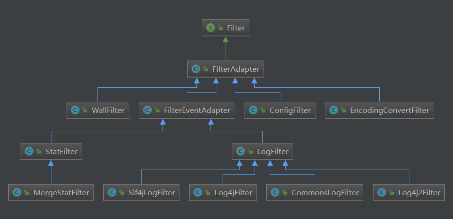

<!-- TOC -->

- [1、Filter接口继承图](#1filter接口继承图)
    - [1、StatFilter](#1statfilter)

<!-- /TOC -->

# 1、Filter接口继承图

## 1、StatFilter

Druid连接池的监控信息主要是通过StatFilter 采集的，采集的信息非常全面，包括SQL执行、并发、慢查、执行时间区间分布等。

https://github.com/alibaba/druid/wiki/%E9%85%8D%E7%BD%AE_StatFilter

