<!-- TOC -->

- [第01讲：Flink 的应用场景和架构模型](#第01讲flink-的应用场景和架构模型)
    - [1、Flink 的分层模型](#1flink-的分层模型)
    - [2、Flink 的数据流模型](#2flink-的数据流模型)
    - [3、Flink 中的窗口和时间](#3flink-中的窗口和时间)
    - [4、其他特性](#4其他特性)
- [第02讲：Flink 入门程序 WordCount 和 SQL 实现](#第02讲flink-入门程序-wordcount-和-sql-实现)
    - [1、DataSet WordCount](#1dataset-wordcount)
    - [2、DataStream WordCount](#2datastream-wordcount)
    - [3、Flink Table & SQL WordCount](#3flink-table--sql-wordcount)
- [第03讲：Flink 的编程模型与其他框架比较](#第03讲flink-的编程模型与其他框架比较)
    - [1、Flink 核心概念](#1flink-核心概念)
    - [2、Flink 编程模型和流式处理](#2flink-编程模型和流式处理)
    - [3、Flink 集群模型和角色](#3flink-集群模型和角色)
    - [4、Flink 资源和资源组](#4flink-资源和资源组)
    - [5、Flink 的优势及与其他框架的区别](#5flink-的优势及与其他框架的区别)
        - [1、架构](#1架构)
        - [2、容错](#2容错)
        - [3、反压（BackPressure）](#3反压backpressure)
- [第04讲：Flink 常用的 DataSet 和 DataStream API](#第04讲flink-常用的-dataset-和-datastream-api)
    - [1、说好的流批一体呢](#1说好的流批一体呢)
    - [2、DateSet 和 DataStream 的区别和联系](#2dateset-和-datastream-的区别和联系)
    - [3、DataStream](#3datastream)
        - [1、Map](#1map)
        - [2、FlatMap](#2flatmap)
        - [3、Filter](#3filter)
        - [4、KeyBy](#4keyby)
        - [5、Aggregations](#5aggregations)
        - [6、Reduce](#6reduce)
- [第05讲：Flink SQL & Table 编程和案例](#第05讲flink-sql--table-编程和案例)
    - [1、原理](#1原理)
    - [2、动态表](#2动态表)
    - [3、Flink Table & SQL 算子和内置函数](#3flink-table--sql-算子和内置函数)
        - [1、常用算子](#1常用算子)
        - [2、SELECT/AS/WHERE](#2selectaswhere)
        - [3、GROUP BY / DISTINCT/HAVING](#3group-by--distincthaving)
        - [4、JOIN](#4join)
        - [5、WINDOW](#5window)
            - [1、滚动窗口](#1滚动窗口)
            - [2、滑动窗口](#2滑动窗口)
            - [3、会话窗口](#3会话窗口)
        - [6、内置函数](#6内置函数)
    - [4、Flink Table & SQL 案例](#4flink-table--sql-案例)
- [第06讲：Flink 集群安装部署和 HA 配置](#第06讲flink-集群安装部署和-ha-配置)
    - [1、Local 模式](#1local-模式)
    - [2、Standalone 模式](#2standalone-模式)
    - [3、On Yarn 模式和 HA 配置](#3on-yarn-模式和-ha-配置)
- [第07讲：Flink 常见核心概念分析](#第07讲flink-常见核心概念分析)
    - [1、分布式缓存](#1分布式缓存)
    - [2、故障恢复和重启策略](#2故障恢复和重启策略)
        - [1、故障恢复](#1故障恢复)
        - [2、重启策略](#2重启策略)
            - [1、无重启策略模式](#1无重启策略模式)
            - [2、固定延迟重启策略模式](#2固定延迟重启策略模式)
            - [3、失败率重启策略模式](#3失败率重启策略模式)
    - [3、并行度](#3并行度)
        - [1、算子级别](#1算子级别)
        - [2、执行环境级别](#2执行环境级别)
        - [3、提交任务级别](#3提交任务级别)
        - [4、系统配置级别](#4系统配置级别)
- [第08讲：Flink 窗口、时间和水印](#第08讲flink-窗口时间和水印)
    - [1、事件时间（Event Time）](#1事件时间event-time)
    - [2、处理时间（Processing Time）](#2处理时间processing-time)
    - [3、摄入时间（Ingestion Time）](#3摄入时间ingestion-time)
    - [4、水印（WaterMark）](#4水印watermark)
        - [1、水印的本质是什么](#1水印的本质是什么)
- [第09讲：Flink 状态与容错](#第09讲flink-状态与容错)
- [第10讲：Flink Side OutPut 分流](#第10讲flink-side-output-分流)
- [第11讲：Flink CEP 复杂事件处理](#第11讲flink-cep-复杂事件处理)
- [第12讲：Flink 常用的 Source 和 Connector](#第12讲flink-常用的-source-和-connector)
- [第13讲：如何实现生产环境中的 Flink 高可用配置](#第13讲如何实现生产环境中的-flink-高可用配置)
- [第14讲：Flink Exactly-once 实现原理解析](#第14讲flink-exactly-once-实现原理解析)
- [第15讲：如何排查生产环境中的反压问题](#第15讲如何排查生产环境中的反压问题)
- [第16讲：如何处理生产环境中的数据倾斜问题](#第16讲如何处理生产环境中的数据倾斜问题)
- [第17讲：生产环境中的并行度和资源设置](#第17讲生产环境中的并行度和资源设置)
- [第18讲：如何进行生产环境作业监控](#第18讲如何进行生产环境作业监控)
- [第19讲：Flink 如何做维表关联](#第19讲flink-如何做维表关联)
- [第20讲：Flink 高级应用之海量数据高效去重](#第20讲flink-高级应用之海量数据高效去重)
- [第21讲：Flink 在实时计算平台和实时数据仓库中的作用](#第21讲flink-在实时计算平台和实时数据仓库中的作用)

<!-- /TOC -->

模块一：基础篇

# 第01讲：Flink 的应用场景和架构模型

擅长：实时计算

Apache Flink 同时支持流式及批量分析应用，这就是我们所说的批流一体。Flink 在上述的需求场景中承担了数据的实时采集、实时计算和下游发送。


Flink 的主要特性包括：`批流一体`、`Exactly-Once`、`强大的状态管理`等。同时，Flink 还支持运行在包括 YARN、 Mesos、Kubernetes 在内的多种资源管理框架上。阿里巴巴已经率先将 Flink 在全集团进行推广使用，事实证明，Flink 已经可以扩展到数千核心，其状态可以达到 TB 级别，且仍能保持高吞吐、低延迟的特性。因此，Flink 已经成为我们在实时计算的领域的第一选择。


## 1、Flink 的分层模型

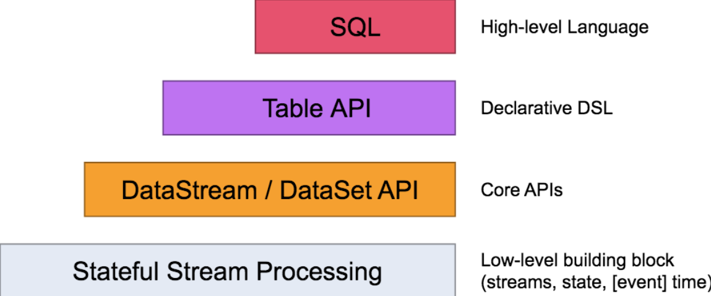

Flink 自身提供了不同级别的抽象来支持我们开发流式或者批量处理程序，上图描述了 Flink 支持的 4 种不同级别的抽象。

对于我们开发者来说，大多数应用程序不需要上图中的最低级别的 Low-level 抽象，而是针对 Core API 编程， 比如 DataStream API（有界/无界流）和 DataSet API （有界数据集）。这些流畅的 API 提供了用于数据处理的通用构建块，比如各种形式用户指定的转换、连接、聚合、窗口、状态等。

Table API 和 SQL 是 Flink 提供的更为高级的 API 操作，Flink SQL 是 Flink 实时计算为简化计算模型，降低用户使用实时计算门槛而设计的一套符合标准 SQL 语义的开发语言。


## 2、Flink 的数据流模型

Flink 程序的基础构建模块是流（Streams）与转换（Transformations），每一个数据流起始于一个或多个 Source，并终止于一个或多个 Sink。数据流类似于有向无环图（DAG）。


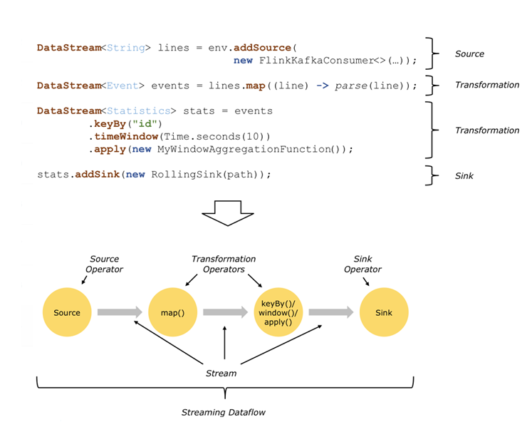


在上图中，程序消费 Kafka 数据，这便是我们的 Source 部分。然后经过 Map、Keyby、TimeWindow 等方法进行逻辑计算，该部分就是我们的 Transformation 转换部分，而其中的 Map、Keyby、TimeWindow 等方法被称为算子。通常，程序中的转换与数据流中的算子之间存在对应关系，有时一个转换可能包含多个转换算子。最后，经过计算的数据会被写入到我们执行的文件中，这便是我们的 Sink 部分。


实际上面对复杂的生产环境，Flink 任务大都是并行进行和分布在各个计算节点上。在 Flink 任务执行期间，每一个数据流都会有多个`分区`，并且每个算子都有多个`算子任务`并行进行。算子子任务的数量是该特定算子的`并行度（Parallelism）`，对并行度的设置是 Flink 任务进行调优的重要手段

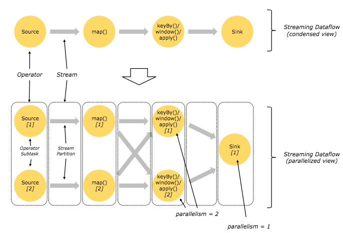

从上图中可以看到，在上面的 map 和 keyBy/window 之间，以及 keyBy/window 和 Sink 之间，因为并行度的差异，数据流都进行了重新分配。


## 3、Flink 中的窗口和时间

窗口和时间是 Flink 中的核心概念之一。在实际成产环境中，对数据流上的聚合需要由窗口来划定范围，比如“计算过去的 5 分钟”或者“最后 100 个元素的和”。


Flink 支持了多种窗口模型比如滚动窗口（Tumbling Window）、滑动窗口（Sliding Window）及会话窗口（Session Window）等。


下图展示了 Flink 支持的多种窗口模型：

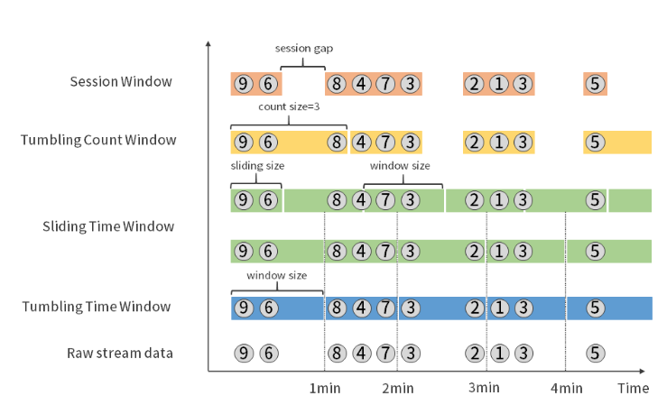


同时，Flink 支持了事件时间（Event Time）、摄取时间（Ingestion Time）和处理时间（Processing Time）三种时间语义用来满足实际生产中对于时间的特殊需求。


## 4、其他特性

Flink 自身还支持了有状态的算子操作、容错机制、Checkpoint、Exactly-once 语义等更多高级特性，来支持用户在不同的业务场景中的需求。


# 第02讲：Flink 入门程序 WordCount 和 SQL 实现

WordCount 程序是大数据处理框架的入门程序，俗称“单词计数”。用来统计一段文字每个单词的出现次数，该程序主要分为两个部分：一部分是将文字拆分成单词；另一部分是单词进行分组计数并打印输出结果。

`Flink 一个以 Java 及 Scala 作为开发语言的开源大数据项目，通常我们推荐使用 Java 来作为开发语言`

## 1、DataSet WordCount

```java
public class DataSetWordCount {

     public static void main(String[] args) throws Exception {

         // 创建Flink运行的上下文环境
         final ExecutionEnvironment env = ExecutionEnvironment.getExecutionEnvironment();

         // 创建DataSet，这里我们的输入是一行一行的文本
         DataSet<String> text = env.fromElements(
                          "Flink Spark Storm",
                          "Flink Flink Flink",
                          "Spark Spark Spark",
                          "Storm Storm Storm"
                         );
         // 通过Flink内置的转换函数进行计算
         DataSet<Tuple2<String, Integer>> counts =
          text.flatMap(new LineSplitter())
           .groupBy(0)
           .sum(1);
         //结果打印
         counts.printToErr();

     }

}

class LineSplitter implements FlatMapFunction<String, Tuple2<String, Integer>> {

         @Override
         public void flatMap(String value, Collector<Tuple2<String, Integer>> out) {
            // 将文本分割
            String[] tokens = value.toLowerCase().split("\\W+");

            for (String token : tokens) {
              if (token.length() > 0) {
                 out.collect(new Tuple2<String, Integer>(token, 1));
              }
            }
         }
}
```


## 2、DataStream WordCount

为了模仿一个流式计算环境，我们选择监听一个本地的 Socket 端口，并且使用 Flink 中的滚动窗口，每 5 秒打印一次计算结果。代码如下：


```java
public class StreamingJob {

    public static void main(String[] args) throws Exception {

        // get the execution environment 创建Flink的流式计算环境
        final StreamExecutionEnvironment env = StreamExecutionEnvironment.getExecutionEnvironment();

        // get input data by connecting to the socket 监听本地9000端口
        DataStream<String> text = env.socketTextStream("127.0.0.1", 9000, "\n");

        // parse the data, group it, window it, and aggregate the counts将接收的数据进行拆分，分组，窗口计算并且进行聚合输出
        DataStream<WordWithCount> windowCounts = text
                .flatMap(new FlatMapFunction<String, WordWithCount>() {
                    @Override
                    public void flatMap(String value, Collector<WordWithCount> out) {
                        for (String word : value.split("\\s")) {
                            out.collect(new WordWithCount(word, 1L));
                        }
                    }
                })
                .keyBy("word")
                .timeWindow(Time.seconds(5), Time.seconds(1))
                .reduce(new ReduceFunction<WordWithCount>() {
                    @Override
                    public WordWithCount reduce(WordWithCount a, WordWithCount b) {
                        return new WordWithCount(a.word, a.count + b.count);
                    }
                });

        // print the results with a single thread, rather than in parallel 打印结果
        windowCounts.print().setParallelism(1);

        env.execute("Socket Window WordCount");
    }

    // Data type for words with count
    public static class WordWithCount {

        public String word;
        public long count;

        public WordWithCount() {}

        public WordWithCount(String word, long count) {
            this.word = word;
            this.count = count;
        }

        @Override
        public String toString() {
            return word + " : " + count;
        }
    }
}

```

输出：

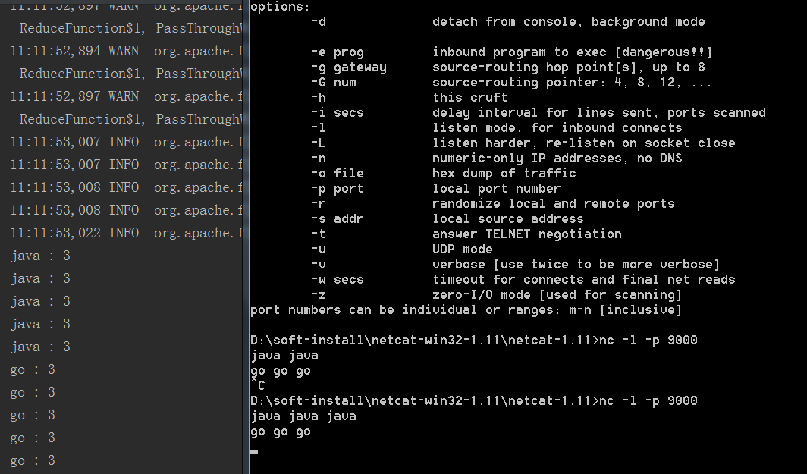


## 3、Flink Table & SQL WordCount


Flink SQL 是 Flink 实时计算为简化计算模型，降低用户使用实时计算门槛而设计的一套符合标准 SQL 语义的开发语言。

一个完整的 Flink SQL 编写的程序包括如下三部分。

- 1、Source Operator：是对外部数据源的抽象, 目前 Apache Flink 内置了很多常用的数据源实现，比如 MySQL、Kafka 等。

- 2、Transformation Operators：算子操作主要完成比如查询、聚合操作等，目前 Flink SQL 支持了 Union、Join、Projection、Difference、Intersection 及 window 等大多数传统数据库支持的操作。

- 3、Sink Operator：是对外结果表的抽象，目前 Apache Flink 也内置了很多常用的结果表的抽象，比如 Kafka Sink 等。


通过用一个最经典的 WordCount 程序作为入门，上面已经通过 DataSet/DataStream API 开发，那么实现同样的 WordCount 功能， Flink Table & SQL 核心只需要一行代码：`SELECT word, COUNT(word) FROM table GROUP BY word;`


```java
public class WordCountSQL {

    public static void main(String[] args) throws Exception{

        //获取运行环境
        ExecutionEnvironment fbEnv = ExecutionEnvironment.getExecutionEnvironment();
        //创建一个tableEnvironment
        BatchTableEnvironment fbTableEnv = BatchTableEnvironment.create(fbEnv);

        String words = "hello flink hello lagou";

        String[] split = words.split("\\W+");
        ArrayList<WC> list = new ArrayList<>();

        for(String word : split){

            WC wc = new WC(word,1);
            list.add(wc);
        }

        DataSet<WC> input = fbEnv.fromCollection(list);

        //DataSet 转sql, 指定字段名
        Table table = fbTableEnv.fromDataSet(input, "word,frequency");
        table.printSchema();

        //注册为一个表
        fbTableEnv.createTemporaryView("WordCount", table);

        Table table02 = fbTableEnv.sqlQuery("select word as word, sum(frequency) as frequency from WordCount GROUP BY word");

        //将表转换DataSet
        DataSet<WC> ds3  = fbTableEnv.toDataSet(table02, WC.class);
        ds3.printToErr();
    }

    public static class WC {
        public String word;
        public long frequency;

        public WC() {}

        public WC(String word, long frequency) {
            this.word = word;
            this.frequency = frequency;
        }

        @Override
        public String toString() {
            return  word + ", " + frequency;
        }
    }

}

```


# 第03讲：Flink 的编程模型与其他框架比较

`和 Spark、Storm 进行比较，Flink 作为最新的分布式大数据处理引擎具有哪些独特的优势呢？`


## 1、Flink 核心概念

- Streams（流），流分为有界流和无界流。有界流指的是有固定大小，不随时间增加而增长的数据，比如我们保存在 Hive 中的一个表；而无界流指的是数据随着时间增加而增长，计算状态持续进行，比如我们消费 Kafka 中的消息，消息持续不断，那么计算也会持续进行不会结束。

- State（状态），所谓的状态指的是在进行流式计算过程中的信息。一般用作容错恢复和持久化，流式计算在本质上是增量计算，也就是说需要不断地查询过去的状态。状态在 Flink 中有十分重要的作用，例如为了确保 Exactly-once 语义需要将数据写到状态中；此外，状态的持久化存储也是集群出现 Fail-over 的情况下自动重启的前提条件。

- Time（时间），Flink 支持了 Event time、Ingestion time、Processing time 等多种时间语义，时间是我们在进行 Flink 程序开发时判断业务状态是否滞后和延迟的重要依据。

- API：Flink 自身提供了不同级别的抽象来支持我们开发流式或者批量处理程序，由上而下可分为 SQL / Table API、DataStream API、ProcessFunction 三层，开发者可以根据需要选择不同层级的 API 进行开发。


## 2、Flink 编程模型和流式处理


在分布式运行环境中，Flink 提出了算子链的概念，Flink 将多个算子放在一个任务中，由同一个线程执行，减少线程之间的切换、消息的序列化/反序列化、数据在缓冲区的交换，减少延迟的同时提高整体的吞吐量。

官网中给出的例子如下，在并行环境下，Flink 将多个 operator 的子任务链接在一起形成了一个task，每个 task 都有一个独立的线程执行。

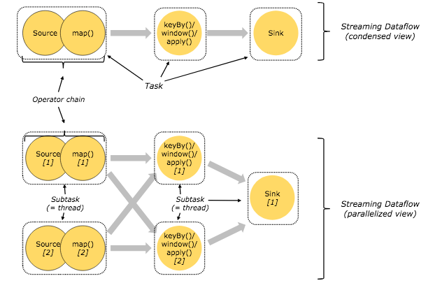


## 3、Flink 集群模型和角色

在实际生产中，Flink 都是以集群在运行，在运行的过程中包含了两类进程。

- JobManager：它扮演的是集群管理者的角色，负责调度任务、协调 checkpoints、协调故障恢复、收集 Job 的状态信息，并管理 Flink 集群中的从节点 TaskManager。

- TaskManager：实际负责执行计算的 Worker，在其上执行 Flink Job 的一组 Task；TaskManager 还是所在节点的管理员，它负责把该节点上的服务器信息比如内存、磁盘、任务运行情况等向 JobManager 汇报。

- Client：用户在提交编写好的 Flink 工程时，会先创建一个客户端再进行提交，这个客户端就是 Client，Client 会根据用户传入的参数选择使用 yarn per job 模式、stand-alone 模式还是 yarn-session 模式将 Flink 程序提交到集群。

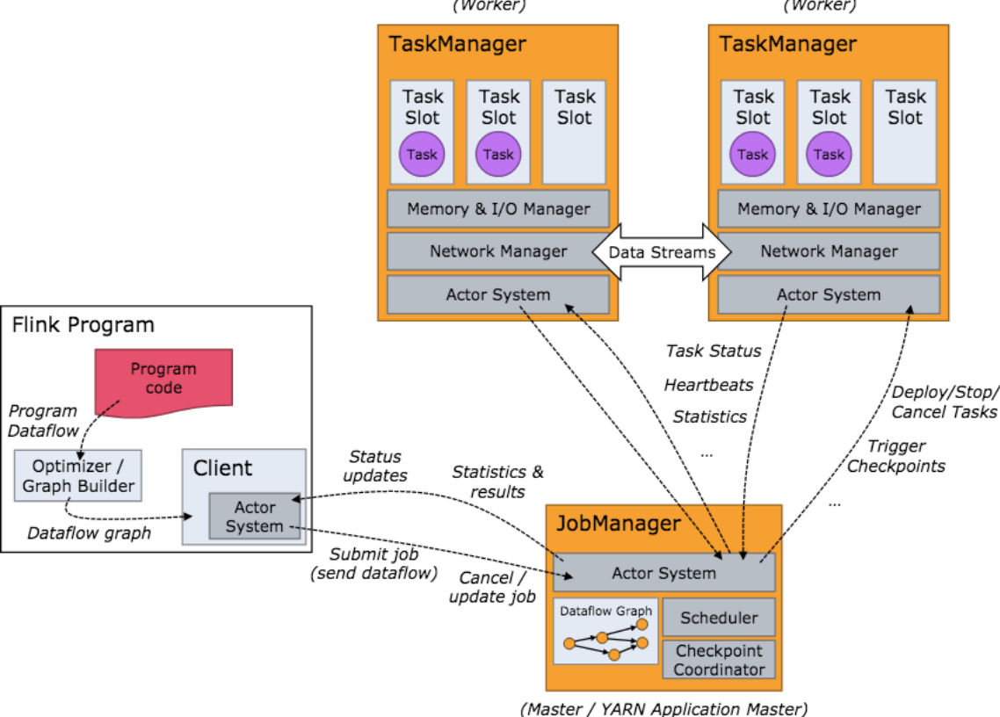


## 4、Flink 资源和资源组

在 Flink 集群中，一个 TaskManger 就是一个 JVM 进程，并且会用独立的线程来执行 task，为了控制一个 TaskManger 能接受多少个 task，Flink 提出了 Task Slot 的概念。

我们可以简单的把 Task Slot 理解为 TaskManager 的计算资源子集。假如一个 TaskManager 拥有 5 个 slot，那么该 TaskManager 的计算资源会被平均分为 5 份，不同的 task 在不同的 slot 中执行，避免资源竞争。但是需要注意的是，slot 仅仅用来做内存的隔离，对 CPU 不起作用。那么运行在同一个 JVM 的 task 可以共享 TCP 连接，减少网络传输，在一定程度上提高了程序的运行效率，降低了资源消耗。

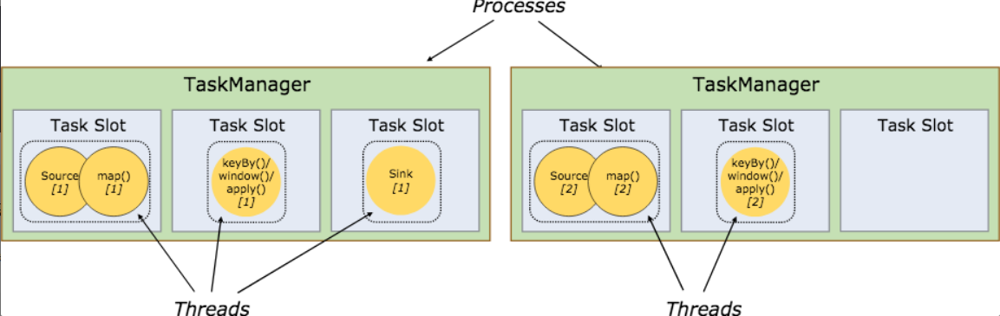


与此同时，Flink 还允许将不能形成算子链的两个操作，比如下图中的 flatmap 和 key&sink 放在一个 TaskSlot 里执行以达到资源共享的目的。

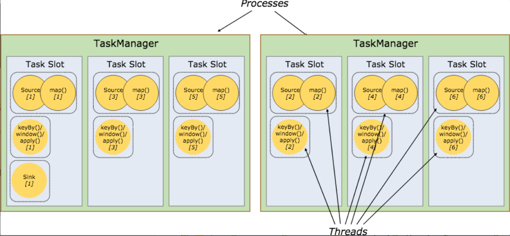


## 5、Flink 的优势及与其他框架的区别

Flink 在诞生之初，就以它独有的特点迅速风靡整个实时计算领域。在此之前，实时计算领域还有 Spark Streaming 和 Storm等框架，那么为什么 Flink 能够脱颖而出？我们将分别在架构、容错、语义处理等方面进行比较。

### 1、架构

Stom 的架构是经典的主从模式，并且强依赖 ZooKeeper；Spark Streaming 的架构是基于 Spark 的，它的本质是微批处理，每个 batch 都依赖 Driver，我们可以把 Spark Streaming 理解为时间维度上的 Spark DAG。

Flink 也采用了经典的主从模式，DataFlow Graph 与 Storm 形成的拓扑 Topology 结构类似，Flink 程序启动后，会根据用户的代码处理成 Stream Graph，然后优化成为 JobGraph，JobManager 会根据 JobGraph 生成 ExecutionGraph。`ExecutionGraph 才是 Flink 真正能执行的数据结构`，当很多个 ExecutionGraph 分布在集群中，就会形成一张网状的拓扑结构。

### 2、容错

Storm 在容错方面只支持了 Record 级别的 ACK-FAIL，发送出去的每一条消息，都可以确定是被成功处理或失败处理，因此 Storm 支持至少处理一次语义。

针对以前的 Spark Streaming 任务，我们可以配置对应的 checkpoint，也就是保存点。当任务出现 failover 的时候，会从 checkpoint 重新加载，使得数据不丢失。但是这个过程会导致原来的数据重复处理，不能做到“只处理一次”语义。

Flink 基于两阶段提交实现了精确的一次处理语义。

### 3、反压（BackPressure）

反压是分布式处理系统中经常遇到的问题，当消费者速度低于生产者的速度时，则需要消费者将信息反馈给生产者使得生产者的速度能和消费者的速度进行匹配。

Stom 在处理背压问题上简单粗暴，当下游消费者速度跟不上生产者的速度时会直接通知生产者，生产者停止生产数据，这种方式的缺点是不能实现逐级反压，且调优困难。设置的消费速率过小会导致集群吞吐量低下，速率过大会导致消费者 OOM。

Spark Streaming 为了实现反压这个功能，在原来的架构基础上构造了一个“速率控制器”，这个“速率控制器”会根据几个属性，如任务的结束时间、处理时长、处理消息的条数等计算一个速率。在实现控制数据的接收速率中用到了一个经典的算法，即“PID 算法”。

Flink 没有使用任何复杂的机制来解决反压问题，Flink 在数据传输过程中使用了分布式阻塞队列。我们知道在一个阻塞队列中，当队列满了以后发送者会被天然阻塞住，这种阻塞功能相当于给这个阻塞队列提供了反压的能力。


# 第04讲：Flink 常用的 DataSet 和 DataStream API

## 1、说好的流批一体呢

> 现状

在前面曾经提到过，Flink 很重要的一个特点是“流批一体”，然而事实上 Flink 并没有完全做到所谓的“流批一体”，即编写一套代码，可以同时支持流式计算场景和批量计算的场景。目前截止 1.10 版本依然采用了 DataSet 和 DataStream 两套 API 来适配不同的应用场景。

## 2、DateSet 和 DataStream 的区别和联系

Apache Flink 在诞生之初的设计哲学是：用同一个引擎支持多种形式的计算，包括批处理、流处理和机器学习等。尤其是在流式计算方面，`Flink 实现了计算引擎级别的流批一体`。那么对于普通开发者而言，如果使用原生的 Flink ，直接的感受还是要编写两套代码。

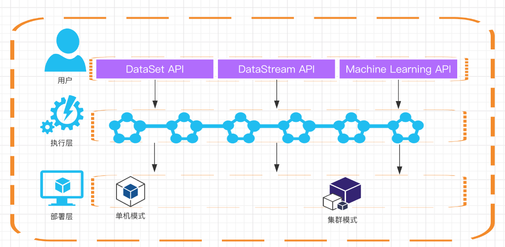

在 Flink 的源代码中，我们可以在 flink-java 这个模块中找到所有关于 DataSet 的核心类，DataStream 的核心实现类则在 flink-streaming-java 这个模块。


对比DataSet 和 DataStream 这两个类，可以发现，二者支持的 API 都非常丰富且十分类似，比如常用的 map、filter、join 等常见的 transformation 函数。


Flink 的编程模型，对于 DataSet 而言，Source 部分来源于文件、表或者 Java 集合；而 DataStream 的 Source 部分则一般是消息中间件比如 Kafka 等。

由于 Flink DataSet 和 DataStream API 的高度相似，并且 Flink 在实时计算领域中应用的更为广泛。所以下面我们详细讲解 DataStream API 的使用。

## 3、DataStream


回顾一下 Flink 的编程模型，Flink 程序的基础构建模块是流（Streams）和转换（Transformations），每一个数据流起始于一个或多个 Source，并终止于一个或多个 Sink。数据流类似于有向无环图（DAG）。


### 1、Map


Map 接受一个元素作为输入，并且根据开发者自定义的逻辑处理后输出。

Map 算子是最常用的算子之一，官网中的表述是对一个 DataStream 进行映射，每次进行转换都会调用 MapFunction 函数。从源 DataStream 到目标 DataStream 的转换过程中，返回的是 SingleOutputStreamOperator。还可以自定义自己的 Map 函数。通过重写 MapFunction 或 RichMapFunction 来自定义自己的 map 函数。

此外，在 RichMapFunction 中还提供了 open、close 等函数方法，重写这些方法还能实现更为复杂的功能，比如获取累加器、计数器等。


### 2、FlatMap


FlatMap 接受一个元素，返回零到多个元素。FlatMap 和 Map 有些类似，但是当返回值是列表的时候，FlatMap 会将列表“平铺”，也就是以单个元素的形式进行输出。


### 3、Filter

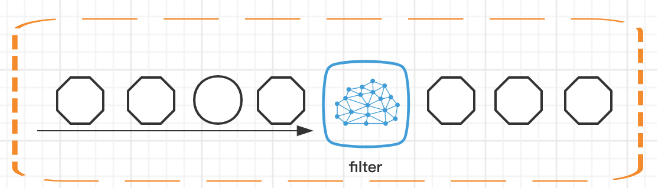

Fliter 的意思就是过滤掉不需要的数据，每个元素都会被 filter 函数处理，如果 filter 函数返回 true 则保留，否则丢弃。


### 4、KeyBy

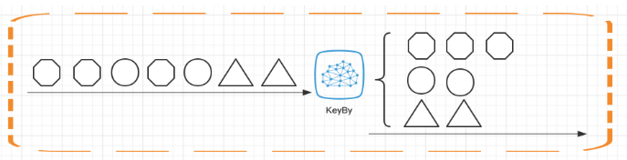

在介绍 KeyBy 函数之前，需要你理解一个概念：KeyedStream。 在实际业务中，我们经常会需要根据数据的某种属性或者单纯某个字段进行分组，然后对不同的组进行不同的处理。比如，我们在监控双十一的交易大盘时，则需要按照商品的品类进行分组，分别计算销售额。

在生产环境中使用 KeyBy 函数时要十分注意！该函数会把数据按照用户指定的 key 进行分组，那么相同分组的数据会被分发到一个 subtask 上进行处理，在大数据量和 key 分布不均匀的时非常容易出现数据倾斜和反压，导致任务失败。

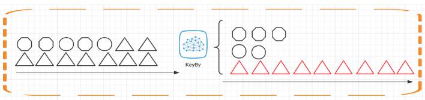

常见的解决方式是把`所有数据加上随机前后缀`


### 5、Aggregations

Aggregations 为聚合函数的总称，常见的聚合函数包括但不限于 sum、max、min 等。Aggregations 也需要指定一个 key 进行聚合，官网给出了几个常见的例子：

```
keyedStream.sum(0);
keyedStream.sum("key");
keyedStream.min(0);
keyedStream.min("key");
keyedStream.max(0);
keyedStream.max("key");
keyedStream.minBy(0);
keyedStream.minBy("key");
keyedStream.maxBy(0);
keyedStream.maxBy("key");

```
在上面的这几个函数中，max、min、sum 会分别返回最大值、最小值和汇总值；而 minBy 和 maxBy 则会把最小或者最大的元素全部返回。

我们拿 max 和 maxBy 举例说明：

### 6、Reduce

Reduce 函数的原理是，会在每一个分组的 keyedStream 上生效，它会按照用户自定义的聚合逻辑进行分组聚合。

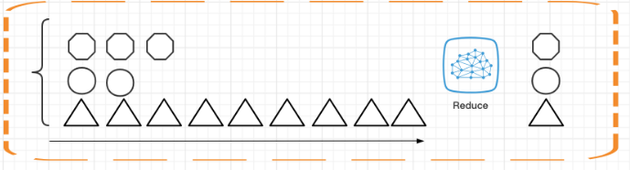


# 第05讲：Flink SQL & Table 编程和案例

Table API 和 SQL 处于最顶端，是 Flink 提供的高级 API 操作。Flink SQL 是 Flink 实时计算为简化计算模型，降低用户使用实时计算门槛而设计的一套符合标准 SQL 语义的开发语言。

我们在第 04 课时中提到过，Flink 在编程模型上提供了 DataStream 和 DataSet 两套 API，并没有做到事实上的批流统一，因为用户和开发者还是开发了两套代码。正是因为 Flink Table & SQL 的加入，可以说 Flink 在某种程度上做到了事实上的批流一体。


## 1、原理

你之前可能都了解过 Hive，在离线计算场景下 Hive 几乎扛起了离线数据处理的半壁江山。它的底层对 SQL 的解析用到了 Apache Calcite，Flink 同样把 SQL 的解析、优化和执行教给了 Calcite。

下图是一张经典的 Flink Table & SQL 实现原理图，可以看到 Calcite 在整个架构中处于绝对核心地位。

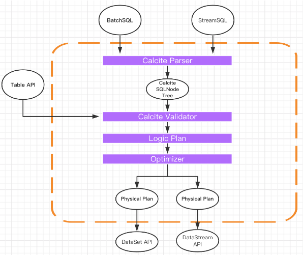

从图中可以看到无论是批查询 SQL 还是流式查询 SQL，都会经过对应的转换器 Parser 转换成为节点树 SQLNode tree，然后生成逻辑执行计划 Logical Plan，逻辑执行计划在经过优化后生成真正可以执行的物理执行计划，交给 DataSet 或者 DataStream 的 API 去执行。

一个完整的 Flink Table & SQL Job 也是由 Source、Transformation、Sink 构成：

- Source 部分来源于外部数据源，我们经常用的有 Kafka、MySQL 等；

- Transformation 部分则是 Flink Table & SQL 支持的常用 SQL 算子，比如简单的 Select、Groupby 等，当然在这里也有更为复杂的多流 Join、流与维表的 Join 等；

- Sink 部分是指的结果存储比如 MySQL、HBase 或 Kakfa 等。


## 2、动态表

与传统的表 SQL 查询相比，Flink Table & SQL 在处理流数据时会时时刻刻处于动态的数据变化中，所以便有了一个动态表的概念。

动态表的查询与静态表一样，但是，在查询动态表的时候，SQL 会做连续查询，不会终止。

我们举个简单的例子，Flink 程序接受一个 Kafka 流作为输入，Kafka 中为用户的购买记录：

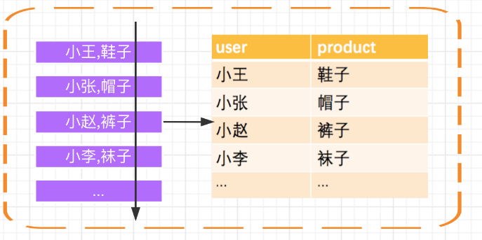

首先，Kafka 的消息会被源源不断的解析成一张不断增长的动态表，我们在动态表上执行的 SQL 会不断生成新的动态表作为结果表。


## 3、Flink Table & SQL 算子和内置函数

Flink 自从 0.9 版本开始支持 Table & SQL 功能一直处于完善开发中，且在不断进行迭代。在使用原生的 Flink Table & SQL 时，务必查询官网当前版本对 Table & SQL 的支持程度，尽量选择场景明确，逻辑不是极其复杂的场景。

### 1、常用算子

目前 Flink SQL 支持的语法主要如下：

```sql
query:
  values
  | {
      select
      | selectWithoutFrom
      | query UNION [ ALL ] query
      | query EXCEPT query
      | query INTERSECT query
    }
    [ ORDER BY orderItem [, orderItem ]* ]
    [ LIMIT { count | ALL } ]
    [ OFFSET start { ROW | ROWS } ]
    [ FETCH { FIRST | NEXT } [ count ] { ROW | ROWS } ONLY]

orderItem:
  expression [ ASC | DESC ]

select:
  SELECT [ ALL | DISTINCT ]
  { * | projectItem [, projectItem ]* }
  FROM tableExpression
  [ WHERE booleanExpression ]
  [ GROUP BY { groupItem [, groupItem ]* } ]
  [ HAVING booleanExpression ]
  [ WINDOW windowName AS windowSpec [, windowName AS windowSpec ]* ]

selectWithoutFrom:
  SELECT [ ALL | DISTINCT ]
  { * | projectItem [, projectItem ]* }

projectItem:
  expression [ [ AS ] columnAlias ]
  | tableAlias . *

tableExpression:
  tableReference [, tableReference ]*
  | tableExpression [ NATURAL ] [ LEFT | RIGHT | FULL ] JOIN tableExpression [ joinCondition ]

joinCondition:
  ON booleanExpression
  | USING '(' column [, column ]* ')'

tableReference:
  tablePrimary
  [ matchRecognize ]
  [ [ AS ] alias [ '(' columnAlias [, columnAlias ]* ')' ] ]

tablePrimary:
  [ TABLE ] [ [ catalogName . ] schemaName . ] tableName
  | LATERAL TABLE '(' functionName '(' expression [, expression ]* ')' ')'
  | UNNEST '(' expression ')'

values:
  VALUES expression [, expression ]*

groupItem:
  expression
  | '(' ')'
  | '(' expression [, expression ]* ')'
  | CUBE '(' expression [, expression ]* ')'
  | ROLLUP '(' expression [, expression ]* ')'
  | GROUPING SETS '(' groupItem [, groupItem ]* ')'

windowRef:
    windowName
  | windowSpec

windowSpec:
    [ windowName ]
    '('
    [ ORDER BY orderItem [, orderItem ]* ]
    [ PARTITION BY expression [, expression ]* ]
    [
        RANGE numericOrIntervalExpression {PRECEDING}
      | ROWS numericExpression {PRECEDING}
    ]
    ')'
...

```

可以看到 Flink SQL 和传统的 SQL 一样，支持了包含查询、连接、聚合等场景，另外还支持了包括窗口、排序等场景。


### 2、SELECT/AS/WHERE

SELECT、WHERE 和传统 SQL 用法一样，用于筛选和过滤数据，同时适用于 DataStream 和 DataSet。

当然我们也可以在 WHERE 条件中使用 =、<、>、<>、>=、<=，以及 AND、OR 等表达式的组合：

```sql
SELECT * FROM Table;
SELECT name，age FROM Table;

SELECT name，age FROM Table where name LIKE '%小明%';
SELECT * FROM Table WHERE age = 20;
SELECT name, age FROM Table WHERE name IN (SELECT name FROM Table2)
```


### 3、GROUP BY / DISTINCT/HAVING

GROUP BY 用于进行分组操作，DISTINCT 用于结果去重。

HAVING 和传统 SQL 一样，可以用来在聚合函数之后进行筛选。

```sql
SELECT DISTINCT name FROM Table;
SELECT name, SUM(score) as TotalScore FROM Table GROUP BY name;
SELECT name, SUM(score) as TotalScore FROM Table GROUP BY name HAVING SUM(score) > 300;
```

### 4、JOIN

JOIN 可以用于把来自两个表的数据联合起来形成结果表，目前 Flink 的 Join 只支持等值连接。Flink 支持的 JOIN 类型包括：

```sql
JOIN - INNER JOIN
LEFT JOIN - LEFT OUTER JOIN
RIGHT JOIN - RIGHT OUTER JOIN
FULL JOIN - FULL OUTER JOIN
```

例如，用用户表和商品表进行关联：

```sql
SELECT * FROM User LEFT JOIN Product ON User.name = Product.buyer

SELECT * FROM User RIGHT JOIN Product ON User.name = Product.buyer

SELECT * FROM User FULL OUTER JOIN Product ON User.name = Product.buyer

```

LEFT JOIN、RIGHT JOIN 、FULL JOIN 相与我们传统 SQL 中含义一样。

### 5、WINDOW

根据窗口数据划分的不同，目前 Apache Flink 有如下 3 种：

- 滚动窗口，窗口数据有固定的大小，窗口中的数据不会叠加；

- 滑动窗口，窗口数据有固定大小，并且有生成间隔；

- 会话窗口，窗口数据没有固定的大小，根据用户传入的参数进行划分，窗口数据无叠加；


#### 1、滚动窗口

滚动窗口的特点是：有固定大小、窗口中的数据不会重叠

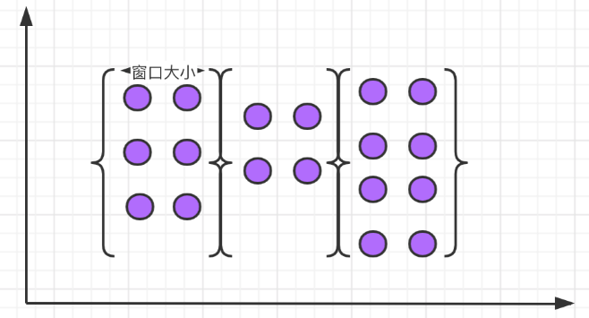


语法：
```sql

SELECT 
    [gk],
    [TUMBLE_START(timeCol, size)], 
    [TUMBLE_END(timeCol, size)], 
    agg1(col1), 
    ... 
    aggn(colN)
FROM Tab1
GROUP BY [gk], TUMBLE(timeCol, size)

```

举例说明，我们需要计算每个用户每天的订单数量：

SELECT user, TUMBLE_START(timeLine, INTERVAL '1' DAY) as winStart, SUM(amount) FROM Orders GROUP BY TUMBLE(timeLine, INTERVAL '1' DAY), user;


其中，TUMBLE_START 和 TUMBLE_END 代表窗口的开始时间和窗口的结束时间，TUMBLE (timeLine, INTERVAL '1' DAY) 中的 timeLine 代表时间字段所在的列，INTERVAL '1' DAY 表示时间间隔为一天。


#### 2、滑动窗口

滑动窗口有固定的大小，与滚动窗口不同的是滑动窗口可以通过 slide 参数控制滑动窗口的创建频率。需要注意的是，多个滑动窗口可能会发生数据重叠，具体语义如下：

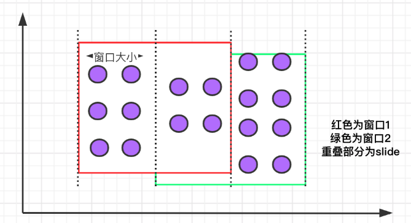

滑动窗口的语法与滚动窗口相比，只多了一个 slide 参数：

```sql
SELECT 
    [gk], 
    [HOP_START(timeCol, slide, size)] ,
    [HOP_END(timeCol, slide, size)],
    agg1(col1), 
    ... 
    aggN(colN) 
FROM Tab1
GROUP BY [gk], HOP(timeCol, slide, size)

```

例如，我们要每间隔一小时计算一次过去 24 小时内每个商品的销量：

SELECT product, SUM(amount) FROM Orders GROUP BY HOP(rowtime, INTERVAL '1' HOUR, INTERVAL '1' DAY), product

上述案例中的 INTERVAL '1' HOUR 代表滑动窗口生成的时间间隔。


#### 3、会话窗口

会话窗口定义了一个非活动时间，假如在指定的时间间隔内没有出现事件或消息，则会话窗口关闭。

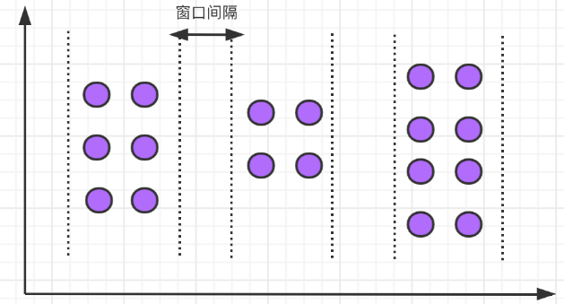


```sql
SELECT 
    [gk], 
    SESSION_START(timeCol, gap) AS winStart,
    SESSION_END(timeCol, gap) AS winEnd,
    agg1(col1),
     ... 
    aggn(colN)
FROM Tab1
GROUP BY [gk], SESSION(timeCol, gap)
```

举例，我们需要计算每个用户过去 1 小时内的订单量：

SELECT user, SESSION_START(rowtime, INTERVAL '1' HOUR) AS sStart, SESSION_ROWTIME(rowtime, INTERVAL '1' HOUR) AS sEnd, SUM(amount) FROM Orders GROUP BY SESSION(rowtime, INTERVAL '1' HOUR), user


### 6、内置函数

Flink 中还有大量的内置函数，我们可以直接使用，将内置函数分类如下：

- 比较函数
- 逻辑函数
- 算术函数
- 字符串处理函数
- 时间函数


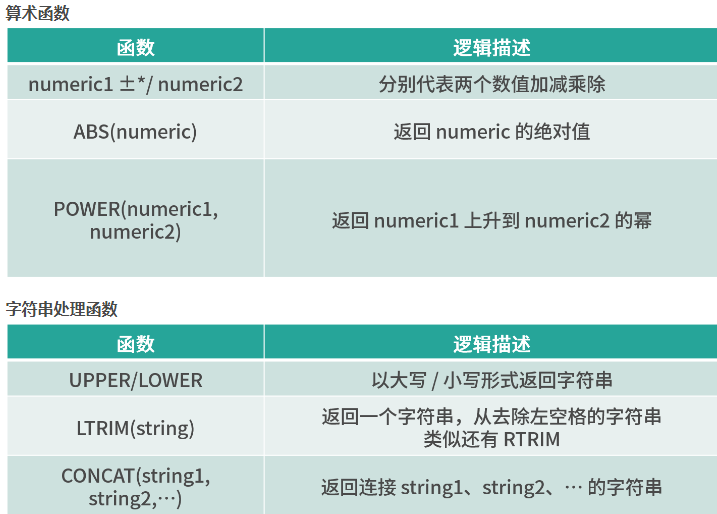

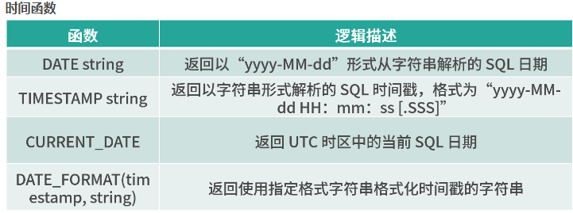


## 4、Flink Table & SQL 案例


# 第06讲：Flink 集群安装部署和 HA 配置

## 1、Local 模式

Local 模式是 Flink 提供的最简单部署模式，一般用来本地测试和演示使用。

将压缩包下载到本地，并且直接进行解压，使用 Flink 默认的端口配置，直接运行脚本启动：


## 2、Standalone 模式

Standalone 模式是集群模式的一种，但是这种模式一般并不运行在生产环境中，原因和 on yarn 模式相比：

- Standalone 模式的部署相对简单，可以支持小规模，少量的任务运行；

- Stabdalone 模式缺少系统层面对集群中 Job 的管理，容易遭成资源分配不均匀；

- 资源隔离相对简单，任务之间资源竞争严重。

## 3、On Yarn 模式和 HA 配置

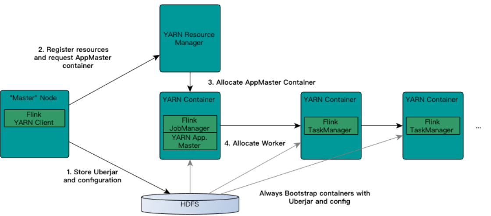

上图是 Flink on Yarn 模式下，Flink 和 Yarn 的交互流程。Yarn 是 Hadoop 三驾马车之一，主要用来做资源管理。我们在 Flink on Yarn 模式中也是借助 Yarn 的资源管理优势，需要在三个节点中配置 YARN_CONF_DIR、HADOOP_CONF_DIR、HADOOP_CONF_PATH 中的任意一个环境变量即可。


模块二：进阶篇
# 第07讲：Flink 常见核心概念分析

## 1、分布式缓存

熟悉 Hadoop 的你应该知道，分布式缓存最初的思想诞生于 Hadoop 框架，Hadoop 会将一些数据或者文件缓存在 HDFS 上，在分布式环境中让所有的计算节点调用同一个配置文件。在 Flink 中，Flink 框架开发者们同样将这个特性进行了实现。

Flink 提供的分布式缓存类型 Hadoop，目的是为了在分布式环境中让每一个 TaskManager 节点保存一份相同的数据或者文件，当前计算节点的 task 就像读取本地文件一样拉取这些配置。

分布式缓存在我们实际生产环境中最广泛的一个应用，就是在进行表与表 Join 操作时，如果一个表很大，另一个表很小，那么我们就可以把较小的表进行缓存，在每个 TaskManager 都保存一份，然后进行 Join 操作。


那么我们应该怎样使用 Flink 的分布式缓存呢？举例如下：

```java
/**
 distributedcache.txt内容一行：hello java,hello go
 
 输出
 [hello java,hello go]：Linea
 [hello java,hello go]：Lineb
 [hello java,hello go]：Linec
 [hello java,hello go]：Lined
 */
public class BatchJob {


	public static void main(String[] args) throws Exception {

		// set up the execution environment
		final ExecutionEnvironment env = ExecutionEnvironment.getExecutionEnvironment();
//		env.setRestartStrategy(RestartStrategies.noRestart());
//        env.setRestartStrategy(RestartStrategies.fixedDelayRestart(
//                3, // 尝试重启的次数
//                Time.of(10, TimeUnit.SECONDS) // 延时
//        ));

        env.setRestartStrategy(RestartStrategies.failureRateRestart(
                3, // 每个时间间隔的最大故障次数
                Time.of(5, TimeUnit.MINUTES), // 测量故障率的时间间隔
                Time.of(5, TimeUnit.SECONDS) // 延时
        ));
        
		env.registerCachedFile("C:\\Users\\ls\\Desktop\\flink\\distributedcache.txt", "distributedCache");
        //1：注册一个文件,可以使用hdfs上的文件 也可以是本地文件进行测试
        DataSource<String> data = env.fromElements("Linea", "Lineb", "Linec", "Lined");

        DataSet<String> result = data.map(new RichMapFunction<String, String>() {
            private ArrayList<String> dataList = new ArrayList<String>();

            @Override
            public void open(Configuration parameters) throws Exception {
                super.open(parameters);
                //2：使用文件
                File myFile = getRuntimeContext().getDistributedCache().getFile("distributedCache");
                List<String> lines = FileUtils.readLines(myFile);
                for (String line : lines) {
                    this.dataList.add(line);
                    System.err.println("分布式缓存为:" + line);
                }
            }

            @Override
            public String map(String value) throws Exception {
                //在这里就可以使用dataList
                System.err.println("使用datalist：" + dataList + "------------" +value);
                //业务逻辑
                return dataList +"：" +  value;
            }
        });

        result.printToErr();
    }
}


```

从上面的例子中可以看出，使用分布式缓存有两个步骤。

第一步：首先需要在 env 环境中注册一个文件，该文件可以来源于本地，也可以来源于 HDFS ，并且为该文件取一个名字。

第二步：在使用分布式缓存时，可根据注册的名字直接获取。

可以看到，在上述案例中，我们把一个本地的 distributedcache.txt 文件注册为 distributedCache，在下面的 map 算子中直接通过这个名字将缓存文件进行读取并且进行了处理。


在使用分布式缓存时也需要注意一些问题，需要我们缓存的文件在任务运行期间最好是只读状态，否则会造成数据的一致性问题。另外，缓存的文件和数据不宜过大，否则会影响 Task 的执行速度，在极端情况下会造成 OOM。


## 2、故障恢复和重启策略

自动故障恢复是 Flink 提供的一个强大的功能，在实际运行环境中，我们会遇到各种各样的问题从而导致应用挂掉，比如我们经常遇到的非法数据、网络抖动等。

Flink 提供了强大的可配置故障恢复和重启策略来进行自动恢复。


### 1、故障恢复

Flink 的配置文件，其中有一个参数 jobmanager.execution.failover-strategy: region。

Flink 支持了不同级别的故障恢复策略，jobmanager.execution.failover-strategy 的可配置项有两种：full 和 region。

当我们配置的故障恢复策略为 full 时，集群中的 Task 发生故障，那么该任务的所有 Task 都会发生重启。而在实际生产环境中，我们的大作业可能有几百个 Task，出现一次异常如果进行整个任务重启，那么经常会导致长时间任务不能正常工作，导致数据延迟。

但是事实上，我们可能只是集群中某一个或几个 Task 发生了故障，只需要重启有问题的一部分即可，这就是 Flink 基于 Region 的局部重启策略。在这个策略下，Flink 会把我们的任务分成不同的 Region，当某一个 Task 发生故障时，Flink 会计算需要故障恢复的最小 Region。

Flink 在判断需要重启的 Region 时，采用了以下的判断逻辑：

- 发生错误的 Task 所在的 Region 需要重启；

- 如果当前 Region 的依赖数据出现损坏或者部分丢失，那么生产数据的 Region 也需要重启；

- 为了保证数据一致性，当前 Region 的下游 Region 也需要重启。


### 2、重启策略

Flink 提供了多种类型和级别的重启策略，常用的重启策略包括：

- 固定延迟重启策略模式
- 失败率重启策略模式
- 无重启策略模式

Flink 在判断使用的哪种重启策略时做了默认约定，如果用户配置了 checkpoint，但没有设置重启策略，那么会按照固定延迟重启策略模式进行重启；如果用户没有配置 checkpoint，那么默认不会重启。

下面我们分别对这三种模式进行详细讲解。


#### 1、无重启策略模式

在这种情况下，如果我们的作业发生错误，任务会直接退出。

我们可以在 flink-conf.yaml 中配置：restart-strategy: none

也可以在程序中使用代码指定：final ExecutionEnvironment env = ExecutionEnvironment.getExecutionEnvironment();
env.setRestartStrategy(RestartStrategies.noRestart());

#### 2、固定延迟重启策略模式

固定延迟重启策略会通过在 flink-conf.yaml 中设置如下配置参数，来启用此策略：restart-strategy: fixed-delay

固定延迟重启策略模式需要指定两个参数，首先 Flink 会根据用户配置的重试次数进行重试，每次重试之间根据配置的时间间隔进行重试，如下表所示：

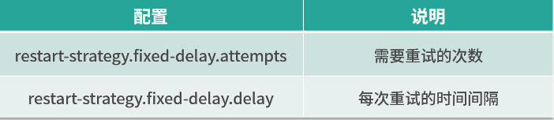

举个例子，假如我们需要任务重试 3 次，每次重试间隔 5 秒，那么需要进行一下配置：

```
restart-strategy.fixed-delay.attempts: 3
restart-strategy.fixed-delay.delay: 5 s
```

当前我们也可以在代码中进行设置：

```java
env.setRestartStrategy(RestartStrategies.fixedDelayRestart(
        3, // 重启次数
        Time.of(5, TimeUnit.SECONDS) // 时间间隔
));
```

#### 3、失败率重启策略模式

首先我们在 flink-conf.yaml 中指定如下配置：restart-strategy: failure-rate

这种重启模式需要指定三个参数，如下表所示。失败率重启策略在 Job 失败后会重启，但是超过失败率后，Job 会最终被认定失败。在两个连续的重启尝试之间，重启策略会等待一个固定的时间。

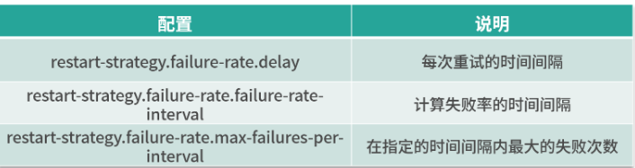


这种策略的配置理解较为困难，我们举个例子，假如 5 分钟内若失败了 3 次，则认为该任务失败，每次失败的重试间隔为 5 秒。

那么我们的配置应该是：


```
restart-strategy.failure-rate.max-failures-per-interval: 3
restart-strategy.failure-rate.failure-rate-interval: 5 min
restart-strategy.failure-rate.delay: 5 s

```
当然，也可以在代码中直接指定：

```java
env.setRestartStrategy(RestartStrategies.failureRateRestart(
        3, // 每个时间间隔的最大故障次数
        Time.of(5, TimeUnit.MINUTES), // 测量故障率的时间间隔
        Time.of(5, TimeUnit.SECONDS) //  每次任务失败时间间隔
));

```

最后，需要注意的是，在实际生产环境中由于每个任务的负载和资源消耗不一样，我们推荐在代码中指定每个任务的重试机制和重启策略。


## 3、并行度

它被定义为在分布式运行环境中我们的一个算子任务被切分成了多少个子任务并行执行。我们提高任务的并行度（Parallelism）在很大程度上可以大大提高任务运行速度。一般情况下，我们可以通过四种级别来设置任务的并行度。

### 1、算子级别

在代码中可以调用 setParallelism 方法来设置每一个算子的并行度。例如：

```java

DataSet<Tuple2<String, Integer>> counts =
      text.flatMap(new LineSplitter())
            .groupBy(0)
            .sum(1).setParallelism(1);

```

事实上，Flink 的每个算子都可以单独设置并行度。这也是我们最推荐的一种方式，可以针对每个算子进行任务的调优。


### 2、执行环境级别

我们在创建 Flink 的上下文时可以显示的调用 env.setParallelism() 方法，来设置当前执行环境的并行度，这个配置会对当前任务的所有算子、Source、Sink 生效。当然你还可以在算子级别设置并行度来覆盖这个设置。

```java
final ExecutionEnvironment env = ExecutionEnvironment.getExecutionEnvironment();
env.setParallelism(5);
```


### 3、提交任务级别

用户在提交任务时，可以显示的指定 -p 参数来设置任务的并行度，例如：

./bin/flink run -p 10 WordCount.jar

### 4、系统配置级别

我们在上一课时中提到了 flink-conf.yaml 中的一个配置：parallelism.default，该配置即是在系统层面设置所有执行环境的并行度配置。

整体上讲，这四种级别的配置生效优先级如下：`算子级别 > 执行环境级别 > 提交任务级别 > 系统配置级别`

在这里，要特别提一下 Flink 中的 Slot 概念。我们知道，Flink 中的 TaskManager 是执行任务的节点，那么在每一个 TaskManager 里，还会有“槽位”，也就是 Slot。Slot 个数代表的是每一个 TaskManager 的并发执行能力。

假如我们指定 taskmanager.numberOfTaskSlots:3，即每个 taskManager 有 3 个 Slot ，那么整个集群就有 3 * taskManager 的个数多的槽位。这些槽位就是我们整个集群所拥有的所有执行任务的资源。

# 第08讲：Flink 窗口、时间和水印

Flink 框架中支持事件时间、摄入时间和处理时间三种。而当我们在流式计算环境中数据从 Source 产生，再到转换和输出，这个过程由于网络和反压的原因会导致消息乱序。因此，需要有一个机制来解决这个问题，这个特别的机制就是“水印”。


根据窗口数据划分的不同，目前 Flink 支持如下 3 种：

- 滚动窗口，窗口数据有固定的大小，窗口中的数据不会叠加；
- 滑动窗口，窗口数据有固定的大小，并且有生成间隔；
- 会话窗口，窗口数据没有固定的大小，根据用户传入的参数进行划分，窗口数据无叠加。

Flink 中的时间分为三种：

- 事件时间（Event Time），即事件实际发生的时间；
- 摄入时间（Ingestion Time），事件进入流处理框架的时间；
- 处理时间（Processing Time），事件被处理的时间。

下面的图详细说明了这三种时间的区别和联系：

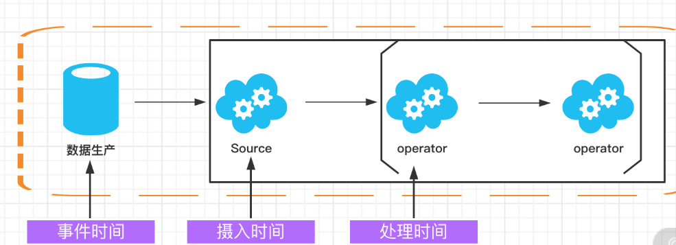


## 1、事件时间（Event Time）

事件时间（Event Time）指的是数据产生的时间，这个时间一般由数据生产方自身携带，比如 Kafka 消息，每个生成的消息中自带一个时间戳代表每条数据的产生时间。Event Time 从消息的产生就诞生了，不会改变，也是我们使用最频繁的时间。

利用 Event Time 需要指定如何生成事件时间的“水印”，并且一般和窗口配合使用，具体会在下面的“水印”内容中详细讲解。


## 2、处理时间（Processing Time）

处理时间（Processing Time）指的是数据被 Flink 框架处理时机器的系统时间，Processing Time 是 Flink 的时间系统中最简单的概念，但是这个时间存在一定的不确定性，比如消息到达处理节点延迟等影响。


## 3、摄入时间（Ingestion Time）

摄入时间（Ingestion Time）是事件进入 Flink 系统的时间，在 Flink 的 Source 中，每个事件会把当前时间作为时间戳，后续做窗口处理都会基于这个时间。理论上 Ingestion Time 处于 Event Time 和 Processing Time之间。

与事件时间相比，摄入时间无法处理延时和无序的情况，但是不需要明确执行如何生成 watermark。在系统内部，摄入时间采用更类似于事件时间的处理方式进行处理，但是有自动生成的时间戳和自动的 watermark。

可以防止 Flink 内部处理数据是发生乱序的情况，但无法解决数据到达 Flink 之前发生的乱序问题。如果需要处理此类问题，建议使用 EventTime。


## 4、水印（WaterMark）

WaterMark 在正常的英文翻译中是水位，但是在 Flink 框架中，翻译为“水位线”更为合理，它在本质上是一个时间戳。

在上面的时间类型中我们知道，Flink 中的时间：

- EventTime 每条数据都携带时间戳；
- ProcessingTime 数据不携带任何时间戳的信息；
- IngestionTime 和 EventTime 类似，不同的是 Flink 会使用系统时间作为时间戳绑定到每条数据，可以防止 Flink 内部处理数据是发生乱序的情况，但无法解决数据到达 Flink 之前发生的乱序问题。

所以，我们在处理消息乱序的情况时，会用 EventTime 和 WaterMark 进行配合使用。

首先我们要明确几个基本问题。

### 1、水印的本质是什么

水印的出现是为了解决实时计算中的数据乱序问题，它的本质是 DataStream 中一个带有时间戳的元素。如果 Flink 系统中出现了一个 WaterMark T，那么就意味着 EventTime < T 的数据都已经到达，窗口的结束时间和 T 相同的那个窗口被触发进行计算了。

也就是说：水印是 Flink 判断迟到数据的标准，同时也是窗口触发的标记。

在程序并行度大于 1 的情况下，会有多个流产生水印和窗口，这时候 Flink 会选取时间戳最小的水印。


# 第09讲：Flink 状态与容错
# 第10讲：Flink Side OutPut 分流
# 第11讲：Flink CEP 复杂事件处理
# 第12讲：Flink 常用的 Source 和 Connector


模块三：生产实践篇
# 第13讲：如何实现生产环境中的 Flink 高可用配置
# 第14讲：Flink Exactly-once 实现原理解析
# 第15讲：如何排查生产环境中的反压问题
# 第16讲：如何处理生产环境中的数据倾斜问题
# 第17讲：生产环境中的并行度和资源设置
# 第18讲：如何进行生产环境作业监控
# 第19讲：Flink 如何做维表关联
# 第20讲：Flink 高级应用之海量数据高效去重
# 第21讲：Flink 在实时计算平台和实时数据仓库中的作用
模块四：高级实战篇
第22讲：项目背景和整体架构设计
第23讲：Mock Kafka 消息并发送
第24讲：Flink 消费 Kafka 数据业务开发
第25讲：Flink 中 watermark 的定义和使用
第26讲：Flink 中的聚合函数和累加器的设计和使用
第27讲：Flink Redis Sink 实现
第28讲：TopN 热门商品功能实现
第29讲：项目背景和实时处理系统架构设计
第30讲：Flume 和 Kafka 整合和部署
第31讲：Kafka 模拟数据生成和发送
第32讲：Flink 和 Kafka 整合时间窗口设计
待更新
第33讲：Flink 计算 PV、UV 代码实现
待更新
第34讲：Flink 和 Redis 整合以及 Redis Sink 实现
待更新
第35讲：项目背景和 Flink CEP 简介
待更新
第36讲：自定义消息事件
待更新
第37讲：自定义 Pattern 和报警规则
待更新
第38讲：Flink 调用 CEP 实现报警功能
待更新
模块五：面试篇
第39讲：Flink 面试-基础篇
待更新
第40讲：Flink 面试-进阶篇
待更新
第41讲：Flink 面试-源码篇
待更新
第42讲：Flink 面试-方案设计篇


