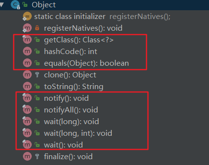

jdk1.8


一共12个方法。



```java
//所有对象的父类
public class Object {

    private static native void registerNatives();   //这个是干嘛的？？？
    static {
        registerNatives();
    }

    public final native Class<?> getClass();   //获取类对象

    //两个对象的equals相同，那么他们的hashCode一定相同；两个对象的equals不相同那么他们的hash也一样不相同（用户自己定义，不是强制的）；hash相同则，equals不一定相同；
 	public native int hashCode();

    //默认比较的是在内存的地址是否为同一个
 	public boolean equals(Object obj) {
        return (this == obj);
    }

    protected native Object clone() throws CloneNotSupportedException;

     public String toString() {
        return getClass().getName() + "@" + Integer.toHexString(hashCode());
    }

    //唤醒因为调用对象的wait方法而阻塞的任意一个线程。被唤醒的线程并不能立即运行，需要等待当前线程是否对象锁。被唤醒的线程将同其他获取的线程一起重新竞争对象锁。 这个方法应该被拥有锁对象的线程来调用。一个线程拥有对象monitor锁的三种方式：1、同步方法；2、通过对象同步代码块；3、类的静态方法； 对象锁同时只能由一个线程拥有。
    public final native void notify();
    
    //同上，只不过把对象锁上阻塞的线程全部唤醒，然后再一起参与竞争锁对象
    public final native void notifyAll();


    //会阻塞当前线程，直到另外一个线程调用当前对象的notify()\notifyAll()，或者指定的时间到了才会解除当前线程的阻塞[interrupt也可以唤醒阻塞？？？]。同样只有当前线程拥有对象锁时才可以进行调用。这个方法会把当前线程放到锁对象的wait set中，并释放锁对象。 当timeout=0时参数无效。可能会出现伪唤醒，因此wait应用通过一个循环来不断检测条件是否达到，来避免伪唤醒。
    public final native void wait(long timeout) throws InterruptedException;

    //同上，wait(0, 0)=wait(0)
    public final void wait(long timeout, int nanos) throws InterruptedException {
        if (timeout < 0) {
            throw new IllegalArgumentException("timeout value is negative");
        }

        if (nanos < 0 || nanos > 999999) {
            throw new IllegalArgumentException(
                                "nanosecond timeout value out of range");
        }

        if (nanos > 0) {
            timeout++;
        }

        wait(timeout);
    }
    //同上 wait(0)
    public final void wait() throws InterruptedException {
        wait(0);
    }

    protected void finalize() throws Throwable { }
}
```