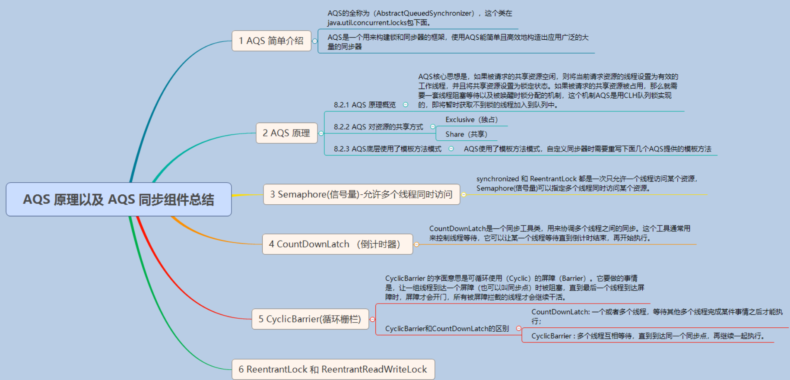
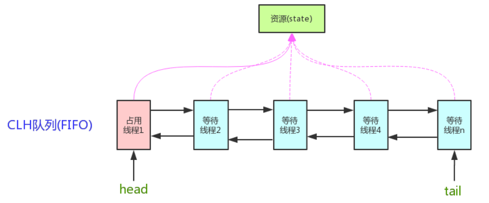

<!-- TOC -->

- [1、为什么需要 AQS？AQS 的作用和重要性是什么？](#1为什么需要-aqsaqs-的作用和重要性是什么)
    - [1、锁和协作类有共同点：阀门功能](#1锁和协作类有共同点阀门功能)
    - [2、为什么需要 AQS](#2为什么需要-aqs)
    - [3、AQS 的作用](#3aqs-的作用)
- [2、AQS 的内部原理是什么样的？](#2aqs-的内部原理是什么样的)
    - [1、state 状态](#1state-状态)
    - [2、FIFO 队列](#2fifo-队列)
    - [3、获取/释放方法](#3获取释放方法)
        - [1、获取方法](#1获取方法)
        - [2、释放方法](#2释放方法)
- [3、源码解析(AQS采用模板方法)](#3源码解析aqs采用模板方法)
    - [1、结点状态waitStatus](#1结点状态waitstatus)
    - [2、acquire(int)](#2acquireint)
        - [1、tryAcquire(int)](#1tryacquireint)
        - [2、addWaiter(Node)](#2addwaiternode)
        - [3、enq(Node)](#3enqnode)
        - [4、acquireQueued(Node, int)](#4acquirequeuednode-int)
        - [5、shouldParkAfterFailedAcquire(Node, Node)](#5shouldparkafterfailedacquirenode-node)
        - [6、parkAndCheckInterrupt()](#6parkandcheckinterrupt)
        - [7、acquire()函数处理流程总结](#7acquire函数处理流程总结)
    - [3、release(int)](#3releaseint)
        - [1、tryRelease(int)](#1tryreleaseint)
        - [2、unparkSuccessor(Node)](#2unparksuccessornode)
        - [3、总结](#3总结)
    - [4、acquireShared(int)](#4acquiresharedint)
        - [1、doAcquireShared(int)](#1doacquiresharedint)
        - [2、setHeadAndPropagate(Node, int)](#2setheadandpropagatenode-int)
        - [3、总结](#3总结-1)
    - [5、releaseShared()](#5releaseshared)
        - [1、doReleaseShared()](#1doreleaseshared)
- [4、AQS设计](#4aqs设计)
    - [1、AQS 对资源的共享方式](#1aqs-对资源的共享方式)
    - [2、AQS底层使用了模板方法模式](#2aqs底层使用了模板方法模式)
- [参考](#参考)

<!-- /TOC -->




总结：抽象队列同步器AbstractQueuedSynchronizer（AQS），它包含了`state变量`、`加锁线程`、`等待队列`等并发中的核心组件。

**AQS核心思想是，如果被请求的共享资源空闲，则将当前请求资源的线程设置为有效的工作线程，并且将共享资源设置为锁定状态。如果被请求的共享资源被占用，那么就需要一套线程阻塞等待以及被唤醒时锁分配的机制，这个机制AQS是用CLH队列锁实现的，即将暂时获取不到锁的线程加入到队列中。**

`CLH(Craig,Landin,and Hagersten)队列是一个虚拟的双向队列（虚拟的双向队列即不存在队列实例，仅存在结点之间的关联关系）。AQS是将每条请求共享资源的线程封装成一个CLH锁队列的一个结点（Node）来实现锁的分配。`




# 1、为什么需要 AQS？AQS 的作用和重要性是什么？


我们先来介绍一下 AQS（AbstractQueuedSynchronizer）的重要性，来看看 AQS 被用在了哪些类里面。

AQS 在 `ReentrantLock、ReentrantReadWriteLock、Semaphore、CountDownLatch、ThreadPoolExcutor 的 Worker 中都有运用（JDK 1.8）`，AQS 是这些类的底层原理。


## 1、锁和协作类有共同点：阀门功能

请你先来思考一下，之前学过的 ReentrantLock 和 Semaphore，二者之间有没有什么共同点？

其实它们都可以当做一个阀门来使用。比如我们把 Semaphore 的许可证数量设置为 1，那么由于它只有一个许可证，所以只能允许一个线程通过，并且当之前的线程归还许可证后，会允许其他线程继续获得许可证。其实这点和 ReentrantLock 很像，只有一个线程能获得锁，并且当这个线程释放锁之后，会允许其他的线程获得锁。那如果线程发现当前没有额外的许可证时，或者当前得不到锁，那么线程就会被阻塞，并且等到后续有许可证或者锁释放出来后，被唤醒，所以这些环节都是比较类似的。

除了上面讲的 ReentrantLock 和 Semaphore 之外，我们会发现 CountDownLatch、ReentrantReadWriteLock 等工具类都有类似的让线程“协作”的功能，其实它们背后都是利用 AQS 来实现的。

## 2、为什么需要 AQS

原因是，上面刚讲的那些协作类，它们有很多工作是类似的，所以如果能把实现类似工作的代码给提取出来，变成一个新的底层工具类（或称为框架）的话，就可以直接使用这个工具类来构建上层代码了，而这个工具类其实就是 AQS。

有了 AQS 之后，对于 ReentrantLock 和 Semaphore 等线程协作工具类而言，它们就不需要关心这么多的线程调度细节，只需要实现它们各自的设计逻辑即可。


那我们再尝试逆向思考一下，如果没有 AQS 会怎么样？如果没有 AQS，那就需要每个线程协作工具类自己去实现至少以下内容，包括：

- 1、状态的原子性管理
- 2、线程的阻塞与解除阻塞
- 3、队列的管理

这里的状态对于不同的工具类而言，代表不同的含义，比如对于 ReentrantLock 而言，它需要维护锁被重入的次数，但是保存重入次数的变量是会被多线程同时操作的，就需要进行处理，以便保证线程安全。不仅如此，对于那些未抢到锁的线程，还应该让它们陷入阻塞，并进行排队，并在合适的时机唤醒。所以说这些内容其实是比较繁琐的，而且也是比较重复的，而这些工作目前都由 AQS 来承担了。

如果没有 AQS，就需要 ReentrantLock 等类来自己实现相关的逻辑，但是让每个线程协作工具类自己去正确并且高效地实现这些内容，是相当有难度的。AQS 可以帮我们把 “脏活累活” 都搞定，所以对于 ReentrantLock 和 Semaphore 等类而言，它们只需要关注自己特有的业务逻辑即可。正所谓是“哪有什么岁月静好，不过是有人替你负重前行”。

## 3、AQS 的作用

AQS 是一个用于构建锁、同步器等线程协作工具类的框架，有了 AQS 以后，很多用于线程协作的工具类就都可以很方便的被写出来，有了 AQS 之后，可以让更上层的开发极大的减少工作量，避免重复造轮子，同时也避免了上层因处理不当而导致的线程安全问题，因为 AQS 把这些事情都做好了。总之，有了 AQS 之后，我们构建线程协作工具类就容易多了。


# 2、AQS 的内部原理是什么样的？


我们对 AQS 进行内部原理解析的话需要抓住重点，因为 AQS 的内部比较复杂，代码很长而且非常不容易读懂，如果我们一上来就一头扎进去读源码，是很难完全掌握它的。所以在本课时中，我们把 AQS 最核心的三个部分作为重点提炼出来，由这三个部分作为切入点，打开 AQS 的大门。

是哪三大部分呢？AQS 最核心的三大部分就是状态、队列和期望协作工具类去实现的获取/释放等重要方法。我们就从这三个部分出发，分别展开讲解。


AQS定义两种资源共享方式：Exclusive（独占，只有一个线程能执行，如ReentrantLock）和Share（共享，多个线程可同时执行，如Semaphore/CountDownLatch）。

不同的自定义同步器争用共享资源的方式也不同。`自定义同步器在实现时只需要实现共享资源state的获取与释放方式即可`，至于具体线程等待队列的维护（如获取资源失败入队/唤醒出队等），AQS已经在顶层实现好了。自定义同步器实现时主要实现以下几种方法：

- isHeldExclusively()：该线程是否正在独占资源。只有用到condition才需要去实现它。
- tryAcquire(int)：独占方式。尝试获取资源，成功则返回true，失败则返回false。
- tryRelease(int)：独占方式。尝试释放资源，成功则返回true，失败则返回false。
- tryAcquireShared(int)：共享方式。尝试获取资源。负数表示失败；0表示成功，但没有剩余可用资源；正数表示成功，且有剩余资源。
- tryReleaseShared(int)：共享方式。尝试释放资源，如果释放后允许唤醒后续等待结点返回true，否则返回false。


以ReentrantLock为例，state初始化为0，表示未锁定状态。A线程lock()时，会调用tryAcquire()独占该锁并将state+1。此后，其他线程再tryAcquire()时就会失败，直到A线程unlock()到state=0（即释放锁）为止，其它线程才有机会获取该锁。当然，释放锁之前，A线程自己是可以重复获取此锁的（state会累加），这就是可重入的概念。但要注意，获取多少次就要释放多么次，这样才能保证state是能回到零态的。

再以CountDownLatch以例，任务分为N个子线程去执行，state也初始化为N（注意N要与线程个数一致）。这N个子线程是并行执行的，每个子线程执行完后countDown()一次，state会CAS减1。等到所有子线程都执行完后(即state=0)，会unpark()主调用线程，然后主调用线程就会从await()函数返回，继续后余动作。


一般来说，自定义同步器要么是独占方法，要么是共享方式，他们也只需实现tryAcquire-tryRelease、tryAcquireShared-tryReleaseShared中的一种即可。`但AQS也支持自定义同步器同时实现独占和共享两种方式，如ReentrantReadWriteLock。`


## 1、state 状态

如果我们的 AQS 想要去管理或者想作为协作工具类的一个基础框架，那么它必然要管理一些状态，而这个状态在 AQS 内部就是用 state 变量去表示的。它的定义如下：

private volatile int state;//The synchronization state.

而 state 的含义并不是一成不变的，它会根据具体实现类的作用不同而表示不同的含义，下面举几个例子。

比如说在信号量里面，state 表示的是剩余许可证的数量。如果我们最开始把 state 设置为 10，这就代表许可证初始一共有 10 个，然后当某一个线程取走一个许可证之后，这个 state 就会变为 9，所以信号量的 state 相当于是一个内部计数器。

再比如，在 CountDownLatch 工具类里面，state 表示的是需要“倒数”的数量。一开始我们假设把它设置为 5，当每次调用 CountDown 方法时，state 就会减 1，一直减到 0 的时候就代表这个门闩被放开。

下面我们再来看一下 state 在 ReentrantLock 中是什么含义，在 ReentrantLock 中它表示的是锁的占有情况。最开始是 0，表示没有任何线程占有锁；如果 state 变成 1，则就代表这个锁已经被某一个线程所持有了。那为什么还会变成 2、3、4 呢？为什么会往上加呢？因为 ReentrantLock 是可重入的，同一个线程可以再次拥有这把锁就叫重入。如果这个锁被同一个线程多次获取，那么 state 就会逐渐的往上加，state 的值表示重入的次数。在释放的时候也是逐步递减，比如一开始是 4，释放一次就变成了 3，再释放一次变成了 2，这样进行的减操作，即便是减到 2 或者 1 了，都不代表这个锁是没有任何线程持有，只有当它减到 0 的时候，此时恢复到最开始的状态了，则代表现在没有任何线程持有这个锁了。所以，state 等于 0 表示锁不被任何线程所占有，代表这个锁当前是处于释放状态的，其他线程此时就可以来尝试获取了。


这就是 state 在不同类中不同含义的一个具体表现。我们举了三个例子，如果未来有新的工具要利用到 AQS，它一定也需要利用 state，为这个类表示它所需要的业务逻辑和状态。

下面我们再来看一下关于 state 修改的问题，因为 state 是会被多个线程共享的，会被并发地修改，所以所有去修改 state 的方法都必须要保证 state 是线程安全的。可是 state 本身它仅仅是被 volatile 修饰的，volatile 本身并不足以保证线程安全，所以我们就来看一下，AQS 在修改 state 的时候具体利用了什么样的设计来保证并发安全。

我们举两个和 state 相关的方法，分别是 compareAndSetState 及 setState，它们的实现已经由 AQS 去完成了，也就是说，我们直接调用这两个方法就可以对 state 进行线程安全的修改。下面就来看一下这两个方法的源码是怎么实现的。

先来看一下 compareAndSetState 方法，这是一个我们非常熟悉的 CAS 操作，这个方法的代码，如下所示：

```java
protected final boolean compareAndSetState(int expect, int update) {
    return unsafe.compareAndSwapInt(this, stateOffset, expect, update);
}
```

方法里面只有一行代码，即 return unsafe.compareAndSwapInt(this, stateOffset, expect, update)，这个方法我们已经非常熟悉了，它利用了 Unsafe 里面的 CAS 操作，利用 CPU 指令的原子性保证了这个操作的原子性，与之前介绍过的原子类去保证线程安全的原理是一致的。

接下来看一下 setState 方法的源码，如下所示：

```java
protected final void setState(int newState) {
    state = newState;
}
```

我们可以看到，它去修改 state 值的时候非常直截了当，直接把 state = newState，这样就直接赋值了。你可能会感到困惑，这里并没有进行任何的并发安全处理，没有加锁也没有 CAS，那如何能保证线程安全呢？

这里就要说到 volatile 的作用了，前面在学习 volatile 关键字的时候，知道了它适用于两种场景，`其中一种场景就是，当对基本类型的变量进行直接赋值时`，如果加了 volatile 就可以保证它的线程安全。注意，这是 volatile 的非常典型的使用场景。

private volatile int state;//The synchronization state.

可以看出，state 是 int 类型的，属于基本类型，并且这里的 setState 方法内是对 state 直接赋值的，它不涉及读取之前的值，也不涉及在原来值的基础上再修改，所以我们仅仅利用 volatile 就可以保证在这种情况下的并发安全，这就是 setState 方法线程安全的原因。

下面我们对 state 进行总结，在 AQS 中有 state 这样的一个属性，是被 volatile 修饰的，会被并发修改，它代表当前工具类的某种状态，在不同的类中代表不同的含义。

## 2、FIFO 队列

AQS 的第二个核心部分，FIFO 队列，即先进先出队列，这个队列最主要的作用是`存储等待的线程`。假设很多线程都想要同时抢锁，那么大部分的线程是抢不到的，那怎么去处理这些抢不到锁的线程呢？就得需要有一个队列来存放、管理它们。所以 AQS 的一大功能就是充当线程的“排队管理器”。

当多个线程去竞争同一把锁的时候，就需要用排队机制把那些没能拿到锁的线程串在一起；而当前面的线程释放锁之后，这个管理器就会挑选一个合适的线程来尝试抢刚刚释放的那把锁。所以 AQS 就一直在维护这个队列，并把等待的线程都放到队列里面。

这个队列内部是双向链表的形式，其数据结构看似简单，但是要想维护成一个线程安全的双向队列却非常复杂，因为要考虑很多的多线程并发问题。我们来看一下 AQS 作者 Doug Lea 给出的关于这个队列的一个图示：


在队列中，分别用 head 和 tail 来表示头节点和尾节点，两者在初始化的时候都指向了一个空节点。头节点可以理解为“当前持有锁的线程”，而在头节点之后的线程就被阻塞了，它们会等待被唤醒，唤醒也是由 AQS 负责操作的。

## 3、获取/释放方法

下面我们就来看一看 AQS 的第三个核心部分，获取/释放方法。在 AQS 中除了刚才讲过的 state 和队列之外，还有一部分非常重要，那就是获取和释放相关的重要方法，这些方法是协作工具类的逻辑的具体体现，需要每一个协作工具类自己去实现，所以在不同的工具类中，它们的实现和含义各不相同。

### 1、获取方法

我们首先来看一下获取方法。获取操作通常会依赖 state 变量的值，根据 state 值不同，协作工具类也会有不同的逻辑，并且在获取的时候也经常会阻塞，下面就让我们来看几个具体的例子。

比如 ReentrantLock 中的 lock 方法就是其中一个“获取方法”，执行时，如果发现 state 不等于 0 且当前线程不是持有锁的线程，那么就代表这个锁已经被其他线程所持有了。这个时候，当然就获取不到锁，于是就让该线程进入阻塞状态。

再比如，Semaphore 中的 acquire 方法就是其中一个“获取方法”，作用是获取许可证，此时能不能获取到这个许可证也取决于 state 的值。如果 state 值是正数，那么代表还有剩余的许可证，数量足够的话，就可以成功获取；但如果 state 是 0，则代表已经没有更多的空余许可证了，此时这个线程就获取不到许可证，会进入阻塞状态，所以这里同样也是和 state 的值相关的。

再举个例子，CountDownLatch 获取方法就是 await 方法（包含重载方法），作用是“等待，直到倒数结束”。执行 await 的时候会判断 state 的值，如果 state 不等于 0，线程就陷入阻塞状态，直到其他线程执行倒数方法把 state 减为 0，此时就代表现在这个门闩放开了，所以之前阻塞的线程就会被唤醒。

我们总结一下，“获取方法”在不同的类中代表不同的含义，但往往和 state 值相关，也经常会让线程进入阻塞状态，这也同样证明了 state 状态在 AQS 类中的重要地位。

### 2、释放方法

释放方法是站在获取方法的对立面的，通常和刚才的获取方法配合使用。我们刚才讲的获取方法可能会让线程阻塞，比如说获取不到锁就会让线程进入阻塞状态，但是释放方法通常是不会阻塞线程的。

比如在 Semaphore 信号量里面，释放就是 release 方法（包含重载方法），release() 方法的作用是去释放一个许可证，会让 state 加 1；而在 CountDownLatch 里面，释放就是 countDown 方法，作用是倒数一个数，让 state 减 1。所以也可以看出，在不同的实现类里面，他们对于 state 的操作是截然不同的，需要由每一个协作类根据自己的逻辑去具体实现。


> 总结

介绍了 AQS 最重要的三个部分。第一个是 state，它是一个数值，在不同的类中表示不同的含义，往往代表一种状态；第二个是一个队列，该队列用来存放线程；第三个是“获取/释放”的相关方法，需要利用 AQS 的工具类根据自己的逻辑去实现。


# 3、源码解析(AQS采用模板方法)


AQS使用一个int成员变量来表示同步状态，通过内置的FIFO队列来完成获取资源线程的排队工作。AQS使用CAS对该同步状态进行原子操作实现对其值的修改。


```java

//一个线程独占式的占有资源。便于子类开发。用来实现独占锁
public abstract class AbstractOwnableSynchronizer
    implements java.io.Serializable {

    protected AbstractOwnableSynchronizer() { }

    private transient Thread exclusiveOwnerThread; //唯一的字段，存放的是获取锁的线程

    protected final void setExclusiveOwnerThread(Thread thread) {
        exclusiveOwnerThread = thread;
    }

    protected final Thread getExclusiveOwnerThread() {
        return exclusiveOwnerThread;
    }
}

```


```java

public abstract class AbstractQueuedSynchronizer
    extends AbstractOwnableSynchronizer
    implements java.io.Serializable {

protected AbstractQueuedSynchronizer() { }

private transient volatile Node head;//等待队列的头结点

private transient volatile Node tail;//等待队列的尾节点

private volatile int state;//锁状态字段，初始化为0。共享变量，使用volatile修饰保证线程可见性

static final long spinForTimeoutThreshold = 1000L;


private static final Unsafe unsafe = Unsafe.getUnsafe();//可以自己操作内存的工具类

private static final long stateOffset;//状态字段在内存中存储位置偏移
private static final long headOffset;//head字段在内存中存储位置偏移
private static final long tailOffset;//tail字段在内存中存储位置偏移

private static final long waitStatusOffset;//node类的waitStatus字段在内存中存储位置偏移
private static final long nextOffset;//node类的next字段在内存中存储位置偏移

//初始化各个内存偏移量的位置
static {
    try {
        stateOffset = unsafe.objectFieldOffset
            (AbstractQueuedSynchronizer.class.getDeclaredField("state"));
        headOffset = unsafe.objectFieldOffset
            (AbstractQueuedSynchronizer.class.getDeclaredField("head"));
        tailOffset = unsafe.objectFieldOffset
            (AbstractQueuedSynchronizer.class.getDeclaredField("tail"));
        waitStatusOffset = unsafe.objectFieldOffset
            (Node.class.getDeclaredField("waitStatus"));
        nextOffset = unsafe.objectFieldOffset
            (Node.class.getDeclaredField("next"));

    } catch (Exception ex) { throw new Error(ex); }
}

}
```

状态信息通过procted类型的getState，setState，compareAndSetState进行操作

```java

//返回同步状态的当前值
protected final int getState() {  
        return state;
}
 // 设置同步状态的值
protected final void setState(int newState) { 
        state = newState;
}
//原子地（CAS操作）将同步状态值设置为给定值update如果当前同步状态的值等于expect（期望值）
protected final boolean compareAndSetState(int expect, int update) {
        return unsafe.compareAndSwapInt(this, stateOffset, expect, update);
}
```


## 1、结点状态waitStatus


```java
    static final class Node {//把获取不到锁的线程封装成一个node对象，构造等待队列
        static final Node SHARED = new Node();//标记一个节点正在等待共享锁
        static final Node EXCLUSIVE = null;//标记一个线程正在等待独占锁

        static final int CANCELLED =  1;//表示线程被取消（因为超时或者中断）
        static final int SIGNAL    = -1;//表示后继线程unparking
        static final int CONDITION = -2;//表示线程在等待一个条件
        static final int PROPAGATE = -3;//表示下一个获取共享的应该被无条件传播

        volatile int waitStatus;//等待线程的节点状态。初始化为0，取值只能取上面的几种

        /**
         * Link to predecessor node that current node/thread relies on
         * for checking waitStatus. Assigned during enqueuing, and nulled
         * out (for sake of GC) only upon dequeuing.  Also, upon
         * cancellation of a predecessor, we short-circuit while
         * finding a non-cancelled one, which will always exist
         * because the head node is never cancelled: A node becomes
         * head only as a result of successful acquire. A
         * cancelled thread never succeeds in acquiring, and a thread only
         * cancels itself, not any other node.
         */
        volatile Node prev;

        /**
         * Link to the successor node that the current node/thread
         * unparks upon release. Assigned during enqueuing, adjusted
         * when bypassing cancelled predecessors, and nulled out (for
         * sake of GC) when dequeued.  The enq operation does not
         * assign next field of a predecessor until after attachment,
         * so seeing a null next field does not necessarily mean that
         * node is at end of queue. However, if a next field appears
         * to be null, we can scan prev's from the tail to
         * double-check.  The next field of cancelled nodes is set to
         * point to the node itself instead of null, to make life
         * easier for isOnSyncQueue.
         */
        volatile Node next;

        volatile Thread thread;//请求锁的线程

        /**
         * Link to next node waiting on condition, or the special
         * value SHARED.  Because condition queues are accessed only
         * when holding in exclusive mode, we just need a simple
         * linked queue to hold nodes while they are waiting on
         * conditions. They are then transferred to the queue to
         * re-acquire. And because conditions can only be exclusive,
         * we save a field by using special value to indicate shared
         * mode.
         */
        Node nextWaiter;

       
        final boolean isShared() {//判断是否为共享模式
            return nextWaiter == SHARED;
        }

        final Node predecessor() throws NullPointerException {
            Node p = prev;
            if (p == null)
                throw new NullPointerException();
            else
                return p;
        }

        Node() {    // Used to establish initial head or SHARED marker
        }

        Node(Thread thread, Node mode) {     // Used by addWaiter
            this.nextWaiter = mode;
            this.thread = thread;
        }

        Node(Thread thread, int waitStatus) { // Used by Condition
            this.waitStatus = waitStatus;
            this.thread = thread;
        }
    }
```

这里我们说下Node。Node结点是对每一个等待获取资源的线程的封装，其包含了需要同步的线程本身及其等待状态，如是否被阻塞、是否等待唤醒、是否已经被取消等。变量waitStatus则表示当前Node结点的等待状态，共有5种取值CANCELLED、SIGNAL、CONDITION、PROPAGATE、0。

- CANCELLED(1)：表示当前结点已取消调度。当timeout或被中断（响应中断的情况下），会触发变更为此状态，进入该状态后的结点将不会再变化。

- SIGNAL(-1)：表示后继结点在等待当前结点唤醒。`后继结点入队时，会将前继结点的状态更新为SIGNAL。`

- CONDITION(-2)：表示结点等待在Condition上，当其他线程调用了Condition的signal()方法后，CONDITION状态的结点将从等待队列转移到同步队列中，等待获取同步锁。

- PROPAGATE(-3)：共享模式下，前继结点不仅会唤醒其后继结点，同时也可能会唤醒后继的后继结点。

- 0：新结点入队时的默认状态。

注意，负值表示结点处于有效等待状态，而正值表示结点已被取消。所以源码中很多地方用>0、<0来判断结点的状态是否正常。


## 2、acquire(int)

`此方法是独占模式下线程获取共享资源的顶层入口`。如果获取到资源，线程直接返回，否则获取失败，进入等待队列，直到获取到资源为止，且整个过程忽略中断的影响。这也正是lock()的语义，当然不仅仅只限于lock()。获取到资源后，线程就可以去执行其临界区代码了。下面是acquire()的源码：

```java
public final void acquire(int arg) {
     if (!tryAcquire(arg) &&
         acquireQueued(addWaiter(Node.EXCLUSIVE), arg))
         selfInterrupt();
}
```
 
函数流程如下：

- 1、tryAcquire()尝试直接去获取资源，如果成功则直接返回（这里体现了非公平锁，每个线程获取锁时会尝试直接抢占加塞一次，而CLH队列中可能还有别的线程在等待）；

- 2、获取失败时，返回发了，则addWaiter()将该线程加入等待队列的尾部，并标记为独占模式；

- 3、acquireQueued()使线程阻塞在等待队列中获取资源，一直获取到资源后才返回。如果在整个等待过程中被中断过，则返回true，否则返回false。

- 4、如果线程在等待过程中被中断过，它是不响应的。只是获取资源后才再进行自我中断selfInterrupt()，将中断补上。

### 1、tryAcquire(int)

`此方法尝试去获取独占资源`。如果获取成功，则直接返回true，否则直接返回false。这也正是tryLock()的语义，还是那句话，当然不仅仅只限于tryLock()。如下是tryAcquire()的源码：

```java
protected boolean tryAcquire(int arg) {
     throw new UnsupportedOperationException();
}
```

什么？直接throw异常？说好的功能呢？好吧，还记得概述里讲的AQS只是一个框架，具体资源的获取/释放方式交由自定义同步器去实现吗？就是这里了！！！AQS这里只定义了一个接口，具体资源的获取交由自定义同步器去实现了（通过state的get/set/CAS）！！！至于能不能重入，能不能加塞，那就看具体的自定义同步器怎么去设计了！！！当然，自定义同步器在进行资源访问时要考虑线程安全的影响。

这里之所以没有定义成abstract，是因为独占模式下只用实现tryAcquire-tryRelease，而共享模式下只用实现tryAcquireShared-tryReleaseShared。如果都定义成abstract，那么每个模式也要去实现另一模式下的接口。说到底，Doug Lea还是站在咱们开发者的角度，尽量减少不必要的工作量。


### 2、addWaiter(Node)

此方法用于将当前线程加入到等待队列的队尾，并返回当前线程所在的结点。还是上源码吧：

```java
private Node addWaiter(Node mode) {
    //以给定模式构造结点。mode有两种：EXCLUSIVE（独占）和SHARED（共享）
    Node node = new Node(Thread.currentThread(), mode);

    //尝试快速方式直接放到队尾。
    Node pred = tail;
    if (pred != null) {
        node.prev = pred;
        if (compareAndSetTail(pred, node)) {//这里如何解决并发问题的？？？
            pred.next = node;
            return node;
        }
    }

    //上一步失败则通过enq入队。
    enq(node);
    return node;
}
```

### 3、enq(Node)

此方法用于将node加入队尾。源码如下：

```java
private Node enq(final Node node) {
    //CAS"自旋"，直到成功加入队尾
    for (;;) {
        Node t = tail;
        if (t == null) { // 队列为空，创建一个空的标志结点作为head结点，并将tail也指向它。
            if (compareAndSetHead(new Node()))
                tail = head;
        } else {//正常流程，放入队尾
            node.prev = t;
            if (compareAndSetTail(t, node)) {
                t.next = node;
                return t;
            }
        }
    }
}
```

`问题：head节点什么情况下为空？因为队列的头部应该是正在使用资源的线程对象吧？？？`


如果你看过AtomicInteger.getAndIncrement()函数源码，那么相信你一眼便看出这段代码的精华。CAS自旋volatile变量，是一种很经典的用法。


### 4、acquireQueued(Node, int)

OK，通过tryAcquire()和addWaiter()，该线程获取资源失败，已经被放入等待队列尾部了。聪明的你立刻应该能想到该线程下一部该干什么了吧：`进入等待状态休息`，直到其他线程彻底释放资源后唤醒自己，自己再拿到资源，然后就可以去干自己想干的事了。没错，就是这样！是不是跟医院排队拿号有点相似~~acquireQueued()就是干这件事：在等待队列中排队拿号（中间没其它事干可以休息），直到拿到号后再返回。这个函数非常关键，还是上源码吧：

```java
final boolean acquireQueued(final Node node, int arg) {
    boolean failed = true;//标记是否成功拿到资源
    try {
        boolean interrupted = false;//标记等待过程中是否被中断过

        //又是一个“自旋”！
        for (;;) {
            final Node p = node.predecessor();//拿到前驱
            //如果前驱是head，即该结点已成老二，那么便有资格去尝试获取资源（可能是老大释放完资源唤醒自己的，当然也可能被interrupt了）。
            if (p == head && tryAcquire(arg)) {
                setHead(node);//拿到资源后，将head指向该结点。所以head所指的标杆结点，就是当前获取到资源的那个结点或null。
                p.next = null; // setHead中node.prev已置为null，此处再将head.next置为null，就是为了方便GC回收以前的head结点。也就意味着之前拿完资源的结点出队了！
                failed = false; // 成功获取资源
                return interrupted;//返回等待过程中是否被中断过
            }

            //如果自己可以休息了，就通过park()进入waiting状态，直到被unpark()。如果不可中断的情况下被中断了，那么会从park()中醒过来，发现拿不到资源，从而继续进入park()等待。
            if (shouldParkAfterFailedAcquire(p, node) &&
                parkAndCheckInterrupt())
                interrupted = true;//如果等待过程中被中断过，哪怕只有那么一次，就将interrupted标记为true
        }
    } finally {
        if (failed) // 如果等待过程中没有成功获取资源（如timeout，或者可中断的情况下被中断了），那么取消结点在队列中的等待。
            cancelAcquire(node);
    }
}
```
到这里了，我们先不急着总结acquireQueued()的函数流程，先看看shouldParkAfterFailedAcquire()和parkAndCheckInterrupt()具体干些什么。

> acquireQueued()函数的具体流程：

- 1、结点进入队尾后，检查状态，找到安全休息点；
- 2、调用park()进入waiting状态，等待unpark()或interrupt()唤醒自己；
- 3、被唤醒后，看自己是不是有资格能拿到号。如果拿到，head指向当前结点，并返回从入队到拿到号的整个过程中是否被中断过；如果没拿到，继续流程1。

### 5、shouldParkAfterFailedAcquire(Node, Node)

此方法主要用于检查状态，看看自己是否真的可以去休息了（进入waiting状态，如果线程状态转换不熟，可以参考本人上一篇写的Thread详解），万一队列前边的线程都放弃了只是瞎站着，那也说不定，对吧！

```java
private static boolean shouldParkAfterFailedAcquire(Node pred, Node node) {
    int ws = pred.waitStatus;//拿到前驱的状态
    if (ws == Node.SIGNAL)
        //如果已经告诉前驱拿完号后通知自己一下，那就可以安心休息了
        return true;
    if (ws > 0) {
        /*
         * 如果前驱放弃了，那就一直往前找，直到找到最近一个正常等待的状态，并排在它的后边。
         * 注意：那些放弃的结点，由于被自己“加塞”到它们前边，它们相当于形成一个无引用链，稍后就会被保安大叔赶走了(GC回收)！
         */
        do {
            node.prev = pred = pred.prev;
        } while (pred.waitStatus > 0);
        pred.next = node;
    } else {
         //如果前驱正常，那就把前驱的状态设置成SIGNAL，告诉它拿完号后通知自己一下。有可能失败，人家说不定刚刚释放完呢！
        compareAndSetWaitStatus(pred, ws, Node.SIGNAL);
    }
    return false;
}
```
整个流程中，如果前驱结点的状态不是SIGNAL，那么自己就不能安心去休息，需要去找个安心的休息点，同时可以再尝试下看有没有机会轮到自己拿号。


### 6、parkAndCheckInterrupt()

如果线程找好安全休息点后，那就可以安心去休息了。此方法就是让线程去休息，真正进入等待状态。

```java
private final boolean parkAndCheckInterrupt() {
     LockSupport.park(this);//调用park()使线程进入waiting状态
     return Thread.interrupted();//如果被唤醒，查看自己是不是被中断的。
}
```

park()会让当前线程进入waiting状态。在此状态下，有两种途径可以唤醒该线程：

- 1）被unpark()；
- 2）被interrupt()。需要注意的是，Thread.interrupted()会清除当前线程的中断标记位。 

### 7、acquire()函数处理流程总结

```java
public final void acquire(int arg) {
     if (!tryAcquire(arg) &&
         acquireQueued(addWaiter(Node.EXCLUSIVE), arg))
         selfInterrupt();
}
```

- 1、调用自定义同步器的tryAcquire()尝试直接去获取资源，如果成功则直接返回；
- 2、没成功（tryAcquire()返回false），则addWaiter()将该线程加入等待队列的尾部，并标记为独占模式；
- 3、acquireQueued()使线程在等待队列中休息，有机会时（轮到自己，会被unpark()）会去尝试获取资源。获取到资源后才返回。如果在整个等待过程中被中断过，则返回true，否则返回false。
- 4、如果线程在等待过程中被中断过，它是不响应的。只是获取资源后才再进行自我中断selfInterrupt()，将中断补上。

由于此函数是重中之重，我再用流程图总结一下：


这也就是ReentrantLock.lock()的流程，不信你去看其lock()源码吧，整个函数就是一条acquire(1)！！！

## 3、release(int)

此方法是独占模式下线程释放共享资源的顶层入口。它会释放指定量的资源，如果彻底释放了（即state=0）,它会唤醒等待队列里的其他线程来获取资源。这也正是unlock()的语义，当然不仅仅只限于unlock()。下面是release()的源码：

```java
public final boolean release(int arg) {
    if (tryRelease(arg)) {
        Node h = head;//找到头结点
        if (h != null && h.waitStatus != 0)
            unparkSuccessor(h);//唤醒等待队列里的下一个线程
        return true;
    }
    return false;
}
```
逻辑并不复杂。它调用tryRelease()来释放资源。有一点需要注意的是，它是根据tryRelease()的返回值来判断该线程是否已经完成释放掉资源了！所以自定义同步器在设计tryRelease()的时候要明确这一点！！

### 1、tryRelease(int)

此方法尝试去释放指定量的资源。下面是tryRelease()的源码：

```java
protected boolean tryRelease(int arg) {
    throw new UnsupportedOperationException();
}
```

跟tryAcquire()一样，这个方法是需要独占模式的自定义同步器去实现的。正常来说，tryRelease()都会成功的，因为这是独占模式，该线程来释放资源，那么它肯定已经拿到独占资源了，直接减掉相应量的资源即可(state-=arg)，也不需要考虑线程安全的问题。但要注意它的返回值，上面已经提到了，release()是根据tryRelease()的返回值来判断该线程是否已经完成释放掉资源了！所以自义定同步器在实现时，如果已经彻底释放资源(state=0)，要返回true，否则返回false。

### 2、unparkSuccessor(Node)

此方法用于唤醒等待队列中下一个线程。下面是源码：

```java
private void unparkSuccessor(Node node) {
    //这里，node一般为当前线程所在的结点。
    int ws = node.waitStatus;
    if (ws < 0)//置零当前线程所在的结点状态，允许失败。
        compareAndSetWaitStatus(node, ws, 0);

    Node s = node.next;//找到下一个需要唤醒的结点s
    if (s == null || s.waitStatus > 0) {//如果为空或已取消
        s = null;
        for (Node t = tail; t != null && t != node; t = t.prev) // 从后向前找。
            if (t.waitStatus <= 0)//从这里可以看出，<=0的结点，都是还有效的结点。
                s = t;
    }
    if (s != null)
        LockSupport.unpark(s.thread);//唤醒
}
```

这个函数并不复杂。一句话概括：`用unpark()唤醒等待队列中最前边的那个未放弃线程`，这里我们也用s来表示吧。此时，再和acquireQueued()联系起来，s被唤醒后，进入if (p == head && tryAcquire(arg))的判断（即使p!=head也没关系，它会再进入shouldParkAfterFailedAcquire()寻找一个安全点。这里既然s已经是等待队列中最前边的那个未放弃线程了，那么通过shouldParkAfterFailedAcquire()的调整，s也必然会跑到head的next结点，下一次自旋p==head就成立啦），然后s把自己设置成head标杆结点，表示自己已经获取到资源了，acquire()也返回了！！And then, DO what you WANT!


### 3、总结

release()是独占模式下线程释放共享资源的顶层入口。它会释放指定量的资源，如果彻底释放了（即state=0）,它会唤醒等待队列里的其他线程来获取资源。

 

问题：如果获取锁的线程在release时异常了，没有unpark队列中的其他结点，这时队列中的其他结点会怎么办？是不是没法再被唤醒了？

答案是YES（测试程序详见76楼）！！！这时，队列中等待锁的线程将永远处于park状态，无法再被唤醒！！！但是我们再回头想想，获取锁的线程在什么情形下会release抛出异常呢？？

- 1、线程突然死掉了？可以通过thread.stop来停止线程的执行，但该函数的执行条件要严苛的多，而且函数注明是非线程安全的，已经标明Deprecated；

- 2、线程被interupt了？线程在运行态是不响应中断的，所以也不会抛出异常；

- 3、release代码有bug，抛出异常了？目前来看，Doug Lea的release方法还是比较健壮的，没有看出能引发异常的情形（如果有，恐怕早被用户吐槽了）。除非自己写的tryRelease()有bug，那就没啥说的，自己写的bug只能自己含着泪去承受了。


## 4、acquireShared(int)

此方法是共享模式下线程获取共享资源的顶层入口。它会获取指定量的资源，获取成功则直接返回，获取失败则进入等待队列，直到获取到资源为止，整个过程忽略中断。下面是acquireShared()的源码：

```java
public final void acquireShared(int arg) {
    if (tryAcquireShared(arg) < 0)
        doAcquireShared(arg);
}
```
 
这里tryAcquireShared()依然需要自定义同步器去实现。但是AQS已经把其返回值的语义定义好了：负值代表获取失败；0代表获取成功，但没有剩余资源；正数表示获取成功，还有剩余资源，其他线程还可以去获取。所以这里acquireShared()的流程就是：

- 1、tryAcquireShared()尝试获取资源，成功则直接返回；
- 2、失败则通过doAcquireShared()进入等待队列，直到获取到资源为止才返回。

此方法用于将当前线程加入等待队列尾部休息，直到其他线程释放资源唤醒自己，自己成功拿到相应量的资源后才返回。下面是doAcquireShared()的源码：

### 1、doAcquireShared(int)

```java
private void doAcquireShared(int arg) {
    final Node node = addWaiter(Node.SHARED);//加入队列尾部
    boolean failed = true;//是否成功标志
    try {
        boolean interrupted = false;//等待过程中是否被中断过的标志
        for (;;) {
            final Node p = node.predecessor();//前驱
            if (p == head) {//如果到head的下一个，因为head是拿到资源的线程，此时node被唤醒，很可能是head用完资源来唤醒自己的
                int r = tryAcquireShared(arg);//尝试获取资源
                if (r >= 0) {//成功
                    setHeadAndPropagate(node, r);//将head指向自己，还有剩余资源可以再唤醒之后的线程
                    p.next = null; // help GC
                    if (interrupted)//如果等待过程中被打断过，此时将中断补上。
                        selfInterrupt();
                    failed = false;
                    return;
                }
            }

            //判断状态，寻找安全点，进入waiting状态，等着被unpark()或interrupt()
            if (shouldParkAfterFailedAcquire(p, node) &&
                parkAndCheckInterrupt())
                interrupted = true;
        }
    } finally {
        if (failed)
            cancelAcquire(node);
    }
}

```
有木有觉得跟acquireQueued()很相似？对，其实流程并没有太大区别。只不过这里将补中断的selfInterrupt()放到doAcquireShared()里了，而独占模式是放到acquireQueued()之外，其实都一样，不知道Doug Lea是怎么想的。


跟独占模式比，还有一点需要注意的是，这里只有线程是head.next时（“老二”），才会去尝试获取资源，有剩余的话还会唤醒之后的队友。那么问题就来了，假如老大用完后释放了5个资源，而老二需要6个，老三需要1个，老四需要2个。老大先唤醒老二，老二一看资源不够，他是把资源让给老三呢，还是不让？答案是否定的！老二会继续park()等待其他线程释放资源，也更不会去唤醒老三和老四了。独占模式，同一时刻只有一个线程去执行，这样做未尝不可；但共享模式下，多个线程是可以同时执行的，现在因为老二的资源需求量大，而把后面量小的老三和老四也都卡住了。当然，这并不是问题，只是AQS保证严格按照入队顺序唤醒罢了（保证公平，但降低了并发）。

### 2、setHeadAndPropagate(Node, int)

```java
private void setHeadAndPropagate(Node node, int propagate) {
    Node h = head;
    setHead(node);//head指向自己
     //如果还有剩余量，继续唤醒下一个邻居线程
    if (propagate > 0 || h == null || h.waitStatus < 0) {
        Node s = node.next;
        if (s == null || s.isShared())
            doReleaseShared();
    }
}
```
此方法在setHead()的基础上多了一步，就是自己苏醒的同时，如果条件符合（比如还有剩余资源），还会去唤醒后继结点，毕竟是共享模式！

doReleaseShared()我们留着下一小节的releaseShared()里来讲。


### 3、总结

acquireShared()也要告一段落了。让我们再梳理一下它的流程：

- 1、tryAcquireShared()尝试获取资源，成功则直接返回；
- 2、失败则通过doAcquireShared()进入等待队列park()，直到被unpark()/interrupt()并成功获取到资源才返回。整个等待过程也是忽略中断的。

其实跟acquire()的流程大同小异，只不过多了个自己拿到资源后，还会去唤醒后继队友的操作（这才是共享嘛）。


## 5、releaseShared()

此方法是共享模式下线程释放共享资源的顶层入口。它会释放指定量的资源，如果成功释放且允许唤醒等待线程，它会唤醒等待队列里的其他线程来获取资源。下面是releaseShared()的源码：

```java
public final boolean releaseShared(int arg) {
    if (tryReleaseShared(arg)) {//尝试释放资源
        doReleaseShared();//唤醒后继结点
        return true;
    }
    return false;
}
```

此方法的流程也比较简单，一句话：`释放掉资源后，唤醒后继`。

跟独占模式下的release()相似，但有一点稍微需要注意：独占模式下的tryRelease()在完全释放掉资源（state=0）后，才会返回true去唤醒其他线程，这主要是基于独占下可重入的考量；而共享模式下的releaseShared()则没有这种要求，共享模式实质就是控制一定量的线程并发执行，那么拥有资源的线程在释放掉部分资源时就可以唤醒后继等待结点。例如，资源总量是13，A（5）和B（7）分别获取到资源并发运行，C（4）来时只剩1个资源就需要等待。A在运行过程中释放掉2个资源量，然后tryReleaseShared(2)返回true唤醒C，C一看只有3个仍不够继续等待；随后B又释放2个，tryReleaseShared(2)返回true唤醒C，C一看有5个够自己用了，然后C就可以跟A和B一起运行。而ReentrantReadWriteLock读锁的tryReleaseShared()只有在完全释放掉资源（state=0）才返回true，所以自定义同步器可以根据需要决定tryReleaseShared()的返回值。


### 1、doReleaseShared()

此方法主要用于唤醒后继。下面是它的源码：

```java
private void doReleaseShared() {
    for (;;) {
        Node h = head;
        if (h != null && h != tail) {
            int ws = h.waitStatus;
            if (ws == Node.SIGNAL) {
                if (!compareAndSetWaitStatus(h, Node.SIGNAL, 0))
                    continue;
                unparkSuccessor(h);//唤醒后继
            }
            else if (ws == 0 &&
                     !compareAndSetWaitStatus(h, 0, Node.PROPAGATE))
                continue;
        }
        if (h == head)// head发生变化
            break;
    }
}
```

> 总结

本节我们详解了独占和共享两种模式下获取-释放资源(acquire-release、acquireShared-releaseShared)的源码，相信大家都有一定认识了。值得注意的是，`acquire()和acquireShared()两种方法下，线程在等待队列中都是忽略中断的。`AQS也支持响应中断的，acquireInterruptibly()/acquireSharedInterruptibly()即是，相应的源码跟acquire()和acquireShared()差不多，这里就不再详解了。


# 4、AQS设计


## 1、AQS 对资源的共享方式

**AQS定义两种资源共享方式**

- **Exclusive**（独占）：只有一个线程能执行，如ReentrantLock。又可分为公平锁和非公平锁：
    - 公平锁：按照线程在队列中的排队顺序，先到者先拿到锁
    - 非公平锁：当线程要获取锁时，无视队列顺序直接去抢锁，谁抢到就是谁的
-  **Share**（共享）：多个线程可同时执行，如Semaphore、CountDownLatCh、 CyclicBarrier、ReadWriteLock。

ReentrantReadWriteLock 可以看成是组合式，因为ReentrantReadWriteLock也就是读写锁允许多个线程同时对某一资源进行读。

`不同的自定义同步器争用共享资源的方式也不同。自定义同步器在实现时只需要实现共享资源 state 的获取与释放方式即可，至于具体线程等待队列的维护（如获取资源失败入队/唤醒出队等），AQS已经在上层已经帮我们实现好了。`

## 2、AQS底层使用了模板方法模式

同步器的设计是基于模板方法模式的，如果需要自定义同步器一般的方式是这样：

- 1.使用者继承AbstractQueuedSynchronizer并重写指定的方法。（这些重写方法很简单，无非是对于共享资源state的获取和释放）

- 2.将AQS组合在自定义同步组件的实现中，并调用其模板方法，而这些模板方法会调用使用者重写的方法。

这和我们以往通过实现接口的方式有很大区别，这是模板方法模式很经典的一个运用，下面简单的给大家介绍一下模板方法模式，模板方法模式是一个很容易理解的设计模式之一。

> 模板方法模式是基于”继承“的，主要是为了在不改变模板结构的前提下在子类中重新定义模板中的内容以实现复用代码。举个很简单的例子假如我们要去一个地方的步骤是：购票`buyTicket()`->安检`securityCheck()`->乘坐某某工具回家`ride()`->到达目的地`arrive()`。我们可能乘坐不同的交通工具回家比如飞机或者火车，所以除了`ride()`方法，其他方法的实现几乎相同。我们可以定义一个包含了这些方法的抽象类，然后用户根据自己的需要继承该抽象类然后修改 `ride()`方法。

**AQS使用了模板方法模式，自定义同步器时需要重写下面几个AQS提供的模板方法：**

```java
isHeldExclusively()//该线程是否正在独占资源。只有用到condition才需要去实现它。
tryAcquire(int)//独占方式。尝试获取资源，成功则返回true，失败则返回false。
tryRelease(int)//独占方式。尝试释放资源，成功则返回true，失败则返回false。
tryAcquireShared(int)//共享方式。尝试获取资源。负数表示失败；0表示成功，但没有剩余可用资源；正数表示成功，且有剩余资源。
tryReleaseShared(int)//共享方式。尝试释放资源，成功则返回true，失败则返回false。

```

默认情况下，每个方法都抛出 `UnsupportedOperationException`。 这些方法的实现必须是内部线程安全的，并且通常应该简短而不是阻塞。AQS类中的其他方法都是final ，所以无法被其他类使用，只有这几个方法可以被其他类使用。 

以ReentrantLock为例，state初始化为0，表示未锁定状态。A线程lock()时，会调用tryAcquire()独占该锁并将state+1。此后，其他线程再tryAcquire()时就会失败，直到A线程unlock()到state=0（即释放锁）为止，其它线程才有机会获取该锁。当然，释放锁之前，A线程自己是可以重复获取此锁的（state会累加），这就是可重入的概念。但要注意，获取多少次就要释放多么次，这样才能保证state是能回到零态的。

再以CountDownLatch以例，任务分为N个子线程去执行，state也初始化为N（注意N要与线程个数一致）。这N个子线程是并行执行的，每个子线程执行完后countDown()一次，state会CAS(Compare and Swap)减1。等到所有子线程都执行完后(即state=0)，会unpark()主调用线程，然后主调用线程就会从await()函数返回，继续后余动作。

一般来说，自定义同步器要么是独占方法，要么是共享方式，他们也只需实现`tryAcquire-tryRelease`、`tryAcquireShared-tryReleaseShared`中的一种即可。但AQS也支持自定义同步器同时实现独占和共享两种方式，如`ReentrantReadWriteLock`。


# 参考

- [Java并发之AQS详解](http://www.cnblogs.com/waterystone/p/4920797.html)
- [Java并发包基石-AQS详解](https://www.cnblogs.com/chengxiao/archive/2017/07/24/7141160.html)
