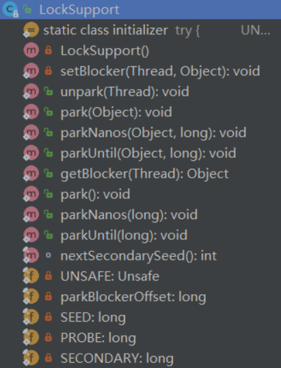
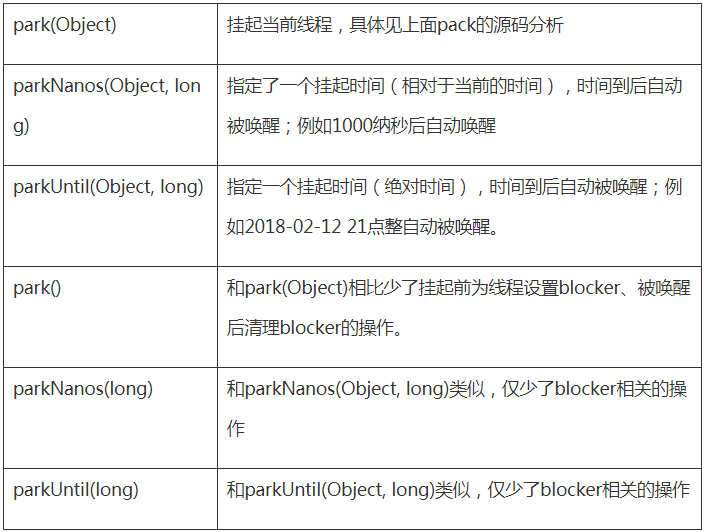

<!-- TOC -->

- [1、两个重点](#1两个重点)
    - [1、操作对象](#1操作对象)
    - [2、关于许可](#2关于许可)
- [2、源码](#2源码)
    - [1、pack时](#1pack时)
    - [2、unpack时](#2unpack时)
    - [3、与Object类的wait/notify机制相比，park/unpark有两个优点：](#3与object类的waitnotify机制相比parkunpark有两个优点)
- [3、Unsafe.park和Unsafe.unpark的底层实现原理](#3unsafepark和unsafeunpark的底层实现原理)
- [参考](#参考)

<!-- /TOC -->


Doug Lea 的神作concurrent包是基于AQS (AbstractQueuedSynchronizer)框架，AQS框架借助于两个类：`Unsafe(提供CAS操作)和LockSupport(提供park/unpark操作)`。因此，LockSupport可谓构建concurrent包的基础之一。


# 1、两个重点

## 1、操作对象

归根结底，LockSupport调用的Unsafe中的native代码： 

```java
public native void unpark(Thread jthread); 
public native void park(boolean isAbsolute, long time); 
```

两个函数声明清楚地说明了操作对象：park函数是将当前Thread阻塞，而unpark函数则是将另一个Thread唤醒。

与Object类的wait/notify机制相比，park/unpark有两个优点：

- 1、以thread为操作对象更符合阻塞线程的直观定义；
- 2、操作更精准，可以准确地唤醒某一个线程（notify随机唤醒一个线程，notifyAll唤醒所有等待的线程），增加了灵活性。

## 2、关于许可

在上面的文字中，我使用了阻塞和唤醒，是为了和wait/notify做对比。其实park/unpark的设计原理核心是“许可”。park是等待一个许可。unpark是为某线程提供一个许可。如果某线程A调用park，那么除非另外一个线程调用unpark(A)给A一个许可，否则线程A将阻塞在park操作上。

有一点比较难理解的，是unpark操作可以再park操作之前。也就是说，先提供许可。当某线程调用park时，已经有许可了，它就消费这个许可，然后可以继续运行。这其实是必须的。考虑最简单的生产者(Producer)消费者(Consumer)模型：Consumer需要消费一个资源，于是调用park操作等待；Producer则生产资源，然后调用unpark给予Consumer使用的许可。非常有可能的一种情况是，Producer先生产，这时候Consumer可能还没有构造好（比如线程还没启动，或者还没切换到该线程）。那么等Consumer准备好要消费时，显然这时候资源已经生产好了，可以直接用，那么park操作当然可以直接运行下去。如果没有这个语义，那将非常难以操作。


# 2、源码

类中的方法：



LockSupport通过许可（permit）实现挂起线程、唤醒挂起线程功能。可以按照以下逻辑理解：

## 1、pack时

如果线程的permit存在，那么线程不会被挂起，立即返回；如果线程的permit不存在，认为线程缺少permit，所以需要挂起等待permit。

```java
 public static void park(Object blocker) {
        //获取当前线程
        Thread t = Thread.currentThread();
        //设置线程的blocker对象
        setBlocker(t, blocker);
        //通过UNSAFE调用，挂起线程
        UNSAFE.park(false, 0L);
        //挂起的线程被唤醒以后，需要将阻塞的Blocker清理掉。
        setBlocker(t, null);
    }

```

解除方法：
- 其他线程以当前线程为参数，调用unpark(thread)方法
- 其他线程通过Thread#interrupt中断当前线程。


LockSupport中pack有多个版本，如下所示:




## 2、unpack时

如果线程的permit不存在，那么释放一个permit。因为有permit了，所以如果线程处于挂起状态，那么此线程会被线程调度器唤醒。如果线程的permit存在，permit也不会累加，看起来想什么事都没做一样。注意这一点和Semaphore是不同的。


## 3、与Object类的wait/notify机制相比，park/unpark有两个优点：

- 1、以thread为操作对象更符合阻塞线程的直观定义

- 2、操作更精准，可以准确地唤醒某一个线程（notify随机唤醒一个线程，notifyAll唤醒所有等待的线程），增加了灵活性。


# 3、Unsafe.park和Unsafe.unpark的底层实现原理


在Linux系统下，是用的Posix线程库pthread中的mutex（互斥量），condition（条件变量）来实现的。

mutex和condition保护了一个_counter的变量，当park时，这个变量被设置为0，当unpark时，这个变量被设置为1。


# 参考

- [关于LockSupport](https://www.cnblogs.com/zhizhizhiyuan/p/4966827.html)

- [LockSupport](https://yq.aliyun.com/articles/493552)