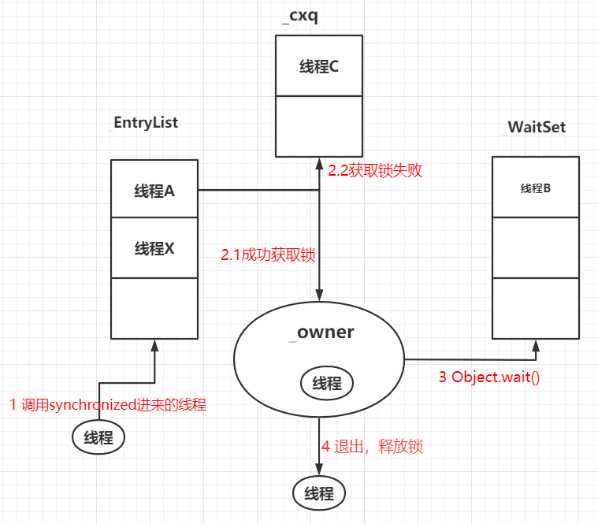
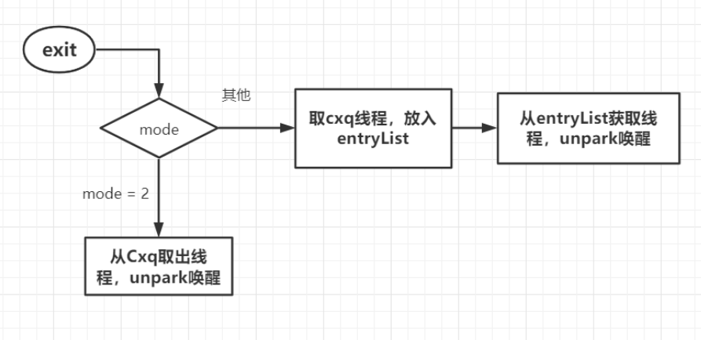
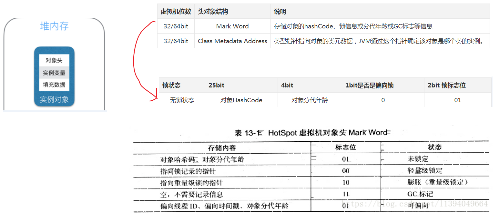
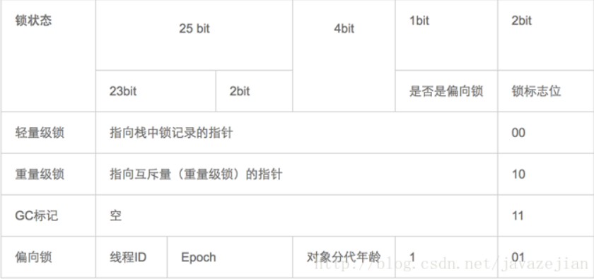

<!-- TOC -->

- [1、如何看到 synchronized 背后的“monitor 锁”？](#1如何看到-synchronized-背后的monitor-锁)
    - [1、获取和释放 monitor 锁的时机](#1获取和释放-monitor-锁的时机)
    - [2、用 javap 命令查看反汇编的结果](#2用-javap-命令查看反汇编的结果)
        - [1、同步代码块](#1同步代码块)
            - [1、ObjectMonitor对象](#1objectmonitor对象)
        - [2、同步方法](#2同步方法)
- [2、理解Java对象头与Monitor](#2理解java对象头与monitor)
- [4、关于synchronized需要了解的关键点](#4关于synchronized需要了解的关键点)
    - [1、synchronized的可重入性](#1synchronized的可重入性)
    - [2、线程中断与synchronized](#2线程中断与synchronized)
    - [3、等待唤醒机制与synchronized](#3等待唤醒机制与synchronized)
- [参考](#参考)

<!-- /TOC -->

线程安全是并发编程中的重要关注点，应该注意到的是，造成线程安全问题的主要诱因有两点，一是存在共享数据(也称临界资源)，二是存在多条线程共同操作共享数据。因此为了解决这个问题，我们可能需要这样一个方案，当存在多个线程操作共享数据时，需要保证同一时刻有且只有一个线程在操作共享数据，其他线程必须等到该线程处理完数据后再进行，这种方式有个高尚的名称叫`互斥锁`，即能达到互斥访问目的的锁，也就是说当一个共享数据被当前正在访问的线程加上互斥锁后，在同一个时刻，其他线程只能处于等待的状态，直到当前线程处理完毕释放该锁。在 Java 中，关键字 synchronized可以保证在同一个时刻，只有一个线程可以执行某个方法或者某个代码块(主要是对方法或者代码块中存在共享数据的操作)，同时我们还应该注意到synchronized另外一个重要的作用，synchronized可保证一个线程的变化(主要是共享数据的变化)被其他线程所看到（`保证可见性`，完全可以替代Volatile功能），这点确实也是很重要的。


众所周知 `synchronized` 关键字是解决并发问题常用解决方案，有以下三种使用方式:

- 同步普通方法，锁的是当前对象。
- 同步静态方法，锁的是当前 `Class` 对象。
- 同步块，锁的是 `()` 中的对象。


实现原理：`JVM` 是通过进入、退出对象监视器( `Monitor` )来实现对方法、同步块的同步的。其本质就是对一个对象监视器( `Monitor` )进行获取，而这个获取过程具有排他性从而达到了同一时刻只能一个线程访问的目的。而对于没有获取到锁的线程将会阻塞到方法入口处，直到获取锁的线程释放之后才能尝试继续获取锁。

`Java 虚拟机中的同步(Synchronization)基于进入和退出管程(Monitor)对象实现， 无论是显式同步(有明确的 monitorenter 和 monitorexit 指令,即同步代码块)还是隐式同步都是如此。在 Java 语言中，同步用的最多的地方可能是被 synchronized 修饰的同步方法。同步方法 并不是由 monitorenter 和 monitorexit 指令来实现同步的，而是由方法调用指令读取运行时常量池中方法的 ACC_SYNCHRONIZED 标志来隐式实现的.`


# 1、如何看到 synchronized 背后的“monitor 锁”？

总结：同步代码块是利用 monitorenter 和 monitorexit 指令实现的，而同步方法则是利用给flags添加 ACC_SYNCHRONIZED标记实现的。

## 1、获取和释放 monitor 锁的时机

我们都知道，最简单的同步方式就是利用 synchronized 关键字来修饰代码块或者修饰一个方法，那么这部分被保护的代码，在同一时刻就最多只有一个线程可以运行，而 synchronized 的背后正是利用 monitor 锁实现的。所以首先我们来看下获取和释放 monitor 锁的时机，每个 Java 对象都可以用作一个实现同步的锁，这个锁也被称为内置锁或 monitor 锁，获得 monitor 锁的唯一途径就是进入由这个锁保护的同步代码块或同步方法，线程在进入被 synchronized 保护的代码块之前，会自动获取锁，并且无论是正常路径退出，还是通过抛出异常退出，在退出的时候都会自动释放锁。

我们首先来看一个 synchronized 修饰方法的代码的例子：

```java
public synchronized void method() {
    method body
}
```


## 2、用 javap 命令查看反汇编的结果

JVM 实现 synchronized 方法和 synchronized 代码块的细节是不一样的，下面我们就分别来看一下两者的实现。

### 1、同步代码块

首先我们来看下同步代码块的实现，如代码所示。

```java
public class SynTest {
    public void synBlock() {
        synchronized (this) {
            System.out.println("xxx");
        }
    }
}
```

在 SynTest 类中的 synBlock 方法，包含一个同步代码块，synchronized 代码块中有一行代码打印了 xxx 字符串，下面我们来通过命令看下 synchronized 关键字到底做了什么事情：首先用 cd 命令切换到 SynTest.java 类所在的路径，然后执行 javac SynTest.java，于是就会产生一个名为 SynTest.class 的字节码文件，然后我们执行 javap -verbose SynTest.class，就可以看到对应的反汇编内容。

关键信息如下：

```java
public void synBlock();
    descriptor: ()V
    flags: ACC_PUBLIC
    Code:
      stack=2, locals=3, args_size=1
         0: aload_0
         1: dup
         2: astore_1
         3: monitorenter
         4: getstatic     #2                  // Field java/lang/System.out:Ljava/io/PrintStream;
         7: ldc           #3                      // String lagou
         9: invokevirtual #4               // Method java/io/PrintStream.println:(Ljava/lang/String;)V
        12: aload_1
        13: monitorexit
        14: goto          22
        17: astore_2
        18: aload_1
        19: monitorexit
        20: aload_2
        21: athrow
        22: return
```

从里面可以看出，synchronized 代码块实际上多了 monitorenter 和 monitorexit 指令，第3、13、19行指令分别对应的是 monitorenter 和 monitorexit。这里有一个 monitorenter，却有两个 monitorexit 指令的原因是，JVM 要保证每个 monitorenter 必须有与之对应的 monitorexit，monitorenter 指令被插入到同步代码块的开始位置，而 monitorexit 需要插入到方法正常结束处和异常处两个地方，这样就可以保证抛异常的情况下也能释放锁。

可以把执行 monitorenter 理解为加锁，执行 monitorexit 理解为释放锁，每个对象维护着一个记录着被锁次数的计数器。未被锁定的对象的该计数器为 0，我们来具体看一下 monitorenter 和 monitorexit 的含义：

1、monitorenter：执行 monitorenter 的线程尝试获得 monitor 的所有权，会发生以下这三种情况之一：

- a. 如果该 monitor 的计数为 0，则线程获得该 monitor 并将其计数设置为 1。然后，该线程就是这个 monitor 的所有者。

- b. 如果线程已经拥有了这个 monitor ，则它将重新进入，并且累加计数。

- c. 如果其他线程已经拥有了这个 monitor，那个这个线程就会被阻塞，直到这个 monitor 的计数变成为 0，代表这个 monitor 已经被释放了，于是当前这个线程就会再次尝试获取这个 monitor。

2、monitorexit：monitorexit 的作用是将 monitor 的计数器减 1，直到减为 0 为止。代表这个 monitor 已经被释放了，已经没有任何线程拥有它了，也就代表着解锁，所以，其他正在等待这个 monitor 的线程，此时便可以再次尝试获取这个 monitor 的所有权。


#### 1、ObjectMonitor对象

执行monitorenter指令时，线程会为锁对象关联一个ObjectMonitor对象

```cpp
objectMonitor.cpp
  ObjectMonitor() {
    _header       = NULL;
    _count        = 0;   \\用来记录获取该锁的线程数
    _waiters      = 0,
    _recursions   = 0;    \\锁的重入次数
    _object       = NULL;
    _owner        = NULL;  \\当前持有ObjectMonitor的线程
    _WaitSet      = NULL;  \\wait()方法调用后的线程等待队列
    _WaitSetLock  = 0 ;
    _Responsible  = NULL ;
    _succ         = NULL ;
    _cxq          = NULL ; \\阻塞等待队列
    FreeNext      = NULL ;
    _EntryList    = NULL ; \\synchronized 进来线程的排队队列
    _SpinFreq     = 0 ;
    _SpinClock    = 0 ;  \\自旋计算
    OwnerIsThread = 0 ;
  }
```

- 每个线程都有两个ObjectMonitor对象列表，分别为free和used列表，如果当前free列表为空，线程将向全局global list请求分配ObjectMonitor

- ObjectMonitor的`owner、WaitSet、Cxq、EntryList`这几个属性比较关键。WaitSet、Cxq、EntryList的队列元素是包装线程后的对象-ObjectWaiter；而获取owner的线程，既为获得锁的线程


线程遇到synchronized同步时，先会进入EntryList队列中，然后尝试把owner变量设置为当前线程，同时monitor中的计数器count加1，即获得对象锁。否则通过尝试自旋一定次数加锁，失败则进入Cxq队列阻塞等待



线程执行完毕将释放持有的owner，owner变量恢复为null，count自减1，以便其他线程进入获取锁



`synchronized是可重入，非公平锁，因为entryList的线程会先自旋尝试加锁，而不是加入cxq排队等待，不公平`


### 2、同步方法

方法级的同步是隐式，即无需通过字节码指令来控制的，`它实现在方法调用和返回操作之中`。JVM可以从方法常量池中的方法表结构(method_info Structure) 中的 ACC_SYNCHRONIZED 访问标志区分一个方法是否同步方法。当方法调用时，调用指令将会 检查方法的 ACC_SYNCHRONIZED 访问标志是否被设置，如果设置了，执行线程将先持有monitor（虚拟机规范中用的是`管程`一词）， 然后再执行方法，最后再方法完成(无论是正常完成还是非正常完成)时释放monitor。在方法执行期间，执行线程持有了monitor，其他任何线程都无法再获得同一个monitor。如果一个同步方法执行期间抛 出了异常，并且在方法内部无法处理此异常，那这个同步方法所持有的monitor将在异常抛到同步方法之外时自动释放。下面我们看看字节码层面如何实现：

```java
public synchronized void synMethod() {
 
}
```

对应的反汇编指令如下所示。

```java
public synchronized void synMethod();
    descriptor: ()V
    flags: ACC_PUBLIC, ACC_SYNCHRONIZED
    Code:
      stack=0, locals=1, args_size=1
         0: return
      LineNumberTable:
        line 16: 0
```

可以看出，被 synchronized 修饰的方法会有一个 ACC_SYNCHRONIZED 标志。当某个线程要访问某个方法的时候，会首先检查方法是否有 ACC_SYNCHRONIZED 标志，如果有则需要先获得 monitor 锁，然后才能开始执行方法，方法执行之后再释放 monitor 锁。其他方面， synchronized 方法和刚才的 synchronized 代码块是很类似的，例如这时如果其他线程来请求执行方法，也会因为无法获得 monitor 锁而被阻塞。


同时我们还必须注意到的是在Java早期版本中，synchronized属于重量级锁，效率低下，因为`监视器锁（monitor）是依赖于底层的操作系统的Mutex Lock来实现的`，而操作系统实现线程之间的切换时需要从用户态转换到核心态，这个状态之间的转换需要相对比较长的时间，时间成本相对较高，这也是为什么早期的synchronized效率低的原因。庆幸的是在Java 6之后Java官方对从JVM层面对synchronized较大优化，所以现在的synchronized锁效率也优化得很不错了，Java 6之后，为了减少获得锁和释放锁所带来的性能消耗，引入了轻量级锁和偏向锁.


# 2、理解Java对象头与Monitor

在JVM中，对象在内存中的布局分为三块区域：`对象头、实例数据和对齐填充`。如下：

- 实例变量：存放类的属性数据信息，包括父类的属性信息，如果是数组的实例部分还包括数组的长度，这部分内存按4字节对齐。

- 填充数据：由于虚拟机要求对象起始地址必须是8字节的整数倍。填充数据不是必须存在的，仅仅是为了字节对齐，这点了解即可。

- 而对于顶部，则是Java头对象，它实现synchronized的锁对象的基础，这点我们重点分析它，一般而言，`synchronized使用的锁对象是存储在Java对象头里的`，jvm中采用2个字来存储对象头(如果对象是数组则会分配3个字，多出来的1个字记录的是数组长度)，其主要结构是由Mark Word 和 Class Metadata Address 组成。

其中Mark Word在默认情况下存储着对象的HashCode、分代年龄、锁标记位等



由于对象头的信息是与对象自身定义的数据没有关系的额外存储成本，因此考虑到JVM的空间效率，Mark Word 被设计成为一个非固定的数据结构，以便存储更多有效的数据，它会根据对象本身的状态复用自己的存储空间，如32位JVM下，除了上述列出的Mark Word默认存储结构外，还有如下可能变化的结构：




[后三位变化流程]

-   无锁状态：1  01
- 偏向锁状态：1  01

备注：其中这1bit的含义为是否可以偏向锁，0不可，1可以。初始为1，撤销偏向锁后设置为0；

[只有重量级锁才会用到monitor监视器对象，MarkWord中为指向monitor的指针]

其中轻量级锁和偏向锁是Java 6 对 synchronized 锁进行优化后新增加的，稍后我们会简要分析。这里我们主要分析一下重量级锁也就是通常说synchronized的对象锁，锁标识位为10，其中指针指向的是monitor对象（也称为管程或监视器锁）的起始地址。每个对象都存在着一个 monitor 与之关联，对象与其 monitor 之间的关系有存在多种实现方式，如monitor可以与对象一起创建销毁或当线程试图获取对象锁时自动生成，但当一个 monitor 被某个线程持有后，它便处于锁定状态。在Java虚拟机(HotSpot)中，monitor是由ObjectMonitor实现的，其主要数据结构如下（位于HotSpot虚拟机源码ObjectMonitor.hpp文件，C++实现的）

```java
ObjectMonitor() {
    _header       = NULL;
    _count        = 0; //记录个数
    _waiters      = 0,
    _recursions   = 0;
    _object       = NULL;
    _owner        = NULL;
    _WaitSet      = NULL; //处于wait状态的线程，会被加入到_WaitSet
    _WaitSetLock  = 0 ;
    _Responsible  = NULL ;
    _succ         = NULL ;
    _cxq          = NULL ;
    FreeNext      = NULL ;
    _EntryList    = NULL ; //处于等待锁block状态的线程，会被加入到该列表
    _SpinFreq     = 0 ;
    _SpinClock    = 0 ;
    OwnerIsThread = 0 ;
  }
ObjectMonitor中有两个队列
```

，_WaitSet 和 _EntryList，用来保存ObjectWaiter对象列表( 每个等待锁的线程都会被封装成ObjectWaiter对象)，_owner指向持有ObjectMonitor对象的线程，当多个线程同时访问一段同步代码时，首先会进入 _EntryList 集合，当线程获取到对象的monitor 后进入 _Owner 区域并把monitor中的owner变量设置为当前线程同时monitor中的计数器count加1，若线程调用 wait() 方法，将释放当前持有的monitor，owner变量恢复为null，count自减1，同时该线程进入 WaitSe t集合中等待被唤醒。若当前线程执行完毕也将释放monitor(锁)并复位变量的值，以便其他线程进入获取monitor(锁)。如下图所示


由此看来，monitor对象存在于每个Java对象的对象头中(存储的指针的指向)，synchronized锁便是通过这种方式获取锁的，也是为什么Java中任意对象可以作为锁的原因，同时也是notify/notifyAll/wait等方法存在于顶级对象Object中的原因(关于这点稍后还会进行分析)，ok~，有了上述知识基础后，下面我们将进一步分析synchronized在字节码层面的具体语义实现。

[当调用notify方法通知的是哪个队列？WaitSet还是EntryList，应该是WaitSet?]


# 4、关于synchronized需要了解的关键点


## 1、synchronized的可重入性

从互斥锁的设计上来说，当一个线程试图操作一个由其他线程持有的对象锁的临界资源时，将会处于阻塞状态，但当一个线程再次请求自己持有对象锁的临界资源时，这种情况属于重入锁，请求将会成功，在java中synchronized是基于原子性的内部锁机制，是可重入的，因此在一个线程调用synchronized方法的同时在其方法体内部调用该对象另一个synchronized方法，也就是说一个线程得到一个对象锁后再次请求该对象锁，是允许的，这就是synchronized的可重入性。如下：

```java
public class AccountingSync implements Runnable{
    static AccountingSync instance=new AccountingSync();
    static int i=0;
    static int j=0;
    @Override
    public void run() {
        for(int j=0;j<1000000;j++){

            //this,当前实例对象锁
            synchronized(this){
                i++;
                increase();//synchronized的可重入性
            }
        }
    }
    
    public synchronized void increase(){
        j++;
    }


    public static void main(String[] args) throws InterruptedException {
        Thread t1=new Thread(instance);
        Thread t2=new Thread(instance);
        t1.start();t2.start();
        t1.join();t2.join();
        System.out.println(i);
    }
}
```

正如代码所演示的，在获取当前实例对象锁后进入synchronized代码块执行同步代码，并在代码块中调用了当前实例对象的另外一个synchronized方法，再次请求当前实例锁时，将被允许，进而执行方法体代码，这就是重入锁最直接的体现，需要特别注意另外一种情况，当子类继承父类时，子类也是可以通过可重入锁调用父类的同步方法。注意由于synchronized是基于monitor实现的，因此每次重入，monitor中的计数器仍会加1。

## 2、线程中断与synchronized

>>> 2.1、线程中断

正如中断二字所表达的意义，在线程运行(run方法)中间打断它，在Java中，提供了以下3个有关线程中断的方法

```java
//中断线程（实例方法）
public void Thread.interrupt();

//判断线程是否被中断（实例方法）
public boolean Thread.isInterrupted();

//判断是否被中断并清除当前中断状态（静态方法）
public static boolean Thread.interrupted();
```

当一个线程处于被阻塞状态或者试图执行一个阻塞操作时，使用Thread.interrupt()方式中断该线程，注意此时将会抛出一个InterruptedException的异常，同时中断状态将会被复位(由中断状态改为非中断状态)，如下代码将演示该过程：

```java
public class InterruputSleepThread3 {
    public static void main(String[] args) throws InterruptedException {
        Thread t1 = new Thread() {
            @Override
            public void run() {
                //while在try中，通过异常中断就可以退出run循环
                try {
                    while (true) {
                        //当前线程处于阻塞状态，异常必须捕捉处理，无法往外抛出
                        TimeUnit.SECONDS.sleep(2);
                    }
                } catch (InterruptedException e) {
                    System.out.println("Interruted When Sleep");
                    boolean interrupt = this.isInterrupted();
                    //中断状态被复位
                    System.out.println("interrupt:"+interrupt);
                }
            }
        };
        t1.start();
        TimeUnit.SECONDS.sleep(2);
        //中断处于阻塞状态的线程
        t1.interrupt();

        /**
         * 输出结果:
           Interruted When Sleep
           interrupt:false
         */
    }
}
```

如上述代码所示，我们创建一个线程，并在线程中调用了sleep方法从而使用线程进入阻塞状态，启动线程后，调用线程实例对象的interrupt方法中断阻塞异常，并抛出InterruptedException异常，此时中断状态也将被复位。这里有些人可能会诧异，为什么不用Thread.sleep(2000);而是用TimeUnit.SECONDS.sleep(2);其实原因很简单，前者使用时并没有明确的单位说明，而后者非常明确表达秒的单位，事实上后者的内部实现最终还是调用了Thread.sleep(2000);，但为了编写的代码语义更清晰，建议使用TimeUnit.SECONDS.sleep(2);的方式，注意TimeUnit是个枚举类型。ok~，除了阻塞中断的情景，我们还可能会遇到处于运行期且非阻塞的状态的线程，这种情况下，直接调用Thread.interrupt()中断线程是不会得到任响应的，如下代码，将无法中断非阻塞状态下的线程：

```java

public class InterruputThread {
    public static void main(String[] args) throws InterruptedException {
        Thread t1=new Thread(){
            @Override
            public void run(){
                while(true){
                    System.out.println("未被中断");
                }
            }
        };
        t1.start();
        TimeUnit.SECONDS.sleep(2);
        t1.interrupt();

        /**
         * 输出结果(无限执行):
             未被中断
             未被中断
             未被中断
             ......
         */
    }
}
```

虽然我们调用了interrupt方法，但线程t1并未被中断，`因为处于非阻塞状态的线程需要我们手动进行中断检测并结束程序`，改进后代码如下：

```java
public class InterruputThread {
    public static void main(String[] args) throws InterruptedException {
        Thread t1=new Thread(){
            @Override
            public void run(){
                while(true){
                    //判断当前线程是否被中断
                    if (this.isInterrupted()){
                        System.out.println("线程中断");
                        break;
                    }
                }

                System.out.println("已跳出循环,线程中断!");
            }
        };
        t1.start();
        TimeUnit.SECONDS.sleep(2);
        t1.interrupt();

        /**
         * 输出结果:
            线程中断
            已跳出循环,线程中断!
         */
    }
}

```

是的，我们在代码中使用了实例方法isInterrupted判断线程是否已被中断，如果被中断将跳出循环以此结束线程。综合所述，可以简单总结一下中断两种情况，

- 一种是当线程处于阻塞状态或者试图执行一个阻塞操作时，我们可以使用实例方法interrupt()进行线程中断，执行中断操作后将会抛出interruptException异常(该异常必须捕捉无法向外抛出)并将中断状态复位;
- 另外一种是当线程处于运行状态时，我们也可调用实例方法interrupt()进行线程中断，但同时必须手动判断中断状态，并编写中断线程的代码(其实就是结束run方法体的代码)。有时我们在编码时可能需要兼顾以上两种情况，那么就可以如下编写：

```java
public void run(){
    try {
    //判断当前线程是否已中断,注意interrupted方法是静态的,执行后会对中断状态进行复位
    while (!Thread.interrupted()) {
        TimeUnit.SECONDS.sleep(2);
    }
    } catch (InterruptedException e) {
    
    }
}
```

>>> 中断与synchronized

事实上线程的中断操作对于正在等待获取的锁对象的synchronized方法或者代码块并不起作用，也就是对于synchronized来说，`如果一个线程在等待锁，那么结果只有两种，要么它获得这把锁继续执行，要么它就保存等待`，即使调用中断线程的方法，也不会生效。演示代码如下


```java

/**
 * Created by zejian on 2017/6/2.
 * Blog : http://blog.csdn.net/javazejian [原文地址,请尊重原创]
 */
public class SynchronizedBlocked implements Runnable{

    public synchronized void f() {
        System.out.println("Trying to call f()");
        while(true) // Never releases lock
            Thread.yield();
    }

    /**
     * 在构造器中创建新线程并启动获取对象锁
     */
    public SynchronizedBlocked() {
        //该线程已持有当前实例锁
        new Thread() {
            public void run() {
                f(); // Lock acquired by this thread
            }
        }.start();
    }
    public void run() {
        //中断判断
        while (true) {
            if (Thread.interrupted()) {
                System.out.println("中断线程!!");
                break;
            } else {
                f();
            }
        }
    }


    public static void main(String[] args) throws InterruptedException {
        SynchronizedBlocked sync = new SynchronizedBlocked();
        Thread t = new Thread(sync);
        //启动后调用f()方法,无法获取当前实例锁处于等待状态
        t.start();
        TimeUnit.SECONDS.sleep(1);
        //中断线程,无法生效
        t.interrupt();
    }
}
```

我们在SynchronizedBlocked构造函数中创建一个新线程并启动获取调用f()获取到当前实例锁，由于SynchronizedBlocked自身也是线程，启动后在其run方法中也调用了f()，但由于对象锁被其他线程占用，导致t线程只能等到锁，此时我们调用了t.interrupt();但并不能中断线程。

## 3、等待唤醒机制与synchronized

所谓等待唤醒机制本篇主要指的是notify/notifyAll和wait方法，在使用这3个方法时，`必须处于synchronized代码块或者synchronized方法中，否则就会抛出IllegalMonitorStateException异常`，这是因为调用这几个方法前必须拿到当前对象的监视器monitor对象，也就是说notify/notifyAll和wait方法依赖于monitor对象，在前面的分析中，我们知道monitor 存在于对象头的Mark Word 中(存储monitor引用指针)，而synchronized关键字可以获取 monitor ，这也就是为什么notify/notifyAll和wait方法必须在synchronized代码块或者synchronized方法调用的原因。

```java
synchronized (obj) {
       obj.wait();
       obj.notify();
       obj.notifyAll();            
 }
```

需要特别理解的一点是，与sleep方法不同的是wait方法调用完成后，线程将被暂停，但wait方法将会释放当前持有的监视器锁(monitor)，直到有线程调用notify/notifyAll方法后方能继续执行，而sleep方法只让线程休眠并不释放锁。同时notify/notifyAll方法调用后，并不会马上释放监视器锁，而是在相应的synchronized(){}/synchronized方法执行结束后才自动释放锁。


# 参考

- [Synchronized 关键字原理](https://blog.csdn.net/weixin_36759405/article/details/83034386)

- [深入理解Java并发之synchronized实现原理](https://segmentfault.com/a/1190000009912198)

- [synchronized原理解析](https://blog.csdn.net/l1394049664/article/details/81450055)

- [基础篇：详解锁原理，volatile+cas、synchronized的底层实现](https://www.cnblogs.com/cscw/p/13769404.html)

- [Java并发编程：Synchronized及其实现原理](https://www.cnblogs.com/paddix/p/5367116.html)
