<!-- TOC -->

- [1、synchronized锁优化](#1synchronized锁优化)
    - [1、偏向锁(把线程id通过cas放到对象头中)](#1偏向锁把线程id通过cas放到对象头中)
        - [1、偏向锁获取过程](#1偏向锁获取过程)
        - [2、偏向锁的释放](#2偏向锁的释放)
    - [2、轻量级锁(把对象头的Mark Word通过cas复制到线程栈帧中，在对象头方一个指针)](#2轻量级锁把对象头的mark-word通过cas复制到线程栈帧中在对象头方一个指针)
        - [1、加锁过程](#1加锁过程)
        - [2、解锁过程](#2解锁过程)
    - [3、重量级锁](#3重量级锁)
    - [4、自旋锁](#4自旋锁)
    - [5、锁粗化（Lock Coarsening）](#5锁粗化lock-coarsening)
    - [6、锁消除](#6锁消除)
- [参考](#参考)

<!-- /TOC -->


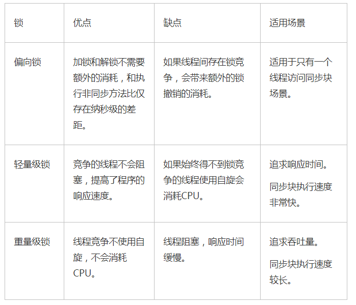


# 1、synchronized锁优化

锁的状态总共有四种，`无锁状态、偏向锁、轻量级锁和重量级锁`。随着锁的竞争，锁可以从偏向锁升级到轻量级锁，再升级的重量级锁，但是锁的升级是单向的，也就是说只能从低到高升级，不会出现锁的降级。`JDK 1.6中默认是开启偏向锁和轻量级锁的`，我们也可以通过-XX:-UseBiasedLocking来禁用偏向锁。锁的状态保存在对象的头文件中，以32位的JDK为例：

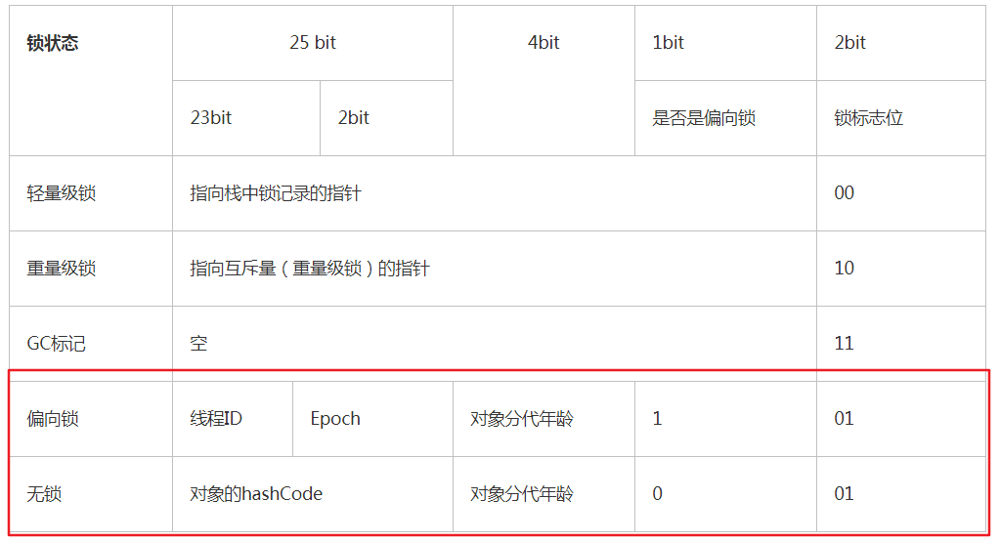


偏向锁/轻量级锁/重量级锁，这三种锁特指 synchronized 锁的状态，通过在对象头中的` mark word`来表明锁的状态。


“轻量级”是相对于使用操作系统互斥量来实现的传统锁而言的。但是，首先需要强调一点的是，轻量级锁并不是用来代替重量级锁的，它的本意是在没有多线程竞争的前提下，减少传统的重量级锁使用产生的性能消耗。在解释轻量级锁的执行过程之前，先明白一点，轻量级锁所适应的场景是线程交替执行同步块的情况，如果存在同一时间访问同一锁的情况，就会导致轻量级锁膨胀为重量级锁。


> 偏向锁的获取和释放流程

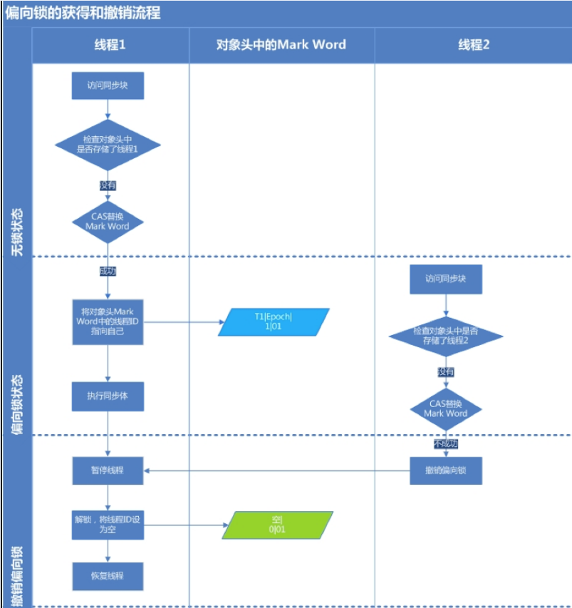


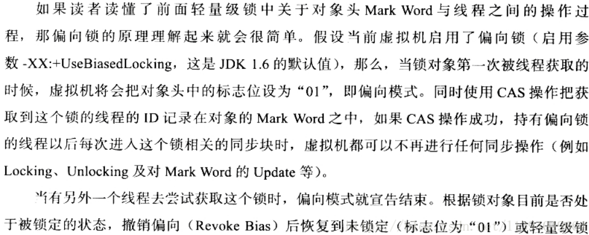


> 偏向锁转化为轻量级锁的过程

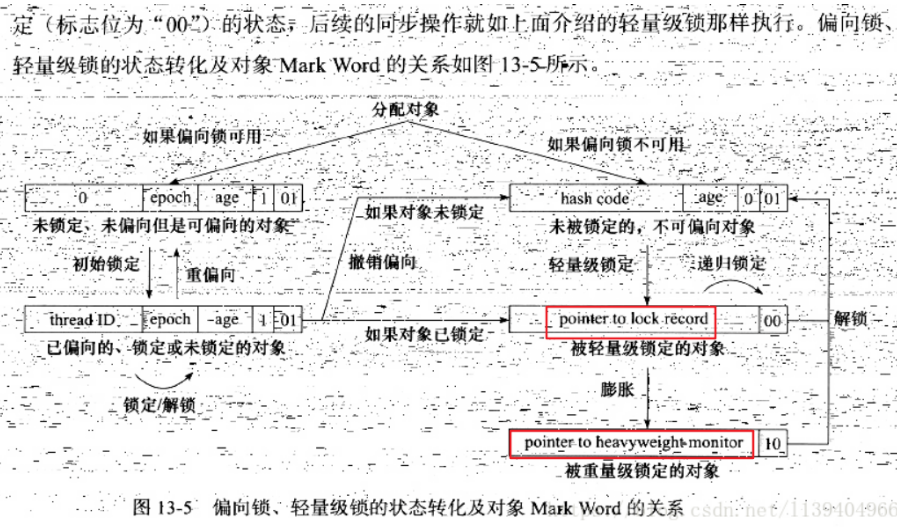


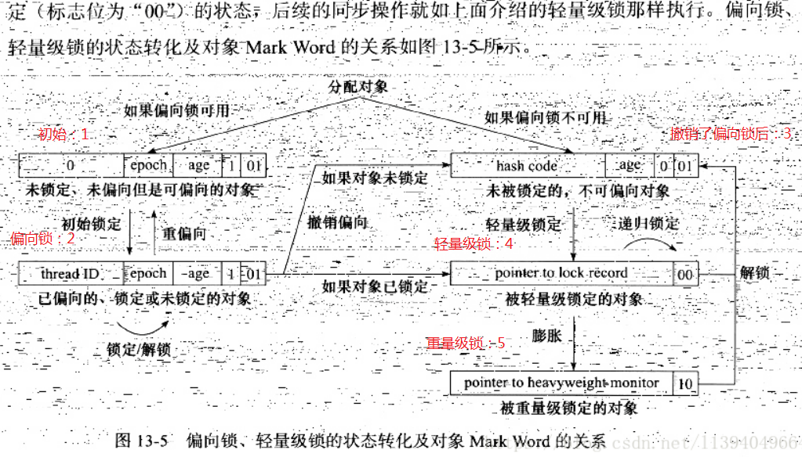

> 无锁状态变为轻量级锁的过程

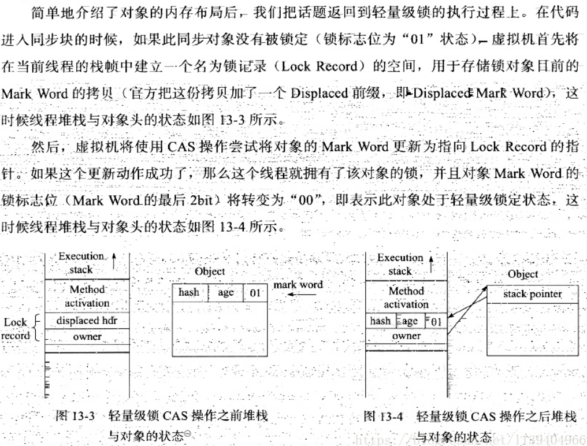

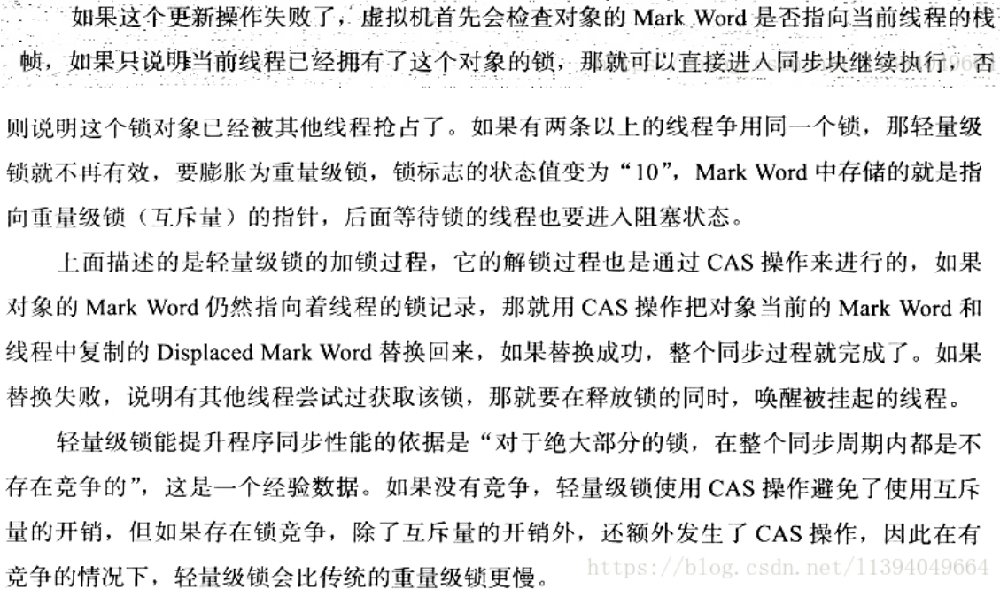

> 轻量级锁变为重量级锁的过程

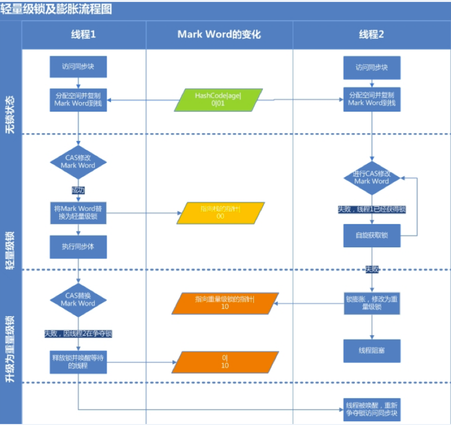


## 1、偏向锁(把线程id通过cas放到对象头中)

`引入偏向锁是为了在无多线程竞争的情况下尽量减少不必要的轻量级锁执行路径，因为轻量级锁的获取及释放依赖多次CAS原子指令，而偏向锁只需要在置换ThreadID的时候依赖一次CAS原子指令（由于一旦出现多线程竞争的情况就必须撤销偏向锁，所以偏向锁的撤销操作的性能损耗必须小于节省下来的CAS原子指令的性能消耗）。上面说过，轻量级锁是为了在线程交替执行同步块时提高性能，而偏向锁则是在只有一个线程执行同步块时进一步提高性能。`

偏向锁的特征是:`锁不存在多线程竞争，并且应由一个线程多次获得锁。`当线程访问同步块时，会使用 `CAS` 将线程 ID 更新到锁对象的 `Mark Word` 中，如果更新成功则获得偏向锁，并且之后每次进入这个对象锁相关的同步块时都不需要再次获取锁了。


偏向锁是Java 6之后加入的新锁，它是一种针对加锁操作的优化手段，经过研究发现，`在大多数情况下，锁不仅不存在多线程竞争，而且总是由同一线程多次获得，因此为了减少同一线程获取锁(会涉及到一些CAS操作,耗时)的代价而引入偏向锁`。偏向锁的核心思想是，如果一个线程获得了锁，那么锁就进入偏向模式，此时Mark Word 的结构也变为偏向锁结构，当这个线程再次请求锁时，无需再做任何同步操作，即获取锁的过程，这样就省去了大量有关锁申请的操作，从而也就提供程序的性能。所以，`对于没有锁竞争的场合，偏向锁有很好的优化效果，毕竟极有可能连续多次是同一个线程申请相同的锁`。但是对于锁竞争比较激烈的场合，偏向锁就失效了，因为这样场合极有可能每次申请锁的线程都是不相同的，因此这种场合下不应该使用偏向锁，否则会得不偿失，需要注意的是，偏向锁失败后，并不会立即膨胀为重量级锁，而是先升级为轻量级锁。下面我们接着了解轻量级锁。


如果自始至终，对于这把锁都不存在竞争，那么其实就没必要上锁，只需要打个标记就行了，这就是偏向锁的思想。一个对象被初始化后，还没有任何线程来获取它的锁时，那么它就是可偏向的，当有第一个线程来访问它并尝试获取锁的时候，它就将这个线程记录下来，以后如果尝试获取锁的线程正是偏向锁的拥有者，就可以直接获得锁，开销很小，性能最好。


> 释放锁

当有另外一个线程获取这个锁时，持有偏向锁的线程就会释放锁，释放时会等待全局安全点(这一时刻没有字节码运行)，接着会暂停拥有偏向锁的线程，根据锁对象目前是否被锁来判定将对象头中的 `Mark Word` 设置为无锁或者是轻量锁状态。

偏向锁可以提高带有同步却没有竞争的程序性能，但如果程序中大多数锁都存在竞争时，那偏向锁就起不到太大作用。可以使用 `-XX:-UseBiasedLocking` 来关闭偏向锁，并默认进入轻量锁。

### 1、偏向锁获取过程

- 1、访问Mark Word中偏向锁的标识是否设置成1，锁标志位是否为01——确认为可偏向状态。

- 2、如果为可偏向状态，则测试线程ID是否指向当前线程，如果是，进入步骤（5），否则进入步骤（3）。

- 3、如果线程ID并未指向当前线程，则通过CAS操作竞争锁。如果竞争成功，则将Mark Word中线程ID设置为当前线程ID，然后执行（5）；如果竞争失败，执行（4）。

- 4、如果CAS获取偏向锁失败，则表示有竞争。当到达全局安全点（safepoint）时获得偏向锁的线程被挂起，偏向锁升级为轻量级锁，然后被阻塞在安全点的线程继续往下执行同步代码。

- 5、执行同步代码。

### 2、偏向锁的释放

偏向锁的撤销在上述第四步骤中有提到。偏向锁只有遇到其他线程尝试竞争偏向锁时，持有偏向锁的线程才会释放锁，线程不会主动去释放偏向锁。偏向锁的撤销，需要等待全局安全点（在这个时间点上没有字节码正在执行），它会首先暂停拥有偏向锁的线程，判断锁对象是否处于被锁定状态，撤销偏向锁后恢复到未锁定（标志位为“01”）或轻量级锁（标志位为“00”）的状态。

## 2、轻量级锁(把对象头的Mark Word通过cas复制到线程栈帧中，在对象头方一个指针)

倘若偏向锁失败，虚拟机并不会立即升级为重量级锁，它还会尝试使用一种称为轻量级锁的优化手段(1.6之后加入的)，此时Mark Word 的结构也变为轻量级锁的结构。轻量级锁能够提升程序性能的依据是“对绝大部分的锁，在整个同步周期内都不存在竞争”，注意这是经验数据。需要了解的是，轻量级锁所适应的场景是线程交替执行同步块的场合，如果存在同一时间访问同一锁的场合，就会导致轻量级锁膨胀为重量级锁。


JVM 开发者发现在很多情况下，synchronized 中的代码是被多个线程交替执行的，而不是同时执行的，也就是说并不存在实际的竞争，或者是只有短时间的锁竞争，用 CAS 就可以解决，这种情况下，用完全互斥的重量级锁是没必要的。`轻量级锁是指当锁原来是偏向锁的时候，被另一个线程访问，说明存在竞争，那么偏向锁就会升级为轻量级锁，线程会通过自旋的形式尝试获取锁，而不会陷入阻塞。`

问题：自旋多久会升级为重量级锁？


当代码进入同步块时，如果同步对象为无锁状态时，当前线程会在栈帧中创建一个锁记录(`Lock Record`)区域，同时将锁对象的对象头中 `Mark Word` 拷贝到锁记录中，再尝试使用 `CAS` 将 `Mark Word` 更新为指向锁记录的指针。

如果更新**成功**，当前线程就获得了锁。

如果更新**失败** `JVM` 会先检查锁对象的 `Mark Word` 是否指向当前线程的锁记录。

如果是则说明当前线程拥有锁对象的锁，可以直接进入同步块。

不是则说明有其他线程抢占了锁，如果存在多个线程同时竞争一把锁，**轻量锁就会膨胀为重量锁**。

> 解锁

轻量锁的解锁过程也是利用 `CAS` 来实现的，会尝试锁记录替换回锁对象的 `Mark Word` 。如果替换成功则说明整个同步操作完成，失败则说明有其他线程尝试获取锁，这时就会唤醒被挂起的线程(此时已经膨胀为`重量锁`)

轻量锁能提升性能的原因是：认为大多数锁在整个同步周期都不存在竞争，所以使用 `CAS` 比使用互斥开销更少。但如果锁竞争激烈，轻量锁就不但有互斥的开销，还有 `CAS` 的开销，甚至比重量锁更慢。


### 1、加锁过程

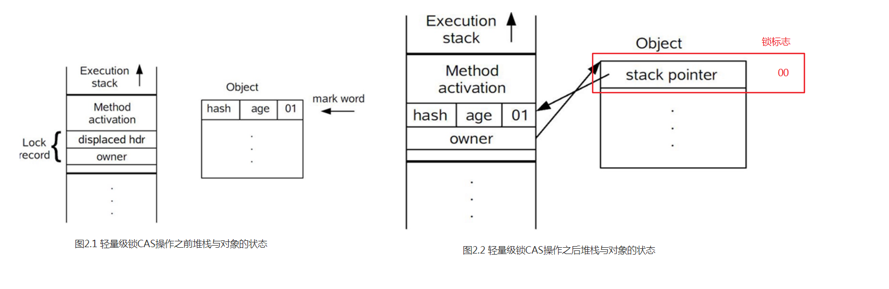

- 1、在代码进入同步块的时候，如果同步对象锁状态为无锁状态（锁标志位为“01”状态，是否为偏向锁为“0”），虚拟机首先将在当前线程的栈帧中建立一个名为锁记录（Lock Record）的空间，用于存储锁对象目前的Mark Word的拷贝，官方称之为 Displaced Mark Word。这时候线程堆栈与对象头的状态如图2.1所示。

- 2、拷贝对象头中的Mark Word复制到锁记录中。

- 3、拷贝成功后，虚拟机将使用CAS操作尝试将对象的Mark Word更新为指向Lock Record的指针，并将Lock record里的owner指针指向object mark word。如果更新成功，则执行步骤（3），否则执行步骤（4）。

- 4、如果这个更新动作成功了，那么这个线程就拥有了该对象的锁，并且对象Mark Word的锁标志位设置为“00”，即表示此对象处于轻量级锁定状态，这时候线程堆栈与对象头的状态如图2.2所示。

- 5、如果这个更新操作失败了，虚拟机首先会检查对象的Mark Word是否指向当前线程的栈帧，如果是就说明当前线程已经拥有了这个对象的锁，那就可以直接进入同步块继续执行。否则说明多个线程竞争锁，轻量级锁就要膨胀为重量级锁，锁标志的状态值变为“10”，Mark Word中存储的就是指向重量级锁（互斥量）的指针，后面等待锁的线程也要进入阻塞状态。 而当前线程便尝试使用自旋来获取锁，自旋就是为了不让线程阻塞，而采用循环去获取锁的过程。


### 2、解锁过程

- 1、通过CAS操作尝试把线程中复制的Displaced Mark Word对象替换当前的Mark Word。

- 2、如果替换成功，整个同步过程就完成了。

- 3、如果替换失败，说明有其他线程尝试过获取该锁（此时锁已膨胀），那就要在释放锁的同时，唤醒被挂起的线程。


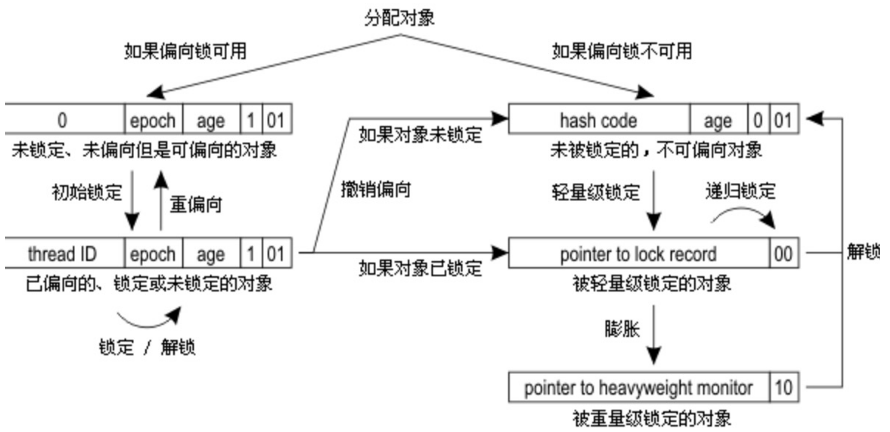


## 3、重量级锁

重量级锁是互斥锁，它是利用操作系统的同步机制实现的，所以开销相对比较大。当多个线程直接有实际竞争，且锁竞争时间长的时候，轻量级锁不能满足需求，锁就会膨胀为重量级锁。重量级锁会让其他申请却拿不到锁的线程进入阻塞状态。


你可以发现锁升级的路径：`无锁→偏向锁→轻量级锁→重量级锁`。

综上所述，偏向锁性能最好，可以避免执行 CAS 操作。而轻量级锁利用自旋和 CAS 避免了重量级锁带来的线程阻塞和唤醒，性能中等。重量级锁则会把获取不到锁的线程阻塞，性能最差。


## 4、自旋锁

轻量级锁失败后，虚拟机为了避免线程真实地在操作系统层面挂起，还会进行一项称为自旋锁的优化手段。这是基于在大多数情况下，线程持有锁的时间都不会太长，如果直接挂起操作系统层面的线程可能会得不偿失，毕竟操作系统实现线程之间的切换时需要从用户态转换到核心态，这个状态之间的转换需要相对比较长的时间，时间成本相对较高，因此自旋锁会假设在不久将来，当前的线程可以获得锁，因此虚拟机会让当前想要获取锁的线程做几个空循环(这也是称为自旋的原因)，一般不会太久，可能是50个循环或100循环，在经过若干次循环后，如果得到锁，就顺利进入临界区。如果还不能获得锁，那就会将线程在操作系统层面挂起，这就是自旋锁的优化方式，这种方式确实也是可以提升效率的。最后没办法也就只能升级为重量级锁了。

轻量级锁在使用 `CAS` 时，如果操作失败，`CAS` 会自旋再次尝试。由于自旋是需要消耗 `CPU` 资源的，所以如果长期自旋就白白浪费了 `CPU`。`JDK1.6`加入了适应性自旋:如果某个锁自旋很少成功获得，那么下一次就会减少自旋。


## 5、锁粗化（Lock Coarsening）

锁粗化的概念应该比较好理解，就是将多次连接在一起的加锁、解锁操作合并为一次，将多个连续的锁扩展成一个范围更大的锁。举个例子：

```java
package com.paddx.test.string;

public class StringBufferTest {
    StringBuffer stringBuffer = new StringBuffer();

    public void append(){
        stringBuffer.append("a");
        stringBuffer.append("b");
        stringBuffer.append("c");
    }
}
```

这里每次调用stringBuffer.append方法都需要加锁和解锁，如果虚拟机检测到有一系列连串的对同一个对象加锁和解锁操作，就会将其合并成一次范围更大的加锁和解锁操作，即在第一次append方法时进行加锁，最后一次append方法结束后进行解锁。

## 6、锁消除

消除锁是虚拟机另外一种锁的优化，这种优化更彻底，Java虚拟机在JIT编译时(可以简单理解为当某段代码即将第一次被执行时进行编译，又称即时编译)，通过对运行上下文的扫描，去除不可能存在共享资源竞争的锁，通过这种方式消除没有必要的锁，可以节省毫无意义的请求锁时间，如下StringBuffer的append是一个同步方法，但是在add方法中的StringBuffer属于一个局部变量，并且不会被其他线程所使用，因此StringBuffer不可能存在共享资源竞争的情景，JVM会自动将其锁消除。

```java
/**
 * Created by zejian on 2017/6/4.
 * Blog : http://blog.csdn.net/javazejian [原文地址,请尊重原创]
 * 消除StringBuffer同步锁
 */
public class StringBufferRemoveSync {

    public void add(String str1, String str2) {
        //StringBuffer是线程安全,由于sb只会在append方法中使用,不可能被其他线程引用
        //因此sb属于不可能共享的资源,JVM会自动消除内部的锁
        StringBuffer sb = new StringBuffer();
        sb.append(str1).append(str2);
    }

    public static void main(String[] args) {
        StringBufferRemoveSync rmsync = new StringBufferRemoveSync();
        for (int i = 0; i < 10000000; i++) {
            rmsync.add("abc", "123");
        }
    }

}

```


# 参考

- [Java并发编程：Synchronized底层优化（偏向锁、轻量级锁）](https://www.cnblogs.com/paddix/p/5405678.html)