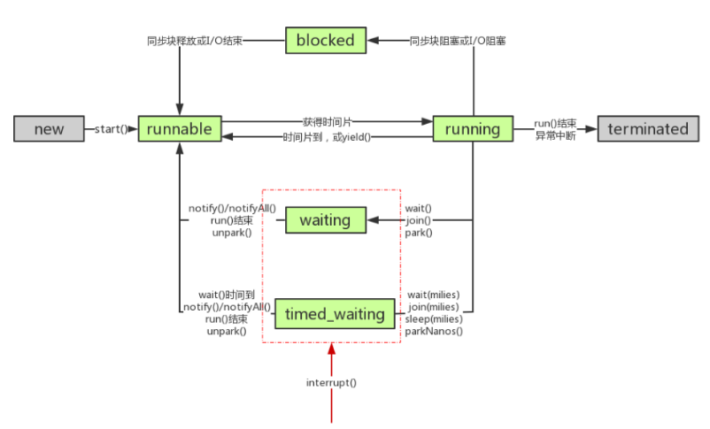

<!-- TOC -->

- [01、thread线程状态转化](#01thread线程状态转化)
- [02、阻塞与等待的区别](#02阻塞与等待的区别)

<!-- /TOC -->

# 01、thread线程状态转化

调用obj.wait()的线程需要先获取obj的monitor，`wait()会释放obj的monitor并进入等待态`。所以wait()/notify()都要与synchronized联用。

# 02、阻塞与等待的区别

阻塞：当一个线程试图获取对象锁（非java.util.concurrent库中的锁，即synchronized），而该锁被其他线程持有，则该线程进入阻塞状态。它的特点是使用简单，由JVM调度器来决定唤醒自己，而不需要由另一个线程来显式唤醒自己，不响应中断。

等待：当一个线程等待另一个线程通知调度器一个条件时，该线程进入等待状态。它的特点是需要等待另一个线程显式地唤醒自己，实现灵活，语义更丰富，可响应中断。例如调用：Object.wait()、Thread.join()以及等待Lock或Condition。

需要强调的是虽然synchronized和JUC里的Lock都实现锁的功能，但线程进入的状态是不一样的。`synchronized会让线程进入阻塞态，而JUC里的Lock是用LockSupport.park()/unpark()来实现阻塞/唤醒的，会让线程进入等待态`。但话又说回来，虽然等锁时进入的状态不一样，但被唤醒后又都进入runnable态，从行为效果来看又是一样的。

>> start()

新启一个线程执行其run()方法，一个线程只能start一次（`在多次调用时，判断线程的状态变量不是0抛异常`）。主要是通过调用native start0()来实现。

>> run()

run()方法是不需要用户来调用的，当通过start方法启动一个线程之后，当该线程获得了CPU执行时间，便进入run方法体去执行具体的任务。注意，继承Thread类必须重写run方法，在run方法中定义具体要执行的任务。

>> sleep()

sleep相当于让线程睡眠，交出CPU，让CPU去执行其他的任务。

但是有一点要非常注意，sleep方法不会释放锁，也就是说如果当前线程持有对某个对象的锁，则即使调用sleep方法，其他线程也无法访问这个对象。

>> yield()

调用yield方法会让当前线程交出CPU权限，让CPU去执行其他的线程。它跟sleep方法类似，同样不会释放锁。但是yield不能控制具体的交出CPU的时间，另外，yield方法只能让拥有相同优先级的线程有获取CPU执行时间的机会。

注意，调用yield方法并不会让线程进入阻塞状态，而是让线程重回就绪状态，它只需要等待重新获取CPU执行时间，这一点是和sleep方法不一样的。

>> join()

join()实际是利用了wait()，只不过它不用等待notify()/notifyAll()，且不受其影响。它结束的条件是：1）等待时间到；2）目标线程已经run完（通过isAlive()来判断）。

>> interrupt()

此操作会将线程的中断标志位置位，至于线程作何动作那要看线程了。

- 如果线程sleep()、wait()、join()等处于阻塞状态，那么线程会定时检查中断状态位如果发现中断状态位为true，则会在这些阻塞方法调用处抛出InterruptedException异常，并且在抛出异常后立即将线程的中断状态位清除，即重新设置为false。抛出异常是为了线程从阻塞状态醒过来，并在结束线程前让程序员有足够的时间来处理中断请求。

- 如果线程正在运行、争用synchronized、lock()等，那么是不可中断的，他们会忽略。

可以通过以下三种方式来判断中断：

1)isInterrupted()

此方法只会读取线程的中断标志位，并不会重置。

2)interrupted()

此方法读取线程的中断标志位，并会重置。

3)throw InterruptException

抛出该异常的同时，会重置中断标志位。

> 参考

- [Thread详解](https://www.cnblogs.com/waterystone/p/4920007.html)

- [JAVA多线程之wait/notify](https://www.cnblogs.com/hapjin/p/5492645.html)

- [Java并发之AQS详解](https://www.cnblogs.com/waterystone/p/4920797.html)