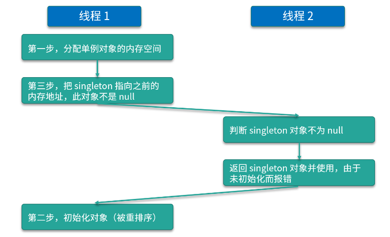

<!-- TOC -->

- [1、双重检查锁的单例模式](#1双重检查锁的单例模式)
    - [单例模式的双重检查锁模式为什么必须加 volatile？](#单例模式的双重检查锁模式为什么必须加-volatile)
- [2、控制停止线程的(布尔标记位)](#2控制停止线程的布尔标记位)
- [3、作为触发器](#3作为触发器)

<!-- /TOC -->

> volatile 的应用


不适用：a++

首先我们就来看一下不适合使用 volatile 的场景，volatile 不适合运用于需要保证原子性的场景，比如更新的时候需要依赖原来的值，而最典型的就是 a++ 的场景，我们仅靠 volatile 是不能保证 a++ 的线程安全的。代码如下所示：

```java
public class DontVolatile implements Runnable {

    volatile int a;
    AtomicInteger realA = new AtomicInteger();

    public static void main(String[] args) throws InterruptedException {
        Runnable r =  new DontVolatile();
        Thread thread1 = new Thread(r);
        Thread thread2 = new Thread(r);
        thread1.start();
        thread2.start();
        thread1.join();
        thread2.join();
        System.out.println(((DontVolatile) r).a);
        System.out.println(((DontVolatile) r).realA.get());
    }
    @Override
    public void run() {
        for (int i = 0; i < 1000; i++) {
            a++;
            realA.incrementAndGet();
        }
    }
}
```

在这段代码中，我们有一个 volatile 修饰的 int 类型的 a 变量，并且下面还有一个原子类的 realA，原子类是可以保证线程安全的，所以我们就用它来和 volatile int a 做对比，看一看它们实际效果上的差别。

在 main 函数中，我们新建了两个线程，并且让它们运行。这两个线程运行的内容就是去执行 1000 次的累加操作，每次累加操作会对 volatile 修饰的变量 a 进行自加操作，同时还会对原子类 realA 进行自加操作。当这两个线程都运行完毕之后，我们把结果给打印出来，其中一种运行结果如下：

1988

2000

会发现最终的 a 值和 realA 值分别为 1988 和 2000。可以看出，即便变量 a 被 volatile 修饰了，即便它最终一共执行了 2000 次的自加操作（这一点可以由原子类的最终值来印证），但是依然有一些自加操作失效了，所以最终它的结果是不到 2000 的，这就证明了 volatile 不能保证原子性，那么它究竟适合运用于什么场景呢？


# 1、双重检查锁的单例模式

可以用 `volatile` 实现一个双重检查锁的单例模式：

```java
    public class Singleton {
        private static volatile Singleton singleton;

        private Singleton() {
        }

        public static Singleton getInstance() {
            if (singleton == null) {
                synchronized (Singleton.class) {
                    if (singleton == null) {
                        singleton = new Singleton();
                    }
                }
            }
            return singleton;
        }

    }
```

这里的 `volatile` 关键字主要是为了防止指令重排。

如果不用 `volatile` ，`singleton = new Singleton();`，这段代码其实是分为三步：

- 1、分配内存空间。
- 2、初始化对象。
- 3、将 `singleton` 对象指向分配的内存地址。

加上 `volatile` 是为了让以上的三步操作顺序执行，反之有可能第三步在第二步之前被执行就有可能导致某个线程拿到的单例对象还没有初始化，以致于使用报错。


## 单例模式的双重检查锁模式为什么必须加 volatile？


单例模式指的是，保证一个类只有一个实例，并且提供一个可以全局访问的入口。


那么我们为什么需要单例呢？其中**一个理由，那就是为了节省内存、节省计算。**因为在很多情况下，我们只需要一个实例就够了，如果出现更多的实例，反而纯属浪费。

接下来看看需要单例的第二个理由，`那就是为了保证结果的正确`。

比如我们需要一个全局的计数器，用来统计人数，如果有多个实例，反而会造成混乱。

另外呢，就是为了`方便管理`。很多工具类，我们只需要一个实例，那么我们通过统一的入口，比如通过 getInstance 方法去获取这个单例是很方便的，太多实例不但没有帮助，反而会让人眼花缭乱。

一般单例模式的类结构：
- 有一个私有的 Singleton 类型的 singleton 对象；
- 同时构造方法也是私有的，为了防止他人调用构造函数来生成实例；
- 另外还会有一个 public 的 getInstance 方法，可通过这个方法获取到单例。


> 双重检查锁模式的写法


在这里我将重点讲解 getInstance 方法，方法中首先进行了一次 if (singleton == null) 的检查，然后是 synchronized 同步块，然后又是一次 if (singleton == null) 的检查，最后是 singleton = new Singleton() 来生成实例。

我们进行了两次 if (singleton == null) 检查，这就是“双重检查锁”这个名字的由来。这种写法是可以保证线程安全的，假设有两个线程同时到达 synchronized 语句块，那么实例化代码只会由其中先抢到锁的线程执行一次，而后抢到锁的线程会在第二个 if 判断中发现 singleton 不为 null，所以跳过创建实例的语句。再后面的其他线程再来调用 getInstance 方法时，只需判断第一次的 if (singleton == null) ，然后会跳过整个 if 块，直接 return 实例化后的对象。

这种写法的优点是不仅线程安全，而且延迟加载、效率也更高。

讲到这里就涉及到了一个常见的问题，面试官可能会问你，“为什么要 double-check？去掉任何一次的 check 行不行？”

我们先来看第二次的 check，这时你需要考虑这样一种情况，有两个线程同时调用 getInstance 方法，由于 singleton 是空的 ，因此两个线程都可以通过第一重的 if 判断；然后由于锁机制的存在，会有一个线程先进入同步语句，并进入第二重 if 判断 ，而另外的一个线程就会在外面等待。

不过，当第一个线程执行完 new Singleton() 语句后，就会退出 synchronized 保护的区域，这时如果没有第二重 if (singleton == null) 判断的话，那么第二个线程也会创建一个实例，此时就破坏了单例，这肯定是不行的。

而对于第一个 check 而言，如果去掉它，那么所有线程都会串行执行，效率低下，所以两个 check 都是需要保留的。

在双重检查锁模式中为什么需要使用 volatile 关键字

相信细心的你可能看到了，我们在双重检查锁模式中，给 singleton 这个对象加了 volatile 关键字，那**为什么要用 volatile 呢？**主要就在于 singleton = new Singleton() ，它并非是一个原子操作，事实上，在 JVM 中上述语句至少做了以下这 3 件事：

- 第一步是给 singleton 分配内存空间；
- 第二步开始调用 Singleton 的构造函数等，来初始化 singleton；
- 第三步，将 singleton 对象指向分配的内存空间（执行完这步 singleton 就不是 null 了）。

这里需要留意一下 1-2-3 的顺序，因为存在指令重排序的优化，也就是说第2 步和第 3 步的顺序是不能保证的，最终的执行顺序，可能是 1-2-3，也有可能是 1-3-2。

如果是 1-3-2，那么在第 3 步执行完以后，singleton 就不是 null 了，可是这时第 2 步并没有执行，singleton 对象未完成初始化，它的属性的值可能不是我们所预期的值。假设此时线程 2 进入 getInstance 方法，由于 singleton 已经不是 null 了，所以会通过第一重检查并直接返回，但其实这时的 singleton 并没有完成初始化，所以使用这个实例的时候会报错，详细流程如下图所示：



线程 1 首先执行新建实例的第一步，也就是分配单例对象的内存空间，由于线程 1 被重排序，所以执行了新建实例的第三步，也就是把 singleton 指向之前分配出来的内存地址，在这第三步执行之后，singleton 对象便不再是 null。

这时线程 2 进入 getInstance 方法，判断 singleton 对象不是 null，紧接着线程 2 就返回 singleton 对象并使用，由于没有初始化，所以报错了。最后，线程 1 “姗姗来迟”，才开始执行新建实例的第二步——初始化对象，可是这时的初始化已经晚了，因为前面已经报错了。

使用了 volatile 之后，相当于是表明了该字段的更新可能是在其他线程中发生的，因此应确保在读取另一个线程写入的值时，可以顺利执行接下来所需的操作。在 JDK 5 以及后续版本所使用的 JMM 中，在使用了 volatile 后，会一定程度禁止相关语句的重排序，从而避免了上述由于重排序所导致的读取到不完整对象的问题的发生。

`使用 volatile 的意义主要在于它可以防止避免拿到没完成初始化的对象，从而保证了线程安全`


# 2、控制停止线程的(布尔标记位)


如果某个共享变量自始至终只是被各个线程所赋值或读取，而没有其他的操作（比如读取并在此基础上进行修改这样的复合操作）的话，那么我们就可以使用 volatile 来代替 synchronized 或者代替原子类，`因为赋值操作自身是具有原子性的`，volatile 同时又保证了可见性，这就足以保证线程安全了。

一个比较典型的场景就是布尔标记位的场景，例如 volatile boolean flag。因为通常情况下，boolean 类型的标记位是会被直接赋值的，此时不会存在复合操作（如 a++），只存在单一操作，就是去改变 flag 的值，而一旦 flag 被 volatile 修饰之后，就可以保证可见性了，那么这个 flag 就可以当作一个标记位，此时它的值一旦发生变化，所有线程都可以立刻看到，所以这里就很适合运用 volatile 了。

```java
    private volatile boolean flag ;
    private void run(){
        new Thread(new Runnable() {
            @Override
            public void run() {
                while (flag) {
                    doSomeThing();
                }
            }
        });
    }

    private void stop(){
        flag = false ;
    }
```

这里如果没有用 volatile 来修饰 flag ，就有可能其中一个线程调用了 `stop()`方法修改了 flag 的值并不会立即刷新到主内存中，导致这个循环并不会立即停止。

这里主要利用的是 `volatile` 的内存可见性。

总结一下:

- `volatile` 关键字只能保证可见性，顺序性，**不能保证原子性**。


# 3、作为触发器

作为触发器，保证其他变量的可见性。下面是 Brian Goetz 提供的一个经典例子：

```java
Map configOptions;
char[] configText;
volatile boolean initialized = false;
 
. . .
 
// In thread A
 
configOptions = new HashMap();
configText = readConfigFile(fileName);
processConfigOptions(configText, configOptions);
initialized = true;
 
. . .
 
// In thread B
 
while (!initialized) 
  sleep();
// use configOptions
```

在这段代码中可以看到，我们有一个 map 叫作 configOptions，还有一个 char 数组叫作 configText，然后会有一个被 volatile 修饰的 boolean initialized，最开始等于 false。再下面的这四行代码是由线程 A 所执行的，它所做的事情就是初始化 configOptions，再初始化 configText，再把这两个值放到一个方法中去执行，实际上这些都代表了初始化的行为。那么一旦这些方法执行完毕之后，就代表初始化工作完成了，线程 A 就会把 initialized 这个变量设置为 true。

而对于线程 B 而言，它一开始会在 while 循环中反复执行 sleep 方法（例如休眠一段时间），直到 initialized 这个变量变成 true，线程 B 才会跳过 sleep 方法，继续往下执行。重点来了，一旦 initialized 变成了 true，此时对于线程 B 而言，它就会立刻使用这个 configOptions，所以这就要求此时的 configOptions 是初始化完毕的，且初始化的操作的结果必须对线程 B 可见，否则线程 B 在执行的时候就可能报错。

你可能会担心，因为这个 configOptions 是在线程 A 中修改的，那么在线程 B 中读取的时候，会不会发生可见性问题，会不会读取的不是初始化完毕后的值？如果我们不使用 volatile，那么确实是存在这个问题的。

但是现在我们用了被 volatile 修饰的 initialized 作为触发器，所以这个问题被解决了。根据happens-before 关系的单线程规则，线程 A 中 configOptions 的初始化 happens-before 对 initialized 变量的写入，而线程 B 中对 initialzed 的读取 happens-before 对 configOptions 变量的使用，同时根据 happens-before 关系的 volatile 规则，线程 A 中对 initialized 的写入为 true 的操作 happens-before 线程 B 中随后对 initialized 变量的读取。

如果我们分别有操作 A 和操作 B，我们用 hb(A, B) 来表示 A happens-before B。而 Happens-before 是有可传递性质的，如果hb(A, B)，且hb(B, C)，那么可以推出hb(A, C)。所以根据上面的条件，我们可以得出结论：线程 A 中对于 configOptions 的初始化 happens-before 线程 B 中 对于 configOptions 的使用。所以对于线程 B 而言，既然它已经看到了 initialized 最新的值，那么它同样就能看到包括 configOptions 在内的这些变量初始化后的状态，所以此时线程 B 使用 configOptions 是线程安全的。这种用法就是把被 volatile 修饰的变量作为触发器来使用，保证其他变量的可见性，这种用法也是非常值得掌握的，可以作为面试时的亮点。


