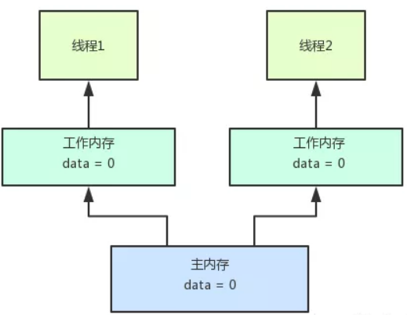
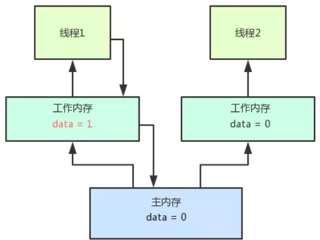
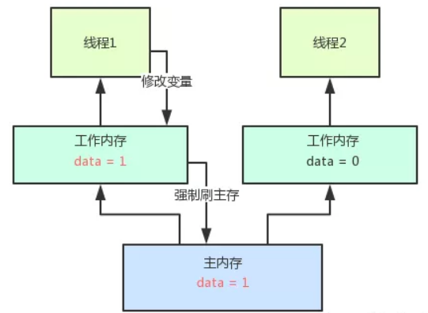
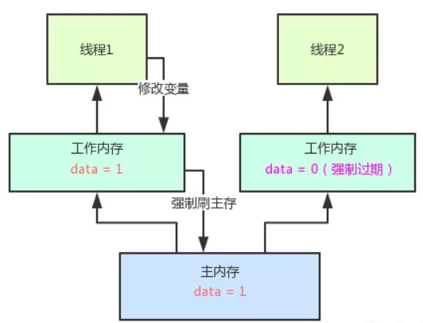
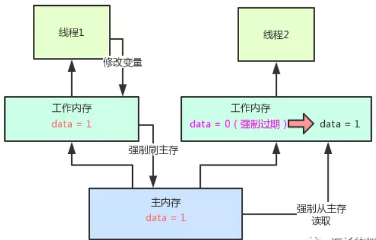

<!-- TOC -->

- [0、java线程的工作模型](#0java线程的工作模型)
- [1、提出问题-可见性](#1提出问题-可见性)
- [2、volatile的作用及背后的原理](#2volatile的作用及背后的原理)
- [3、volatile 的作用（第一点是保证可见性，第二点是禁止重排序）](#3volatile-的作用第一点是保证可见性第二点是禁止重排序)
- [4、volatile 和 synchronized 的关系](#4volatile-和-synchronized-的关系)
- [参考](#参考)

<!-- /TOC -->

# 0、java线程的工作模型



这张图说的是java内存模型中，每个线程有自己的`工作内存`，同时还有一个共享的`主内存`。

举个例子，比如说有两个线程，他们的代码里都需要读取data这个变量的值，那么他们都会从主内存里加载data变量的值到自己的工作内存，然后才可以使用那个值。从图里看到，每个线程都把data这个变量的副本加载到了自己的工作内存里了，所以每个线程都可以读到data = 0这个值。这样，在线程代码运行的过程中，对data的值都可以直接从工作内存里加载了，不需要再从主内存里加载了。

# 1、提出问题-可见性

为啥一定要让每个线程用一个工作内存来存放变量的副本以供读取呢？我直接让线程每次都从主内存加载变量的值不行吗？

很简单！因为线程运行的代码对应的是一些指令，是由CPU执行的！但是CPU每次执行指令运算的时候，也就是执行我们自己写的那一大坨代码的时候，要是每次需要一个变量的值，都从主内存加载，`性能`会比较差！所以说后来想了一个办法，就是线程有工作内存的概念，类似于一个高速的本地缓存。这样一来，线程的代码在执行过程中，就可以直接从自己本地缓存里加载变量副本，不需要从主内存加载变量值，性能可以提升很多！


但是大家思考一下，这样会有什么问题？我们来设想一下，假如说线程1修改了data变量的值为1，然后将这个修改写入自己的本地工作内存。那么此时，线程1的工作内存里的data值为1。然而，主内存里的data值还是为0！线程2的工作内存里的data值还是0啊？！，如下图所示：



那接下来，在线程1的代码运行过程中，他可以直接读到data最新的值是1，但是线程2的代码运行过程中读到的data的值还是0！这就导致，线程1和线程2其实都是在操作一个变量data，但是线程1修改了data变量的值之后，线程2是看不到的，一直都是看到自己本地工作内存中的一个旧的副本的值！

这就是所谓的`java并发编程中的可见性问题`：多个线程并发读写一个共享变量的时候，有可能某个线程修改了变量的值，但是其他线程看不到！也就是对其他线程不可见！

# 2、volatile的作用及背后的原理

那如果要解决这个问题怎么办呢？这时就轮到volatile闪亮登场了！你只要给data这个变量在定义的时候加一个volatile，就直接可以完美的解决这个可见性的问题。比如下面的这样的代码，在加了volatile之后，会有啥作用呢？

```java
public class Test_volatile {
    private volatile int data=0;
    //线程1会读取和修改data变量的值
    //线程2会读取data变量的值
}
```
volatile的作用：

第一，一旦data变量定义的时候前面加了volatile来修饰的话，那么线程1只要修改data变量的值，就会在修改完自己本地工作内存的data变量值之后，强制将这个data变量最新的值刷回主内存，必须让主内存里的data变量值立马变成最新的值！整个过程，如下图所示：



第二，如果此时别的线程的工作内存中有这个data变量的本地缓存，也就是一个变量副本的话，那么会强制让线程的工作内存中的data变量缓存直接失效过期，不允许再次读取和使用了！整个过程，如下图所示：



第三，如果线程2在代码运行过程中再次需要读取data变量的值，此时尝试从本地工作内存中读取，就会发现这个data = 0已经过期了！此时，他就必须重新从主内存中加载data变量最新的值！那么不就可以读取到data = 1这个最新的值了！整个过程，参见下图：



`修改线程强制刷内存，其他线程强制从主内存读取变量的值`。

volatile完美解决了java并发中可见性的问题！对一个变量加了volatile关键字修饰之后，只要一个线程修改了这个变量的值，立马强制刷回主内存。接着强制过期其他线程的本地工作内存中的缓存，最后其他线程读取变量值的时候，强制重新从主内存来加载最新的值！这样就保证，任何一个线程修改了变量值，其他线程立马就可以看见了！这就是所谓的volatile保证了可见性的工作原理！

> 总结

`volatile主要作用是保证可见性以及有序性。有序性涉及到较为复杂的指令重排、内存屏障等概念，但是volatile是不能保证原子性的！`

也就是说，volatile主要解决的是一个线程修改变量值之后，其他线程立马可以读到最新的值，是解决这个问题的，也就是可见性！但是如果是多个线程同时修改一个变量的值，那还是可能出现多线程并发的安全问题，导致数据值修改错乱，volatile是不负责解决这个问题的，也就是不负责解决原子性问题！原子性问题，得依赖synchronized、ReentrantLock等加锁机制来解决或者无锁机制中的cas。


# 3、volatile 的作用（第一点是保证可见性，第二点是禁止重排序）

volatile 的作用，它一共有两层作用。

- 第一层的作用是保证可见性。Happens-before 关系中对于 volatile 是这样描述的：对一个 volatile 变量的写操作 happen-before 后面对该变量的读操作。这就代表了如果变量被 volatile 修饰，那么每次修改之后，接下来在读取这个变量的时候一定能读取到该变量最新的值。

- 第二层的作用就是禁止重排序。先介绍一下 as-if-serial语义：不管怎么重排序，（单线程）程序的执行结果不会改变。在满足 as-if-serial 语义的前提下，由于编译器或 CPU 的优化，代码的实际执行顺序可能与我们编写的顺序是不同的，这在单线程的情况下是没问题的，但是一旦引入多线程，这种乱序就可能会导致严重的线程安全问题。用了 volatile 关键字就可以在一定程度上禁止这种重排序。

# 4、volatile 和 synchronized 的关系

- 相似性：volatile 可以看作是一个轻量版的 synchronized，比如一个共享变量如果自始至终`只被各个线程赋值和读取`，而没有其他操作的话，那么就可以用 volatile 来代替 synchronized 或者代替原子变量，足以保证线程安全。实际上，对 volatile 字段的每次读取或写入都类似于“半同步”——读取 volatile 与获取 synchronized 锁有相同的内存语义，而写入 volatile 与释放 synchronized 锁具有相同的语义。

- 不可代替：但是在更多的情况下，volatile 是不能代替 synchronized 的，volatile 并没有提供原子性和互斥性。

- 性能方面：volatile 属性的读写操作都是无锁的，正是因为无锁，所以不需要花费时间在获取锁和释放锁上，所以说它是高性能的，比 synchronized 性能更好。


# 参考

- [参考：石杉的架构笔记](https://mp.weixin.qq.com/s/MIsQv8ZWWBzfB-Qhg3l4lA)

- [漫画：什么是volatile关键字？（整合版）](https://mp.weixin.qq.com/s/DZkGRTan2qSzJoDAx7QJag)