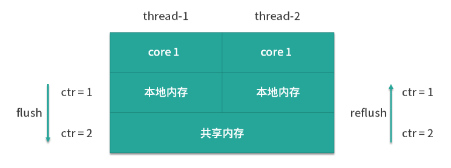
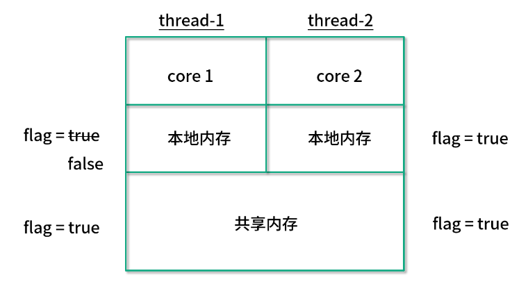
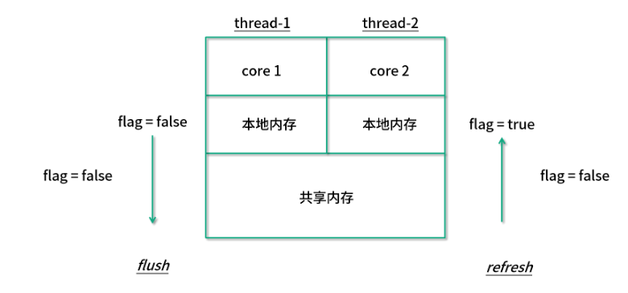

<!-- TOC -->

- [01、原子类是如何利用 CAS 保证线程安全的？](#01原子类是如何利用-cas-保证线程安全的)
    - [1、什么是原子类？原子类有什么作用？](#1什么是原子类原子类有什么作用)
    - [3、源码解析](#3源码解析)
        - [1、AtomicInteger](#1atomicinteger)
            - [1、getAndAdd方法](#1getandadd方法)
            - [2、Unsafe 类](#2unsafe-类)
- [02、AtomicInteger 在高并发下性能不好，如何解决？为什么？](#02atomicinteger-在高并发下性能不好如何解决为什么)
    - [1、AtomicLong 存在的问题](#1atomiclong 存在的问题)
    - [2、LongAdder 带来的改进和原理](#2longadder 带来的改进和原理)
    - [3、如何选择](#3如何选择)
- [03、原子类和 volatile 有什么异同？](#03原子类和-volatile-有什么异同)
- [04、AtomicInteger 和 synchronized 的异同点？](#04atomicinteger-和-synchronized-的异同点)

<!-- /TOC -->


# 01、原子类是如何利用 CAS 保证线程安全的？


## 1、什么是原子类？原子类有什么作用？

在编程领域里，原子性意味着“一组操作要么全都操作成功，要么全都失败，不能只操作成功其中的一部分”。而 java.util.concurrent.atomic 下的类，就是具有原子性的类，可以原子性地执行添加、递增、递减等操作。比如之前多线程下的线程不安全的 i++ 问题，到了原子类这里，就可以用功能相同且线程安全的 getAndIncrement 方法来优雅地解决。

原子类的作用和锁有类似之处，是为了保证并发情况下线程安全。不过原子类相比于锁，有一定的优势：

- 粒度更细：原子变量可以把竞争范围缩小到变量级别，通常情况下，锁的粒度都要大于原子变量的粒度。

- 效率更高：除了高度竞争的情况之外，使用原子类的效率通常会比使用同步互斥锁的效率更高，因为原子类底层利用了 CAS 操作，不会阻塞线程。


## 3、源码解析

### 1、AtomicInteger

以 AtomicInteger 为例，分析在 Java 中如何利用 CAS 实现原子操作。来看下  AtomicInteger 是如何通过 CAS 操作实现并发下的累加操作的，以其中一个重要方法 getAndAdd 方法为突破口。

#### 1、getAndAdd方法

这个方法的代码在 Java 1.8 中的实现如下：

```java
//JDK 1.8实现
public final int getAndAdd(int delta) {
   return unsafe.getAndAddInt(this, valueOffset, delta);
}
```

可以看出，里面使用了 Unsafe 这个类，并且调用了 unsafe.getAndAddInt 方法。所以这里需要简要介绍一下 Unsafe 类。

#### 2、Unsafe 类

Unsafe 其实是 CAS 的核心类。由于 Java 无法直接访问底层操作系统，而是需要通过 native 方法来实现。不过尽管如此，JVM 还是留了一个后门，在 JDK 中有一个 Unsafe 类，它提供了硬件级别的原子操作，我们可以利用它直接操作内存数据。

那么我们就来看一下 AtomicInteger 的一些重要代码，如下所示：

```java
public class AtomicInteger extends Number implements java.io.Serializable {
   // setup to use Unsafe.compareAndSwapInt for updates
   private static final Unsafe unsafe = Unsafe.getUnsafe();
   private static final long valueOffset;
 
   static {
       try {
           valueOffset = unsafe.objectFieldOffset
               (AtomicInteger.class.getDeclaredField("value"));//初始化的时候对保存值的value初始化在jvm内存中的偏移地址
       } catch (Exception ex) { throw new Error(ex); }
   }
 
   private volatile int value;//通过关键字volatile来保证可见性
   public final int get() {return value;}
   ...
}
```

可以看出，在数据定义的部分，首先还获取了 Unsafe 实例，并且定义了 valueOffset。我们往下看到 static 代码块，这个代码块会在类加载的时候执行，执行时我们会调用 Unsafe 的 objectFieldOffset 方法，从而得到当前这个原子类的 value 的偏移量，并且赋给 valueOffset 变量，这样一来我们就获取到了 value 的偏移量，它的含义是在内存中的偏移地址，因为 Unsafe 就是根据内存偏移地址获取数据的原值的，这样我们就能通过 Unsafe 来实现 CAS 了。

value 是用 volatile 修饰的，它就是我们原子类存储的值的变量，由于它被 volatile 修饰，我们就可以保证在多线程之间看到的 value 是同一份，保证了可见性。

接下来继续看 Unsafe 的 getAndAddInt 方法的实现，代码如下：

```java
public final int getAndAddInt(Object var1, long var2, int var4) {
   int var5;
   do {
       var5 = this.getIntVolatile(var1, var2);
   } while(!this.compareAndSwapInt(var1, var2, var5, var5 + var4));
   return var5;
}
```

首先我们看一下结构，它是一个 do-while 循环，所以这是一个死循环，直到满足循环的退出条件时才可以退出。

那么我们来看一下 do 后面的这一行代码 var5 = this.getIntVolatile(var1, var2) 是什么意思。这是个 native 方法，作用就是获取在 var1 中的 var2 偏移处的值。

那传入的是什么呢？传入的两个参数，第一个就是当前原子类，第二个是我们最开始获取到的 offset，这样一来我们就可以获取到当前内存中偏移量的值，并且保存到 var5 里面。此时 var5 实际上代表当前时刻下的原子类的数值。

现在再来看 while 的退出条件，也就是 compareAndSwapInt 这个方法，它一共传入了 4 个参数，这 4 个参数是 var1、var2、var5、var5 + var4，为了方便理解，我们给它们取了新了变量名，分别 object、offset、expectedValue、newValue，具体含义如下：

- 第一个参数 object 就是将要操作的对象，传入的是 this，也就是 atomicInteger 这个对象本身；
- 第二个参数是 offset，也就是偏移量，借助它就可以获取到 value 的数值；
- 第三个参数 expectedValue，代表“期望值”，传入的是刚才获取到的 var5；
- 最后一个参数 newValue 是希望修改的数值 ，等于之前取到的数值 var5 再加上 var4，而 var4 就是我们之前所传入的 delta，delta 就是我们希望原子类所改变的数值，比如可以传入 +1，也可以传入 -1。

所以 compareAndSwapInt 方法的作用就是，判断如果现在原子类里 value 的值和之前获取到的 var5 相等的话，那么就把计算出来的 var5 + var4 给更新上去，所以说这行代码就实现了 CAS 的过程。

一旦 CAS 操作成功，就会退出这个 while 循环，但是也有可能操作失败。如果操作失败就意味着在获取到 var5 之后，并且在 CAS 操作之前，value 的数值已经发生变化了，证明有其他线程修改过这个变量。

这样一来，就会再次执行循环体里面的代码，重新获取 var5 的值，也就是获取最新的原子变量的数值，并且再次利用 CAS 去尝试更新，直到更新成功为止，所以这是一个死循环。

我们总结一下，Unsafe 的 getAndAddInt 方法是通过循环 + CAS 的方式来实现的，在此过程中，它会通过 compareAndSwapInt 方法来尝试更新 value 的值，如果更新失败就重新获取，然后再次尝试更新，直到更新成功。


# 02、AtomicInteger 在高并发下性能不好，如何解决？为什么？

我们知道在 JDK1.5 中新增了并发情况下使用的 Integer/Long 所对应的原子类 AtomicInteger 和 AtomicLong。

在并发的场景下，如果我们需要实现计数器，可以利用 AtomicInteger 和 AtomicLong，这样一来，就可以避免加锁和复杂的代码逻辑，有了它们之后，我们只需要执行对应的封装好的方法，例如对这两个变量进行原子的增操作或原子的减操作，就可以满足大部分业务场景的需求。

不过，虽然它们很好用，但是如果你的业务场景是并发量很大的，那么你也会发现，这两个原子类实际上会有较大的性能问题，这是为什么呢？就让我们从一个例子看起。

## 1、AtomicLong 存在的问题

首先我们来看一段代码：

```java
public class AtomicLongDemo {//在16个线程下使用AtomicLong
 
   public static void main(String[] args) throws InterruptedException {
       AtomicLong counter = new AtomicLong(0);//创建一个原子类
       ExecutorService service = Executors.newFixedThreadPool(16);
       for (int i = 0; i < 100; i++) {//并发调用原子类
           service.submit(new Task(counter));
       }
 
       Thread.sleep(2000);
       System.out.println(counter.get());
   }
 
   static class Task implements Runnable {
 
       private final AtomicLong counter;
 
       public Task(AtomicLong counter) {
           this.counter = counter;
       }
 
       @Override
       public void run() {
           counter.incrementAndGet();
       }
   }
}
```

在这段代码中可以看出，我们新建了一个原始值为 0 的 AtomicLong。然后，有一个线程数为 16 的线程池，并且往这个线程池中添加了 100 次相同的一个任务。

那我们往下看这个任务是什么。在下面的 Task 类中可以看到，这个任务实际上就是每一次去调用 AtomicLong 的 incrementAndGet 方法，相当于一次自加操作。这样一来，整个类的作用就是把这个原子类从 0 开始，添加 100 个任务，每个任务自加一次。

这段代码的运行结果毫无疑问是 100，虽然是多线程并发访问，但是 AtomicLong 依然可以保证 incrementAndGet 操作的原子性，所以不会发生线程安全问题。

不过如果我们深入一步去看内部情景的话，你可能会感到意外。我们把模型简化成只有两个线程在同时工作的并发场景，因为两个线程和更多个线程本质上是一样的。如图所示：



我们可以看到在这个图中，每一个线程是运行在自己的 core 中的，并且它们都有一个本地内存是自己独用的。在本地内存下方，有两个 CPU 核心共用的共享内存。

对于 AtomicLong 内部的 value 属性而言，也就是保存当前 AtomicLong 数值的属性，它是被 volatile 修饰的，所以它需要保证自身可见性。

这样一来，每一次它的数值有变化的时候，它都需要进行 flush 和 refresh。比如说，如果开始时，ctr 的数值为 0 的话，那么如图所示，一旦  core 1 把它改成 1 的话，它首先会在左侧把这个 1 的最新结果给 flush 到下方的共享内存。然后，再到右侧去往上 refresh 到核心 2 的本地内存。这样一来，对于核心 2 而言，它才能感知到这次变化。

由于竞争很激烈，这样的 flush 和 refresh 操作耗费了很多资源，而且 CAS 也会经常失败。

## 2、LongAdder 带来的改进和原理

在 JDK 8 中又新增了 LongAdder 这个类，这是一个针对 Long 类型的操作工具类。那么既然已经有了 AtomicLong，为何又要新增 LongAdder 这么一个类呢？

我们同样是用一个例子来说明。下面这个例子和刚才的例子很相似，只不过我们把工具类从  AtomicLong 变成了 LongAdder。其他的不同之处还在于最终打印结果的时候，调用的方法从原来的 get 变成了现在的 sum 方法。而其他的逻辑都一样。

我们来看一下使用 LongAdder 的代码示例：

```java
public class LongAdderDemo {//在16个线程下使用LongAdder
 
   public static void main(String[] args) throws InterruptedException {
       LongAdder counter = new LongAdder();
       ExecutorService service = Executors.newFixedThreadPool(16);
       for (int i = 0; i < 100; i++) {
           service.submit(new Task(counter));
       }
 
       Thread.sleep(2000);
       System.out.println(counter.sum());//这里不同
   }
   static class Task implements Runnable {
 
       private final LongAdder counter;
 
       public Task(LongAdder counter) {
           this.counter = counter;
       }
 
       @Override
       public void run() {
           counter.increment();
       }
   }
}
```

代码的运行结果同样是 100，但是运行速度比刚才 AtomicLong 的实现要快。下面我们解释一下，为什么高并发下 LongAdder 比 AtomicLong 效率更高。

`因为 LongAdder 引入了分段累加的概念，内部一共有两个参数参与计数：第一个叫作 base，它是一个变量，第二个是 Cell[] ，是一个数组。`

其中的 base 是用在竞争不激烈的情况下的，可以直接把累加结果改到 base 变量上。

那么，当竞争激烈的时候，就要用到我们的 Cell[] 数组了。一旦竞争激烈，各个线程会分散累加到自己所对应的那个 Cell[] 数组的某一个对象中，而不会大家共用同一个。

这样一来，LongAdder 会把不同线程对应到不同的 Cell 上进行修改，降低了冲突的概率，这是一种分段的理念，提高了并发性，这就和 Java 7 的 ConcurrentHashMap 的 16 个 Segment 的思想类似。

竞争激烈的时候，LongAdder 会通过计算出每个线程的 hash 值来给线程分配到不同的 Cell 上去，每个 Cell 相当于是一个独立的计数器，这样一来就不会和其他的计数器干扰，Cell 之间并不存在竞争关系，所以在自加的过程中，就大大减少了刚才的 flush 和 refresh，以及降低了冲突的概率，这就是为什么 LongAdder 的吞吐量比 AtomicLong 大的原因，本质是空间换时间，因为它有多个计数器同时在工作，所以占用的内存也要相对更大一些。

那么 LongAdder 最终是如何实现多线程计数的呢？答案就在最后一步的求和 sum 方法，执行 LongAdder.sum() 的时候，会把各个线程里的 Cell 累计求和，并加上 base，形成最终的总和。代码如下：

```java
public long sum() {
   Cell[] as = cells; Cell a;
   long sum = base;
   if (as != null) {
       for (int i = 0; i < as.length; ++i) {
           if ((a = as[i]) != null)
               sum += a.value;
       }
   }
   return sum;
}
```

在这个 sum 方法中可以看到，思路非常清晰。先取 base 的值，然后遍历所有 Cell，把每个 Cell 的值都加上去，形成最终的总和。由于在统计的时候并没有进行加锁操作，所以这里得出的 sum 不一定是完全准确的，因为有可能在计算 sum 的过程中 Cell 的值被修改了。

那么我们已经了解了，为什么 AtomicLong 或者说 AtomicInteger 它在高并发下性能不好，也同时看到了性能更好的 LongAdder。下面我们就分析一下，对它们应该如何选择。

## 3、如何选择

在低竞争的情况下，AtomicLong 和 LongAdder 这两个类具有相似的特征，吞吐量也是相似的，因为竞争不高。但是在竞争激烈的情况下，LongAdder 的预期吞吐量要高得多，经过试验，LongAdder 的吞吐量大约是 AtomicLong 的十倍，不过凡事总要付出代价，LongAdder 在保证高效的同时，也需要消耗更多的空间。

AtomicLong 可否被 LongAdder 替代？

那么我们就要考虑了，有了更高效的 LongAdder，那 AtomicLong 可否不使用了呢？是否凡是用到 AtomicLong 的地方，都可以用 LongAdder 替换掉呢？答案是不是的，这需要区分场景。

LongAdder 只提供了 add、increment 等简单的方法，适合的是统计求和计数的场景，场景比较单一，而 AtomicLong 还具有 compareAndSet 等高级方法，可以应对除了加减之外的更复杂的需要 CAS 的场景。

结论：如果我们的场景仅仅是需要用到加和减操作的话，那么可以直接使用更高效的 LongAdder，但如果我们需要利用 CAS 比如 compareAndSet 等操作的话，就需要使用 AtomicLong 来完成。


# 03、原子类和 volatile 有什么异同？


> 总结：原子类和 volatile 的使用场景

volatile 和原子类的使用场景是不一样的，如果我们有一个可见性问题，那么可以使用 volatile 关键字，但如果我们的问题是一个组合操作，需要用同步来解决原子性问题的话，那么可以使用原子变量，而不能使用 volatile 关键字。

通常情况下，volatile 可以用来修饰 boolean 类型的标记位，因为对于标记位来讲，直接的赋值操作本身就是具备原子性的，再加上 volatile 保证了可见性，那么就是线程安全的了。

而对于会被多个线程同时操作的计数器 Counter 的场景，这种场景的一个典型特点就是，它不仅仅是一个简单的赋值操作，而是需要先读取当前的值，然后在此基础上进行一定的修改，再把它给赋值回去。这样一来，我们的 volatile 就不足以保证这种情况的线程安全了。我们需要使用原子类来保证线程安全。


我们首先看一个案例。如图所示，我们有两个线程。

```java
while(flag) {//线程2的逻辑
//processing
}
```

有一个公共的 boolean flag 标记位，最开始赋值为 true，然后线程 2 会进入一个 while 循环，并且根据这个 flag 也就是标记位的值来决定是否继续执行或着退出。

最开始由于 flag 的值是 true，所以首先会在这里执行一定时期的循环。然后假设在某一时刻，线程 1 把这个 flag 的值改为 false 了，它所希望的是，线程 2 看到这个变化后停止运行。

但是这样做其实是有风险的，线程 2 可能并不能立刻停下来，也有可能过一段时间才会停止，甚至在最极端的情况下可能永远都不会停止。

为了理解发生这种情况的原因，我们首先来看一下 CPU 的内存结构，这里是一个双核的 CPU 的简单示意图：



可以看出，线程 1 和线程 2 分别在不同的 CPU 核心上运行，每一个核心都有自己的本地内存，并且在下方也有它们共享的内存。

最开始它们都可以读取到 flag 为 true ，不过当线程 1 这个值改为 false 之后，线程 2 并不能及时看到这次修改，因为线程 2 不能直接访问线程 1 的本地内存，这样的问题就是一个非常典型的可见性问题。


要想解决这个问题，我们只需要在变量的前面加上 volatile 关键字修饰，只要我们加上这个关键字，那么每一次变量被修改的时候，其他线程对此都可见，这样一旦线程 1 改变了这个值，那么线程 2 就可以立刻看到，因此就可以退出 while 循环了。



之所以加了关键字之后就就可以让它拥有可见性，原因在于有了这个关键字之后，线程 1 的更改会被 flush 到共享内存中，然后又会被 refresh 到线程 2 的本地内存中，这样线程 2 就能感受到这个变化了，所以 volatile 这个关键字最主要是用来解决可见性问题的，可以一定程度上保证线程安全。


> 多线程同时进行value++ 的场景

如果它被初始化为每个线程都加 1000 次，最终的结果很可能不是 2000。由于 value++ 不是原子的，所以在多线程的情况下，会出现线程安全问题。但是如果我们在这里使用 volatile 关键字，能不能解决问题呢？

很遗憾，答案是即便使用了 volatile 也是不能保证线程安全的，因为这里的问题不单单是可见性问题，还包含原子性问题。

我们有多种办法可以解决这里的问题:

- 第 1 种是使用 synchronized 关键字.

这样一来，两个线程就不能同时去更改 value 的数值，保证了 value++ 语句的原子性，并且 synchronized 同样保证了可见性，也就是说，当第 1 个线程修改了 value 值之后，第 2 个线程可以立刻看见本次修改的结果。

- 第 2 个方法，就是使用我们的原子类：

比如用一个 AtomicInteger，然后每个线程都调用它的 incrementAndGet 方法。

在利用了原子变量之后就无需加锁，我们可以使用它的 incrementAndGet 方法，这个操作底层由 CPU 指令保证原子性，所以即便是多个线程同时运行，也不会发生线程安全问题。


# 04、AtomicInteger 和 synchronized 的异同点？

我们首先分别用原子类和 synchronized 关键字来解决一个经典的线程安全问题(i++)，给出具体的代码对比，然后再分析它们背后的区别。

> 代码对比

首先，原始的线程不安全的情况的代码如下所示：

```java
public class Lesson42 implements Runnable {

    static int value = 0;

    public static void main(String[] args) throws InterruptedException {
        Runnable runnable = new Lesson42();
        Thread thread1 = new Thread(runnable);
        Thread thread2 = new Thread(runnable);
        thread1.start();
        thread2.start();
        thread1.join();
        thread2.join();
        System.out.println(value);
    }

    @Override
    public void run() {
        for (int i = 0; i < 10000; i++) {
            value++;
        }
    }
}
```


在代码中我们新建了一个 value 变量，并且在两个线程中对它进行同时的自加操作，每个线程加 10000 次，然后我们用 join 来确保它们都执行完毕，最后打印出最终的数值。

因为 value++ 不是一个原子操作，所以上面这段代码是线程不安全的，所以代码的运行结果会小于 20000，例如会输出 14611 等各种数字。

>> 方法一：原子类

代码如下所示：

```java
public class Lesson42Atomic implements Runnable {

    static AtomicInteger atomicInteger = new AtomicInteger();

    public static void main(String[] args) throws InterruptedException {
        Runnable runnable = new Lesson42Atomic();
        Thread thread1 = new Thread(runnable);
        Thread thread2 = new Thread(runnable);
        thread1.start();
        thread2.start();
        thread1.join();
        thread2.join();
        System.out.println(atomicInteger.get());
    }

    @Override
    public void run() {
        for (int i = 0; i < 10000; i++) {
            atomicInteger.incrementAndGet();
        }
    }
}
```

用原子类之后，我们的计数变量就不再是一个普通的 int 变量了，而是 AtomicInteger 类型的对象，并且自加操作也变成了 incrementAndGet 法。由于原子类可以确保每一次的自加操作都是具备原子性的，所以这段程序是线程安全的，所以以上程序的运行结果会始终等于 20000。

>> 方法二:synchronized

代码如下所示：

```java
public class Lesson42Syn implements Runnable {

    static int value = 0;

    public static void main(String[] args) throws InterruptedException {
        Runnable runnable = new Lesson42Syn();
        Thread thread1 = new Thread(runnable);
        Thread thread2 = new Thread(runnable);
        thread1.start();
        thread2.start();
        thread1.join();
        thread2.join();
        System.out.println(value);
    }

    @Override
    public void run() {
        for (int i = 0; i < 10000; i++) {
            synchronized (this) {
                value++;
            }
        }
    }
}
```

它与最开始的线程不安全的代码的区别在于，在 run 方法中加了 synchronized 代码块，就可以非常轻松地解决这个问题，由于 synchronized 可以保证代码块内部的原子性，所以以上程序的运行结果也始终等于 20000，是线程安全的。

>> 方案对比

- 第一点，我们来看一下它们背后原理的不同。

synchronized 的背后是 monitor 锁，也就是 synchronized 原理，同步方法和同步代码块的背后原理会有少许差异，但总体思想是一致的：在执行同步代码之前，需要首先获取到 monitor 锁，执行完毕后，再释放锁。

而原子类，它保证线程安全的原理是利用了 CAS 操作。从这一点上看，虽然原子类和 synchronized 都能保证线程安全，但是其实现原理是大有不同的。

- 第二点不同是使用范围的不同。

对于原子类而言，它的使用范围是比较局限的。因为一个原子类仅仅是一个对象，不够灵活。而 synchronized 的使用范围要广泛得多。比如说 synchronized 既可以修饰一个方法，又可以修饰一段代码，相当于可以根据我们的需要，非常灵活地去控制它的应用范围。

所以仅有少量的场景，例如计数器等场景，我们可以使用原子类。而在其他更多的场景下，如果原子类不适用，那么我们就可以考虑用 synchronized 来解决这个问题。

- 第三个区别是粒度的区别。

原子变量的粒度是比较小的，它可以把竞争范围缩小到变量级别。通常情况下，synchronized 锁的粒度都要大于原子变量的粒度。如果我们只把一行代码用 synchronized 给保护起来的话，有一点杀鸡焉用牛刀的感觉。

- 第四点是它们性能的区别，同时也是悲观锁和乐观锁的区别。

因为 synchronized 是一种典型的悲观锁，而原子类恰恰相反，它利用的是乐观锁。所以，我们在比较 synchronized 和 AtomicInteger 的时候，其实也就相当于比较了悲观锁和乐观锁的区别。

从性能上来考虑的话，悲观锁的操作相对来讲是比较重量级的。因为 synchronized 在竞争激烈的情况下，会让拿不到锁的线程阻塞，而原子类是永远不会让线程阻塞的。不过，虽然 synchronized 会让线程阻塞，但是这并不代表它的性能就比原子类差。

因为悲观锁的开销是固定的，也是一劳永逸的。随着时间的增加，这种开销并不会线性增长。

而乐观锁虽然在短期内的开销不大，但是随着时间的增加，它的开销也是逐步上涨的。

所以从性能的角度考虑，它们没有一个孰优孰劣的关系，而是要区分具体的使用场景。在竞争非常激烈的情况下，推荐使用 synchronized；而在竞争不激烈的情况下，使用原子类会得到更好的效果。

值得注意的是，synchronized 的性能随着 JDK 的升级，也得到了不断的优化。synchronized 会从无锁升级到偏向锁，再升级到轻量级锁，最后才会升级到让线程阻塞的重量级锁。因此synchronized 在竞争不激烈的情况下，性能也是不错的，不需要“谈虎色变”。

