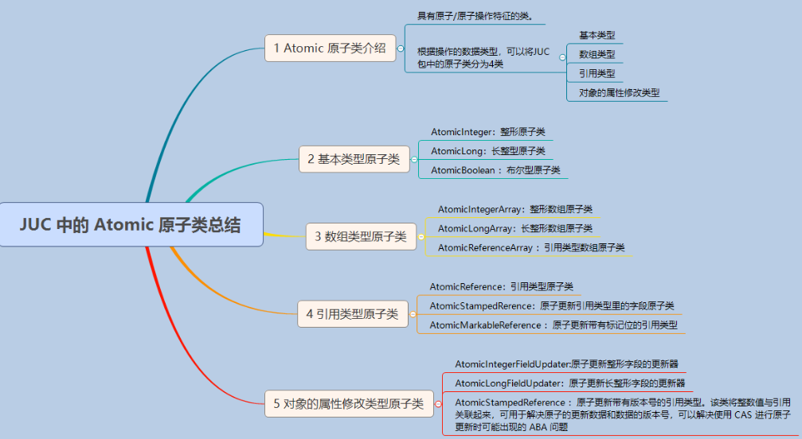

<!-- TOC -->

- [1、原子类Atomic种类以及使用](#1原子类atomic种类以及使用)
    - [1、Atomic原子类介绍](#1atomic原子类介绍)
    - [2、基本类型原子类Atomic*](#2基本类型原子类atomic)
        - [1、基本类型原子类介绍](#1基本类型原子类介绍)
        - [2、AtomicInteger 常见方法使用](#2atomicinteger-常见方法使用)
        - [3、基本数据类型原子类的优势](#3基本数据类型原子类的优势)
        - [4、AtomicInteger 线程安全原理简单分析](#4atomicinteger-线程安全原理简单分析)
    - [3、数组类型原子类Atomic*Array](#3数组类型原子类atomicarray)
        - [1、数组类型原子类介绍](#1数组类型原子类介绍)
        - [2、AtomicIntegerArray 常见方法使用](#2atomicintegerarray-常见方法使用)
    - [4、引用类型原子类Atomic*Reference](#4引用类型原子类atomicreference)
        - [1、引用类型原子类介绍](#1引用类型原子类介绍)
        - [2、AtomicReference 类使用示例](#2atomicreference-类使用示例)
    - [5、对象的属性修改类型原子类Atomic*FieldUpdater](#5对象的属性修改类型原子类atomicfieldupdater)
        - [1、对象的属性修改类型原子类介绍](#1对象的属性修改类型原子类介绍)
        - [2、AtomicIntegerFieldUpdater 类使用示例](#2atomicintegerfieldupdater-类使用示例)
    - [5、Adder 加法器](#5adder-加法器)
    - [6、Accumulator 积累器](#6accumulator-积累器)
        - [1、案例分析](#1案例分析)
        - [2、拓展功能](#2拓展功能)
        - [3、适用场景](#3适用场景)

<!-- /TOC -->


# 1、原子类Atomic种类以及使用

原理：` CAS (compare and swap) + volatile`



## 1、Atomic原子类介绍

`所谓原子类说简单点就是具有原子/原子操作特征的类。`并发包 `java.util.concurrent` 的原子类都存放在`java.util.concurrent.atomic`下,如下图所示。


根据操作的数据类型，可以将JUC包中的原子类分为6类

```
类型	具体类
Atomic* 基本类型原子类	AtomicInteger、AtomicLong、AtomicBoolean
Atomic*Array 数组类型原子类	AtomicIntegerArray、AtomicLongArray、AtomicReferenceArray
Atomic*Reference 引用类型原子类	AtomicReference、AtomicStampedReference、AtomicMarkableReference
Atomic*FieldUpdater 升级类型原子类	AtomicIntegerfieldupdater、AtomicLongFieldUpdater、AtomicReferenceFieldUpdater
Adder 累加器	LongAdder、DoubleAdder
Accumulator 积累器	LongAccumulator、DoubleAccumulator
```


**基本类型** 

使用原子的方式更新基本类型

- AtomicInteger：整形原子类
- AtomicLong：长整型原子类
- AtomicBoolean ：布尔型原子类

**数组类型**

使用原子的方式更新数组里的某个元素

- AtomicIntegerArray：整形数组原子类
- AtomicLongArray：长整形数组原子类
- AtomicReferenceArray ：引用类型数组原子类

**引用类型**

- AtomicReference：引用类型原子类
- AtomicStampedRerence：原子更新引用类型里的字段原子类
- AtomicMarkableReference ：原子更新带有标记位的引用类型

**对象的属性修改类型**

- AtomicIntegerFieldUpdater:原子更新整形字段的更新器
- AtomicLongFieldUpdater：原子更新长整形字段的更新器
- AtomicStampedReference ：原子更新带有版本号的引用类型。该类将整数值与引用关联起来，可用于解决原子的更新数据和数据的版本号，可以解决使用 CAS 进行原子更新时可能出现的 ABA 问题。


## 2、基本类型原子类Atomic*

### 1、基本类型原子类介绍

使用原子的方式更新基本类型

- AtomicInteger：整形原子类
- AtomicLong：长整型原子类
- AtomicBoolean ：布尔型原子类

上面三个类提供的方法几乎相同，所以我们这里以 AtomicInteger 为例子来介绍。

**AtomicInteger 类常用方法**
 
```java
public final int get() //获取当前的值
public final int getAndSet(int newValue)//获取当前的值，并设置新的值
public final int getAndIncrement()//获取当前的值，并自增
public final int getAndDecrement() //获取当前的值，并自减
public final int getAndAdd(int delta) //获取当前的值，并加上预期的值
boolean compareAndSet(int expect, int update) //如果输入的数值等于预期值，则以原子方式将该值设置为输入值（update）
public final void lazySet(int newValue)//最终设置为newValue,使用 lazySet 设置之后可能导致其他线程在之后的一小段时间内还是可以读到旧的值。
```

### 2、AtomicInteger 常见方法使用

```java
import java.util.concurrent.atomic.AtomicInteger;

public class AtomicIntegerTest {

	public static void main(String[] args) {
		// TODO Auto-generated method stub
		int temvalue = 0;
		AtomicInteger i = new AtomicInteger(0);
		temvalue = i.getAndSet(3);
		System.out.println("temvalue:" + temvalue + ";  i:" + i);//temvalue:0;  i:3
		temvalue = i.getAndIncrement();
		System.out.println("temvalue:" + temvalue + ";  i:" + i);//temvalue:3;  i:4
		temvalue = i.getAndAdd(5);
		System.out.println("temvalue:" + temvalue + ";  i:" + i);//temvalue:4;  i:9
	}

}
```

### 3、基本数据类型原子类的优势

通过一个简单例子带大家看一下基本数据类型原子类的优势

**1、多线程环境不使用原子类保证线程安全（基本数据类型）**

```java
class Test {
        private volatile int count = 0;
        //若要线程安全执行执行count++，需要加锁
        public synchronized void increment() {
                  count++; 
        }

        public int getCount() {
                  return count;
        }
}
```
**2、多线程环境使用原子类保证线程安全（基本数据类型）**

```java
class Test2 {
        private AtomicInteger count = new AtomicInteger();

        public void increment() {
                  count.incrementAndGet();
        }
       //使用AtomicInteger之后，不需要加锁，也可以实现线程安全。
       public int getCount() {
                return count.get();
        }
}

```
### 4、AtomicInteger 线程安全原理简单分析

AtomicInteger 类的部分源码：

```java
    // setup to use Unsafe.compareAndSwapInt for updates（更新操作时提供“比较并替换”的作用）
    private static final Unsafe unsafe = Unsafe.getUnsafe();
    private static final long valueOffset;

    static {
        try {
            valueOffset = unsafe.objectFieldOffset
                (AtomicInteger.class.getDeclaredField("value"));
        } catch (Exception ex) { throw new Error(ex); }
    }

    private volatile int value;
```

AtomicInteger 类主要利用` CAS (compare and swap) + volatile` 和 native 方法来保证原子操作，从而避免 synchronized 的高开销，执行效率大为提升。

CAS的原理是拿期望的值和原本的一个值作比较，如果相同则更新成新的值。UnSafe 类的 objectFieldOffset() 方法是一个本地方法，这个方法是用来拿到“原来的值”的内存地址，返回值是 valueOffset。另外 value 是一个volatile变量，在内存中可见，因此 JVM 可以保证任何时刻任何线程总能拿到该变量的最新值。


## 3、数组类型原子类Atomic*Array

### 1、数组类型原子类介绍

使用原子的方式更新数组里的某个元素

- AtomicIntegerArray：整形数组原子类
- AtomicLongArray：长整形数组原子类
- AtomicReferenceArray ：引用类型数组原子类

上面三个类提供的方法几乎相同，所以我们这里以 AtomicIntegerArray 为例子来介绍。

**AtomicIntegerArray 类常用方法**

```java
public final int get(int i) //获取 index=i 位置元素的值
public final int getAndSet(int i, int newValue)//返回 index=i 位置的当前的值，并将其设置为新值：newValue
public final int getAndIncrement(int i)//获取 index=i 位置元素的值，并让该位置的元素自增
public final int getAndDecrement(int i) //获取 index=i 位置元素的值，并让该位置的元素自减
public final int getAndAdd(int delta) //获取 index=i 位置元素的值，并加上预期的值
boolean compareAndSet(int expect, int update) //如果输入的数值等于预期值，则以原子方式将 index=i 位置的元素值设置为输入值（update）
public final void lazySet(int i, int newValue)//最终 将index=i 位置的元素设置为newValue,使用 lazySet 设置之后可能导致其他线程在之后的一小段时间内还是可以读到旧的值。
```
### 2、AtomicIntegerArray 常见方法使用

```java

import java.util.concurrent.atomic.AtomicIntegerArray;

public class AtomicIntegerArrayTest {

	public static void main(String[] args) {
		// TODO Auto-generated method stub
		int temvalue = 0;
		int[] nums = { 1, 2, 3, 4, 5, 6 };
		AtomicIntegerArray i = new AtomicIntegerArray(nums);
		for (int j = 0; j < nums.length; j++) {
			System.out.println(i.get(j));
		}
		temvalue = i.getAndSet(0, 2);
		System.out.println("temvalue:" + temvalue + ";  i:" + i);
		temvalue = i.getAndIncrement(0);
		System.out.println("temvalue:" + temvalue + ";  i:" + i);
		temvalue = i.getAndAdd(0, 5);
		System.out.println("temvalue:" + temvalue + ";  i:" + i);
	}

}
```

## 4、引用类型原子类Atomic*Reference

### 1、引用类型原子类介绍

基本类型原子类只能更新一个变量，如果需要原子更新多个变量，需要使用 引用类型原子类。

- AtomicReference：引用类型原子类
- AtomicStampedRerence：原子更新引用类型里的字段原子类。它是对 AtomicReference 的升级，在此基础上还加了时间戳，用于解决 CAS 的 ABA 问题。
- AtomicMarkableReference ：原子更新带有标记位的引用类型。和 AtomicReference 类似，多了一个绑定的布尔值，可以用于表示该对象已删除等场景。

上面三个类提供的方法几乎相同，所以我们这里以 AtomicReference 为例子来介绍。


### 2、AtomicReference 类使用示例

```java
import java.util.concurrent.atomic.AtomicReference;

public class AtomicReferenceTest {

	public static void main(String[] args) {
		AtomicReference<Person> ar = new AtomicReference<Person>();
		Person person = new Person("SnailClimb", 22);
		ar.set(person);
		Person updatePerson = new Person("Daisy", 20);
		ar.compareAndSet(person, updatePerson);

		System.out.println(ar.get().getName());
		System.out.println(ar.get().getAge());
	}
}

class Person {
	private String name;
	private int age;

	public Person(String name, int age) {
		super();
		this.name = name;
		this.age = age;
	}

	public String getName() {
		return name;
	}

	public void setName(String name) {
		this.name = name;
	}

	public int getAge() {
		return age;
	}

	public void setAge(int age) {
		this.age = age;
	}

}
```
上述代码首先创建了一个 Person 对象，然后把 Person 对象设置进 AtomicReference 对象中，然后调用 compareAndSet 方法，该方法就是通过通过 CAS 操作设置 ar。如果 ar 的值为 person 的话，则将其设置为 updatePerson。实现原理与 AtomicInteger 类中的 compareAndSet 方法相同。运行上面的代码后的输出结果如下：

```
Daisy
20
```


## 5、对象的属性修改类型原子类Atomic*FieldUpdater

### 1、对象的属性修改类型原子类介绍

如果需要原子更新某个类里的某个字段时，需要用到对象的属性修改类型原子类。

- AtomicIntegerFieldUpdater:原子更新整形字段的更新器
- AtomicLongFieldUpdater：原子更新长整形字段的更新器
- AtomicStampedReference ：原子更新带有版本号的引用类型。该类将整数值与引用关联起来，可用于解决原子的更新数据和数据的版本号，可以解决使用 CAS 进行原子更新时可能出现的 ABA 问题。

如果我们之前已经有了一个变量，比如是整型的 int，实际它并不具备原子性。可是木已成舟，这个变量已经被定义好了，此时我们有没有办法可以让它拥有原子性呢？办法是有的，就是利用 Atomic*FieldUpdater，如果它是整型的，就使用 AtomicIntegerFieldUpdater 把已经声明的变量进行升级，这样一来这个变量就拥有了 CAS 操作的能力。

这里的非互斥同步手段，是把我们已经声明好的变量进行 CAS 操作以达到同步的目的。那么你可能会想，既然想让这个变量具备原子性，为什么不在一开始就声明为 AtomicInteger？这样也免去了升级的过程，难道是一开始设计的时候不合理吗？这里有以下几种情况：

- 第一种情况是出于历史原因考虑，那么如果出于历史原因的话，之前这个变量已经被声明过了而且被广泛运用，那么修改它成本很高，所以我们可以利用升级的原子类。

- 另外还有一个使用场景，如果我们在大部分情况下并不需要使用到它的原子性，只在少数情况，比如每天只有定时一两次需要原子操作的话，我们其实没有必要把原来的变量声明为原子类型的变量，因为 AtomicInteger 比普通的变量更加耗费资源。所以如果我们有成千上万个原子类的实例的话，它占用的内存也会远比我们成千上万个普通类型占用的内存高。所以在这种情况下，我们可以利用 AtomicIntegerFieldUpdater 进行合理升级，节约内存。

下面我们看一段代码：

```java
public class AtomicIntegerFieldUpdaterDemo implements Runnable{
 
   static Score math;
   static Score computer;
 
   public static AtomicIntegerFieldUpdater<Score> scoreUpdater = AtomicIntegerFieldUpdater
           .newUpdater(Score.class, "score");
 
   @Override
   public void run() {
       for (int i = 0; i < 1000; i++) {
           computer.score++;//直接调用
           scoreUpdater.getAndIncrement(math);//原子更新器调用
       }
   }
 
   public static class Score {
       volatile int score;
   }
 
   public static void main(String[] args) throws InterruptedException {
       math =new Score();
       computer =new Score();
       AtomicIntegerFieldUpdaterDemo2 r = new AtomicIntegerFieldUpdaterDemo2();
       Thread t1 = new Thread(r);
       Thread t2 = new Thread(r);
       t1.start();
       t2.start();
       t1.join();
       t2.join();
       System.out.println("普通变量的结果："+ computer.score);
       System.out.println("升级后的结果："+ math.score);
   }
}
```

这段代码就演示了这个类的用法，比如说我们有两个类，它们都是 Score 类型的，Score 类型内部会有一个分数，也叫作 core，那么这两个分数的实例分别叫作数学 math 和计算机  computer，然后我们还声明了一个 AtomicIntegerFieldUpdater，在它构造的时候传入了两个参数，第一个是 Score.class，这是我们的类名，第二个是属性名，叫作 score。

接下来我们看一下 run 方法，run 方法里面会对这两个实例分别进行自加操作。

第一个是 computer，这里的 computer 我们调用的是它内部的 score，也就是说我们直接调用了 int 变量的自加操作，这在多线程下是线程非安全的。

第二个自加是利用了刚才声明的 scoreUpdater 并且使用了它的 getAndIncrement 方法并且传入了 math，这是一种正确使用AtomicIntegerFieldUpdater 的用法，这样可以线程安全地进行自加操作。

接下来我们看下 main 函数。在 main 函数中，我们首先把 math 和 computer 定义了出来，然后分别启动了两个线程，每个线程都去执行我们刚才所介绍过的 run 方法。这样一来，两个 score，也就是 math 和 computer 都会分别被加 2000 次，最后我们在 join 等待之后把结果打印了出来，这个程序的运行结果如下：

普通变量的结果：1942

升级后的结果：2000

可以看出，正如我们所预料的那样，普通变量由于不具备线程安全性，所以在多线程操作的情况下，它虽然看似进行了 2000 次操作，但有一些操作被冲突抵消了，所以最终结果小于 2000。可是使用 AtomicIntegerFieldUpdater  这个工具之后，就可以做到把一个普通类型的 score 变量进行原子的自加操作，最后的结果也和加的次数是一样的，也就是 2000。可以看出，这个类的功能还是非常强大的。


要想原子地更新对象的属性需要两步。第一步，因为对象的属性修改类型原子类都是抽象类，所以每次使用都必须使用静态方法 newUpdater()创建一个更新器，并且需要设置想要更新的类和属性。第二步，更新的对象属性必须使用 public volatile 修饰符。

上面三个类提供的方法几乎相同，所以我们这里以 `AtomicIntegerFieldUpdater`为例子来介绍。

### 2、AtomicIntegerFieldUpdater 类使用示例

```java
import java.util.concurrent.atomic.AtomicIntegerFieldUpdater;

public class AtomicIntegerFieldUpdaterTest {
	public static void main(String[] args) {
		AtomicIntegerFieldUpdater<User> a = AtomicIntegerFieldUpdater.newUpdater(User.class, "age");

		User user = new User("Java", 22);
		System.out.println(a.getAndIncrement(user));// 22
		System.out.println(a.get(user));// 23
	}
}

class User {
	private String name;
	public volatile int age;

	public User(String name, int age) {
		super();
		this.name = name;
		this.age = age;
	}

	public String getName() {
		return name;
	}

	public void setName(String name) {
		this.name = name;
	}

	public int getAge() {
		return age;
	}

	public void setAge(int age) {
		this.age = age;
	}

}
```

输出结果：

```
22
23
```


## 5、Adder 加法器

它里面有两种加法器，分别叫作 LongAdder 和 DoubleAdder。

我们要知道 Adder 和 Accumulator 都是 Java 8 引入的，是相对比较新的类。对于 Adder 而言，比如最典型的 LongAdder，在高并发下 LongAdder 比 AtomicLong 效率更高，因为对于 AtomicLong 而言，它只适合用于低并发场景，否则在高并发的场景下，由于 CAS 的冲突概率大，会导致经常自旋，影响整体效率。

而 LongAdder 引入了`分段锁`的概念，当竞争不激烈的时候，所有线程都是通过 CAS 对同一个 Base 变量进行修改，但是当竞争激烈的时候，LongAdder 会把不同线程对应到不同的 Cell 上进行修改，降低了冲突的概率，从而提高了并发性。


## 6、Accumulator 积累器

Accumulator 叫积累器，分别是 LongAccumulator 和 DoubleAccumulator。


那么 Accumulator 又是做什么的呢？Accumulator 和 Adder 非常相似，实际上 Accumulator 就是一个更通用版本的 Adder，比如 LongAccumulator 是 LongAdder 的功能增强版，因为 LongAdder 的 API 只有对数值的加减，而 LongAccumulator 提供了自定义的函数操作。

我这样讲解可能有些同学还是不太理解，那就让我们用一个非常直观的代码来举例说明一下，代码如下：

```java
public class LongAccumulatorDemo {

    public static void main(String[] args) throws InterruptedException {
        LongAccumulator accumulator = new LongAccumulator((x, y) -> x + y, 0);
        ExecutorService executor = Executors.newFixedThreadPool(8);
        IntStream.range(1, 10).forEach(i -> executor.submit(() -> accumulator.accumulate(i)));

        Thread.sleep(2000);
        System.out.println(accumulator.getThenReset());
    }
}
```

在这段代码中：

- 首先新建了一个 LongAccumulator，同时给它传入了两个参数；
- 然后又新建了一个 8 线程的线程池，并且利用整形流也就是 IntStream 往线程池中提交了从 1 ~ 9 这 9 个任务；
- 之后等待了两秒钟，这两秒钟的作用是等待线程池的任务执行完毕；
- 最后把 accumulator 的值打印出来。

这段代码的运行结果是 45，代表 0+1+2+3+...+8+9=45 的结果，这个结果怎么理解呢？我们先重点看看新建的 LongAccumulator 的这一行语句：

LongAccumulator accumulator = new LongAccumulator((x, y) -> x + y, 0);

在这个语句中，我们传入了两个参数：LongAccumulator 的构造函数的第一个参数是二元表达式；第二个参数是 x 的初始值，传入的是 0。在二元表达式中，x 是上一次计算的结果（除了第一次的时候需要传入），y 是本次新传入的值。

### 1、案例分析

我们来看一下上面这段代码执行的过程，当执行 accumulator.accumulate(1) 的时候，首先要知道这时候 x 和 y 是什么，第一次执行时， x 是 LongAccumulator 构造函数中的第二个参数，也就是 0，而第一次执行时的 y 值就是本次 accumulator.accumulate(1) 方法所传入的 1；然后根据表达式 x+y，计算出 0+1=1，这个结果会赋值给下一次计算的 x，而下一次计算的 y 值就是 accumulator.accumulate(2) 传入的 2，所以下一次的计算结果是 1+2=3。

我们在 IntStream.range(1, 10).forEach(i -> executor.submit(() -> accumulator.accumulate(i))); 这一行语句中实际上利用了整型流，分别给线程池提交了从 1 ~ 9 这 9 个任务，相当于执行了：

```
accumulator.accumulate(1);
accumulator.accumulate(2);
accumulator.accumulate(3);
...
accumulator.accumulate(8);
accumulator.accumulate(9);
```

那么根据上面的这个推演，就可以得出它的内部运行，这也就意味着，LongAccumulator 执行了：

```
0+1=1;
1+2=3;
3+3=6;
6+4=10;
10+5=15;
15+6=21;
21+7=28;
28+8=36;
36+9=45;
```

这里需要指出的是，这里的加的顺序是不固定的，并不是说会按照顺序从 1 开始逐步往上累加，它也有可能会变，比如说先加 5、再加 3、再加 6。但总之，由于加法有交换律，所以最终加出来的结果会保证是 45。这就是这个类的一个基本的作用和用法。

### 2、拓展功能

我们继续看一下它的功能强大之处。举几个例子，刚才我们给出的表达式是 x + y，其实同样也可以传入 x * y，或者写一个 Math.min(x, y)，相当于求 x 和 y 的最小值。同理，也可以去求 Math.max(x, y)，相当于求一个最大值。根据业务的需求来选择就可以了。代码如下：

```java
LongAccumulator counter = new LongAccumulator((x, y) -> x + y, 0);
LongAccumulator result = new LongAccumulator((x, y) -> x * y, 0);
LongAccumulator min = new LongAccumulator((x, y) -> Math.min(x, y), 0);
LongAccumulator max = new LongAccumulator((x, y) -> Math.max(x, y), 0);
```

这时你可能会有一个疑问：在这里为什么不用 for 循环呢？比如说我们之前的例子，从 0 加到 9，我们直接写一个 for 循环不就可以了吗？

确实，用 for 循环也能满足需求，但是用 for 循环的话，它执行的时候是串行，它一定是按照 0+1+2+3+...+8+9 这样的顺序相加的，但是 LongAccumulator 的一大优势就是可以利用线程池来为它工作。一旦使用了线程池，那么多个线程之间是可以并行计算的，效率要比之前的串行高得多。这也是为什么刚才说它加的顺序是不固定的，因为我们并不能保证各个线程之间的执行顺序，所能保证的就是最终的结果是确定的。

### 3、适用场景

接下来我们说一下 LongAccumulator 的适用场景。

第一点需要满足的条件，就是需要大量的计算，并且当需要并行计算的时候，我们可以考虑使用 LongAccumulator。

当计算量不大，或者串行计算就可以满足需求的时候，可以使用 for 循环；如果计算量大，需要提高计算的效率时，我们则可以利用线程池，再加上 LongAccumulator 来配合的话，就可以达到并行计算的效果，效率非常高。

第二点需要满足的要求，就是计算的执行顺序并不关键，也就是说它不要求各个计算之间的执行顺序，也就是说线程 1 可能在线程 5 之后执行，也可能在线程 5 之前执行，但是执行的先后并不影响最终的结果。

一些非常典型的满足这个条件的计算，就是类似于加法或者乘法，因为它们是有交换律的。同样，求最大值和最小值对于顺序也是没有要求的，因为最终只会得出所有数字中的最大值或者最小值，无论先提交哪个或后提交哪个，都不会影响到最终的结果。