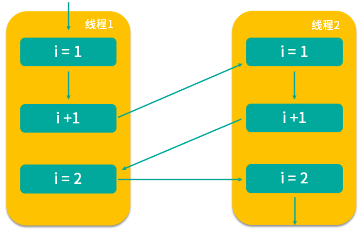

<!-- TOC -->

- [1、一共有哪 3 类线程安全问题？](#1一共有哪-3-类线程安全问题)
    - [1、运行结果错误（并发读写：线程切换非原子操作导致异常）](#1运行结果错误并发读写线程切换非原子操作导致异常)
    - [2、发布和初始化导致线程安全问题](#2发布和初始化导致线程安全问题)
    - [3、活跃性问题](#3活跃性问题)
        - [1、死锁](#1死锁)
        - [2、活锁](#2活锁)
        - [3、饥饿](#3饥饿)
- [2、哪些场景需要额外注意线程安全问题？](#2哪些场景需要额外注意线程安全问题)
    - [1、访问共享变量或资源](#1访问共享变量或资源)
    - [2、依赖时序的操作](#2依赖时序的操作)
    - [3、不同数据之间存在绑定关系](#3不同数据之间存在绑定关系)
    - [4、对方没有声明自己是线程安全的（非线程安全类并发问题）](#4对方没有声明自己是线程安全的非线程安全类并发问题)
- [3、为什么多线程会带来性能问题？](#3为什么多线程会带来性能问题)
    - [1、什么是性能问题](#1什么是性能问题)
    - [2、为什么多线程会带来性能问题](#2为什么多线程会带来性能问题)
        - [1、调度开销](#1调度开销)
            - [1、上下文切换](#1上下文切换)
            - [2、缓存失效](#2缓存失效)
        - [2、协作开销](#2协作开销)

<!-- /TOC -->


# 1、一共有哪 3 类线程安全问题？

《Java Concurrency In Practice》的作者 Brian Goetz 对线程安全是这样理解的，当多个线程访问一个对象时，如果不用考虑这些线程在运行时环境下的调度和交替执行问题，也不需要进行额外的同步，而调用这个对象的行为都可以获得正确的结果，那这个对象便是线程安全的。

事实上，Brian Goetz 想表达的意思是，如果某个对象是线程安全的，那么对于使用者而言，在使用时就不需要考虑方法间的协调问题，比如不需要考虑不能同时写入或读写不能并行的问题，也不需要考虑任何额外的同步问题，比如不需要额外自己加 synchronized 锁，那么它才是线程安全的，可以看出对线程安全的定义还是非常苛刻的。

而我们在实际开发中经常会遇到线程不安全的情况，那么一共有哪 3 种典型的线程安全问题呢？

- 运行结果错误；
- 发布和初始化导致线程安全问题；
- 活跃性问题。


## 1、运行结果错误（并发读写：线程切换非原子操作导致异常）

首先，来看多线程同时操作一个变量导致的运行结果错误。

```java
public class WrongResult {
 
   volatile static int i;

   public static void main(String[] args) throws InterruptedException {
       Runnable r = new Runnable() {
           @Override
           public void run() {
               for (int j = 0; j < 10000; j++) {
                   i++;
               }
           }
       };
       Thread thread1 = new Thread(r);
       thread1.start();
       Thread thread2 = new Thread(r);
       thread2.start();
       thread1.join();
       thread2.join();
       System.out.println(i);
    }
}
```

如代码所示，首先定义了一个 int 类型的静态变量 i，然后启动两个线程，分别对变量 i 进行 10000 次 i++ 操作。理论上得到的结果应该是 20000，但实际结果却远小于理论结果，比如可能是12996，也可能是13323，每次的结果都还不一样，这是为什么呢？

是因为在多线程下，CPU 的调度是以时间片为单位进行分配的，每个线程都可以得到一定量的时间片。但如果线程拥有的时间片耗尽，它将会被暂停执行并让出 CPU 资源给其他线程，这样就有可能发生线程安全问题。比如 i++ 操作，表面上看只是一行代码，但实际上它并不是一个原子操作，它的执行步骤主要分为三步，而且在每步操作之间都有可能被打断。

- 第一个步骤是读取；
- 第二个步骤是增加；
- 第三个步骤是保存。

那么我们接下来看如何发生的线程不安全问题。



我们根据箭头指向依次看，线程 1 首先拿到 i=1 的结果，然后进行 i+1 操作，但此时 i+1 的结果并没有保存下来，线程 1 就被切换走了，于是 CPU 开始执行线程 2，它所做的事情和线程 1 是一样的 i++ 操作，但此时我们想一下，它拿到的 i 是多少？实际上和线程 1 拿到的 i 的结果一样都是 1，为什么呢？因为线程 1 虽然对 i 进行了 +1 操作，但结果没有保存，所以线程 2 看不到修改后的结果。

然后假设等线程 2 对 i 进行 +1 操作后，又切换到线程 1，让线程 1 完成未完成的操作，即将 i+1 的结果 2 保存下来，然后又切换到线程 2 完成 i=2 的保存操作，虽然两个线程都执行了对 i 进行 +1 的操作，但结果却最终保存了 i=2 的结果，而不是我们期望的 i=3，这样就发生了线程安全问题，导致了数据结果错误，这也是最典型的线程安全问题。


## 2、发布和初始化导致线程安全问题

我们创建对象并进行发布和初始化供其他类或对象使用是常见的操作，但如果我们操作的时间或地点不对，就可能导致线程安全问题。如代码所示。

```java
public class WrongInit {
 
    private Map<Integer, String> students;
 
    public WrongInit() {
        new Thread(new Runnable() {
            @Override
            public void run() {
                students = new HashMap<>();
                students.put(1, "王小美");
                students.put(2, "钱二宝");
                students.put(3, "周三");
                students.put(4, "赵四");
            }
        }).start();
     }
 
    public Map<Integer, String> getStudents() {
        return students;
    }
 
    public static void main(String[] args) throws InterruptedException {
        WrongInit multiThreadsError6 = new WrongInit();
        System.out.println(multiThreadsError6.getStudents().get(1));
 
    }
}
```

在类中，定义一个类型为 Map 的成员变量 students，Integer 是学号，String 是姓名。然后在构造函数中启动一个新线程，并在线程中为 students 赋值。

只有当线程运行完 run() 方法中的全部赋值操作后，4 名同学的全部信息才算是初始化完毕，可是我们看在主函数 mian() 中，初始化 WrongInit 类之后并没有进行任何休息就直接打印 1 号同学的信息，试想这个时候程序会出现什么情况？实际上会发生空指针异常。


这又是为什么呢？因为 students 这个成员变量是在构造函数中新建的线程中进行的初始化和赋值操作，而线程的启动需要一定的时间，但是我们的 main 函数并没有进行等待就直接获取数据，导致 getStudents 获取的结果为 null，这就是在错误的时间或地点发布或初始化造成的线程安全问题。


## 3、活跃性问题

最典型的有三种，分别为死锁、活锁和饥饿。

什么是活跃性问题呢，活跃性问题就是程序始终得不到运行的最终结果，相比于前面两种线程安全问题带来的数据错误或报错，活跃性问题带来的后果可能更严重，比如发生死锁会导致程序完全卡死，无法向下运行。

### 1、死锁

最常见的活跃性问题是死锁，死锁是指两个线程之间相互等待对方资源，但同时又互不相让，都想自己先执行，如代码所示。

```java
public class MayDeadLock {
 
    Object o1 = new Object();
    Object o2 = new Object();
 
    public void thread1() throws InterruptedException {
        synchronized (o1) {
            Thread.sleep(500);
            synchronized (o2) {
                System.out.println("线程1成功拿到两把锁");
           }
        }
    }
 
    public void thread2() throws InterruptedException {
        synchronized (o2) {
            Thread.sleep(500);
            synchronized (o1) {
                System.out.println("线程2成功拿到两把锁");
            }
        }
    }
 
    public static void main(String[] args) {
        MayDeadLock mayDeadLock = new MayDeadLock();
        new Thread(new Runnable() {
            @Override
            public void run() {
                try {
                    mayDeadLock.thread1();
                } catch (InterruptedException e) {
                    e.printStackTrace();
                }
            }
        }).start();
        new Thread(new Runnable() {
            @Override
            public void run() {
                try {
                    mayDeadLock.thread2();
                } catch (InterruptedException e) {
                    e.printStackTrace();
                }
            }
        }).start();
    }
}
```

首先，代码中创建了两个 Object 作为 synchronized 锁的对象，线程 1 先获取 o1 锁，sleep(500) 之后，获取 o2 锁；线程 2 与线程 1 执行顺序相反，先获取 o2 锁，sleep(500) 之后，获取 o1 锁。  假设两个线程几乎同时进入休息，休息完后，线程 1 想获取 o2 锁，线程 2 想获取 o1 锁，这时便发生了死锁，两个线程不主动调和，也不主动退出，就这样死死地等待对方先释放资源，导致程序得不到任何结果也不能停止运行。

### 2、活锁

第二种活跃性问题是活锁，活锁与死锁非常相似，也是程序一直等不到结果，但对比于死锁，活锁是活的，什么意思呢？因为正在运行的线程并没有阻塞，它始终在运行中，却一直得不到结果。

举一个例子，假设有一个消息队列，队列里放着各种各样需要被处理的消息，而某个消息由于自身被写错了导致不能被正确处理，执行时会报错，可是队列的重试机制会重新把它放在队列头进行优先重试处理，但这个消息本身无论被执行多少次，都无法被正确处理，每次报错后又会被放到队列头进行重试，周而复始，最终导致线程一直处于忙碌状态，但程序始终得不到结果，便发生了活锁问题。

### 3、饥饿

第三个典型的活跃性问题是饥饿，饥饿是指线程需要某些资源时始终得不到，尤其是CPU 资源，就会导致线程一直不能运行而产生的问题。在 Java 中有线程优先级的概念，Java 中优先级分为 1 到 10，1 最低，10 最高。如果我们把某个线程的优先级设置为 1，这是最低的优先级，在这种情况下，这个线程就有可能始终分配不到 CPU 资源，而导致长时间无法运行。或者是某个线程始终持有某个文件的锁，而其他线程想要修改文件就必须先获取锁，这样想要修改文件的线程就会陷入饥饿，长时间不能运行。


# 2、哪些场景需要额外注意线程安全问题？

这里总结了四种场景

## 1、访问共享变量或资源

典型的场景有访问共享对象的属性，访问 static 静态变量，访问共享的缓存，等等。因为这些信息不仅会被一个线程访问到，还有可能被多个线程同时访问，那么就有可能在并发读写的情况下发生线程安全问题。比如多线程同时 i++ 的例子：

```java
public class ThreadNotSafe1 {

    static int i;

    public static void main(String[] args) throws InterruptedException {
        Runnable r = new Runnable() {
            @Override
            public void run() {
                for (int j = 0; j < 10000; j++) {
                    i++;
                }
            }
        };
        Thread thread1 = new Thread(r);
        Thread thread2 = new Thread(r);
        thread1.start();
        thread2.start();
        thread1.join();
        thread2.join();
        System.out.println(i);
    }
}
```

如代码所示，两个线程同时对 i 进行 i++ 操作，最后的输出可能是 15875 等小于20000的数，而不是我们期待的20000，这便是非常典型的共享变量带来的线程安全问题。

## 2、依赖时序的操作

如果我们操作的正确性是依赖时序的，而在多线程的情况下又不能保障执行的顺序和我们预想的一致，这个时候就会发生线程安全问题，如下面的代码所示：

```java
if (map.containsKey(key)) {
    map.remove(obj)
}
```

代码中首先检查 map 中有没有 key 对应的元素，如果有则继续执行 remove 操作。此时，这个组合操作就是危险的，因为它是先检查后操作，而执行过程中可能会被打断。如果此时有两个线程同时进入 if() 语句，然后它们都检查到存在 key 对应的元素，于是都希望执行下面的 remove 操作，随后一个线程率先把 obj 给删除了，而另外一个线程它刚已经检查过存在 key 对应的元素，if 条件成立，所以它也会继续执行删除 obj 的操作，但实际上，集合中的 obj 已经被前面的线程删除了，这种情况下就可能导致线程安全问题。

类似的情况还有很多，比如我们先检查 x=1，如果 x=1 就修改 x 的值，代码如下所示：

```java
if (x == 1) {
    x = 7 * x;
}
```

这样类似的场景都是同样的道理，“检查与执行”并非原子性操作，在中间可能被打断，而检查之后的结果也可能在执行时已经过期、无效，换句话说，获得正确结果取决于幸运的时序。这种情况下，我们就需要对它进行加锁等保护措施来保障操作的原子性。

## 3、不同数据之间存在绑定关系

有时候，我们的不同数据之间是成组出现的，存在着相互对应或绑定的关系，最典型的就是 IP 和端口号。有时候我们更换了 IP，往往需要同时更换端口号，如果没有把这两个操作绑定在一起，就有可能出现单独更换了 IP 或端口号的情况，而此时信息如果已经对外发布，信息获取方就有可能获取一个错误的 IP 与端口绑定情况，这时就发生了线程安全问题。在这种情况下，我们也同样需要保障操作的原子性。

## 4、对方没有声明自己是线程安全的（非线程安全类并发问题）

我们使用其他类时，如果对方没有声明自己是线程安全的，那么这种情况下对其他类进行多线程的并发操作，就有可能会发生线程安全问题。举个例子，比如说我们定义了 ArrayList，它本身并不是线程安全的，如果此时多个线程同时对 ArrayList 进行并发读/写，那么就有可能会产生线程安全问题，造成数据出错，而这个责任并不在 ArrayList，因为它本身并不是并发安全的，正如源码注释所写的：

Note that this implementation is not synchronized. If multiple threads
access an ArrayList instance concurrently, and at least one of the threads
modifies the list structurally, it must be synchronized externally.

这段话的意思是说，如果我们把 ArrayList 用在了多线程的场景，需要在外部手动用 synchronized 等方式保证并发安全。

所以 ArrayList 默认不适合并发读写，是我们错误地使用了它，导致了线程安全问题。所以，我们在使用其他类时如果会涉及并发场景，那么一定要首先确认清楚，对方是否支持并发操作，以上就是四种需要我们额外注意线程安全问题的场景，分别是访问共享变量或资源，依赖时序的操作，不同数据之间存在绑定关系，以及对方没有声明自己是线程安全的。


# 3、为什么多线程会带来性能问题？

## 1、什么是性能问题     

但对于多线程而言，它不仅可能会带来线程安全问题，还有可能会带来性能问题，也许你会奇怪，我们使用多线程的最大目的不就是为了提高性能吗？让多个线程同时工作，加快程序运行速度，为什么反而会带来性能问题呢？这是因为单线程程序是独立工作的，不需要与其他线程进行交互，但多线程之间则需要调度以及合作，调度与合作就会带来性能开销从而产生性能问题。


首先，我们来了解究竟什么是性能问题？其实性能问题有许多的表现形式，比如服务器的响应慢、吞吐量低、内存占用过多就属于性能问题。我们设计优秀的系统架构、购置更多的 CDN 服务器、购买更大的带宽等都是为了提高性能，提高用户体验，虽然运行速度慢不会带来严重的后果，通常只需要我们多等几秒就可以，但这会严重影响用户的体验。有研究表明，页面每多响应 1 秒，就会流失至少 7% 的用户，而超过 8 秒无法返回结果的话，几乎所有用户都不会选择继续等待。我们引入多线程的一大重要原因就是想提高程序性能，所以不能本末倒置，不能因为引入了多线程反而程序运行得更慢了，所以我们必须要解决多线程带来的性能问题。

## 2、为什么多线程会带来性能问题

那么什么情况下多线程编程会带来性能问题呢？主要有两个方面，一方面是线程调度，另一个方面是线程协作。

### 1、调度开销

#### 1、上下文切换      

首先，我们看一下线程调度，在实际开发中，线程数往往是大于 CPU 核心数的，比如 CPU 核心数可能是 8 核、16 核，等等，但线程数可能达到成百上千个。这种情况下，操作系统就会按照一定的调度算法，给每个线程分配时间片，让每个线程都有机会得到运行。而在进行调度时就会引起上下文切换，上下文切换会挂起当前正在执行的线程并保存当前的状态，然后寻找下一处即将恢复执行的代码，唤醒下一个线程，以此类推，反复执行。但上下文切换带来的开销是比较大的，假设我们的任务内容非常短，比如只进行简单的计算，那么就有可能发生我们上下文切换带来的性能开销比执行线程本身内容带来的开销还要大的情况。

#### 2、缓存失效

不仅上下文切换会带来性能问题，缓存失效也有可能带来性能问题。由于程序有很大概率会再次访问刚才访问过的数据，所以为了加速整个程序的运行，会使用缓存，这样我们在使用相同数据时就可以很快地获取数据。可一旦进行了线程调度，切换到其他线程，CPU就会去执行不同的代码，原有的缓存就很可能失效了，需要重新缓存新的数据，这也会造成一定的开销，所以线程调度器为了避免频繁地发生上下文切换，通常会给被调度到的线程设置最小的执行时间，也就是只有执行完这段时间之后，才可能进行下一次的调度，由此减少上下文切换的次数。


那么什么情况会导致密集的上下文切换呢？如果程序频繁地竞争锁，或者由于 IO 读写等原因导致频繁阻塞，那么这个程序就可能需要更多的上下文切换，这也就导致了更大的开销，我们应该尽量避免这种情况的发生。

### 2、协作开销       

除了线程调度之外，线程协作同样也有可能带来性能问题。因为线程之间如果有共享数据，为了避免数据错乱，为了保证线程安全，就有可能禁止编译器和 CPU 对其进行重排序等优化，也可能出于同步的目的，反复把线程工作内存的数据 flush 到主存中，然后再从主内存 refresh 到其他线程的工作内存中，等等。这些问题在单线程中并不存在，但在多线程中为了确保数据的正确性，就不得不采取上述方法，因为线程安全的优先级要比性能优先级更高，这也间接降低了我们的性能。


