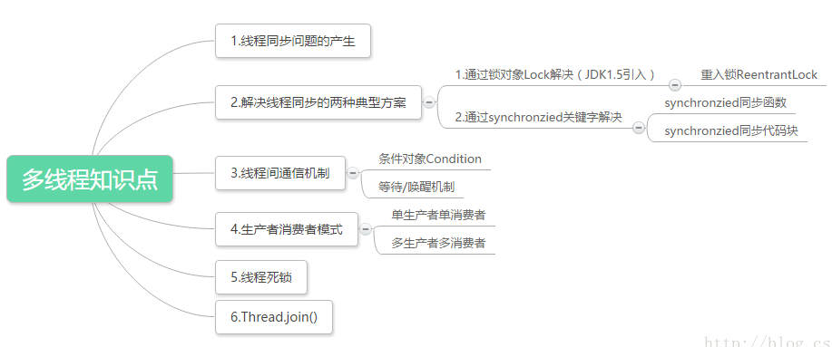

# 并发编程模型的分类

在并发编程中，我们需要处理两个关键问题：线程之间如何通信及线程之间如何同步（这里的线程是指并发执行的活动实体）。
通信是指线程之间以何种机制来交换信息。在命令式编程中，线程之间的通信机制有两种：[共享内存]（隐式通信，显示同步）和[消息传递]（显示通信，隐式同步）。

在共享内存的并发模型里，线程之间共享程序的公共状态，线程之间通过写-读内存中的公共状态来隐式进行通信。

在消息传递的并发模型里，线程之间没有公共状态，线程之间必须通过明确的发送消息来显式进行通信。

同步是指程序用于控制不同线程之间操作发生相对顺序的机制。在共享内存并发模型里，同步是显式进行的。程序员必须显式指定某个方法或某段代码需要在线程之间互斥执行。

在消息传递的并发模型里，由于消息的发送必须在消息的接收之前，因此同步是隐式进行的。

Java的并发采用的是共享内存模型，Java线程之间的通信总是隐式进行，整个通信过程对程序员完全透明。

如果编写多线程程序的Java程序员不理解隐式进行的线程之间通信的工作机制，很可能会遇到各种奇怪的内存可见性问题。





- 1、线程同步的目的是为了保护多个线程访问一个资源时对资源的破坏。
- 2、线程同步方法是通过锁来实现，每个对象都有且仅有一个锁，这个锁与一个特定的对象关联，线程一旦获取了对象锁，其他访问该对象的线程就无法再访问该对象的其他同步方法
- 3、对于静态同步方法，锁是针对这个类的，锁对象是该类的Class对象。静态和非静态方法的锁互不干预。一个线程获得锁，当在一个同步方法中访问另外对象上的同步方法时，会获取这两个对象锁。
- 4、对于同步，要时刻清醒在哪个对象上同步，这是关键。
- 5、编写线程安全的类，需要时刻注意对多个线程竞争访问资源的逻辑和安全做出正确的判断，对“原子”操作做出分析，并保证原子操作期间别的线程无法访问竞争资源。
- 6、当多个线程等待一个对象锁时，没有获取到锁的线程将发生阻塞。
- 7、死锁是线程间相互等待锁锁造成的，在实际中发生的概率非常的小。


# 深入理解线程通信

## 前言

开发中不免会遇到需要所有子线程执行完毕通知主线程处理某些逻辑的场景。

或者是线程 A 在执行到某个条件通知线程 B 执行某个操作。

可以通过以下几种方式实现：


## 等待通知机制
> 等待通知模式是 Java 中比较经典的线程通信方式。

两个线程通过对同一对象调用等待 wait() 和通知 notify() 方法来进行通讯。

如两个线程交替打印奇偶数：

```java
public class TwoThreadWaitNotify {

    private int start = 1;

    private boolean flag = false;

    public static void main(String[] args) {
        TwoThreadWaitNotify twoThread = new TwoThreadWaitNotify();

        Thread t1 = new Thread(new OuNum(twoThread));
        t1.setName("A");


        Thread t2 = new Thread(new JiNum(twoThread));
        t2.setName("B");

        t1.start();
        t2.start();
    }

    /**
     * 偶数线程
     */
    public static class OuNum implements Runnable {
        private TwoThreadWaitNotify number;

        public OuNum(TwoThreadWaitNotify number) {
            this.number = number;
        }

        @Override
        public void run() {

            while (number.start <= 100) {
                synchronized (TwoThreadWaitNotify.class) {
                    System.out.println("偶数线程抢到锁了");
                    if (number.flag) {
                        System.out.println(Thread.currentThread().getName() + "+-+偶数" + number.start);
                        number.start++;

                        number.flag = false;
                        TwoThreadWaitNotify.class.notify();

                    }else {
                        try {
                            TwoThreadWaitNotify.class.wait();
                        } catch (InterruptedException e) {
                            e.printStackTrace();
                        }
                    }
                }

            }
        }
    }


    /**
     * 奇数线程
     */
    public static class JiNum implements Runnable {
        private TwoThreadWaitNotify number;

        public JiNum(TwoThreadWaitNotify number) {
            this.number = number;
        }

        @Override
        public void run() {
            while (number.start <= 100) {
                synchronized (TwoThreadWaitNotify.class) {
                    System.out.println("奇数线程抢到锁了");
                    if (!number.flag) {
                        System.out.println(Thread.currentThread().getName() + "+-+奇数" + number.start);
                        number.start++;

                        number.flag = true;

                        TwoThreadWaitNotify.class.notify();
                    }else {
                        try {
                            TwoThreadWaitNotify.class.wait();
                        } catch (InterruptedException e) {
                            e.printStackTrace();
                        }
                    }
                }
            }
        }
    }
}
```

输出结果：

```
t2+-+奇数93
t1+-+偶数94
t2+-+奇数95
t1+-+偶数96
t2+-+奇数97
t1+-+偶数98
t2+-+奇数99
t1+-+偶数100
```

这里的线程 A 和线程 B 都对同一个对象 `TwoThreadWaitNotify.class` 获取锁，A 线程调用了同步对象的 wait() 方法释放了锁并进入 `WAITING` 状态。

B 线程调用了 notify() 方法，这样 A 线程收到通知之后就可以从 wait() 方法中返回。

这里利用了 `TwoThreadWaitNotify.class` 对象完成了通信。

有一些需要注意:

- wait() 、notify()、notifyAll() 调用的前提都是获得了对象的锁(也可称为对象监视器)。
- 调用 wait() 方法后线程会释放锁，进入 `WAITING` 状态，该线程也会被移动到**等待队列**中。
- 调用 notify() 方法会将**等待队列**中的线程移动到**同步队列**中，线程状态也会更新为 `BLOCKED`
- 从 wait() 方法返回的前提是调用 notify() 方法的线程释放锁，wait() 方法的线程获得锁。

等待通知有着一个经典范式：

线程 A 作为消费者：

1. 获取对象的锁。
2. 进入 while(判断条件)，并调用 wait() 方法。
3. 当条件满足跳出循环执行具体处理逻辑。

线程 B 作为生产者:

1. 获取对象锁。
2. 更改与线程 A 共用的判断条件。
3. 调用 notify() 方法。

伪代码如下:

```
//Thread A

synchronized(Object){
    while(条件){
        Object.wait();
    }
    //do something
}

//Thread B
synchronized(Object){
    条件=false;//改变条件
    Object.notify();
}

```


## join() 方法

```java
    private static void join() throws InterruptedException {
        Thread t1 = new Thread(new Runnable() {
            @Override
            public void run() {
                LOGGER.info("running");
                try {
                    Thread.sleep(3000);
                } catch (InterruptedException e) {
                    e.printStackTrace();
                }
            }
        }) ;
        Thread t2 = new Thread(new Runnable() {
            @Override
            public void run() {
                LOGGER.info("running2");
                try {
                    Thread.sleep(4000);
                } catch (InterruptedException e) {
                    e.printStackTrace();
                }
            }
        }) ;

        t1.start();
        t2.start();

        //等待线程1终止
        t1.join();

        //等待线程2终止
        t2.join();

        LOGGER.info("main over");
    }
```

输出结果:

```
2018-03-16 20:21:30.967 [Thread-1] INFO  c.c.actual.ThreadCommunication - running2
2018-03-16 20:21:30.967 [Thread-0] INFO  c.c.actual.ThreadCommunication - running
2018-03-16 20:21:34.972 [main] INFO  c.c.actual.ThreadCommunication - main over

```

在  `t1.join()` 时会一直阻塞到 t1 执行完毕，所以最终主线程会等待 t1 和 t2 线程执行完毕。

其实从源码可以看出，join() 也是利用的等待通知机制：

核心逻辑:

```java
    while (isAlive()) {
        wait(0);
    }
```

在 join 线程完成后会调用 notifyAll() 方法，是在 JVM 实现中调用，所以这里看不出来。

## volatile 共享内存

因为 Java 是采用共享内存的方式进行线程通信的，所以可以采用以下方式用主线程关闭 A 线程:

```java
public class Volatile implements Runnable{

    private static volatile boolean flag = true ;

    @Override
    public void run() {
        while (flag){
            System.out.println(Thread.currentThread().getName() + "正在运行。。。");
        }
        System.out.println(Thread.currentThread().getName() +"执行完毕");
    }

    public static void main(String[] args) throws InterruptedException {
        Volatile aVolatile = new Volatile();
        new Thread(aVolatile,"thread A").start();


        System.out.println("main 线程正在运行") ;

        TimeUnit.MILLISECONDS.sleep(100) ;

        aVolatile.stopThread();

    }

    private void stopThread(){
        flag = false ;
    }
}
```

输出结果：
```
thread A正在运行。。。
thread A正在运行。。。
thread A正在运行。。。
thread A正在运行。。。
thread A执行完毕
```

这里的 flag 存放于主内存中，所以主线程和线程 A 都可以看到。

flag 采用 volatile 修饰主要是为了内存可见性，更多内容可以查看[这里](http://crossoverjie.top/2018/03/09/volatile/)。


## CountDownLatch 并发工具

CountDownLatch 可以实现 join 相同的功能，但是更加的灵活。

```java
    private static void countDownLatch() throws Exception{
        int thread = 3 ;
        long start = System.currentTimeMillis();
        final CountDownLatch countDown = new CountDownLatch(thread);
        for (int i= 0 ;i<thread ; i++){
            new Thread(new Runnable() {
                @Override
                public void run() {
                    LOGGER.info("thread run");
                    try {
                        Thread.sleep(2000);
                        countDown.countDown();

                        LOGGER.info("thread end");
                    } catch (InterruptedException e) {
                        e.printStackTrace();
                    }
                }
            }).start();
        }

        countDown.await();
        long stop = System.currentTimeMillis();
        LOGGER.info("main over total time={}",stop-start);
    }
```

输出结果:

```
2018-03-16 20:19:44.126 [Thread-0] INFO  c.c.actual.ThreadCommunication - thread run
2018-03-16 20:19:44.126 [Thread-2] INFO  c.c.actual.ThreadCommunication - thread run
2018-03-16 20:19:44.126 [Thread-1] INFO  c.c.actual.ThreadCommunication - thread run
2018-03-16 20:19:46.136 [Thread-2] INFO  c.c.actual.ThreadCommunication - thread end
2018-03-16 20:19:46.136 [Thread-1] INFO  c.c.actual.ThreadCommunication - thread end
2018-03-16 20:19:46.136 [Thread-0] INFO  c.c.actual.ThreadCommunication - thread end
2018-03-16 20:19:46.136 [main] INFO  c.c.actual.ThreadCommunication - main over total time=2012
```

CountDownLatch 也是基于 AQS(AbstractQueuedSynchronizer) 实现的，更多实现参考 [ReentrantLock 实现原理](http://crossoverjie.top/2018/01/25/ReentrantLock/)

- 初始化一个 CountDownLatch 时告诉并发的线程，然后在每个线程处理完毕之后调用 countDown() 方法。
- 该方法会将 AQS 内置的一个 state 状态 -1 。
- 最终在主线程调用 await() 方法，它会阻塞直到 `state == 0` 的时候返回。

## CyclicBarrier 并发工具

```java
    private static void cyclicBarrier() throws Exception {
        CyclicBarrier cyclicBarrier = new CyclicBarrier(3) ;

        new Thread(new Runnable() {
            @Override
            public void run() {
                LOGGER.info("thread run");
                try {
                    cyclicBarrier.await() ;
                } catch (Exception e) {
                    e.printStackTrace();
                }

                LOGGER.info("thread end do something");
            }
        }).start();

        new Thread(new Runnable() {
            @Override
            public void run() {
                LOGGER.info("thread run");
                try {
                    cyclicBarrier.await() ;
                } catch (Exception e) {
                    e.printStackTrace();
                }

                LOGGER.info("thread end do something");
            }
        }).start();

        new Thread(new Runnable() {
            @Override
            public void run() {
                LOGGER.info("thread run");
                try {
                    Thread.sleep(5000);
                    cyclicBarrier.await() ;
                } catch (Exception e) {
                    e.printStackTrace();
                }

                LOGGER.info("thread end do something");
            }
        }).start();

        LOGGER.info("main thread");
    }
```

CyclicBarrier 中文名叫做屏障或者是栅栏，也可以用于线程间通信。

它可以等待 N 个线程都达到某个状态后继续运行的效果。

1. 首先初始化线程参与者。
2. 调用 `await()` 将会在所有参与者线程都调用之前等待。
3. 直到所有参与者都调用了 `await()` 后，所有线程从 `await()` 返回继续后续逻辑。

运行结果:

```
2018-03-18 22:40:00.731 [Thread-0] INFO  c.c.actual.ThreadCommunication - thread run
2018-03-18 22:40:00.731 [Thread-1] INFO  c.c.actual.ThreadCommunication - thread run
2018-03-18 22:40:00.731 [Thread-2] INFO  c.c.actual.ThreadCommunication - thread run
2018-03-18 22:40:00.731 [main] INFO  c.c.actual.ThreadCommunication - main thread
2018-03-18 22:40:05.741 [Thread-0] INFO  c.c.actual.ThreadCommunication - thread end do something
2018-03-18 22:40:05.741 [Thread-1] INFO  c.c.actual.ThreadCommunication - thread end do something
2018-03-18 22:40:05.741 [Thread-2] INFO  c.c.actual.ThreadCommunication - thread end do something
```

可以看出由于其中一个线程休眠了五秒，所有其余所有的线程都得等待这个线程调用 `await()` 。

该工具可以实现 CountDownLatch 同样的功能，但是要更加灵活。甚至可以调用 `reset()` 方法重置 CyclicBarrier (需要自行捕获 BrokenBarrierException 处理) 然后重新执行。

## 线程响应中断

```java
public class StopThread implements Runnable {
    @Override
    public void run() {

        while ( !Thread.currentThread().isInterrupted()) {
            // 线程执行具体逻辑
            System.out.println(Thread.currentThread().getName() + "运行中。。");
        }

        System.out.println(Thread.currentThread().getName() + "退出。。");

    }

    public static void main(String[] args) throws InterruptedException {
        Thread thread = new Thread(new StopThread(), "thread A");
        thread.start();

        System.out.println("main 线程正在运行") ;

        TimeUnit.MILLISECONDS.sleep(10) ;
        thread.interrupt();
    }


}
```

输出结果:

```
thread A运行中。。
thread A运行中。。
thread A退出。。
```

可以采用中断线程的方式来通信，调用了 `thread.interrupt()` 方法其实就是将 thread 中的一个标志属性置为了 true。

并不是说调用了该方法就可以中断线程，如果不对这个标志进行响应其实是没有什么作用(这里对这个标志进行了判断)。

**但是如果抛出了 InterruptedException 异常，该标志就会被 JVM 重置为 false。**

## 线程池 awaitTermination() 方法

如果是用线程池来管理线程，可以使用以下方式来让主线程等待线程池中所有任务执行完毕:

```java
    private static void executorService() throws Exception{
        BlockingQueue<Runnable> queue = new LinkedBlockingQueue<>(10) ;
        ThreadPoolExecutor poolExecutor = new ThreadPoolExecutor(5,5,1, TimeUnit.MILLISECONDS,queue) ;
        poolExecutor.execute(new Runnable() {
            @Override
            public void run() {
                LOGGER.info("running");
                try {
                    Thread.sleep(3000);
                } catch (InterruptedException e) {
                    e.printStackTrace();
                }
            }
        });
        poolExecutor.execute(new Runnable() {
            @Override
            public void run() {
                LOGGER.info("running2");
                try {
                    Thread.sleep(2000);
                } catch (InterruptedException e) {
                    e.printStackTrace();
                }
            }
        });

        poolExecutor.shutdown();
        while (!poolExecutor.awaitTermination(1,TimeUnit.SECONDS)){
            LOGGER.info("线程还在执行。。。");
        }
        LOGGER.info("main over");
    }
```

输出结果:

```
2018-03-16 20:18:01.273 [pool-1-thread-2] INFO  c.c.actual.ThreadCommunication - running2
2018-03-16 20:18:01.273 [pool-1-thread-1] INFO  c.c.actual.ThreadCommunication - running
2018-03-16 20:18:02.273 [main] INFO  c.c.actual.ThreadCommunication - 线程还在执行。。。
2018-03-16 20:18:03.278 [main] INFO  c.c.actual.ThreadCommunication - 线程还在执行。。。
2018-03-16 20:18:04.278 [main] INFO  c.c.actual.ThreadCommunication - main over
```

使用这个 `awaitTermination()` 方法的前提需要关闭线程池，如调用了 `shutdown()` 方法。

调用了 `shutdown()` 之后线程池会停止接受新任务，并且会平滑的关闭线程池中现有的任务。


## 管道通信

```java
    public static void piped() throws IOException {
        //面向于字符 PipedInputStream 面向于字节
        PipedWriter writer = new PipedWriter();
        PipedReader reader = new PipedReader();

        //输入输出流建立连接
        writer.connect(reader);


        Thread t1 = new Thread(new Runnable() {
            @Override
            public void run() {
                LOGGER.info("running");
                try {
                    for (int i = 0; i < 10; i++) {

                        writer.write(i+"");
                        Thread.sleep(10);
                    }
                } catch (Exception e) {

                } finally {
                    try {
                        writer.close();
                    } catch (IOException e) {
                        e.printStackTrace();
                    }
                }

            }
        });
        Thread t2 = new Thread(new Runnable() {
            @Override
            public void run() {
                LOGGER.info("running2");
                int msg = 0;
                try {
                    while ((msg = reader.read()) != -1) {
                        LOGGER.info("msg={}", (char) msg);
                    }

                } catch (Exception e) {

                }
            }
        });
        t1.start();
        t2.start();
    }
```

输出结果:

```
2018-03-16 19:56:43.014 [Thread-0] INFO  c.c.actual.ThreadCommunication - running
2018-03-16 19:56:43.014 [Thread-1] INFO  c.c.actual.ThreadCommunication - running2
2018-03-16 19:56:43.130 [Thread-1] INFO  c.c.actual.ThreadCommunication - msg=0
2018-03-16 19:56:43.132 [Thread-1] INFO  c.c.actual.ThreadCommunication - msg=1
2018-03-16 19:56:43.132 [Thread-1] INFO  c.c.actual.ThreadCommunication - msg=2
2018-03-16 19:56:43.133 [Thread-1] INFO  c.c.actual.ThreadCommunication - msg=3
2018-03-16 19:56:43.133 [Thread-1] INFO  c.c.actual.ThreadCommunication - msg=4
2018-03-16 19:56:43.133 [Thread-1] INFO  c.c.actual.ThreadCommunication - msg=5
2018-03-16 19:56:43.133 [Thread-1] INFO  c.c.actual.ThreadCommunication - msg=6
2018-03-16 19:56:43.134 [Thread-1] INFO  c.c.actual.ThreadCommunication - msg=7
2018-03-16 19:56:43.134 [Thread-1] INFO  c.c.actual.ThreadCommunication - msg=8
2018-03-16 19:56:43.134 [Thread-1] INFO  c.c.actual.ThreadCommunication - msg=9
```

Java 虽说是基于内存通信的，但也可以使用管道通信。

需要注意的是，输入流和输出流需要首先建立连接。这样线程 B 就可以收到线程 A 发出的消息了。


实际开发中可以灵活根据需求选择最适合的线程通信方式。


# 参考

https://www.infoq.cn/article/java-memory-model-1