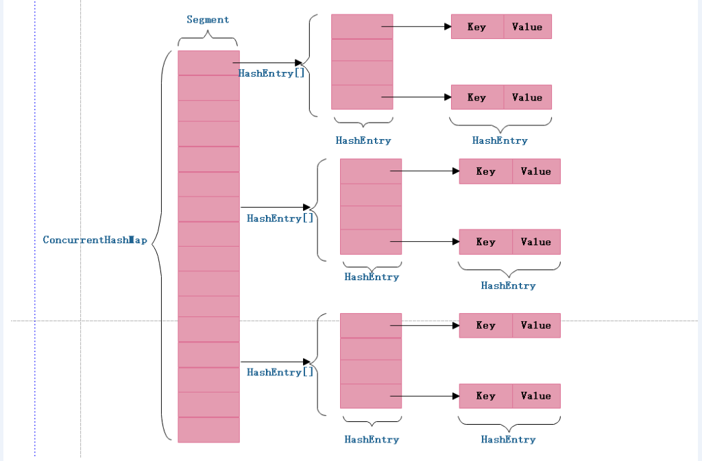

<!-- TOC -->

- [0、实现原理](#0实现原理)
    - [1、初始化](#1初始化)
    - [2、put 过程分析](#2put-过程分析)
        - [1、初始化槽: ensureSegment](#1初始化槽-ensuresegment)
        - [2、获取写入锁: scanAndLockForPut](#2获取写入锁-scanandlockforput)
        - [3、扩容: rehash](#3扩容-rehash)
    - [3、get 过程分析](#3get-过程分析)
    - [4、并发问题分析](#4并发问题分析)
        - [1、put 操作的线程安全性](#1put-操作的线程安全性)
        - [2、remove 操作的线程安全性](#2remove-操作的线程安全性)
- [1、ConcurrentMap](#1concurrentmap)
- [2、ConcurrentHashMap主要方法](#2concurrenthashmap主要方法)
    - [1、成员变量](#1成员变量)
- [3、Segment结构](#3segment结构)
- [4、HashEntry](#4hashentry)
- [5、如何把hashentry转化为map.entry](#5如何把hashentry转化为mapentry)
    - [1、EntrySet的迭代器为EntryIterator](#1entryset的迭代器为entryiterator)
    - [2、EntryIterator，把每个entry对象包裹成WriteThroughEntry对象](#2entryiterator把每个entry对象包裹成writethroughentry对象)
    - [3、HashIterator，封装了HashEntry对象](#3hashiterator封装了hashentry对象)
- [4、KeyIterator和ValueIterator](#4keyiterator和valueiterator)
- [参考](#参考)

<!-- /TOC -->

> 问题

- 1、如何保证线程安全？
- 2、如何提高读写性能？


# 0、实现原理


> 特点总结

- 1、二级hash结构；
- 2、锁分段，一个segment一个段；segment大小可以在初始化时指定，但是初始化后不可扩容；
- 3、同一Segment的写和读是可以并发执行的。但是同一Segment并发写入不允许。


> 1、Get方法

- 1.为输入的Key做Hash运算，得到hash值。
- 2.通过hash值，定位到对应的Segment对象
- 3.再次通过hash值，定位到Segment当中数组的具体位置。

> 2、Put方法

- 1.为输入的Key做Hash运算，得到hash值。
- 2.通过hash值，定位到对应的Segment对象
- 3.获取可重入锁
- 4.再次通过hash值，定位到Segment当中数组的具体位置。
- 5.插入或覆盖HashEntry对象。
- 6.释放锁。

> 3、size方法

ConcurrentHashMap的Size方法是一个嵌套循环，大体逻辑如下：

- 1.遍历所有的Segment。
- 2.把Segment的元素数量累加起来。
- 3.把Segment的修改次数累加起来。
- 4.判断所有Segment的总修改次数是否大于上一次的总修改次数。如果大于，说明统计过程中有修改，重新统计，尝试次数+1；如果不是。说明没有修改，统计结束。
- 5.如果尝试次数超过阈值，则对每一个Segment加锁，再重新统计。
- 6.再次判断所有Segment的总修改次数是否大于上一次的总修改次数。由于已经加锁，次数一定和上次相等。
- 7.释放锁，统计结束。

为什么这样设计呢？这种思想和乐观锁悲观锁的思想如出一辙。为了尽量不锁住所有Segment，首先乐观地假设Size过程中不会有修改。当尝试一定次数，才无奈转为悲观锁，锁住所有Segment保证强一致性。


ConcurrentHashMap 和 HashMap 思路是差不多的，但是因为它支持并发操作，所以要复杂一些。

整个 ConcurrentHashMap 由一个个 Segment 组成，Segment 代表”部分“或”一段“的意思，所以很多地方都会将其描述为分段锁。注意，行文中，我很多地方用了“槽”来代表一个 segment。

简单理解就是，ConcurrentHashMap 是一个 Segment 数组，Segment 通过继承 ReentrantLock 来进行加锁，所以每次需要加锁的操作锁住的是一个 segment，这样只要保证每个 Segment 是线程安全的，也就实现了全局的线程安全。




concurrencyLevel：并行级别、并发数、Segment 数，怎么翻译不重要，理解它。默认是 16，也就是说 ConcurrentHashMap 有 16 个 Segments，所以理论上，这个时候，最多可以同时支持 16 个线程并发写，只要它们的操作分别分布在不同的 Segment 上。这个值可以在初始化的时候设置为其他值，`但是一旦初始化以后，它是不可以扩容的`。

再具体到每个 Segment 内部，其实每个 Segment 很像之前介绍的 HashMap，不过它要保证线程安全，所以处理起来要麻烦些。


在多线程环境下，使用HashMap进行put操作时存在丢失数据的情况，为了避免这种bug的隐患，强烈建议使用ConcurrentHashMap代替HashMap。

HashTable是一个线程安全的类，它使用synchronized来锁住整张Hash表来实现线程安全，即每次锁住整张表让线程独占，相当于所有线程进行读写时都去竞争一把锁，导致效率非常低下。ConcurrentHashMap可以做到`读取数据不加锁`，并且其内部的结构可以让其在进行写操作的时候能够将锁的粒度保持地尽量地小，允许多个修改操作并发进行，其关键在于使用了`锁分离`技术。它使用了多个锁来控制对hash表的不同部分进行的修改。ConcurrentHashMap内部使用段(Segment)来表示这些不同的部分，每个段其实就是一个小的Hashtable，它们有自己的锁。只要多个修改操作发生在不同的段上，它们就可以并发进行。

ConcurrentHashMap 为了提高本身的并发能力，在内部采用了一个叫做 Segment 的结构，一个 Segment 其实就是一个类 Hash Table 的结构，Segment 内部维护了一个链表数组，我们用下面这一幅图来看下 ConcurrentHashMap 的内部结构,从下面的结构我们可以了解到，ConcurrentHashMap 定位一个元素的过程需要进行两次Hash操作，第一次 Hash 定位到 Segment，第二次 Hash 定位到元素所在的链表的头部，因此，这一种结构的带来的副作用是 Hash 的过程要比普通的 HashMap 要长，但是带来的好处是写操作的时候可以只对元素所在的 Segment 进行操作即可，不会影响到其他的 Segment，这样，在最理想的情况下，ConcurrentHashMap 可以最高同时支持 Segment 数量大小的写操作（刚好这些写操作都非常平均地分布在所有的 Segment上），所以，通过这一种结构，ConcurrentHashMap 的并发能力可以大大的提高。


不难看出，ConcurrentHashMap采用了二次hash的方式，第一次hash将key映射到对应的segment，而第二次hash则是映射到segment的不同桶(bucket)中。

为什么要用二次hash，主要原因是为了构造分离锁，使得对于map的修改不会锁住整个容器，提高并发能力。当然，没有一种东西是绝对完美的，二次hash带来的问题是整个hash的过程比hashmap单次hash要长，所以，如果不是并发情形，不要使用concurrentHashmap。

JAVA7之前ConcurrentHashMap主要采用锁机制，在对某个Segment进行操作时，将该Segment锁定，不允许对其进行非查询操作，而在JAVA8之后采用CAS无锁算法，这种乐观操作在完成前进行判断，如果符合预期结果才给予执行，对并发操作提供良好的优化.


## 1、初始化

initialCapacity：初始容量，这个值指的是整个 ConcurrentHashMap 的初始容量，实际操作的时候需要平均分给每个 Segment。

loadFactor：负载因子，之前我们说了，Segment 数组不可以扩容，所以这个负载因子是给每个 Segment 内部使用的。

```java
public ConcurrentHashMap(int initialCapacity,
                         float loadFactor, int concurrencyLevel) {
    if (!(loadFactor > 0) || initialCapacity < 0 || concurrencyLevel <= 0)
        throw new IllegalArgumentException();
    if (concurrencyLevel > MAX_SEGMENTS)
        concurrencyLevel = MAX_SEGMENTS;
    // Find power-of-two sizes best matching arguments
    int sshift = 0;
    int ssize = 1;
    // 计算并行级别 ssize，因为要保持并行级别是 2 的 n 次方
    while (ssize < concurrencyLevel) {
        ++sshift;
        ssize <<= 1;
    }
    // 我们这里先不要那么烧脑，用默认值，concurrencyLevel 为 16，sshift 为 4
    // 那么计算出 segmentShift 为 28，segmentMask 为 15，后面会用到这两个值
    this.segmentShift = 32 - sshift;
    this.segmentMask = ssize - 1;

    if (initialCapacity > MAXIMUM_CAPACITY)
        initialCapacity = MAXIMUM_CAPACITY;

    // initialCapacity 是设置整个 map 初始的大小，
    // 这里根据 initialCapacity 计算 Segment 数组中每个位置可以分到的大小
    // 如 initialCapacity 为 64，那么每个 Segment 或称之为"槽"可以分到 4 个
    int c = initialCapacity / ssize;
    if (c * ssize < initialCapacity)
        ++c;
    // 默认 MIN_SEGMENT_TABLE_CAPACITY 是 2，这个值也是有讲究的，因为这样的话，对于具体的槽上，
    // 插入一个元素不至于扩容，插入第二个的时候才会扩容
    int cap = MIN_SEGMENT_TABLE_CAPACITY; 
    while (cap < c)
        cap <<= 1;

    // 创建 Segment 数组，
    // 并创建数组的第一个元素 segment[0]
    Segment<K,V> s0 =
        new Segment<K,V>(loadFactor, (int)(cap * loadFactor),
                         (HashEntry<K,V>[])new HashEntry[cap]);
    Segment<K,V>[] ss = (Segment<K,V>[])new Segment[ssize];
    // 往数组写入 segment[0]
    UNSAFE.putOrderedObject(ss, SBASE, s0); // ordered write of segments[0]
    this.segments = ss;
}
```
初始化完成，我们得到了一个 Segment 数组。

我们就当是用 new ConcurrentHashMap() 无参构造函数进行初始化的(默认容量16)，那么初始化完成后：

- Segment 数组长度为 16，不可以扩容
- Segment[i] 的默认大小为 2，负载因子是 0.75，得出初始阈值为 1.5，也就是以后插入第一个元素不会触发扩容，插入第二个会进行第一次扩容
- 这里初始化了 segment[0]，其他位置还是 null，至于为什么要初始化 segment[0]，后面的代码会介绍
- 当前 segmentShift 的值为 32 - 4 = 28，segmentMask 为 16 - 1 = 15，姑且把它们简单翻译为移位数和掩码，这两个值马上就会用到

## 2、put 过程分析

我们先看 put 的主流程，对于其中的一些关键细节操作，后面会进行详细介绍。

```java
public V put(K key, V value) {
    Segment<K,V> s;
    if (value == null)
        throw new NullPointerException();
    // 1. 计算 key 的 hash 值
    int hash = hash(key);
    // 2. 根据 hash 值找到 Segment 数组中的位置 j
    //    hash 是 32 位，无符号右移 segmentShift(28) 位，剩下高 4 位，
    //    然后和 segmentMask(15) 做一次与操作，也就是说 j 是 hash 值的高 4 位，也就是槽的数组下标
    int j = (hash >>> segmentShift) & segmentMask;
    // 刚刚说了，初始化的时候初始化了 segment[0]，但是其他位置还是 null，
    // ensureSegment(j) 对 segment[j] 进行初始化
    if ((s = (Segment<K,V>)UNSAFE.getObject          // nonvolatile; recheck
         (segments, (j << SSHIFT) + SBASE)) == null) //  in ensureSegment
        s = ensureSegment(j);
    // 3. 插入新值到 槽 s 中
    return s.put(key, hash, value, false);
}
```
第一层皮很简单，根据 hash 值很快就能找到相应的 Segment，之后就是 Segment 内部的 put 操作了。


Segment 内部是由 数组+链表 组成的。


```java
final V put(K key, int hash, V value, boolean onlyIfAbsent) {
    // 在往该 segment 写入前，需要先获取该 segment 的独占锁
    //    先看主流程，后面还会具体介绍这部分内容
    HashEntry<K,V> node = tryLock() ? null :
        scanAndLockForPut(key, hash, value);
    V oldValue;
    try {
        // 这个是 segment 内部的数组
        HashEntry<K,V>[] tab = table;
        // 再利用 hash 值，求应该放置的数组下标
        int index = (tab.length - 1) & hash;
        // first 是数组该位置处的链表的表头
        HashEntry<K,V> first = entryAt(tab, index);

        // 下面这串 for 循环虽然很长，不过也很好理解，想想该位置没有任何元素和已经存在一个链表这两种情况
        for (HashEntry<K,V> e = first;;) {
            if (e != null) {
                K k;
                if ((k = e.key) == key ||
                    (e.hash == hash && key.equals(k))) {
                    oldValue = e.value;
                    if (!onlyIfAbsent) {
                        // 覆盖旧值
                        e.value = value;
                        ++modCount;
                    }
                    break;
                }
                // 继续顺着链表走
                e = e.next;
            }
            else {
                // node 到底是不是 null，这个要看获取锁的过程，不过和这里都没有关系。
                // 如果不为 null，那就直接将它设置为链表表头；如果是null，初始化并设置为链表表头。
                if (node != null)
                    node.setNext(first);
                else
                    node = new HashEntry<K,V>(hash, key, value, first);

                int c = count + 1;
                // 如果超过了该 segment 的阈值，这个 segment 需要扩容
                if (c > threshold && tab.length < MAXIMUM_CAPACITY)
                    rehash(node); // 扩容后面也会具体分析
                else
                    // 没有达到阈值，将 node 放到数组 tab 的 index 位置，
                    // 其实就是将新的节点设置成原链表的表头
                    setEntryAt(tab, index, node);
                ++modCount;
                count = c;
                oldValue = null;
                break;
            }
        }
    } finally {
        // 解锁
        unlock();
    }
    return oldValue;
}
```

整体流程还是比较简单的，由于有独占锁的保护，所以 segment 内部的操作并不复杂。至于这里面的并发问题，我们稍后再进行介绍。

到这里 put 操作就结束了，接下来，我们说一说其中几步关键的操作。

### 1、初始化槽: ensureSegment

ConcurrentHashMap 初始化的时候会初始化第一个槽 segment[0]，对于其他槽来说，在插入第一个值的时候进行初始化。

这里需要考虑并发，因为很可能会有多个线程同时进来初始化同一个槽 segment[k]，不过只要有一个成功了就可以。

```java
private Segment<K,V> ensureSegment(int k) {
    final Segment<K,V>[] ss = this.segments;
    long u = (k << SSHIFT) + SBASE; // raw offset
    Segment<K,V> seg;
    if ((seg = (Segment<K,V>)UNSAFE.getObjectVolatile(ss, u)) == null) {
        // 这里看到为什么之前要初始化 segment[0] 了，
        // 使用当前 segment[0] 处的数组长度和负载因子来初始化 segment[k]
        // 为什么要用“当前”，因为 segment[0] 可能早就扩容过了
        Segment<K,V> proto = ss[0];
        int cap = proto.table.length;
        float lf = proto.loadFactor;
        int threshold = (int)(cap * lf);

        // 初始化 segment[k] 内部的数组
        HashEntry<K,V>[] tab = (HashEntry<K,V>[])new HashEntry[cap];
        if ((seg = (Segment<K,V>)UNSAFE.getObjectVolatile(ss, u))
            == null) { // 再次检查一遍该槽是否被其他线程初始化了。

            Segment<K,V> s = new Segment<K,V>(lf, threshold, tab);
            // 使用 while 循环，内部用 CAS，当前线程成功设值或其他线程成功设值后，退出
            while ((seg = (Segment<K,V>)UNSAFE.getObjectVolatile(ss, u))
                   == null) {
                if (UNSAFE.compareAndSwapObject(ss, u, null, seg = s))
                    break;
            }
        }
    }
    return seg;
}
```

总的来说，ensureSegment(int k) 比较简单，对于并发操作使用 CAS 进行控制。

我没搞懂这里为什么要搞一个 while 循环，CAS 失败不就代表有其他线程成功了吗，为什么要再进行判断？

如果当前线程 CAS 失败，这里的 while 循环是为了将 seg 赋值返回。

### 2、获取写入锁: scanAndLockForPut

前面我们看到，在往某个 segment 中 put 的时候，首先会调用  node = tryLock() ? null : scanAndLockForPut(key, hash, value)，也就是说先进行一次 tryLock() 快速获取该 segment 的独占锁，如果失败，那么进入到 scanAndLockForPut 这个方法来获取锁。

下面我们来具体分析这个方法中是怎么控制加锁的。

```java
private HashEntry<K,V> scanAndLockForPut(K key, int hash, V value) {
    HashEntry<K,V> first = entryForHash(this, hash);
    HashEntry<K,V> e = first;
    HashEntry<K,V> node = null;
    int retries = -1; // negative while locating node

    // 循环获取锁
    while (!tryLock()) {
        HashEntry<K,V> f; // to recheck first below
        if (retries < 0) {
            if (e == null) {
                if (node == null) // speculatively create node
                    // 进到这里说明数组该位置的链表是空的，没有任何元素
                    // 当然，进到这里的另一个原因是 tryLock() 失败，所以该槽存在并发，不一定是该位置
                    node = new HashEntry<K,V>(hash, key, value, null);
                retries = 0;
            }
            else if (key.equals(e.key))
                retries = 0;
            else
                // 顺着链表往下走
                e = e.next;
        }
        // 重试次数如果超过 MAX_SCAN_RETRIES（单核1多核64），那么不抢了，进入到阻塞队列等待锁
        //    lock() 是阻塞方法，直到获取锁后返回
        else if (++retries > MAX_SCAN_RETRIES) {
            lock();
            break;
        }
        else if ((retries & 1) == 0 &&
                 // 这个时候是有大问题了，那就是有新的元素进到了链表，成为了新的表头
                 //     所以这边的策略是，相当于重新走一遍这个 scanAndLockForPut 方法
                 (f = entryForHash(this, hash)) != first) {
            e = first = f; // re-traverse if entry changed
            retries = -1;
        }
    }
    return node;
}
```

这个方法有两个出口，一个是 tryLock() 成功了，循环终止，另一个就是重试次数超过了 MAX_SCAN_RETRIES，进到 lock() 方法，此方法会阻塞等待，直到成功拿到独占锁。

这个方法就是看似复杂，但是其实就是做了一件事，那就是获取该 segment 的独占锁，如果需要的话顺便实例化了一下 node。

### 3、扩容: rehash

重复一下，segment 数组不能扩容，扩容是 segment 数组某个位置内部的数组 HashEntry\<K,V>[] 进行扩容，扩容后，容量为原来的 2 倍。

首先，我们要回顾一下触发扩容的地方，put 的时候，如果判断该值的插入会导致该 segment 的元素个数超过阈值，那么先进行扩容，再插值，读者这个时候可以回去 put 方法看一眼。

该方法不需要考虑并发，因为到这里的时候，是持有该 segment 的独占锁的。

```java
// 方法参数上的 node 是这次扩容后，需要添加到新的数组中的数据。
private void rehash(HashEntry<K,V> node) {
    HashEntry<K,V>[] oldTable = table;
    int oldCapacity = oldTable.length;
    // 2 倍
    int newCapacity = oldCapacity << 1;
    threshold = (int)(newCapacity * loadFactor);
    // 创建新数组
    HashEntry<K,V>[] newTable =
        (HashEntry<K,V>[]) new HashEntry[newCapacity];
    // 新的掩码，如从 16 扩容到 32，那么 sizeMask 为 31，对应二进制 ‘000...00011111’
    int sizeMask = newCapacity - 1;

    // 遍历原数组，老套路，将原数组位置 i 处的链表拆分到 新数组位置 i 和 i+oldCap 两个位置
    for (int i = 0; i < oldCapacity ; i++) {
        // e 是链表的第一个元素
        HashEntry<K,V> e = oldTable[i];
        if (e != null) {
            HashEntry<K,V> next = e.next;
            // 计算应该放置在新数组中的位置，
            // 假设原数组长度为 16，e 在 oldTable[3] 处，那么 idx 只可能是 3 或者是 3 + 16 = 19
            int idx = e.hash & sizeMask;
            if (next == null)   // 该位置处只有一个元素，那比较好办
                newTable[idx] = e;
            else { // Reuse consecutive sequence at same slot
                // e 是链表表头
                HashEntry<K,V> lastRun = e;
                // idx 是当前链表的头结点 e 的新位置
                int lastIdx = idx;

                // 下面这个 for 循环会找到一个 lastRun 节点，这个节点之后的所有元素是将要放到一起的
                for (HashEntry<K,V> last = next;
                     last != null;
                     last = last.next) {
                    int k = last.hash & sizeMask;
                    if (k != lastIdx) {
                        lastIdx = k;
                        lastRun = last;
                    }
                }
                // 将 lastRun 及其之后的所有节点组成的这个链表放到 lastIdx 这个位置
                newTable[lastIdx] = lastRun;
                // 下面的操作是处理 lastRun 之前的节点，
                //    这些节点可能分配在另一个链表中，也可能分配到上面的那个链表中
                for (HashEntry<K,V> p = e; p != lastRun; p = p.next) {
                    V v = p.value;
                    int h = p.hash;
                    int k = h & sizeMask;
                    HashEntry<K,V> n = newTable[k];
                    newTable[k] = new HashEntry<K,V>(h, p.key, v, n);
                }
            }
        }
    }
    // 将新来的 node 放到新数组中刚刚的 两个链表之一 的 头部
    int nodeIndex = node.hash & sizeMask; // add the new node
    node.setNext(newTable[nodeIndex]);
    newTable[nodeIndex] = node;
    table = newTable;
}
```

这里的扩容比之前的 HashMap 要复杂一些，代码难懂一点。上面有两个挨着的 for 循环，第一个 for 有什么用呢？

仔细一看发现，如果没有第一个 for 循环，也是可以工作的，但是，这个 for 循环下来，如果 lastRun 的后面还有比较多的节点，那么这次就是值得的。因为我们只需要克隆 lastRun 前面的节点，后面的一串节点跟着 lastRun 走就是了，不需要做任何操作。

我觉得 Doug Lea 的这个想法也是挺有意思的，不过比较坏的情况就是每次 lastRun 都是链表的最后一个元素或者很靠后的元素，那么这次遍历就有点浪费了。不过 Doug Lea 也说了，根据统计，如果使用默认的阈值，大约只有 1/6 的节点需要克隆。


## 3、get 过程分析

相对于 put 来说，get 真的不要太简单。

- 1、计算 hash 值，找到 segment 数组中的具体位置，或我们前面用的“槽”
- 2、槽中也是一个数组，根据 hash 找到数组中具体的位置
- 3、到这里是链表了，顺着链表进行查找即可

```java
public V get(Object key) {
    Segment<K,V> s; // manually integrate access methods to reduce overhead
    HashEntry<K,V>[] tab;
    // 1. hash 值
    int h = hash(key);
    long u = (((h >>> segmentShift) & segmentMask) << SSHIFT) + SBASE;
    // 2. 根据 hash 找到对应的 segment
    if ((s = (Segment<K,V>)UNSAFE.getObjectVolatile(segments, u)) != null &&
        (tab = s.table) != null) {
        // 3. 找到segment 内部数组相应位置的链表，遍历
        for (HashEntry<K,V> e = (HashEntry<K,V>) UNSAFE.getObjectVolatile
                 (tab, ((long)(((tab.length - 1) & h)) << TSHIFT) + TBASE);
             e != null; e = e.next) {
            K k;
            if ((k = e.key) == key || (e.hash == h && key.equals(k)))
                return e.value;
        }
    }
    return null;
}
```

## 4、并发问题分析

现在我们已经说完了 put 过程和 get 过程，我们可以看到 get 过程中是没有加锁的，那自然我们就需要去考虑并发问题。

添加节点的操作 put 和删除节点的操作 remove 都是要加 segment 上的独占锁的，所以它们之间自然不会有问题，我们需要考虑的问题就是 get 的时候在同一个 segment 中发生了 put 或 remove 操作。

### 1、put 操作的线程安全性

- 初始化槽，这个我们之前就说过了，使用了 CAS 来初始化 Segment 中的数组。

- 添加节点到链表的操作是插入到表头的，所以，如果这个时候 get 操作在链表遍历的过程已经到了中间，是不会影响的。当然，另一个并发问题就是 get 操作在 put 之后，需要保证刚刚插入表头的节点被读取，这个依赖于 setEntryAt 方法中使用的 UNSAFE.putOrderedObject。

- 扩容。扩容是新创建了数组，然后进行迁移数据，最后面将 newTable 设置给属性 table。所以，如果 get 操作此时也在进行，那么也没关系，如果 get 先行，那么就是在旧的 table 上做查询操作；而 put 先行，那么 put 操作的可见性保证就是 table 使用了 volatile 关键字。


### 2、remove 操作的线程安全性

remove 操作我们没有分析源码，所以这里说的读者感兴趣的话还是需要到源码中去求实一下的。

get 操作需要遍历链表，但是 remove 操作会"破坏"链表。

如果 remove 破坏的节点 get 操作已经过去了，那么这里不存在任何问题。

如果 remove 先破坏了一个节点，分两种情况考虑。  1、如果此节点是头结点，那么需要将头结点的 next 设置为数组该位置的元素，table 虽然使用了 volatile 修饰，但是 volatile 并不能提供数组内部操作的可见性保证，所以源码中使用了 UNSAFE 来操作数组，请看方法 setEntryAt。2、如果要删除的节点不是头结点，它会将要删除节点的后继节点接到前驱节点中，这里的并发保证就是 next 属性是 volatile 的。


# 1、ConcurrentMap


```java
public interface ConcurrentMap<K, V> extends Map<K, V> {

V putIfAbsent(K key, V value);//当不存在时放入；存在时取之前的
boolean remove(Object key, Object value);//同时满足key和value才能进行移除
boolean replace(K key, V oldValue, V newValue);//指定key和对应的value才进行更新为新值
V replace(K key, V value);//存在key时进行替换，否则返回null

}

```


# 2、ConcurrentHashMap主要方法

```java
public class ConcurrentHashMap<K, V> extends AbstractMap<K, V>
        implements ConcurrentMap<K, V>, Serializable {


}
```


## 1、成员变量

```java
static final int DEFAULT_INITIAL_CAPACITY = 16;//初始容量
static final float DEFAULT_LOAD_FACTOR = 0.75f;//负载因子
static final int DEFAULT_CONCURRENCY_LEVEL = 16;//默认segment层级，即segment的个数
static final int MAXIMUM_CAPACITY = 1 << 30;//最大容量，必须是2的幂
static final int MIN_SEGMENT_TABLE_CAPACITY = 2;//最小的segment个数，必须是2的幂
static final int MAX_SEGMENTS = 1 << 16; // slightly conservative
static final int RETRIES_BEFORE_LOCK = 2;

private transient final int hashSeed = randomHashSeed(this);

final int segmentMask;
final int segmentShift;

final Segment<K,V>[] segments;

transient Set<K> keySet;
transient Set<Map.Entry<K,V>> entrySet;
transient Collection<V> values;


// Unsafe mechanics
private static final sun.misc.Unsafe UNSAFE;
private static final long SBASE;
private static final int SSHIFT;
private static final long TBASE;
private static final int TSHIFT;
private static final long HASHSEED_OFFSET;
private static final long SEGSHIFT_OFFSET;
private static final long SEGMASK_OFFSET;
private static final long SEGMENTS_OFFSET;


public ConcurrentHashMap() {
        this(DEFAULT_INITIAL_CAPACITY, DEFAULT_LOAD_FACTOR, DEFAULT_CONCURRENCY_LEVEL);
    }

//核心构造函数
@SuppressWarnings("unchecked")
    public ConcurrentHashMap(int initialCapacity,
                             float loadFactor, int concurrencyLevel) {
        if (!(loadFactor > 0) || initialCapacity < 0 || concurrencyLevel <= 0)
            throw new IllegalArgumentException();
        if (concurrencyLevel > MAX_SEGMENTS)
            concurrencyLevel = MAX_SEGMENTS;
        // Find power-of-two sizes best matching arguments
        int sshift = 0;
        int ssize = 1;
        // segment数组的长度是由concurrentLevel计算来的，segment数组的长度是2的N次方，
        // 默认concurrencyLevel = 16, 所以ssize在默认情况下也是16,此时 sshift = 4
        // sshift相当于ssize从1向左移的次数
        while (ssize < concurrencyLevel) {
            ++sshift;
            ssize <<= 1;
        }
        // 段偏移量，默认值情况下此时segmentShift = 28
        this.segmentShift = 32 - sshift;
        // 散列算法的掩码，默认值情况下segmentMask = 15
        this.segmentMask = ssize - 1;
        if (initialCapacity > MAXIMUM_CAPACITY)
            initialCapacity = MAXIMUM_CAPACITY;
        //总容量除以segment个数，得到每个segment的容量
        int c = initialCapacity / ssize;
        if (c * ssize < initialCapacity)
            ++c;
        int cap = MIN_SEGMENT_TABLE_CAPACITY;//默认是2
        while (cap < c)//每个segment也需要是2的N次幂
            cap <<= 1;
        // create segments and segments[0]
        Segment<K,V> s0 =
            new Segment<K,V>(loadFactor, (int)(cap * loadFactor),
                             (HashEntry<K,V>[])new HashEntry[cap]);
        Segment<K,V>[] ss = (Segment<K,V>[])new Segment[ssize];
        UNSAFE.putOrderedObject(ss, SBASE, s0); // ordered write of segments[0]
        this.segments = ss;
    }


//思路先定位到一个segment上，然后再在segment上进行
@SuppressWarnings("unchecked")
    public V put(K key, V value) {
        Segment<K,V> s;
        if (value == null)
            throw new NullPointerException();
        int hash = hash(key);//1、计算key的hash值
        //2、根据hash值，segmentShift，segmentMask定位到哪个Segment
        int j = (hash >>> segmentShift) & segmentMask;
        if ((s = (Segment<K,V>)UNSAFE.getObject          // nonvolatile; recheck
             (segments, (j << SSHIFT) + SBASE)) == null) //  in ensureSegment
            s = ensureSegment(j);
            //3、将键值对保存到对应的segment中
        return s.put(key, hash, value, false);
    }


 /**
     * Gets the table entry for the given segment and hash
     */
     //从给定的segment中找到对应hash值的entry
    @SuppressWarnings("unchecked")
    static final <K,V> HashEntry<K,V> entryForHash(Segment<K,V> seg, int h) {
        HashEntry<K,V>[] tab;
        return (seg == null || (tab = seg.table) == null) ? null :
            (HashEntry<K,V>) UNSAFE.getObjectVolatile
            (tab, ((long)(((tab.length - 1) & h)) << TSHIFT) + TBASE);
    }


//思路和存放一样，先定位到segment，然后再在segment内部找到头结点，然后遍历这个头结点链表进行查找
public V get(Object key) {
        Segment<K,V> s; // manually integrate access methods to reduce overhead
        HashEntry<K,V>[] tab;
        int h = hash(key);
        long u = (((h >>> segmentShift) & segmentMask) << SSHIFT) + SBASE;
        //定位到一个segment并且确保这个segment不为空
        if ((s = (Segment<K,V>)UNSAFE.getObjectVolatile(segments, u)) != null &&
            (tab = s.table) != null) {
            //定位到segment内部数组的头结点，遍历头结点查找数据
            for (HashEntry<K,V> e = (HashEntry<K,V>) UNSAFE.getObjectVolatile
                     (tab, ((long)(((tab.length - 1) & h)) << TSHIFT) + TBASE);
                 e != null; e = e.next) {
                K k;
                if ((k = e.key) == key || (e.hash == h && key.equals(k)))
                    return e.value;
            }
        }
        return null;
    }


```


# 3、Segment结构


```java
    static final class Segment<K,V> extends ReentrantLock implements Serializable {
        /*
         * Segments maintain a table of entry lists that are always
         * kept in a consistent state, so can be read (via volatile
         * reads of segments and tables) without locking.  This
         * requires replicating nodes when necessary during table
         * resizing, so the old lists can be traversed by readers
         * still using old version of table.
         *
         * This class defines only mutative methods requiring locking.
         * Except as noted, the methods of this class perform the
         * per-segment versions of ConcurrentHashMap methods.  (Other
         * methods are integrated directly into ConcurrentHashMap
         * methods.) These mutative methods use a form of controlled
         * spinning on contention via methods scanAndLock and
         * scanAndLockForPut. These intersperse tryLocks with
         * traversals to locate nodes.  The main benefit is to absorb
         * cache misses (which are very common for hash tables) while
         * obtaining locks so that traversal is faster once
         * acquired. We do not actually use the found nodes since they
         * must be re-acquired under lock anyway to ensure sequential
         * consistency of updates (and in any case may be undetectably
         * stale), but they will normally be much faster to re-locate.
         * Also, scanAndLockForPut speculatively creates a fresh node
         * to use in put if no node is found.
         */

        private static final long serialVersionUID = 2249069246763182397L;

        /**
         * The maximum number of times to tryLock in a prescan before
         * possibly blocking on acquire in preparation for a locked
         * segment operation. On multiprocessors, using a bounded
         * number of retries maintains cache acquired while locating
         * nodes.
         */
        static final int MAX_SCAN_RETRIES =
            Runtime.getRuntime().availableProcessors() > 1 ? 64 : 1;

        /**
         * The per-segment table. Elements are accessed via
         * entryAt/setEntryAt providing volatile semantics.
         */
        transient volatile HashEntry<K,V>[] table;

        /**
         * The number of elements. Accessed only either within locks
         * or among other volatile reads that maintain visibility.
         */
        transient int count;

        /**
         * The total number of mutative operations in this segment.
         * Even though this may overflows 32 bits, it provides
         * sufficient accuracy for stability checks in CHM isEmpty()
         * and size() methods.  Accessed only either within locks or
         * among other volatile reads that maintain visibility.
         */
        transient int modCount;

        /**
         * The table is rehashed when its size exceeds this threshold.
         * (The value of this field is always <tt>(int)(capacity *
         * loadFactor)</tt>.)
         */
        transient int threshold;

        /**
         * The load factor for the hash table.  Even though this value
         * is same for all segments, it is replicated to avoid needing
         * links to outer object.
         * @serial
         */
        final float loadFactor;

        Segment(float lf, int threshold, HashEntry<K,V>[] tab) {
            this.loadFactor = lf;
            this.threshold = threshold;
            this.table = tab;
        }
//处理流程：
//1、将当前 Segment 中的 table 通过 key 的 hashcode 定位到 HashEntry。
//2、遍历该 HashEntry，如果不为空则判断传入的 key 和当前遍历的 key 是否相等，相等则覆盖旧的 value。
//3、不为空则需要新建一个 HashEntry 并加入到 Segment 中，同时会先判断是否需要扩容。
//4、最后会解除在 代码（1） 中所获取当前 Segment 的锁。
        final V put(K key, int hash, V value, boolean onlyIfAbsent) {
            //（1、首先第一步的时候会尝试获取锁，如果获取失败肯定就有其他线程存在竞争，则利用 scanAndLockForPut() 自旋获取锁
            HashEntry<K,V> node = tryLock() ? null :
                scanAndLockForPut(key, hash, value);
            V oldValue;
            try {
                //2、每一个Segment对应一个HashEntry[ ]数组
                HashEntry<K,V>[] tab = table;
                //3、获得在数组中的位置
                int index = (tab.length - 1) & hash;
                //4、定位到数组链表的头结点
                HashEntry<K,V> first = entryAt(tab, index);
                for (HashEntry<K,V> e = first;;) {//5、遍历这个hash冲突链表，看是更新还是新插入
                    if (e != null) {
                        K k;
                        if ((k = e.key) == key ||
                            (e.hash == hash && key.equals(k))) {
                            oldValue = e.value;
                            if (!onlyIfAbsent) {//是否只有在不存在的时候才进行设置，默认是false
                                e.value = value;
                                ++modCount;
                            }
                            break;
                        }
                        e = e.next;
                    } else {//6、遍历完了还没有这个key，说明这个key是新增的键值对
                        if (node != null)
                            node.setNext(first);
                        else//说明获取锁成功，创建一个新entry，头插法
                            node = new HashEntry<K,V>(hash, key, value, first);
                        int c = count + 1;
                        if (c > threshold && tab.length < MAXIMUM_CAPACITY)
                            rehash(node);//扩容
                        else
                            setEntryAt(tab, index, node);//把这个新创建的节点放到数组中，作为该位置的头结点
                        ++modCount;
                        count = c;
                        oldValue = null;
                        break;
                    }
                }
            } finally {
                unlock();
            }
            return oldValue;
        }

        /**
         * Doubles size of table and repacks entries, also adding the
         * given node to new table
         */
        @SuppressWarnings("unchecked")
        private void rehash(HashEntry<K,V> node) {
            /*
             * Reclassify nodes in each list to new table.  Because we
             * are using power-of-two expansion, the elements from
             * each bin must either stay at same index, or move with a
             * power of two offset. We eliminate unnecessary node
             * creation by catching cases where old nodes can be
             * reused because their next fields won't change.
             * Statistically, at the default threshold, only about
             * one-sixth of them need cloning when a table
             * doubles. The nodes they replace will be garbage
             * collectable as soon as they are no longer referenced by
             * any reader thread that may be in the midst of
             * concurrently traversing table. Entry accesses use plain
             * array indexing because they are followed by volatile
             * table write.
             */
            HashEntry<K,V>[] oldTable = table;
            int oldCapacity = oldTable.length;
            int newCapacity = oldCapacity << 1;//变为之前的2倍
            threshold = (int)(newCapacity * loadFactor);//更新门限
            HashEntry<K,V>[] newTable =
                (HashEntry<K,V>[]) new HashEntry[newCapacity];//创建一个新表
            int sizeMask = newCapacity - 1;//更新掩码
            for (int i = 0; i < oldCapacity ; i++) {//遍历旧数组
                HashEntry<K,V> e = oldTable[i];//表头元素
                if (e != null) {//说明数组在这个位置有数据
                    HashEntry<K,V> next = e.next;//保存下一个节点
                    int idx = e.hash & sizeMask;//计算在新数组的位置
                    if (next == null)   //  Single node on list 链表中只有一个节点
                        newTable[idx] = e;
                    //说明链表中有多个元素
                    else { // Reuse consecutive sequence at same slot
                        HashEntry<K,V> lastRun = e;
                        int lastIdx = idx;
                        for (HashEntry<K,V> last = next;
                             last != null;
                             last = last.next) {//遍历链表
                            int k = last.hash & sizeMask;
                            if (k != lastIdx) {
                                lastIdx = k;
                                lastRun = last;
                            }
                        }
                        newTable[lastIdx] = lastRun;
                        // Clone remaining nodes
                        for (HashEntry<K,V> p = e; p != lastRun; p = p.next) {
                            V v = p.value;
                            int h = p.hash;
                            int k = h & sizeMask;
                            HashEntry<K,V> n = newTable[k];//这个k位置的头结点
                            newTable[k] = new HashEntry<K,V>(h, p.key, v, n);//更新这个节点的值
                        }
                    }
                }
            }
            int nodeIndex = node.hash & sizeMask; // add the new node新增节点的处理
            node.setNext(newTable[nodeIndex]);
            newTable[nodeIndex] = node;
            table = newTable;//表替换
        }

        /**
         * Scans for a node containing given key while trying to
         * acquire lock, creating and returning one if not found. Upon
         * return, guarantees that lock is held. UNlike in most
         * methods, calls to method equals are not screened: Since
         * traversal speed doesn't matter, we might as well help warm
         * up the associated code and accesses as well.
         *
         * @return a new node if key not found, else null
         */
         //获取自旋锁逻辑
        private HashEntry<K,V> scanAndLockForPut(K key, int hash, V value) {
            HashEntry<K,V> first = entryForHash(this, hash);//获取对应segment中该hash位置的头结点
            HashEntry<K,V> e = first;//头结点赋值给e
            HashEntry<K,V> node = null;
            int retries = -1; // negative while locating node
            //
            while (!tryLock()) {
                HashEntry<K,V> f; // to recheck first below
                if (retries < 0) {//默认retries=-1，所以开始肯定先走这里的逻辑
                    if (e == null) {//第一次走这里说明，1、这个hash位置没有头结点；2、遍历完链表没有找到这个key。针对第一种情况会创造一个新的节点node
                        if (node == null) // speculatively create node
                            node = new HashEntry<K,V>(hash, key, value, null);//这里唯一给node节点赋值的地方，否则返回值就是null
                        retries = 0;
                    } else if (key.equals(e.key))//这个key之前存在的情况
                        retries = 0;
                    else//遍历链表找这个key
                        e = e.next;
                }
                //如果重试的次数达到了 MAX_SCAN_RETRIES 则改为阻塞锁获取，保证能获取成功
                else if (++retries > MAX_SCAN_RETRIES) {
                    lock();
                    break;
                    //头结点被修改了
                } else if ((retries & 1) == 0 &&
                         (f = entryForHash(this, hash)) != first) {
                    e = first = f; // re-traverse if entry changed  
                    retries = -1;
                }
            }
            return node;
        }

        /**
         * Scans for a node containing the given key while trying to
         * acquire lock for a remove or replace operation. Upon
         * return, guarantees that lock is held.  Note that we must
         * lock even if the key is not found, to ensure sequential
         * consistency of updates.
         */
        private void scanAndLock(Object key, int hash) {
            // similar to but simpler than scanAndLockForPut
            HashEntry<K,V> first = entryForHash(this, hash);
            HashEntry<K,V> e = first;
            int retries = -1;
            while (!tryLock()) {
                HashEntry<K,V> f;
                if (retries < 0) {
                    if (e == null || key.equals(e.key))
                        retries = 0;
                    else
                        e = e.next;
                }
                else if (++retries > MAX_SCAN_RETRIES) {
                    lock();
                    break;
                }
                else if ((retries & 1) == 0 &&
                         (f = entryForHash(this, hash)) != first) {
                    e = first = f;
                    retries = -1;
                }
            }
        }

        /**
         * Remove; match on key only if value null, else match both.
         */
        final V remove(Object key, int hash, Object value) {
            if (!tryLock())
                scanAndLock(key, hash);
            V oldValue = null;
            try {
                HashEntry<K,V>[] tab = table;
                int index = (tab.length - 1) & hash;
                HashEntry<K,V> e = entryAt(tab, index);
                HashEntry<K,V> pred = null;
                while (e != null) {
                    K k;
                    HashEntry<K,V> next = e.next;
                    if ((k = e.key) == key ||
                        (e.hash == hash && key.equals(k))) {
                        V v = e.value;
                        if (value == null || value == v || value.equals(v)) {
                            if (pred == null)
                                setEntryAt(tab, index, next);
                            else
                                pred.setNext(next);
                            ++modCount;
                            --count;
                            oldValue = v;
                        }
                        break;
                    }
                    pred = e;
                    e = next;
                }
            } finally {
                unlock();
            }
            return oldValue;
        }

        final boolean replace(K key, int hash, V oldValue, V newValue) {
            if (!tryLock())
                scanAndLock(key, hash);
            boolean replaced = false;
            try {
                HashEntry<K,V> e;
                for (e = entryForHash(this, hash); e != null; e = e.next) {
                    K k;
                    if ((k = e.key) == key ||
                        (e.hash == hash && key.equals(k))) {
                        if (oldValue.equals(e.value)) {
                            e.value = newValue;
                            ++modCount;
                            replaced = true;
                        }
                        break;
                    }
                }
            } finally {
                unlock();
            }
            return replaced;
        }

        final V replace(K key, int hash, V value) {
            if (!tryLock())
                scanAndLock(key, hash);
            V oldValue = null;
            try {
                HashEntry<K,V> e;
                for (e = entryForHash(this, hash); e != null; e = e.next) {
                    K k;
                    if ((k = e.key) == key ||
                        (e.hash == hash && key.equals(k))) {
                        oldValue = e.value;
                        e.value = value;
                        ++modCount;
                        break;
                    }
                }
            } finally {
                unlock();
            }
            return oldValue;
        }

        final void clear() {
            lock();
            try {
                HashEntry<K,V>[] tab = table;
                for (int i = 0; i < tab.length ; i++)
                    setEntryAt(tab, i, null);
                ++modCount;
                count = 0;
            } finally {
                unlock();
            }
        }
    }

```

# 4、HashEntry


```java


    /**
     * ConcurrentHashMap list entry. Note that this is never exported
     * out as a user-visible Map.Entry.
     */
    static final class HashEntry<K,V> {
        final int hash;
        final K key;
        volatile V value;
        volatile HashEntry<K,V> next;

        HashEntry(int hash, K key, V value, HashEntry<K,V> next) {
            this.hash = hash;
            this.key = key;
            this.value = value;
            this.next = next;
        }

        /**
         * Sets next field with volatile write semantics.  (See above
         * about use of putOrderedObject.)
         */
        final void setNext(HashEntry<K,V> n) {
            UNSAFE.putOrderedObject(this, nextOffset, n);
        }

        // Unsafe mechanics
        static final sun.misc.Unsafe UNSAFE;
        static final long nextOffset;
        static {
            try {
                UNSAFE = sun.misc.Unsafe.getUnsafe();
                Class k = HashEntry.class;
                nextOffset = UNSAFE.objectFieldOffset
                    (k.getDeclaredField("next"));
            } catch (Exception e) {
                throw new Error(e);
            }
        }
    }
```

# 5、如何把hashentry转化为map.entry

## 1、EntrySet的迭代器为EntryIterator

```java
final class EntrySet extends AbstractSet<Map.Entry<K,V>> {
        public Iterator<Map.Entry<K,V>> iterator() {
            return new EntryIterator();
        }
        public boolean contains(Object o) {
            if (!(o instanceof Map.Entry))
                return false;
            Map.Entry<?,?> e = (Map.Entry<?,?>)o;
            V v = ConcurrentHashMap.this.get(e.getKey());
            return v != null && v.equals(e.getValue());
        }
        public boolean remove(Object o) {
            if (!(o instanceof Map.Entry))
                return false;
            Map.Entry<?,?> e = (Map.Entry<?,?>)o;
            return ConcurrentHashMap.this.remove(e.getKey(), e.getValue());
        }
        public int size() {
            return ConcurrentHashMap.this.size();
        }
        public boolean isEmpty() {
            return ConcurrentHashMap.this.isEmpty();
        }
        public void clear() {
            ConcurrentHashMap.this.clear();
        }
    }
```

## 2、EntryIterator，把每个entry对象包裹成WriteThroughEntry对象


```java
final class EntryIterator
        extends HashIterator
        implements Iterator<Entry<K,V>>
    {
        public Map.Entry<K,V> next() {
            HashEntry<K,V> e = super.nextEntry();
            return new WriteThroughEntry(e.key, e.value);
        }
    }


```

可以看到这里继承AbstractMap.SimpleEntry，也就是简介实现了map.entry接口

```java

final class WriteThroughEntry
        extends AbstractMap.SimpleEntry<K,V>
    {
        WriteThroughEntry(K k, V v) {
            super(k,v);
        }

        /**
         * Set our entry's value and write through to the map. The
         * value to return is somewhat arbitrary here. Since a
         * WriteThroughEntry does not necessarily track asynchronous
         * changes, the most recent "previous" value could be
         * different from what we return (or could even have been
         * removed in which case the put will re-establish). We do not
         * and cannot guarantee more.
         */
        public V setValue(V value) {
            if (value == null) throw new NullPointerException();
            V v = super.setValue(value);
            ConcurrentHashMap.this.put(getKey(), value);
            return v;
        }
    }
```


## 3、HashIterator，封装了HashEntry对象

```java

    abstract class HashIterator {
        int nextSegmentIndex;
        int nextTableIndex;
        HashEntry<K,V>[] currentTable;
        HashEntry<K, V> nextEntry;
        HashEntry<K, V> lastReturned;

        HashIterator() {
            nextSegmentIndex = segments.length - 1;//segment数组长度-1
            nextTableIndex = -1;
            advance();
        }

        /**
         * Set nextEntry to first node of next non-empty table
         * (in backwards order, to simplify checks).
         */
         //整体来说从segment数组的尾部还是找第一个有数据的segment，然后在这个segment的内部数组的尾部定位第一个不为空的头结点。
        final void advance() {
            for (;;) {
                if (nextTableIndex >= 0) {
                    if ((nextEntry = entryAt(currentTable,
                                             nextTableIndex--)) != null)
                        break;
                } else if (nextSegmentIndex >= 0) {
                    Segment<K,V> seg = segmentAt(segments, nextSegmentIndex--);
                    if (seg != null && (currentTable = seg.table) != null)
                        nextTableIndex = currentTable.length - 1;
                }
                else
                    break;
            }
        }
        //遍历的核心方法
        final HashEntry<K,V> nextEntry() {
            HashEntry<K,V> e = nextEntry;
            if (e == null)
                throw new NoSuchElementException();
            lastReturned = e; // cannot assign until after null check
            if ((nextEntry = e.next) == null)
                advance();
            return e;
        }

        public final boolean hasNext() { return nextEntry != null; }
        public final boolean hasMoreElements() { return nextEntry != null; }

        public final void remove() {
            if (lastReturned == null)
                throw new IllegalStateException();
            ConcurrentHashMap.this.remove(lastReturned.key);
            lastReturned = null;
        }
    }
```

# 4、KeyIterator和ValueIterator

```java

final class KeyIterator
        extends HashIterator
        implements Iterator<K>, Enumeration<K>
    {
        public final K next()        { return super.nextEntry().key; }
        public final K nextElement() { return super.nextEntry().key; }
    }

    final class ValueIterator
        extends HashIterator
        implements Iterator<V>, Enumeration<V>
    {
        public final V next()        { return super.nextEntry().value; }
        public final V nextElement() { return super.nextEntry().value; }
    }
```


# 参考

- [Java并发编程笔记之ConcurrentHashMap原理探究](https://www.cnblogs.com/huangjuncong/p/9478505.html)

- [漫画：什么是ConcurrentHashMap？](https://mp.weixin.qq.com/s/1yWSfdz0j-PprGkDgOomhQ)

- [Java7/8 中的 HashMap 和 ConcurrentHashMap 全解析](https://javadoop.com/post/hashmap#%E5%88%9D%E5%A7%8B%E5%8C%96%E6%A7%BD%3A%20ensureSegment)
