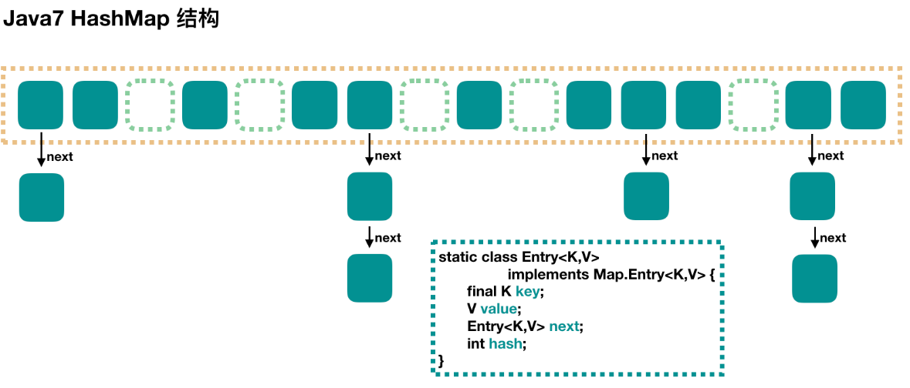

<!-- TOC -->

- [1、原理](#1原理)
    - [1、put 过程分析](#1put-过程分析)
        - [1、数组初始化](#1数组初始化)
        - [2、计算具体数组位置](#2计算具体数组位置)
        - [3、添加节点到链表中](#3添加节点到链表中)
        - [4、数组扩容](#4数组扩容)
    - [2、get 过程分析](#2get-过程分析)
- [2、源码](#2源码)
    - [1、Entry类](#1entry类)
    - [2、迭代器Iterator接口](#2迭代器iterator接口)
    - [3、HashIterator](#3hashiterator)
    - [4、KeyIterator](#4keyiterator)
    - [5、ValueIterator](#5valueiterator)
    - [6、EntryIterator](#6entryiterator)
    - [7、KeySet](#7keyset)
    - [8、Values](#8values)
    - [9、EntrySet](#9entryset)
- [参考文章](#参考文章)

<!-- /TOC -->


# 1、原理



大方向上，HashMap 里面是一个数组，然后数组中每个元素是一个单向链表。

上图中，每个绿色的实体是嵌套类 Entry 的实例，Entry 包含四个属性：key, value, hash 值和用于单向链表的 next。

capacity：当前数组容量，始终保持 2^n，可以扩容，扩容后数组大小为当前的 2 倍。

loadFactor：负载因子，默认为 0.75。

threshold：扩容的阈值，等于 capacity * loadFactor


## 1、put 过程分析

```java
public V put(K key, V value) {
    // 当插入第一个元素的时候，需要先初始化数组大小
    if (table == EMPTY_TABLE) {
        inflateTable(threshold);
    }
    // 如果 key 为 null，感兴趣的可以往里看，最终会将这个 entry 放到 table[0] 中
    if (key == null)
        return putForNullKey(value);
    // 1. 求 key 的 hash 值
    int hash = hash(key);
    // 2. 找到对应的数组下标
    int i = indexFor(hash, table.length);
    // 3. 遍历一下对应下标处的链表，看是否有重复的 key 已经存在，
    //    如果有，直接覆盖，put 方法返回旧值就结束了
    for (Entry<K,V> e = table[i]; e != null; e = e.next) {
        Object k;
        if (e.hash == hash && ((k = e.key) == key || key.equals(k))) {
            V oldValue = e.value;
            e.value = value;
            e.recordAccess(this);
            return oldValue;
        }
    }

    modCount++;
    // 4. 不存在重复的 key，将此 entry 添加到链表中，细节后面说
    addEntry(hash, key, value, i);
    return null;
}
```

### 1、数组初始化

在第一个元素插入 HashMap 的时候做一次数组的初始化，就是先确定初始的数组大小，并计算数组扩容的阈值。

```java
private void inflateTable(int toSize) {
    // 保证数组大小一定是 2 的 n 次方。
    // 比如这样初始化：new HashMap(20)，那么处理成初始数组大小是 32
    int capacity = roundUpToPowerOf2(toSize);
    // 计算扩容阈值：capacity * loadFactor
    threshold = (int) Math.min(capacity * loadFactor, MAXIMUM_CAPACITY + 1);
    // 算是初始化数组吧
    table = new Entry[capacity];
    initHashSeedAsNeeded(capacity); //ignore
}
```

这里有一个将数组大小保持为 2 的 n 次方的做法，Java7 和 Java8 的 HashMap 和 ConcurrentHashMap 都有相应的要求，只不过实现的代码稍微有些不同，后面再看到的时候就知道了。


### 2、计算具体数组位置

这个简单，我们自己也能 YY 一个：使用 key 的 hash 值对数组长度进行取模就可以了。

```java
static int indexFor(int hash, int length) {
    // assert Integer.bitCount(length) == 1 : "length must be a non-zero power of 2";
    return hash & (length-1);
}
```
这个方法很简单，简单说就是取 hash 值的低 n 位。如在数组长度为 32 的时候，其实取的就是 key 的 hash 值的低 5 位，作为它在数组中的下标位置。


### 3、添加节点到链表中

找到数组下标后，会先进行 key 判重，如果没有重复，就准备将新值放入到链表的表头。

```java
void addEntry(int hash, K key, V value, int bucketIndex) {
    // 如果当前 HashMap 大小已经达到了阈值，并且新值要插入的数组位置已经有元素了，那么要扩容
    if ((size >= threshold) && (null != table[bucketIndex])) {
        // 扩容，后面会介绍一下
        resize(2 * table.length);
        // 扩容以后，重新计算 hash 值
        hash = (null != key) ? hash(key) : 0;
        // 重新计算扩容后的新的下标
        bucketIndex = indexFor(hash, table.length);
    }
    // 往下看
    createEntry(hash, key, value, bucketIndex);
}
// 这个很简单，其实就是将新值放到链表的表头，然后 size++
void createEntry(int hash, K key, V value, int bucketIndex) {
    //链表头部原来的值
    Entry<K,V> e = table[bucketIndex];
    table[bucketIndex] = new Entry<>(hash, key, value, e);
    size++;
}
```

这个方法的主要逻辑就是先判断是否需要扩容，需要的话先扩容，然后再将这个新的数据插入到扩容后的数组的相应位置处的链表的表头。

### 4、数组扩容

前面我们看到，在插入新值的时候，如果当前的 size 已经达到了阈值，并且要插入的数组位置上已经有元素，那么就会触发扩容，扩容后，数组大小为原来的 2 倍。

```java
void resize(int newCapacity) {
    Entry[] oldTable = table;
    int oldCapacity = oldTable.length;
    if (oldCapacity == MAXIMUM_CAPACITY) {
        threshold = Integer.MAX_VALUE;
        return;
    }
    // 新的数组
    Entry[] newTable = new Entry[newCapacity];
    // 将原来数组中的值迁移到新的更大的数组中
    transfer(newTable, initHashSeedAsNeeded(newCapacity));
    table = newTable;
    threshold = (int)Math.min(newCapacity * loadFactor, MAXIMUM_CAPACITY + 1);
}


//把扩容前老数组的对象重新hash到新数组
void transfer(Entry[] newTable, boolean rehash) {
    int newCapacity = newTable.length;
    for (Entry<K,V> e : table) {//遍历旧表
        while(null != e) {
            Entry<K,V> next = e.next;//如果当前表位置不存在冲突这里就是null
            if (rehash) {
                e.hash = null == e.key ? 0 : hash(e.key);
            }
            int i = indexFor(e.hash, newCapacity);//找到在新数组中存放的位置
            e.next = newTable[i];//头插法更新冲突链表
            newTable[i] = e;
            e = next;
        }
    }
}
```

扩容就是用一个新的大数组替换原来的小数组，并将原来数组中的值迁移到新的数组中。

由于是双倍扩容，迁移过程中，会将原来 table[i] 中的链表的所有节点，分拆到新的数组的 newTable[i] 和 newTable[i + oldLength] 位置上。如原来数组长度是 16，那么扩容后，原来 table[0] 处的链表中的所有元素会被分配到新数组中 newTable[0] 和 newTable[16] 这两个位置。


## 2、get 过程分析

get 过程是非常简单的。

- 1、根据 key 计算 hash 值。
- 2、找到相应的数组下标：hash & (length - 1)。
- 3、遍历该数组位置处的链表，直到找到相等(==或equals)的 key。


```java
public V get(Object key) {
    // 之前说过，key 为 null 的话，会被放到 table[0]，所以只要遍历下 table[0] 处的链表就可以了
    if (key == null)
        return getForNullKey();
    // 
    Entry<K,V> entry = getEntry(key);

    return null == entry ? null : entry.getValue();
}


final Entry<K,V> getEntry(Object key) {
    if (size == 0) {
        return null;
    }

    int hash = (key == null) ? 0 : hash(key);
    // 确定数组下标，然后从头开始遍历链表，直到找到为止
    for (Entry<K,V> e = table[indexFor(hash, table.length)];
         e != null;
         e = e.next) {
        Object k;
        if (e.hash == hash &&
            ((k = e.key) == key || (key != null && key.equals(k))))
            return e;
    }
    return null;
}
```


# 2、源码


```java

public class HashMap<K,V>
    extends AbstractMap<K,V>
    implements Map<K,V>, Cloneable, Serializable
{
// 属性
static final int DEFAULT_INITIAL_CAPACITY = 1 << 4;
static final int MAXIMUM_CAPACITY = 1 << 30;
static final float DEFAULT_LOAD_FACTOR = 0.75f;
static final Entry<?,?>[] EMPTY_TABLE = {};
transient Entry<K,V>[] table = (Entry<K,V>[]) EMPTY_TABLE;//存数据的数组
transient int size;
int threshold;
final float loadFactor;
transient int modCount;
static final int ALTERNATIVE_HASHING_THRESHOLD_DEFAULT = Integer.MAX_VALUE;

transient int hashSeed = 0;//


//无参构造函数
public HashMap() {
        this(DEFAULT_INITIAL_CAPACITY, DEFAULT_LOAD_FACTOR);
}
//指定大小
public HashMap(int initialCapacity) {
        this(initialCapacity, DEFAULT_LOAD_FACTOR);
}
//最全的构造函数，指定大小和负载因子
public HashMap(int initialCapacity, float loadFactor) {
    if (initialCapacity < 0)
        throw new IllegalArgumentException("Illegal initial capacity: " +
                                            initialCapacity);
    if (initialCapacity > MAXIMUM_CAPACITY)
        initialCapacity = MAXIMUM_CAPACITY;
    if (loadFactor <= 0 || Float.isNaN(loadFactor))
        throw new IllegalArgumentException("Illegal load factor: " +
                                            loadFactor);

    this.loadFactor = loadFactor;
    threshold = initialCapacity;//门限值初始化为容量
    init();//空方法
}

//添加一个键值对
public V put(K key, V value) {
    if (table == EMPTY_TABLE) {//如果没有初始化需要对数组进行初始化
        inflateTable(threshold);
    }
    if (key == null)
        return putForNullKey(value);//表空间的0号位置专门用来存放key=null的值
    int hash = hash(key);//计算hash值
    int i = indexFor(hash, table.length);//基于hash值和表大小计算存放位置
    for (Entry<K,V> e = table[i]; e != null; e = e.next) {//查找之前是否已经存在这样的key
        Object k;
        if (e.hash == hash && ((k = e.key) == key || key.equals(k))) {//key的hash值和equal相同，更新旧键值对
            V oldValue = e.value;
            e.value = value;
            e.recordAccess(this);
            return oldValue;
        }
    }

    modCount++;//修改次数加1
    addEntry(hash, key, value, i);//到这里说明新添加一个键值对，这时返回值为null
    return null;
}


//初始化table数组和门限值
private void inflateTable(int toSize) {
    // Find a power of 2 >= toSize 找到一个2的N次幂接近toSize
    int capacity = roundUpToPowerOf2(toSize);

    threshold = (int) Math.min(capacity * loadFactor, MAXIMUM_CAPACITY + 1);
    table = new Entry[capacity];
    initHashSeedAsNeeded(capacity);
}

//todo
private static int roundUpToPowerOf2(int number) {
    // assert number >= 0 : "number must be non-negative";
    int rounded = number >= MAXIMUM_CAPACITY
            ? MAXIMUM_CAPACITY
            : (rounded = Integer.highestOneBit(number)) != 0
                ? (Integer.bitCount(number) > 1) ? rounded << 1 : rounded
                : 1;

    return rounded;
}

//todo  和生成key的hash值相关减缓hash冲突？
final boolean initHashSeedAsNeeded(int capacity) {
    boolean currentAltHashing = hashSeed != 0;
    boolean useAltHashing = sun.misc.VM.isBooted() &&
            (capacity >= Holder.ALTERNATIVE_HASHING_THRESHOLD);
    boolean switching = currentAltHashing ^ useAltHashing;
    if (switching) {
        hashSeed = useAltHashing
            ? sun.misc.Hashing.randomHashSeed(this)
            : 0;
    }
    return switching;
}

//存放null key的逻辑，放到table的0位置
private V putForNullKey(V value) {
    for (Entry<K,V> e = table[0]; e != null; e = e.next) {
        if (e.key == null) {
            V oldValue = e.value;
            e.value = value;
            e.recordAccess(this);
            return oldValue;
        }
    }
    modCount++;
    addEntry(0, null, value, 0);
    return null;
}

//在添加entry对象前需要判断是否需要扩容
void addEntry(int hash, K key, V value, int bucketIndex) {
    if ((size >= threshold) && (null != table[bucketIndex])) {//size大小已经达到门限而且这次要放的bucketIndex已经存在元素，难道bucketIndex没有冲突就不需要扩容？？？
        resize(2 * table.length);
        hash = (null != key) ? hash(key) : 0;
        bucketIndex = indexFor(hash, table.length);
    }

    createEntry(hash, key, value, bucketIndex);
}

//创建一个entry对象放到表数组中
void createEntry(int hash, K key, V value, int bucketIndex) {
    Entry<K,V> e = table[bucketIndex];//这里采用头插法构建冲突链表，每次新加入的节点在链表的头部
    table[bucketIndex] = new Entry<>(hash, key, value, e);
    size++;
}

//扩容函数
void resize(int newCapacity) {
    Entry[] oldTable = table;
    int oldCapacity = oldTable.length;
    if (oldCapacity == MAXIMUM_CAPACITY) {//表的容量已经达到最大值，这个时候只能把门限值也改成最大了
        threshold = Integer.MAX_VALUE;
        return;
    }

    Entry[] newTable = new Entry[newCapacity];//创建一个新数组
    transfer(newTable, initHashSeedAsNeeded(newCapacity));
    table = newTable;//表数组指向新建后的数组
    threshold = (int)Math.min(newCapacity * loadFactor, MAXIMUM_CAPACITY + 1);//更新门限值
}

//把扩容前老数组的对象重新hash到新数组
void transfer(Entry[] newTable, boolean rehash) {
    int newCapacity = newTable.length;
    for (Entry<K,V> e : table) {//遍历旧表
        while(null != e) {
            Entry<K,V> next = e.next;//如果当前表位置不存在冲突这里就是null
            if (rehash) {
                e.hash = null == e.key ? 0 : hash(e.key);
            }
            int i = indexFor(e.hash, newCapacity);//找到在新数组中存放的位置
            e.next = newTable[i];//头插法更新冲突链表
            newTable[i] = e;
            e = next;
        }
    }
}

//找到当前hash值对于的位置，这里通过与操作实现
static int indexFor(int h, int length) {
    // assert Integer.bitCount(length) == 1 : "length must be a non-zero power of 2";
    return h & (length-1);
}


//生成key对象的hash值
//todo 为什么要这样？
final int hash(Object k) {
    int h = hashSeed;
    if (0 != h && k instanceof String) {//针对字符串的特殊处理？
        return sun.misc.Hashing.stringHash32((String) k);
    }

    h ^= k.hashCode();

    // This function ensures that hashCodes that differ only by
    // constant multiples at each bit position have a bounded
    // number of collisions (approximately 8 at default load factor).
    h ^= (h >>> 20) ^ (h >>> 12);
    return h ^ (h >>> 7) ^ (h >>> 4);
}


//根据key来获取值
public V get(Object key) {
    if (key == null)
        return getForNullKey();
    Entry<K,V> entry = getEntry(key);

    return null == entry ? null : entry.getValue();
}

//获取null key对应的值，即表下标为0存放的值。备注：这里的0位置除了存放key=null的值外还存在其他的key
private V getForNullKey() {
    if (size == 0) {
        return null;
    }
    for (Entry<K,V> e = table[0]; e != null; e = e.next) {
        if (e.key == null)
            return e.value;
    }
    return null;
}

//每次在createEntry中++，即每创建一个entry对象并放到表空间后加1
public int size() {
    return size;
}


/**
* This method is used instead of put by constructors and
* pseudoconstructors (clone, readObject).  It does not resize the table,
* check for comodification, etc.  It calls createEntry rather than
* addEntry.
* 假如没有进行初始化直接使用这个函数，那
*/
private void putForCreate(K key, V value) {//这个函数直接存放对象，而不进行扩容判断
    int hash = null == key ? 0 : hash(key);
    int i = indexFor(hash, table.length);

    /**
        * Look for preexisting entry for key.  This will never happen for
        * clone or deserialize.  It will only happen for construction if the
        * input Map is a sorted map whose ordering is inconsistent w/ equals.
        */
    for (Entry<K,V> e = table[i]; e != null; e = e.next) {
        Object k;
        if (e.hash == hash &&
            ((k = e.key) == key || (key != null && key.equals(k)))) {
            e.value = value;
            return;
        }
    }

    createEntry(hash, key, value, i);
}

//对应上面的那个函数
private void putAllForCreate(Map<? extends K, ? extends V> m) {
    for (Map.Entry<? extends K, ? extends V> e : m.entrySet())
        putForCreate(e.getKey(), e.getValue());
}

//
public void putAll(Map<? extends K, ? extends V> m) {
    int numKeysToBeAdded = m.size();//要添加的键值对个数
    if (numKeysToBeAdded == 0)//空map直接返回
        return;

    if (table == EMPTY_TABLE) {//需要初始化表空间
        inflateTable((int) Math.max(numKeysToBeAdded * loadFactor, threshold));
    }

    if (numKeysToBeAdded > threshold) {//需要进行扩容
        int targetCapacity = (int)(numKeysToBeAdded / loadFactor + 1);//满足负载因子能放下的最小值
        if (targetCapacity > MAXIMUM_CAPACITY)//目标容量不能越界
            targetCapacity = MAXIMUM_CAPACITY;
        int newCapacity = table.length;//当前表大小
        while (newCapacity < targetCapacity)//找到能满足的最小2的N次幂
            newCapacity <<= 1;
        if (newCapacity > table.length)//进行扩容
            resize(newCapacity);
    }

    for (Map.Entry<? extends K, ? extends V> e : m.entrySet())
        put(e.getKey(), e.getValue());
}

//通过size来判断是否为空
public boolean isEmpty() {
    return size == 0;
}


//判断是否存在这样的key
public boolean containsKey(Object key) {
    return getEntry(key) != null;
}

//通过key找entry对象
final Entry<K,V> getEntry(Object key) {
    if (size == 0) {//表空间为空返回null
        return null;
    }

    int hash = (key == null) ? 0 : hash(key);//找到key的hash值
    for (Entry<K,V> e = table[indexFor(hash, table.length)];//取链表的头结点开始找
            e != null;
            e = e.next) {
        Object k;
        if (e.hash == hash &&
            ((k = e.key) == key || (key != null && key.equals(k))))
            return e;
    }
    return null;
}

//根据key移除映射
public V remove(Object key) {
    Entry<K,V> e = removeEntryForKey(key);
    return (e == null ? null : e.value);
}


final Entry<K,V> removeEntryForKey(Object key) {
    if (size == 0) {
        return null;
    }
    int hash = (key == null) ? 0 : hash(key);//计算hash值
    int i = indexFor(hash, table.length);//找在数组中的位置
    Entry<K,V> prev = table[i];//指向链表的头部
    Entry<K,V> e = prev;//查找的临时变量
    //本质单链表删除节点
    while (e != null) {//如果遍历完链表没有找到返回null
        Entry<K,V> next = e.next;
        Object k;
        if (e.hash == hash &&
            ((k = e.key) == key || (key != null && key.equals(k)))) {//找到了要删除的节点
            modCount++;
            size--;
            if (prev == e)//针对头节点满足的情况
                table[i] = next;
            else //非头结点，直接通过修改指针跳过要删除的节点e即可
                prev.next = next;
            e.recordRemoval(this);
            return e;
        }
        prev = e;//更新变量，到这里prev和e会指向不同的对象，初始化会指向同一个表头节点
        e = next;
    }

    return e;
}

//这里要求参数为entry对象，通过entry来移除，两个entry一样的判断条件是Map.Entry.equals()
final Entry<K,V> removeMapping(Object o) {
    if (size == 0 || !(o instanceof Map.Entry))//表空间为0或者不是entry对象直接返回null
        return null;

    Map.Entry<K,V> entry = (Map.Entry<K,V>) o;
    Object key = entry.getKey();
    int hash = (key == null) ? 0 : hash(key);
    int i = indexFor(hash, table.length);//找到头结点
    Entry<K,V> prev = table[i];
    Entry<K,V> e = prev;

    while (e != null) {//原理同上面删除key
        Entry<K,V> next = e.next;
        if (e.hash == hash && e.equals(entry)) {
            modCount++;
            size--;
            if (prev == e)
                table[i] = next;
            else
                prev.next = next;
            e.recordRemoval(this);
            return e;
        }
        prev = e;
        e = next;
    }

    return e;
}

//清空
public void clear() {
    modCount++;
    Arrays.fill(table, null);
    size = 0;
}


//判断是否包含指定的值
public boolean containsValue(Object value) {
    if (value == null)
        return containsNullValue();

    Entry[] tab = table;
    for (int i = 0; i < tab.length ; i++)
        for (Entry e = tab[i] ; e != null ; e = e.next)
            if (value.equals(e.value))//非null值通过equals判断
                return true;
    return false;
}

//双重for循环遍历查找
private boolean containsNullValue() {
    Entry[] tab = table;
    for (int i = 0; i < tab.length ; i++)
        for (Entry e = tab[i] ; e != null ; e = e.next)
            if (e.value == null)//区别在这里，null值通过==判断
                return true;
    return false;
}

//复制todo
public Object clone() {
    HashMap<K,V> result = null;
    try {
        result = (HashMap<K,V>)super.clone();
    } catch (CloneNotSupportedException e) {
        // assert false;
    }
    if (result.table != EMPTY_TABLE) {
        result.inflateTable(Math.min(
            (int) Math.min(
                size * Math.min(1 / loadFactor, 4.0f),
                // we have limits...
                HashMap.MAXIMUM_CAPACITY),
            table.length));
    }
    result.entrySet = null;
    result.modCount = 0;
    result.size = 0;
    result.init();
    result.putAllForCreate(this);

    return result;
}

//
Iterator<K> newKeyIterator()   {
    return new KeyIterator();
}
Iterator<V> newValueIterator()   {
    return new ValueIterator();
}
Iterator<Map.Entry<K,V>> newEntryIterator()   {
    return new EntryIterator();
}


public Set<K> keySet() {
    Set<K> ks = keySet;
    return (ks != null ? ks : (keySet = new KeySet()));
}


//entrySet
public Set<Map.Entry<K,V>> entrySet() {
    return entrySet0();
}

private Set<Map.Entry<K,V>> entrySet0() {
    Set<Map.Entry<K,V>> es = entrySet;
    return es != null ? es : (entrySet = new EntrySet());
}


}

```


## 1、Entry类


```java
    static class Entry<K,V> implements Map.Entry<K,V> {
        final K key;
        V value;
        Entry<K,V> next;
        int hash;

       
        Entry(int h, K k, V v, Entry<K,V> n) {//必须的四个参数
            value = v;
            next = n;
            key = k;
            hash = h;
        }

        public final K getKey() {
            return key;
        }

        public final V getValue() {
            return value;
        }

        public final V setValue(V newValue) {
            V oldValue = value;
            value = newValue;
            return oldValue;
        }

        public final boolean equals(Object o) {
            if (!(o instanceof Map.Entry))
                return false;
            Map.Entry e = (Map.Entry)o;
            Object k1 = getKey();
            Object k2 = e.getKey();
            if (k1 == k2 || (k1 != null && k1.equals(k2))) {
                Object v1 = getValue();
                Object v2 = e.getValue();
                if (v1 == v2 || (v1 != null && v1.equals(v2)))
                    return true;
            }
            return false;
        }

        public final int hashCode() {
            return Objects.hashCode(getKey()) ^ Objects.hashCode(getValue());
        }

        public final String toString() {
            return getKey() + "=" + getValue();
        }

        /**
         * This method is invoked whenever the value in an entry is
         * overwritten by an invocation of put(k,v) for a key k that's already
         * in the HashMap.
         */
        void recordAccess(HashMap<K,V> m) {
        }

        /**
         * This method is invoked whenever the entry is
         * removed from the table.
         */
        void recordRemoval(HashMap<K,V> m) {
        }
    }

```


## 2、迭代器Iterator接口

```java
public interface Iterator<E> {

boolean hasNext();//

E next();//

void remove();//
}

```


## 3、HashIterator

这个抽象类实现了出next的全部方法，子类只需要实现next接口即可

```java
    private abstract class HashIterator<E> implements Iterator<E> {
        Entry<K,V> next;        // next entry to return
        int expectedModCount;   // For fast-fail
        int index;              // current slot
        Entry<K,V> current;     // current entry

        HashIterator() {
            expectedModCount = modCount;
            if (size > 0) { // advance to first entry 定位到第一个非null值或者遍历完next=null
                Entry[] t = table;
                while (index < t.length && (next = t[index++]) == null)
                    ;
            }
        }

        public final boolean hasNext() {//判断是否有值
            return next != null;
        }

        final Entry<K,V> nextEntry() {//子类的next函数只需要调用这个即可
            if (modCount != expectedModCount)//防止并发修改
                throw new ConcurrentModificationException();
            Entry<K,V> e = next;
            if (e == null)
                throw new NoSuchElementException();

            if ((next = e.next) == null) {//遍历表空间找到不为null的位置停止
                Entry[] t = table;
                while (index < t.length && (next = t[index++]) == null)
                    ;
            }
            current = e;
            return e;
        }

        public void remove() {
            if (current == null)
                throw new IllegalStateException();
            if (modCount != expectedModCount)
                throw new ConcurrentModificationException();
            Object k = current.key;
            current = null;
            HashMap.this.removeEntryForKey(k);
            expectedModCount = modCount;
        }
    }

```


## 4、KeyIterator

```java
private final class KeyIterator extends HashIterator<K> {
    public K next() {
        return nextEntry().getKey();
    }
}
```

## 5、ValueIterator

```java
private final class ValueIterator extends HashIterator<V> {
    public V next() {
        return nextEntry().value;
    }
}
```

## 6、EntryIterator

```java
private final class EntryIterator extends HashIterator<Map.Entry<K,V>> {
        public Map.Entry<K,V> next() {
            return nextEntry();
        }
    }
```


## 7、KeySet

```java
//内部的keyset类
private final class KeySet extends AbstractSet<K> {
    public Iterator<K> iterator() {
        return newKeyIterator();//关键在这里的迭代器
    }
    public int size() {
        return size;
    }
    public boolean contains(Object o) {
        return containsKey(o);
    }
    public boolean remove(Object o) {
        return HashMap.this.removeEntryForKey(o) != null;
    }
    public void clear() {
        HashMap.this.clear();
    }
}
```

## 8、Values

```java
    private final class Values extends AbstractCollection<V> {
        public Iterator<V> iterator() {
            return newValueIterator();//关键在这里的迭代器
        }
        public int size() {
            return size;
        }
        public boolean contains(Object o) {
            return containsValue(o);
        }
        public void clear() {
            HashMap.this.clear();
        }
    }

```


## 9、EntrySet

```java
//内部类
private final class EntrySet extends AbstractSet<Map.Entry<K,V>> {
    public Iterator<Map.Entry<K,V>> iterator() {
        return newEntryIterator();//这里的迭代器
    }
    public boolean contains(Object o) {
        if (!(o instanceof Map.Entry))
            return false;
        Map.Entry<K,V> e = (Map.Entry<K,V>) o;
        Entry<K,V> candidate = getEntry(e.getKey());
        return candidate != null && candidate.equals(e);
    }
    public boolean remove(Object o) {
        return removeMapping(o) != null;
    }
    public int size() {
        return size;
    }
    public void clear() {
        HashMap.this.clear();
    }
}
```


# 参考文章

- [深入浅出学Java——HashMap](https://blog.csdn.net/woshimaxiao1/article/details/83661464)

- [HashMap默认加载因子为什么选择0.75？(阿里)](https://www.cnblogs.com/aspirant/p/11470928.html)

