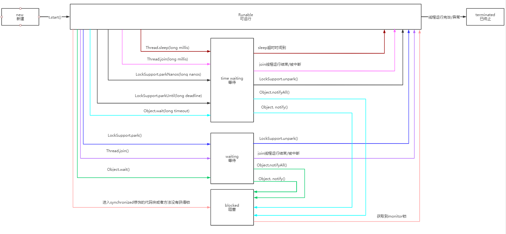
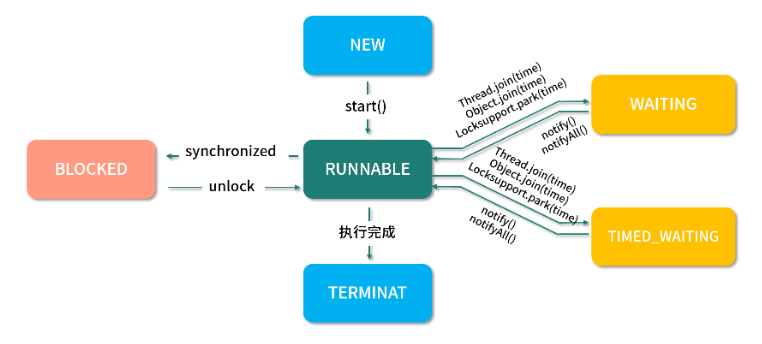
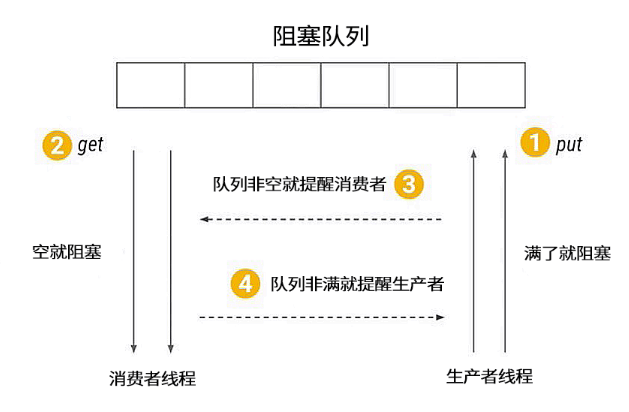

<!-- TOC -->

- [1、java线程Thread的实现方式及原理分析](#1java线程thread的实现方式及原理分析)
- [2、线程优先级的介绍](#2线程优先级的介绍)
- [3、用户线程和守护线程](#3用户线程和守护线程)
- [4、如何正确停止线程？为什么 volatile 标记位的停止方法是错误的？](#4如何正确停止线程为什么-volatile-标记位的停止方法是错误的)
    - [1、interrupt()方法](#1interrupt方法)
    - [2、isInterrupted()](#2isinterrupted)
- [5、线程是如何在 6 种状态之间转换的？](#5线程是如何在-6-种状态之间转换的)
    - [1、New 新创建](#1new-新创建)
    - [2、Runnable 可运行](#2runnable-可运行)
    - [3、Blocked 被阻塞](#3blocked-被阻塞)
    - [4、Waiting 等待](#4waiting-等待)
    - [5、Timed Waiting 限期等待](#5timed-waiting-限期等待)
    - [6、Terminated 终止](#6terminated-终止)
- [6、wait/notify/notifyAll 方法的使用注意事项？](#6waitnotifynotifyall-方法的使用注意事项)
    - [1、为什么 wait 方法必须在 synchronized 保护的同步代码中使用？](#1为什么-wait 方法必须在-synchronized 保护的同步代码中使用)
    - [2、为什么 wait/notify/notifyAll 被定义在 Object 类中，而 sleep 定义在 Thread 类中？](#2为什么-waitnotifynotifyall-被定义在-object-类中而-sleep-定义在-thread-类中)
    - [3、wait/notify 和 sleep 方法的异同？](#3waitnotify-和-sleep-方法的异同)
- [7、有哪几种实现生产者消费者模式的方法？](#7有哪几种实现生产者消费者模式的方法)
    - [1、生产者消费者模式](#1生产者消费者模式)
    - [2、利用jdk的BlockingQueue 实现生产者消费者模式](#2利用jdk的blockingqueue-实现生产者消费者模式)
    - [3、用lock\Condition 实现生产者消费者模式](#3用lock\condition-实现生产者消费者模式)
    - [4、用 wait/notify 实现生产者消费者模式](#4用-waitnotify-实现生产者消费者模式)
- [8、源码方法](#8源码方法)
    - [1、start()](#1start)
    - [2、join()](#2join)
    - [3、yield()](#3yield)
    - [4、sleep()](#4sleep)

<!-- /TOC -->


> 问题

- BLOCKED（阻塞等待）和 WAITING（等待）有什么区别？
- start() 方法和 run() 方法有什么区别？
- 线程的优先级有什么用？该如何设置？
- 线程的常用方法有哪些？


线程（Thread）是并发编程的基础，也是程序执行的最小单元，它依托进程而存在。一个进程中可以包含多个线程，多线程可以共享一块内存空间和一组系统资源，因此线程之间的切换更加节省资源、更加轻量化，也因此被称为轻量级的进程。

# 1、java线程Thread的实现方式及原理分析

> 总结：

线程运行的唯一方式是通过Thread.start()，会映射到操作系统中的一个线程.Thread.start()运行会调用Thread.run()方法,因此，业务逻辑的封装实质就是对run改写。

- 1、直接继承thread类重写run方法，然后直接Thread.start()；
- 2、实现Runnable接口run方法，new Thread(Runnable),然后直接Thread.start(),或者通过线程池运行pool.execute(Runnable)/pool.submit(Runnable)
- 3、实现Callable接口call方法，pool.submit(Callable)

其中，通过pool.submit(Callable/Runnable)，对应的参数Callable/Runnable会被二次封装一下为RunnableFuture（继承接口Runnable, Future<V>）对象，然后通过pool.execute(Runnable)执行，在线程池的线程工厂创建线程的时候，再把RunnableFuture对象作为参数构建线程new Thread（Runnable），
最后在Thread.start()中被调用。

实现 Runnable 接口比继承 Thread 类实现线程要好，原因：

- 1、解耦。Runnable 里只有一个 run() 方法，它定义了需要执行的内容，Thread 类负责线程启动和属性设置等内容，权责分明。

- 2、减少开销提升性能。使用继承 Thread 类方式，每次执行一次任务，都需要新建一个独立的线程，执行完任务后线程走到生命周期的尽头被销毁，如果还想执行这个任务，就必须再新建一个继承了 Thread 类的类，如果此时执行的内容比较少，相比于整个线程从开始创建到执行完毕被销毁，这一系列的操作比 run() 方法打印文字本身带来的开销要大得多。如果我们使用实现 Runnable 接口的方式，就可以把任务直接传入线程池，使用一些固定的线程来完成任务，不需要每次新建销毁线程，大大降低了性能开销。

- 3、可扩展性。Java 语言不支持双继承，如果我们的类一旦继承了 Thread 类，那么它后续就没有办法再继承其他的类，这样一来，如果未来这个类需要继承其他类实现一些功能上的拓展，它就没有办法做到了，相当于限制了代码未来的可拓展性。


1、Thread的run方法：

```java
 @Override
 public void run() {
 if (target != null) {
 target.run();
 }
 }
```

可以看出，默认执行的是参数Runnable类型的target对象，如果创建的Thread对象没有设置target，线程start后就什么也不做；

2、线程池默认创建线程的工厂，本质还是调用 new Thread();

```java
 static class DefaultThreadFactory implements ThreadFactory {
 private static final AtomicInteger poolNumber = new AtomicInteger(1);
 private final ThreadGroup group;
 private final AtomicInteger threadNumber = new AtomicInteger(1);
 private final String namePrefix;

 DefaultThreadFactory() {
 SecurityManager s = System.getSecurityManager();
 group = (s != null) ? s.getThreadGroup() :
 Thread.currentThread().getThreadGroup();
 namePrefix = "pool-" +
 poolNumber.getAndIncrement() +
 "-thread-";
 }

 public Thread newThread(Runnable r) {
 Thread t = new Thread(group, r,
 namePrefix + threadNumber.getAndIncrement(),
 0);
 if (t.isDaemon())
 t.setDaemon(false);
 if (t.getPriority() != Thread.NORM_PRIORITY)
 t.setPriority(Thread.NORM_PRIORITY);
 return t;
 }
 }

```


示例代码

```java
public class TestThread {
    public static void main(String[] args) {
        System.out.println(Thread.currentThread().getName()+":main");

        Thread thread1 = new Thread();//空实现，什么也不做
        thread1.start();
        //方式1
        ExtendsThread extendsThread = new ExtendsThread();
        extendsThread.start();

        //方式2
        Thread thread = new Thread(new RunnableThread());
        thread.start();

        //方式3
        ExecutorService executorService = Executors.newFixedThreadPool(5);
        //executorService.execute();//提交任务类型是Runnable
        //executorService.submit()//提交任务类型Callable和Runnable
        executorService.execute(new RunnableThread());
        executorService.submit(new RunnableThread());
        Future<Integer> future = executorService.submit(new CallableThread());
        try {
            Integer integer = future.get();
            System.out.println("结果："+integer);
        } catch (InterruptedException e) {
            e.printStackTrace();
        } catch (ExecutionException e) {
            e.printStackTrace();
        }
        executorService.shutdown();//关闭线程池
        System.out.println("关闭线程池");

        //其他
        //匿名类
        new Thread(new Runnable() {
            @Override
            public void run() {
                System.out.println(Thread.currentThread().getName()+":匿名类方式");
            }
        }).start();

        // lambda 表达式创建线程
        new Thread(() -> {
            System.out.println(Thread.currentThread().getName()+": lambda 表达式创建线程1");
        }).start();

        // lambda 表达式创建线程，省去了{}
        new Thread(() ->
            System.out.println(Thread.currentThread().getName()+": lambda 表达式创建线程2")
        ).start();


    }
}

//方式1：继承线程类，重写run方法，自定义执行逻辑
class ExtendsThread extends Thread {
    @Override
    public void run() {
        System.out.println(Thread.currentThread().getName()+":继承Thread类实现线程");
    }
}

//方式2：实现Runnable接口，把当前类对象当做Thread的构造参数传入，对应run方法中的target对象
class RunnableThread implements Runnable {
    @Override
    public void run() {
        System.out.println(Thread.currentThread().getName()+":用实现Runnable接口实现线程");
    }
}

//方式3：有返回值。返回值的类型通过泛型传入，实现Callable接口，只能通过提交到线程池运行？
class CallableThread implements Callable<Integer> {
    @Override
    public Integer call() throws Exception {
        System.out.println(Thread.currentThread().getName()+":用实现CallableThread接口实现线程");
        return new Random().nextInt();
    }
}

```


# 2、线程优先级的介绍

通过设置线程的优先级，数字越大的优先级别越高(1-10)  获取cpu概率大。java 中的线程优先级的范围是1～10，默认的优先级是5。“高优先级线程”会优先于“低优先级线程”执行。

在一些运行的主线程中创建新的子线程时，子线程的优先级被设置为等于“创建它的主线程的优先级”。

```java

 /**
     * The minimum priority that a thread can have.
     */
    public final static int MIN_PRIORITY = 1;

   /**
     * The default priority that is assigned to a thread.
     */
    public final static int NORM_PRIORITY = 5;

    /**
     * The maximum priority that a thread can have.
     */
    public final static int MAX_PRIORITY = 10;


    public final void setPriority(int newPriority) {
    ThreadGroup g;
    checkAccess();
    // 先验证优先级的合理性
    if (newPriority > MAX_PRIORITY || newPriority < MIN_PRIORITY) {
        throw new IllegalArgumentException();
    }
    if((g = getThreadGroup()) != null) {
        // 优先级如果超过线程组的最高优先级，则把优先级设置为线程组的最高优先级
        if (newPriority > g.getMaxPriority()) {
            newPriority = g.getMaxPriority();
        }
        setPriority0(priority = newPriority);
    }
}


```

线程的优先级可以理解为线程抢占 CPU 时间片的概率，优先级越高的线程优先执行的概率就越大，但并不能保证优先级高的线程一定先执行。

# 3、用户线程和守护线程


java 中有两种线程：用户线程和守护线程。可以通过isDaemon()方法来区别它们：如果返回false，则说明该线程是“用户线程”；否则就是“守护线程”。用户线程一般用于执行用户级任务，而守护线程也就是“后台线程”，一般用来执行后台任务。需要注意的是：Java虚拟机在“用户线程”都结束后会后退出。

每个线程都可以被标记为一个守护进程或非守护进程。当且仅当“创建它的主线程是守护线程”时“子线程才会是守护线程”。

当Java虚拟机启动时，通常有一个单一的非守护线程（该线程通过是通过main()方法启动）。JVM会一直运行直到下面的任意一个条件发生，JVM就会终止运行：

- 1、调用了exit()方法，并且exit()有权限被正常执行。
- 2、所有的“非守护线程”都死了(即JVM中仅仅只有“守护线程”)。

每一个线程都被标记为“守护线程”或“用户线程”。当只有守护线程运行时，JVM会自动退出。


# 4、如何正确停止线程？为什么 volatile 标记位的停止方法是错误的？

为什么不强制停止？而是通知、协作

对于 Java 而言，最正确的停止线程的方式是使用 interrupt。但 interrupt 仅仅起到通知被停止线程的作用。而对于被停止的线程而言，它拥有完全的自主权，它既可以选择立即停止，也可以选择一段时间后停止，也可以选择压根不停止。那么为什么 Java 不提供强制停止线程的能力呢？

事实上，Java 希望程序间能够相互通知、相互协作地管理线程，因为如果不了解对方正在做的工作，贸然强制停止线程就可能会造成一些安全的问题，为了避免造成问题就需要给对方一定的时间来整理收尾工作。比如：线程正在写入一个文件，这时收到终止信号，它就需要根据自身业务判断，是选择立即停止，还是将整个文件写入成功后停止，而如果选择立即停止就可能造成数据不完整，不管是中断命令发起者，还是接收者都不希望数据出现问题。


## 1、interrupt()方法

只能第当前线程来终止自己。

- 1、线程处于阻塞状态。如果线程调用Object#wait()、Object#wait(long)、Object#wait(long, int)或者Thread类的方法#join()、#join(long)、#join(long, int)、#sleep(long)、#sleep(long, int)进入阻塞时，线程的中断状态会被清空，并且抛出一个中断异常InterruptedException；

- 2、如果被阻塞在IO操作或者java.nio.channels.Selector时，中断标记会被设置，并且抛出异常；


## 2、isInterrupted()

判断当前线程是否被中断，获取中断标记


# 5、线程是如何在 6 种状态之间转换的？

在 Java 中线程的生命周期中一共有 6 种状态。

- New（新创建）：A thread that has not yet started is in this state.

- Runnable（可运行）：A thread executing in the Java virtual machine is in this state. but it may be waiting for other resources from the operating system such as processor. 可能在等待处理器CPU等资源。

- Blocked（被阻塞）：A thread that is blocked waiting for a monitor lock in this state.  触发是synchronized block/method

- Waiting（等待）：A thread that is waiting indefinitely（无限期） for another thread to perform a particular action is in this state. 调用这三个方法：Object.wait、Thread.join、LockSupport.park；

- Timed Waiting（计时等待）：A thread that is waiting for another thread to perform an action for up to a specified waiting time is in this state.调用方法:Thread.sleep、Object#wait(long)、#join(long)、LockSupport#parkNanos、LockSupport#parkUntil

- Terminated（被终止）：A thread that has exited is in this state.

如果想要确定线程当前的状态，可以通过 getState() 方法，并且线程在任何时刻只可能处于 1 种状态。






注意点：

- 1、线程的状态是需要按照箭头方向来走的，比如线程从 New 状态是不可以直接进入 Blocked 状态的，它需要先经历 Runnable 状态。

- 2、线程生命周期不可逆：一旦进入 Runnable 状态就不能回到 New 状态；一旦被终止就不可能再有任何状态的变化。所以一个线程只能有一次 New 和 Terminated 状态，只有处于中间状态才可以相互转换。


> BLOCKED 和 WAITING 的区别

虽然 BLOCKED 和 WAITING 都有等待的含义，但二者有着本质的区别，首先它们状态形成的调用方法不同，其次 BLOCKED 可以理解为当前线程还处于活跃状态，只是在阻塞等待其他线程使用完某个锁资源；而 WAITING 则是因为自身调用了 Object.wait() 或着是 Thread.join() 又或者是 LockSupport.park() 而进入等待状态，只能等待其他线程执行某个特定的动作才能被继续唤醒，比如当线程因为调用了 Object.wait() 而进入 WAITING 状态之后，则需要等待另一个线程执行 Object.notify() 或 Object.notifyAll() 才能被唤醒。


## 1、New 新创建                

New 表示线程被创建但尚未启动的状态：当我们用 new Thread() 新建一个线程时，如果线程没有开始运行 start() 方法，所以也没有开始执行 run() 方法里面的代码，那么此时它的状态就是 New。而一旦线程调用了 start()，它的状态就会从 New 变成 Runnable，也就是状态转换图中中间的这个大方框里的内容。

## 2、Runnable 可运行

Java 中的 Runable 状态对应操作系统线程状态中的两种状态，分别是 Running 和 Ready，也就是说，Java 中处于 Runnable 状态的线程有可能正在执行，也有可能没有正在执行，正在等待被分配 CPU 资源。

所以，如果一个正在运行的线程是 Runnable 状态，当它运行到任务的一半时，执行该线程的 CPU 被调度去做其他事情，导致该线程暂时不运行，它的状态依然不变，还是 Runnable，因为它有可能随时被调度回来继续执行任务。


**Runnable下面的三个方框，它们统称为阻塞状态，在 Java 中阻塞状态通常不仅仅是 Blocked，实际上它包括三种状态，分别是 Blocked(被阻塞）、Waiting(等待）、Timed Waiting(计时等待），这三 种状态统称为阻塞状态**

## 3、Blocked 被阻塞

从箭头的流转方向可以看出，从 Runnable 状态进入 Blocked 状态只有一种可能，就是进入 synchronized 保护的代码时没有抢到 monitor 锁，无论是进入 synchronized 代码块，还是 synchronized 方法，都是一样。

我们再往右看，当处于 Blocked 的线程抢到 monitor 锁，就会从 Blocked 状态回到Runnable 状态。

## 4、Waiting 等待

线程进入 Waiting 状态有三种可能性。

- 没有设置 Timeout 参数的 Object.wait() 方法。

- 没有设置 Timeout 参数的 Thread.join() 方法。

- LockSupport.park() 方法。

Blocked 仅仅针对 synchronized monitor 锁，可是在 Java 中还有很多其他的锁，比如 ReentrantLock，如果线程在获取这种锁时没有抢到该锁就会进入 Waiting 状态，因为本质上它执行了 LockSupport.park() 方法，所以会进入 Waiting 状态。同样，Object.wait() 和 Thread.join() 也会让线程进入 Waiting 状态。

 
Blocked 与 Waiting 的区别是： Blocked 在等待其他线程释放 monitor 锁，而 Waiting 则是在等待某个条件，比如 join 的线程执行完毕，或者是 notify()/notifyAll() 。

## 5、Timed Waiting 限期等待

在 Waiting 上面是 Timed Waiting 状态，这两个状态是非常相似的，区别仅在于有没有时间限制，Timed Waiting 会等待超时，由系统自动唤醒，或者在超时前被唤醒信号唤醒。

以下情况会让线程进入 Timed Waiting 状态。

- 设置了时间参数的 Thread.sleep(long millis) 方法；

- 设置了时间参数的 Object.wait(long timeout) 方法；

- 设置了时间参数的 Thread.join(long millis) 方法；

- 设置了时间参数的 LockSupport.parkNanos(long nanos) 方法

- 设置了时间参数的LockSupport.parkUntil(long deadline) 方法。


> 状态流转


想要从 Blocked 状态进入 Runnable 状态，要求线程获取 monitor 锁，而从 Waiting 状态流转到其他状态则比较特殊，因为首先 Waiting 是不限时的，也就是说无论过了多长时间它都不会主动恢复。

只有当执行了 LockSupport.unpark()，或者 join 的线程运行结束，或者被中断时才可以进入 Runnable 状态。


如果其他线程调用 notify() 或 notifyAll()来唤醒它，它会直接进入 Blocked 状态，这是为什么呢？因为唤醒 Waiting 线程的线程如果调用 notify() 或 notifyAll()，要求必须首先持有该 monitor 锁，所以处于 Waiting 状态的线程被唤醒时拿不到该锁，就会进入 Blocked 状态，直到执行了 notify()/notifyAll() 的唤醒它的线程执行完毕并释放 monitor 锁，才可能轮到它去抢夺这把锁，如果它能抢到，就会从 Blocked 状态回到 Runnable 状态。


同样在 Timed Waiting 中执行 notify() 和 notifyAll() 也是一样的道理，它们会先进入 Blocked 状态，然后抢夺锁成功后，再回到 Runnable 状态。

当然对于 Timed Waiting 而言，如果它的超时时间到了且能直接获取到锁/join的线程运行结束/被中断/调用了LockSupport.unpark()，会直接恢复到 Runnable 状态，而无需经历 Blocked 状态。

## 6、Terminated 终止

Terminated 终止状态，要想进入这个状态有两种可能。

- 1、run() 方法执行完毕，线程正常退出。

- 2、出现一个没有捕获的异常，终止了 run() 方法，最终导致意外终止。


# 6、wait/notify/notifyAll 方法的使用注意事项？


我们主要从三个问题入手：

- 1、为什么 wait 方法必须在 synchronized 保护的同步代码中使用？
- 2、为什么 wait/notify/notifyAll 被定义在 Object 类中，而 sleep 定义在 Thread 类中？
- 3、wait/notify 和 sleep 方法的异同？


## 1、为什么 wait 方法必须在 synchronized 保护的同步代码中使用？


我们先来看看 wait 方法的源码注释是怎么写的。

```
“wait method should always be used in a loop:

复制 synchronized (obj) {
     while (condition does not hold)
         obj.wait();
     ... // Perform action appropriate to condition
}
This method should only be called by a thread that is the owner of this object's monitor.”
```

英文部分的意思是说，在使用 wait 方法时，必须把 wait 方法写在 synchronized 保护的 while 代码块中，并始终判断执行条件是否满足，如果满足就往下继续执行，如果不满足就执行 wait 方法，而在执行 wait 方法之前，必须先持有对象的 monitor 锁，也就是通常所说的 synchronized 锁。那么设计成这样有什么好处呢？

我们逆向思考这个问题，如果不要求 wait 方法放在 synchronized 保护的同步代码中使用，而是可以随意调用，那么就有可能写出这样的代码。

```java
class BlockingQueue {
    Queue<String> buffer = new LinkedList<String>();
    public void give(String data) {
        buffer.add(data);
        notify();  // Since someone may be waiting in take
    }
    public String take() throws InterruptedException {
        while (buffer.isEmpty()) {
            wait();
        }
        return buffer.remove();
    }
}
```

在代码中可以看到有两个方法，give 方法负责往 buffer 中添加数据，添加完之后执行 notify 方法来唤醒之前等待的线程，而 take 方法负责检查整个 buffer 是否为空，如果为空就进入等待，如果不为空就取出一个数据，这是典型的生产者消费者的思想。

但是这段代码并没有受 synchronized 保护，于是便有可能发生以下场景：

- 1、首先，消费者线程调用 take 方法并判断 buffer.isEmpty 方法是否返回 true，若为 true 代表buffer是空的，则线程希望进入等待，但是在线程调用 wait 方法之前，就被调度器暂停了，所以此时还没来得及执行 wait 方法。

- 2、此时生产者开始运行，执行了整个 give 方法，它往 buffer 中添加了数据，并执行了 notify 方法，但 notify 并没有任何效果，因为消费者线程的 wait 方法没来得及执行，所以没有线程在等待被唤醒。

- 3、此时，刚才被调度器暂停的消费者线程回来继续执行 wait 方法并进入了等待。

虽然刚才消费者判断了 buffer.isEmpty 条件，但真正执行 wait 方法时，之前的 buffer.isEmpty 的结果已经过期了，不再符合最新的场景了，因为这里的“判断-执行”不是一个原子操作，它在中间被打断了，是线程不安全的。

假设这时没有更多的生产者进行生产，消费者便有可能陷入无穷无尽的等待，因为它错过了刚才 give 方法内的 notify 的唤醒。

我们看到正是因为 wait 方法所在的 take 方法没有被 synchronized 保护，所以它的 while 判断和 wait 方法无法构成原子操作，那么此时整个程序就很容易出错。

我们把代码改写成源码注释所要求的被 synchronized 保护的同步代码块的形式，代码如下。

```java

public void give(String data) {
   synchronized (this) {
      buffer.add(data);
      notify();
  }
}
 
public String take() throws InterruptedException {
   synchronized (this) {
    while (buffer.isEmpty()) {
         wait();
       }
     return buffer.remove();
  }
}
```

这样就可以确保 notify 方法永远不会在 buffer.isEmpty 和 wait 方法之间被调用，提升了程序的安全性。

另外，wait 方法会释放 monitor 锁，这也要求我们必须首先进入到 synchronized 内持有这把锁。

这里还存在一个“虚假唤醒”（spurious wakeup）的问题，线程可能在既没有被notify/notifyAll，也没有被中断或者超时的情况下被唤醒，这种唤醒是我们不希望看到的。虽然在实际生产中，虚假唤醒发生的概率很小，但是程序依然需要保证在发生虚假唤醒的时候的正确性，所以就需要采用while循环的结构。

```java
while (condition does not hold)
    obj.wait();
```

这样即便被虚假唤醒了，也会再次检查while里面的条件，如果不满足条件，就会继续wait，也就消除了虚假唤醒的风险。


## 2、为什么 wait/notify/notifyAll 被定义在 Object 类中，而 sleep 定义在 Thread 类中？

主要有两点原因：

- 1、因为 Java 中每个对象都有一把称之为 monitor 监视器的锁，由于每个对象都可以上锁，这就要求在对象头中有一个用来保存锁信息的位置。这个锁是对象级别的，而非线程级别的，wait/notify/notifyAll 也都是锁级别的操作，它们的锁属于对象，所以把它们定义在 Object 类中是最合适，因为 Object 类是所有对象的父类。

- 2、因为如果把 wait/notify/notifyAll 方法定义在 Thread 类中，会带来很大的局限性，比如一个线程可能持有多把锁，以便实现相互配合的复杂逻辑，假设此时 wait 方法定义在 Thread 类中，如何实现让一个线程持有多把锁呢？又如何明确线程等待的是哪把锁呢？既然我们是让当前线程去等待某个对象的锁，自然应该通过操作对象来实现，而不是操作线程。

## 3、wait/notify 和 sleep 方法的异同？


> 相同点：

- 1、它们都可以让线程阻塞。
- 2、它们都可以响应 interrupt 中断：在等待的过程中如果收到中断信号，都可以进行响应，并抛出 InterruptedException 异常。

> 不同点：

- 1、wait 方法必须在 synchronized 保护的代码中使用，而 sleep 方法并没有这个要求。
- 2、在同步代码中执行 sleep 方法时，并不会释放 monitor 锁，但执行 wait 方法时会主动释放 monitor 锁。
- 3、sleep 方法中会要求必须定义一个时间，时间到期后会主动恢复，而对于没有参数的 wait 方法而言，意味着永久等待，直到被中断或被唤醒才能恢复，它并不会主动恢复。
- 4、wait/notify 是 Object 类的方法，而 sleep 是 Thread 类的方法。


# 7、有哪几种实现生产者消费者模式的方法？

主要学习如何用 wait/notify/Condition/BlockingQueue 实现生产者消费者模式。

## 1、生产者消费者模式



使用生产者消费者模式通常需要在两者之间增加一个阻塞队列作为媒介，有了媒介之后就相当于有了一个缓冲，平衡了两者的能力，整体的设计如图所示，最上面是阻塞队列，右侧的 1 是生产者线程，生产者在生产数据后将数据存放在阻塞队列中，左侧的 2 是消费者线程，消费者获取阻塞队列中的数据。而中间的 3 和 4 分别代表生产者消费者之间互相通信的过程，因为无论阻塞队列是满还是空都可能会产生阻塞，阻塞之后就需要在合适的时机去唤醒被阻塞的线程。

那么什么时候阻塞线程需要被唤醒呢？有两种情况。第一种情况是当消费者看到阻塞队列为空时，开始进入等待，这时生产者一旦往队列中放入数据，就会通知所有的消费者，唤醒阻塞的消费者线程。另一种情况是如果生产者发现队列已经满了，也会被阻塞，而一旦消费者获取数据之后就相当于队列空了一个位置，这时消费者就会通知所有正在阻塞的生产者进行生产，这便是对生产者消费者模式的简单介绍。


## 2、利用jdk的BlockingQueue 实现生产者消费者模式

先从最简单的 BlockingQueue 开始讲起：

```java
public static void main(String[] args) {
 
  BlockingQueue<Object> queue = new ArrayBlockingQueue<>(10);
 
  Runnable producer = () -> {
    while (true) {
          queue.put(new Object());
    }
  };
 
new Thread(producer).start();
new Thread(producer).start();
 
    Runnable consumer = () -> {
          while (true) {
               queue.take();
    }
   };
new Thread(consumer).start();
new Thread(consumer).start();
}
```

如代码所示，首先，创建了一个 ArrayBlockingQueue 类型的 BlockingQueue，命名为 queue 并将它的容量设置为 10；其次，创建一个简单的生产者，while(true) 循环体中的queue.put() 负责往队列添加数据；然后，创建两个生产者线程并启动；同样消费者也非常简单，while(true) 循环体中的 queue.take() 负责消费数据，同时创建两个消费者线程并启动。以上便是利用 BlockingQueue 实现生产者消费者模式的代码。虽然代码非常简单，但实际上 ArrayBlockingQueue 已经在背后完成了很多工作，比如队列满了就去阻塞生产者线程，队列有空就去唤醒生产者线程等。

## 3、用lock\Condition 实现生产者消费者模式

Condition.await()

Condition.signalAll()


```java
public class MyBlockingQueueForCondition {
    private Queue queue;
    private Integer max = 16;//默认的最大值
    private ReentrantLock lock = new ReentrantLock();
    private Condition notEmpty = lock.newCondition();
    private Condition notFull = lock.newCondition();

    public MyBlockingQueueForCondition(Integer max) {
        this.max = max;
        queue = new LinkedList();
    }
    public void put(Object o) {
        lock.lock();
        try {
            while (queue.size() == max) {
                try {
                    notFull.await();//满了阻塞，等待不满重新唤醒
                } catch (InterruptedException e) {
                    e.printStackTrace();
                }
                queue.add(o);
                notEmpty.signalAll();//唤醒因为空而阻塞的线程
            }
        } finally {
            lock.unlock();
        }
    }
    public Object take() {
        lock.lock();
        try {
            while (queue.size() == 0) {
                try {
                    notEmpty.await();//因为空而阻塞
                } catch (InterruptedException e) {
                    e.printStackTrace();
                }
            }
            Object poll = queue.remove();
            notFull.signalAll();//通知
            return poll;
        } finally {
            lock.unlock();
        }
    }
}

```

如代码所示，首先，定义了一个队列变量 queue 并设置最大容量为 16；其次，定义了一个 ReentrantLock 类型的 Lock 锁，并在 Lock 锁的基础上创建两个 Condition，一个是 notEmpty，另一个是 notFull，分别代表队列没有空和没有满的条件；最后，声明了 put 和 take 这两个核心方法。

因为生产者消费者模式通常是面对多线程的场景，需要一定的同步措施保障线程安全，所以在 put 方法中先将 Lock 锁上，然后，在 while 的条件里检测 queue 是不是已经满了，如果已经满了，则调用 notFull 的 await() 阻塞生产者线程并释放 Lock，如果没有满，则往队列放入数据并利用 notEmpty.signalAll() 通知正在等待的所有消费者并唤醒它们。最后在 finally 中利用 lock.unlock() 方法解锁，把 unlock 方法放在 finally 中是一个基本原则，否则可能会产生无法释放锁的情况。

下面再来看 take 方法，take 方法实际上是与 put 方法相互对应的，同样是通过 while 检查队列是否为空，如果为空，消费者开始等待，如果不为空则从队列中获取数据并通知生产者队列有空余位置，最后在 finally 中解锁。

这里需要注意，我们在 take() 方法中使用 while( queue.size() == 0 ) 检查队列状态，而不能用 if( queue.size() == 0 )。为什么呢？大家思考这样一种情况，因为生产者消费者往往是多线程的，我们假设有两个消费者，第一个消费者线程获取数据时，发现队列为空，便进入等待状态；因为第一个线程在等待时会释放 Lock 锁，所以第二个消费者可以进入并执行 if( queue.size() == 0 )，也发现队列为空，于是第二个线程也进入等待；而此时，如果生产者生产了一个数据，便会唤醒两个消费者线程，而两个线程中只有一个线程可以拿到锁，并执行 queue.remove 操作，另外一个线程因为没有拿到锁而卡在被唤醒的地方，而第一个线程执行完操作后会在 finally 中通过 unlock 解锁，而此时第二个线程便可以拿到被第一个线程释放的锁，继续执行操作，也会去调用 queue.remove 操作，然而这个时候队列已经为空了，所以会抛出 NoSuchElementException 异常，这不符合我们的逻辑。而如果用 while 做检查，当第一个消费者被唤醒得到锁并移除数据之后，第二个线程在执行 remove 前仍会进行 while 检查，发现此时依然满足 queue.size() == 0 的条件，就会继续执行 await 方法，避免了获取的数据为 null 或抛出异常的情况。

## 4、用 wait/notify 实现生产者消费者模式

最后我们再来看看使用 wait/notify 实现生产者消费者模式的方法，实际上实现原理和Condition 是非常类似的，它们是兄弟关系：


```java
public class MyBlockingQueue {
    private Queue queue;
    private Integer max = 16;//默认的最大值

    public MyBlockingQueue(Integer max) {
        this.max = max;
        queue = new LinkedList();
    }


    public void put(Object o) {
        synchronized (this) {
            while (queue.size() == max) {//满了阻塞
                try {
                    wait();
                } catch (InterruptedException e) {
                    e.printStackTrace();
                }
            }
            queue.add(o);
            notifyAll();
        }
    }

    public Object take() {
        synchronized (this) {
            while (queue.size() == 0) {
                try {
                    wait();
                } catch (InterruptedException e) {
                    e.printStackTrace();
                }
            }
            Object remove = queue.remove();
            notifyAll();
            return remove;
        }
    }


}

```


如代码所示，最主要的部分仍是 take 与 put 方法，我们先来看 put 方法，put 方法被 synchronized 保护，while 检查队列是否为满，如果不满就往里放入数据并通过 notifyAll() 唤醒其他线程。同样，take 方法也被 synchronized 修饰，while 检查队列是否为空，如果不为空就获取数据并唤醒其他线程。使用这个 MyBlockingQueue 实现的生产者消费者代码如下：

```java
public class WaitStyle {

    public static void main(String[] args) {
        MyBlockingQueue queue = new MyBlockingQueue(10);
        MyProducer myProducer = new MyProducer(queue);
        MyConsumer myConsumer = new MyConsumer(queue);

        new Thread(myProducer).start();
        new Thread(myConsumer).start();
    }

}


class MyProducer implements Runnable{
    private MyBlockingQueue queue;
    public MyProducer(MyBlockingQueue queue) {
        this.queue = queue;
    }
    @Override
    public void run() {
        for (int i = 0; i < 100; i++) {
            queue.put(new Object());
        }
    }
}

class MyConsumer implements Runnable {
    private MyBlockingQueue queue;
    public MyConsumer(MyBlockingQueue queue) {
        this.queue = queue;
    }
    @Override
    public void run() {
        for (int i = 0; i < 100; i++) {
            Object take = queue.take();
            System.out.println("消费："+take.toString());
        }
    }
}
```


以上就是三种实现生产者消费者模式的讲解，其中，第一种 BlockingQueue 模式实现比较简单，但其背后的实现原理在第二种、第三种实现方法中得以体现，第二种、第三种实现方法本质上是我们自己实现了 BlockingQueue 的一些核心逻辑，供生产者与消费者使用。


# 8、源码方法

## 1、start()

用了 synchronized 来保证线程安全，源码如下：

```java
public synchronized void start() {
    // 状态验证，不等于 NEW 的状态会抛出异常
    if (threadStatus != 0)
        throw new IllegalThreadStateException();
    // 通知线程组，此线程即将启动
    group.add(this);
    boolean started = false;
    try {
        start0();
        started = true;
    } finally {
        try {
            if (!started) {
                group.threadStartFailed(this);
            }
        } catch (Throwable ignore) {
            // 不处理任何异常，如果 start0 抛出异常，则它将被传递到调用堆栈上
        }
    }
}

```

> start() 和 run() 的区别

- 首先从 Thread 源码来看，start() 方法属于 Thread 自身的方法，并且使用了 synchronized 来保证线程安全。run() 方法为 Runnable 的抽象方法，必须由调用类重写此方法，重写的 run() 方法其实就是此线程要执行的业务方法。

- 从执行的效果来说，start() 方法可以开启多线程，让线程从 NEW 状态转换成 RUNNABLE 状态，而 run() 方法只是一个普通的方法。

- 其次，它们可调用的次数不同，start() 方法不能被多次调用，否则会抛出 java.lang.IllegalStateException；而 run() 方法可以进行多次调用，因为它只是一个普通的方法而已。


## 2、join()

在一个线程中调用 other.join() ，这时候当前线程会让出执行权给 other 线程，直到 other 线程执行完或者过了超时时间之后再继续执行当前线程，join() 源码如下：

```java
public final synchronized void join(long millis)
throws InterruptedException {
    long base = System.currentTimeMillis();
    long now = 0;
    // 超时时间不能小于 0
    if (millis < 0) {
        throw new IllegalArgumentException("timeout value is negative");
    }
    // 等于 0 表示无限等待，直到线程执行完为之
    if (millis == 0) {
        // 判断子线程 (其他线程) 为活跃线程，则一直等待
        while (isAlive()) {
            wait(0);
        }
    } else {
        // 循环判断
        while (isAlive()) {
            long delay = millis - now;
            if (delay <= 0) {
                break;
            }
            wait(delay);
            now = System.currentTimeMillis() - base;
        }
    }
}

```
从源码中可以看出 join() 方法底层还是通过 wait() 方法来实现的。

例如，在未使用 join() 时，代码如下：

```java
public class ThreadExample {
    public static void main(String[] args) throws InterruptedException {
        Thread thread = new Thread(() -> {
            for (int i = 1; i < 6; i++) {
                try {
                    Thread.sleep(1000);
                } catch (InterruptedException e) {
                    e.printStackTrace();
                }
                System.out.println("子线程睡眠：" + i + "秒。");
            }
        });
        thread.start(); // 开启线程
        // 主线程执行
        for (int i = 1; i < 4; i++) {
            try {
                Thread.sleep(1000);
            } catch (InterruptedException e) {
                e.printStackTrace();
            }
            System.out.println("主线程睡眠：" + i + "秒。");
        }
    }
}

```

程序执行结果为：

```
主线程睡眠：1秒。
子线程睡眠：1秒。
主线程睡眠：2秒。
子线程睡眠：2秒。
主线程睡眠：3秒。
子线程睡眠：3秒。
子线程睡眠：4秒。
子线程睡眠：5秒。

```
从结果可以看出，在未使用 join() 时主子线程会交替执行。

然后我们再把 join() 方法加入到代码中，代码如下：

```java
public class ThreadExample {
    public static void main(String[] args) throws InterruptedException {
        Thread thread = new Thread(() -> {
            for (int i = 1; i < 6; i++) {
                try {
                    Thread.sleep(1000);
                } catch (InterruptedException e) {
                    e.printStackTrace();
                }
                System.out.println("子线程睡眠：" + i + "秒。");
            }
        });
        thread.start(); // 开启线程
        thread.join(2000); // 等待子线程先执行 2 秒钟
        // 主线程执行
        for (int i = 1; i < 4; i++) {
            try {
                Thread.sleep(1000);
            } catch (InterruptedException e) {
                e.printStackTrace();
            }
            System.out.println("主线程睡眠：" + i + "秒。");
        }
    }
}

```
程序执行结果为：

```
子线程睡眠：1秒。
子线程睡眠：2秒。
主线程睡眠：1秒。 
// thread.join(2000); 等待 2 秒之后，主线程和子线程再交替执行
子线程睡眠：3秒。
主线程睡眠：2秒。
子线程睡眠：4秒。
子线程睡眠：5秒。
主线程睡眠：3秒。

```

从执行结果可以看出，添加 join() 方法之后，主线程会先等子线程执行 2 秒之后才继续执行。

## 3、yield()

看 Thread 的源码可以知道 yield() 为本地方法，也就是说 yield() 是由 C 或 C++ 实现的，源码如下：

复制public static native void yield();

yield() 方法表示给线程调度器一个当前线程愿意出让 CPU 使用权的暗示，但是线程调度器可能会忽略这个暗示。

比如我们执行这段包含了 yield() 方法的代码，如下所示：

```java
public static void main(String[] args) throws InterruptedException {
    Runnable runnable = new Runnable() {
        @Override
        public void run() {
            for (int i = 0; i < 10; i++) {
                System.out.println("线程：" +
                        Thread.currentThread().getName() + " I：" + i);
                if (i == 5) {
                    Thread.yield();
                }
            }
        }
    };
    Thread t1 = new Thread(runnable, "T1");
    Thread t2 = new Thread(runnable, "T2");
    t1.start();
    t2.start();
}

```

当我们把这段代码执行多次之后会发现，每次执行的结果都不相同，这是因为 yield() 执行非常不稳定，线程调度器不一定会采纳 yield() 出让 CPU 使用权的建议，从而导致了这样的结果。


## 4、sleep()

不释放monitor锁对象

public static native void sleep(long millis) throws InterruptedException;

