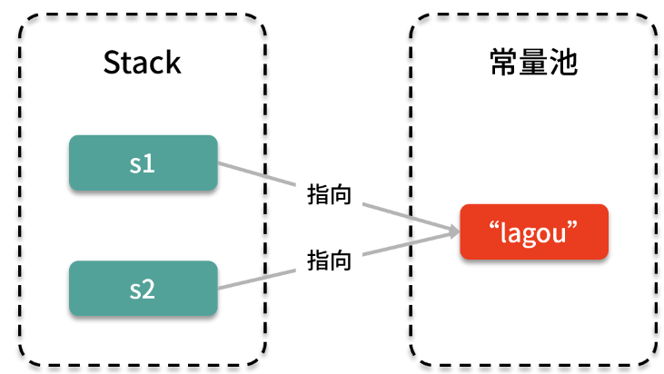

<!-- TOC -->

- [01、final 的三种用法是什么？](#01final-的三种用法是什么)
    - [1、final 修饰变量](#1final-修饰变量)
        - [1、成员变量赋值时机(直接赋值\构造函数中赋值\类的构造代码块中赋值)](#1成员变量赋值时机直接赋值\构造函数中赋值\类的构造代码块中赋值)
        - [2、静态变量赋值时机(直接赋值\静态的static初始代码块中赋值)](#2静态变量赋值时机直接赋值\静态的static初始代码块中赋值)
        - [3、局部变量赋值时机(使用前赋值)](#3局部变量赋值时机使用前赋值)
    - [2、final 修饰参数](#2final-修饰参数)
    - [3、final 修饰方法](#3final-修饰方法)
    - [4、final 修饰类](#4final-修饰类)
- [02、为什么加了 final 却依然无法拥有“不变性”？](#02为什么加了-final-却依然无法拥有不变性)
    - [1、什么是不变性](#1什么是不变性)
    - [2、final 修饰对象时，只是引用不可变](#2final-修饰对象时只是引用不可变)
    - [3、final 和不可变的关系](#3final-和不可变的关系)
- [03、为什么 String 被设计为是不可变的？](#03为什么-string-被设计为是不可变的)
    - [1、String 是不可变的](#1string-是不可变的)
    - [2、String 不可变的好处](#2string-不可变的好处)
        - [1、字符串常量池](#1字符串常量池)
        - [2、用作 HashMap 的 key](#2用作-hashmap-的-key)
        - [3、缓存 HashCode](#3缓存-hashcode)
        - [4、线程安全](#4线程安全)

<!-- /TOC -->


# 01、final 的三种用法是什么？


> final 的作用

final 是 Java 中的一个关键字，简而言之，final 的作用意味着“这是无法改变的”。不过由于 final 关键字一共有三种用法，它可以用来修饰变量、方法或者类，而且在修饰不同的地方时，效果、含义和侧重点也会有所不同，所以我们需要把这三种情况分开介绍。


## 1、final 修饰变量

关键字 final 修饰变量的作用是很明确的，那就是意味着这个变量一旦被赋值就不能被修改了，也就是说只能被赋值一次，直到天涯海角也不会“变心”。如果我们尝试对一个已经赋值过 final 的变量再次赋值，就会报编译错误。

我们来看下面这段代码示例：

```java
public class FinalVarCantChange {//final变量一旦被赋值就不能被修改

    public final int finalVar = 0;

    public static void main(String[] args) {
        FinalVarCantChange finalVarCantChange = new FinalVarCantChange();
//        finalVarCantChange.finalVar=9;     //编译错误，不允许修改final的成员变量
    }
}
```

在这个例子中，我们有一个 final 修饰的 int，这个变量叫作 finalVar，然后在 main 函数中，新建了这个类的实例，并且尝试去修改它的值，此时会报编译错误，所以这体现了 final 修饰变量的一个最主要的作用：一旦被赋值就不能被修改了。


看完了它的作用之后，我们就来看一下使用 final 的目的，也就是为什么要对某个变量去加 final 关键字呢？主要有以下两点目的。

- 第一个目的是出于设计角度去考虑的，比如我们希望创建一个一旦被赋值就不能改变的量，那么就可以使用 final 关键字。比如声明常量的时候，通常都是带 final 的：public static final int YEAR = 2021;这个时候其实 YEAR 是固定写死的，所以我们为了防止它被修改，就给它加上了 final 关键字，这样可以让这个常量更加清晰，也更不容易出错。

- 第二个目的是从线程安全的角度去考虑的。不可变的对象天生就是线程安全的，所以不需要我们额外进行同步等处理，这些开销是没有的。如果 final 修饰的是基本数据类型，那么它自然就具备了不可变这个性质，所以自动保证了线程安全，这样的话，我们未来去使用它也就非常放心了。


下面我们就来看一下被 final 修饰的变量的赋值时机，变量可以分为以下三种：
- 成员变量，类中的非 static 修饰的属性；
- 静态变量，类中的被 static 修饰的属性；
- 局部变量，方法中的变量。

这三种不同情况的变量，被 final 修饰后，其赋值时机也各不相同，我们逐个来看一下。

### 1、成员变量赋值时机(直接赋值\构造函数中赋值\类的构造代码块中赋值)

成员变量指的是一个类中的非 static 属性，对于这种成员变量而言，被 final 修饰后，它有三种赋值时机（或者叫作赋值途径）。

第一种是在声明变量的等号右边直接赋值，例如：

```java
public class FinalFieldAssignment1 {
    private final int finalVar = 0;
}
```

在这个类中有 “private final int finalVar = 0” ，这就是在声明变量的时候就已经赋值了。

第二种是在构造函数中赋值，例如：

```java
class FinalFieldAssignment2 {
    private final int finalVar;

    public FinalFieldAssignment2() {
        finalVar = 0;
    }
}
```

在这个例子中，我们首先声明了变量，即 private final int finalVar，且没有把它赋值，然后在这个类的构造函数中对它进行赋值，这也是可以的。

第三种就是在类的构造代码块中赋值（不常用），例如：

```java
class FinalFieldAssignment3 {
    private final int finalVar;

    {
        finalVar = 0;
    }
}
```

我们同样也声明了一个变量 private final int finalVar，且没有把它赋值，然后在下面的一个由大括号括起来的类的构造代码块中，对变量进行了赋值，这也是合理的赋值时机。

需要注意的是，这里讲了三种赋值时机，我们必须从中挑一种来完成对 final 变量的赋值。如果不是 final 的普通变量，当然可以不用在这三种情况下赋值，完全可以在其他的时机赋值；或者如果你不准备使用这个变量，那么自始至终不赋值甚至也是可以的。但是对于 final 修饰的成员变量而言，必须在三种情况中任选一种来进行赋值，而不能一种都不挑、完全不赋值，那是不行的，这是 final 语法所规定的。

> 空白 final

下面讲解一种概念：“空白 final”。如果我们声明了 final 变量之后，并没有立刻在等号右侧对它赋值，这种情况就被称为“空白 final”。这样做的好处在于增加了 final 变量的灵活性，比如可以在构造函数中根据不同的情况，对 final 变量进行不同的赋值，这样的话，被 final 修饰的变量就不会变得死板，同时又能保证在赋值后保持不变。我们用下面这个代码来说明：

```java
public class BlankFinal {//空白final提供了灵活性

    //空白final
    private final int a;

    //不传参则把a赋值为默认值0
    public BlankFinal() {
        this.a = 0;
    }

    //传参则把a赋值为传入的参数
    public BlankFinal(int a) {
        this.a = a;
    }
}
```

在这个代码中，我们有一个 private final 的 int 变量叫作 a，该类有两个构造函数，第一个构造函数是把 a 赋值为 0，第二个构造函数是把 a 赋值为传进来的参数，所以你调用不同的构造函数，就会有不同的赋值情况。这样一来，利用这个规则，我们就可以根据业务去给 final 变量设计更灵活的赋值逻辑。所以利用空白 final 的一大好处，就是可以让这个 final 变量的值并不是说非常死板，不是绝对固定的，而是可以根据情况进行灵活的赋值，只不过一旦赋值后，就不能再更改了。

### 2、静态变量赋值时机(直接赋值\静态的static初始代码块中赋值)

静态变量是类中的 static 属性，它被 final 修饰后，只有两种赋值时机。

第一种同样是在声明变量的等号右边直接赋值，例如：

```java
public class StaticFieldAssignment1 {//演示final的static类变量的赋值时机
    private static final int a = 0;
}
```

第二种赋值时机就是它可以在一个静态的 static 初始代码块中赋值，这种用法不是很多，例如：

```java
class StaticFieldAssignment2 {

    private static final int a;

    static {
        a = 0;
    }
}
```

在这个类中有一个变量 private static final int a，然后有一个 static，接着是大括号，这是静态初始代码块的语法，在这里面我们对 a 进行了赋值，这种赋值时机也是允许的。以上就是静态 final 变量的两种赋值时机。

需要注意的是，我们不能用普通的非静态初始代码块来给静态的 final 变量赋值。同样有一点比较特殊的是，这个 static 的 final 变量不能在构造函数中进行赋值。

### 3、局部变量赋值时机(使用前赋值)

局部变量指的是方法中的变量，如果你把它修饰为了 final，它的含义依然是一旦赋值就不能改变。

但是它的赋值时机和前两种变量是不一样的，因为它是在方法中定义的，所以它没有构造函数，也同样不存在初始代码块，所以对应的这两种赋值时机就都不存在了。实际上，对于 final 的局部变量而言，它是不限定具体赋值时机的，只要求我们在使用之前必须对它进行赋值即可。

这个要求和方法中的非 final 变量的要求也是一样的，对于方法中的一个非 final 修饰的普通变量而言，它其实也是要求在使用这个变量之前对它赋值。我们来看下面这个代码的例子：

```java
public class LocalVarAssignment1 {//本地变量的赋值时机：使用前赋值即可

    public void foo() {
        final int a = 0;//等号右边直接赋值
    }
}

class LocalVarAssignment2 {

    public void foo() {
        final int a;//这是允许的，因为a没有被使用
    }
}

class LocalVarAssignment3 {

    public void foo() {
        final int a;
        a = 0;//使用前赋值
        System.out.println(a);
    }
}
```

首先我们来看下第一个类，即 LocalVarAssignment1，然后在 foo() 方法中有一个 final 修饰的 int a，最后这里直接在等号右边赋值。

下面看第二个类，由于我们后期没有使用到这个 final 修饰的局部变量 a，所以这里实际上自始至终都没有对 a 进行赋值，即便它是 final 的，也可以对它不赋值，这种行为是语法所允许的。

第三种情况就是先创造出一个 final int a，并且不在等号右边对它进行赋值，然后在使用之前对 a 进行赋值，最后再使用它，这也是允许的。

总结一下，对于这种局部变量的 final 变量而言，它的赋值时机就是要求在使用之前进行赋值，否则使用一个未赋值的变量，自然会报错。

## 2、final 修饰参数

关键字 final 还可以用于修饰方法中的参数。在方法的参数列表中是可以把参数声明为 final 的，这意味着我们没有办法在方法内部对这个参数进行修改。例如：

```java
public class FinalPara {
    public void withFinal(final int a) {
        System.out.println(a);//可以读取final参数的值
//        a = 9; //编译错误，不允许修改final参数的值
    }
}
```

在这个代码中有一个 withFinal 方法，而且这个方法的入参 a 是被 final 修饰的。接下来，我们首先把入参的 a 打印出来，这是允许的，意味着我们可以读取到它的值；但是接下来我们假设想在方法中对这个 a 进行修改，比如改成 a = 9，这就会报编译错误，因此不允许修改 final 参数的值。

以上我们就把 final 修饰变量的情况都讲完了，其核心可以用一句话总结：一旦被赋值就不能被修改了。

## 3、final 修饰方法

选择用 final 修饰方法的原因之一是为了提高效率，因为在早期的 Java 版本中，会把 final 方法转为内嵌调用，可以消除方法调用的开销，以提高程序的运行效率。不过在后期的 Java 版本中，JVM 会对此自动进行优化，所以不需要我们程序员去使用 final 修饰方法来进行这些优化了，即便使用也不会带来性能上的提升。

目前我们使用 final 去修饰方法的唯一原因，就是想把这个方法锁定，意味着任何继承类都不能修改这个方法的含义，也就是说，被 final 修饰的方法不可以被重写，不能被 override。我们来举一个代码的例子：

```java
public class FinalMethod {

    public void drink() {
    }

    public final void eat() {
    }
}

class SubClass extends FinalMethod {

    @Override
    public void drink() {
        //非final方法允许被重写
    }

//    public void eat() {}//编译错误，不允许重写final方法


//    public final SubClass() {} //编译错误，构造方法不允许被final修饰
}
```

在这个代码中一共有两个类，第一个是 FinalMethod，它里面有一个 drink 方法和 eat 方法，其中 eat 方法是被 final 修饰的；第二个类 SubClass 继承了前面的 FinalMethod 类。

然后我们去尝试对 drink 方法进行 Override，这当然是可以的，因为它是非 final 方法；接着尝试对 eat 方法进行 Override，你会发现，在下面的子类中去重写这个 eat 方法是不行的，会报编译错误，因为不允许重写 final 方法。

同时这里还有一个注意点，在下方我们又写了一个 public final SubClass () {}，这是一个构造函数，这里也是编译不通过的，因为构造方法不允许被 final 修饰。

特例：final 的 private方法

这里有一个特例，那就是用 final 去修饰 private 方法。我们先来看看下面这个看起来可能不太符合规律的代码例子：

```java
public class PrivateFinalMethod {//private方法隐式指定为final

    private final void privateEat() {
    }
}

class SubClass2 extends PrivateFinalMethod {

    private final void privateEat() {//编译通过，但这并不是真正的重写
    }
}
```

在这个代码例子中，首先有个 PrivateFinalMethod 类，它有个 final 修饰的方法，但是注意这个方法是 private 的，接下来，下面的 SubClass2 extends 第一个 PrivateFinalMethod 类，也就是说继承了第一个类；然后子类中又写了一个 private final void privateEat() 方法，而且这个时候编译是通过的，也就是说，子类有一个方法名字叫 privateEat，而且是 final 修饰的。同样的，这个方法一模一样的出现在了父类中，那是不是说这个子类 SubClass2 成功的重写了父类的 privateEat 方法呢？是不是意味着我们之前讲的“被 final 修饰的方法，不可被重写”，这个结论是有问题的呢？

其实我们之前讲的结论依然是对的，但是类中的所有 private 方法都是隐式的指定为自动被 final 修饰的，我们额外的给它加上 final 关键字并不能起到任何效果。由于我们这个方法是 private 类型的，所以对于子类而言，根本就获取不到父类的这个方法，就更别说重写了。在上面这个代码例子中，其实子类并没有真正意义上的去重写父类的 privateEat 方法，子类和父类的这两个 privateEat 方法彼此之间是独立的，只是方法名碰巧一样而已。

为了证明这一点，我们尝试在子类的 privateEat 方法上加个 Override 注解，这个时候就会提示“Method does not override method from its superclass”，意思是“该方法没有重写父类的方法”，就证明了这不是一次真正的重写。


## 4、final 修饰类

下面我们再来看下 final 修饰类的情况，final 修饰类的含义很明确，就是这个类“不可被继承”。我们举个代码例子：

```java
public final class FinalClassDemo {
    //code
}

//class A extends FinalClassDemo {}//编译错误，无法继承final的类
```

有一个 final 修饰的类叫作 FinalClassDemo，然后尝试写 class A extends FinalClassDemo，结果会报编译错误，因为语法规定无法继承 final 类，那么我们给类加上 final 的目的是什么呢？如果我们这样设计，就代表不但我们自己不会继承这个类，也不允许其他人来继承，它就不可能有子类的出现，这在一定程度上可以保证线程安全。

比如非常经典的 String 类就是被 final 修饰的，所以我们自始至终也没有看到过哪个类是继承自 String 类的，这对于保证 String 的不可变性是很重要的。

但这里有个注意点，假设我们给某个类加上了 final 关键字，这并不代表里面的成员变量自动被加上 final。事实上，这两者之间不存在相互影响的关系，也就是说，类是 final 的，不代表里面的属性就会自动加上 final。

不过我们也记得，final 修饰方法的含义就是这个方法不允许被重写，而现在如果给这个类都加了 final，那这个类连子类都不会有，就更不可能发生重写方法的情况。所以，其实在 final 的类里面，所有的方法，不论是 public、private 还是其他权限修饰符修饰的，都会自动的、隐式的被指定为是 final 修饰的。

> 如果必须使用 final 方法或类，请说明原因

这里有一个注意点，那就是如果我们真的要使用 final 类或者方法的话，需要注明原因。为什么呢？因为未来代码的维护者，他可能不是很理解为什么我们在这里使用了 final，因为使用后，对他来说是有影响的，比如用 final 修饰方法，那他就不能去重写了，或者说我们用 final 修饰了类，那他就不能去继承了。

所以为了防止后续维护者有困惑，我们其实是有必要或者说有义务说明原因，这样也不至于发生后续维护上的一些问题。

在很多情况下，我们并需要不急着把这个类或者方法声明为 final，可以到开发的中后期再去决定这件事情，这样的话，我们就能更清楚的明白各个类之间的交互方式，或者是各个方法之间的关系。所以你可能会发现根本就不需要去使用 final 来修饰，或者不需要把范围扩得太大，我们可以重构代码，把 final 应用在更小范围的类或方法上，这样造成更小的影响。


# 02、为什么加了 final 却依然无法拥有“不变性”？


## 1、什么是不变性

要想回答上面的问题，我们首先得知道什么是不变性（Immutable）。如果对象在被创建之后，其状态就不能修改了，那么它就具备“不变性”。

我们举个例子，比如下面这个 Person 类：

```java
public class Person {

    final int id = 1;
    final int age = 18;
}
```

如果我们创建一个 person 对象，那么里面的属性会有两个，即 id 和 age，并且由于它们都是被 final 修饰的，所以一旦这个 person 对象被创建好，那么它里面所有的属性，即 id 和 age 就都是不能变的。我们如果想改变其中属性的值就会报错，代码如下所示：

```java
public class Person {

    final int id = 1;
    final int age = 18;

    public static void main(String[] args) {
        Person person = new Person();
//        person.age=5;//编译错误，无法修改 final 变量的值
    }
}
```

比如我们尝试去改变这个 person 对象，例如将 age 改成 5，则会编译通不过，所以像这样的 person 对象就具备不变性，也就意味着它的状态是不能改变的。

## 2、final 修饰对象时，只是引用不可变

这里有个非常重要的注意点，那就是当我们用 final 去修饰一个指向对象类型（而不是指向 8 种基本数据类型，例如 int 等）的变量时候，那么 final 起到的作用只是保证这个变量的引用不可变，而对象本身的内容依然是可以变化的。

被 final 修饰的变量意味着一旦被赋值就不能修改，也就是只能被赋值一次，如果我们尝试对已经被 final 修饰过的变量再次赋值的话，则会报编译错误。我们用下面的代码来说明：

```java
public class FinalVarCantChange {//final变量一旦被赋值就不能被修改

    private final int finalVar = 0;
    private final Random random = new Random();
    private final int array[] = {1,2,3};

    public static void main(String[] args) {
        FinalVarCantChange finalVarCantChange = new FinalVarCantChange();
//        finalVarCantChange.finalVar=9;     //编译错误，不允许修改final的变量(基本类型)
//        finalVarCantChange.random=null;    //编译错误，不允许修改final的变量(对象)
//        finalVarCantChange.array = new int[5];//编译错误，不允许修改final的变量（数组）
    }
}
```

我们首先在这里分别创建了一个 int 类型的变量、一个 Random 类型的变量，还有一个是数组，它们都是被 final 修饰的；然后尝试对它们进行修改，比如把 int 变量的值改成 9，或者把 random 变量置为 null，或者给数组重新指定一个内容，这些代码都无法通过编译。

这就证明了“被 final 修饰的变量意味着一旦被赋值就不能修改”，而这个规则对于基本类型的变量是没有歧义的，但是对于对象类型而言，final 其实只是保证这个变量的引用不可变，而对象本身依然是可以变化的。这一点同样适用于数组，因为在 Java 中数组也是对象。那我们就来举个例子，看一看以下 Java 程序的输出：

```java
class Test {
    public static void main(String args[]) {
       final int arr[] = {1, 2, 3, 4, 5};  //  注意，数组 arr 是 final 的
       for (int i = 0; i < arr.length; i++) {
           arr[i] = arr[i]*10;
           System.out.println(arr[i]);
       }
    }
}
```

首先来猜测一下，假设不看下面的输出结果，只看这段代码，你猜它打印出什么样的结果？这段代码中有个 Test 类，而且这个类只有一个 main 方法，方法里面有一个 final 修饰的 arr 数组。注意，数组是对象的一种，现在数组是被 final 修饰的，所以它的意思是一旦被赋值之后，变量的引用不能修改。但是我们现在想证明的是，数组对象里面的内容可以修改，所以接下来我们就用 for 循环把它里面的内容都乘以 10，最后打印出来结果是 10 20 30 40 50，而不是最开始的 1 2 3 4 5，这就证明了，虽然数组 arr 被 final 修饰了，它的引用不能被修改，但是里面的内容依然是可以被修改的。

同样，对于非数组的对象而言也是如此，我们来看下面的例子：

```java
class Test { 
    int p = 20; 
    public static void main(String args[]){ 
       final Test t = new Test();
       t.p = 30; 
       System.out.println(t.p);
    }
}
```

这个 Test 类中有一个 int 类型的 p 属性，我们在 main 函数中新建了 Test 的实例 t 之后，把它用 final 修饰，然后去尝试改它里面成员变量 p 的值，并打印出结果，程序会打印出“30”。一开始 p 的值是 20，但是最后修改完毕变成了 30，说明这次修改是成功的。

以上我们就得出了一个结论，final 修饰一个指向对象的变量的时候，对象本身的内容依然是可以变化的。

## 3、final 和不可变的关系

这里就引申出一个问题，那就是 final 和不变性究竟是什么关系？

那我们就来具体对比一下 final 和不变性。关键字 final 可以确保变量的引用保持不变，但是不变性意味着对象一旦创建完毕就不能改变其状态，它强调的是对象内容本身，而不是引用，所以 final 和不变性这两者是很不一样的。

对于一个类的对象而言，你必须要保证它创建之后所有内部状态（包括它的成员变量的内部属性等）永远不变，才是具有不变性的，这就要求所有成员变量的状态都不允许发生变化。

有一种说法就认为：“要想保证对象具有不变性的最简单的办法，就是把类中所有属性都声明为 final”，这条规则是不完全正确的，它通常只适用于类的所有属性都是基本类型的情况，比如前面的例子：

```java
public class Person {

    final int id = 1;
    final int age = 18;
}
```

Person 类里面有 final int id 和 final int age 两个属性，都是基本类型的，且都加了 final，所以 Person 类的对象确实是具备不变性的。

但是如果一个类里面有一个 final 修饰的成员变量，并且这个成员变量不是基本类型，而是对象类型，那么情况就不一样了。有了前面基础之后，我们知道，对于对象类型的属性而言，我们如果给它加了 final，它内部的成员变量还是可以变化的，因为 final 只能保证其引用不变，不能保证其内容不变。所以这个时候若一旦某个对象类型的内容发生了变化，就意味着这整个类都不具备不变性了。

所以我们就得出了这个结论：`不变性并不意味着，简单地使用 final 修饰所有类的属性，这个类的对象就具备不变性了。`

那就会有一个很大的疑问，假设我的类里面有一个对象类型的成员变量，那要怎样做才能保证整个对象是不可变的呢？

我们来举个例子，即一个包含对象类型的成员变量的类的对象，具备不可变性的例子。

代码如下：

```java
public class ImmutableDemo {

    private final Set<String> lessons = new HashSet<>();

    public ImmutableDemo() {
        lessons.add("第01讲：为何说只有 1 种实现线程的方法？");
        lessons.add("第02讲：如何正确停止线程？为什么 volatile 标记位的停止方法是错误的？");
        lessons.add("第03讲：线程是如何在 6 种状态之间转换的？");
    }

    public boolean isLesson(String name) {
        return lessons.contains(name);
    }
}
```

在这个类中有一个 final 修饰的、且也是 private 修饰的的一个 Set 对象，叫作 lessons，它是个 HashSet；然后我们在构造函数中往这个 HashSet 里面加了三个值，分别是第 01、02、03 讲的题目；类中还有一个方法，即 isLesson，去判断传入的参数是不是属于本课前 3 讲的标题，isLesson 方法就是利用 lessons.contains 方法去判断的，如果包含就返回 true，否则返回 false。这个类的内容就是这些了，没有其他额外的代码了。

在这种情况下，尽管 lessons 是 Set 类型的，尽管它是一个对象，但是对于 ImmutableDemo 类的对象而言，就是具备不变性的。因为 lessons 对象是 final 且 private 的，所以引用不会变，且外部也无法访问它，而且 ImmutableDemo 类也没有任何方法可以去修改 lessons 里包含的内容，只是在构造函数中对 lessons 添加了初始值，所以 ImmutableDemo 对象一旦创建完成，也就是一旦执行完构造方法，后面就再没有任何机会可以修改 lessons 里面的数据了。而对于 ImmutableDemo 类而言，它就只有这么一个成员变量，而这个成员变量一旦构造完毕之后又不能变，所以就使得这个 ImmutableDemo 类的对象是具备不变性的，这就是一个很好的“包含对象类型的成员变量的类的对象，具备不可变性”的例子。


# 03、为什么 String 被设计为是不可变的？


为什么 String 被设计为是不可变的？这样设计有什么好处？

## 1、String 是不可变的

我们先来介绍一下“String 是不可变的”这件事。在 Java 中，字符串是一个常量，我们一旦创建了一个 String 对象，就无法改变它的值，它的内容也就不可能发生变化（不考虑反射这种特殊行为）。

举个例子，比如我们给字符串 s 赋值为“lagou”，然后再尝试给它赋一个新值，正如下面这段代码所示：

```java
String s = "lagou";
s = "la";
```

看上去好像是改变了字符串的值，但其背后实际上是新建了一个新的字符串“la”，并且把 s 的引用指向这个新创建出来的字符串“la”，原来的字符串对象“lagou”保持不变。

同样，如果我们调用 String 的 subString() 或 replace() 等方法，同时把 s 的引用指向这个新创建出来的字符串，这样都没有改变原有字符串对象的内容，因为这些方法只不过是建了一个新的字符串而已。例如下面这个例子：

```java
String lagou = "lagou";
lagou = lagou.subString(0, 4);
```

代码中，利用 lagou.subString(0, 4) 会建立一个新的字符串“lago”这四个字母，比原来少了一个字母，但是这并不会影响到原有的“lagou”这个五个字母的字符串，也就是说，现在内存中同时存在“lagou”和“lago”这两个对象。

那这背后是什么原因呢？我们来看下 String 类的部分重要源码：

```java
public final class String
    implements Java.io.Serializable, Comparable<String>, CharSequence {
    /** The value is used for character storage. */
    private final char value[];
	//...
}
```

首先，可以看到这里面有个非常重要的属性，即 private final 的 char 数组，数组名字叫 value。它存储着字符串的每一位字符，同时 value 数组是被 final 修饰的，也就是说，这个 value 一旦被赋值，引用就不能修改了；并且在 String 的源码中可以发现，除了构造函数之外，并没有任何其他方法会修改 value 数组里面的内容，而且 value 的权限是 private，外部的类也访问不到，所以最终使得 value 是不可变的。

那么有没有可能存在这种情况：其他类继承了 String 类，然后重写相关的方法，就可以修改 value 的值呢？这样的话它不就是可变的了吗？

这个问题很好，不过这一点也不用担心，因为 String 类是被 final 修饰的，所以这个 String 类是不会被继承的，因此没有任何人可以通过扩展或者覆盖行为来破坏 String 类的不变性。

这就是 String 具备不变性的原因。

## 2、String 不可变的好处

那我们就考虑一下，为什么当时的 Java 语言设计者会把它设计成这样？当然我们不是 String 的设计者本人，也无从考究他们当时的真实想法。不过我们可以思考一下，如果把 String 设计为不可变的，会带来哪些好处呢？我经过总结，主要有以下这四个好处。

### 1、字符串常量池

String 不可变的第一个好处是可以使用字符串常量池。在 Java 中有字符串常量池的概念，比如两个字符串变量的内容一样，那么就会指向同一个对象，而不需创建第二个同样内容的新对象，例如：

```java
String s1 = "lagou";
String s2 = "lagou";
```

其实 s1 和 s2 背后指向的都是常量池中的同一个“lagou”，如下图所示：



在图中可以看到，左边这两个引用都指向常量池中的同一个“lagou”，正是因为这样的机制，再加上 String 在程序中的应用是如此广泛，我们就可以节省大量的内存空间。

如果想利用常量池这个特性，这就要求 String 必须具备不可变的性质，否则的话会出问题，我们来看下面这个例子：

```java
String s1 = "lagou";
String s2 = "lagou";
s1 = "LAGOU";
System.out.println(s2);
```

我们想一下，假设 String 对象是可变的，那么把 s1 指向的对象从小写的“lagou”修改为大写的“LAGOU”之后，s2 理应跟着变化，那么此时打印出来的 s2 也会是大写的：LAGOU

这就和我们预期不符了，同样也就没办法实现字符串常量池的功能了，因为对象内容可能会不停变化，没办法再实现复用了。假设这个小写的“lagou”对象已经被许多变量引用了，如果使用其中任何一个引用更改了对象值，那么其他的引用指向的内容是不应该受到影响的。实际上，由于 String 具备不可变的性质，所以上面的程序依然会打印出小写的“lagou”，不变性使得不同的字符串之间不会相互影响，符合我们预期。

### 2、用作 HashMap 的 key

String 不可变的第二个好处就是它可以很方便地用作 HashMap （或者 HashSet） 的 key。通常建议把不可变对象作为 HashMap的 key，比如 String 就很合适作为 HashMap 的 key。

对于 key 来说，最重要的要求就是它是不可变的，这样我们才能利用它去检索存储在 HashMap 里面的 value。由于 HashMap 的工作原理是 Hash，也就是散列，所以需要对象始终拥有相同的 Hash 值才能正常运行。如果 String 是可变的，这会带来很大的风险，因为一旦 String 对象里面的内容变了，那么 Hash 码自然就应该跟着变了，若再用这个 key 去查找的话，就找不回之前那个 value 了。

### 3、缓存 HashCode

String 不可变的第三个好处就是缓存 HashCode。

在 Java 中经常会用到字符串的 HashCode，在 String 类中有一个 hash 属性，代码如下：

private int hash;/** Cache the hash code for the String */

这是一个成员变量，保存的是 String 对象的 HashCode。因为 String 是不可变的，所以对象一旦被创建之后，HashCode 的值也就不可能变化了，我们就可以把 HashCode 缓存起来。这样的话，以后每次想要用到 HashCode 的时候，不需要重新计算，直接返回缓存过的 hash 的值就可以了，因为它不会变，这样可以提高效率，所以这就使得字符串非常适合用作 HashMap 的 key。

而对于其他的不具备不变性的普通类的对象而言，如果想要去获取它的 HashCode ，就必须每次都重新算一遍，相比之下，效率就低了。

### 4、线程安全

String 不可变的第四个好处就是线程安全，因为具备不变性的对象一定是线程安全的，我们不需要对其采取任何额外的措施，就可以天然保证线程安全。

由于 String 是不可变的，所以它就可以非常安全地被多个线程所共享，这对于多线程编程而言非常重要，避免了很多不必要的同步操作。


