<!-- TOC -->

- [00、关于线程池需要思考的问题](#00关于线程池需要思考的问题)
- [01、使用线程池比手动创建线程好在哪里？](#01使用线程池比手动创建线程好在哪里)
    - [1、为什么要使用线程池](#1为什么要使用线程池)
    - [2、线程池解决问题思路](#2线程池解决问题思路)
    - [3、如何使用线程池](#3如何使用线程池)
- [02、线程池的各个参数的含义？](#02线程池的各个参数的含义)
    - [1、ThreadPoolExecutor线程池的参数](#1threadpoolexecutor线程池的参数)
        - [1、keepAliveTime+时间单位](#1keepalivetime时间单位)
        - [2、ThreadFactory](#2threadfactory)
        - [3、线程池4种拒绝策略](#3线程池4种拒绝策略)
        - [4、线程池常用的阻塞队列有哪些？](#4线程池常用的阻塞队列有哪些)
            - [1、LinkedBlockingQueue](#1linkedblockingqueue)
            - [2、SynchronousQueue](#2synchronousqueue)
            - [3、DelayedWorkQueue](#3delayedworkqueue)
            - [4、priorityBlockingQuene](#4priorityblockingquene)
    - [2、线程池中线程动态变化过程](#2线程池中线程动态变化过程)
    - [3、线程池提交任务：execute和submit的区别](#3线程池提交任务execute和submit的区别)
- [03、有哪 6 种常见的线程池？什么是 Java8 的 ForkJoinPool？](#03有哪-6-种常见的线程池什么是-java8-的-forkjoinpool)
    - [1、FixedThreadPool](#1fixedthreadpool)
    - [2、CachedThreadPool](#2cachedthreadpool)
    - [3、ScheduledThreadPool](#3scheduledthreadpool)
    - [4、SingleThreadExecutor(单线程按照任务的提交顺序执行)](#4singlethreadexecutor单线程按照任务的提交顺序执行)
    - [5、SingleThreadScheduledExecutor](#5singlethreadscheduledexecutor)
    - [6、ForkJoinPool](#6forkjoinpool)
- [04、为什么不应该直接调用Executors的各种方法创建线程池？](#04为什么不应该直接调用executors的各种方法创建线程池)
- [05、合适的线程数量是多少？CPU 核心数和线程数的关系？](#05合适的线程数量是多少cpu-核心数和线程数的关系)
    - [1、CPU 密集型任务](#1cpu-密集型任务)
    - [2、耗时 IO 型任务](#2耗时-io-型任务)
- [06、如何根据实际需要，定制自己的线程池？](#06如何根据实际需要定制自己的线程池)
    - [1、核心线程数](#1核心线程数)
    - [2、阻塞队列](#2阻塞队列)
    - [3、线程工厂](#3线程工厂)
    - [4、拒绝策略](#4拒绝策略)
- [09、线程池的状态？如何正确关闭线程池？shutdown 和 shutdownNow 的区别？](#09线程池的状态如何正确关闭线程池shutdown-和-shutdownnow-的区别)
    - [0、线程池的状态](#0线程池的状态)
    - [1、shutdown()](#1shutdown)
    - [2、isShutdown()](#2isshutdown)
    - [3、isTerminated()](#3isterminated)
    - [4、awaitTermination()](#4awaittermination)
    - [5、shutdownNow()](#5shutdownnow)
- [10、线程池工作原理源码分析](#10线程池工作原理源码分析)
- [11、ThreadPoolExecutor 扩展](#11threadpoolexecutor-扩展)
- [线程池监控](#线程池监控)
- [线程池隔离](#线程池隔离)
- [线程池的源码设计解析](#线程池的源码设计解析)
    - [1、ThreadPoolExecutor](#1threadpoolexecutor)
- [99、参考](#99参考)

<!-- /TOC -->

> 前言

一般情况下线程池不允许使用 Executors 去创建，而是通过 ThreadPoolExecutor 的方式，这样的处理方式让写的读者更加明确线程池的运行规则，规避资源耗尽的风险。Executors 返回的线程池对象的弊端如下：

- FixedThreadPool 和 SingleThreadPool：允许的请求队列长度为 Integer.MAX_VALUE，可能会堆积大量的请求，从而导致 OOM。

- CachedThreadPool 和 ScheduledThreadPool：允许的创建线程数量为 Integer.MAX_VALUE，可能会创建大量的线程，从而导致 OOM。

其实当我们去看 Executors 的源码会发现，Executors.newFixedThreadPool()、Executors.newSingleThreadExecutor() 和 Executors.newCachedThreadPool() 等方法的底层都是通过 ThreadPoolExecutor 实现的。


# 00、关于线程池需要思考的问题

- 提交到线程池的线程何时被执行？
- 线程池的状态？
- 线程的状态？
- 为什么线程池在线程运行都结束了而阻塞？即线程池不关闭

- ThreadPoolExecutor 的执行方法有几种？它们有什么区别？
- 什么是线程的拒绝策略？拒绝策略的分类有哪些？如何自定义拒绝策略？
- ThreadPoolExecutor 能不能实现扩展？如何实现扩展？


# 01、使用线程池比手动创建线程好在哪里？

使用线程池比手动创建线程主要有三点好处：

- 第一点，线程池可以解决线程生命周期的系统开销问题，同时还可以加快响应速度。因为线程池中的线程是可以复用的，我们只用少量的线程去执行大量的任务，这就大大减小了线程生命周期的开销。而且线程通常不是等接到任务后再临时创建，而是已经创建好时刻准备执行任务，这样就消除了线程创建所带来的延迟，提升了响应速度，增强了用户体验。

- 第二点，线程池可以统筹内存和 CPU 的使用，避免资源使用不当。线程池会根据配置和任务数量灵活地控制线程数量，不够的时候就创建，太多的时候就回收，避免线程过多导致内存溢出，或线程太少导致 CPU 资源浪费，达到了一个完美的平衡。

- 第三点，线程池可以统一管理资源。比如线程池可以统一管理任务队列和线程，可以统一开始或结束任务，比单个线程逐一处理任务要更方便、更易于管理，同时也有利于数据统计，比如我们可以很方便地统计出已经执行过的任务的数量。


简单来说使用线程池有以下几个目的：
- 线程是稀缺资源，不能频繁的创建。
- 解耦作用；线程的创建于执行完全分开，方便维护。
- 应当将其放入一个池子中，可以给其他任务进行复用。

## 1、为什么要使用线程池

首先，回顾线程池的相关知识，在 Java 诞生之初是没有线程池的概念的，而是先有线程，随着线程数的不断增加，人们发现需要一个专门的类来管理它们，于是才诞生了线程池。没有线程池的时候，每发布一个任务就需要创建一个新的线程，这样在任务少时是没有问题的，如代码所示。

```java
public class OneTask { //单个任务的时候，新建线程来执行 
 
    public static void main(String[] args) { 
        Thread thread0 = new Thread(new Task());
        thread0.start();
    } 
 
    static class Task implements Runnable { 
 
        public void run() { 
           System.out.println("Thread Name: " + Thread.currentThread().getName());
        } 
    } 
}
```

在这段代码中，我们发布了一个新的任务并放入子线程中，然后启动子线程执行任务，这时的任务也非常简单，只是打印出当前线程的名字，这种情况下，打印结果显示 Thread Name: Thread-0，即我们当前子线程的默认名字。


我们来看一下任务执行流程，主线程调用 start() 方法，启动了一个 t0 的子线程。这是在一个任务的场景下，随着我们的任务增多，比如现在有 10 个任务了，那么我们就可以使用 for 循环新建 10 个子线程，如代码所示。

```java
public class TenTask { //for循环新建10个线程 
 
    public static void main(String[] args) { 
        for (int i = 0; i < 10; i++) { 
            Thread thread = new Thread(new Task());
            thread.start();
        } 
    } 
 
    static class Task implements Runnable { 
 
        public void run() { 
            System.out.println("Thread Name: " + Thread.currentThread().getName());
        } 
    } 
}
//执行结果：

Thread Name: Thread-1
Thread Name: Thread-4
Thread Name: Thread-3
Thread Name: Thread-2
Thread Name: Thread-0
Thread Name: Thread-5
Thread Name: Thread-6
Thread Name: Thread-7
Thread Name: Thread-8
Thread Name: Thread-9
```

这里你会发现，打印出来的顺序是错乱的，比如 Thread-4 打印在了 Thread-3 之前，这是因为，虽然  Thread-3 比  Thread-4 先执行 start 方法，但是这并不代表  Thread-3 就会先运行，运行的顺序取决于线程调度器，有很大的随机性，这是需要我们注意的地方。


我们再看来下线程的执行流程，主线程通过 for 循环创建了 t0~t9 这 10 个子线程，它们都可以正常的执行任务，但如果此时我们的任务量突然飙升到 10000 会怎么样？我们先来看看依然用 for 循环的实现方式：

```java
for (int i = 0; i < 10000; i++) { 
    Thread thread = new Thread(new Task());
    thread.start();
}
```

我们创建了 10000 个子线程，而 Java 程序中的线程与操作系统中的线程是一一对应的，此时假设线程中的任务需要一定的耗时才能够完成，便会产生很大的系统开销与资源浪费。


创建线程时会产生系统开销，并且每个线程还会占用一定的内存等资源，更重要的是我们创建如此多的线程也会给稳定性带来危害，因为每个系统中，可创建线程的数量是有一个上限的，不可能无限的创建。线程执行完需要被回收，大量的线程又会给垃圾回收带来压力。但我们的任务确实非常多，如果都在主线程串行执行，那效率也太低了，那应该怎么办呢？于是便诞生了线程池来平衡线程与系统资源之间的关系。

我们来总结下如果每个任务都创建一个线程会带来哪些问题：

- 第一点，反复创建线程系统开销比较大，每个线程创建和销毁都需要时间，如果任务比较简单，那么就有可能导致创建和销毁线程消耗的资源比线程执行任务本身消耗的资源还要大。
- 第二点，过多的线程会占用过多的内存等资源，还会带来过多的上下文切换，同时还会导致系统不稳定。

## 2、线程池解决问题思路

针对上面的两点问题，线程池有两个解决思路。

首先，针对反复创建线程开销大的问题，线程池用一些固定的线程一直保持工作状态并反复执行任务。

其次，针对过多线程占用太多内存资源的问题，解决思路更直接，线程池会根据需要创建线程，控制线程的总数量，避免占用过多内存资源。

## 3、如何使用线程池

线程池就好比一个池塘，池塘里的水是有限且可控的，比如我们选择线程数固定数量的线程池，假设线程池有 5 个线程，但此时的任务大于 5 个，线程池会让余下的任务进行排队，而不是无限制的扩张线程数量，保障资源不会被过度消耗。如代码所示，我们往 5 个线程的线程池中放入 10000 个任务并打印当前线程名字，结果会是怎么样呢？
 
```java
public class ThreadPoolDemo { //用固定线程数的线程池执行10000个任务 
 
    public static void main(String[] args) { 
        ExecutorService service = Executors.newFixedThreadPool(5);
        for (int i = 0; i < 10000; i++) { 
            service.execute(new Task());
        } 
    System.out.println(Thread.currentThread().getName());
    } 
 
    static class Task implements Runnable { 
 
        public void run() { 
            System.out.println("Thread Name: " + Thread.currentThread().getName());
        } 
    } 
}
//执行效果：

Thread Name: pool-1-thread-1
Thread Name: pool-1-thread-2
Thread Name: pool-1-thread-3
Thread Name: pool-1-thread-4
Thread Name: pool-1-thread-5
Thread Name: pool-1-thread-5
Thread Name: pool-1-thread-5
Thread Name: pool-1-thread-5
Thread Name: pool-1-thread-5
Thread Name: pool-1-thread-2
Thread Name: pool-1-thread-1
Thread Name: pool-1-thread-5
Thread Name: pool-1-thread-3
Thread Name: pool-1-thread-5
 
...

```

如打印结果所示，打印的线程名始终在 Thread Name: pool-1-thread-1~5 之间变化，并没有超过这个范围，也就证明了线程池不会无限制地扩张线程的数量，始终是这5个线程在工作。


# 02、线程池的各个参数的含义？

重点关注线程池各个参数的含义，并重点掌握线程池中线程是在什么时机被创建和销毁的。

## 1、ThreadPoolExecutor线程池的参数

```java
ThreadPoolExecutor(int corePoolSize, 
                    int maximumPoolSize, 
                    long keepAliveTime,
                     TimeUnit unit, 
                     BlockingQueue<Runnable> workQueue,
                     ThreadFactory threadFactory,
                      RejectedExecutionHandler handler) {}
```

- corePoolSize 核心线程数
- maximumPoolSize 最大线程数
- keepAliveTime 和 unit 则是线程空闲后的存活时间。线程池中超过corePoolSize数目的空闲线程最大存活时间；
- workQueue 用于存放任务的阻塞队列。
- threadFactory 新建线程工厂（一般可以定制线程的名称用来区分不同的线程池）
- handler 当队列和最大线程池都满了之后的饱和策略。


### 1、keepAliveTime+时间单位     

当线程池中线程数量多于核心线程数时，而此时又没有任务可做，线程池就会检测线程的 keepAliveTime，如果超过规定的时间，无事可做的线程就会被销毁，以便减少内存的占用和资源消耗。如果后期任务又多了起来，线程池也会根据规则重新创建线程，所以这是一个可伸缩的过程，比较灵活，我们也可以用 setKeepAliveTime 方法动态改变 keepAliveTime 的参数值。

### 2、ThreadFactory   

```java
public interface ThreadFactory {  
     Thread newThread(Runnable r);  
}  
```


```java
//线程池默认的线程工厂
static class DefaultThreadFactory implements ThreadFactory {  
	     private static final AtomicInteger poolNumber = new AtomicInteger(1);//原子类，线程池编号.如果一个进行服务创建多个线程池，使用默认的线程工厂，这里会递增 
	     private final ThreadGroup group;//线程组  
	     private final AtomicInteger threadNumber = new AtomicInteger(1);//线程数目  
	     private final String namePrefix;//为每个创建的线程添加的前缀  
	   
	     DefaultThreadFactory() {  
	         SecurityManager s = System.getSecurityManager();  
	         group = (s != null) ? s.getThreadGroup() :  
	                               Thread.currentThread().getThreadGroup();//取得线程组  
	         namePrefix = "pool-" +  
	                       poolNumber.getAndIncrement() +  
	                      "-thread-";  
	     }  
	   
	     public Thread newThread(Runnable r) {  
	         Thread t = new Thread(group, r,  
	                               namePrefix + threadNumber.getAndIncrement(),  
	                               0);//真正创建线程的地方，设置了线程的线程组及线程名  
	         if (t.isDaemon())  
	             t.setDaemon(false);  
	         if (t.getPriority() != Thread.NORM_PRIORITY)//默认是正常优先级  
	             t.setPriority(Thread.NORM_PRIORITY);  
	         return t;  
	     }  
	 }  
```


ThreadFactory 实际上是一个线程工厂，它的作用是生产线程以便执行任务。我们可以选择使用默认的线程工厂，创建的线程都会在同一个线程组，并拥有一样的优先级，且都不是守护线程，我们也可以选择自己定制线程工厂，以方便给线程自定义命名，不同的线程池内的线程通常会根据具体业务来定制不同的线程名。


这里为什么要使用线程工厂呢？其实就是为了统一在创建线程时设置一些参数，如是否守护线程。线程一些特性等，如优先级。通过这个TreadFactory创建出来的线程能保证有相同的特性。

### 3、线程池4种拒绝策略

> 拒绝时机

首先，新建线程池时可以指定它的任务拒绝策略，以便在必要的时候按照我们的策略来拒绝任务，那么拒绝任务的时机是什么呢？线程池会在以下两种情况下会拒绝新提交的任务。

- 第一种情况是当我们调用 shutdown 等方法关闭线程池后，即便此时可能线程池内部依然有没执行完的任务正在执行，但是由于线程池已经关闭，此时如果再向线程池内提交任务，就会遭到拒绝。

- 第二种情况是线程池没有能力继续处理新提交的任务，也就是工作已经非常饱和的时候。即队列满了而且当前线程数达到最大线程数了。


我们了解了线程池拒绝任务的时机，那么我们如何正确地选择拒绝策略呢？Java 在 ThreadPoolExecutor 类中为我们提供了 4 种默认的拒绝策略来应对不同的场景，都实现了 RejectedExecutionHandler 接口，如图所示：

```java
public interface RejectedExecutionHandler { 
    void rejectedExecution(Runnable r, ThreadPoolExecutor executor);
}
```

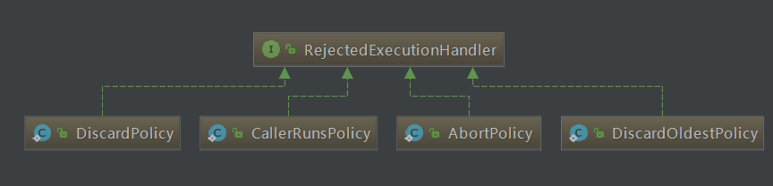


- 第一种拒绝策略是 AbortPolicy（默认的拒绝策略），这种拒绝策略在拒绝任务时，会直接抛出一个类型为 RejectedExecutionException 的 RuntimeException，让你感知到任务被拒绝了，于是你便可以根据业务逻辑选择重试或者放弃提交等策略。

- 第二种拒绝策略是 DiscardPolicy，这种拒绝策略正如它的名字所描述的一样，当新任务被提交后直接被丢弃掉，也不会给你任何的通知，相对而言存在一定的风险，因为我们提交的时候根本不知道这个任务会被丢弃，可能造成数据丢失。

- 第三种拒绝策略是 DiscardOldestPolicy，如果线程池没被关闭且没有能力执行，则会丢弃任务队列中的头结点，通常是存活时间最长的任务，这种策略与第二种不同之处在于它丢弃的不是最新提交的，而是队列中存活时间最长的，这样就可以腾出空间给新提交的任务，但同理它也存在一定的数据丢失风险。

- 第四种拒绝策略是 CallerRunsPolicy，相对而言它就比较完善了，当有新任务提交后，如果线程池没被关闭且没有能力执行，则把这个任务交于提交任务的线程执行，也就是谁提交任务，谁就负责执行任务。这样做主要有两点好处。第一点新提交的任务不会被丢弃，这样也就不会造成业务损失。第二点好处是，由于谁提交任务谁就要负责执行任务，这样提交任务的线程就得负责执行任务，而执行任务又是比较耗时的，在这段期间，提交任务的线程被占用，也就不会再提交新的任务，减缓了任务提交的速度，相当于是一个负反馈。在此期间，线程池中的线程也可以充分利用这段时间来执行掉一部分任务，腾出一定的空间，相当于是给了线程池一定的缓冲期。


### 4、线程池常用的阻塞队列有哪些？
             

线程池的内部结构主要由四部分组成：

第一部分是线程池管理器，它主要负责管理线程池的创建、销毁、添加任务等管理操作，它是整个线程池的管家。

第二部分是工作线程，这些线程勤勤恳恳地从任务队列中获取任务并执行。

第三部分是任务队列，作为一种缓冲机制，线程池会把当下没有处理的任务放入任务队列中，由于多线程同时从任务队列中获取任务是并发场景，此时就需要任务队列满足线程安全的要求，所以线程池中任务队列采用 BlockingQueue 来保障线程安全。

第四部分是任务，任务要求实现统一的接口，以便工作线程可以处理和执行。


线程池中的这四个主要组成部分最值得我们关注的就是阻塞队列了，如表格所示，不同的线程池会选用不同的阻塞队列。

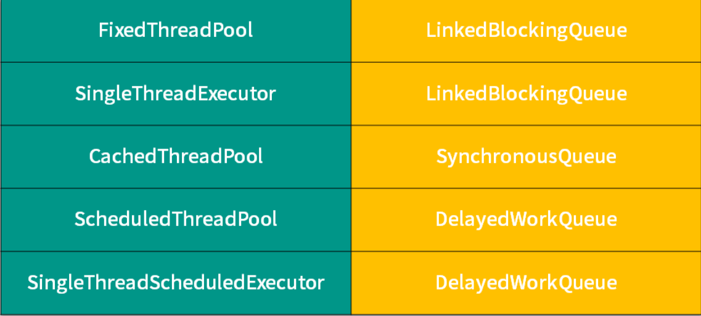

表格左侧是线程池，右侧为它们对应的阻塞队列，你可以看到 5 种线程池对应了 3 种阻塞队列，我们接下来对它们进行逐一的介绍。

#### 1、LinkedBlockingQueue     

对于 FixedThreadPool 和 SingleThreadExector 而言，它们使用的阻塞队列是容量为 Integer.MAX_VALUE 的 LinkedBlockingQueue，可以认为是无界队列。由于 FixedThreadPool 线程池的`线程数是固定的，所以没有办法增加特别多的线程来处理任务，这时就需要 LinkedBlockingQueue 这样一个没有容量限制的阻塞队列来存放任务`。这里需要注意，由于线程池的任务队列永远不会放满，所以线程池只会创建核心线程数量的线程，所以此时的最大线程数对线程池来说没有意义，因为并不会触发生成多于核心线程数的线程。

#### 2、SynchronousQueue      

SynchronousQueue，对应的线程池是 CachedThreadPool。线程池 CachedThreadPool 的最大线程数是 Integer 的最大值，可以理解为线程数是可以无限扩展的。CachedThreadPool 和上一种线程池 FixedThreadPool 的情况恰恰相反，FixedThreadPool 的情况是阻塞队列的容量是无限的，而这里 CachedThreadPool 是线程数可以无限扩展，所以 CachedThreadPool 线程池并不需要一个任务队列来存储任务，因为一旦有任务被提交就直接转发给线程或者创建新线程来执行，而不需要另外保存它们。

我们自己创建使用 SynchronousQueue 的线程池时，如果不希望任务被拒绝，那么就需要注意设置最大线程数要尽可能大一些，以免发生任务数大于最大线程数时，没办法把任务放到队列中也没有足够线程来执行任务的情况。

#### 3、DelayedWorkQueue

第三种阻塞队列是DelayedWorkQueue，它对应的线程池分别是 ScheduledThreadPool 和 SingleThreadScheduledExecutor，这两种线程池的最大特点就是可以延迟执行任务，比如说一定时间后执行任务或是每隔一定的时间执行一次任务。DelayedWorkQueue 的特点是内部元素并不是按照放入的时间排序，而是会按照延迟的时间长短对任务进行排序，内部采用的是“堆”的数据结构。之所以线程池 ScheduledThreadPool 和 SingleThreadScheduledExecutor 选择 DelayedWorkQueue，是因为它们本身正是基于时间执行任务的，而延迟队列正好可以把任务按时间进行排序，方便任务的执行。


#### 4、priorityBlockingQuene

具有优先级的无界阻塞队列，可以根据某个参数来控制提交任务的优先级，即那些任务可以先执行那些可以后执行。


## 2、线程池中线程动态变化过程

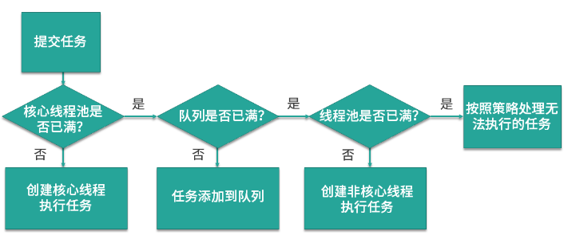

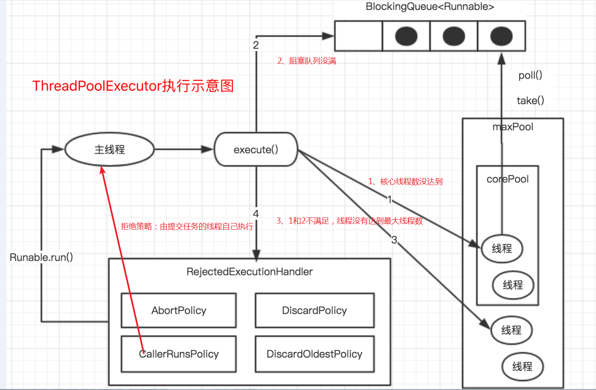

如上图所示，当提交任务后，线程池首先会检查当前线程数，如果此时线程数小于核心线程数，比如最开始线程数量为 0，则新建线程并执行任务，随着任务的不断增加，线程数会逐渐增加并达到核心线程数，此时如果仍有任务被不断提交，就会被放入 workQueue 任务队列中，等待核心线程执行完当前任务后重新从 workQueue 中提取正在等待被执行的任务。


此时，假设我们的任务特别的多，已经达到了 workQueue 的容量上限，这时线程池就会启动后备力量，也就是 maxPoolSize 最大线程数，线程池会在 corePoolSize 核心线程数的基础上继续创建线程来执行任务，假设任务被不断提交，线程池会持续创建线程直到线程数达到 maxPoolSize 最大线程数，如果依然有任务被提交，这就超过了线程池的最大处理能力，这个时候线程池就会拒绝这些任务，我们可以看到实际上任务进来之后，线程池会逐一判断 corePoolSize 、workQueue 、maxPoolSize ，如果依然不能满足需求，则会拒绝任务。


通过上面的流程图，我们了解了 corePoolSize 和 maxPoolSize 的具体含义，corePoolSize 指的是核心线程数，线程池初始化时线程数默认为 0，当有新的任务提交后，会创建新线程执行任务，如果不做特殊设置，此后线程数通常不会再小于 corePoolSize ，因为它们是核心线程，即便未来可能没有可执行的任务也不会被销毁。随着任务量的增加，在任务队列满了之后，线程池会进一步创建新线程，最多可以达到 maxPoolSize 来应对任务多的场景，如果未来线程有空闲，大于 corePoolSize 的线程会被合理回收。所以正常情况下，线程池中的线程数量会处在 corePoolSize 与 maxPoolSize 的闭区间内。


总结出线程池的几个特点。

- 1、线程池希望保持较少的线程数，并且只有在负载变得很大时才增加线程。

- 2、线程池只有在任务队列填满时才创建多于 corePoolSize 的线程，如果使用的是无界队列（例如 LinkedBlockingQueue），那么由于队列不会满，所以线程数不会超过 corePoolSize。

- 3、通过设置 corePoolSize 和 maxPoolSize 为相同的值，就可以创建固定大小的线程池。

- 4、通过设置 maxPoolSize 为很高的值，例如 Integer.MAX_VALUE，就可以允许线程池创建任意多的线程。


## 3、线程池提交任务：execute和submit的区别

- execute（Runnable）：没有返回值

- submit（Runnable/Callable）：有返回值。通过和Future结合一起使用，可以起到如果线程没有返回结果，就阻塞当前线程等待线程 池结果返回。

- execute() 方法属于 Executor 接口的方法，而 submit() 方法则是属于 ExecutorService 接口的方法

简单来说，execute方法只能运行实现了Runnable接口的方法，而submit可以运行实现了Runnable和Callable接口的方法。其中，通过pool.submit(Callable/Runnable)，对应的参数Callable/Runnable会被二次封装一下为RunnableFuture（继承接口Runnable, Future<V>）对象，然后通过pool.execute(Runnable)执行，因此来看，通过线程池提交的任务本质都是通过execute执行的。在线程池的线程工厂创建线程的时候，再把RunnableFuture对象作为参数构建线程new Thread（Runnable），最后在Thread.start()中被调用。

```java
public Future<?> submit(Runnable task) {
    if (task == null) throw new NullPointerException();
    RunnableFuture<Void> ftask = newTaskFor(task, null);
    execute(ftask);
    return ftask;
}

protected <T> RunnableFuture<T> newTaskFor(Callable<T> callable) {
        return new FutureTask<T>(callable);
}
```


# 03、有哪 6 种常见的线程池？什么是 Java8 的 ForkJoinPool？

Java1.5中引入的Executor框架把**任务的提交和执行**进行解耦，只需要定义好任务，然后提交给线程池，而不用关心该任务是如何执行、被哪个线程执行，以及什么时候执行。通过工厂类Executors的静态方法newFixedThreadPool、newCachedThreadPool、newSingleThreadExecutor可以构造线程池类ExecutorService其底层都是调用new ThreadPoolExecutor来实现的。


使用线程池的优势：在线程池中执行任务比为每个任务分配一个线程优势更多，通过重用现有的线程而不是创建新线程，可以在处理多个请求时分摊线程创建和销毁产生的巨大的开销。当请求到达时，通常工作线程已经存在，提高了响应性；通过配置线程池的大小，可以创建足够多的线程使CPU达到忙碌状态，还可以防止线程太多耗尽计算机的资源。

6 种常见的线程池如下:
- FixedThreadPool
- CachedThreadPool
- ScheduledThreadPool
- SingleThreadExecutor
- SingleThreadScheduledExecutor
- ForkJoinPool

## 1、FixedThreadPool

```java
public static ExecutorService newFixedThreadPool(int nThreads) {
        return new ThreadPoolExecutor(nThreads, nThreads,
                                      0L, TimeUnit.MILLISECONDS,
                                      new LinkedBlockingQueue<Runnable>());
    }
```
备注：这里使用默认的线程工厂和拒绝策略；使用无界阻塞队列，除非内存溢出，队列不会满。


它的核心线程数和最大线程数是一样的，所以可以把它看作是固定线程数的线程池，它的特点是线程池中的线程数除了初始阶段需要从 0 开始增加外，之后的线程数量就是固定的，就算任务数超过线程数，线程池也不会再创建更多的线程来处理任务，而是会把超出线程处理能力的任务放到任务队列中进行等待。而且就算任务队列满了，到了本该继续增加线程数的时候，由于它的最大线程数和核心线程数是一样的，所以也无法再增加新的线程了。

## 2、CachedThreadPool

```java
public static ExecutorService newCachedThreadPool() {
        return new ThreadPoolExecutor(0, Integer.MAX_VALUE,
                                      60L, TimeUnit.SECONDS,
                                      new SynchronousQueue<Runnable>());
    }
```
备注：这里使用默认的线程工厂和拒绝策略；

CachedThreadPool，可以称作可缓存线程池，它的特点在于线程数是几乎可以无限增加的（实际最大可以达到 Integer.MAX_VALUE，为 2^31-1，这个数非常大，所以基本不可能达到），而当线程闲置时还可以对线程进行回收。也就是说该线程池的线程数量不是固定不变的，当然它也有一个用于存储提交任务的队列，但这个队列是 SynchronousQueue，队列的容量为0，实际不存储任何任务，它只负责对任务进行中转和传递，所以效率比较高。

当我们提交一个任务后，线程池会判断已创建的线程中是否有空闲线程，如果有空闲线程则将任务直接指派给空闲线程，如果没有空闲线程，则新建线程去执行任务，这样就做到了动态地新增线程。让我们举个例子，如下方代码所示。

```java
ExecutorService service = Executors.newCachedThreadPool();
    for (int i = 0; i < 1000; i++) { 
        service.execute(new Task() { 
    });
 }
```

使用 for 循环提交 1000 个任务给 CachedThreadPool，假设这些任务处理的时间非常长，会发生什么情况呢？因为 for 循环提交任务的操作是非常快的，但执行任务却比较耗时，就可能导致 1000 个任务都提交完了但第一个任务还没有被执行完，所以此时 CachedThreadPool 就可以动态的伸缩线程数量，随着任务的提交，不停地创建 1000 个线程来执行任务，而当任务执行完之后，假设没有新的任务了，那么大量的闲置线程又会造成内存资源的浪费，这时线程池就会检测线程在 60 秒内有没有可执行任务，如果没有就会被销毁，最终线程数量会减为 0。

## 3、ScheduledThreadPool

```java
public ScheduledThreadPoolExecutor(int corePoolSize) {
        super(corePoolSize, Integer.MAX_VALUE, 0, NANOSECONDS,
              new DelayedWorkQueue());
    }
```
备注：这里使用默认的线程工厂和拒绝策略；

ScheduledThreadPool，它支持定时或周期性执行任务。比如每隔 10 秒钟执行一次任务，而实现这种功能的方法主要有 3 种，如代码所示：

```java
ScheduledExecutorService service = Executors.newScheduledThreadPool(10);
 
service.schedule(new Task(), 10, TimeUnit.SECONDS);//一次性的
 
service.scheduleAtFixedRate(new Task(), 10, 10, TimeUnit.SECONDS);//周期执行
 
service.scheduleWithFixedDelay(new Task(), 10, 10, TimeUnit.SECONDS);
```

那么这 3 种方法有什么区别呢？

- 第一种方法 schedule 比较简单，表示延迟指定时间后执行一次任务，如果代码中设置参数为 10 秒，也就是 10 秒后执行一次任务后就结束。

- 第二种方法 scheduleAtFixedRate 表示以固定的频率执行任务，它的第二个参数 initialDelay 表示第一次延时时间，第三个参数 period 表示周期，也就是第一次延时后每次延时多长时间执行一次任务。

- 第三种方法 scheduleWithFixedDelay 与第二种方法类似，也是周期执行任务，区别在于对周期的定义，之前的 scheduleAtFixedRate 是以任务开始的时间为时间起点开始计时，时间到就开始执行第二次任务，而不管任务需要花多久执行；而 scheduleWithFixedDelay 方法以任务结束的时间为下一次循环的时间起点开始计时。

举个例子，假设某个同学正在熬夜写代码，需要喝咖啡来提神，假设每次喝咖啡都需要花10分钟的时间，如果此时采用第2种方法 scheduleAtFixedRate，时间间隔设置为 1 小时，那么他将会在每个整点喝一杯咖啡，以下是时间表：

```
00:00: 开始喝咖啡
00:10: 喝完了
01:00: 开始喝咖啡
01:10: 喝完了
02:00: 开始喝咖啡
02:10: 喝完了
```

但是假设他采用第3种方法 scheduleWithFixedDelay，时间间隔同样设置为 1 小时，那么由于每次喝咖啡需要10分钟，而 scheduleWithFixedDelay 是以任务完成的时间为时间起点开始计时的，所以第2次喝咖啡的时间将会在1:10，而不是1:00整，以下是时间表：

```
00:00: 开始喝咖啡
00:10: 喝完了
01:10: 开始喝咖啡
01:20: 喝完了
02:20: 开始喝咖啡
02:30: 喝完了
```

## 4、SingleThreadExecutor(单线程按照任务的提交顺序执行)

```java
 public static ExecutorService newSingleThreadExecutor() {
        return new FinalizableDelegatedExecutorService
            (new ThreadPoolExecutor(1, 1,
                                    0L, TimeUnit.MILLISECONDS,
                                    new LinkedBlockingQueue<Runnable>()));
    }
```

SingleThreadExecutor，它会使用唯一的线程去执行任务，原理和 FixedThreadPool 是一样的，只不过这里线程只有一个，如果线程在执行任务的过程中发生异常，线程池也会重新创建一个线程来执行后续的任务。这种线程池由于只有一个线程，所以非常适合用于所有任务都需要按被提交的顺序依次执行的场景，而前几种线程池不一定能够保障任务的执行顺序等于被提交的顺序，因为它们是多线程并行执行的。


## 5、SingleThreadScheduledExecutor

```java
public static ScheduledExecutorService newSingleThreadScheduledExecutor() {
        return new DelegatedScheduledExecutorService
            (new ScheduledThreadPoolExecutor(1));
    }
```

SingleThreadScheduledExecutor，它实际和第三种 ScheduledThreadPool 线程池非常相似，它只是 ScheduledThreadPool 的一个特例，内部只有一个线程,它只是将 ScheduledThreadPool 的核心线程数设置为了 1。

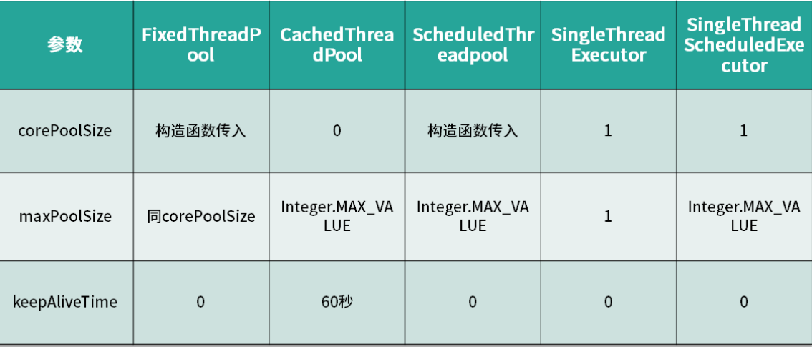

总结上述的五种线程池，我们以核心线程数、最大线程数，以及线程存活时间三个维度进行对比，如表格所示。


## 6、ForkJoinPool

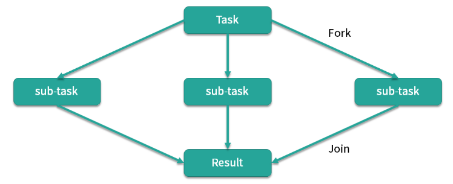

ForkJoinPool，这个线程池是在 JDK 8 加入的，它的名字 ForkJoin 也描述了它的执行机制，主要用法和之前的线程池是相同的，也是把任务交给线程池去执行，线程池中也有任务队列来存放任务。但是 ForkJoinPool 线程池和之前的线程池有两点非常大的不同之处。第一点它非常适合执行可以产生子任务的任务。

如图所示，我们有一个 Task，这个 Task 可以产生三个子任务，三个子任务并行执行完毕后将结果汇总给 Result，比如说主任务需要执行非常繁重的计算任务，我们就可以把计算拆分成三个部分，这三个部分是互不影响相互独立的，这样就可以利用 CPU 的多核优势，并行计算，然后将结果进行汇总。这里面主要涉及两个步骤，第一步是拆分也就是 Fork，第二步是汇总也就是 Join，到这里你应该已经了解到 ForkJoinPool 线程池名字的由来了。

举个例子，比如菲波那切数列，这个数列的特点就是后一项的结果等于前两项的和，第 0 项是 0，第 1 项是 1，那么第 2 项就是 0+1=1，以此类推。我们在写代码时应该首选效率更高的迭代形式或者更高级的乘方或者矩阵公式法等写法，不过假设我们写成了最初版本的递归形式，伪代码如下所示：

```java
if (n <= 1) {
    return n;
 } else {
    Fib f1 = new Fib(n - 1);
    Fib f2 = new Fib(n - 2);
    f1.solve();
    f2.solve();
    number = f1.number + f2.number;
    return number;
 }
```

你可以看到如果 n<=1 则直接返回 n，如果 n>1 ，先将前一项 f1 的值计算出来，然后往前推两项求出 f2 的值，然后将两值相加得到结果，所以我们看到在求和运算中产生了两个子任务。计算 f(4) 的流程如下图所示。

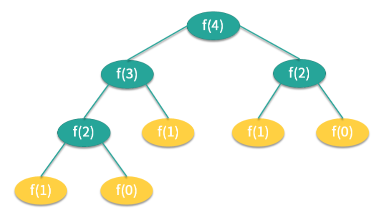

在计算 f(4) 时需要首先计算出 f(2) 和 f(3)，而同理，计算 f(3) 时又需要计算 f(1) 和 f(2)，以此类推。

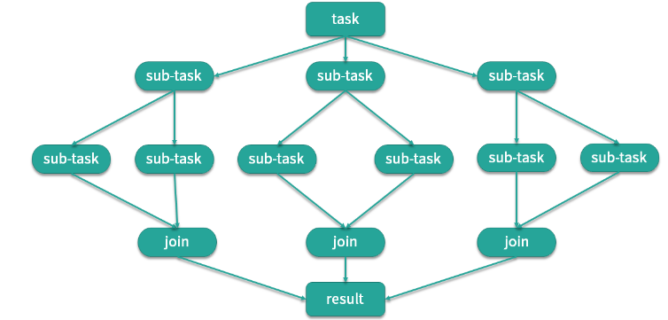

这是典型的递归问题，对应到我们的 ForkJoin 模式，如图所示，子任务同样会产生子子任务，最后再逐层汇总，得到最终的结果。

ForkJoinPool 线程池有多种方法可以实现任务的分裂和汇总，其中一种用法如下方代码所示。

```java

Fibonacci extends RecursiveTask<Integer> { 
    int n;
    public Fibonacci(int n) { 
        this.n = n;
    } 
 
    @Override
    public Integer compute() { 
        if (n <= 1) { 
            return n;
        } 
    Fibonacci f1 = new Fibonacci(n - 1);
    f1.fork();
    Fibonacci f2 = new Fibonacci(n - 2);
    f2.fork();
    return f1.join() + f2.join();
    } 
 }
```

我们看到它首先继承了 RecursiveTask，RecursiveTask 类是对ForkJoinTask 的一个简单的包装，这时我们重写 compute() 方法，当 n<=1 时直接返回，当 n>1 就创建递归任务，也就是 f1 和 f2，然后我们用 fork() 方法分裂任务并分别执行，最后在 return 的时候，使用 join() 方法把结果汇总，这样就实现了任务的分裂和汇总。

```java
public static void main(String[] args) throws ExecutionException, InterruptedException { 
    ForkJoinPool forkJoinPool = new ForkJoinPool();
    for (int i = 0; i < 10; i++) { 
        ForkJoinTask task = forkJoinPool.submit(new Fibonacci(i));
        System.out.println(task.get());
    } 
}
```

上面这段代码将会打印出斐波那契数列的第 0 到 9 项的值：

```
0
1
1
2
3
5
8
13
21
34
```

这就是 ForkJoinPool 线程池和其他线程池的第一点不同。

我们来看第二点不同，第二点不同之处在于内部结构，之前的线程池所有的线程共用一个队列，但 ForkJoinPool 线程池中每个线程都有自己独立的任务队列。

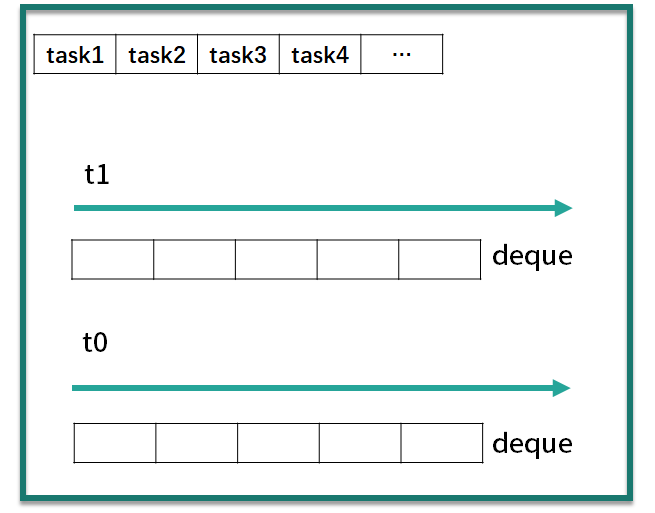

ForkJoinPool 线程池内部除了有一个共用的任务队列之外，每个线程还有一个对应的双端队列 deque，这时一旦线程中的任务被 Fork 分裂了，分裂出来的子任务放入线程自己的 deque 里，而不是放入公共的任务队列中。如果此时有三个子任务放入线程 t1 的 deque 队列中，对于线程 t1 而言获取任务的成本就降低了，可以直接在自己的任务队列中获取而不必去公共队列中争抢也不会发生阻塞（除了后面会讲到的 steal 情况外），减少了线程间的竞争和切换，是非常高效的。

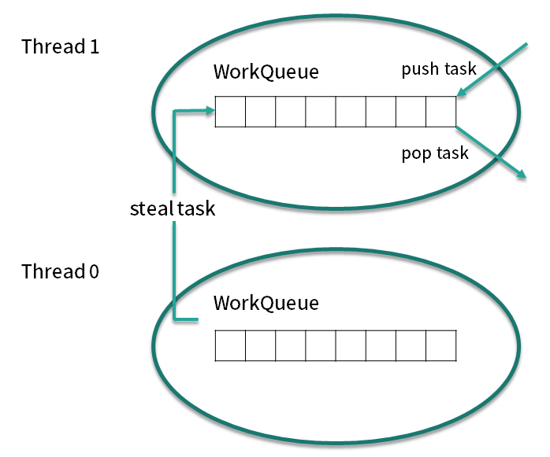

我们再考虑一种情况，此时线程有多个，而线程 t1 的任务特别繁重，分裂了数十个子任务，但是 t0 此时却无事可做，它自己的 deque 队列为空，这时为了提高效率，t0 就会想办法帮助 t1 执行任务，这就是“work-stealing”的含义。

双端队列 deque 中，线程 t1 获取任务的逻辑是后进先出，也就是LIFO（Last In Frist Out），而线程 t0 在“steal”偷线程 t1 的 deque 中的任务的逻辑是先进先出，也就是FIFO（Fast In Frist Out），如图所示，图中很好的描述了两个线程使用双端队列分别获取任务的情景。你可以看到，使用 “work-stealing” 算法和双端队列很好地平衡了各线程的负载。

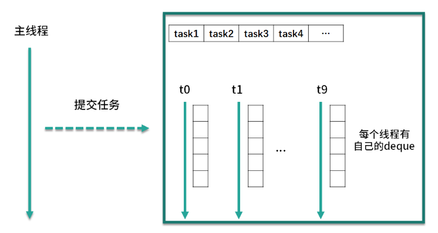

最后，我们用一张全景图来描述 ForkJoinPool 线程池的内部结构，你可以看到 ForkJoinPool 线程池和其他线程池很多地方都是一样的，但重点区别在于它每个线程都有一个自己的双端队列来存储分裂出来的子任务。ForkJoinPool 非常适合用于递归的场景，例如树的遍历、最优路径搜索等场景。


# 04、为什么不应该直接调用Executors的各种方法创建线程池？

下面分析可能带来哪些问题：无界队列导致内存爆掉、线程数不做限制会导致服务器无法创建足够多的线程。


- 1、FixedThreadPool：这里的重点是使用的队列是容量没有上限的 LinkedBlockingQueue，如果我们对任务的处理速度比较慢，那么随着请求的增多，队列中堆积的任务也会越来越多，最终大量堆积的任务会占用大量内存，并发生 OOM ，也就是OutOfMemoryError，这几乎会影响到整个程序，会造成很严重的后果。

- 2、SingleThreadExecutor：newSingleThreadExecutor 和 newFixedThreadPool 的原理是一样的，只不过把核心线程数和最大线程数都直接设置成了 1，但是任务队列仍是无界的 LinkedBlockingQueue，所以也会导致同样的问题，也就是当任务堆积时，可能会占用大量的内存并导致 OOM。

- 3、CachedThreadPool：这里的 CachedThreadPool 和前面两种线程池不一样的地方在于任务队列使用的是 SynchronousQueue，SynchronousQueue 本身并不存储任务，而是对任务直接进行转发，这本身是没有问题的，但你会发现构造函数的第二个参数被设置成了 Integer.MAX_VALUE，这个参数的含义是最大线程数，所以由于 CachedThreadPool 并不限制线程的数量，当任务数量特别多的时候，就可能会导致创建非常多的线程，最终超过了操作系统的上限而无法创建新线程，或者导致内存不足。

- 4、ScheduledThreadPool 和 SingleThreadScheduledExecutor：两者的原理是一样的，通过源码可以看出，它采用的任务队列是 DelayedWorkQueue，这是一个延迟队列，同时也是一个无界队列，所以和 LinkedBlockingQueue 一样，如果队列中存放过的任务，就可能导致 OOM。

你可以看到，这几种自动创建的线程池都存在风险，相比较而言，我们自己手动创建会更好，因为我们可以更加明确线程池的运行规则，不仅可以选择适合自己的线程数量，更可以在必要的时候拒绝新任务的提交，避免资源耗尽的风险。


# 05、合适的线程数量是多少？CPU 核心数和线程数的关系？


《Java并发编程实战》的作者 Brain Goetz 推荐的计算方法：

线程数 = CPU 核心数 *（1+平均等待时间/平均工作时间）

通过这个公式，我们可以计算出一个合理的线程数量。如果任务的平均等待时间长，线程数就随之增加，而如果平均工作时间长，也就是对于我们上面的 CPU 密集型任务，线程数就随之减少。

太少的线程数会使得程序整体性能降低，而过多的线程也会消耗内存等其他资源，所以如果想要更准确的话，可以进行压测，监控 JVM 的线程情况以及 CPU 的负载情况，根据实际情况衡量应该创建的线程数，合理并充分利用资源。

我们调整线程池中的线程数量的最主要的目的是为了充分并合理地使用 CPU 和内存等资源，从而最大限度地提高程序的性能。在实际工作中，我们需要根据任务类型的不同选择对应的策略。


另外一种估算方式：
- 如果任务是IO密集型，一般线程数需要设置2倍CPU数以上，以此来尽量利用CPU资源。
- 如果任务是CPU密集型，一般线程数量只需要设置CPU数加1即可，更多的线程数也只能增加上下文切换，不能增加CPU利用率。


## 1、CPU 密集型任务

首先，我们来看 CPU 密集型任务，比如加密、解密、压缩、计算等一系列需要大量耗费 CPU 资源的任务。对于这样的任务最佳的线程数为 CPU 核心数的 1~2 倍，如果设置过多的线程数，实际上并不会起到很好的效果。此时假设我们设置的线程数量是 CPU 核心数的 2 倍以上，因为计算任务非常重，会占用大量的 CPU 资源，所以这时 CPU 的每个核心工作基本都是满负荷的，而我们又设置了过多的线程，每个线程都想去利用 CPU 资源来执行自己的任务，这就会造成不必要的上下文切换，此时线程数的增多并没有让性能提升，反而由于线程数量过多会导致性能下降。

针对这种情况，我们最好还要同时考虑在同一台机器上还有哪些其他会占用过多 CPU 资源的程序在运行，然后对资源使用做整体的平衡。

## 2、耗时 IO 型任务

第二种任务是耗时 IO 型，比如数据库、文件的读写，网络通信等任务，这种任务的特点是并不会特别消耗 CPU 资源，但是 IO 操作很耗时，总体会占用比较多的时间。对于这种任务最大线程数一般会大于 CPU 核心数很多倍，因为 IO 读写速度相比于 CPU 的速度而言是比较慢的，如果我们设置过少的线程数，就可能导致 CPU 资源的浪费。而如果我们设置更多的线程数，那么当一部分线程正在等待 IO 的时候，它们此时并不需要 CPU 来计算，那么另外的线程便可以利用 CPU 去执行其他的任务，互不影响，这样的话在任务队列中等待的任务就会减少，可以更好地利用资源。


# 06、如何根据实际需要，定制自己的线程池？


> 总结

定制自己的线程池和我们的业务是强相关的，首先我们需要掌握每个参数的含义，以及常见的选项，然后根据实际需要，比如说并发量、内存大小、是否接受任务被拒绝等一系列因素去定制一个非常适合自己业务的线程池，这样既不会导致内存不足，同时又可以用合适数量的线程来保障任务执行的效率，并在拒绝任务时有所记录方便日后进行追溯。


## 1、核心线程数

第一个需要设置的参数往往是 corePoolSize 核心线程数，合理的线程数量和任务类型，以及 CPU 核心数都有关系，基本结论是线程的平均工作时间所占比例越高，就需要越少的线程；线程的平均等待时间所占比例越高，就需要越多的线程。而对于最大线程数而言，如果我们执行的任务类型不是固定的，比如可能一段时间是 CPU 密集型，另一段时间是 IO 密集型，或是同时有两种任务相互混搭。那么在这种情况下，我们可以把最大线程数设置成核心线程数的几倍，以便应对任务突发情况。当然更好的办法是用不同的线程池执行不同类型的任务，让任务按照类型区分开，而不是混杂在一起，这样就可以通过估算的线程数或经过压测得到的结果来设置合理的线程数了，达到更好的性能。

## 2、阻塞队列

对于阻塞队列这个参数而言，我们可以选择之前介绍过的 LinkedBlockingQueue 或者 SynchronousQueue 或者 DelayedWorkQueue，不过还有一种常用的阻塞队列叫 ArrayBlockingQueue，它也经常被用于线程池中，这种阻塞队列内部是用数组实现的，在新建对象的时候要求传入容量值，且后期不能扩容，所以 ArrayBlockingQueue 的最大的特点就是容量是有限的。这样一来，如果任务队列放满了任务，而且线程数也已经达到了最大值，线程池根据规则就会拒绝新提交的任务，这样一来就可能会产生一定的数据丢失。

但相比于无限增加任务或者线程数导致内存不足，进而导致程序崩溃，数据丢失还是要更好一些的，如果我们使用了 ArrayBlockingQueue 这种阻塞队列，再加上我们限制了最大线程数量，就可以非常有效地防止资源耗尽的情况发生。此时的队列容量大小和 maxPoolSize 是一个 trade-off，如果我们使用容量更大的队列和更小的最大线程数，就可以减少上下文切换带来的开销，但也可能因此降低整体的吞吐量；如果我们的任务是 IO 密集型，则可以选择稍小容量的队列和更大的最大线程数，这样整体的效率就会更高，不过也会带来更多的上下文切换。

## 3、线程工厂

对于线程工厂 threadFactory 这个参数，我们可以使用默认的 defaultThreadFactory，也可以传入自定义的有额外能力的线程工厂，因为我们可能有多个线程池，而不同的线程池之间有必要通过不同的名字来进行区分，所以可以传入能根据业务信息进行命名的线程工厂，以便后续可以根据线程名区分不同的业务进而快速定位问题代码。比如可以通过com.google.common.util.concurrent.ThreadFactory

Builder 来实现，如代码所示。

```java
ThreadFactoryBuilder builder = new ThreadFactoryBuilder();
ThreadFactory rpcFactory = builder.setNameFormat("rpc-pool-%d").build();
```

我们生成了名字为 rpcFactory 的 ThreadFactory，它的 nameFormat 为 "rpc-pool-%d" ，那么它生成的线程的名字是有固定格式的，它生成的线程的名字分别为"rpc-pool-1"，"rpc-pool-2" ，以此类推。

## 4、拒绝策略

最后一个参数是拒绝策略，我们可以根据业务需要，选择四种拒绝策略之一来使用：AbortPolicy，DiscardPolicy，DiscardOldestPolicy 或者 CallerRunsPolicy。除此之外，我们还可以通过实现 RejectedExecutionHandler 接口来实现自己的拒绝策略，在接口中我们需要实现 rejectedExecution 方法，在 rejectedExecution 方法中，执行例如打印日志、暂存任务、重新执行等自定义的拒绝策略，以便满足业务需求。如代码所示。

```java
private static class CustomRejectionHandler implements RejectedExecutionHandler { 
    @Override
    public void rejectedExecution(Runnable r, ThreadPoolExecutor executor) { 
        //打印日志、暂存任务、重新执行等拒绝策略
    } 
}
```

# 09、线程池的状态？如何正确关闭线程池？shutdown 和 shutdownNow 的区别？


首先，我们创建一个线程数固定为 10 的线程池，并且往线程池中提交 100 个任务，如代码所示。

```java
ExecutorService service = Executors.newFixedThreadPool(10);
 for (int i = 0; i < 100; i++) { 
    service.execute(new Task());
 }
```

那么如果现在我们想关闭该线程池该如何做呢？主要介绍 5 种在 ThreadPoolExecutor 中涉及关闭线程池的方法，如下所示。

- void shutdown;
- boolean isShutdown;
- boolean isTerminated;
- boolean awaitTermination(long timeout, TimeUnit unit) throws InterruptedException;
- List<Runnable> shutdownNow;

## 0、线程池的状态


```java
private static final int COUNT_BITS = Integer.SIZE - 3;

// runState is stored in the high-order bits
private static final int RUNNING    = -1 << COUNT_BITS;//运行状态，指可以接受任务、执行队列里的任务
private static final int SHUTDOWN   =  0 << COUNT_BITS;//指调用了 `shutdown()` 方法，不再接受新任务了，但是队列里的任务得执行完毕。
private static final int STOP       =  1 << COUNT_BITS;//指调用了 `shutdownNow()` 方法，不再接受新任务，同时抛弃阻塞队列里的所有任务并中断所有正在执行任务。
private static final int TIDYING    =  2 << COUNT_BITS;//所有任务都执行完毕，在调用 `shutdown()/shutdownNow()` 中都会尝试更新为这个状态。
private static final int TERMINATED =  3 << COUNT_BITS;//终止状态，当执行 `terminated()` 后会更新为这个状态。

```

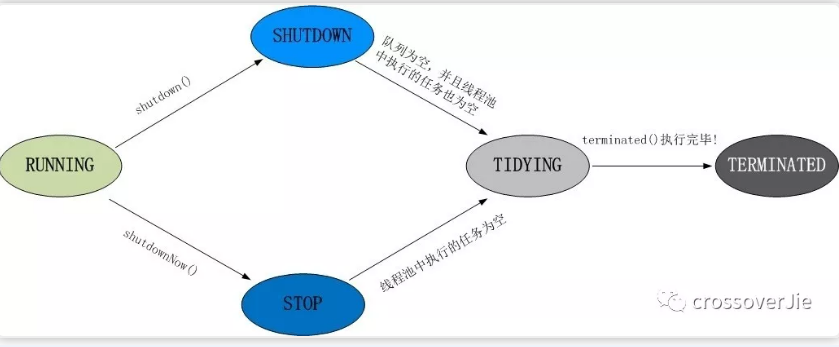


## 1、shutdown()

它可以安全地关闭一个线程池，调用 shutdown() 方法之后线程池并不是立刻就被关闭，因为这时线程池中可能还有很多任务正在被执行，或是任务队列中有大量正在等待被执行的任务，调用 shutdown() 方法后线程池会在执行完正在执行的任务和队列中等待的任务后才彻底关闭。但这并不代表 shutdown() 操作是没有任何效果的，调用 shutdown() 方法后如果还有新的任务被提交，线程池则会根据拒绝策略直接拒绝后续新提交的任务。

## 2、isShutdown()

它可以返回 true 或者 false 来判断线程池是否已经开始了关闭工作，也就是是否执行了 shutdown 或者 shutdownNow 方法。这里需要注意，如果调用 isShutdown() 方法的返回的结果为 true 并不代表线程池此时已经彻底关闭了，这仅仅代表线程池开始了关闭的流程，也就是说，此时可能线程池中依然有线程在执行任务，队列里也可能有等待被执行的任务。

## 3、isTerminated()

第三种方法叫作 isTerminated()，这个方法可以检测线程池是否真正“终结”了，这不仅代表线程池已关闭，同时代表线程池中的所有任务都已经都执行完毕了，因为我们刚才说过，调用 shutdown 方法之后，线程池会继续执行里面未完成的任务，不仅包括线程正在执行的任务，还包括正在任务队列中等待的任务。比如此时已经调用了 shutdown 方法，但是有一个线程依然在执行任务，那么此时调用 isShutdown 方法返回的是 true ，而调用 isTerminated 方法返回的便是 false ，因为线程池中还有任务正在在被执行，线程池并没有真正“终结”。直到所有任务都执行完毕了，调用 isTerminated() 方法才会返回 true，这表示线程池已关闭并且线程池内部是空的，所有剩余的任务都执行完毕了。

## 4、awaitTermination()

它本身并不是用来关闭线程池的，而是主要用来判断线程池状态的。比如我们给 awaitTermination 方法传入的参数是 10 秒，那么它就会陷入 10 秒钟的等待，直到发生以下三种情况之一：

- 1、等待期间（包括进入等待状态之前）线程池已关闭并且所有已提交的任务（包括正在执行的和队列中等待的）都执行完毕，相当于线程池已经“终结”了，方法便会返回 true；

- 2、等待超时时间到后，第一种线程池“终结”的情况始终未发生，方法返回 false；

- 3、等待期间线程被中断，方法会抛出 InterruptedException 异常。

也就是说，调用 awaitTermination 方法后当前线程会尝试等待一段指定的时间，如果在等待时间内，线程池已关闭并且内部的任务都执行完毕了，也就是说线程池真正“终结”了，那么方法就返回 true，否则超时返回 fasle。

我们则可以根据 awaitTermination() 返回的布尔值来判断下一步应该执行的操作。

## 5、shutdownNow()

它与第一种 shutdown 方法不同之处在于名字中多了一个单词 Now，也就是表示立刻关闭的意思。在执行 shutdownNow 方法之后，首先会给所有线程池中的线程发送 interrupt 中断信号，尝试中断这些任务的执行，然后会将任务队列中正在等待的所有任务转移到一个 List 中并返回，我们可以根据返回的任务 List 来进行一些补救的操作，例如记录在案并在后期重试。shutdownNow() 的源码如下所示。

```java
public List<Runnable> shutdownNow() { 
    List<Runnable> tasks;
    final ReentrantLock mainLock = this.mainLock;
    mainLock.lock();

    try { 
        checkShutdownAccess();
        advanceRunState(STOP);
        interruptWorkers();//中断运行中的线程
        tasks = drainQueue();
    } finally { 
        mainLock.unlock();
    } 
 
    tryTerminate();
    return tasks;
 }
```

你可以看到源码中有一行 interruptWorkers() 代码，这行代码会让每一个已经启动的线程都中断，这样线程就可以在执行任务期间检测到中断信号并进行相应的处理，提前结束任务。这里需要注意的是，由于 Java 中不推荐强行停止线程的机制的限制，即便我们调用了 shutdownNow 方法，如果被中断的线程对于中断信号不理不睬，那么依然有可能导致任务不会停止。可见我们在开发中落地最佳实践是很重要的，我们自己编写的线程应当具有响应中断信号的能力，正确停止线程的方法，应当利用中断信号来协同工作。

在掌握了这 5 种关闭线程池相关的方法之后，我们就可以根据自己的业务需要，选择合适的方法来停止线程池，比如通常我们可以用 shutdown() 方法来关闭，这样可以让已提交的任务都执行完毕，但是如果情况紧急，那我们就可以用 shutdownNow 方法来加快线程池“终结”的速度。

我通常是按照以下方式关闭线程池的：

```java
        long start = System.currentTimeMillis();
        for (int i = 0; i <= 5; i++) {
            pool.execute(new Job());
        }

        pool.shutdown();

        while (!pool.awaitTermination(1, TimeUnit.SECONDS)) {
            LOGGER.info("线程还在执行。。。");
        }
        long end = System.currentTimeMillis();
        LOGGER.info("一共处理了【{}】", (end - start));
```

`pool.awaitTermination(1, TimeUnit.SECONDS)` 会每隔一秒钟检查一次是否执行完毕（状态为 `TERMINATED`），当从 while 循环退出时就表明线程池已经完全终止了。


# 10、线程池工作原理源码分析

线程池的机制是这样的：
- 0、初始化时，不创建任何执行线程，当有新任务进来时，才会创建执行线程。
- 1、如果正在运行的线程数 < coreSize，马上创建线程执行该task，不排队等待；
- 2、如果正在运行的线程数 >= coreSize，把该task放入阻塞队列；
- 3、如果队列已满 && 正在运行的线程数 < maximumPoolSize，创建新的线程执行该task；
- 4、如果队列已满 && 正在运行的线程数 >= maximumPoolSize，线程池调用handler的reject方法拒绝本次提交。


我们知道线程池会使用固定数量或可变数量的线程来执行任务，但无论是固定数量或可变数量的线程，其线程数量都远远小于任务数量，面对这种情况线程池可以通过线程复用让同一个线程去执行不同的任务，那么线程复用背后的原理是什么呢？

线程池可以把线程和任务进行解耦，线程归线程，任务归任务，摆脱了之前通过 Thread 创建线程时的一个线程必须对应一个任务的限制。在线程池中，同一个线程可以从 BlockingQueue 中不断提取新任务来执行，其核心原理在于线程池对 Thread 进行了封装，并不是每次执行任务都会调用 Thread.start() 来创建新线程，而是让每个线程去执行一个“循环任务”，在这个“循环任务”中，不停地检查是否还有任务等待被执行，如果有则直接去执行这个任务，也就是调用任务的 run 方法，把 run 方法当作和普通方法一样的地位去调用，相当于把每个任务的 run() 方法串联了起来，所以线程数量并不增加。


我们接下来具体看看代码是如何实现的，我们从 execute 方法开始分析，源码如下所示。

```java
public void execute(Runnable command) { 
    if (command == null) //判断执行任务为空抛异常
        throw new NullPointerException();
    int c = ctl.get();
    if (workerCountOf(c) < corePoolSize) { //1、【创建核心线程】判断当前线程数是否小于核心线程数，如果小于核心线程数就调用 addWorker() 方法增加一个 Worker，这里的 Worker 就可以理解为一个线程
        if (addWorker(command, true)) //添加成功即结束了
            return;
        c = ctl.get();
    } 
    if (isRunning(c) && workQueue.offer(command)) { //2、【任务添加阻塞队列】如果代码执行到这里，说明当前线程数大于或等于核心线程数或者 addWorker 失败了，那么就需要通过 if (isRunning(c) && workQueue.offer(command)) 检查线程池状态是否为 Running，如果线程池状态是 Running 就把任务放入任务队列中，也就是 workQueue.offer(command)。
        int recheck = ctl.get();
        if (! isRunning(recheck) && remove(command)) //如果线程池已经不处于 Running 状态，说明线程池被关闭，那么就移除刚刚添加到任务队列中的任务，并执行拒绝策略
            reject(command);
        else if (workerCountOf(recheck) == 0) //能进入这个 else 说明前面判断到线程池状态为 Running，那么当任务被添加进来之后就需要防止没有可执行线程的情况发生（比如之前的线程被回收了或意外终止了），所以此时如果检查当前线程数为 0，也就是 workerCountOf(recheck) == 0，那就执行 addWorker() 方法新建线程。
            addWorker(null, false);
    } 
    else if (!addWorker(command, false)) //3、【添加非核心线程】执行到这里，说明线程池不是 Running 状态或线程数大于或等于核心线程数并且任务队列已经满了，根据规则，此时需要添加新线程，直到线程数达到“最大线程数”，所以此时就会再次调用 addWorker 方法并将第二个参数传入 false，传入 false 代表增加线程时判断当前线程数是否少于 maxPoolSize，小于则增加新线程，大于等于则不增加，也就是以 maxPoolSize 为上限创建新的 worker；addWorker 方法如果返回 true 代表添加成功，如果返回 false 代表任务添加失败，说明当前线程数已经达到 maxPoolSize，然后执行拒绝策略 reject 方法。如果执行到这里线程池的状态不是 Running，那么 addWorker 会失败并返回 false，所以也会执行拒绝策略 reject 方法。
        reject(command);
}


//执行拒绝策略，构建线程池实例的时候进行初始化拒绝策略
final void reject(Runnable command) {
        handler.rejectedExecution(command, this);
    }
```


addWorker 方法的主要作用是在线程池中创建一个线程并执行第一个参数传入的任务。它的第二个参数是个布尔值，如果布尔值传入 true新增的为核心线程，false添加的是非核心线程。addWorker() 方法如果返回 true 代表添加成功，如果返回 false 代表添加失败。

```java
private boolean addWorker(Runnable firstTask, boolean core) {//core true表示添加的是核心线程数
        retry://这个是java中的goto语法。只能运用在break和continue后面。一般用于多层循环跳入跳出
        for (;;) {
            int c = ctl.get();
            int rs = runStateOf(c);

            // Check if queue empty only if necessary.
            if (rs >= SHUTDOWN &&
                ! (rs == SHUTDOWN &&
                   firstTask == null &&
                   ! workQueue.isEmpty()))
                return false;

            for (;;) {
                int wc = workerCountOf(c);
                if (wc >= CAPACITY ||
                    wc >= (core ? corePoolSize : maximumPoolSize))
                    return false;//core=true添加核心线程，core=false添加非核心线程，只有达到各自限制才会直接返回
                if (compareAndIncrementWorkerCount(c))//使用CAS机制尝试将当前线程数+1
                    break retry;//跳出循环
                c = ctl.get();  // Re-read ctl
                if (runStateOf(c) != rs)
                    continue retry;//跳出当前循环，继续下一次retry下面的代码
                // else CAS failed due to workerCount change; retry inner loop
            }
        }
        //执行到这里说明已经成功执行了CAS操作将线程池数量+1，下面创建线程
        boolean workerStarted = false;
        boolean workerAdded = false;
        Worker w = null;
        try {
            w = new Worker(firstTask);//1、Worker实现了Runnable接口，并且内部包含一个Thread，它把自己作为任务让内部的线程执行
            final Thread t = w.thread;
            if (t != null) {
                final ReentrantLock mainLock = this.mainLock;
                mainLock.lock();
                try {
                    // Recheck while holding lock.
                    // Back out on ThreadFactory failure or if
                    // shut down before lock acquired.
                    int rs = runStateOf(ctl.get());

                    if (rs < SHUTDOWN ||
                        (rs == SHUTDOWN && firstTask == null)) {
                        if (t.isAlive()) // precheck that t is startable
                            throw new IllegalThreadStateException();
                        workers.add(w);///把新建的woker线程放入集合保存
                        int s = workers.size();
                        if (s > largestPoolSize)
                            largestPoolSize = s;
                        workerAdded = true;
                    }
                } finally {
                    mainLock.unlock();
                }
                if (workerAdded) {
                    t.start();//2、添加成功，启动Worker内部的线程运行
                    workerStarted = true;
                }
            }
        } finally {
            if (! workerStarted)
                addWorkerFailed(w);
        }
        return workerStarted;
    }

//内部线程类：注意Worker继承了AbstractQueuedSynchronizer，在执行每个任务前通过lock方法加锁，执行完后通过unlock方法解锁，这种机制用来防止运行中的任务被中断。woker线程的执行流程就是首先执行初始化时分配给的任务，执行完成以后会尝试从阻塞队列中获取可执行的任务，如果指定时间内仍然没有任务可以执行，则进入销毁逻辑调用processWorkerExit()方法。注意：这里只会回收corePoolSize与maximumPoolSize直接的那部分woker
private final class Worker
        extends AbstractQueuedSynchronizer
        implements Runnable
    {
        final Thread thread;
        Runnable firstTask;
        /** Per-thread task counter */
        volatile long completedTasks;

        Worker(Runnable firstTask) {
            setState(-1); // inhibit interrupts until runWorker
            this.firstTask = firstTask;
            this.thread = getThreadFactory().newThread(this);
        }

        public void run() {//把自己封装成任务执行
            runWorker(this);
        }
       protected boolean isHeldExclusively() {
            return getState() != 0;
        }

        protected boolean tryAcquire(int unused) {
            if (compareAndSetState(0, 1)) {
                setExclusiveOwnerThread(Thread.currentThread());
                return true;
            }
            return false;
        }

        protected boolean tryRelease(int unused) {
            setExclusiveOwnerThread(null);
            setState(0);
            return true;
        }

        public void lock()        { acquire(1); }
        public boolean tryLock()  { return tryAcquire(1); }
        public void unlock()      { release(1); }
        public boolean isLocked() { return isHeldExclusively(); }

        void interruptIfStarted() {
            Thread t;
            if (getState() >= 0 && (t = thread) != null && !t.isInterrupted()) {
                try {
                    t.interrupt();
                } catch (SecurityException ignore) {
                }
            }
        }
       
    }

    //具体的执行逻辑
    final void runWorker(Worker w) {
        Thread wt = Thread.currentThread();
        Runnable task = w.firstTask;//初始分配的任务
        w.firstTask = null;
        w.unlock(); // allow interrupts
        boolean completedAbruptly = true;
        try {
            while (task != null || (task = getTask()) != null) {
                w.lock();
                //在任务执行前还要再次判断线程池是否已经处于STOP状态或者线程被中断。
                // If pool is stopping, ensure thread is interrupted;
                // if not, ensure thread is not interrupted.  This
                // requires a recheck in second case to deal with
                // shutdownNow race while clearing interrupt
                if ((runStateAtLeast(ctl.get(), STOP) ||
                     (Thread.interrupted() &&
                      runStateAtLeast(ctl.get(), STOP))) &&
                    !wt.isInterrupted())
                    wt.interrupt();
                try {
                    beforeExecute(wt, task);//该方法是个空的实现，如果有需要用户可以自己继承该类进行实现
                    Throwable thrown = null;
                    try {
                        task.run();//真正的任务执行逻辑
                    } catch (RuntimeException x) {
                        thrown = x; throw x;
                    } catch (Error x) {
                        thrown = x; throw x;
                    } catch (Throwable x) {
                        thrown = x; throw new Error(x);
                    } finally {
                        afterExecute(task, thrown);//该方法是个空的实现，如果有需要用户可以自己继承该类进行实现
                    }
                } finally {
                    task = null;//这里设为null，也就是循环体再执行的时候会调用getTask方法
                    w.completedTasks++;
                    w.unlock();
                }
            }
            completedAbruptly = false;
        } finally {
            //当指定任务执行完成，阻塞队列中也取不到可执行任务时，会进入这里，做一些善后工作，比如在corePoolSize跟maximumPoolSize之间的woker会进行回收
            processWorkerExit(w, completedAbruptly);
        }
    }

//从阻塞队列拉取任务
private Runnable getTask() {
        boolean timedOut = false; // Did the last poll() time out? 在指定的时间内从阻塞队列拉取不到任务标记

        for (;;) {
            int c = ctl.get();
            int rs = runStateOf(c);

            // Check if queue empty only if necessary.
            if (rs >= SHUTDOWN && (rs >= STOP || workQueue.isEmpty())) {
                decrementWorkerCount();
                return null;
            }

            int wc = workerCountOf(c);

            // Are workers subject to culling? 淘汰多余的线程
            boolean timed = allowCoreThreadTimeOut || wc > corePoolSize;

            if ((wc > maximumPoolSize || (timed && timedOut))
                && (wc > 1 || workQueue.isEmpty())) {
                if (compareAndDecrementWorkerCount(c))
                    return null;
                continue;
            }

            try {
                Runnable r = timed ?
                    workQueue.poll(keepAliveTime, TimeUnit.NANOSECONDS) :
                    workQueue.take();
                if (r != null)
                    return r;
                timedOut = true;
            } catch (InterruptedException retry) {
                timedOut = false;
            }
        }
    }

```


可以看出，在 execute 方法中，多次调用 addWorker 方法把任务传入，addWorker 方法会添加并启动一个 Worker，这里的 Worker 可以理解为是对 Thread 的包装，Worker 内部有一个 Thread 对象，它正是最终真正执行任务的线程，所以一个 Worker 就对应线程池中的一个线程，addWorker 就代表增加线程。线程复用的逻辑实现主要在 Worker 类中的 run 方法里执行的 runWorker 方法中，简化后的 runWorker 方法代码如下所示。

```java
runWorker(Worker w) {
    Runnable task = w.firstTask;
    while (task != null || (task = getTask()) != null) {
        try {
            task.run();
        } finally {
            task = null;
        }
    }
}
```

可以看出，实现线程复用的逻辑主要在一个不停循环的 while 循环体中执行以下两步：

- 1、通过取 Worker 的 firstTask 或者通过 getTask 方法从 workQueue 中获取待执行的任务。
- 2、直接调用 task 的 run 方法来执行具体的任务（而不是新建线程）。

简单来说就是每个线程worker包裹的内部线程都始终在一个大循环中，反复获取任务，然后执行任务，从而实现了线程的复用。


# 11、ThreadPoolExecutor 扩展

ThreadPoolExecutor 的扩展主要是通过重写它的 beforeExecute() 和 afterExecute() 方法实现的，我们可以在扩展方法中添加日志或者实现数据统计，比如统计线程的执行时间，如下代码所示：

```java

public class ThreadPoolExtend {
    public static void main(String[] args) throws ExecutionException, InterruptedException {
        // 线程池扩展调用
        MyThreadPoolExecutor executor = new MyThreadPoolExecutor(2, 4, 10,
                TimeUnit.SECONDS, new LinkedBlockingQueue());
        for (int i = 0; i < 3; i++) {
            executor.execute(() -> {
                Thread.currentThread().getName();
            });
        }
    }
   /**
     * 线程池扩展
     */
    static class MyThreadPoolExecutor extends ThreadPoolExecutor {
        // 保存线程执行开始时间
        private final ThreadLocal<Long> localTime = new ThreadLocal<>();
        public MyThreadPoolExecutor(int corePoolSize, int maximumPoolSize, long keepAliveTime,
                            TimeUnit unit, BlockingQueue<Runnable> workQueue) {
    super(corePoolSize, maximumPoolSize, keepAliveTime, unit, workQueue);
}
        /**
         * 开始执行之前
         * @param t 线程
         * @param r 任务
         */
        @Override
        protected void beforeExecute(Thread t, Runnable r) {
            Long sTime = System.nanoTime(); // 开始时间 (单位：纳秒)
            localTime.set(sTime);
            System.out.println(String.format("%s | before | time=%s",
                    t.getName(), sTime));
            super.beforeExecute(t, r);
        }
        /**
         * 执行完成之后
         * @param r 任务
         * @param t 抛出的异常
         */
        @Override
        protected void afterExecute(Runnable r, Throwable t) {
            Long eTime = System.nanoTime(); // 结束时间 (单位：纳秒)
            Long totalTime = eTime - localTime.get(); // 执行总时间
            System.out.println(String.format("%s | after | time=%s | 耗时：%s 毫秒",
                    Thread.currentThread().getName(), eTime, (totalTime / 1000000.0)));
            super.afterExecute(r, t);
        }
    }
}

```
以上程序的执行结果如下所示：

```
pool-1-thread-1 | before | time=4570298843700
pool-1-thread-2 | before | time=4570298840000
pool-1-thread-1 | after | time=4570327059500 | 耗时：28.2158 毫秒
pool-1-thread-2 | after | time=4570327138100 | 耗时：28.2981 毫秒
pool-1-thread-1 | before | time=4570328467800
pool-1-thread-1 | after | time=4570328636800 | 耗时：0.169 毫秒

```


# 线程池监控

SpringBoot，也可利用它 actuator 组件来做线程池的监控。


https://crossoverjie.top/2018/05/24/netty/Netty(1)TCP-Heartbeat/#SpringBoot-%E7%9B%91%E6%8E%A7


# 线程池隔离


> 线程池看似很美好，但也会带来一些问题。

如果我们很多业务都依赖于同一个线程池,当其中一个业务因为各种不可控的原因消耗了所有的线程，导致线程池全部占满。

这样其他的业务也就不能正常运转了，这对系统的打击是巨大的。

比如我们 Tomcat 接受请求的线程池，假设其中一些响应特别慢，线程资源得不到回收释放；线程池慢慢被占满，最坏的情况就是整个应用都不能提供服务。

所以我们需要将线程池**进行隔离**。

通常的做法是按照业务进行划分：比如下单的任务用一个线程池，获取数据的任务用另一个线程池。这样即使其中一个出现问题把线程池耗尽，那也不会影响其他的任务运行。


这样的需求 [Hystrix](https://github.com/Netflix/Hystrix) 已经帮我们实现了。Hystrix 是一款开源的容错插件，具有依赖隔离、系统容错降级等功能。


# 线程池的源码设计解析

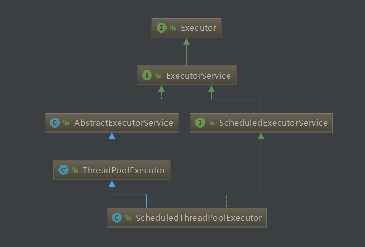

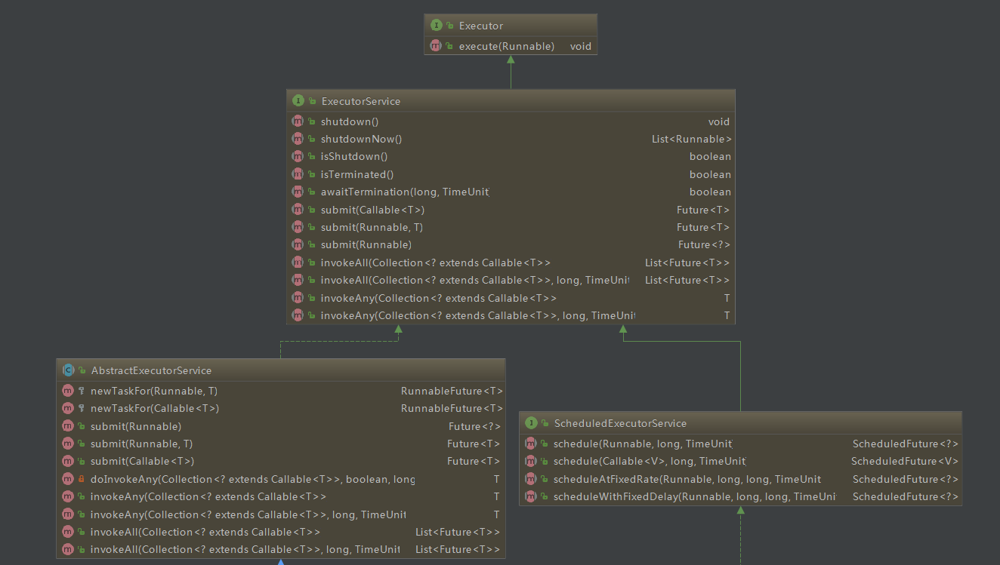


## 1、ThreadPoolExecutor

基本参数：

```java
public class ThreadPoolExecutor extends AbstractExecutorService {

private final AtomicInteger ctl = new AtomicInteger(ctlOf(RUNNING, 0));
private static final int COUNT_BITS = Integer.SIZE - 3;
private static final int CAPACITY   = (1 << COUNT_BITS) - 1;

// runState is stored in the high-order bits  线程池状态
private static final int RUNNING    = -1 << COUNT_BITS;
private static final int SHUTDOWN   =  0 << COUNT_BITS;
private static final int STOP       =  1 << COUNT_BITS;
private static final int TIDYING    =  2 << COUNT_BITS;
private static final int TERMINATED =  3 << COUNT_BITS;


// Packing and unpacking ctl
private static int runStateOf(int c)     { return c & ~CAPACITY; }
private static int workerCountOf(int c)  { return c & CAPACITY; }
private static int ctlOf(int rs, int wc) { return rs | wc; }


//任务的阻塞队列
private final BlockingQueue<Runnable> workQueue;
//重入锁，更新核心线程池大小、最大线程池大小时要加锁
private final ReentrantLock mainLock = new ReentrantLock();
//重入锁状态
private final Condition termination = mainLock.newCondition();
//工作线程set集合
private final HashSet<Worker> workers = new HashSet<Worker>();
//空闲线程存活时长
private volatile long  keepAliveTime;
//核心线程池大小 
private volatile int   corePoolSize;
//最大线程池大小 
private volatile int   maximumPoolSize;
//当前线程池在运行线程大小 
private volatile int   poolSize;
//当缓冲队列也放不下线程时的拒绝策略
private volatile RejectedExecutionHandler handler;
//线程工厂，用来创建线程
private volatile ThreadFactory threadFactory;   
//用来记录线程池中曾经出现过的最大线程数
private int largestPoolSize;   
//用来记录已经执行完毕的任务个数
private long completedTaskCount;   

................

//多个构造函数，最后都是调用这个参数最全的来实例化。初始化6个参数变量，其他keepAliveTime和unit合为一个
public ThreadPoolExecutor(int corePoolSize,
                              int maximumPoolSize,
                              long keepAliveTime,
                              TimeUnit unit,
                              BlockingQueue<Runnable> workQueue,
                              ThreadFactory threadFactory,
                              RejectedExecutionHandler handler) {
        if (corePoolSize < 0 ||
            maximumPoolSize <= 0 ||
            maximumPoolSize < corePoolSize ||
            keepAliveTime < 0)
            throw new IllegalArgumentException();
        if (workQueue == null || threadFactory == null || handler == null)
            throw new NullPointerException();
        this.acc = System.getSecurityManager() == null ?
                null :
                AccessController.getContext();
        this.corePoolSize = corePoolSize;
        this.maximumPoolSize = maximumPoolSize;
        this.workQueue = workQueue;
        this.keepAliveTime = unit.toNanos(keepAliveTime);
        this.threadFactory = threadFactory;
        this.handler = handler;
}

}
```
    


# 99、参考

- [编程思想之多线程与多进程(1)——以操作系统的角度述说线程与进程](https://blog.csdn.net/luoweifu/article/details/46595285)

- [深入理解Java线程池：ThreadPoolExecutor](https://www.cnblogs.com/liuzhihu/p/8177371.html)

- [深入理解java线程池—ThreadPoolExecutor](https://www.jianshu.com/p/ade771d2c9c0)

- [Java并发编程与技术内幕:线程池深入理解](https://blog.csdn.net/evankaka/article/details/51489322)  


