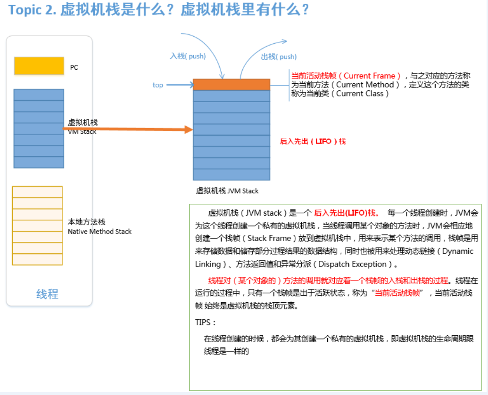

<!-- TOC -->

- [1.JVM运行时数据区里有什么？](#1jvm运行时数据区里有什么)
- [2. 虚拟机栈是什么？虚拟机栈里有什么？](#2-虚拟机栈是什么虚拟机栈里有什么)
- [3. 栈帧是什么？栈帧里有什么？](#3-栈帧是什么栈帧里有什么)
- [4. 方法区是什么？方法区里有什么？](#4-方法区是什么方法区里有什么)
- [参考](#参考)

<!-- /TOC -->

JVM运行时数据区(JVM Runtime Area)其实就是指JVM在运行期间，其对计算机内存空间的划分和分配。

备注：[方法区类的存储方式]
- 1、引导类加载器将类信息加载到方法区中，以特定方式组织，对于某一个特定的类而言，
在方法区中它应该有 [运行时常量池]、[类型信息]、[字段信息]、[方法信息]、[类加载器的引用]，对应class实例的引用等信息;
- 2、类加载器的引用,由于这些类是由引导类加载器(Bootstrap Classloader)进行加载的，而 引导类加载器是有C++语言实现的，所以是无法访问的，故而该引用为NULL;
- 3、对应class实例的引用， 类加载器在加载类信息放到方法区中后，会创建一个对应的Class 类型的实例放到堆(Heap)中, 作为开发人员访问方法区中类定义的入口和切入点;

# 1.JVM运行时数据区里有什么？

> 分为以下五类 

- 方法区
- 堆
- 虚拟机栈
- 本地方法栈
- pc计数器

# 2. 虚拟机栈是什么？虚拟机栈里有什么？

# 3. 栈帧是什么？栈帧里有什么？

# 4. 方法区是什么？方法区里有什么？

# 参考

- [《Java虚拟机原理图解》3、JVM运行时数据区](https://blog.csdn.net/luanlouis/article/details/40043991)