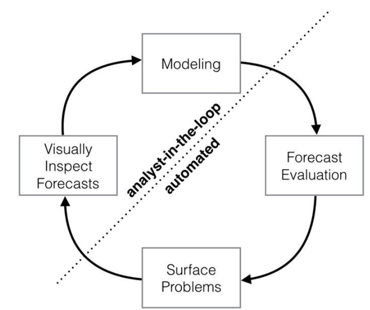
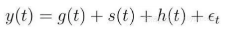
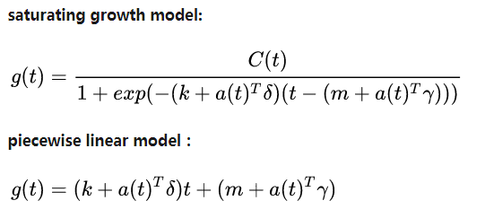
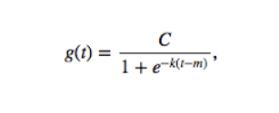
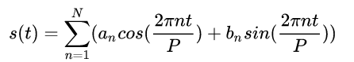
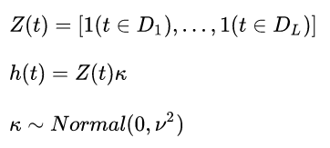
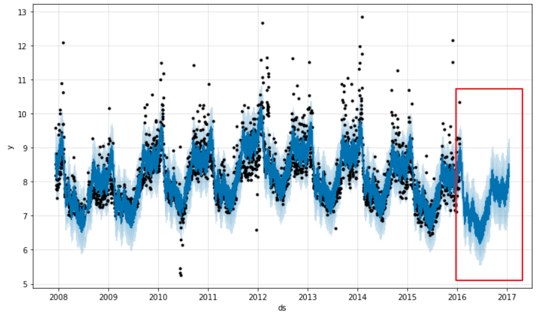
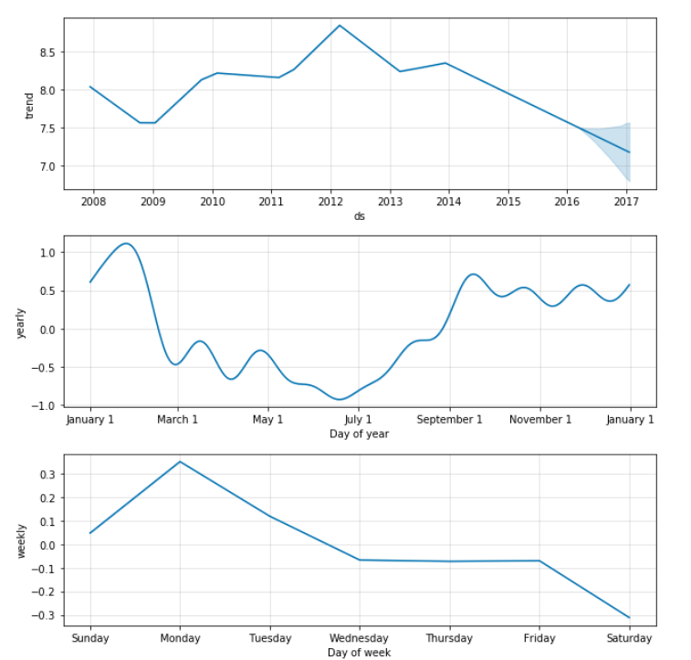
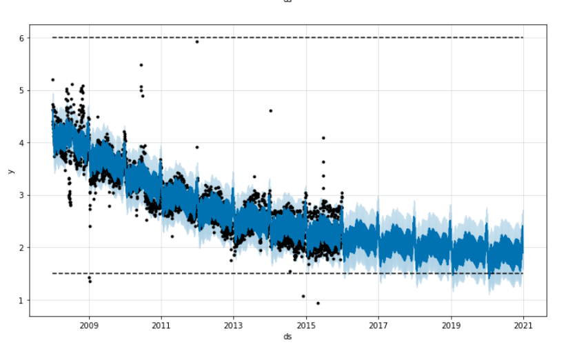
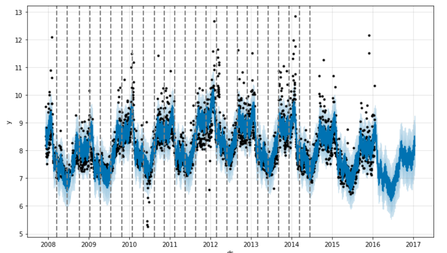

<!-- TOC -->

- [1、概念](#1概念)
- [2、适用范围](#2适用范围)
- [3、原理](#3原理)
    - [1、模型结构](#1模型结构)
        - [1、趋势模型](#1趋势模型)
        - [2、周期模型](#2周期模型)
        - [3、节假日与突发事件模型](#3节假日与突发事件模型)
- [4、demo学习](#4demo学习)
    - [1、快速入门](#1快速入门)
    - [2、prophet Saturating Forecasts饱和预测例子](#2prophet-saturating-forecasts饱和预测例子)
    - [3、prophet Trend Changepoints趋势变化点](#3prophet-trend-changepoints趋势变化点)
    - [4、prophet Seasonality, Holiday Effects, And Regressors季节性，假日效应和回归](#4prophet-seasonality-holiday-effects-and-regressors季节性假日效应和回归)
        - [1、假期和特殊事件建模](#1假期和特殊事件建模)
        - [2、内置国家假期](#2内置国家假期)
        - [3、季节性的傅立叶级数](#3季节性的傅立叶级数)
        - [4、指定自定义季节性](#4指定自定义季节性)
- [参考](#参考)

<!-- /TOC -->


# 1、概念

`Prophet 时间序列预测库`

Prophet英文单词， 发音[prɑːfɪt],名词，作名词时意思是“先知；预言者；提倡者”。

时间序列特征：、趋势性、多种周期性节假日效应，以及部分异常值。


2017年2月24号facebook开源了时间序列预测框架prophet，目前支持R语言和python语言。托管在github上：https://github.com/facebookincubator/prophet

prophet是基于可分解（趋势+季节+节假日）模型的开源库，Prophet充分的将业务背景知识和统计知识融合起来，它让我们可以用简单直观的参数进行高精度的时间序列预测，并且支持自定义季节和节假日的影响。官方号称“让普通人也能像数据分析师一样得出专业的结论”。


# 2、适用范围

Prophet适用于有如下特征的业务问题：

- a.有至少几个月（最好是一年）的每小时、每天或每周观察的历史数据；

- b.有多种人类规模级别的较强的季节性趋势：每周的一些天和每年的一些时间；

- c.有事先知道的以不定期的间隔发生的重要节假日（比如国庆节）；

- d.缺失的历史数据或较大的异常数据的数量在合理范围内；

- e.有历史趋势的变化（比如因为产品发布）；

- f.对于数据中蕴含的非线性增长的趋势都有一个自然极限或饱和状态。


库存量应该保持在多少？你希望商店的客流量是多少？多少人会乘坐飞机旅游？类似这样待解决的问题都是重要的时间序列问题。


# 3、原理

> 整体框架



上图是prophet的整体框架，整个过程分为四部分：Modeling、Forecast Evaluation、Surface Problems以及Visually Inspect Forecasts。从整体上看，这是一个循环结构，而这个结构又可以根据虚线分为分析师操纵部分与自动化部分，因此，整个过程就是分析师与自动化过程相结合的循环体系，也是一种将问题背景知识与统计分析融合起来的过程，这种结合大大的增加了模型的适用范围，提高了模型的准确性。按照上述的四个部分，prophet的预测过程为：

- a.Modeling：建立时间序列模型。分析师根据预测问题的背景选择一个合适的模型。

- b.Forecast Evaluation：模型评估。根据模型对历史数据进行仿真，在模型的参数不确定的情况下，我们可以进行多种尝试，并根据对应的仿真效果评估哪种模型更适合。

- c.Surface Problems：呈现问题。如果尝试了多种参数后，模型的整体表现依然不理想，这个时候可以将误差较大的潜在原因呈现给分析师。

- d.Visually Inspect Forecasts：以可视化的方式反馈整个预测结果。当问题反馈给分析师后，分析师考虑是否进一步调整和构建模型。


## 1、模型结构

时间序列模型可分解为三个主要组成部分：趋势，季节性和节假日。它们按如下公式组合：



- g(t)是growth趋势项：用于拟合时间序列中的分段线性增长或逻辑增长等非周期变化。

- s(t)是seasonality季节性项：周期变化（如：每周/每年的季节性）。

- h(t)是holidays节假日项：非规律性的节假日效应（用户造成）。

- et是误差项并且服从正态分布：误差项用来反映未在模型中体现的异常变动。


### 1、趋势模型

prophet里使用了两种趋势模型：饱和增长模型（saturating growth model）和分段线性模型（piecewise linear model）。两种模型都包含了不同程度的假设和一些调节光滑度的参数，并通过选择变化点（changepoints）来预测趋势变化。具体推导就不写了，只写下最终形式：




非线性饱和增长。它可以用逻辑增长模型简化表示：




其中：
- C是承载量（曲线的最大值）
- k是增长率（曲线的“陡峭程度”）
- m是偏置参数

这一逻辑回归等式可供建模非线性饱和增长，`即数值的增长率随增长而下降`。一个典型的例子是应用或网站的`用户增长`。

C和k实际上不一定是常量，可能随着时间而发生变动。Prophet支持自动和手动调整这两个参数，既可以通过拟合提供的历史数据自行选择最佳的趋势改变点，也可以让分析师手动指定增长率和承载量变动的时间点。

第二种趋势模型是增长率恒定的简单分段线性模型，最适合不存在饱和的线性增长。


### 2、周期模型

prophet用傅里叶级数（Fourier series）来建立周期模型：



对N的调节起到了低通滤波（low-pass filter）的作用。作者说对于年周期与星期周期，N分别选取为10和3的效果比较好。


### 3、节假日与突发事件模型

节假日需要用户事先指定，每一个节假日都包含其前后的若干天。模型形式如下（感觉就是一个虚拟变量）：




# 4、demo学习

下面实例的数据使用的是佩顿 · 曼宁(前美式橄榄球四分卫)的维基百科主页上每日访问量(取对数)的时间序列数据(2007/12/10 - 2016/01/20)。这个数据集具有多季节周期性、不断变化的增长率和可以拟合特定日期(例如佩顿 · 曼宁的季后赛和超级碗)等 。

## 1、快速入门

```python
import warnings
warnings.filterwarnings('ignore')# 忽略告警
import pandas as pd
from fbprophet import Prophet
from pandas.plotting import register_matplotlib_converters
import matplotlib.pyplot as plt
plt.switch_backend('TkAgg')
%matplotlib inline # 在jupyter中内联画图，可以解决在pycharm或者直接执行画图闪现问题
 
def main():
    ## 导入数据
    df = pd.read_csv('D:\\opencode\\prophet\\examples\\example_wp_log_peyton_manning.csv')
    ## 输出前6行
    """
     ds         y
    0  2007-12-10  9.590761
    1  2007-12-11  8.519590
    2  2007-12-12  8.183677
    3  2007-12-13  8.072467
    4  2007-12-14  7.893572
    """
    print(df.head()) 
    ## 实例化一个Prophet对象来拟合模型。预测过程的任何设置都将传递给构造函数
    m = Prophet()
    ## 调用它的fit方法并传入数据
    m.fit(df)
    ## 然后在dataframe(上面df)上进行预测，dataframe包含要进行预测的日期，按你希望预测的天数，将数据延伸(原数据是2007-12-10到2016-01-20，配置了365后数据延申至2017-01-19)。可以通过使用Prophet.make_future_dataframe方法指定天数。所以后推一年后ds最大为2017-01-19
    future = m.make_future_dataframe(periods=365)
    print(future.tail())
    """
                ds
    3265 2017-01-15
    3266 2017-01-16
    3267 2017-01-17
    3268 2017-01-18
    3269 2017-01-19
    """
    ## predict方法将通过future变量为每个行指定一个名为yhat的预测值。forecast对象是一个新的dataframe，其中包含一个名为yhat的预测列，以及预测的上下边界"yhat_upper"、"yhat_lower"
    forecast = m.predict(future)
    print(forecast[['ds', 'yhat', 'yhat_lower', 'yhat_upper']].tail())
    """
            ds      yhat  yhat_lower  yhat_upper
    3265 2017-01-15  8.203217    7.535460    8.899031
    3266 2017-01-16  8.528203    7.798425    9.260266
    3267 2017-01-17  8.315601    7.589142    9.104590
    3268 2017-01-18  8.148207    7.453595    8.891715
    3269 2017-01-19  8.160103    7.438815    8.913281
    """

    register_matplotlib_converters()
    ## 整体的预测结果图，它包含了从历史数据的时间起点到期望预测的未来时间终点的结果
    fig1 = m.plot(forecast)
    fig1.show()
    ## 预测组件。默认情况下，有trend，yearly和weekly图
    fig2 = m.plot_components(forecast)
    fig2.show()
 
 
if __name__ == "__main__":
    main()
```

备注：如果有下面的错误需要添加代码在开头

```
UserWarning: matplotlib is currently using a non-GUI backend, so cannot show the figure
  "matplotlib is currently using a non-GUI backend, "
```

解决方案：

```
import matplotlib.pyplot as plt
plt.switch_backend('TkAgg')
```







## 2、prophet Saturating Forecasts饱和预测例子


默认情况下，Prophet 使用线性模型来预测，在预测增长时，通常会出现最大可达点，例如总市场规模，总人口数等。这被称为承载能力，预测应该在这一点上饱和。

Prophet允许使用具有指定承载能力的逻辑增长模型(logistic growth)进行预测。以下使用维基百科上R语言访问量(取对数)的数据。

```python
import warnings
warnings.filterwarnings('ignore')
import pandas as pd
from fbprophet import Prophet
from pandas.plotting import register_matplotlib_converters
%matplotlib inline

def main():
    df = pd.read_csv('D:\\opencode\\prophet\\examples\\example_wp_log_R.csv')
    # 使用该模型，必须指定承载能力即：cap，必须在一个新的列上指明.需要注意的是，cap必须为dataframe的每一行指定，cap 列的值不一定是常数，因为如果市场规模在增长，那么cap 可能也会增长。
    df['cap'] = 8.5
    # 传递一个额外的参数growth='logistic'来指定 logistic growth
    m = Prophet(growth='logistic')
    m.fit(df)

    register_matplotlib_converters()
    # 预测未来3年
    future = m.make_future_dataframe(periods=1826)
    future['cap'] = 8.5
    fcst = m.predict(future)
    fig = m.plot(fcst)
    fig.show()

    df['y'] = 10 - df['y']
    df['cap'] = 6
    df['floor'] = 1.5
    future['cap'] = 6
    future['floor'] = 1.5
    m = Prophet(growth='logistic')
    m.fit(df)
    fcst = m.predict(future)
    fig = m.plot(fcst)
    fig.show()


if __name__ == "__main__":
    main()

```


logistic函数的隐式最小值为0，并且在0处饱和，就像在cap（8.5）处饱和一样。也可以指定不同的饱和最小值。




使用具有饱和最小值的logistic growth trend，还必须指定最大cap

## 3、prophet Trend Changepoints趋势变化点


时间序列经常会在其轨迹中发生突然变化。默认情况下，Prophet将自动检测这些变化点，并允许适当调整。但是，如果你希望更好地控制此过程（例如，Prophet忽略了一个趋势速率变化，或者在历史数据中的速率变化过拟合），那么你可以使用以下几个输入参数。

```python
# encoding: utf-8
import pandas as pd
from fbprophet import Prophet
from pandas.plotting import register_matplotlib_converters
from fbprophet.plot import add_changepoints_to_plot
from matplotlib import pyplot as plt
import warnings
warnings.filterwarnings('ignore')
%matplotlib inline
 
 
def main():
    df = pd.read_csv('D:\\opencode\\prophet\\examples\\example_wp_log_peyton_manning.csv')
    m = Prophet()
    m.fit(df)
    future = m.make_future_dataframe(periods=366)
    forecast = m.predict(future)
    fig = m.plot(forecast)
    for cp in m.changepoints:
        print(cp)
        plt.axvline(cp, c='gray', ls='--', lw=2)
    # 图1
    plt.show()
 
    # 尽管我们有很多地方速率可能会改变，但由于稀疏先验，大多数这些变化点都未被使用。我们可以通过绘制每个变化点的速率变化幅度来看到这一点
    deltas = m.params['delta'].mean(0)
    fig = plt.figure(facecolor='w', figsize=(10, 6))
    ax = fig.add_subplot(111)
    ax.bar(range(len(deltas)), deltas, facecolor='#0072B2', edgecolor='#0072B2')
    ax.grid(True, which='major', c='gray', ls='-', lw=1, alpha=0.2)
    ax.set_ylabel('Rate change')
    ax.set_xlabel('Potential changepoint')
    fig.tight_layout()
    # 图2
    fig.show()
 
    # 可以使用参数n_changepoints设置潜在变更点的数量，但通过调整正则化可以更好地进行调整。可以通过以下方式显示表示变更点的位置。默认情况下，只有前80%的时间序列才会推断出变化点，以便有足够的跑道来预测趋势的前进方向，并避免在时间序列结束时过度拟合波动。此默认值适用于许多情况，但不适用于所有情况，可以使用changepoint_range参数进行更改。例如，在python通过m = Prophet(changepoint_range=0.9) 或者在R语言中通过m <- prophet(changepoint.range = 0.9)，来将潜在的变化点放在时间序列前90％中。
    fig = m.plot(forecast)
    a = add_changepoints_to_plot(fig.gca(), m, forecast)
    # 图3
    fig.show()
 

    # 如果趋势变化过度拟合（灵活性太大）或不足（灵活性不够），可以使用输入参数changepoint_prior_scale调整稀疏先验的强度。默认情况下，此参数设置为0.05。增加它将使趋势更加灵活
    m = Prophet(changepoint_prior_scale=0.5)
    forecast = m.fit(df).predict(future)
    fig = m.plot(forecast)
    # 图4
    fig.show()
 
    # 减少它会使趋势不那么灵活
    m = Prophet(changepoint_prior_scale=0.001)
    forecast = m.fit(df).predict(future)
    fig = m.plot(forecast)
    # 图5
    fig.show()
 
    # 如果愿意，可以使用changepoints参数手动指定潜在变化点的位置，而不是使用自动变化点检测。然后只允许在这些点上进行斜度变化，并像以前一样进行稀疏正则化。例如，可以像自动创建那样创建一个点网格，但随后用一些已知可能有变化的特定日期来扩充该网格。作为另一个例子，变化点可以完全限于一小组日期，如下所示
    m = Prophet(changepoints=['2014-01-01'])
    forecast = m.fit(df).predict(future)
    fig = m.plot(forecast)
    # 图6
    fig.show()
 
 
if __name__ == "__main__":
    main()
```




Prophet 首先指定大量可以更改速率的潜在变更点来检测变化点。然后它在速率变化的幅度上进行稀疏先验（相当于L1正则化） - 这实质上意味着Prophet 有大量可能发生变化的地方，但尽可能少地使用它们。以下使用快速入门中的Peyton Manning维基页面访问数预测的例子。默认情况下，Prophet指定25个潜在变化点，这些变化更点均匀放置在前80％的时间序列中。此图中的垂直线表示潜在变化点的放置位置


## 4、prophet Seasonality, Holiday Effects, And Regressors季节性，假日效应和回归


```python
from fbprophet import Prophet
import pandas as pd
import logging
import warnings
from fbprophet.plot import plot_yearly
import matplotlib.pyplot as plt
import warnings
warnings.filterwarnings('ignore')
%matplotlib inline

def main():
    logging.getLogger('fbprophet').setLevel(logging.ERROR)
    warnings.filterwarnings("ignore")
    df = pd.read_csv('D:\\opencode\\prophet\\examples\\example_wp_log_peyton_manning.csv')
    m = Prophet()
    m.fit(df)
    future = m.make_future_dataframe(periods=366)
    # 假期和特殊事件建模
    playoffs = pd.DataFrame({
        'holiday': 'playoff',
        'ds': pd.to_datetime(['2008-01-13', '2009-01-03', '2010-01-16',
                              '2010-01-24', '2010-02-07', '2011-01-08',
                              '2013-01-12', '2014-01-12', '2014-01-19',
                              '2014-02-02', '2015-01-11', '2016-01-17',
                              '2016-01-24', '2016-02-07']),
        'lower_window': 0,
        'upper_window': 1,
    })
    superbowls = pd.DataFrame({
        'holiday': 'superbowl',
        'ds': pd.to_datetime(['2010-02-07', '2014-02-02', '2016-02-07']),
        'lower_window': 0,
        'upper_window': 1,
    })
    holidays = pd.concat((playoffs, superbowls))
    m = Prophet(holidays=holidays)
    forecast = m.fit(df).predict(future)

    print(forecast[(forecast['playoff'] + forecast['superbowl']).abs() > 0][
              ['ds', 'playoff', 'superbowl']][-10:])

    fig = m.plot_components(forecast)
    fig.show()

    # 内置国家假期
    m = Prophet(holidays=holidays)
    m.add_country_holidays(country_name='US')
    m.fit(df)
    print(m.train_holiday_names)

    forecast = m.predict(future)
    fig = m.plot_components(forecast)
    fig.show()

    # 季节性的傅立叶级数
    m = Prophet().fit(df)
    a = plot_yearly(m)
    plt.show()
    m = Prophet(yearly_seasonality=20).fit(df)
    a = plot_yearly(m)
    plt.show()

    # 指定自定义季节性
    m = Prophet(weekly_seasonality=False)
    m.add_seasonality(name='monthly', period=30.5, fourier_order=5)
    forecast = m.fit(df).predict(future)
    fig = m.plot_components(forecast)
    fig.show()

    # 季节性取决于其他因素
    def is_nfl_season(ds):
        date = pd.to_datetime(ds)
        return (date.month > 8 or date.month < 2)

    df['on_season'] = df['ds'].apply(is_nfl_season)
    df['off_season'] = ~df['ds'].apply(is_nfl_season)

    m = Prophet(weekly_seasonality=False)
    m.add_seasonality(name='weekly_on_season', period=7, fourier_order=3, condition_name='on_season')
    m.add_seasonality(name='weekly_off_season', period=7, fourier_order=3, condition_name='off_season')

    future['on_season'] = future['ds'].apply(is_nfl_season)
    future['off_season'] = ~future['ds'].apply(is_nfl_season)
    forecast = m.fit(df).predict(future)
    fig = m.plot_components(forecast)
    fig.show()

    # 节假日和季节性的先验scale
    m = Prophet(holidays=holidays, holidays_prior_scale=0.05).fit(df)
    forecast = m.predict(future)
    print(forecast[(forecast['playoff'] + forecast['superbowl']).abs() > 0][
              ['ds', 'playoff', 'superbowl']][-10:])
    m = Prophet()
    m.add_seasonality(
        name='weekly', period=7, fourier_order=3, prior_scale=0.1)

    # 额外回归量
    def nfl_sunday(ds):
        date = pd.to_datetime(ds)
        if date.weekday() == 6 and (date.month > 8 or date.month < 2):
            return 1
        else:
            return 0

    df['nfl_sunday'] = df['ds'].apply(nfl_sunday)

    m = Prophet()
    m.add_regressor('nfl_sunday')
    m.fit(df)

    future['nfl_sunday'] = future['ds'].apply(nfl_sunday)

    forecast = m.predict(future)
    fig = m.plot_components(forecast)
    fig.show()


if __name__ == "__main__":
    main()


```


备注：国家日期哪里报错（AttributeError: 'Prophet' object has no attribute 'add_country_holidays'），其他正常。

### 1、假期和特殊事件建模


如果有假期或其他想要建模的重复事件，则必须为它们创建dataframe。对于dataframe，每个假期一行有两列（holiday节假日和ds日期戳）。它必须包括所有出现的假期，包括过去（历史数据），以及将来（待预测的时间）。如果假期没出现在待预测的时间里，那么Prophet 不会其包含在预测中。

dataframe还可以包括lower_window和upper_window两列，它们将假日扩展到该日期的前后[Lower_Window，Upper_Window]天。例如，如果你想在圣诞节之外加上平安夜，那么就lower_window=-1,upper_window=0这样设置。如果你想在感恩节之外加上黑色星期五，那么就lower_window=0,upper_window=1这样设置。还可以包含一个prior_scale 列，以便为每个假日分别设置先前的比例。


### 2、内置国家假期

可以使用add_country_holidays方法设置内置的国家/地区特定假日集合。通过country_name指定国家/地区的名称，然后在上述holidays 参数指定的假日外，将包含该国家主要假日


### 3、季节性的傅立叶级数

使用傅里叶级数的部分和来估计季节性。增加傅里叶项的数量可以使季节性拟合更快的变化周期，但也可能导致过度拟合：N个傅里叶项对应于用于建模周期的2N变量


### 4、指定自定义季节性

如果时间序列长度超过两个周期，Prophet将默认拟合每周和每年的季节性。对于每日一次的时间序列，将拟合每日季节性。可以使用add_seasonality方法添加其他季节性（每月，每季度，每小时）。

此函数的输入是名称，季节性的周期，以及季节性的傅里叶级数。作为参考，默认情况下，Prophet对于每周季节性的傅立叶级数为3，每年季节性使用10次。可选输入add_seasonality为季节性组件的先验scale - 这将在下面讨论。

作为一个例子，这里我们拟合来自快速入门例子的Peyton Manning数据，但用每月季节性取代每周季节性。月度季节性将出现在组件图中：


# 参考

- [时间序列模型Prophet使用详细讲解](https://blog.csdn.net/anshuai_aw1/article/details/83412058)

- [prophet](https://facebook.github.io/prophet/)

- [如何评价facebook开源的prophet时间序列预测工具?](https://www.zhihu.com/question/56585493)

- [python-fbprophet总结](https://blog.csdn.net/qq_23860475/article/details/81354467)


- [Windows下安装Python版本的prophet](https://blog.csdn.net/anshuai_aw1/article/details/83377735)


- [prophet快速开发教程](https://blog.csdn.net/qq_33873431/article/details/90064945)

- [机器学习开放课程（终）：基于Facebook Prophet预测未来](https://zhuanlan.zhihu.com/p/50288194)

- [topic9_part2_facebook_prophet](https://github.com/Yorko/mlcourse.ai/blob/master/jupyter_english/topic09_time_series/topic9_part2_facebook_prophet.ipynb)


- [github机器学习课程](https://github.com/lishuai2016/mlcourse.ai)


