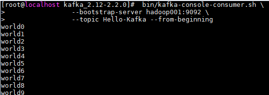

<!-- TOC -->

- [示例](#示例)
    - [1、生产者示例](#1生产者示例)
        - [1 项目依赖](#1-项目依赖)
        - [2 创建生产者](#2-创建生产者)
        - [3 测试](#3-测试)
            - [1. 启动Kakfa](#1-启动kakfa)
            - [2. 创建topic](#2-创建topic)
            - [3. 启动消费者](#3-启动消费者)
            - [4. 运行项目](#4-运行项目)
        - [4 可能出现的问题](#4-可能出现的问题)
        - [5 发送消息](#5-发送消息)
            - [1 同步发送](#1-同步发送)
            - [2 异步发送](#2-异步发送)
        - [6 自定义分区器](#6-自定义分区器)
            - [1 自定义分区器](#1-自定义分区器)
            - [2 测试](#2-测试)
        - [7 生产者其他属性](#7-生产者其他属性)
            - [1. acks](#1-acks)
            - [2. buffer.memory](#2-buffermemory)
            - [3. compression.type](#3-compressiontype)
            - [4. retries](#4-retries)
            - [5. batch.size](#5-batchsize)
            - [6. linger.ms](#6-lingerms)
            - [7. clent.id](#7-clentid)
            - [8. max.in.flight.requests.per.connection](#8-maxinflightrequestsperconnection)
            - [9. timeout.ms, request.timeout.ms & metadata.fetch.timeout.ms](#9-timeoutms-requesttimeoutms--metadatafetchtimeoutms)
            - [10. max.block.ms](#10-maxblockms)
            - [11. max.request.size](#11-maxrequestsize)
            - [12. receive.buffer.bytes & send.buffer.byte](#12-receivebufferbytes--sendbufferbyte)
    - [2、消费者示例](#2消费者示例)
        - [1、创建Kafka消费者](#1创建kafka消费者)
        - [2、提交偏移量](#2提交偏移量)
            - [1、偏移量的重要性](#1偏移量的重要性)
            - [2、自动提交偏移量](#2自动提交偏移量)
            - [3、手动提交偏移量](#3手动提交偏移量)
                - [1 同步提交](#1-同步提交)
                - [2 异步提交](#2-异步提交)
                - [3  同步加异步提交](#3--同步加异步提交)
                - [4 提交特定偏移量](#4-提交特定偏移量)
        - [3、监听分区再均衡](#3监听分区再均衡)
        - [4、退出轮询](#4退出轮询)
        - [5、独立的消费者](#5独立的消费者)
        - [6、Kafka消费者可选属性](#6kafka消费者可选属性)
            - [1. fetch.min.byte](#1-fetchminbyte)
            - [2. fetch.max.wait.ms](#2-fetchmaxwaitms)
            - [3. max.partition.fetch.bytes](#3-maxpartitionfetchbytes)
            - [4. session.timeout.ms](#4-sessiontimeoutms)
            - [5. auto.offset.reset](#5-autooffsetreset)
            - [6. enable.auto.commit](#6-enableautocommit)
            - [7. client.id](#7-clientid)
            - [8. max.poll.records](#8-maxpollrecords)
            - [9. receive.buffer.bytes & send.buffer.byte](#9-receivebufferbytes--sendbufferbyte)

<!-- /TOC -->


# 示例

## 1、生产者示例

### 1 项目依赖

本项目采用 Maven 构建，想要调用 Kafka 生产者 API，需要导入 `kafka-clients` 依赖，如下：

```xml
<dependency>
    <groupId>org.apache.kafka</groupId>
    <artifactId>kafka-clients</artifactId>
    <version>2.2.0</version>
</dependency>
```

### 2 创建生产者

创建 Kafka 生产者时，以下三个属性是必须指定的：

+ **bootstrap.servers** ：指定 broker 的地址清单，清单里不需要包含所有的 broker 地址，生产者会从给定的 broker 里查找 broker 的信息。不过建议至少要提供两个 broker 的信息作为容错；
+ **key.serializer** ：指定键的序列化器；
+ **value.serializer** ：指定值的序列化器。

创建的示例代码如下：

```scala
public class SimpleProducer {

    public static void main(String[] args) {

        String topicName = "Hello-Kafka";

        Properties props = new Properties();
        props.put("bootstrap.servers", "hadoop001:9092");
        props.put("key.serializer", "org.apache.kafka.common.serialization.StringSerializer");
        props.put("value.serializer", "org.apache.kafka.common.serialization.StringSerializer");
        /*创建生产者*/
        Producer<String, String> producer = new KafkaProducer<>(props);

        for (int i = 0; i < 10; i++) {
            ProducerRecord<String, String> record = new ProducerRecord<>(topicName, "hello" + i, 
                                                                         "world" + i);
            /* 发送消息*/
            producer.send(record);
        }
        /*关闭生产者*/
        producer.close();
    }
}
```

> 本篇文章的所有示例代码可以从 Github 上进行下载：[kafka-basis](https://github.com/heibaiying/BigData-Notes/tree/master/code/Kafka/kafka-basis)

### 3 测试

#### 1. 启动Kakfa

Kafka 的运行依赖于 zookeeper，需要预先启动，可以启动 Kafka 内置的 zookeeper，也可以启动自己安装的：

```shell
# zookeeper启动命令
bin/zkServer.sh start

# 内置zookeeper启动命令
bin/zookeeper-server-start.sh config/zookeeper.properties
```

启动单节点 kafka 用于测试：

```shell
# bin/kafka-server-start.sh config/server.properties
```

#### 2. 创建topic

```shell
# 创建用于测试主题
bin/kafka-topics.sh --create \
                    --bootstrap-server hadoop001:9092 \
                     --replication-factor 1 --partitions 1 \
                     --topic Hello-Kafka

# 查看所有主题
 bin/kafka-topics.sh --list --bootstrap-server hadoop001:9092
```

#### 3. 启动消费者

 启动一个控制台消费者用于观察写入情况，启动命令如下：

```shell
# bin/kafka-console-consumer.sh --bootstrap-server hadoop001:9092 --topic Hello-Kafka --from-beginning
```

#### 4. 运行项目

此时可以看到消费者控制台，输出如下，这里 `kafka-console-consumer` 只会打印出值信息，不会打印出键信息。




### 4 可能出现的问题

在这里可能出现的一个问题是：生产者程序在启动后，一直处于等待状态。这通常出现在你使用默认配置启动 Kafka 的情况下，此时需要对 `server.properties` 文件中的 `listeners` 配置进行更改：

```shell
# hadoop001 为我启动kafka服务的主机名，你可以换成自己的主机名或者ip地址
listeners=PLAINTEXT://hadoop001:9092
```


### 5 发送消息

上面的示例程序调用了 `send` 方法发送消息后没有做任何操作，在这种情况下，我们没有办法知道消息发送的结果。想要知道消息发送的结果，可以使用同步发送或者异步发送来实现。

#### 1 同步发送

在调用 `send` 方法后可以接着调用 `get()` 方法，`send` 方法的返回值是一个 Future\<RecordMetadata>对象，RecordMetadata 里面包含了发送消息的主题、分区、偏移量等信息。改写后的代码如下：

```scala
for (int i = 0; i < 10; i++) {
    try {
        ProducerRecord<String, String> record = new ProducerRecord<>(topicName, "k" + i, "world" + i);
        /*同步发送消息*/
        RecordMetadata metadata = producer.send(record).get();
        System.out.printf("topic=%s, partition=%d, offset=%s \n",
                metadata.topic(), metadata.partition(), metadata.offset());
    } catch (InterruptedException | ExecutionException e) {
        e.printStackTrace();
    }
}
```

此时得到的输出如下：偏移量和调用次数有关，所有记录都分配到了 0 分区，这是因为在创建 `Hello-Kafka` 主题时候，使用 `--partitions` 指定其分区数为 1，即只有一个分区。

```shell
topic=Hello-Kafka, partition=0, offset=40 
topic=Hello-Kafka, partition=0, offset=41 
topic=Hello-Kafka, partition=0, offset=42 
topic=Hello-Kafka, partition=0, offset=43 
topic=Hello-Kafka, partition=0, offset=44 
topic=Hello-Kafka, partition=0, offset=45 
topic=Hello-Kafka, partition=0, offset=46 
topic=Hello-Kafka, partition=0, offset=47 
topic=Hello-Kafka, partition=0, offset=48 
topic=Hello-Kafka, partition=0, offset=49 
```

#### 2 异步发送

通常我们并不关心发送成功的情况，更多关注的是失败的情况，因此 Kafka 提供了异步发送和回调函数。 代码如下：

```scala
for (int i = 0; i < 10; i++) {
    ProducerRecord<String, String> record = new ProducerRecord<>(topicName, "k" + i, "world" + i);
    /*异步发送消息，并监听回调*/
    producer.send(record, new Callback() {
        @Override
        public void onCompletion(RecordMetadata metadata, Exception exception) {
            if (exception != null) {
                System.out.println("进行异常处理");
            } else {
                System.out.printf("topic=%s, partition=%d, offset=%s \n",
                        metadata.topic(), metadata.partition(), metadata.offset());
            }
        }
    });
}
```


### 6 自定义分区器

Kafka 有着默认的分区机制：

+ 如果键值为 null， 则使用轮询 (Round Robin) 算法将消息均衡地分布到各个分区上；
+ 如果键值不为 null，那么 Kafka 会使用内置的散列算法对键进行散列，然后分布到各个分区上。

某些情况下，你可能有着自己的分区需求，这时候可以采用自定义分区器实现。这里给出一个自定义分区器的示例：

#### 1 自定义分区器

```java
/**
 * 自定义分区器
 */
public class CustomPartitioner implements Partitioner {

    private int passLine;

    @Override
    public void configure(Map<String, ?> configs) {
        /*从生产者配置中获取分数线*/
        passLine = (Integer) configs.get("pass.line");
    }

    @Override
    public int partition(String topic, Object key, byte[] keyBytes, Object value, 
                         byte[] valueBytes, Cluster cluster) {
        /*key 值为分数，当分数大于分数线时候，分配到 1 分区，否则分配到 0 分区*/
        return (Integer) key >= passLine ? 1 : 0;
    }

    @Override
    public void close() {
        System.out.println("分区器关闭");
    }
}
```

需要在创建生产者时指定分区器，和分区器所需要的配置参数：

```java
public class ProducerWithPartitioner {

    public static void main(String[] args) {

        String topicName = "Kafka-Partitioner-Test";

        Properties props = new Properties();
        props.put("bootstrap.servers", "hadoop001:9092");
        props.put("key.serializer", "org.apache.kafka.common.serialization.IntegerSerializer");
        props.put("value.serializer", "org.apache.kafka.common.serialization.StringSerializer");

        /*传递自定义分区器*/
        props.put("partitioner.class", "com.heibaiying.producers.partitioners.CustomPartitioner");
        /*传递分区器所需的参数*/
        props.put("pass.line", 6);

        Producer<Integer, String> producer = new KafkaProducer<>(props);

        for (int i = 0; i <= 10; i++) {
            String score = "score:" + i;
            ProducerRecord<Integer, String> record = new ProducerRecord<>(topicName, i, score);
            /*异步发送消息*/
            producer.send(record, (metadata, exception) ->
                    System.out.printf("%s, partition=%d, \n", score, metadata.partition()));
        }

        producer.close();
    }
}
```

#### 2 测试

需要创建一个至少有两个分区的主题：

```shell
 bin/kafka-topics.sh --create \
                    --bootstrap-server hadoop001:9092 \
                     --replication-factor 1 --partitions 2 \
                     --topic Kafka-Partitioner-Test
```

此时输入如下，可以看到分数大于等于 6 分的都被分到 1 分区，而小于 6 分的都被分到了 0 分区。

```shell
score:6, partition=1, 
score:7, partition=1, 
score:8, partition=1, 
score:9, partition=1, 
score:10, partition=1, 
score:0, partition=0, 
score:1, partition=0, 
score:2, partition=0, 
score:3, partition=0, 
score:4, partition=0, 
score:5, partition=0, 
分区器关闭
```


### 7 生产者其他属性

上面生产者的创建都仅指定了服务地址，键序列化器、值序列化器，实际上 Kafka 的生产者还有很多可配置属性，如下：

#### 1. acks

acks 参数指定了必须要有多少个分区副本收到消息，生产者才会认为消息写入是成功的：

- **acks=0** ： 消息发送出去就认为已经成功了，不会等待任何来自服务器的响应；
- **acks=1** ： 只要集群的首领节点收到消息，生产者就会收到一个来自服务器成功响应；
- **acks=all** ：只有当所有参与复制的节点全部收到消息时，生产者才会收到一个来自服务器的成功响应。

#### 2. buffer.memory

设置生产者内存缓冲区的大小。

#### 3. compression.type

默认情况下，发送的消息不会被压缩。如果想要进行压缩，可以配置此参数，可选值有 snappy，gzip，lz4。

#### 4. retries

发生错误后，消息重发的次数。如果达到设定值，生产者就会放弃重试并返回错误。

#### 5. batch.size

当有多个消息需要被发送到同一个分区时，生产者会把它们放在同一个批次里。该参数指定了一个批次可以使用的内存大小，按照字节数计算。

#### 6. linger.ms

该参数制定了生产者在发送批次之前等待更多消息加入批次的时间。

#### 7. clent.id

客户端 id,服务器用来识别消息的来源。

#### 8. max.in.flight.requests.per.connection

指定了生产者在收到服务器响应之前可以发送多少个消息。它的值越高，就会占用越多的内存，不过也会提升吞吐量，把它设置为 1 可以保证消息是按照发送的顺序写入服务器，即使发生了重试。

#### 9. timeout.ms, request.timeout.ms & metadata.fetch.timeout.ms

- timeout.ms 指定了 borker 等待同步副本返回消息的确认时间；
- request.timeout.ms 指定了生产者在发送数据时等待服务器返回响应的时间；
- metadata.fetch.timeout.ms 指定了生产者在获取元数据（比如分区首领是谁）时等待服务器返回响应的时间。

#### 10. max.block.ms

指定了在调用 `send()` 方法或使用 `partitionsFor()` 方法获取元数据时生产者的阻塞时间。当生产者的发送缓冲区已满，或者没有可用的元数据时，这些方法会阻塞。在阻塞时间达到 max.block.ms 时，生产者会抛出超时异常。

#### 11. max.request.size

该参数用于控制生产者发送的请求大小。它可以指发送的单个消息的最大值，也可以指单个请求里所有消息总的大小。例如，假设这个值为 1000K ，那么可以发送的单个最大消息为 1000K ，或者生产者可以在单个请求里发送一个批次，该批次包含了 1000 个消息，每个消息大小为 1K。 

#### 12. receive.buffer.bytes & send.buffer.byte

这两个参数分别指定 TCP socket 接收和发送数据包缓冲区的大小，-1 代表使用操作系统的默认值。


## 2、消费者示例

### 1、创建Kafka消费者

在创建消费者的时候以下以下三个选项是必选的：

- **bootstrap.servers** ：指定 broker 的地址清单，清单里不需要包含所有的 broker 地址，生产者会从给定的 broker 里查找 broker 的信息。不过建议至少要提供两个 broker 的信息作为容错；
- **key.deserializer** ：指定键的反序列化器；
- **value.deserializer** ：指定值的反序列化器。

除此之外你还需要指明你需要想订阅的主题，可以使用如下两个 API :

+  **consumer.subscribe(Collection\<String> topics)**  ：指明需要订阅的主题的集合；
+ **consumer.subscribe(Pattern pattern)**  ：使用正则来匹配需要订阅的集合。

最后只需要通过轮询 API(`poll`) 向服务器定时请求数据。一旦消费者订阅了主题，轮询就会处理所有的细节，包括群组协调、分区再均衡、发送心跳和获取数据，这使得开发者只需要关注从分区返回的数据，然后进行业务处理。 示例如下：

```scala
String topic = "Hello-Kafka";
String group = "group1";
Properties props = new Properties();
props.put("bootstrap.servers", "hadoop001:9092");
/*指定分组 ID*/
props.put("group.id", group);
props.put("key.deserializer", "org.apache.kafka.common.serialization.StringDeserializer");
props.put("value.deserializer", "org.apache.kafka.common.serialization.StringDeserializer");
KafkaConsumer<String, String> consumer = new KafkaConsumer<>(props);

/*订阅主题 (s)*/
consumer.subscribe(Collections.singletonList(topic));

try {
    while (true) {
        /*轮询获取数据*/
        ConsumerRecords<String, String> records = consumer.poll(Duration.of(100, ChronoUnit.MILLIS));
        for (ConsumerRecord<String, String> record : records) {
            System.out.printf("topic = %s,partition = %d, key = %s, value = %s, offset = %d,\n",
           record.topic(), record.partition(), record.key(), record.value(), record.offset());
        }
    }
} finally {
    consumer.close();
}
```

> 本篇文章的所有示例代码可以从 Github 上进行下载：[kafka-basis](https://github.com/heibaiying/BigData-Notes/tree/master/code/Kafka/kafka-basis)

### 2、提交偏移量

#### 1、偏移量的重要性

Kafka 的每一条消息都有一个偏移量属性，记录了其在分区中的位置，偏移量是一个单调递增的整数。消费者通过往一个叫作 `＿consumer_offset` 的特殊主题发送消息，消息里包含每个分区的偏移量。 如果消费者一直处于运行状态，那么偏移量就没有
什么用处。不过，如果有消费者退出或者新分区加入，此时就会触发再均衡。完成再均衡之后，每个消费者可能分配到新的分区，而不是之前处理的那个。为了能够继续之前的工作，消费者需要读取每个分区最后一次提交的偏移量，然后从偏移量指定的地方继续处理。 因为这个原因，所以如果不能正确提交偏移量，就可能会导致数据丢失或者重复出现消费，比如下面情况：

+ 如果提交的偏移量小于客户端处理的最后一个消息的偏移量 ，那么处于两个偏移量之间的消息就会被重复消费；
+ 如果提交的偏移量大于客户端处理的最后一个消息的偏移量，那么处于两个偏移量之间的消息将会丢失。

#### 2、自动提交偏移量

Kafka 支持自动提交和手动提交偏移量两种方式。这里先介绍比较简单的自动提交：

只需要将消费者的 `enable.auto.commit` 属性配置为 `true` 即可完成自动提交的配置。 此时每隔固定的时间，消费者就会把 `poll()` 方法接收到的最大偏移量进行提交，提交间隔由 `auto.commit.interval.ms` 属性进行配置，默认值是 5s。

使用自动提交是存在隐患的，假设我们使用默认的 5s 提交时间间隔，在最近一次提交之后的 3s 发生了再均衡，再均衡之后，消费者从最后一次提交的偏移量位置开始读取消息。这个时候偏移量已经落后了 3s ，所以在这 3s 内到达的消息会被重复处理。可以通过修改提交时间间隔来更频繁地提交偏移量，减小可能出现重复消息的时间窗，不过这种情况是无法完全避免的。基于这个原因，Kafka 也提供了手动提交偏移量的 API，使得用户可以更为灵活的提交偏移量。


#### 3、手动提交偏移量

用户可以通过将 `enable.auto.commit` 设为 `false`，然后手动提交偏移量。基于用户需求手动提交偏移量可以分为两大类：

+ 手动提交当前偏移量：即手动提交当前轮询的最大偏移量；
+ 手动提交固定偏移量：即按照业务需求，提交某一个固定的偏移量。

而按照 Kafka API，手动提交偏移量又可以分为同步提交和异步提交。

##### 1 同步提交

通过调用 `consumer.commitSync()` 来进行同步提交，不传递任何参数时提交的是当前轮询的最大偏移量。

```java
while (true) {
    ConsumerRecords<String, String> records = consumer.poll(Duration.of(100, ChronoUnit.MILLIS));
    for (ConsumerRecord<String, String> record : records) {
        System.out.println(record);
    }
    /*同步提交*/
    consumer.commitSync();
}
```

如果某个提交失败，同步提交还会进行重试，这可以保证数据能够最大限度提交成功，但是同时也会降低程序的吞吐量。基于这个原因，Kafka 还提供了异步提交的 API。

##### 2 异步提交

异步提交可以提高程序的吞吐量，因为此时你可以尽管请求数据，而不用等待 Broker 的响应。代码如下：

```java
while (true) {
    ConsumerRecords<String, String> records = consumer.poll(Duration.of(100, ChronoUnit.MILLIS));
    for (ConsumerRecord<String, String> record : records) {
        System.out.println(record);
    }
    /*异步提交并定义回调*/
    consumer.commitAsync(new OffsetCommitCallback() {
        @Override
        public void onComplete(Map<TopicPartition, OffsetAndMetadata> offsets, Exception exception) {
          if (exception != null) {
             System.out.println("错误处理");
             offsets.forEach((x, y) -> System.out.printf("topic = %s,partition = %d, offset = %s \n",
                                                            x.topic(), x.partition(), y.offset()));
            }
        }
    });
}
```

异步提交存在的问题是，在提交失败的时候不会进行自动重试，实际上也不能进行自动重试。假设程序同时提交了 200 和 300 的偏移量，此时 200 的偏移量失败的，但是紧随其后的 300 的偏移量成功了，此时如果重试就会存在 200 覆盖 300 偏移量的可能。同步提交就不存在这个问题，因为在同步提交的情况下，300 的提交请求必须等待服务器返回 200 提交请求的成功反馈后才会发出。基于这个原因，某些情况下，需要同时组合同步和异步两种提交方式。

> 注：虽然程序不能在失败时候进行自动重试，但是我们是可以手动进行重试的，你可以通过一个 Map<TopicPartition, Integer> offsets 来维护你提交的每个分区的偏移量，然后当失败时候，你可以判断失败的偏移量是否小于你维护的同主题同分区的最后提交的偏移量，如果小于则代表你已经提交了更大的偏移量请求，此时不需要重试，否则就可以进行手动重试。

##### 3  同步加异步提交

下面这种情况，在正常的轮询中使用异步提交来保证吞吐量，但是因为在最后即将要关闭消费者了，所以此时需要用同步提交来保证最大限度的提交成功。

```scala
try {
    while (true) {
        ConsumerRecords<String, String> records = consumer.poll(Duration.of(100, ChronoUnit.MILLIS));
        for (ConsumerRecord<String, String> record : records) {
            System.out.println(record);
        }
        // 异步提交
        consumer.commitAsync();
    }
} catch (Exception e) {
    e.printStackTrace();
} finally {
    try {
        // 因为即将要关闭消费者，所以要用同步提交保证提交成功
        consumer.commitSync();
    } finally {
        consumer.close();
    }
}
```

##### 4 提交特定偏移量

在上面同步和异步提交的 API 中，实际上我们都没有对 commit 方法传递参数，此时默认提交的是当前轮询的最大偏移量，如果你需要提交特定的偏移量，可以调用它们的重载方法。

```java
/*同步提交特定偏移量*/
commitSync(Map<TopicPartition, OffsetAndMetadata> offsets) 
/*异步提交特定偏移量*/    
commitAsync(Map<TopicPartition, OffsetAndMetadata> offsets, OffsetCommitCallback callback)
```

需要注意的是，因为你可以订阅多个主题，所以 `offsets` 中必须要包含所有主题的每个分区的偏移量，示例代码如下：

```java
try {
    while (true) {
        ConsumerRecords<String, String> records = consumer.poll(Duration.of(100, ChronoUnit.MILLIS));
        for (ConsumerRecord<String, String> record : records) {
            System.out.println(record);
            /*记录每个主题的每个分区的偏移量*/
            TopicPartition topicPartition = new TopicPartition(record.topic(), record.partition());
            OffsetAndMetadata offsetAndMetadata = new OffsetAndMetadata(record.offset()+1, "no metaData");
            /*TopicPartition 重写过 hashCode 和 equals 方法，所以能够保证同一主题和分区的实例不会被重复添加*/
            offsets.put(topicPartition, offsetAndMetadata);
        }
        /*提交特定偏移量*/
        consumer.commitAsync(offsets, null);
    }
} finally {
    consumer.close();
}
```


### 3、监听分区再均衡

因为分区再均衡会导致分区与消费者的重新划分，有时候你可能希望在再均衡前执行一些操作：比如提交已经处理但是尚未提交的偏移量，关闭数据库连接等。此时可以在订阅主题时候，调用 `subscribe` 的重载方法传入自定义的分区再均衡监听器。

```java
 /*订阅指定集合内的所有主题*/
subscribe(Collection<String> topics, ConsumerRebalanceListener listener)
 /*使用正则匹配需要订阅的主题*/    
subscribe(Pattern pattern, ConsumerRebalanceListener listener)    
```

代码示例如下：

```java
Map<TopicPartition, OffsetAndMetadata> offsets = new HashMap<>();

consumer.subscribe(Collections.singletonList(topic), new ConsumerRebalanceListener() {
    /*该方法会在消费者停止读取消息之后，再均衡开始之前就调用*/
    @Override
    public void onPartitionsRevoked(Collection<TopicPartition> partitions) {
        System.out.println("再均衡即将触发");
        // 提交已经处理的偏移量
        consumer.commitSync(offsets);
    }

    /*该方法会在重新分配分区之后，消费者开始读取消息之前被调用*/
    @Override
    public void onPartitionsAssigned(Collection<TopicPartition> partitions) {

    }
});

try {
    while (true) {
        ConsumerRecords<String, String> records = consumer.poll(Duration.of(100, ChronoUnit.MILLIS));
        for (ConsumerRecord<String, String> record : records) {
            System.out.println(record);
            TopicPartition topicPartition = new TopicPartition(record.topic(), record.partition());
            OffsetAndMetadata offsetAndMetadata = new OffsetAndMetadata(record.offset() + 1, "no metaData");
            /*TopicPartition 重写过 hashCode 和 equals 方法，所以能够保证同一主题和分区的实例不会被重复添加*/
            offsets.put(topicPartition, offsetAndMetadata);
        }
        consumer.commitAsync(offsets, null);
    }
} finally {
    consumer.close();
}
```


### 4、退出轮询

Kafka 提供了 `consumer.wakeup()` 方法用于退出轮询，它通过抛出 `WakeupException` 异常来跳出循环。需要注意的是，在退出线程时最好显示的调用 `consumer.close()` , 此时消费者会提交任何还没有提交的东西，并向群组协调器发送消息，告知自己要离开群组，接下来就会触发再均衡 ，而不需要等待会话超时。 

下面的示例代码为监听控制台输出，当输入 `exit` 时结束轮询，关闭消费者并退出程序：

```java
/*调用 wakeup 优雅的退出*/
final Thread mainThread = Thread.currentThread();
new Thread(() -> {
    Scanner sc = new Scanner(System.in);
    while (sc.hasNext()) {
        if ("exit".equals(sc.next())) {
            consumer.wakeup();
            try {
                /*等待主线程完成提交偏移量、关闭消费者等操作*/
                mainThread.join();
                break;
            } catch (InterruptedException e) {
                e.printStackTrace();
            }
        }
    }
}).start();

try {
    while (true) {
        ConsumerRecords<String, String> records = consumer.poll(Duration.of(100, ChronoUnit.MILLIS));
        for (ConsumerRecord<String, String> rd : records) {
            System.out.printf("topic = %s,partition = %d, key = %s, value = %s, offset = %d,\n",
                              rd.topic(), rd.partition(), rd.key(), rd.value(), rd.offset());
        }
    }
} catch (WakeupException e) {
    //对于 wakeup() 调用引起的 WakeupException 异常可以不必处理
} finally {
    consumer.close();
    System.out.println("consumer 关闭");
}
```


### 5、独立的消费者

因为 Kafka 的设计目标是高吞吐和低延迟，所以在 Kafka 中，消费者通常都是从属于某个群组的，这是因为单个消费者的处理能力是有限的。但是某些时候你的需求可能很简单，比如可能只需要一个消费者从一个主题的所有分区或者某个特定的分区读取数据，这个时候就不需要消费者群组和再均衡了， 只需要把主题或者分区分配给消费者，然后开始读取消息井提交偏移量即可。

在这种情况下，就不需要订阅主题， 取而代之的是消费者为自己分配分区。 一个消费者可以订阅主题（井加入消费者群组），或者为自己分配分区，但不能同时做这两件事情。 分配分区的示例代码如下：

```java
List<TopicPartition> partitions = new ArrayList<>();
List<PartitionInfo> partitionInfos = consumer.partitionsFor(topic);

/*可以指定读取哪些分区 如这里假设只读取主题的 0 分区*/
for (PartitionInfo partition : partitionInfos) {
    if (partition.partition()==0){
        partitions.add(new TopicPartition(partition.topic(), partition.partition()));
    }
}

// 为消费者指定分区
consumer.assign(partitions);


while (true) {
    ConsumerRecords<Integer, String> records = consumer.poll(Duration.of(100, ChronoUnit.MILLIS));
    for (ConsumerRecord<Integer, String> record : records) {
        System.out.printf("partition = %s, key = %d, value = %s\n",
                          record.partition(), record.key(), record.value());
    }
    consumer.commitSync();
}
```


### 6、Kafka消费者可选属性

#### 1. fetch.min.byte

消费者从服务器获取记录的最小字节数。如果可用的数据量小于设置值，broker 会等待有足够的可用数据时才会把它返回给消费者。

#### 2. fetch.max.wait.ms

broker 返回给消费者数据的等待时间，默认是 500ms。

#### 3. max.partition.fetch.bytes

该属性指定了服务器从每个分区返回给消费者的最大字节数，默认为 1MB。

#### 4. session.timeout.ms

消费者在被认为死亡之前可以与服务器断开连接的时间，默认是 3s。

#### 5. auto.offset.reset

该属性指定了消费者在读取一个没有偏移量的分区或者偏移量无效的情况下该作何处理：

- latest (默认值) ：在偏移量无效的情况下，消费者将从最新的记录开始读取数据（在消费者启动之后生成的最新记录）;
- earliest ：在偏移量无效的情况下，消费者将从起始位置读取分区的记录。

#### 6. enable.auto.commit

是否自动提交偏移量，默认值是 true。为了避免出现重复消费和数据丢失，可以把它设置为 false。

#### 7. client.id

客户端 id，服务器用来识别消息的来源。

#### 8. max.poll.records

单次调用 `poll()` 方法能够返回的记录数量。

#### 9. receive.buffer.bytes & send.buffer.byte

这两个参数分别指定 TCP socket 接收和发送数据包缓冲区的大小，-1 代表使用操作系统的默认值。