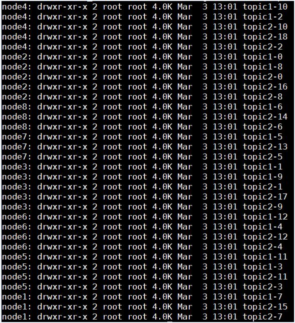
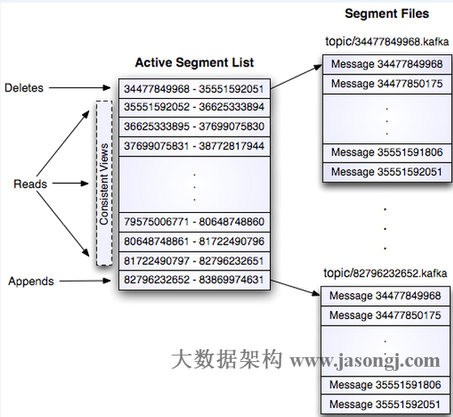
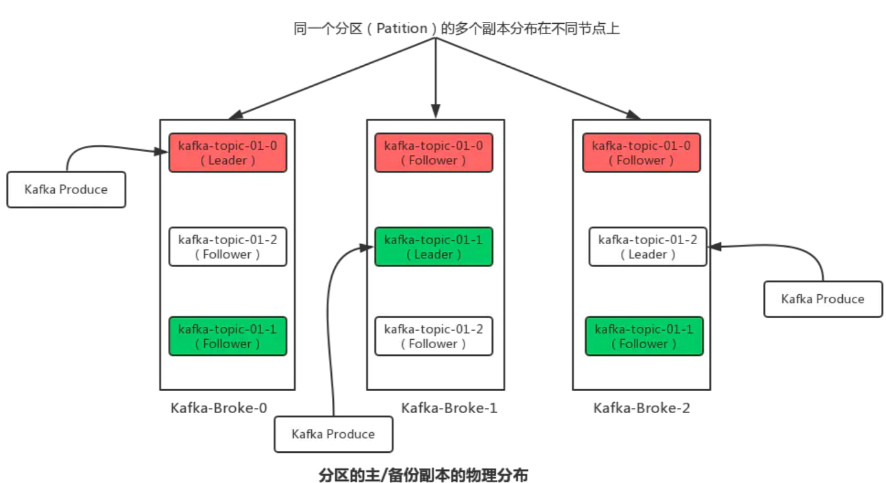
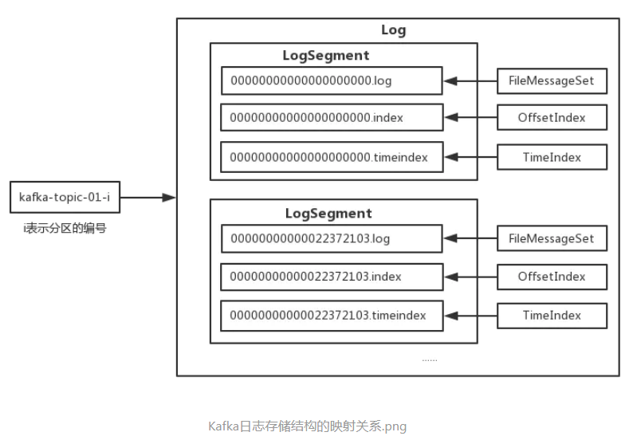
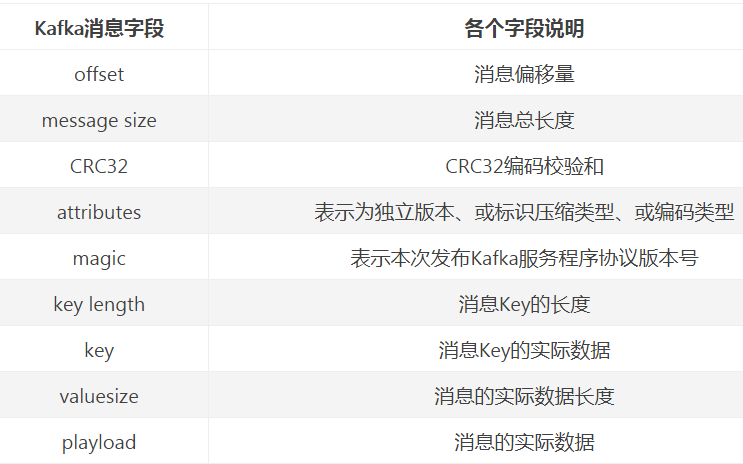
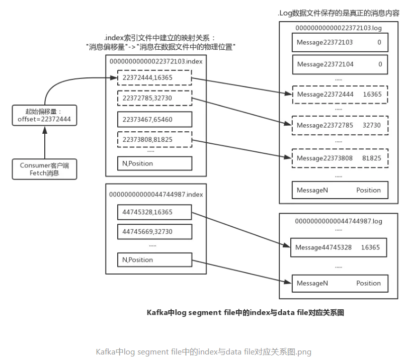

<!-- TOC -->

- [Kafka的日志结构与数据存储](#kafka的日志结构与数据存储)
    - [1、Kafka中日志索引和数据文件的存储结构](#1kafka中日志索引和数据文件的存储结构)
        - [1.日志数据文件](#1日志数据文件)
        - [2.偏移量索引文件](#2偏移量索引文件)
        - [3.时间戳索引文件](#3时间戳索引文件)

<!-- /TOC -->

# Kafka的日志结构与数据存储

Kafka这款分布式消息队列使用文件系统和操作系统的页缓存（page cache）分别存储和缓存消息，摒弃了Java的堆缓存机制，同时将随机写操作改为顺序写，再结合Zero-Copy的特性极大地改善了IO性能。而提起磁盘的文件系统，相信很多对硬盘存储了解的同学都知道：“一块SATA RAID-5阵列磁盘的线性写速度可以达到几百M/s，而随机写的速度只能是100多KB/s，线性写的速度是随机写的上千倍”，由此可以看出对磁盘写消息的速度快慢关键还是取决于我们的使用方法。鉴于此，Kafka的数据存储设计是建立在对文件进行追加的基础上实现的，因为是顺序追加，通过O(1)的磁盘数据结构即可提供消息的持久化，并且这种结构对于即使是数以TB级别的消息存储也能够保持长时间的稳定性能。在理想情况下，只要磁盘空间足够大就一直可以追加消息。此外，Kafka也能够通过配置让用户自己决定已经落盘的持久化消息保存的时间，提供消息处理更为灵活的方式。本文将主要介绍Kafka中数据的存储消息结构、存储方式以及如何通过offset来查找消息等内容。

Kafka中的消息是以主题（Topic）为基本单位进行组织的，各个主题之间相互独立。在这里主题只是一个逻辑上的抽象概念，而在实际数据文件的存储中，Kafka中的消息存储在物理上是以一个或多个分区（Partition）构成，每个分区对应本地磁盘上的一个文件夹，每个文件夹内包含了日志索引文件（“.index”和“.timeindex”）和日志数据文件（“.log”）两部分。分区数量可以在创建主题时指定，也可以在创建Topic后进行修改。（ps：`Topic的Partition数量只能增加而不能减少`）。

> Kafka中分区/副本的日志文件存储分析

由上面可以看出，每个分区在物理上对应一个文件夹，分区的命名规则为主题名后接“—”连接符，之后再接分区编号，分区编号从0开始，编号的最大值为分区总数减1。每个分区又有1至多个副本，分区的副本分布在集群的不同代理上，以提高可用性。从存储的角度上来说，分区的每个副本在逻辑上可以抽象为一个日志（Log）对象，即分区副本与日志对象是相对应的。下图是在三个Kafka Broker节点所组成的集群中分区的主/备份副本的物理分布情况图：

## 1、Kafka中日志索引和数据文件的存储结构

在Kafka中，每个Log对象又可以划分为多个LogSegment文件，每个LogSegment文件包括一个日志数据文件和两个索引文件（偏移量索引文件和消息时间戳索引文件）。其中，每个LogSegment中的日志数据文件大小均相等（该日志数据文件的大小可以通过在Kafka Broker的config/server.properties配置文件的中的“log.segment.bytes”进行设置，默认为1G大小（1073741824字节），在顺序写入消息时如果超出该设定的阈值，将会创建一组新的日志数据和索引文件）。

Kafka将日志文件封装成一个FileMessageSet对象，将偏移量索引文件和消息时间戳索引文件分别封装成OffsetIndex和TimerIndex对象。Log和LogSegment均为逻辑概念，Log是对副本在Broker上存储文件的抽象，而LogSegment是对副本存储下每个日志分段的抽象，日志与索引文件才与磁盘上的物理存储相对应；下图为Kafka日志存储结构中的对象之间的对应关系图：

下面的表格先列举了Kakfa消息体结构中几个主要字段的说明：

### 1.日志数据文件

Kafka将生产者发送给它的消息数据内容保存至日志数据文件中，该文件以该段的基准偏移量左补齐0命名，文件后缀为“.log”。分区中的每条message由offset来表示它在这个分区中的偏移量，这个offset并不是该Message在分区中实际存储位置，而是逻辑上的一个值（Kafka中用8字节长度来记录这个偏移量），但它却唯一确定了分区中一条Message的逻辑位置，同一个分区下的消息偏移量按照顺序递增（这个可以类比下数据库的自增主键）。另外，从dump出来的日志数据文件的字符值中可以看到消息体的各个字段的内容值。

### 2.偏移量索引文件

如果消息的消费者每次fetch都需要从1G大小（默认值）的日志数据文件中来查找对应偏移量的消息，那么效率一定非常低，在定位到分段后还需要顺序比对才能找到。Kafka在设计数据存储时，为了提高查找消息的效率，故而为分段后的每个日志数据文件均使用稀疏索引的方式建立索引，这样子既节省空间又能通过索引快速定位到日志数据文件中的消息内容。偏移量索引文件和数据文件一样也同样也以该段的基准偏移量左补齐0命名，文件后缀为“.index”。

从上面dump出来的偏移量索引内容可以看出，索引条目用于将偏移量映射成为消息在日志数据文件中的实际物理位置，每个索引条目由offset和position组成，每个索引条目可以唯一确定在各个分区数据文件的一条消息。其中，Kafka采用稀疏索引存储的方式，每隔一定的字节数建立了一条索引，可以通过“index.interval.bytes”设置索引的跨度；

有了偏移量索引文件，通过它，Kafka就能够根据指定的偏移量快速定位到消息的实际物理位置。具体的做法是，根据指定的偏移量，使用二分法查询定位出该偏移量对应的消息所在的分段索引文件和日志数据文件。然后通过二分查找法，继续查找出小于等于指定偏移量的最大偏移量，同时也得出了对应的position（实际物理位置），根据该物理位置在分段的日志数据文件中顺序扫描查找偏移量与指定偏移量相等的消息。下面是Kafka中分段的日志数据文件和偏移量索引文件的对应映射关系图（其中也说明了如何按照起始偏移量来定位到日志数据文件中的具体消息）。

### 3.时间戳索引文件

从上面一节的分区目录中，我们还可以看到存在一些以“.timeindex”的时间戳索引文件。这种类型的索引文件是Kafka从0.10.1.1版本开始引入的的一个基于时间戳的索引文件，它们的命名方式与对应的日志数据文件和偏移量索引文件名基本一样，唯一不同的就是后缀名。从上面dump出来的该种类型的时间戳索引文件的内容来看，每一条索引条目都对应了一个8字节长度的时间戳字段和一个4字节长度的偏移量字段，其中时间戳字段记录的是该LogSegment到目前为止的最大时间戳，后面对应的偏移量即为此时插入新消息的偏移量。

另外，时间戳索引文件的时间戳类型与日志数据文件中的时间类型是一致的，索引条目中的时间戳值及偏移量与日志数据文件中对应的字段值相同（ps：Kafka也提供了通过时间戳索引来访问消息的方法）。

> 总结

Kafka高效数据存储设计的特点在于以下几点：

- （1）、Kafka把主题中一个分区划分成多个分段的小文件段，通过多个小文件段，就容易根据偏移量查找消息、定期清除和删除已经消费完成的数据文件，减少磁盘容量的占用；

- （2）、采用稀疏索引存储的方式构建日志的偏移量索引文件，并将其映射至内存中，提高查找消息的效率，同时减少磁盘IO操作；

- （3）、Kafka将消息追加的操作逻辑变成为日志数据文件的顺序写入，极大的提高了磁盘IO的性能；

