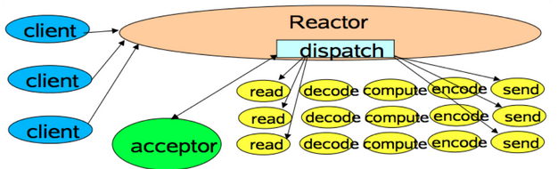
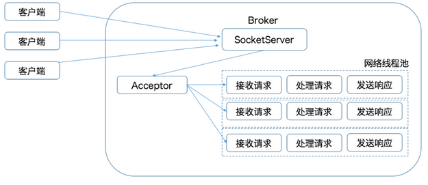
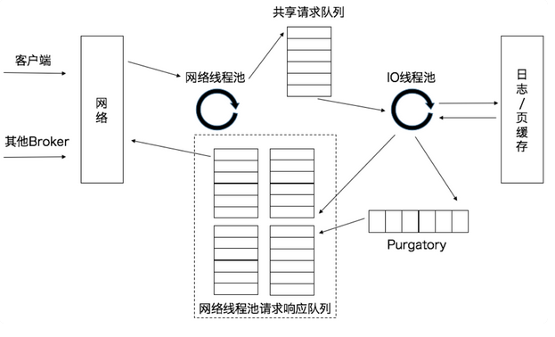
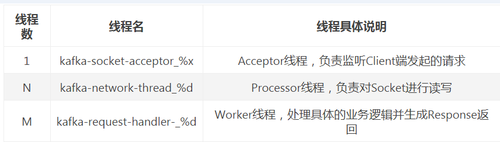
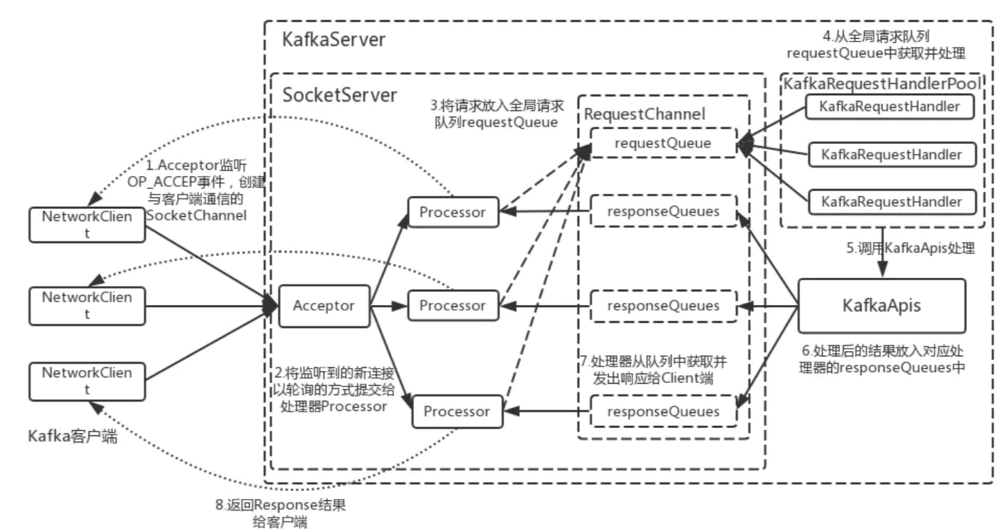

<!-- TOC -->

- [1、请求是怎么被处理的？](#1请求是怎么被处理的)
- [2、kafka的Reactor模式详解](#2kafka的reactor模式详解)
- [9、问答](#9问答)
- [参考](#参考)

<!-- /TOC -->


# 1、请求是怎么被处理的？

无论是 Kafka 客户端还是 Broker 端，它们之间的交互都是通过“请求 / 响应”的方式完成的。比如，客户端会通过网络发送消息生产请求给 Broker，而 Broker 处理完成后，会发送对应的响应给到客户端。Apache Kafka 自己定义了一组请求协议，用于实现各种各样的交互操作。比如常见的 PRODUCE 请求是用于生产消息的，FETCH 请求是用于消费消息的，METADATA 请求是用于请求 Kafka 集群元数据信息的。总之，Kafka 定义了很多类似的请求格式。我数了一下，截止到目前最新的 2.3 版本，Kafka 共定义了多达 45 种请求格式。

`所有的请求都是通过 TCP 网络以 Socket 的方式进行通讯的。`


Kafka 使用的是 Reactor 模式。

`Reactor 模式是事件驱动架构的一种实现方式，特别适合应用于处理多个客户端并发向服务器端发送请求的场景`



从这张图中，我们可以发现，多个客户端会发送请求给到 Reactor。Reactor 有个请求分发线程 Dispatcher，也就是图中的 Acceptor，它会将不同的请求下发到多个工作线程中处理。在这个架构中，Acceptor 线程只是用于请求分发，不涉及具体的逻辑处理，非常得轻量级，因此有很高的吞吐量表现。而这些工作线程可以根据实际业务处理需要任意增减，从而动态调节系统负载能力。




显然，这两张图长得差不多。Kafka 的 Broker 端有个 SocketServer 组件，类似于 Reactor 模式中的 Dispatcher，它也有对应的 Acceptor 线程和一个工作线程池，只不过在 Kafka 中，这个工作线程池有个专属的名字，叫网络线程池。Kafka 提供了 Broker 端参数 num.network.threads，用于调整该网络线程池的线程数。`其默认值是 3，表示每台 Broker 启动时会创建 3 个网络线程，专门处理客户端发送的请求。`


Acceptor 线程采用轮询的方式将入站请求公平地发到所有网络线程中，因此，在实际使用过程中，这些线程通常都有相同的几率被分配到待处理请求。这种轮询策略编写简单，同时也避免了请求处理的倾斜，有利于实现较为公平的请求处理调度。好了，你现在了解了客户端发来的请求会被 Broker 端的 Acceptor 线程分发到任意一个网络线程中，由它们来进行处理。那么，当网络线程接收到请求后，它是怎么处理的呢？你可能会认为，它顺序处理不就好了吗？实际上，Kafka 在这个环节又做了一层异步线程池的处理，我们一起来看一看下面这张图。




当网络线程拿到请求后，它不是自己处理，而是将请求放入到一个共享请求队列中。Broker 端还有个 IO 线程池，负责从该队列中取出请求，执行真正的处理。如果是 PRODUCE 生产请求，则将消息写入到底层的磁盘日志中；如果是 FETCH 请求，则从磁盘或页缓存中读取消息。IO 线程池处中的线程才是执行请求逻辑的线程。Broker 端参数 num.io.threads 控制了这个线程池中的线程数。`目前该参数默认值是 8，表示每台 Broker 启动后自动创建 8 个 IO 线程处理请求。`你可以根据实际硬件条件设置此线程池的个数。


比如，如果你的机器上 CPU 资源非常充裕，你完全可以调大该参数，允许更多的并发请求被同时处理。当 IO 线程处理完请求后，会将生成的响应发送到网络线程池的响应队列中，然后由对应的网络线程负责将 Response 返还给客户端。细心的你一定发现了请求队列和响应队列的差别：`请求队列是所有网络线程共享的，而响应队列则是每个网络线程专属的。`这么设计的原因就在于，Dispatcher 只是用于请求分发而不负责响应回传，因此只能让每个网络线程自己发送 Response 给客户端，所以这些 Response 也就没必要放在一个公共的地方。


图中有一个叫 Purgatory 的组件，这是 Kafka 中著名的“炼狱”组件。它是用来缓存延时请求（Delayed Request）的。`所谓延时请求，就是那些一时未满足条件不能立刻处理的请求。`比如设置了 acks=all 的 PRODUCE 请求，一旦设置了 acks=all，那么该请求就必须等待 ISR 中所有副本都接收了消息后才能返回，此时处理该请求的 IO 线程就必须等待其他 Broker 的写入结果。当请求不能立刻处理时，它就会暂存在 Purgatory 中。稍后一旦满足了完成条件，IO 线程会继续处理该请求，并将 Response 放入对应网络线程的响应队列中。


Kafka Broker 对所有请求是一视同仁的。但是，在 Kafka 内部，除了客户端发送的 PRODUCE 请求和 FETCH 请求之外，还有很多执行其他操作的请求类型，比如负责更新 Leader 副本、Follower 副本以及 ISR 集合的 LeaderAndIsr 请求，负责勒令副本下线的 StopReplica 请求等。与 PRODUCE 和 FETCH 请求相比，这些请求有个明显的不同：它们不是数据类的请求，而是控制类的请求。也就是说，它们并不是操作消息数据的，而是用来执行特定的 Kafka 内部动作的。


Kafka 社区把 PRODUCE 和 FETCH 这类请求称为数据类请求，把 LeaderAndIsr、StopReplica 这类请求称为控制类请求。细究起来，当前这种一视同仁的处理方式对控制类请求是不合理的。为什么呢？`因为控制类请求有这样一种能力：它可以直接令数据类请求失效！`

举个例子说明一下。假设我们有个主题只有 1 个分区，该分区配置了两个副本，其中 Leader 副本保存在 Broker 0 上，Follower 副本保存在 Broker 1 上。假设 Broker 0 这台机器积压了很多的 PRODUCE 请求，此时你如果使用 Kafka 命令强制将该主题分区的 Leader、Follower 角色互换，那么 Kafka 内部的控制器组件（Controller）会发送 LeaderAndIsr 请求给 Broker 0，显式地告诉它，当前它不再是 Leader，而是 Follower 了，而 Broker 1 上的 Follower 副本因为被选为新的 Leader，因此停止向 Broker 0 拉取消息。这时，一个尴尬的场面就出现了：如果刚才积压的 PRODUCE 请求都设置了 acks=all，那么这些在 LeaderAndIsr 发送之前的请求就都无法正常完成了。就像前面说的，它们会被暂存在 Purgatory 中不断重试，直到最终请求超时返回给客户端。


设想一下，如果 Kafka 能够优先处理 LeaderAndIsr 请求，Broker 0 就会立刻抛出 NOT_LEADER_FOR_PARTITION 异常，快速地标识这些积压 PRODUCE 请求已失败，这样客户端不用等到 Purgatory 中的请求超时就能立刻感知，从而降低了请求的处理时间。即使 acks 不是 all，积压的 PRODUCE 请求能够成功写入 Leader 副本的日志，但处理 LeaderAndIsr 之后，Broker 0 上的 Leader 变为了 Follower 副本，也要执行显式的日志截断（Log Truncation，即原 Leader 副本成为 Follower 后，会将之前写入但未提交的消息全部删除），依然做了很多无用功。


再举一个例子，同样是在积压大量数据类请求的 Broker 上，当你删除主题的时候，Kafka 控制器（我会在专栏后面的内容中专门介绍它）向该 Broker 发送 StopReplica 请求。如果该请求不能及时处理，主题删除操作会一直 hang 住，从而增加了删除主题的延时。基于这些问题，社区于 2.3 版本正式实现了数据类请求和控制类请求的分离。其实，在社区推出方案之前，我自己尝试过修改这个设计。当时我的想法是，在 Broker 中实现一个优先级队列，并赋予控制类请求更高的优先级。这是很自然的想法，所以我本以为社区也会这么实现的，但后来我这个方案被清晰地记录在“已拒绝方案”列表中。究其原因，这个方案最大的问题在于，它无法处理请求队列已满的情形。当请求队列已经无法容纳任何新的请求时，纵然有优先级之分，它也无法处理新的控制类请求了。那么，社区是如何解决的呢？很简单，你可以再看一遍今天的第三张图，社区完全拷贝了这张图中的一套组件，实现了两类请求的分离。也就是说，Kafka Broker 启动后，会在后台分别创建两套网络线程池和 IO 线程池的组合，它们分别处理数据类请求和控制类请求。至于所用的 Socket 端口，自然是使用不同的端口了，你需要提供不同的 listeners 配置，显式地指定哪套端口用于处理哪类请求。


# 2、kafka的Reactor模式详解


Kafka的网络通信模型是基于NIO的Reactor多线程模型来设计的。这里先引用Kafka源码中注释的一段话：

```
An NIO socket server. The threading model is
1 Acceptor thread that handles new connections.
Acceptor has N Processor threads that each have their own selector and read requests from sockets.
M Handler threads that handle requests and produce responses back to the processor threads for writing.
```

相信大家看了上面的这段引文注释后，大致可以了解到Kafka的网络通信层模型，主要采用了**1（1个Acceptor线程）+N（N个Processor线程）+M（M个业务处理线程）**。下面的表格简要的列举了下（这里先简单的看下后面还会详细说明）：



Kafka网络通信层的完整框架图如下图所示：




这里可以简单总结一下其网络通信模型中的几个重要概念：

- （1）Acceptor：1个接收线程，负责监听新的连接请求，同时注册OP_ACCEPT 事件，将新的连接按照"round robin"方式交给对应的 Processor 线程处理；

- （2）Processor：N个处理器线程，其中每个 Processor 都有自己的 selector，它会向 Acceptor 分配的 SocketChannel 注册相应的 OP_READ 事件，N 的大小由“num.networker.threads”决定；

- （3）KafkaRequestHandler：M个请求处理线程，包含在线程池—KafkaRequestHandlerPool内部，从RequestChannel的全局请求队列—requestQueue中获取请求数据并交给KafkaApis处理，M的大小由“num.io.threads”决定；

- （4）RequestChannel：其为Kafka服务端的请求通道，该数据结构中包含了一个全局的请求队列 requestQueue和多个与Processor处理器相对应的响应队列responseQueue，提供给Processor与请求处理线程KafkaRequestHandler和KafkaApis交换数据的地方。

- （5）NetworkClient：其底层是对 Java NIO 进行相应的封装，位于Kafka的网络接口层。Kafka消息生产者对象—KafkaProducer的send方法主要调用NetworkClient完成消息发送；

- （6）SocketServer：其是一个NIO的服务，它同时启动一个Acceptor接收线程和多个Processor处理器线程。提供了一种典型的Reactor多线程模式，将接收客户端请求和处理请求相分离；

- （7）KafkaServer：代表了一个Kafka Broker的实例；其startup方法为实例启动的入口；

- （8）KafkaApis：Kafka的业务逻辑处理Api，负责处理不同类型的请求；比如“发送消息”、“获取消息偏移量—offset”和“处理心跳请求”等；

# 9、问答

> 共享队列满了，那么这个请求会丢弃吧？

默认是500的上限，如果满了会阻塞

> 当前这种异步消息处理模型，如何保证分区的消息顺序的一致性？

一个broker上虽然有多个handler IO线程处理请求，但底层的日志管理器实例只有一个，因此依然能够保证消息的顺序性。当然这里所说的顺序性是指同一个producer发送消息的顺序性，多个producer同时发送消息，本来也无法确定哪个producer发送的消息在前，哪个producer发送的消息在后。

> 网络线程处理的请求，究竟是tcp连接的一个channel，还是已经解析出来的kafka自定义的命令

网络线程仅做请求的分发，并不实际处理请求。因此你可以认为这时候的请求就是符合Kafka请求协议类型定义的字节数组


> Acceptor单线程是不是存在单点问题？且单线程如果并发量过大会不会出现瓶颈？Netty的Acceptor应该也是使用了线程池吧，希望可以解答一下

由于Acceptor线程只接收请求然后转发，因此非常轻量级。通常情况下都不是瓶颈。你可以监控kafka.network:type=Acceptor,name=AcceptorBlockedPercent,listener={listenerName}来看看Acceptor线程的繁忙程度


# 参考

- [消息中间件—简谈Kafka中的NIO网络通信模型](https://www.jianshu.com/p/a6b9e5342878)

- [消息中间件—Kafka数据存储（一）](https://www.jianshu.com/p/3e54a5a39683)