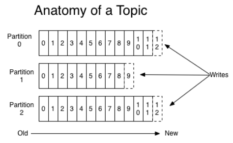

<!-- TOC -->

- [1、生产者消息分区机制原理](#1生产者消息分区机制原理)
    - [1、为什么分区？](#1为什么分区)
    - [2、都有哪些分区策略？](#2都有哪些分区策略)
        - [1、轮询策略](#1轮询策略)
        - [2、随机策略](#2随机策略)
        - [3、按消息键保序策略](#3按消息键保序策略)
- [2、生产者压缩算法](#2生产者压缩算法)
    - [1、怎么压缩？](#1怎么压缩)
    - [2、何时压缩？](#2何时压缩)
    - [3、何时解压缩？](#3何时解压缩)
    - [4、各种压缩算法对比](#4各种压缩算法对比)
    - [5、最佳实践](#5最佳实践)

<!-- /TOC -->

# 1、生产者消息分区机制原理

我们在使用 Apache Kafka 生产和消费消息的时候，肯定是希望能够将数据均匀地分配到所有服务器上。

`分区是实现负载均衡以及高吞吐量的关键，故在生产者这一端就要仔细盘算合适的分区策略，避免造成消息数据的“倾斜”，使得某些分区成为性能瓶颈，这样极易引发下游数据消费的性能下降。`

## 1、为什么分区？

Kafka 有主题（Topic）的概念，它是承载真实数据的逻辑容器，而在主题之下还分为若干个分区，也就是说 Kafka 的消息组织方式实际上是三级结构：主题 - 分区 - 消息。主题下的每条消息只会保存在某一个分区中，而不会在多个分区中被保存多份。官网上的这张图非常清晰地展示了 Kafka 的三级结构，如下所示：




`其实分区的作用就是提供负载均衡的能力，或者说对数据进行分区的主要原因，就是为了实现系统的高伸缩性（Scalability）。不同的分区能够被放置到不同节点的机器上，而数据的读写操作也都是针对分区这个粒度而进行的，这样每个节点的机器都能独立地执行各自分区的读写请求处理。并且，我们还可以通过添加新的节点机器来增加整体系统的吞吐量。`

除了提供负载均衡这种最核心的功能之外，利用分区也可以实现其他一些业务级别的需求，比如实现业务级别的消息顺序的问题。

值得注意的是，不同的分布式系统对分区的叫法也不尽相同。比如在 Kafka 中叫分区，在 MongoDB 和 Elasticsearch 中就叫分片 Shard，而在 HBase 中则叫 Region，在 Cassandra 中又被称作 vnode。从表面看起来它们实现原理可能不尽相同，但对底层分区（Partitioning）的整体思想却从未改变。


## 2、都有哪些分区策略？

`所谓分区策略是决定生产者将消息发送到哪个分区的算法。`

Kafka 为我们提供了默认的分区策略，同时它也支持你自定义分区策略。如果要自定义分区策略，你需要显式地配置生产者端的参数partitioner.class。这个参数该怎么设定呢？方法很简单，在编写生产者程序时，你可以编写一个具体的类实现org.apache.kafka.clients.producer.Partitioner接口。这个接口也很简单，只定义了两个方法：partition()和close()，通常你只需要实现最重要的 partition 方法。我们来看看这个方法的方法签名：

```java

int partition(String topic, Object key, byte[] keyBytes, Object value, byte[] valueBytes, Cluster cluster);
```
这里的topic、key、keyBytes、value和valueBytes都属于消息数据，cluster则是集群信息（比如当前 Kafka 集群共有多少主题、多少 Broker 等）。Kafka 给你这么多信息，就是希望让你能够充分地利用这些信息对消息进行分区，计算出它要被发送到哪个分区中。只要你自己的实现类定义好了 partition 方法，同时设置partitioner.class参数为你自己实现类的 Full Qualified Name，那么生产者程序就会按照你的代码逻辑对消息进行分区。

虽说可以有无数种分区的可能，但比较常见的分区策略也就那么几种:

### 1、轮询策略

也称 Round-robin 策略，即顺序分配。比如一个主题下有 3 个分区，那么第一条消息被发送到分区 0，第二条被发送到分区 1，第三条被发送到分区 2，以此类推。当生产第 4 条消息时又会重新开始，即将其分配到分区 0。

这就是所谓的轮询策略。轮询策略是 Kafka Java 生产者 API 默认提供的分区策略。如果你未指定partitioner.class参数，那么你的生产者程序会按照轮询的方式在主题的所有分区间均匀地“码放”消息。

`轮询策略有非常优秀的负载均衡表现，它总是能保证消息最大限度地被平均分配到所有分区上，故默认情况下它是最合理的分区策略，也是我们最常用的分区策略之一。`


### 2、随机策略

也称 Randomness 策略。所谓随机就是我们随意地将消息放置到任意一个分区上。如果要实现随机策略版的 partition 方法，很简单，只需要两行代码即可：

```java

List<PartitionInfo> partitions = cluster.partitionsForTopic(topic);
return ThreadLocalRandom.current().nextInt(partitions.size());
```

先计算出该主题总的分区数，然后随机地返回一个小于它的正整数。本质上看随机策略也是力求将数据均匀地打散到各个分区，但从实际表现来看，它要逊于轮询策略，所以如果追求数据的均匀分布，还是使用轮询策略比较好。事实上，随机策略是老版本生产者使用的分区策略，在新版本中已经改为轮询了。


### 3、按消息键保序策略

Kafka 允许为每条消息定义消息键，简称为 Key。这个 Key 的作用非常大，它可以是一个有着明确业务含义的字符串，比如客户代码、部门编号或是业务 ID 等；也可以用来表征消息元数据。特别是在 Kafka 不支持时间戳的年代，在一些场景中，工程师们都是直接将消息创建时间封装进 Key 里面的。一旦消息被定义了 Key，那么你就可以保证同一个 Key 的所有消息都进入到相同的分区里面，由于每个分区下的消息处理都是有顺序的，故这个策略被称为按消息键保序策略。

实现这个策略的 partition 方法同样简单，只需要下面两行代码即可：

```java

List<PartitionInfo> partitions = cluster.partitionsForTopic(topic);
return Math.abs(key.hashCode()) % partitions.size();
```

`前面提到的 Kafka 默认分区策略实际上同时实现了两种策略：如果指定了 Key，那么默认实现按消息键保序策略；如果没有指定 Key，则使用轮询策略。`


# 2、生产者压缩算法

压缩（compression）它秉承了用时间去换空间的经典 trade-off 思想，具体来说就是用 CPU 时间去换磁盘空间或网络 I/O 传输量，希望以较小的 CPU 开销带来更少的磁盘占用或更少的网络 I/O 传输。

## 1、怎么压缩？

目前 Kafka 共有两大类消息格式，社区分别称之为 V1 版本和 V2 版本。V2 版本是 Kafka 0.11.0.0 中正式引入的。


## 2、何时压缩？


## 3、何时解压缩？

## 4、各种压缩算法对比

## 5、最佳实践

