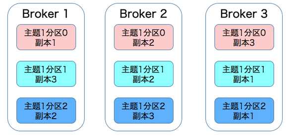
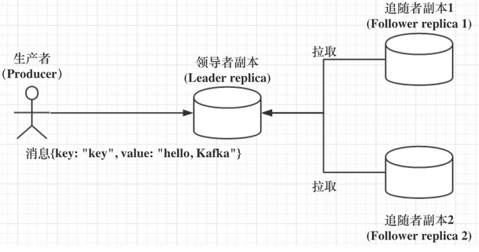
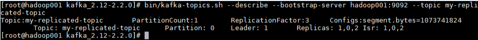
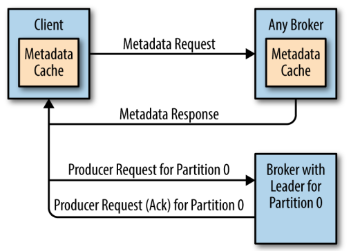
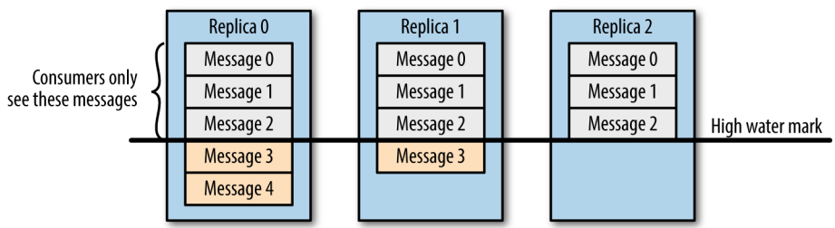
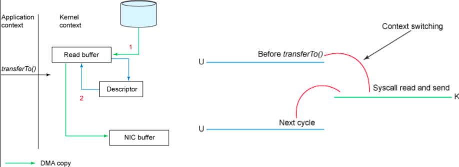
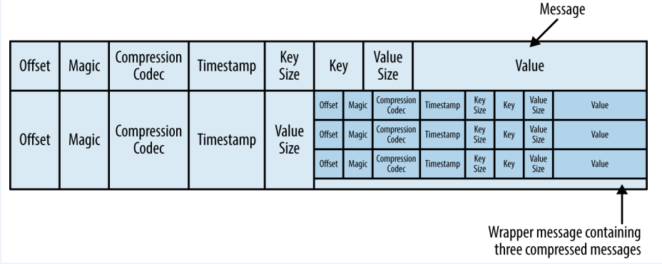

<!-- TOC -->

- [分区副本机制](#分区副本机制)
    - [1、Kafka集群](#1kafka集群)
    - [2、副本机制](#2副本机制)
        - [2.0 分区和副本](#20-分区和副本)
        - [2.1 副本角色](#21-副本角色)
            - [kafka非leader副本平时不工作的好处？](#kafka非leader副本平时不工作的好处)
        - [2.2 ISR机制](#22-isr机制)
        - [2.3 不完全的首领选举](#23-不完全的首领选举)
        - [2.4 最少同步副本](#24-最少同步副本)
        - [2.5 发送确认](#25-发送确认)
    - [3、数据请求](#3数据请求)
        - [3.1 元数据请求机制](#31-元数据请求机制)
        - [3.2 数据可见性](#32-数据可见性)
        - [3.3 sendfile和transferTo实现零拷贝](#33-sendfile和transferto实现零拷贝)
    - [4、物理存储](#4物理存储)
        - [4.1 分区分配](#41-分区分配)
        - [4.2 分区数据保留规则](#42-分区数据保留规则)
        - [4.3 文件格式](#43-文件格式)

<!-- /TOC -->

# 分区副本机制


## 1、Kafka集群

Kafka 使用 Zookeeper 来维护集群成员 (brokers) 的信息。每个 broker 都有一个唯一标识 `broker.id`，用于标识自己在集群中的身份，可以在配置文件 `server.properties` 中进行配置，或者由程序自动生成。下面是 Kafka brokers 集群自动创建的过程：

+ 每一个 broker 启动的时候，它会在 Zookeeper 的 `/brokers/ids` 路径下创建一个 ` 临时节点 `，并将自己的 `broker.id` 写入，从而将自身注册到集群；

+ 当有多个 broker 时，所有 broker 会竞争性地在 Zookeeper 上创建 `/controller` 节点，由于 Zookeeper 上的节点不会重复，所以必然只会有一个 broker 创建成功，此时该 broker 称为 controller broker。它除了具备其他 broker 的功能外，**还负责管理主题分区及其副本的状态**。

+ 当 broker 出现宕机或者主动退出从而导致其持有的 Zookeeper 会话超时时，会触发注册在 Zookeeper 上的 watcher 事件，此时 Kafka 会进行相应的容错处理；如果宕机的是 controller broker 时，还会触发新的 controller 选举。

## 2、副本机制


所谓的副本机制（Replication），也可以称之为备份机制，通常是指分布式系统在多台网络互联的机器上保存有相同的数据拷贝。副本机制有什么好处呢？

- 1、提供数据冗余。即使系统部分组件失效，系统依然能够继续运转，因而增加了整体可用性以及数据持久性。

- 2、提供高伸缩性。支持横向扩展，能够通过增加机器的方式来提升读性能，进而提高读操作吞吐量。

- 3、改善数据局部性。允许将数据放入与用户地理位置相近的地方，从而降低系统延时；

这些优点都是在分布式系统教科书中最常被提及的，但是有些遗憾的是，对于 Apache Kafka 而言，目前只能享受到副本机制带来的第 1 个好处，也就是提供数据冗余实现高可用性和高持久性。不过即便如此，副本机制依然是 Kafka 设计架构的核心所在，它也是 Kafka 确保系统`高可用和消息高持久性`的重要基石。


为了保证高可用，kafka 的分区是多副本的，如果一个副本丢失了，那么还可以从其他副本中获取分区数据。但是这要求对应副本的数据必须是完整的，这是 Kafka 数据一致性的基础，所以才需要使用 `controller broker` 来进行专门的管理。下面将详解介绍 Kafka 的副本机制。

### 2.0 分区和副本

Kafka 的主题被分为多个分区 ，分区是 Kafka 最基本的存储单位。每个分区可以有多个副本 (可以在创建主题时使用 ` replication-factor` 参数进行指定)。其中一个副本是首领副本 (Leader replica)，所有的事件都直接发送给首领副本；其他副本是跟随者副本 (Follower replica)，需要通过复制来保持与首领副本数据一致，当首领副本不可用时，其中一个跟随者副本将成为新首领。 
Kafka 是有主题概念的，而每个主题又进一步划分成若干个分区。副本的概念实际上是在分区层级下定义的，每个分区配置有若干个副本。

`所谓副本（Replica），本质就是一个只能追加写消息的提交日志。`

根据 Kafka 副本机制的定义，同一个分区下的所有副本保存有相同的消息序列，这些副本分散保存在不同的 Broker 上，从而能够对抗部分 Broker 宕机带来的数据不可用。在实际生产环境中，每台 Broker 都可能保存有各个主题下不同分区的不同副本，因此，单个 Broker 上存有成百上千个副本的现象是非常正常的。接下来我们来看一张图，它展示的是一个有 3 台 Broker 的 Kafka 集群上的副本分布情况。从这张图中，我们可以看到，主题 1 分区 0 的 3 个副本分散在 3 台 Broker 上，其他主题分区的副本也都散落在不同的 Broker 上，从而实现数据冗余。




### 2.1 副本角色

既然分区下能够配置多个副本，而且这些副本的内容还要一致，那么很自然的一个问题就是：我们该如何确保副本中所有的数据都是一致的呢？特别是对 Kafka 而言，当生产者发送消息到某个主题后，消息是如何同步到对应的所有副本中的呢？针对这个问题，最常见的解决方案就是采用`基于领导者（Leader-based）的副本机制`。Apache Kafka 就是这样的设计。

基于领导者的副本机制的工作原理如下图所示，我来简单解释一下这张图里面的内容。





第一，在 Kafka 中，副本分成两类：领导者副本（Leader Replica）和追随者副本（Follower Replica）。每个分区在创建时都要选举一个副本，称为领导者副本，其余的副本自动称为追随者副本。

第二，Kafka 的副本机制比其他分布式系统要更严格一些。在 Kafka 中，追随者副本是不对外提供服务的。这就是说，任何一个追随者副本都不能响应消费者和生产者的读写请求。所有的请求都必须由领导者副本来处理，或者说，所有的读写请求都必须发往领导者副本所在的 Broker，由该 Broker 负责处理。追随者副本不处理客户端请求，它唯一的任务就是从领导者副本异步拉取消息，并写入到自己的提交日志中，从而实现与领导者副本的同步。

第三，当领导者副本挂掉了，或者说领导者副本所在的 Broker 宕机时，Kafka 依托于 ZooKeeper 提供的监控功能能够实时感知到，并立即开启新一轮的领导者选举，从追随者副本中选一个作为新的领导者。老 Leader 副本重启回来后，只能作为追随者副本加入到集群中。

你一定要特别注意上面的第二点，即追随者副本是不对外提供服务的。还记得刚刚我们谈到副本机制的好处时，说过 Kafka 没能提供读操作横向扩展以及改善局部性吗？具体的原因就在于此。


对于客户端用户而言，Kafka 的追随者副本没有任何作用，它既不能像 MySQL 那样帮助领导者副本“抗读”，也不能实现将某些副本放到离客户端近的地方来改善数据局部性。既然如此，Kafka 为什么要这样设计呢？其实这种副本机制有两个方面的好处。


#### kafka非leader副本平时不工作的好处？

- 1.方便实现“Read-your-writes”。所谓 Read-your-writes，顾名思义就是，当你使用生产者 API 向 Kafka 成功写入消息后，马上使用消费者 API 去读取刚才生产的消息。举个例子，比如你平时发微博时，你发完一条微博，肯定是希望能立即看到的，这就是典型的 Read-your-writes 场景。如果允许追随者副本对外提供服务，由于副本同步是异步的，因此有可能出现追随者副本还没有从领导者副本那里拉取到最新的消息，从而使得客户端看不到最新写入的消息。

- 2.方便实现单调读（Monotonic Reads）。什么是单调读呢？就是对于一个消费者用户而言，在多次消费消息时，它不会看到某条消息一会儿存在一会儿不存在。如果允许追随者副本提供读服务，那么假设当前有 2 个追随者副本 F1 和 F2，它们异步地拉取领导者副本数据。倘若 F1 拉取了 Leader 的最新消息而 F2 还未及时拉取，那么，此时如果有一个消费者先从 F1 读取消息之后又从 F2 拉取消息，它可能会看到这样的现象：第一次消费时看到的最新消息在第二次消费时不见了，这就不是单调读一致性。但是，如果所有的读请求都是由 Leader 来处理，那么 Kafka 就很容易实现单调读一致性。


> 补充

Kafka在启动的时候会开启两个任务，一个任务用来定期地检查是否需要缩减或者扩大ISR集合，这个周期是replica.lag.time.max.ms的一半，默认5000ms。当检测到ISR集合中有失效副本时，就会收缩ISR集合，当检查到有Follower的HighWatermark追赶上Leader时，就会扩充ISR。

除此之外，当ISR集合发生变更的时候还会将变更后的记录缓存到isrChangeSet中，另外一个任务会周期性地检查这个Set,如果发现这个Set中有ISR集合的变更记录，那么它会在zk中持久化一个节点。然后因为Controllr在这个节点的路径上注册了一个Watcher，所以它就能够感知到ISR的变化，并向它所管理的broker发送更新元数据的请求。最后删除该路径下已经处理过的节点。

此外，在0.9X版本之前，Kafka中还有另外一个参数replica.lag.max.messages，它也是用来判定失效副本的，当一个副本滞后leader副本的消息数超过这个参数的大小时，则判定它处于同步失效的状态。它与replica.lag.time.max.ms参数判定出的失效副本取并集组成一个失效副本集合。

不过这个参数本身很难给出一个合适的值。以默认的值4000为例，对于消息流入速度很低的主题（比如TPS为10），这个参数就没什么用；对于消息流入速度很高的主题（比如TPS为2000），这个参数的取值又会引入ISR的频繁变动。所以从0.9x版本开始，Kafka就彻底移除了这一个参数。


### 2.2 ISR机制

每个分区都有一个 ISR(in-sync Replica) 列表，用于维护所有同步的、可用的副本。首领副本必然是同步副本，而对于跟随者副本来说，它需要满足以下条件才能被认为是同步副本：

+ 与 Zookeeper 之间有一个活跃的会话，即必须定时向 Zookeeper 发送心跳；
+  在规定的时间内从首领副本那里低延迟地获取过消息。

如果副本不满足上面条件的话，就会被从 ISR 列表中移除，直到满足条件才会被再次加入。

这里给出一个主题创建的示例：使用 `--replication-factor` 指定副本系数为 3，创建成功后使用 `--describe ` 命令可以看到分区 0 的有 0,1,2 三个副本，且三个副本都在 ISR 列表中，其中 1 为首领副本。




`这个标准就是 Broker 端参数 replica.lag.time.max.ms 参数值。`

这个参数的含义是 Follower 副本能够落后 Leader 副本的最长时间间隔，当前默认值是 10 秒。这就是说，只要一个 Follower 副本落后 Leader 副本的时间不连续超过 10 秒，那么 Kafka 就认为该 Follower 副本与 Leader 是同步的，即使此时 Follower 副本中保存的消息明显少于 Leader 副本中的消息。

Follower 副本唯一的工作就是不断地从 Leader 副本拉取消息，然后写入到自己的提交日志中。如果这个同步过程的速度持续慢于 Leader 副本的消息写入速度，那么在 replica.lag.time.max.ms 时间后，此 Follower 副本就会被认为是与 Leader 副本不同步的，因此不能再放入 ISR 中。此时，Kafka 会自动收缩 ISR 集合，将该副本“踢出”ISR。值得注意的是，倘若该副本后面慢慢地追上了 Leader 的进度，那么它是能够重新被加回 ISR 的。这也表明，ISR 是一个动态调整的集合，而非静态不变的。

`Producer端认为消息已经成功提交的条件是：ISR中所有副本都已经保存了该消息，但producer并没有指定ISR中需要几个副本。这就是min.insync.replicas参数的作用。`


> “这个标准就是 Broker 端参数 replica.lag.time.max.ms 参数值。这个参数的含义是 Follower 副本能够落后 Leader 副本的最长时间间隔，当前默认值是 10 秒” 这句话中的最长时间间隔是怎么计算的，以什么时间为基准？

follower从leader拿到消息后会更新一个名为_lastCaughtUpTimeMs的字段。每当要检查follower是否out of ISR时就会用当前时间减去这个字段值去和replica.lag.time.max.ms 比较


> 这个isr集合是谁负责同步的？

通过比较follower和leader的最新消息位移或末端消息位移（Log End Offset, LEO）


### 2.3 不完全的首领选举

对于副本机制，在 broker 级别有一个可选的配置参数 `unclean.leader.election.enable`，默认值为 fasle，代表禁止不完全的首领选举。这是针对当首领副本挂掉且 ISR 中没有其他可用副本时(即ISR为空)，是否允许某个不完全同步的副本成为首领副本，这可能会导致数据丢失或者数据不一致，在某些对数据一致性要求较高的场景 (如金融领域)，这可能无法容忍的，所以其默认值为 false，如果你能够允许部分数据不一致的话，可以配置为 true。

开启 Unclean 领导者选举可能会造成数据丢失，但好处是，它使得分区 Leader 副本一直存在，不至于停止对外提供服务，因此提升了高可用性。反之，禁止 Unclean 领导者选举的好处在于维护了数据的一致性，避免了消息丢失，但牺牲了高可用性。如果你听说过 CAP 理论的话，你一定知道，一个分布式系统通常只能同时满足一致性（Consistency）、可用性（Availability）、分区容错性（Partition tolerance）中的两个。显然，在这个问题上，Kafka 赋予你选择 C 或 A 的权利。你可以根据你的实际业务场景决定是否开启 Unclean 领导者选举。不过，我强烈建议你不要开启它，毕竟我们还可以通过其他的方式来提升高可用性。如果为了这点儿高可用性的改善，牺牲了数据一致性，那就非常不值当了。

### 2.4 最少同步副本

ISR 机制的另外一个相关参数是 `min.insync.replicas` , 可以在 broker 或者主题级别进行配置，代表 ISR 列表中至少要有几个可用副本。这里假设设置为 2，那么当可用副本数量小于该值时，就认为整个分区处于不可用状态。此时客户端再向分区写入数据时候就会抛出异常 `org.apache.kafka.common.errors.NotEnoughReplicasExceptoin: Messages are rejected since there are fewer in-sync replicas than required。`

### 2.5 发送确认

Kafka 在生产者上有一个可选的参数 ack，该参数指定了必须要有多少个分区副本收到消息，生产者才会认为消息写入成功：

- **acks=0** ：消息发送出去就认为已经成功了，不会等待任何来自服务器的响应；
- **acks=1** ： 只要集群的首领节点收到消息，生产者就会收到一个来自服务器成功响应；
- **acks=all** ：只有当所有参与复制的节点全部收到消息时，生产者才会收到一个来自服务器的成功响应。

## 3、数据请求

### 3.1 元数据请求机制

在所有副本中，只有领导副本才能进行消息的读写处理。由于不同分区的领导副本可能在不同的 broker 上，如果某个 broker 收到了一个分区请求，但是该分区的领导副本并不在该 broker 上，那么它就会向客户端返回一个 `Not a Leader for Partition` 的错误响应。 为了解决这个问题，Kafka 提供了元数据请求机制。

首先集群中的每个 broker 都会缓存所有主题的分区副本信息，客户端会定期发送发送元数据请求，然后将获取的元数据进行缓存。定时刷新元数据的时间间隔可以通过为客户端配置 `metadata.max.age.ms` 来进行指定。有了元数据信息后，客户端就知道了领导副本所在的 broker，之后直接将读写请求发送给对应的 broker 即可。

如果在定时请求的时间间隔内发生的分区副本的选举，则意味着原来缓存的信息可能已经过时了，此时还有可能会收到 `Not a Leader for Partition` 的错误响应，这种情况下客户端会再次求发出元数据请求，然后刷新本地缓存，之后再去正确的 broker 上执行对应的操作，过程如下图：




### 3.2 数据可见性

需要注意的是，并不是所有保存在分区首领上的数据都可以被客户端读取到，为了保证数据一致性，只有被所有同步副本 (ISR 中所有副本) 都保存了的数据才能被客户端读取到。




### 3.3 sendfile和transferTo实现零拷贝

Linux 2.4+ 内核通过 `sendfile` 系统调用，提供了零拷贝。数据通过 DMA 拷贝到内核态 Buffer 后，直接通过 DMA 拷贝到 NIC Buffer，无需 CPU 拷贝。这也是零拷贝这一说法的来源。除了减少数据拷贝外，因为整个读文件到网络发送由一个 `sendfile` 调用完成，整个过程只有两次上下文切换，因此大大提高了性能。零拷贝过程如下图所示：



从具体实现来看，Kafka 的数据传输通过 TransportLayer 来完成，其子类 `PlaintextTransportLayer` 的 `transferFrom` 方法通过调用 Java NIO 中 FileChannel 的 `transferTo` 方法实现零拷贝，如下所示：

```java
@Override
public long transferFrom(FileChannel fileChannel, long position, long count) throws IOException {
    return fileChannel.transferTo(position, count, socketChannel);
}
```

**注：** `transferTo` 和 `transferFrom` 并不保证一定能使用零拷贝。实际上是否能使用零拷贝与操作系统相关，如果操作系统提供 `sendfile` 这样的零拷贝系统调用，则这两个方法会通过这样的系统调用充分利用零拷贝的优势，否则并不能通过这两个方法本身实现零拷贝。

## 4、物理存储

### 4.1 分区分配

在创建主题时，Kafka 会首先决定如何在 broker 间分配分区副本，它遵循以下原则：

+ 在所有 broker 上均匀地分配分区副本；
+ 确保分区的每个副本分布在不同的 broker 上；
+ 如果使用了 `broker.rack` 参数为 broker 指定了机架信息，那么会尽可能的把每个分区的副本分配到不同机架的 broker 上，以避免一个机架不可用而导致整个分区不可用。

基于以上原因，如果你在一个单节点上创建一个 3 副本的主题，通常会抛出下面的异常：

```properties
Error while executing topic command : org.apache.kafka.common.errors.InvalidReplicationFactor   
Exception: Replication factor: 3 larger than available brokers: 1.
```

### 4.2 分区数据保留规则

保留数据是 Kafka 的一个基本特性， 但是 Kafka 不会一直保留数据，也不会等到所有消费者都读取了消息之后才删除消息。相反， Kafka 为每个主题配置了数据保留期限，规定数据被删除之前可以保留多长时间，或者清理数据之前可以保留的数据量大小。分别对应以下四个参数： 

- `log.retention.bytes` ：删除数据前允许的最大数据量；默认值-1，代表没有限制；
- `log.retention.ms`：保存数据文件的毫秒数，如果未设置，则使用 `log.retention.minutes` 中的值，默认为 null；
- `log.retention.minutes`：保留数据文件的分钟数，如果未设置，则使用 `log.retention.hours` 中的值，默认为 null；
- `log.retention.hours`：保留数据文件的小时数，默认值为 168，也就是一周。

因为在一个大文件里查找和删除消息是很费时的，也很容易出错，所以 Kafka 把分区分成若干个片段，当前正在写入数据的片段叫作活跃片段。活动片段永远不会被删除。如果按照默认值保留数据一周，而且每天使用一个新片段，那么你就会看到，在每天使用一个新片段的同时会删除一个最老的片段，所以大部分时间该分区会有 7 个片段存在。 

### 4.3 文件格式

通常保存在磁盘上的数据格式与生产者发送过来消息格式是一样的。 如果生产者发送的是压缩过的消息，那么同一个批次的消息会被压缩在一起，被当作“包装消息”进行发送 (格式如下所示) ，然后保存到磁盘上。之后消费者读取后再自己解压这个包装消息，获取每条消息的具体信息。




- [Kafka 高性能架构之道](http://www.jasongj.com/kafka/high_throughput/)