<!-- TOC -->

- [1、Kafka总结](#1kafka总结)
    - [00、基本概念](#00基本概念)
        - [01、Message、Messages And Batches](#01messagemessages-and-batches)
        - [02、Broker](#02broker)
        - [03、Topic](#03topic)
        - [04、Partition](#04partition)
        - [05、Log and Segment](#05log-and-segment)
        - [06、offset](#06offset)
        - [07、Producer](#07producer)
        - [08、Consumer](#08consumer)
        - [09、Consumer Group](#09consumer-group)
        - [10、Broker Controller](#10broker-controller)
        - [11、Partition Leader](#11partition-leader)
        - [12、Zookeeper](#12zookeeper)
        - [13、Coordinator](#13coordinator)
        - [14、Rebalance](#14rebalance)
        - [15、Offset commit](#15offset-commit)
        - [16、ISR集合  （In-SyncReplica）副本同步列表](#16isr集合--in-syncreplica副本同步列表)
        - [17、多副本策略](#17多副本策略)
        - [18、单播与广播](#18单播与广播)
        - [19、HW、HW 截断机制 与 LEO](#19hwhw-截断机制-与-leo)
    - [01、高性能](#01高性能)
    - [02、高可用](#02高可用)
    - [03、消息写入过程](#03消息写入过程)
    - [04、消息路由策略](#04消息路由策略)
    - [05、消息发送的可靠性机制](#05消息发送的可靠性机制)
    - [06、消费者消费过程](#06消费者消费过程)
    - [07、Partition Leader 选举](#07partition-leader-选举)
    - [08、重复消费问题及解决方案](#08重复消费问题及解决方案)
    - [09、分区再均衡](#09分区再均衡)
    - [10、delivery guarantee 消息投放确认，不丢不重复](#10delivery-guarantee-消息投放确认不丢不重复)

<!-- /TOC -->

> 特点

Kafka是一个[分布式的]、[可分区的]、[可复制的]、[基于发布/订阅的消息系统],Kafka主要用于大数据领域,当然在分布式系统中也有应用。目前市面上流行的消息队列RocketMQ就是阿里借鉴Kafka的原理、用Java开发而得.Kafka适合离线和在线的消息消费,其消息保存在磁盘上。Kafka以Topic为单位进行消息的归纳,Producers向Topic发送(Push)消息,Consumers会消费(Pull)预订了Topic的消息。

备注：所有的消息都是落到磁盘文件的方式，消息被删除的时机不是被消费掉，Kafka提供两种策略删除旧数据。一是基于时间，二是基于Partition文件大小。

Kafka的Producer、Broker和Consumer之间采用的是一套自行设计的基于TCP层的协议。Kafka的这套协议完全是为了Kafka自身的业务需求而定制的，而非要实现一套类似于Protocol Buffer的通用协议。

> 基础结构

- 一个topic可以设置多个partition，并发读写，提高吞吐量，一个partition对应物理文件夹（包括数据文件和索引文件），一个partition只会存在一个broker物理机上[所以一般partition的数量多于broker的数量]；

- Kafka提供两种策略删除旧数据。一是基于时间，二是基于Partition文件大小。可以通过配置设置，和consumer消费与否没关；

- kafka把消息存到磁盘上，保证可靠；

# 1、Kafka总结

http://kafka.apache.org/

Apache下的一个子项目，使用scala实现的一个高性能分布式Publish/Subscribe消息队列系统，具有以下特性：

- 快速持久化：通过磁盘顺序读写与零拷贝机制，可以在O(1)的系统开销下进行消息持久化；并通过多副本分布式的存储方案来保证消息的容错；
- 高吞吐：在一台普通的服务器上既可以达到10W/s的吞吐速率；
- 高堆积：支持topic下消费者较长时间离线，消息堆积量大；
- 完全的分布式系统：Broker、Producer、Consumer都原生自动支持分布式，依赖zookeeper自动实现复杂均衡；
- 支持Hadoop数据并行加载：对于像Hadoop的一样的日志数据和离线分析系统，但又要求实时处理的限制，这是一个可行的解决方案。
- 支持Kafka Server间的消息分区，及分布式消费，同时保证每个Partition内的消息顺序传输
- 支持数据实时处理；

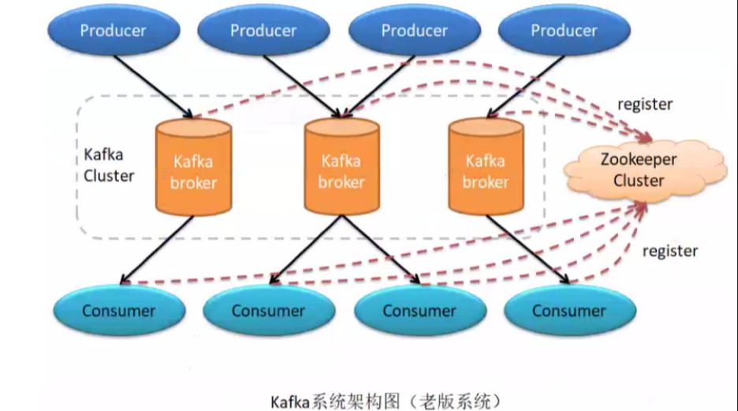

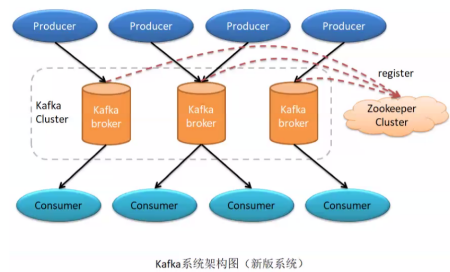

备注：老版本集群架构，消费者需要通过zk获取主题以及消费进度offset信息，因为zk不适合频繁数据写入，新版本元数据信息以及offset维护在broker上；

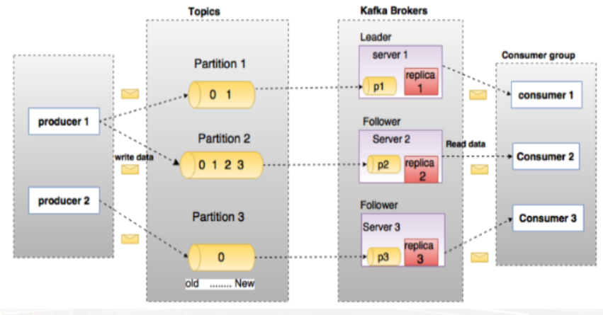

## 00、基本概念

### 01、Message、Messages And Batches

Message消息是Kafka中存储的最小最基本的单位，即为一个commit log，由一个固定长度的消息头和一个可变长度的消息体组成；其中主要由key和value构成,key和value都是字节数组。key的主要作用是根据一定的策略,将这个消息路由到指定的分区中,这样就可以保证包含同一个key的消息全部写入同一个分区

为减少网络开销，提高效率，多个消息会被放入同一批次 (Batch) 中后再写入。

### 02、Broker

消息中间件处理结点，一个Kafka节点就是一个broker，多个broker可以组成一个Kafka集群。

一个单独的Kafka server就是一个Broker,Broker的主要工作就是接收生产者发送来的消息,分配offset,然后将包装过的数据保存到磁盘上;此外,Broker还会接收消费者和其他Broker的请求,根据请求的类型进行相应的处理然后返回响应。多个Broker可以做成一个Cluster(集群)对外提供服务,每个Cluster当中会选出一个Broker来担任Controller,Controller是Kafka集群的指挥中心,其他的Broker则听从Controller指挥实现相应的功能。Controller负责管理分区的状态、管理每个分区的副本状态、监听zookeeper中数据的变化等。Controller也是一主多从的实现,所有的Broker都会监听Controller Leader的状态,当Leader Controller出现了故障的时候就重新选举新的Controller Leader。

### 03、Topic

一类消息，Kafka集群能够同时负责多个topic的分发。

### 04、Partition

topic物理上的分组，一个topic可以分为多个partition，每个partition是一个有序的队列。由于一个 Topic 包含多个分区，因此无法在整个 Topic 范围内保证消息的顺序性，但可以保证消息在单个分区内的顺序性。在集群中，一个分区 (Partition) 从属一个 Broker，该 Broker 被称为分区的首领 (Leader)。一个分区可以分配给多个 Brokers，这个时候会发生分区复制。这种复制机制为分区提供了消息冗余，如果有一个 Broker 失效，其他 Broker 可以接管领导权。

每个分区在本地磁盘上对应一个文件夹，分区命名规则为主题名称后接“—”连接符，之后再接分区编号，分区编号从0开始至分区总数减-1；

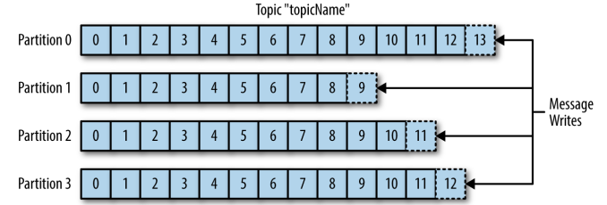

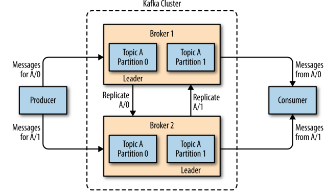

### 05、Log and Segment

分区在逻辑上对应着一个Log,当生产者将消息写入分区的时候,实际上就是写入到了一个Log中。Log是一个逻辑概念,对应的是一个磁盘上的文件夹。Log由多个Segment组成,每一个Segment又对应着一个具体的日志文件（“.log”的数据文件）和两个索引文件（“.index”和“.timeindex”，分别表示偏移量索引文件和消息时间戳索引文件）组成；

即partition物理上由多个segment组成。每个 segment 文件的最大大小相等。segment越大，文件越少，二分查找的次数就越少，效率越高

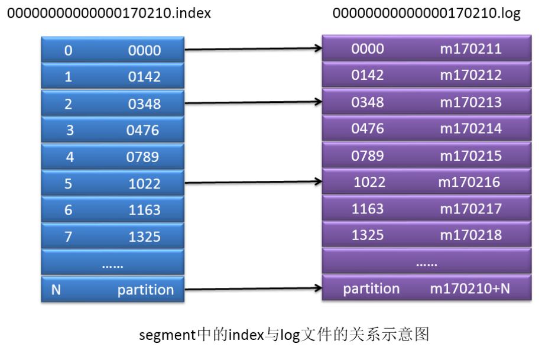

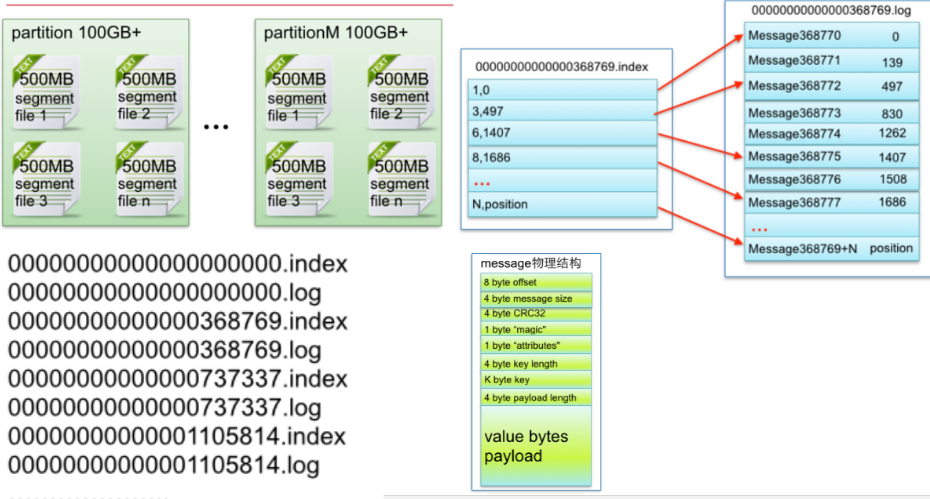

### 06、offset

每个partition都由一系列有序的、不可变的消息组成，这些消息被连续的追加到partition中。partition中的每个消息都有一个连续的序列号叫做offset，用于partition唯一标识一条消息。

### 07、Producer

负责发布消息到Kafka broker。

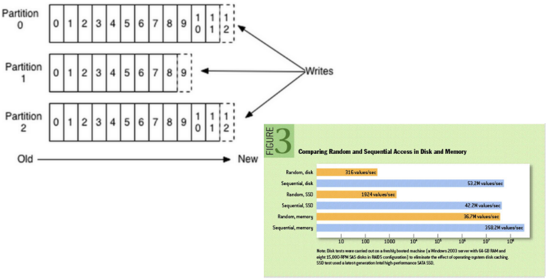

### 08、Consumer

消息消费者，向Kafka broker读取消息的客户端。消费者是消费者群组的一部分，消费者负责消费消息。消费者可以订阅一个或者多个主题，并按照消息生成的顺序来读取它们。消费者通过检查消息的偏移量 (offset) 来区分读取过的消息。偏移量是一个不断递增的数值，在创建消息时，Kafka 会把它添加到其中，在给定的分区里，每个消息的偏移量都是唯一的。消费者把每个分区最后读取的偏移量保存在 Zookeeper 或 Kafka 上，如果消费者关闭或者重启，它还可以重新获取该偏移量，以保证读取状态不会丢失。一个分区只能被同一个消费者群组里面的一个消费者读取，但可以被不同消费者群组中所组成的多个消费者共同读取。多个消费者群组中消费者共同读取同一个主题时，彼此之间互不影响。

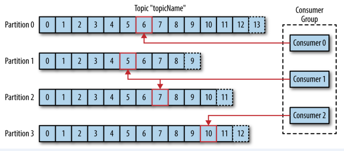

### 09、Consumer Group

每个Consumer属于一个特定的Consumer Group。Kafka 之所以要引入消费者群组这个概念是因为 Kafka 消费者经常会做一些高延迟的操作，比如把数据写到数据库或 HDFS ，或者进行耗时的计算，在这些情况下，单个消费者无法跟上数据生成的速度。此时可以增加更多的消费者，让它们分担负载，分别处理部分分区的消息，这就是 Kafka 实现横向伸缩的主要手段。需要注意的是：同一个分区只能被同一个消费者群组里面的一个消费者读取，不可能存在同一个分区被同一个消费者群里多个消费者共同读取的情况，这同时也提醒我们在使用时应该合理设置消费者的数量，以免造成闲置和额外开销。

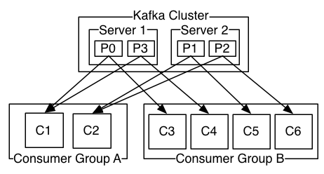

### 10、Broker Controller

Kafka 集群的多个 broker 中，有一个会被选举为 controller，负责管理整个集群中 partition 和 replicas 的状态。 例如，partition leader 故障，由 Controller 负责从 ISR 中的 followr 中重新选举出一个新的 leader。 再如，当某个 topic 的 partition 数量发生变化时，由 Controller 负责管理 partition 与消费者间的分配关系，即 Rebalance。 当前版本的 Kafka 只有 Controller 会向 zk 中注册 Watcher。 早期版本的 Kafka（0.8 版本及之前），每一个 broker 及 partition（所有副本）都会向 zk中注册 watcher。这种方式会导致 Kafka 的分区中出现脑裂。Controller进行选举期间不对外提供服务，选举出新的leader选举出以后，设置延迟时间来解决。

### 11、Partition Leader

每个 partition 有多个副本，其中有且仅有一个作为 Leader，Leader 是当前负责消息读写的 partition。即所有读写操作只能发生于 Leader 分区上。 Leader 与 Follower 是主备关系，不是主从关系。 Leader 宕机后，Broker Controller 会从 Follower 中选举出一个新的 Leader。 注意，这个选举不是由 zk 完成的。

### 12、Zookeeper

负责维护和协调 broker，负责 Broker Controller 的选举。 从 Kafka 0.9 版本开始，offset 的管理由 broker（coordinator） 负责管理与保存，不再由 zk 负责管理。 

总结：zk 负责 Broker 中 Controller 的选举，Partioin Leader 是由 Controller 负责选举的。 

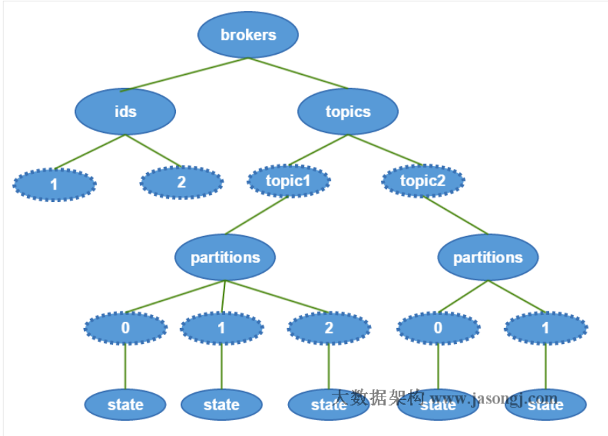

### 13、Coordinator 

一般指的是运行在每个 broker 上的 group Coordinator 进程，用于管理 Consumer Group 中的各个成员，主要用于 offset 位移管理和 Rebalance。一个 Coordinator 可以同时管理多个消费者组。

### 14、Rebalance 

当消费者组中消费者数量发生变化，或 Topic 中的 partition 数量发生了变化时， partition的所有权会在消费者间转移，即 partition 会重新分配，这个过程称为再均衡 Rebalance。 再均衡能够给消费者组及 broker 集群带来性高可用性和伸缩，但在再均衡期间消费者是无法读取消息的，即整个 broker 集群有一小段时间是不可用的。因此要避免不必要的再均衡。

### 15、Offset commit 

Consumer 从 partition 中取出一批消息写入到 buffer 对其进行消费，在规定时间内消费完消息后，会自动将其消费消息的 offset 提交给 broker，以让 broker 记录下哪些消息是消费过的。当然，若在时限内没有消费完毕，其是不会提交 offset 的。 发生 Rebalance 后会使用到之前提交的 offset。 系统会将提交的 offset 作为消息写入到__consumer_offsets 主题的 partition 中。不过需要注意，这个 offset 消息在写入时是有 key 的，其 key 为该 offset 所示消息的消费者的 id。那么该 offset 应该放到哪个 partition 中呢？其会首先计算出 key 的 hash 值，然后再将此 hash 与 50 进行取模。其余数即为相应的 partition 编号。

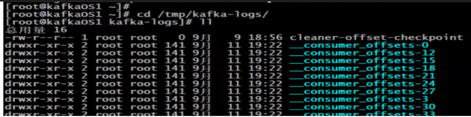

### 16、ISR集合  （In-SyncReplica）副本同步列表

指目前“可用”（alive）且消息量与Leader相差不多的副本集合，这是整个副本集合的一个子集。

ISR集合中的副本必须满足下面两个条件：
- （1）副本所在节点必须维持着与ZooKeeper的连接。
- （2）副本最后一条消息的offset与Leader副本的最后一条消息的offset之间的差值不能超出指定的阈值。

每个分区中的Leader副本都会维护此分区的ISR集合。写请求首先由Leader副本处理，之后Follower副本会从Leader上拉取写入的消息，这个过程会有一定的延迟，导致Follower副本中保存的消息略少于Leader副本，只要未超出阈值都是可以容忍的。如果一个Follower副本出现异常，比如：宕机，发生长时间GC而导致Kafka僵死或是网络断开连接导致长时间没有拉取消息进行同步，就会违反上面的两个条件，从而被Leader副本踢出ISR集合。当Follower副本从异常中恢复之后，会继续与Leader副本进行同步，当Follower副本“追上”（即最后一条消息的offset的差值小于指定阈值）Leader副本的时候，此Follower副本会被Leader副本重新加入到ISR中。

### 17、多副本策略

Kafka对消息进行了冗余备份,每一个分区都可以有多个副本,每一个副本中包含的消息是相同的(但不保证同一时刻下完全相同)。副本的类型分为Leader和Follower,当分区只有一个副本的时候,该副本属于Leader,没有Follower。Kafka的副本具有一定的同步机制,在每个副本集合中,都会选举出一个副本作为Leader副本,Kafka在不同的场景中会采用不同的选举策略。Kafka中所有的读写请求都由选举出的Leader副本处理,其他的都作为Follower副本,Follower副本仅仅是从Leader副本中把数据拉取到本地之后,同步更新到自己的Log中。

### 18、单播与广播

### 19、HW、HW 截断机制 与 LEO 

- HW，HighWatermark，高水位，表示 Consumer 可以消费到的最高 partition 偏移量。HW 保证了 Kafka 集群中消息的一致性。确切地说，是保证了 partition 的 Follower 与 Leader 间数据的一致性。 

- LEO，Log End Offset，日志最后消息的偏移量。消息是被写入到 Kafka 的日志文件中的，这是当前最后一个写入的消息在 Partition 中的偏移量。 对于 leader 新写入的消息，consumer 是不能立刻消费的。leader 会等待该消息被所有ISR中的partition follower 同步后才会更新HW，此时消息才能被consumer消费。

- 如果 partition leader 接收到了新的消息， ISR 中其它 Follower 正在同步过程中，还未同步完毕时leader宕机。此时就需要选举出新的leader。若没有HW截断机制，将会导致partition 中 leader 与 follower 数据的不一致。 当原 Leader 宕机后又恢复时，将其 LEO 回退到其宕机时的 HW，然后再与新的 Leader进行数据同步，这种机制称为 HW 截断机制。 HW 截断机制可能会引发消息的丢失。

比如：一个分区有3个副本，一个leader，2个follower。producer向leader写了10条消息，follower1从leader处拷贝了5条消息，follower2从leader处拷贝了3条消息，那么leader副本的LEO就是10，HW=3；follower1副本的LEO是5。

## 01、高性能

- 不同Partition可位于不同机器，因此可以充分利用集群优势，实现机器间的并行处理

- 同一节点上的不同Partition置于不同的disk drive(负载均衡)上，从而实现磁盘间的并行处理，充分发挥多磁盘的优势

- 充分利用Page Cache，I/O Scheduler会将连续的小块写组装成大块的物理写从而提高性能，顺序写磁盘，减少磁头移动

- Kafka删除Segment的方式，是直接删除Segment对应的整个log文件和整个index文件而非删除文件中的部分内容。

- 如果数据消费速度与生产速度相当，Follower和Leader甚至不需要通过物理磁盘交换数据，而是直接通过Page Cache交换数据

- Linux 2.4+内核通过sendfile系统调用，提供了零拷贝

- batch.size和linger.ms控制实际发送频率，从而实现批量发送

- 数据压缩(高效的序列化)降低网络负载

注: Partition个数决定了可能的最大并行度，Num(customer)>Num(Partion)没用

性能测试对比

http://www.jasongj.com/2015/12/31/KafkaColumn5_kafka_benchmark/

## 02、高可用

- 1、Replication，并HA(将所有Broker（假设共n个Broker）和待分配的Partition排序，将第i个Partition分配到第（i mod n）个Broker上，将第i个Partition的第j个Replica分配到第（(i + j) mod n）个Broker上)。

- 2、基于ISR（In-sync Replica）的数据复制方案，弹性较高，适合自定义

- 3、broker活着的判定。kafka判定broker是否活着，通过以下2个方式：1、和zk的session没有断（通过心跳来维系）；2、follower能及时将leader消息复制过来，不能落后太多（例如默认lag超过4000就会踢出ISR）；

- 4、所有replica都不工作的情况。如果所有副本都出问题，一般有两种选择：1、等待ISR中的任一个Replica“活”过来，并且选它作为Leader（一致性好，但是可用性差）；2、选择第一个“活”过来的Replica（不一定是ISR中的）作为Leader（一致性差，但是可用性相比第一种方式好）

## 03、消息写入过程

消息生产者将消息发送给 broker，并形成最终的可供消费者消费的 log，是一个比较复杂的过程。 

- producer 向 broker 集群提交连接请求，其所连接上的任意 broker 都会向其发送 broker controller 的通信 URL，即配置文件中的 listeners 地址

- 当 producer 指定了要生产的 topic 后，其会向 broker controller 发送请求，请求当前 topic 中所有 partition 的 leader 列表地址 

- broker controller 在接收到请求后，会从zk 中查找到指定topic的所有 partition的 leader，并返回给 producer 

- producer 在接收到 leader 列表地址后，根据消息路由策略找到当前要发送消息所要发送的 partition leader，然后将消息发送给该 leader 

- leader 将消息写入本地 log，并通知 ISR 中的 followers 

- ISR 中的 followers 从 leader 中同步消息后向 leader 发送 ACK 

- leader 收到所有 ISR 中的 followers 的 ACK 后，增加 HW，表示消费者已经可以消费到该位置了

> Kafka 生产者发送消息的过程：

+ Kafka 会将发送消息包装为 ProducerRecord 对象， ProducerRecord 对象包含了目标主题和要发送的内容，同时还可以指定键和分区。在发送 ProducerRecord 对象前，生产者会先把键和值对象序列化成字节数组，这样它们才能够在网络上传输。

+ 接下来，数据被传给分区器。如果之前已经在 ProducerRecord 对象里指定了分区，那么分区器就不会再做任何事情。如果没有指定分区 ，那么分区器会根据 ProducerRecord 对象的键来选择一个分区，紧接着，这条记录被添加到一个记录批次里，这个批次里的所有消息会被发送到相同的主题和分区上。有一个独立的线程负责把这些记录批次发送到相应的 broker 上。

+ 服务器在收到这些消息时会返回一个响应。如果消息成功写入 Kafka，就返回一个 RecordMetaData 对象，它包含了主题和分区信息，以及记录在分区里的偏移量。如果写入失败，则会返回一个错误。生产者在收到错误之后会尝试重新发送消息，如果达到指定的重试次数后还没有成功，则直接抛出异常，不再重试。

> Producer写

- kafka每条消息都被append到Partition中，属于顺序写磁盘，因此效率非常高（经验证，顺序写磁盘效率比随机写内存还要高，这是Kafka高吞吐率的一个很重要的保证）；

- Producer消息路由，Producer发送消息到broker时，会根据Paritition机制选择将其存储到哪一个Partition。如果Partition机制设置合理，所有消息可以均匀分布到不同的Partition里，这样就实现了负载均衡。如果一个Topic对应一个文件，那这个文件所在的机器I/O将会成为这个Topic的性能瓶颈，而有了Partition后，不同的消息可以并行写入不同broker的不同Partition里，极大的提高了吞吐率。在发送一条消息时，可以指定这条消息的key，Producer根据这个key和Partition机制来判断应该将这条消息发送到哪个Parition。

## 04、消息路由策略 

在通过api方式发送消息时生产者是以Record为消息进行发送的。Record中包含key和value，value才是我们真正的消息本身，而key用户路由消息所要存放的Partition。消息要写入到哪个partition不是随机的，而是有路由策略的。

- 若指定了partition，则直接写入到指定的partition。

- 若未指定partition，但指定了key，则通过对key的hash值与partition的数量进行取模，该结果就是要选出的partition索引。

- 若partition和key都未指定，则使用轮询算法选出一个partition。

## 05、消息发送的可靠性机制

生产者向 kafka 发送消息时，可以选择需要的可靠性级别。通过 acks 参数的值进行设置

- 1、0值

异步发送。生产者向 kafka 发送消息而不需要 kafka 反馈成功 ack。该方式效率最高，但可靠性最低。其可能会存在消息丢失的情况。 在传输过程中丢失：由于网络原因，生产者发送的消息根本就没有到达 Kafka，但生产者不知道，其会一直生产并发送消息给 Kafka。这种情况可能会出现大量的消息丢失。 在 broker 中丢失：当 broker 的缓存满时正准备给 partation 中写入时，此时到达的新的消息会丢失。

- 2、1值

同步发送，默认值。生产者发送消息给 kafka，broker 的 partition leader 在收到消息后马上发送成功 ack，生产者收到后知道消息发送成功，然后会再发送消息。如果一直未收到 kafka 的 ack，则生产者会认为消息发送失败，会重发消息。 

该方式不能保证消息发送成功。该方式仍会出现消息丢失的情况。

例如，当 leader 收到 消息后马上向 producer 发送的 ack，但此时在 follower 还没有同步数据时，该 leader 挂了。此时写入到原来 leader 中的消息就丢失了。因为这条消息对于 producer 来说，是发送成功了。但对于剩余的 follower 来说根本就没有存在过。

- 3、-1值

同步发送。生产者发送消息给 kafka，kafka 收到消息后要等到 ISR 列表中的所有副本都同步消息完成后，才向生产者发送成功 ack。如果一直未收到 kafka 的 ack，则认为消息发送失败，会自动重发消息。 

该方式很少会出现消息丢失的情况。但其存在消息重复接收的情况。为了解决重复接收（注意，重复接收，不是重复消费，这是两个概念）问题，Kafka 允许为消息指定唯一标识，并允许用户自定义去重机制。

## 06、消费者消费过程

生产者将消息发送到 topic 中，消费者即可对其进行消费，其消费过程如下：

- consumer 向 broker 集群提交连接请求，其所连接上的任意 broker 都会向其发送 broker controller 的通信 URL，即配置文件中的 listeners 地址

- 当 consumer 指定了要消费的 topic 后，其会向 broker controller 发送消费请求

- broker controller 会为 consumer 分配一个或几个 partition leader，并将该 partitioin 的当前 offset 发送给 consumer

- consumer 会按照 broker controller 分配的 partition 对其中的消息进行消费

- 当消费者消费完该条消息后，消费者会向 broker 发送一个该消息已被消费的反馈，即该消息的 offset 

- 当 broker 接到消费者的 offset 后，会更新到相应的__consumer_offset 中

- 以上过程一直重复，直到消费者停止请求消息 

- 消费者可以重置 offset，从而可以灵活消费存储在 broker 上的消息

> consumer读

- Kafka读取特定消息的时间复杂度为O(1)，即与文件大小无关，所以这里删除过期文件与提高Kafka性能无关。选择怎样的删除策略只与磁盘以及具体的需求有关；

- 这是Kafka用来实现一个Topic消息的广播（发给所有的Consumer）和单播（发给某一个Consumer）的手段。一个Topic可以对应多个Consumer Group。如果需要实现广播，只要每个Consumer有一个独立的Group就可以了。要实现单播只要所有的Consumer在同一个Group里；用Consumer Group还可以将Consumer进行自由的分组而不需要多次发送消息到不同的Topic；

- consumer通过pull来拉数据，自己来控制消费的速率；

## 07、Partition Leader 选举

当 leader 宕机后 broker controller 会从 ISR 中选一个 follower 成为新的 leader。但，若 ISR 中没有其它的副本怎么办？可以通过 unclean.leader.election.enable 的取值来设置 Leader 选举的范围。

- false：必须等待 ISR 列表中有副本活过来才进行新的选举。该策略可靠性有保证，但可用性低。

- true：在 ISR 中没有副本的情况下可以选择任何一个没有宕机主机中该 topic 的 partition 副本作为新的 leader，该策略可用性高，但可靠性没有保证。

## 08、重复消费问题及解决方案

最常见的重复消费有两种：

- 1、同一个 consumer 重复消费

当 Consumer 由于消费能力较低而引发了消费超时时，则可能会形成重复消费。 在时间到达时恰好某数据消费完毕，正准备提交 offset 但还没有提交时，时间到了。此时就会产生重复消费问题。 其解决方案是，延长 offset 提交时间。

- 2、不同的 consumer 重复消费

当 Consumer 消费了消息但还未提交 offset 时宕机。 其解决方案是将自动提交改为手动提交。

## 09、分区再均衡

因为群组里的消费者共同读取主题的分区，所以当一个消费者被关闭或发生崩溃时，它就离开了群组，原本由它读取的分区将由群组里的其他消费者来读取。同时在主题发生变化时 ， 比如添加了新的分区，也会发生分区与消费者的重新分配，分区的所有权从一个消费者转移到另一个消费者，这样的行为被称为再均衡。正是因为再均衡，所以消费费者群组才能保证高可用性和伸缩性。

消费者通过向群组协调器所在的 broker 发送心跳来维持它们和群组的从属关系以及它们对分区的所有权。只要消费者以正常的时间间隔发送心跳，就被认为是活跃的，说明它还在读取分区里的消息。消费者会在轮询消息或提交偏移量时发送心跳。如果消费者停止发送心跳的时间足够长，会话就会过期，群组协调器认为它已经死亡，就会触发再均衡。

## 10、delivery guarantee 消息投放确认，不丢不重复

这么几种可能的delivery guarantee：

At most once 消息可能会丢，但绝不会重复传输

At least one 消息绝不会丢，但可能会重复传输

Exactly once 每条消息肯定会被传输一次且仅传输一次，很多时候这是用户所想要的。

-Kafka默认保证At least once，并且允许通过设置Producer异步提交来实现At most once。而Exactly once要求与外部存储系统协作，幸运的是Kafka提供的offset可以非常直接非常容易得使用这种方式。

> 参考

- [/Kafka](http://www.jasongj.com/2015/03/10/KafkaColumn1/)