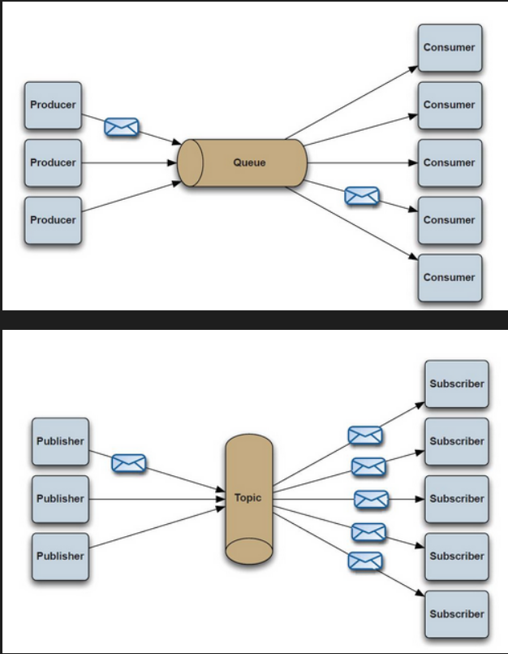
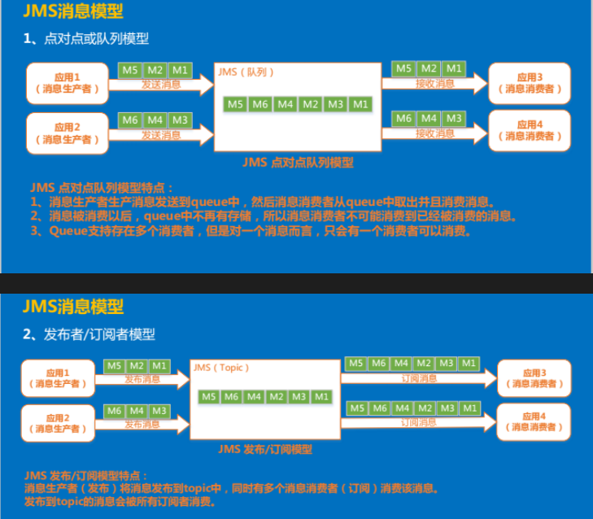
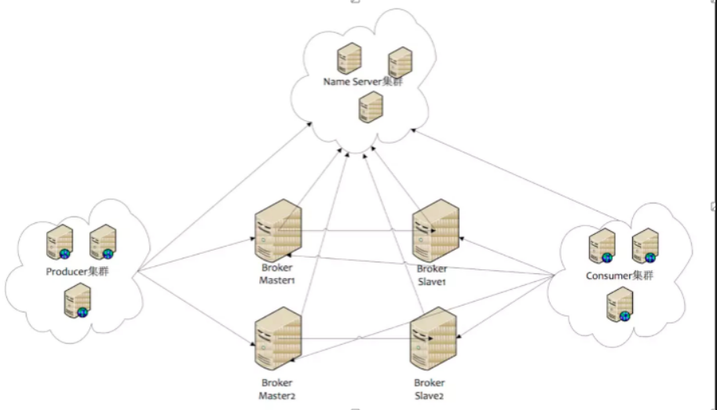
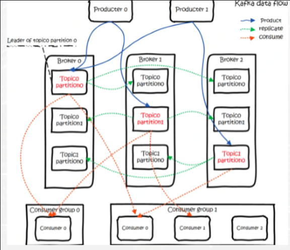
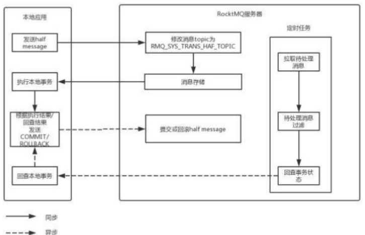

<!-- TOC -->

- [1、什么是消息中间件-协议](#1什么是消息中间件-协议)
    - [1、AMQP 协议](#1amqp-协议)
    - [2、MQTT协议](#2mqtt协议)
    - [3、STOMP协议](#3stomp协议)
    - [4、XMPP 协议](#4xmpp-协议)
- [2、使用场景](#2使用场景)
    - [1、异步通信](#1异步通信)
    - [2、解耦](#2解耦)
    - [3、冗余](#3冗余)
    - [4、扩展性](#4扩展性)
    - [5、过载保护](#5过载保护)
    - [6、可恢复性](#6可恢复性)
    - [7、顺序保证](#7顺序保证)
    - [8、缓冲](#8缓冲)
    - [9、数据流处理](#9数据流处理)
- [3、分布式消息队列两种模式](#3分布式消息队列两种模式)
- [4、主流消息中间件介绍](#4主流消息中间件介绍)
    - [1、RocketMQ](#1rocketmq)
    - [2、RabbitMq](#2rabbitmq)
    - [3、Redis](#3redis)
    - [4、ZeroMQ](#4zeromq)
    - [5、ActiveMQ](#5activemq)
    - [6、Kafka/Jafka](#6kafkajafka)
- [5、消息中间件引入的问题](#5消息中间件引入的问题)
    - [1、kafka](#1kafka)
    - [2、RocketMQ](#2rocketmq)

<!-- /TOC -->

消息中间件利用高效可靠的消息传递机制进行平台无关的数据交流，并基于数据通信来进行分布式系统的集成。通过提供消息传递和消息排队模型，它可以在分布式环境下扩展进程间的通信

# 1、什么是消息中间件-协议

## 1、AMQP 协议

Advanced Message Queuing Protocol,一个提供统一消息服务的应用层标准高级消息队列协议,是应用层协议的一个开放标准,为面向消息的中间件设计

RabbitMQ

优点：可靠、通用

## 2、MQTT协议

Message Queuing Telemetry Transport 消息队列遥测传输，IBM，物联网

优点：格式简洁、占用带宽小、移动端通信、PUSH、嵌入式系统

## 3、STOMP协议

Streaming Text Orientated Message Protocol 流文本定向消息协议。面向消息设计的简单文本协议

特点：命令模式

## 4、XMPP 协议

Extensible Messaging and Presence Protocol  可扩展消息处理现场协议 ，基于可扩展标记语言（XML）的协议

特点：通用公开、兼容性强、可扩展、安全性高，但XML编码格式占用带宽大

# 2、使用场景

消息队列在实际应用中常用的四个使用场景：

- 异步处理(注册)，
- 应用解耦（订单），
- 流量削锋（秒杀）和消息通讯、
- 日志收集

## 1、异步通信
有些业务不想也不需要立即处理消息。消息队列提供了异步处理机制，允许用户把一个消息放入队列，但并不立即处理它。想向队列中放入多少消息就放多少，然后在需要的时候再去处理它们。

## 2、解耦
降低工程间的强依赖程度，针对异构系统进行适配。在项目启动之初来预测将来项目会碰到什么需求，是极其困难的。通过消息系统在处理过程中间插入了一个隐含的、基于数据的接口层，两边的处理过程都要实现这一接口，当应用发生变化时，可以独立的扩展或修改两边的处理过程，只要确保它们遵守同样的接口约束。

## 3、冗余
有些情况下，处理数据的过程会失败。除非数据被持久化，否则将造成丢失。消息队列把数据进行持久化直到它们已经被完全处理，通过这一方式规避了数据丢失风险。许多消息队列所采用的”插入-获取-删除”范式中，在把一个消息从队列中删除之前，需要你的处理系统明确的指出该消息已经被处理完毕，从而确保你的数据被安全的保存直到你使用完毕。

## 4、扩展性
因为消息队列解耦了你的处理过程，所以增大消息入队和处理的频率是很容易的，只要另外增加处理过程即可。不需要改变代码、不需要调节参数。便于分布式扩容。

## 5、过载保护
在访问量剧增的情况下，应用仍然需要继续发挥作用，但是这样的突发流量无法提取预知；如果以为了能处理这类瞬间峰值访问为标准来投入资源随时待命无疑是巨大的浪费。使用消息队列能够使关键组件顶住突发的访问压力，而不会因为突发的超负荷的请求而完全崩溃。

## 6、可恢复性
系统的一部分组件失效时，不会影响到整个系统。消息队列降低了进程间的耦合度，所以即使一个处理消息的进程挂掉，加入队列中的消息仍然可以在系统恢复后被处理。

## 7、顺序保证
在大多使用场景下，数据处理的顺序都很重要。大部分消息队列本来就是排序的，并且能保证数据会按照特定的顺序来处理。

## 8、缓冲
在任何重要的系统中，都会有需要不同的处理时间的元素。消息队列通过一个缓冲层来帮助任务最高效率的执行，该缓冲有助于控制和优化数据流经过系统的速度。以调节系统响应时间。

## 9、数据流处理
分布式系统产生的海量数据流，如：业务日志、监控数据、用户行为等，针对这些数据流进行实时或批量采集汇总，然后进行大数据分析是当前互联网的必备技术，通过消息队列完成此类数据收集是最好的选择。

# 3、分布式消息队列两种模式

- 点对点模式：Queue队列，仅有一个订阅者会收到消息，消息一旦被处理就不会存在队列中
- 发布订阅模式：Topic主题 ，放入一个消息，所有订阅者都会收到，这个是主题目的地是一对多的

# 4、主流消息中间件介绍

针对消息中间件，如何解决下面的几个问题;

- 消息队列的高可用
- 保证消息不被重复消费
- 消息不丢失
- 顺序性
- 事务消息

## 1、RocketMQ

- Name Server 
- Broker
- Producer
- Consumer  

阿里系下开源的一款分布式、队列模型的消息中间件，原名Metaq，3.0版本名称改为RocketMQ，是阿里参照kafka设计思想使用java实现的一套mq。同时将阿里系内部多款mq产品（Notify、metaq）进行整合，只维护核心功能，去除了所有其他运行时依赖，保证核心功能最简化，在此基础上配合阿里上述其他开源产品实现不同场景下mq的架构，目前主要多用于订单交易系统。

- Name Server 保存 各broker 的topic 信息及 broker 的主备状态

- Broker由 Master 和 Slave 组成，一个Master 可以多个 Slaver；通过 Broker Name 指定 brokerId= 0 为master ；每个 broker 和 name server 保持长连接，Broker 定时向Name Server 同步 topic 信息，Name server 也会定时检测与 Broker 的链接

- Producer  producer 从 Name Server 获取 topic 的路由信息，并与 提供 topic的 Master（broker） 建立长连接

- Consumer consumer 从 Name Server 获取topic 路由信息，consumer 和 master（broker） 和 slaver （broker）都建立连接 通过Broker 配置

> 特点

- 能够保证严格的消息顺序;消息被发送时保持顺序,存储时保持顺序，消费时保持顺序
- 提供针对消息的过滤功能；支持按属性过滤 ，正则过滤基于SQL92
- 提供丰富的消息拉取模式
- 高效的订阅者水平扩展能力
- 实时的消息订阅机制
- 亿级消息堆积能力

## 2、RabbitMq

- Queue
- Exchange 
- Routing key
- Binding
- Binding key 

使用Erlang编写的一个开源的消息队列，本身支持很多的协议：AMQP，XMPP, SMTP,STOMP，也正是如此，使的它变的非常重量级，更适合于企业级的开发。同时实现了Broker架构，核心思想是生产者不会将消息直接发送给队列，消息在发送给客户端时先在中心队列排队。对路由(Routing)，负载均衡(Load balance)、数据持久化都有很好的支持。多用于进行企业级的ESB整合。

## 3、Redis

Redis是一个基于Key-Value对的NoSQL数据库，开发维护很活跃。虽然它是一个Key-Value数据库存储系统，但它本身支持MQ功能，所以完全可以当做一个轻量级的队列服务来使用。对于RabbitMQ和Redis的入队和出队操作，各执行100万次，每10万次记录一次执行时间。测试数据分为128Bytes、512Bytes、1K和10K四个不同大小的数据。

实验表明：入队时，当数据比较小时Redis的性能要高于RabbitMQ，而如果数据大小超过了10K，Redis则慢的无法忍受；出队时，无论数据大小，Redis都表现出非常好的性能，而RabbitMQ的出队性能则远低于Redis。

## 4、ZeroMQ

ZeroMQ号称最快的消息队列系统，尤其针对大吞吐量的需求场景。ZMQ能够实现RabbitMQ不擅长的高级/复杂的队列，但是开发人员需要自己组合多种技术框架，技术上的复杂度是对这MQ能够应用成功的挑战。ZeroMQ具有一个独特的非中间件的模式，你不需要安装和运行一个消息服务器或中间件，因为你的应用程序将扮演这个服务器角色。你只需要简单的引用ZeroMQ程序库，可以使用NuGet安装，然后你就可以愉快的在应用程序之间发送消息了。但是ZeroMQ仅提供非持久性的队列，也就是说如果宕机，数据将会丢失。其中，Twitter的Storm 0.9.0以前的版本中默认使用ZeroMQ作为数据流的传输（Storm从0.9版本开始同时支持ZeroMQ和Netty作为传输模块）。

## 5、ActiveMQ

　　ActiveMQ是Apache下的一个子项目。 类似于ZeroMQ，它能够以代理人和点对点的技术实现队列。同时类似于RabbitMQ，它少量代码就可以高效地实现高级应用场景。

## 6、Kafka/Jafka

　　Kafka是Apache下的一个子项目，是一个高性能跨语言分布式发布/订阅消息队列系统，而Jafka是在Kafka之上孵化而来的，即Kafka的一个升级版。具有以下特性：
- 快速持久化，可以在O(1)的系统开销下进行消息持久化；
- 高吞吐，在一台普通的服务器上既可以达到10W/s的吞吐速率；
- 完全的分布式系统，Broker、Producer、Consumer都原生自动支持分布式，自动实现负载均衡；
- 支持Hadoop数据并行加载，对于像Hadoop的一样的日志数据和离线分析系统，但又要求实时处理的限制，这是一个可行的解决方案。Kafka通过Hadoop的并行加载机制统一了在线和离线的消息处理。

Apache Kafka相对于ActiveMQ是一个非常轻量级的消息系统，除了性能非常好之外，还是一个工作良好的分布式系统。

# 5、消息中间件引入的问题

- 消息队列的高可用（分片+副本机制，主分片负责写，然后同步给其他分片；读可以从全部分片选择一个即可）
- 保证消息不被重复消费
- 消息不丢失
- 顺序性
- 事务消息

## 1、kafka

> 高可用（Replicate 副本机制）

- topic 消息拆分成多个 partition 
- partition 存储在多个 broker 中
- 每个partition 在broker 中存储多份副本
- 每个 partition 会选出一个 leader 其他的均为 flower
- 读写均发生在 leader 中（不能读副本？？？）
- flower 通过pull 从 leader 中拉取数据

## 2、RocketMQ

> 事务两阶段提交协议

- 1、执行本地事务前发送 half message
- 2、Server 端标识 消息为 事务消息，并进行持久化；
- 3、执行本地事务
- 4、本地事务结果已异步形式通知Server 事务结果
- 5、Server 定时检查所有事务消息并回调Client 端检查事务状态 

Server 端将 所有half message 存储到一个单独的 topic 中；

Server 端检查 事务消息时，是将消息获取出来，检查结束后放回队列中；保证顺序性

