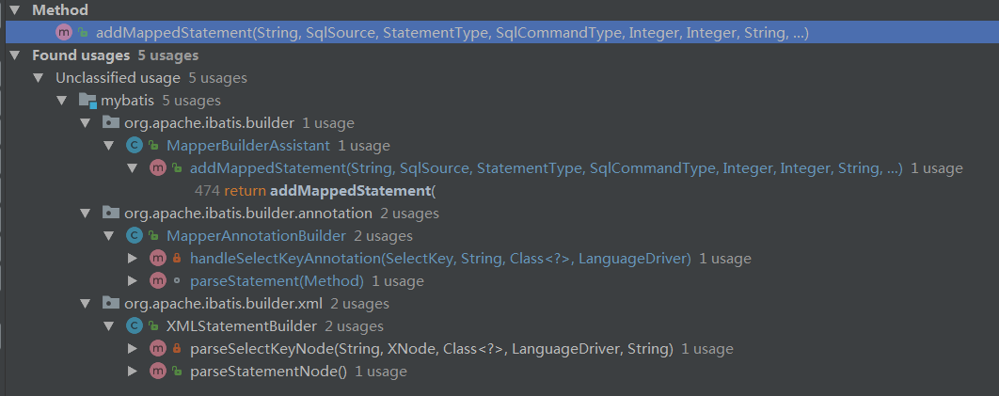
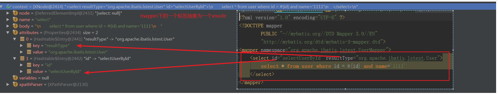

MappedStatement生成逻辑

1、如何把编写的SQL映射为MappedStatement对象，并注册到Configuration配置对象的注册中心Map<String, MappedStatement> mappedStatements中的？

发现对Configuration.mappedStatements进行操作的入口在MapperBuilderAssistant#addMappedStatement()中，而通过上图发现，整个框架只会在以下两个类中调用：

- 1、MapperAnnotationBuilder的方法handleSelectKeyAnnotation\parseStatement
- 2、XMLStatementBuilder的方法parseSelectKeyNode\parseStatementNode

可以猜出，这两个类分别对应通过mapper接口添加注解的方式写SQL和通过xml文件的格式编写SQL。

备注：

- 1、其中MapperAnnotationBuilder会在注册mapper接口到MapperRegistry时被调用（MapperRegistry#addMapper）。即先完成mapper接口的注册，在进行mapper接口上对应的注解SQL解析为mappedStatement注册到mappedStatements中。

- 2、XMLMapperBuilder#parse被用来解析编辑SQL的xml文件。会先调用XMLStatementBuilder解析xml中定义的各个节点，然后再对当前xml的namespace对应的mapper接口进行注册，MapperRegistry#addMapper。

可以看出xml文件的解析和对应的mapper接口会互相尝试让对方也完成注册。

> mapper.xml文件中的标签抽象为一个xnode

