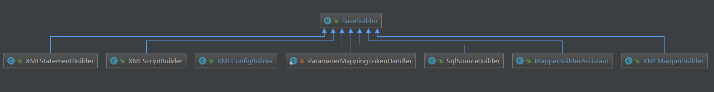

`MapperScan这个注解是mybatis-spring中的。`


已知，mybatis自带的基于mapper接口的查询，通过jdk的动态代理最后交给sqlsession去执行。生成流程：

- 1、sqlsession.getMapper(UserMapper.class)
- 2、configuration.getMapper(type, this) 核心这里有个全部的mapper接口和接口的代理实例的注册中心MapperRegistry。
- 3、mapperRegistry.getMapper(type, sqlSession)
- 4、mapperProxyFactory.newInstance(sqlSession)
- 5、mapperProxyFactory.newInstance(MapperProxy) 这里调用jdk的生成动态代理；


备注：从上面可知，核心在第2步，完成mapper接口注册到mapper接口的注册中心MapperRegistry。一旦完成了注册，后面的处理逻辑就是固定的：
- 1、取出当前mapper接口对应的MapperProxy动态代理工厂mapperProxyFactory；
- 2、基于该工厂实例化MapperProxy（封装了sqlsession，对接口的调用全部转化为对sqlsession的调用---通过方法名映射）对象，并且返回mapper接口jdk动态实例。


> 问题：如何把mapper接口注册到configuration内的注册中心MapperRegistry上去？有哪几种方式？


# 01、Mapper接口的注册

## 1、通过mybatis-config.xml配置

mybatis的核心配置文件mybatis-config.xml的层级格式

- configuration（配置）
    - properties（属性）
    - settings（设置）
    - typeAliases（类型别名）
    - typeHandlers（类型处理器）
    - objectFactory（对象工厂）
    - plugins（插件）
    - environments（环境配置）
        - environment（环境变量）
            - transactionManager（事务管理器）
            - dataSource（数据源）
    - databaseIdProvider（数据库厂商标识）
    - mappers（映射器）


这里对应到mapper接口类的解析为mappers节点下的配置。

可以参考： https://mybatis.org/mybatis-3/zh/configuration.html#mappers

我们需要告诉 MyBatis 到哪里去找到这些语句。 在自动查找资源方面，Java 并没有提供一个很好的解决方案，所以最好的办法是直接告诉 MyBatis 到哪里去找映射文件。 你可以使用相对于类路径的资源引用，或完全限定资源定位符（包括 file:/// 形式的 URL），或类名和包名等。

```xml
<!-- 方式1：使用相对于类路径的资源引用 -->
<mappers>
  <mapper resource="org/mybatis/builder/AuthorMapper.xml"/>
  <mapper resource="org/mybatis/builder/BlogMapper.xml"/>
  <mapper resource="org/mybatis/builder/PostMapper.xml"/>
</mappers>
<!-- 方式2：使用完全限定资源定位符（URL） -->
<mappers>
  <mapper url="file:///var/mappers/AuthorMapper.xml"/>
  <mapper url="file:///var/mappers/BlogMapper.xml"/>
  <mapper url="file:///var/mappers/PostMapper.xml"/>
</mappers>
<!-- 方式3：使用映射器接口实现类的完全限定类名 -->
<mappers>
  <mapper class="org.mybatis.builder.AuthorMapper"/>
  <mapper class="org.mybatis.builder.BlogMapper"/>
  <mapper class="org.mybatis.builder.PostMapper"/>
</mappers>
<!-- 方式4：将包内的映射器接口实现全部注册为映射器 -->
<mappers>
  <package name="org.mybatis.builder"/>
</mappers>
```

备注：官方给的四种方式，归为两类：1、指定mapper接口类的位置；2、指定xml文件的位置。

```java
public void test_mapper() throws Exception {
        String resource = "mybatis-config.xml";
        InputStream inputStream = Resources.getResourceAsStream(resource);
        SqlSessionFactory sqlSessionFactory = new SqlSessionFactoryBuilder().build(inputStream);
        SqlSession session = sqlSessionFactory.openSession();
        try {

            UserMapper mapper = session.getMapper(UserMapper.class);
            User user = mapper.selectUserById(1);
            System.out.println(user);
        } finally {
            session.close();
        }
    }
```


流程：

- 1、new SqlSessionFactoryBuilder().build(inputStream)；
- 2、XMLConfigBuilder#parse--->parseConfiguration(XNode root)
- 3、XMLConfigBuilder.mapperElement(XNode parent)

```java
  private void mapperElement(XNode parent) throws Exception {
    if (parent != null) {
      for (XNode child : parent.getChildren()) {
        if ("package".equals(child.getName())) {//方式4
          String mapperPackage = child.getStringAttribute("name");
          configuration.addMappers(mapperPackage);//在spring的配置文件中配置包路径<configuration><mappers><package>节点的
        } else {
          String resource = child.getStringAttribute("resource");
          String url = child.getStringAttribute("url");
          String mapperClass = child.getStringAttribute("class");
          if (resource != null && url == null && mapperClass == null) {//方式1
            ErrorContext.instance().resource(resource);
            InputStream inputStream = Resources.getResourceAsStream(resource);
            XMLMapperBuilder mapperParser = new XMLMapperBuilder(inputStream, configuration, resource, configuration.getSqlFragments());
            mapperParser.parse();//处理mapper.xml注册statement
          } else if (resource == null && url != null && mapperClass == null) {//方式2
            ErrorContext.instance().resource(url);
            InputStream inputStream = Resources.getUrlAsStream(url);
            XMLMapperBuilder mapperParser = new XMLMapperBuilder(inputStream, configuration, url, configuration.getSqlFragments());
            mapperParser.parse();////处理mapper.xml注册statement
          } else if (resource == null && url == null && mapperClass != null) {//方式3
            Class<?> mapperInterface = Resources.classForName(mapperClass);
            configuration.addMapper(mapperInterface);//使用映射器接口实现类的完全限定类名
          } else {
            throw new BuilderException("A mapper element may only specify a url, resource or class, but not more than one.");
          }
        }
      }
    }
  }
```

备注：核心是在类XMLConfigBuilder中做解析。


## 2、通过注解的方式


参考：http://mybatis.org/spring/zh/mappers.html


# 02、spring整合Mapper接口


## 1、手动一个个注册映射器（核心MapperFactoryBean类）

### 1、XML 配置

```xml
<bean id="userMapper" class="org.mybatis.spring.mapper.MapperFactoryBean">
  <property name="mapperInterface" value="org.mybatis.spring.sample.mapper.UserMapper" />
  <property name="sqlSessionFactory" ref="sqlSessionFactory" />
</bean>
```

### 2、Java 配置

```java
@Bean
public MapperFactoryBean<UserMapper> userMapper() throws Exception {
  MapperFactoryBean<UserMapper> factoryBean = new MapperFactoryBean<>(UserMapper.class);
  factoryBean.setSqlSessionFactory(sqlSessionFactory());
  return factoryBean;
}
```

## 2、spring的自动发现

- 使用 <mybatis:scan/> 元素 ：spring的配置文件中使用，比如：<mybatis:scan base-package="org.mybatis.spring.sample.mapper" />
- 使用 @MapperScan 注解
- 在经典 Spring XML 配置文件中注册一个 MapperScannerConfigurer


> BaseBuilder继承图




# 03、spring整合原理解析

## 1、MapperFactoryBean（核心）

核心逻辑是，会把mapperInterface接口类进行注册configuration.addMapper(this.mapperInterface)，时机是在对象的构建时InitializingBean.afterPropertiesSet()方法中被调用。在spring容器内生成的实例对象是通过getObject()动态代理对象。

```java
public class MapperFactoryBean<T> extends SqlSessionDaoSupport implements FactoryBean<T> {

  private Class<T> mapperInterface;//mapper接口的类型

  private boolean addToConfig = true;

  public MapperFactoryBean() {
    // intentionally empty
  }

  public MapperFactoryBean(Class<T> mapperInterface) {
    this.mapperInterface = mapperInterface;
  }

 
  @Override
  protected void checkDaoConfig() {
    super.checkDaoConfig();

    notNull(this.mapperInterface, "Property 'mapperInterface' is required");

    Configuration configuration = getSqlSession().getConfiguration();
    if (this.addToConfig && !configuration.hasMapper(this.mapperInterface)) {//判断在configuration是否已经注册过，没有的话进行注册
      try {
        configuration.addMapper(this.mapperInterface);//注册接口
      } catch (Exception e) {
        logger.error("Error while adding the mapper '" + this.mapperInterface + "' to configuration.", e);
        throw new IllegalArgumentException(e);
      } finally {
        ErrorContext.instance().reset();
      }
    }
  }

  
  @Override
  public T getObject() throws Exception {//重点，这里生成动态代理对象
    return getSqlSession().getMapper(this.mapperInterface);
  }

  
  @Override
  public boolean isSingleton() {
    return true;
  }
}
```


```java
public class SqlSessionTemplate implements SqlSession, DisposableBean {//实现了mybatis的SqlSession接口，代理模式
@Override
  public <T> T getMapper(Class<T> type) {//这里从Configuration配置类中获取Mapper接口实例，获取的是MapperProxy代理的sqlsession对象
    return getConfiguration().getMapper(type, this);
  }

}

```


### 1、FactoryBean

```java
public interface FactoryBean<T> {
    String OBJECT_TYPE_ATTRIBUTE = "factoryBeanObjectType";

    @Nullable
    T getObject() throws Exception;

    @Nullable
    Class<?> getObjectType();

    default boolean isSingleton() {
        return true;
    }
}
```

### 2、SqlSessionDaoSupport封装sqlsession提供dao访问数据库

```java
public abstract class SqlSessionDaoSupport extends DaoSupport {
private SqlSessionTemplate sqlSessionTemplate;

public void setSqlSessionFactory(SqlSessionFactory sqlSessionFactory) {//优先使用sqlSessionTemplate，没有的话使用sqlSessionFactory创建
    if (this.sqlSessionTemplate == null || sqlSessionFactory != this.sqlSessionTemplate.getSqlSessionFactory()) {
      this.sqlSessionTemplate = createSqlSessionTemplate(sqlSessionFactory);
    }
  }

protected SqlSessionTemplate createSqlSessionTemplate(SqlSessionFactory sqlSessionFactory) {
    return new SqlSessionTemplate(sqlSessionFactory);
  }

}

@Override
  protected void checkDaoConfig() {
    notNull(this.sqlSessionTemplate, "Property 'sqlSessionFactory' or 'sqlSessionTemplate' are required");
  }
```

### 3、DaoSupport

```java
public abstract class DaoSupport implements InitializingBean {
    protected final Log logger = LogFactory.getLog(this.getClass());

    public DaoSupport() {
    }

    public final void afterPropertiesSet() throws IllegalArgumentException, BeanInitializationException {
        this.checkDaoConfig();//模板方法

        try {
            this.initDao();
        } catch (Exception var2) {
            throw new BeanInitializationException("Initialization of DAO failed", var2);
        }
    }

    protected abstract void checkDaoConfig() throws IllegalArgumentException;

    protected void initDao() throws Exception {
    }
}
```

## 2、MapperScannerConfigurer

MapperScannerConfigurer 是一个 BeanDefinitionRegistryPostProcessor，这样就可以作为一个 bean，包含在经典的 XML 应用上下文中。为了配置 MapperScannerConfigurer，使用下面的 Spring 配置：

```xml
<bean class="org.mybatis.spring.mapper.MapperScannerConfigurer">
  <property name="basePackage" value="org.mybatis.spring.sample.mapper" />
</bean>

```

原理:它会借助于ClassPathMapperScanner把basePackage下的mapper接口转化为MapperFactoryBean对象，注册到spring容器中。


源码解析


```java
public class MapperScannerConfigurer
    implements BeanDefinitionRegistryPostProcessor, InitializingBean, ApplicationContextAware, BeanNameAware {

  private String basePackage;//需要处理的mapper接口包

  private boolean addToConfig = true;

  private String lazyInitialization;

  private SqlSessionFactory sqlSessionFactory;

  private SqlSessionTemplate sqlSessionTemplate;

  private String sqlSessionFactoryBeanName;//用户可以选配置

  private String sqlSessionTemplateBeanName;//用户可以选配置

  private Class<? extends Annotation> annotationClass;

  private Class<?> markerInterface;

  private Class<? extends MapperFactoryBean> mapperFactoryBeanClass;

  private ApplicationContext applicationContext;

  private String beanName;

  private boolean processPropertyPlaceHolders;

  private BeanNameGenerator nameGenerator;

@Override
  public void postProcessBeanDefinitionRegistry(BeanDefinitionRegistry registry) {
    if (this.processPropertyPlaceHolders) {
      processPropertyPlaceHolders();
    }

    ClassPathMapperScanner scanner = new ClassPathMapperScanner(registry);
    scanner.setAddToConfig(this.addToConfig);
    scanner.setAnnotationClass(this.annotationClass);
    scanner.setMarkerInterface(this.markerInterface);
    scanner.setSqlSessionFactory(this.sqlSessionFactory);
    scanner.setSqlSessionTemplate(this.sqlSessionTemplate);
    scanner.setSqlSessionFactoryBeanName(this.sqlSessionFactoryBeanName);
    scanner.setSqlSessionTemplateBeanName(this.sqlSessionTemplateBeanName);
    scanner.setResourceLoader(this.applicationContext);
    scanner.setBeanNameGenerator(this.nameGenerator);
    scanner.setMapperFactoryBeanClass(this.mapperFactoryBeanClass);
    if (StringUtils.hasText(lazyInitialization)) {
      scanner.setLazyInitialization(Boolean.valueOf(lazyInitialization));
    }
    scanner.registerFilters();
    //这里添加处理逻辑，跳转到doScan方法进行处理
    scanner.scan(
        StringUtils.tokenizeToStringArray(this.basePackage, ConfigurableApplicationContext.CONFIG_LOCATION_DELIMITERS));
  }


    }
```


### 1、ClassPathMapperScanner

核心思想是在bean容器对象的生成过程中留下的扩展接口，通过这些扩展接口来改变生成的容器对象实例的内容。


```java
public class ClassPathMapperScanner extends ClassPathBeanDefinitionScanner {//

  private static final Logger LOGGER = LoggerFactory.getLogger(ClassPathMapperScanner.class);

  private boolean addToConfig = true;

  private boolean lazyInitialization;

  private SqlSessionFactory sqlSessionFactory;

  private SqlSessionTemplate sqlSessionTemplate;

  private String sqlSessionTemplateBeanName;

  private String sqlSessionFactoryBeanName;

  private Class<? extends Annotation> annotationClass;

  private Class<?> markerInterface;

  private Class<? extends MapperFactoryBean> mapperFactoryBeanClass = MapperFactoryBean.class;


    /**
   * Calls the parent search that will search and register all the candidates. Then the registered objects are post
   * processed to set them as MapperFactoryBeans
   */
  @Override
  public Set<BeanDefinitionHolder> doScan(String... basePackages) {//父类留下的模板方法，具体的bean注册逻辑
    Set<BeanDefinitionHolder> beanDefinitions = super.doScan(basePackages);//解析到一组mapper接口类。如果指定的包范围过大，会不会把不是mapper接口的类也处理了？

    if (beanDefinitions.isEmpty()) {
      LOGGER.warn(() -> "No MyBatis mapper was found in '" + Arrays.toString(basePackages)
          + "' package. Please check your configuration.");
    } else {
      processBeanDefinitions(beanDefinitions);//完成mapper接口到MapperFactoryBean之间的转化
    }

    return beanDefinitions;
  }
  //这里应该是把一个bean转化为MapperFactoryBean，并添加各个属性字段的值
  private void processBeanDefinitions(Set<BeanDefinitionHolder> beanDefinitions) {
    GenericBeanDefinition definition;
    for (BeanDefinitionHolder holder : beanDefinitions) {
      definition = (GenericBeanDefinition) holder.getBeanDefinition();
      String beanClassName = definition.getBeanClassName();
      LOGGER.debug(() -> "Creating MapperFactoryBean with name '" + holder.getBeanName() + "' and '" + beanClassName
          + "' mapperInterface");

      // the mapper interface is the original class of the bean
      // but, the actual class of the bean is MapperFactoryBean
      definition.getConstructorArgumentValues().addGenericArgumentValue(beanClassName); // issue #59
      definition.setBeanClass(this.mapperFactoryBeanClass);//应该是这里把接口转化为MapperFactoryBean类型的

      definition.getPropertyValues().add("addToConfig", this.addToConfig);//添加addToConfig属性字段的值

      boolean explicitFactoryUsed = false;
      if (StringUtils.hasText(this.sqlSessionFactoryBeanName)) {
        definition.getPropertyValues().add("sqlSessionFactory",
            new RuntimeBeanReference(this.sqlSessionFactoryBeanName));
        explicitFactoryUsed = true;
      } else if (this.sqlSessionFactory != null) {
        definition.getPropertyValues().add("sqlSessionFactory", this.sqlSessionFactory);
        explicitFactoryUsed = true;
      }

      if (StringUtils.hasText(this.sqlSessionTemplateBeanName)) {
        if (explicitFactoryUsed) {
          LOGGER.warn(
              () -> "Cannot use both: sqlSessionTemplate and sqlSessionFactory together. sqlSessionFactory is ignored.");
        }
        definition.getPropertyValues().add("sqlSessionTemplate",
            new RuntimeBeanReference(this.sqlSessionTemplateBeanName));
        explicitFactoryUsed = true;
      } else if (this.sqlSessionTemplate != null) {
        if (explicitFactoryUsed) {
          LOGGER.warn(
              () -> "Cannot use both: sqlSessionTemplate and sqlSessionFactory together. sqlSessionFactory is ignored.");
        }
        definition.getPropertyValues().add("sqlSessionTemplate", this.sqlSessionTemplate);
        explicitFactoryUsed = true;
      }

      if (!explicitFactoryUsed) {
        LOGGER.debug(() -> "Enabling autowire by type for MapperFactoryBean with name '" + holder.getBeanName() + "'.");
        definition.setAutowireMode(AbstractBeanDefinition.AUTOWIRE_BY_TYPE);
      }
      definition.setLazyInit(lazyInitialization);
    }
  }

}
```


## 3、MapperScan


原理：通过@Import(MapperScannerRegistrar.class)在spring容器中实例化一个配置类MapperScannerRegistrar，在这里类内部，获取MapperScan注解我们配置的值，比如basePackages，基于这些属性，在spring容器内部实例化一个MapperScannerConfigurer配置类，和我们使用xml或者bean实例化的效果一样。


```java
@Retention(RetentionPolicy.RUNTIME)
@Target(ElementType.TYPE)
@Documented
@Import(MapperScannerRegistrar.class)
@Repeatable(MapperScans.class)
public @interface MapperScan {//接口的自动扫描处理

  
  String[] value() default {};
  
  String[] basePackages() default {};

  Class<?>[] basePackageClasses() default {};

  Class<? extends BeanNameGenerator> nameGenerator() default BeanNameGenerator.class;

  Class<? extends Annotation> annotationClass() default Annotation.class;

  Class<?> markerInterface() default Class.class;

  String sqlSessionTemplateRef() default "";

  String sqlSessionFactoryRef() default "";

  Class<? extends MapperFactoryBean> factoryBean() default MapperFactoryBean.class;

  String lazyInitialization() default "";

}

```


