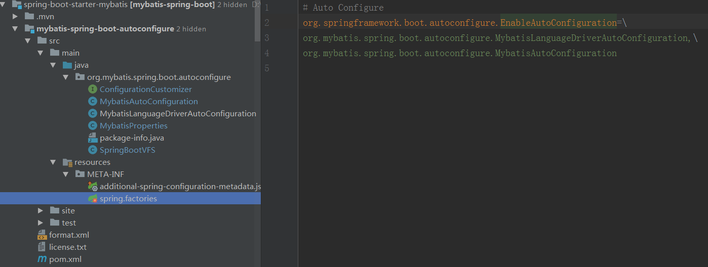
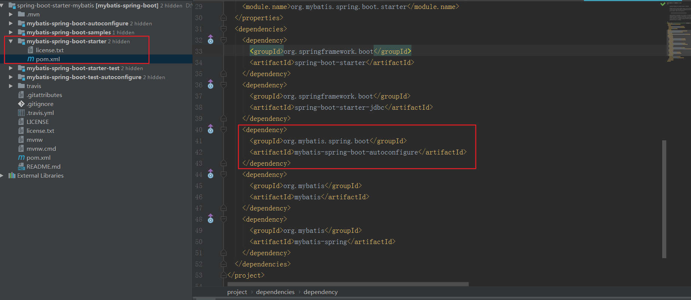

<!-- TOC -->

- [1、mybatis-spring-boot项目结构](#1mybatis-spring-boot项目结构)
    - [1、spring.factories](#1springfactories)
    - [2、MybatisAutoConfiguration](#2mybatisautoconfiguration)
    - [3、MybatisProperties](#3mybatisproperties)

<!-- /TOC -->

mybatis-spring-boot-starter是如何运行的？


# 1、mybatis-spring-boot项目结构





从上面可以看到，实现自动化配置的逻辑写在mybatis-spring-boot-autoconfigure模块，该模块的maven依赖基本都是<optional>true</optional>的，只有在使用的地方引入了对应的包依赖才会是正在的引入了对应的jar包。比如，这里在mybatis-spring-boot-starter模块引入mybatis相关的依赖包。

然后，另外一个模块mybatis-spring-boot-starter是用来封装mybatis实现自动化配置，该模块只有一个pom文件来定义依赖jar包。


需要中的关注的内容，其他的可以先忽略：

- 1、spring.factories
- 2、MybatisAutoConfiguration
- 3、MybatisProperties


## 1、spring.factories

```
# Auto Configure
org.springframework.boot.autoconfigure.EnableAutoConfiguration=\
org.mybatis.spring.boot.autoconfigure.MybatisLanguageDriverAutoConfiguration,\
org.mybatis.spring.boot.autoconfigure.MybatisAutoConfiguration

```

根据springboot的自动装配机制可知，项目中一旦引入了依赖mybatis-spring-boot-starter，spring容器会尝试加载MybatisLanguageDriverAutoConfiguration和MybatisAutoConfiguration。先只关注MybatisAutoConfiguration。

## 2、MybatisAutoConfiguration

实现的功能就像我们写的普通spring项目，配置一个DataSource，然后基于DataSource配置一个SqlSessionFactory，然后再配置一个SqlSessionTemplate。

备注：这里在扫描mapper接口时，会在basepackage包路径下过滤添加了@Mapper注解的接口。剩下的工作机制和spring结合mybatis一样。

```java
/**
以下配置可以保证sqlSessionFactory、sqlSessionTemplate、dataSource等mybatis所需的组件均可被自动配置，
 @Configuration注解已经提供了Spring的上下文环境，所以以上组件的配置方式与Spring启动时通过mybatis.xml文件进行配置起到一个效果。
 通过分析我们可以发现，只要一个基于SpringBoot项目的类路径下存在SqlSessionFactory.class, SqlSessionFactoryBean.class，
 并且容器中已经注册了dataSourceBean，就可以触发自动化配置，意思说我们只要在maven的项目中加入了mybatis所需要的若干依赖，
 就可以触发自动配置，但引入mybatis原生依赖的话，每集成一个功能都要去修改其自动化配置类，那就得不到开箱即用的效果了。
 所以Spring-boot为我们提供了统一的starter可以直接配置好相关的类，触发自动配置所需的依赖
 */
@org.springframework.context.annotation.Configuration
@ConditionalOnClass({ SqlSessionFactory.class, SqlSessionFactoryBean.class })//含义是引入mybatis的包才解析MybatisAutoConfiguration配置类,否则不解析这一个配置类
@ConditionalOnSingleCandidate(DataSource.class)//spring中只有一个或者多个实例，有一个被@Primary修饰
@EnableConfigurationProperties(MybatisProperties.class)//把MybatisProperties类进行实例化
@AutoConfigureAfter({ DataSourceAutoConfiguration.class, MybatisLanguageDriverAutoConfiguration.class })//保证配置类的加载顺序，这里配置的类保证下加载了
public class MybatisAutoConfiguration implements InitializingBean {

  private static final Logger logger = LoggerFactory.getLogger(MybatisAutoConfiguration.class);

  private final MybatisProperties properties;

  private final Interceptor[] interceptors;

  private final TypeHandler[] typeHandlers;

  private final LanguageDriver[] languageDrivers;

  private final ResourceLoader resourceLoader;

  private final DatabaseIdProvider databaseIdProvider;

  private final List<ConfigurationCustomizer> configurationCustomizers;
  //构造函数注入属性字段
  public MybatisAutoConfiguration(MybatisProperties properties, ObjectProvider<Interceptor[]> interceptorsProvider,
      ObjectProvider<TypeHandler[]> typeHandlersProvider, ObjectProvider<LanguageDriver[]> languageDriversProvider,
      ResourceLoader resourceLoader, ObjectProvider<DatabaseIdProvider> databaseIdProvider,
      ObjectProvider<List<ConfigurationCustomizer>> configurationCustomizersProvider) {
    this.properties = properties;
    this.interceptors = interceptorsProvider.getIfAvailable();
    this.typeHandlers = typeHandlersProvider.getIfAvailable();
    this.languageDrivers = languageDriversProvider.getIfAvailable();
    this.resourceLoader = resourceLoader;
    this.databaseIdProvider = databaseIdProvider.getIfAvailable();
    this.configurationCustomizers = configurationCustomizersProvider.getIfAvailable();
  }

  @Override
  public void afterPropertiesSet() {
    checkConfigFileExists();//检测配置文件的路径是否正确
  }

  private void checkConfigFileExists() {
    if (this.properties.isCheckConfigLocation() && StringUtils.hasText(this.properties.getConfigLocation())) {
      Resource resource = this.resourceLoader.getResource(this.properties.getConfigLocation());
      Assert.state(resource.exists(),
          "Cannot find config location: " + resource + " (please add config file or check your Mybatis configuration)");
    }
  }

  @Bean
  @ConditionalOnMissingBean//没有配置时创建一个默认的。类似于xml对应的配置内容，属性解析MybatisProperties中的配置
  public SqlSessionFactory sqlSessionFactory(DataSource dataSource) throws Exception {
    SqlSessionFactoryBean factory = new SqlSessionFactoryBean();
    factory.setDataSource(dataSource);//设置数据源
    factory.setVfs(SpringBootVFS.class);
    if (StringUtils.hasText(this.properties.getConfigLocation())) {
      factory.setConfigLocation(this.resourceLoader.getResource(this.properties.getConfigLocation()));//mapper.xml设置
    }
    applyConfiguration(factory);//configure对象
    if (this.properties.getConfigurationProperties() != null) {
      factory.setConfigurationProperties(this.properties.getConfigurationProperties());
    }
    if (!ObjectUtils.isEmpty(this.interceptors)) {
      factory.setPlugins(this.interceptors);//插件
    }
    if (this.databaseIdProvider != null) {
      factory.setDatabaseIdProvider(this.databaseIdProvider);
    }
    if (StringUtils.hasLength(this.properties.getTypeAliasesPackage())) {
      factory.setTypeAliasesPackage(this.properties.getTypeAliasesPackage());
    }
    if (this.properties.getTypeAliasesSuperType() != null) {
      factory.setTypeAliasesSuperType(this.properties.getTypeAliasesSuperType());
    }
    if (StringUtils.hasLength(this.properties.getTypeHandlersPackage())) {
      factory.setTypeHandlersPackage(this.properties.getTypeHandlersPackage());
    }
    if (!ObjectUtils.isEmpty(this.typeHandlers)) {
      factory.setTypeHandlers(this.typeHandlers);
    }
    if (!ObjectUtils.isEmpty(this.properties.resolveMapperLocations())) {
      factory.setMapperLocations(this.properties.resolveMapperLocations());
    }
    Set<String> factoryPropertyNames = Stream
        .of(new BeanWrapperImpl(SqlSessionFactoryBean.class).getPropertyDescriptors()).map(PropertyDescriptor::getName)
        .collect(Collectors.toSet());
    Class<? extends LanguageDriver> defaultLanguageDriver = this.properties.getDefaultScriptingLanguageDriver();
    if (factoryPropertyNames.contains("scriptingLanguageDrivers") && !ObjectUtils.isEmpty(this.languageDrivers)) {
      // Need to mybatis-spring 2.0.2+
      factory.setScriptingLanguageDrivers(this.languageDrivers);
      if (defaultLanguageDriver == null && this.languageDrivers.length == 1) {
        defaultLanguageDriver = this.languageDrivers[0].getClass();
      }
    }
    if (factoryPropertyNames.contains("defaultScriptingLanguageDriver")) {
      // Need to mybatis-spring 2.0.2+
      factory.setDefaultScriptingLanguageDriver(defaultLanguageDriver);
    }

    return factory.getObject();
  }

  private void applyConfiguration(SqlSessionFactoryBean factory) {
    Configuration configuration = this.properties.getConfiguration();
    if (configuration == null && !StringUtils.hasText(this.properties.getConfigLocation())) {
      configuration = new Configuration();
    }
    if (configuration != null && !CollectionUtils.isEmpty(this.configurationCustomizers)) {
      for (ConfigurationCustomizer customizer : this.configurationCustomizers) {
        customizer.customize(configuration);
      }
    }
    factory.setConfiguration(configuration);
  }

  @Bean
  @ConditionalOnMissingBean//没有配置时创建一个默认的
  public SqlSessionTemplate sqlSessionTemplate(SqlSessionFactory sqlSessionFactory) {
    ExecutorType executorType = this.properties.getExecutorType();//配置的执行器参数
    if (executorType != null) {
      return new SqlSessionTemplate(sqlSessionFactory, executorType);
    } else {
      return new SqlSessionTemplate(sqlSessionFactory);
    }
  }

  /**
   * This will just scan the same base package as Spring Boot does. If you want more power, you can explicitly use
   * {@link org.mybatis.spring.annotation.MapperScan} but this will get typed mappers working correctly, out-of-the-box,
   * similar to using Spring Data JPA repositories.
   */
  public static class AutoConfiguredMapperScannerRegistrar implements BeanFactoryAware, ImportBeanDefinitionRegistrar {

    private BeanFactory beanFactory;

    @Override
    public void registerBeanDefinitions(AnnotationMetadata importingClassMetadata, BeanDefinitionRegistry registry) {

      if (!AutoConfigurationPackages.has(this.beanFactory)) {
        logger.debug("Could not determine auto-configuration package, automatic mapper scanning disabled.");
        return;
      }

      logger.debug("Searching for mappers annotated with @Mapper");

      List<String> packages = AutoConfigurationPackages.get(this.beanFactory);
      if (logger.isDebugEnabled()) {
        packages.forEach(pkg -> logger.debug("Using auto-configuration base package '{}'", pkg));
      }

      BeanDefinitionBuilder builder = BeanDefinitionBuilder.genericBeanDefinition(MapperScannerConfigurer.class);
      builder.addPropertyValue("processPropertyPlaceHolders", true);
      builder.addPropertyValue("annotationClass", Mapper.class);//核心
      builder.addPropertyValue("basePackage", StringUtils.collectionToCommaDelimitedString(packages));
      BeanWrapper beanWrapper = new BeanWrapperImpl(MapperScannerConfigurer.class);
      Stream.of(beanWrapper.getPropertyDescriptors())
          // Need to mybatis-spring 2.0.2+
          .filter(x -> x.getName().equals("lazyInitialization")).findAny()
          .ifPresent(x -> builder.addPropertyValue("lazyInitialization", "${mybatis.lazy-initialization:false}"));
      registry.registerBeanDefinition(MapperScannerConfigurer.class.getName(), builder.getBeanDefinition());
    }

    @Override
    public void setBeanFactory(BeanFactory beanFactory) {
      this.beanFactory = beanFactory;
    }

  }

  /**
   * If mapper registering configuration or mapper scanning configuration not present, this configuration allow to scan
   * mappers based on the same component-scanning path as Spring Boot itself.
   */
  @org.springframework.context.annotation.Configuration
  @Import(AutoConfiguredMapperScannerRegistrar.class)
  @ConditionalOnMissingBean({ MapperFactoryBean.class, MapperScannerConfigurer.class })
  public static class MapperScannerRegistrarNotFoundConfiguration implements InitializingBean {

    @Override
    public void afterPropertiesSet() {
      logger.debug(
          "Not found configuration for registering mapper bean using @MapperScan, MapperFactoryBean and MapperScannerConfigurer.");
    }

  }

}

```


## 3、MybatisProperties


