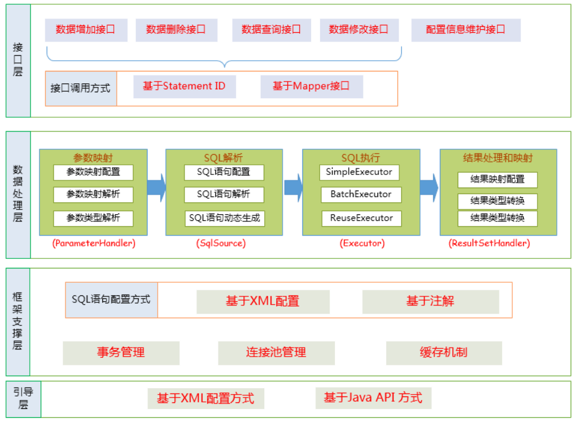
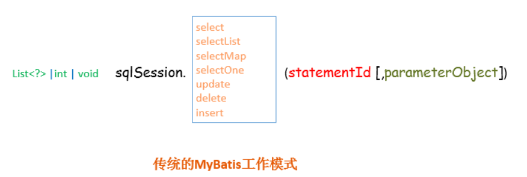
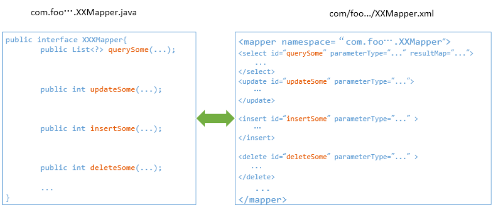
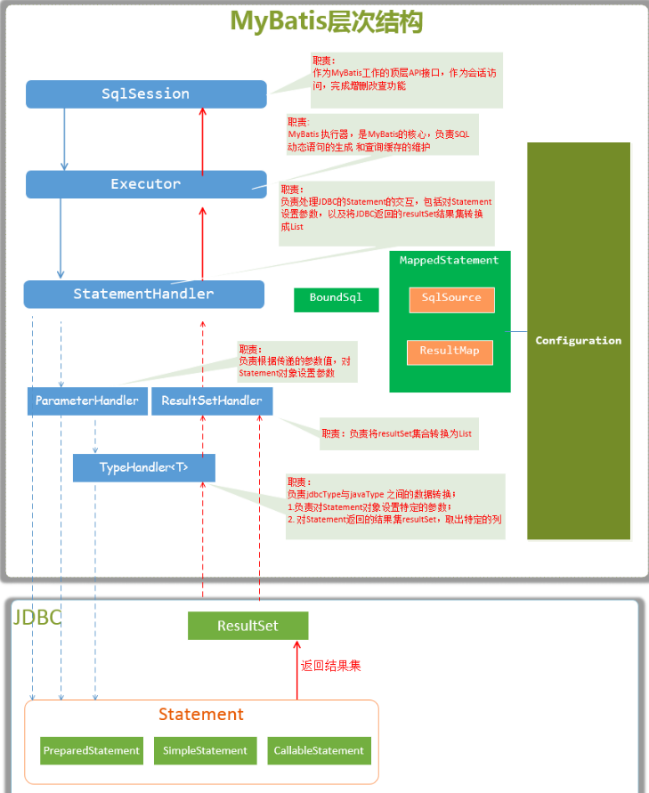
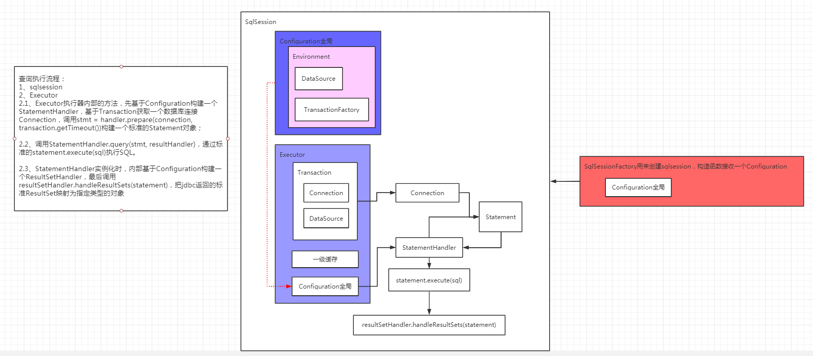
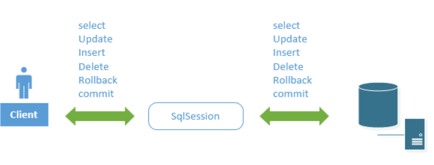
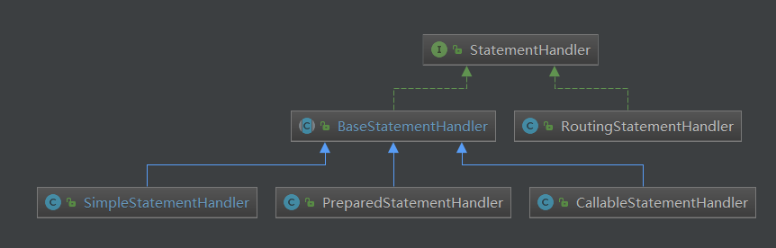

<!-- TOC -->

- [00、原理解析](#00原理解析)
    - [0、整体框架](#0整体框架)
        - [1、接口层---和用户交互](#1接口层---和用户交互)
            - [1、直接使用SqlSession提供的API](#1直接使用sqlsession提供的api)
            - [2、使用Mapper接口](#2使用mapper接口)
        - [2、数据处理层](#2数据处理层)
            - [1、参数映射和动态SQL语句生成](#1参数映射和动态sql语句生成)
            - [2、SQL语句的执行以及封装查询结果集成List<E>](#2sql语句的执行以及封装查询结果集成liste)
        - [3、框架支撑层](#3框架支撑层)
            - [1、事务管理机制](#1事务管理机制)
            - [2、连接池管理机制](#2连接池管理机制)
            - [3、缓存机制](#3缓存机制)
            - [4、SQL语句的配置方式](#4sql语句的配置方式)
        - [4、引导层](#4引导层)
    - [1、MyBatis的主要的核心部件](#1mybatis的主要的核心部件)
    - [2、SqlSession](#2sqlsession)
- [01、SqlSession接口](#01sqlsession接口)
    - [DefaultSqlSession默认实现](#defaultsqlsession默认实现)
- [02、Executor](#02executor)
    - [1、BaseExecutor基础抽象类](#1baseexecutor基础抽象类)
    - [2、SimpleExecutor](#2simpleexecutor)
- [03、Transaction接口](#03transaction接口)
    - [1、JdbcTransaction](#1jdbctransaction)
    - [2、ManagedTransaction](#2managedtransaction)
    - [3、sprig整合的实现SpringManagedTransaction](#3sprig整合的实现springmanagedtransaction)
- [04、TransactionFactory](#04transactionfactory)
    - [1、JdbcTransactionFactory返回JdbcTransaction对象](#1jdbctransactionfactory返回jdbctransaction对象)
    - [2、ManagedTransactionFactory返回ManagedTransaction](#2managedtransactionfactory返回managedtransaction)
    - [3、spring整合实现SpringManagedTransactionFactory](#3spring整合实现springmanagedtransactionfactory)
- [06、StatementHandler基于Statement提交sql执行](#06statementhandler基于statement提交sql执行)
    - [1、RoutingStatementHandler路由代理类](#1routingstatementhandler路由代理类)
    - [2、BaseStatementHandler](#2basestatementhandler)
    - [3、SimpleStatementHandler](#3simplestatementhandler)
- [07、ResultSetHandler](#07resultsethandler)
    - [1、DefaultResultSetHandler唯一实现](#1defaultresultsethandler唯一实现)
- [05、SqlSessionFactory](#05sqlsessionfactory)
    - [1、DefaultSqlSessionFactory](#1defaultsqlsessionfactory)
    - [2、SqlSessionFactoryBuilder](#2sqlsessionfactorybuilder)
- [97、configuration](#97configuration)
- [99、mybatis的SqlSessionTemplate是如何与数据源DataSource整合的](#99mybatis的sqlsessiontemplate是如何与数据源datasource整合的)
    - [0、配置方式](#0配置方式)
    - [1、SqlSessionFactoryBean](#1sqlsessionfactorybean)
    - [2、SqlSessionTemplate](#2sqlsessiontemplate)
- [mybatis拦截器插件](#mybatis拦截器插件)
    - [0、Interceptor接口](#0interceptor接口)
    - [1、实例](#1实例)
- [参考](#参考)

<!-- /TOC -->

# 00、原理解析


## 0、整体框架




### 1、接口层---和用户交互

#### 1、直接使用SqlSession提供的API

这是传统的传递Statement Id和查询参数给 SqlSession 对象，使用 SqlSession对象完成和数据库的交互；MyBatis 提供了非常方便和简单的API，供用户实现对数据库的增删改查数据操作，以及对数据库连接信息和MyBatis 自身配置信息的维护操作。



上述使用MyBatis 的方法，是创建一个和数据库打交道的SqlSession对象，然后根据Statement Id 和参数来操作数据库，这种方式固然很简单和实用，但是它不符合面向对象语言的概念和面向接口编程的编程习惯。由于面向接口的编程是面向对象的大趋势，MyBatis 为了适应这一趋势，增加了第二种使用MyBatis 支持接口（Interface）调用方式。


#### 2、使用Mapper接口

 MyBatis 将配置文件中的每一个<mapper> 节点抽象为一个 Mapper 接口，而这个接口中声明的方法和跟<mapper> 节点中的<select|update|delete|insert> 节点项对应，即<select|update|delete|insert> 节点的id值为Mapper 接口中的方法名称，parameterType 值表示Mapper 对应方法的入参类型，而resultMap 值则对应了Mapper 接口表示的返回值类型或者返回结果集的元素类型。



根据MyBatis 的配置规范配置好后，通过SqlSession.getMapper(XXXMapper.class) 方法，MyBatis 会根据相应的接口声明的方法信息，通过动态代理机制生成一个Mapper 实例，我们使用Mapper 接口的某一个方法时，MyBatis 会根据这个方法的方法名和参数类型，确定Statement Id，底层还是通过SqlSession.select("statementId",parameterObject);或者SqlSession.update("statementId",parameterObject); 等等来实现对数据库的操作。

MyBatis 引用Mapper 接口这种调用方式，纯粹是为了满足面向接口编程的需要。（其实还有一个原因是在于，面向接口的编程，使得用户在接口上可以使用注解来配置SQL语句，这样就可以脱离XML配置文件，实现“0配置”）。


### 2、数据处理层

#### 1、参数映射和动态SQL语句生成

参数映射指的是对于java 数据类型和jdbc数据类型之间的转换：这里有包括两个过程：查询阶段，我们要将java类型的数据，转换成jdbc类型的数据，通过 preparedStatement.setXXX() 来设值；另一个就是对resultset查询结果集的jdbcType 数据转换成java 数据类型。

动态语句生成可以说是MyBatis框架非常优雅的一个设计，MyBatis 通过传入的参数值，使用 Ognl 来动态地构造SQL语句，使得MyBatis 有很强的灵活性和扩展性。


#### 2、SQL语句的执行以及封装查询结果集成List<E>

动态SQL语句生成之后，MyBatis 将执行SQL语句，并将可能返回的结果集转换成List<E> 列表。MyBatis 在对结果集的处理中，支持结果集关系一对多和多对一的转换，并且有两种支持方式，一种为嵌套查询语句的查询，还有一种是嵌套结果集的查询。

### 3、框架支撑层

#### 1、事务管理机制


#### 2、连接池管理机制


#### 3、缓存机制

为了提高数据利用率和减小服务器和数据库的压力，MyBatis 会对于一些查询提供会话级别的数据缓存，会将对某一次查询，放置到SqlSession 中，在允许的时间间隔内，对于完全相同的查询，MyBatis 会直接将缓存结果返回给用户，而不用再到数据库中查找。


#### 4、SQL语句的配置方式

传统的MyBatis 配置SQL 语句方式就是使用XML文件进行配置的，但是这种方式不能很好地支持面向接口编程的理念，为了支持面向接口的编程，MyBatis 引入了Mapper接口的概念，面向接口的引入，对使用注解来配置SQL 语句成为可能，用户只需要在接口上添加必要的注解即可，不用再去配置XML文件了，但是，目前的MyBatis 只是对注解配置SQL 语句提供了有限的支持，某些高级功能还是要依赖XML配置文件配置SQL 语句。


### 4、引导层

引导层是配置和启动MyBatis 配置信息的方式。MyBatis 提供两种方式来引导MyBatis ：基于XML配置文件的方式和基于Java API 的方式。

## 1、MyBatis的主要的核心部件

- SqlSession            作为MyBatis工作的主要顶层API，表示和数据库交互的会话，完成必要数据库增删改查功能

- Executor              MyBatis执行器，是MyBatis 调度的核心，负责SQL语句的生成和查询缓存的维护

- StatementHandler   封装了JDBC Statement操作，负责对JDBC statement 的操作，如设置参数、将Statement结果集转换成List集合。

- ParameterHandler   负责对用户传递的参数转换成JDBC Statement 所需要的参数，

- ResultSetHandler    负责将JDBC返回的ResultSet结果集对象转换成List类型的集合；

- TypeHandler          负责java数据类型和jdbc数据类型之间的映射和转换

- MappedStatement   MappedStatement维护了一条<select|update|delete|insert>节点的封装，

- SqlSource            负责根据用户传递的parameterObject，动态地生成SQL语句，将信息封装到BoundSql对象中，并返回

- BoundSql             表示动态生成的SQL语句以及相应的参数信息

- Configuration        MyBatis所有的配置信息都维持在Configuration对象之中。





> 总结



SqlSession--->Executor--->StatementHandler(Transaction--->dataSource--->connection)真正的借助标准的statement提交sql执行。


查询执行流程：
- 1、sqlsession
- 2、Executor
    - 2.1、Executor执行器内部的方法，先基于Configuration构建一个StatementHandler，基于Transaction获取一个数据库连接Connection，调用stmt = handler.prepare(connection, transaction.getTimeout())构建一个标准的Statement对象；

    - 2.2、调用StatementHandler.query(stmt, resultHandler)，通过标准的statement.execute(sql)执行SQL。

    - 2.3、StatementHandler实例化时，内部基于Configuration构建一个ResultSetHandler，最后调用resultSetHandler.handleResultSets(statement)，把jdbc返回的标准ResultSet映射为指定类型的对象


> 问题：全局会创建多少个sqlsession？什么时候被创建？什么时候关闭？生命周期？

一般sqlsession单例，比如SqlSessionTemplate，如何支撑并发查询？通过dataSource.getConnection()能拿到链接就执行，否则会阻塞。


## 2、SqlSession

MyBatis封装了对数据库的访问，把对数据库的会话和事务控制放到了SqlSession对象中。




# 01、SqlSession接口

MyBatis通过这个接口的方法可以执行命令，获取mappers和管理transactions。

statement参数为一个SQL唯一标识，在mapper.xml或者mapper接口定义方法的全路径。

```java
public interface SqlSession extends Closeable {
  <T> T selectOne(String statement);//单结果查询，没有查询参数。（借助于对应的selectlist实现）
  <T> T selectOne(String statement, Object parameter);//单结果查询，有查询参数。借助于对应的selectlist实现）

  <E> List<E> selectList(String statement);//list查询，没有参数
  <E> List<E> selectList(String statement, Object parameter);//list查询，有参数
  <E> List<E> selectList(String statement, Object parameter, RowBounds rowBounds);//list查询，有参数，并且限制返回记录数limit

  <K, V> Map<K, V> selectMap(String statement, String mapKey);//对list查询值，按照某一个字段mapKey映射为map，即 Map[mapKey,记录对象]
  <K, V> Map<K, V> selectMap(String statement, Object parameter, String mapKey);//同上，带参数
  <K, V> Map<K, V> selectMap(String statement, Object parameter, String mapKey, RowBounds rowBounds);//同上，多了limit

  <T> Cursor<T> selectCursor(String statement);//list查询，使用一个迭代器（Cursor）懒加载数据，防止数据在内存中爆掉
  <T> Cursor<T> selectCursor(String statement, Object parameter);//同上，带参数
  <T> Cursor<T> selectCursor(String statement, Object parameter, RowBounds rowBounds);//同上。带limit

  void select(String statement, Object parameter, ResultHandler handler);//单行查询，带参数，并且使用ResultHandler处理查询到的行
  void select(String statement, ResultHandler handler);//同上不带参数
  void select(String statement, Object parameter, RowBounds rowBounds, ResultHandler handler);//同上，带参数和limit

  int insert(String statement);//执行插入SQL，返回受影响的行数
  int insert(String statement, Object parameter);//同上，指定参数

  int update(String statement);//执行更新SQL，返回受影响的行数
  int update(String statement, Object parameter);//同上，指定参数

  int delete(String statement);//执行删除SQL，返回受影响的行数
  int delete(String statement, Object parameter);//同上，指定参数

  
  void commit();//提交updates/deletes/inserts等事务操作
  void commit(boolean force);

  void rollback();//回滚updates/deletes/inserts等事务操作
  void rollback(boolean force);

  List<BatchResult> flushStatements();//Flushes batch statements.  BatchResult list of updated records  批处理的提交

  @Override
  void close();//Closes the session.  关闭当前session

  void clearCache();//Clears local session cache.  本地缓存请求

  Configuration getConfiguration();//Retrieves current configuration. //获取全局配置对象

  <T> T getMapper(Class<T> type);//根据类型，查询Mapper。获得mapper的时候，会根据当前sqlsession通过动态代理生成一个Mapper实例

  Connection getConnection();//Retrieves inner database connection.
}
```

## DefaultSqlSession默认实现

```java
public class DefaultSqlSession implements SqlSession {

  private final Configuration configuration;//全局配置对象
  private final Executor executor;//具体执行SQL的执行器。在创建session的时候创建一个执行器
  private final boolean autoCommit;

  private boolean dirty;
  private List<Cursor<?>> cursorList;//存放selectCursor查询返回的游标对象

  public DefaultSqlSession(Configuration configuration, Executor executor, boolean autoCommit) {
    this.configuration = configuration;
    this.executor = executor;
    this.dirty = false;
    this.autoCommit = autoCommit;
  }

...
}
```


> 总结：

- 1、selectOne、selectList、selectMap执行查询时，都是调用selectList实现，底层调用executor.query(ms, wrapCollection(parameter), rowBounds, handler);
- 2、insert、update、delete最后都是转化为update，底层调用executor.update(ms, wrapCollection(parameter));


# 02、Executor

sqlsession中包含Executor的实例对象，通过Executor接口中的方法来执行sqlsession中相应的方法。但是Executor也不是直接和数据库链接来执行SQL的，而是通过Executor中的内部对象Transaction对象获得数据库的链接来执行的。此外，缓存的信息也被保存在执行器中

```java
public interface Executor {

  ResultHandler NO_RESULT_HANDLER = null;

  //增删改接口处理
  int update(MappedStatement ms, Object parameter) throws SQLException;

  //查询接口处理
  <E> List<E> query(MappedStatement ms, Object parameter, RowBounds rowBounds, ResultHandler resultHandler, CacheKey cacheKey, BoundSql boundSql) throws SQLException;
  <E> List<E> query(MappedStatement ms, Object parameter, RowBounds rowBounds, ResultHandler resultHandler) throws SQLException;

  <E> Cursor<E> queryCursor(MappedStatement ms, Object parameter, RowBounds rowBounds) throws SQLException;

  List<BatchResult> flushStatements() throws SQLException;

  void commit(boolean required) throws SQLException;

  void rollback(boolean required) throws SQLException;

  CacheKey createCacheKey(MappedStatement ms, Object parameterObject, RowBounds rowBounds, BoundSql boundSql);

  boolean isCached(MappedStatement ms, CacheKey key);

  void clearLocalCache();

  void deferLoad(MappedStatement ms, MetaObject resultObject, String property, CacheKey key, Class<?> targetType);

  Transaction getTransaction();

  void close(boolean forceRollback);

  boolean isClosed();

  void setExecutorWrapper(Executor executor);

}
```


备注：

- 1、BoundSql 用户需要运行的SQL封装；

## 1、BaseExecutor基础抽象类

```java
public abstract class BaseExecutor implements Executor {

  protected Transaction transaction;//持有数据库connection，处理链接的生命周期，包括：its creation, preparation, commit/rollback and close.
  protected Executor wrapper;//自己持有自己的引用？

  protected ConcurrentLinkedQueue<DeferredLoad> deferredLoads;//延迟加载？
  protected PerpetualCache localCache;//一级缓存的存储位置【hashmap中】
  protected PerpetualCache localOutputParameterCache;//这个功能？
  protected Configuration configuration;

  protected int queryStack;//查询深度？？？
  private boolean closed;//执行器关闭的标记

  protected BaseExecutor(Configuration configuration, Transaction transaction) {
    this.transaction = transaction;//通过构造函数传入
    this.deferredLoads = new ConcurrentLinkedQueue<>();
    this.localCache = new PerpetualCache("LocalCache");
    this.localOutputParameterCache = new PerpetualCache("LocalOutputParameterCache");
    this.closed = false;
    this.configuration = configuration;
    this.wrapper = this;
  }

protected abstract int doUpdate(MappedStatement ms, Object parameter)
      throws SQLException;

  protected abstract List<BatchResult> doFlushStatements(boolean isRollback)
      throws SQLException;

  protected abstract <E> List<E> doQuery(MappedStatement ms, Object parameter, RowBounds rowBounds, ResultHandler resultHandler, BoundSql boundSql)
      throws SQLException;

  protected abstract <E> Cursor<E> doQueryCursor(MappedStatement ms, Object parameter, RowBounds rowBounds, BoundSql boundSql)
      throws SQLException;


 }
```

总结：

- 1、实现了处理的基本框架，具体的执行细节通过抽象方法让子类去实现。
- 2、这里实现一级缓存功能，基于hashmap简单实现，缓存key=statementId  + rowBounds  + 传递给JDBC的SQL  + 传递给JDBC的参数值来创建缓存key，并且当前sqlsession执行器Executor的增删改操作都会使得整个执行器中的本地缓存清空；


## 2、SimpleExecutor

```java
public class SimpleExecutor extends BaseExecutor {//重点prepareStatement方法，创建标准的Statement来执行SQL（借助于transaction）

  public SimpleExecutor(Configuration configuration, Transaction transaction) {
    super(configuration, transaction);
  }

  @Override
  public int doUpdate(MappedStatement ms, Object parameter) throws SQLException {
    Statement stmt = null;
    try {
      Configuration configuration = ms.getConfiguration();
      StatementHandler handler = configuration.newStatementHandler(this, ms, parameter, RowBounds.DEFAULT, null, null);
      stmt = prepareStatement(handler, ms.getStatementLog());
      return handler.update(stmt);
    } finally {
      closeStatement(stmt);
    }
  }

  @Override
  public <E> List<E> doQuery(MappedStatement ms, Object parameter, RowBounds rowBounds, ResultHandler resultHandler, BoundSql boundSql) throws SQLException {
    Statement stmt = null;
    try {
      Configuration configuration = ms.getConfiguration();
      //5. 根据既有的参数，创建StatementHandler对象来执行查询操作
      StatementHandler handler = configuration.newStatementHandler(wrapper, ms, parameter, rowBounds, resultHandler, boundSql);
      //6. 创建java.Sql.Statement对象，传递给StatementHandler对象【并设置参数】
      stmt = prepareStatement(handler, ms.getStatementLog());
      //7. 调用StatementHandler.query()方法，返回List结果集
      return handler.query(stmt, resultHandler);
    } finally {
      closeStatement(stmt);
    }
  }

  @Override
  protected <E> Cursor<E> doQueryCursor(MappedStatement ms, Object parameter, RowBounds rowBounds, BoundSql boundSql) throws SQLException {
    Configuration configuration = ms.getConfiguration();
    StatementHandler handler = configuration.newStatementHandler(wrapper, ms, parameter, rowBounds, null, boundSql);
    Statement stmt = prepareStatement(handler, ms.getStatementLog());
    stmt.closeOnCompletion();
    return handler.queryCursor(stmt);
  }

  @Override
  public List<BatchResult> doFlushStatements(boolean isRollback) {
    return Collections.emptyList();
  }


  //创建标准的Statement来执行SQL
  private Statement prepareStatement(StatementHandler handler, Log statementLog) throws SQLException {
    Statement stmt;
    Connection connection = getConnection(statementLog);//获取数据库链接transaction.getConnection();
    //根据Connection创建标准的Statement对象
    stmt = handler.prepare(connection, transaction.getTimeout());
    //对创建的Statement对象设置参数，即设置SQL 语句中 ? 设置为指定的参数
    handler.parameterize(stmt);
    return stmt;
  }

}

```


# 03、Transaction接口

持有数据库connection，处理链接的生命周期，包括：its creation, preparation, commit/rollback and close.

```java
public interface Transaction {
  Connection getConnection() throws SQLException;//获取连接dataSource.getConnection()
  void commit() throws SQLException;//内部connection事务提交
  void rollback() throws SQLException;//内部connection事务提交
  void close() throws SQLException;//关闭链接
  Integer getTimeout() throws SQLException;//Get transaction timeout if set.
}
```

总结：简单来说Transaction接口定义了如何获取一个数据库connection，已经该链接的事务提交和回滚等操作。

## 1、JdbcTransaction

基于jdbc的事务管理实现，可以非常便利的使用JDBC的事务提交和回滚

```java
public class JdbcTransaction implements Transaction {

  private static final Log log = LogFactory.getLog(JdbcTransaction.class);

  protected Connection connection;//当前对象绑定的数据库链接
  protected DataSource dataSource;//数据库连接池
  protected TransactionIsolationLevel level;//事务的隔离级别
  protected boolean autoCommit;//事务是否开启自动提交

  public JdbcTransaction(DataSource ds, TransactionIsolationLevel desiredLevel, boolean desiredAutoCommit) {
    dataSource = ds;
    level = desiredLevel;
    autoCommit = desiredAutoCommit;
  }

  public JdbcTransaction(Connection connection) {
    this.connection = connection;
  }

  @Override
  public void commit() throws SQLException {//没有开启自动提交事务的才会执行
    if (connection != null && !connection.getAutoCommit()) {
      if (log.isDebugEnabled()) {
        log.debug("Committing JDBC Connection [" + connection + "]");
      }
      connection.commit();
    }
  }

  @Override
  public void rollback() throws SQLException {//没有开启自动提交事务的才会执行
    if (connection != null && !connection.getAutoCommit()) {
      if (log.isDebugEnabled()) {
        log.debug("Rolling back JDBC Connection [" + connection + "]");
      }
      connection.rollback();
    }
  }

 @Override
  public Connection getConnection() throws SQLException {
    if (connection == null) { //没有初始化时调用数据源进行初始化
      openConnection();
    }
    return connection;
  }

  protected void openConnection() throws SQLException {
    if (log.isDebugEnabled()) {
      log.debug("Opening JDBC Connection");
    }
    connection = dataSource.getConnection();//获取一个数据库链接
    if (level != null) {
      connection.setTransactionIsolation(level.getLevel());//设置事务的隔离界别
    }
    setDesiredAutoCommit(autoCommit);
  }

@Override
  public void close() throws SQLException {
    if (connection != null) {
      resetAutoCommit();//开启事务的自动提交？？？
      if (log.isDebugEnabled()) {
        log.debug("Closing JDBC Connection [" + connection + "]");
      }
      connection.close();
    }
  }

}
```


## 2、ManagedTransaction

对事务的提交和回滚空实现，事务交给容器去实现，比如和spring结合等；

```java
public class ManagedTransaction implements Transaction {

  private static final Log log = LogFactory.getLog(ManagedTransaction.class);

  private DataSource dataSource;
  private TransactionIsolationLevel level;
  private Connection connection;
  private final boolean closeConnection;

  public ManagedTransaction(Connection connection, boolean closeConnection) {
    this.connection = connection;
    this.closeConnection = closeConnection;
  }

  public ManagedTransaction(DataSource ds, TransactionIsolationLevel level, boolean closeConnection) {
    this.dataSource = ds;
    this.level = level;
    this.closeConnection = closeConnection;
  }

  @Override
  public void commit() throws SQLException {
    // Does nothing
  }

  @Override
  public void rollback() throws SQLException {
    // Does nothing
  }

   @Override
  public Connection getConnection() throws SQLException {
    if (this.connection == null) {
      openConnection();
    }
    return this.connection;
  }

  protected void openConnection() throws SQLException {
    if (log.isDebugEnabled()) {
      log.debug("Opening JDBC Connection");
    }
    this.connection = this.dataSource.getConnection();//通过数据库连接池创建连接
    if (this.level != null) {
      this.connection.setTransactionIsolation(this.level.getLevel());
    }
  }

    @Override
  public void close() throws SQLException {
    if (this.closeConnection && this.connection != null) {
      if (log.isDebugEnabled()) {
        log.debug("Closing JDBC Connection [" + this.connection + "]");
      }
      this.connection.close();
    }
  }


 }
```


## 3、sprig整合的实现SpringManagedTransaction

```java
public class SpringManagedTransaction implements Transaction {//spring自己的Transaction接口实现

  private final DataSource dataSource;//数据库连接池

  private Connection connection;//绑定的数据库链接

  private boolean isConnectionTransactional;//事务隔离级别

  private boolean autoCommit;//事务的提交模式

  public SpringManagedTransaction(DataSource dataSource) {
    notNull(dataSource, "No DataSource specified");
    this.dataSource = dataSource;
  }

 
  @Override
  public Connection getConnection() throws SQLException {
    if (this.connection == null) {
      openConnection();
    }
    return this.connection;
  }

  /**
   * Gets a connection from Spring transaction manager and discovers if this {@code Transaction} should manage
   * connection or let it to Spring.
   * <p>
   * It also reads autocommit setting because when using Spring Transaction MyBatis thinks that autocommit is always
   * false and will always call commit/rollback so we need to no-op that calls.
   */
   //从spring的事务管理器获取一个connection
  private void openConnection() throws SQLException {
    this.connection = DataSourceUtils.getConnection(this.dataSource);
    this.autoCommit = this.connection.getAutoCommit();
    this.isConnectionTransactional = DataSourceUtils.isConnectionTransactional(this.connection, this.dataSource);

    LOGGER.debug(() -> "JDBC Connection [" + this.connection + "] will"
        + (this.isConnectionTransactional ? " " : " not ") + "be managed by Spring");
  }

 
  @Override
  public void commit() throws SQLException {
    if (this.connection != null && !this.isConnectionTransactional && !this.autoCommit) {
      LOGGER.debug(() -> "Committing JDBC Connection [" + this.connection + "]");
      this.connection.commit();
    }
  }

  @Override
  public void rollback() throws SQLException {
    if (this.connection != null && !this.isConnectionTransactional && !this.autoCommit) {
      LOGGER.debug(() -> "Rolling back JDBC Connection [" + this.connection + "]");
      this.connection.rollback();
    }
  }

 
  @Override
  public void close() throws SQLException {
    DataSourceUtils.releaseConnection(this.connection, this.dataSource);
  }

 
  @Override
  public Integer getTimeout() throws SQLException {
    ConnectionHolder holder = (ConnectionHolder) TransactionSynchronizationManager.getResource(dataSource);
    if (holder != null && holder.hasTimeout()) {
      return holder.getTimeToLiveInSeconds();
    }
    return null;
  }

}

```


# 04、TransactionFactory

```java
public interface TransactionFactory {
  void setProperties(Properties props);
  Transaction newTransaction(Connection conn);
  Transaction newTransaction(DataSource dataSource, TransactionIsolationLevel level, boolean autoCommit);
}

```

## 1、JdbcTransactionFactory返回JdbcTransaction对象

```java
public class JdbcTransactionFactory implements TransactionFactory {

  @Override
  public void setProperties(Properties props) {
  }

  @Override
  public Transaction newTransaction(Connection conn) {
    return new JdbcTransaction(conn);
  }

  @Override
  public Transaction newTransaction(DataSource ds, TransactionIsolationLevel level, boolean autoCommit) {
    return new JdbcTransaction(ds, level, autoCommit);
  }
}
```


## 2、ManagedTransactionFactory返回ManagedTransaction

```java
public class ManagedTransactionFactory implements TransactionFactory {

  private boolean closeConnection = true;

  @Override
  public void setProperties(Properties props) {
    if (props != null) {
      String closeConnectionProperty = props.getProperty("closeConnection");
      if (closeConnectionProperty != null) {
        closeConnection = Boolean.valueOf(closeConnectionProperty);
      }
    }
  }

  @Override
  public Transaction newTransaction(Connection conn) {
    return new ManagedTransaction(conn, closeConnection);
  }

  @Override
  public Transaction newTransaction(DataSource ds, TransactionIsolationLevel level, boolean autoCommit) {
    return new ManagedTransaction(ds, level, closeConnection);
  }
}

```


## 3、spring整合实现SpringManagedTransactionFactory

```java
public class SpringManagedTransactionFactory implements TransactionFactory {//spring自己的Transaction工厂实现

  @Override
  public Transaction newTransaction(DataSource dataSource, TransactionIsolationLevel level, boolean autoCommit) {//只支持这个方法的实现
    return new SpringManagedTransaction(dataSource);
  }


  @Override
  public Transaction newTransaction(Connection conn) {
    throw new UnsupportedOperationException("New Spring transactions require a DataSource");
  }

  @Override
  public void setProperties(Properties props) {
    // not needed in this version
  }

}

```


# 06、StatementHandler基于Statement提交sql执行




```java
public interface StatementHandler {

  //1、根据标准的数据库链接生成Statement
  Statement prepare(Connection connection, Integer transactionTimeout) throws SQLException;

   //2、通过Statement执行具体的SQL查询
  <E> List<E> query(Statement statement, ResultHandler resultHandler) throws SQLException;

  <E> Cursor<E> queryCursor(Statement statement) throws SQLException;

  //对statement设置参数接口。对应JDBC的PreparedStatement类型的对象，对占位符进行设值
  void parameterize(Statement statement) throws SQLException;

  void batch(Statement statement) throws SQLException;//功能？

  int update(Statement statement) throws SQLException;

  BoundSql getBoundSql();

  ParameterHandler getParameterHandler();

}
```


> 总结：
- 1、基于Connection对象创建jdbc的Statement对象；
- 2、基于Statement对象执行SQL；

## 1、RoutingStatementHandler路由代理类

这是一个代理类，根据StatementType类型路由到不同的具体StatementHandler的实现类来进行处理。SimpleStatementHandler\PreparedStatementHandler\CallableStatementHandler

```java
public class RoutingStatementHandler implements StatementHandler {

  private final StatementHandler delegate;//被代理

  public RoutingStatementHandler(Executor executor, MappedStatement ms, Object parameter, RowBounds rowBounds, ResultHandler resultHandler, BoundSql boundSql) {

    switch (ms.getStatementType()) {
      case STATEMENT:
        delegate = new SimpleStatementHandler(executor, ms, parameter, rowBounds, resultHandler, boundSql);
        break;
      case PREPARED:
        delegate = new PreparedStatementHandler(executor, ms, parameter, rowBounds, resultHandler, boundSql);
        break;
      case CALLABLE:
        delegate = new CallableStatementHandler(executor, ms, parameter, rowBounds, resultHandler, boundSql);
        break;
      default:
        throw new ExecutorException("Unknown statement type: " + ms.getStatementType());
    }

  }

  @Override
  public Statement prepare(Connection connection, Integer transactionTimeout) throws SQLException {
    return delegate.prepare(connection, transactionTimeout);
  }

  @Override
  public void parameterize(Statement statement) throws SQLException {
    delegate.parameterize(statement);
  }

  @Override
  public void batch(Statement statement) throws SQLException {
    delegate.batch(statement);
  }

  @Override
  public int update(Statement statement) throws SQLException {
    return delegate.update(statement);
  }

  @Override
  public <E> List<E> query(Statement statement, ResultHandler resultHandler) throws SQLException {
    return delegate.query(statement, resultHandler);
  }

  @Override
  public <E> Cursor<E> queryCursor(Statement statement) throws SQLException {
    return delegate.queryCursor(statement);
  }

  @Override
  public BoundSql getBoundSql() {
    return delegate.getBoundSql();
  }

  @Override
  public ParameterHandler getParameterHandler() {
    return delegate.getParameterHandler();
  }
}

```


## 2、BaseStatementHandler

```java
//实现了getBoundSql()、getParameterHandler()。最重要的是实现了prepare方法，使用模板方法模式让子类去实现具体instantiateStatement(connection)
public abstract class BaseStatementHandler implements StatementHandler {

  protected final Configuration configuration;
  protected final ObjectFactory objectFactory;
  protected final TypeHandlerRegistry typeHandlerRegistry;
  protected final ResultSetHandler resultSetHandler;//作用是在statement.execute()执行返回结果后，对结果集进行封装处理
  protected final ParameterHandler parameterHandler;//在通过connection生成标准的Statement后，对其进行参数设置处理

  protected final Executor executor;//执行器对象
  protected final MappedStatement mappedStatement;//在xml编写的SQL抽象
  protected final RowBounds rowBounds;//返回结果的limit限制

  protected BoundSql boundSql;//动态SQL

  protected BaseStatementHandler(Executor executor, MappedStatement mappedStatement, Object parameterObject, RowBounds rowBounds, ResultHandler resultHandler, BoundSql boundSql) {
    this.configuration = mappedStatement.getConfiguration();
    this.executor = executor;
    this.mappedStatement = mappedStatement;
    this.rowBounds = rowBounds;

    this.typeHandlerRegistry = configuration.getTypeHandlerRegistry();
    this.objectFactory = configuration.getObjectFactory();

    if (boundSql == null) { // issue #435, get the key before calculating the statement
      generateKeys(parameterObject);
      boundSql = mappedStatement.getBoundSql(parameterObject);
    }

    this.boundSql = boundSql;

    this.parameterHandler = configuration.newParameterHandler(mappedStatement, parameterObject, boundSql);
    this.resultSetHandler = configuration.newResultSetHandler(executor, mappedStatement, rowBounds, parameterHandler, resultHandler, boundSql);
  }

  @Override
  public BoundSql getBoundSql() {
    return boundSql;
  }

  @Override
  public ParameterHandler getParameterHandler() {
    return parameterHandler;
  }

  /**
   * 在这里根据connection生成标准的Statement对象
   * @param connection
   * @param transactionTimeout
   * @return
   * @throws SQLException
   */
  @Override
  public Statement prepare(Connection connection, Integer transactionTimeout) throws SQLException {
    ErrorContext.instance().sql(boundSql.getSql());
    Statement statement = null;
    try {
      statement = instantiateStatement(connection);//抽象函数，让子类根据链接自己在定义创建细节
      setStatementTimeout(statement, transactionTimeout);//设置查询超时参数
      setFetchSize(statement);//fetchsize设置
      return statement;
    } catch (SQLException e) {
      closeStatement(statement);
      throw e;
    } catch (Exception e) {
      closeStatement(statement);
      throw new ExecutorException("Error preparing statement.  Cause: " + e, e);
    }
  }

  protected abstract Statement instantiateStatement(Connection connection) throws SQLException;

  protected void setStatementTimeout(Statement stmt, Integer transactionTimeout) throws SQLException {
    Integer queryTimeout = null;
    if (mappedStatement.getTimeout() != null) {
      queryTimeout = mappedStatement.getTimeout();
    } else if (configuration.getDefaultStatementTimeout() != null) {
      queryTimeout = configuration.getDefaultStatementTimeout();
    }
    if (queryTimeout != null) {//设置查询超时参数
      stmt.setQueryTimeout(queryTimeout);
    }
    StatementUtil.applyTransactionTimeout(stmt, queryTimeout, transactionTimeout);
  }

  protected void setFetchSize(Statement stmt) throws SQLException {
    Integer fetchSize = mappedStatement.getFetchSize();
    if (fetchSize != null) {
      stmt.setFetchSize(fetchSize);
      return;
    }
    Integer defaultFetchSize = configuration.getDefaultFetchSize();
    if (defaultFetchSize != null) {
      stmt.setFetchSize(defaultFetchSize);
    }
  }

  protected void closeStatement(Statement statement) {
    try {
      if (statement != null) {
        statement.close();
      }
    } catch (SQLException e) {
      //ignore
    }
  }

  protected void generateKeys(Object parameter) {
    KeyGenerator keyGenerator = mappedStatement.getKeyGenerator();
    ErrorContext.instance().store();
    keyGenerator.processBefore(executor, mappedStatement, null, parameter);
    ErrorContext.instance().recall();
  }

}

```


## 3、SimpleStatementHandler

```java
public class SimpleStatementHandler extends BaseStatementHandler {//封装具体的SQL执行

  public SimpleStatementHandler(Executor executor, MappedStatement mappedStatement, Object parameter, RowBounds rowBounds, ResultHandler resultHandler, BoundSql boundSql) {
    super(executor, mappedStatement, parameter, rowBounds, resultHandler, boundSql);
  }

  @Override
  public int update(Statement statement) throws SQLException {
    String sql = boundSql.getSql();
    Object parameterObject = boundSql.getParameterObject();
    KeyGenerator keyGenerator = mappedStatement.getKeyGenerator();
    int rows;//影响的行数
    if (keyGenerator instanceof Jdbc3KeyGenerator) {//自增主键?
      statement.execute(sql, Statement.RETURN_GENERATED_KEYS);
      rows = statement.getUpdateCount();
      keyGenerator.processAfter(executor, mappedStatement, statement, parameterObject);
    } else if (keyGenerator instanceof SelectKeyGenerator) {
      statement.execute(sql);
      rows = statement.getUpdateCount();
      keyGenerator.processAfter(executor, mappedStatement, statement, parameterObject);
    } else {
      statement.execute(sql);
      rows = statement.getUpdateCount();
    }
    return rows;
  }

  @Override
  public void batch(Statement statement) throws SQLException {
    String sql = boundSql.getSql();
    statement.addBatch(sql);//添加一个执行SQL，等待执行executeBatch一起提交执行
  }

  @Override
  public <E> List<E> query(Statement statement, ResultHandler resultHandler) throws SQLException {
    String sql = boundSql.getSql();
    statement.execute(sql);
    return resultSetHandler.handleResultSets(statement);
  }

  @Override
  public <E> Cursor<E> queryCursor(Statement statement) throws SQLException {
    String sql = boundSql.getSql();
    statement.execute(sql);
    return resultSetHandler.handleCursorResultSets(statement);
  }

  @Override //基于链接创建一个标准的statement对象
  protected Statement instantiateStatement(Connection connection) throws SQLException {
    if (mappedStatement.getResultSetType() == ResultSetType.DEFAULT) {
      return connection.createStatement();
    } else {
      return connection.createStatement(mappedStatement.getResultSetType().getValue(), ResultSet.CONCUR_READ_ONLY);
    }
  }

  @Override
  public void parameterize(Statement statement) {
    // N/A
  }

}

```


# 07、ResultSetHandler

`重点:jdbc查询返回的原生ResultSet映射为对象返回`

```java
//功能:处理查询执行后，通过Statement获取的ResultSet进行处理
public interface ResultSetHandler {

  <E> List<E> handleResultSets(Statement stmt) throws SQLException;//一般的查询

  <E> Cursor<E> handleCursorResultSets(Statement stmt) throws SQLException;//一般的游标查询

  void handleOutputParameters(CallableStatement cs) throws SQLException;

}

```


## 1、DefaultResultSetHandler唯一实现

```java
//对ResultSet进行封装返回（核心：处理逻辑比较复杂）
public class DefaultResultSetHandler implements ResultSetHandler {}
```


待深入阅读部分

```java
//todo

public interface ResultHandler<T> {

  void handleResult(ResultContext<? extends T> resultContext);

}


public interface ResultContext<T> {

  T getResultObject();//一条对象

  int getResultCount();//累计一次查询返回多少条

  boolean isStopped();

  void stop();

}


public class DefaultResultHandler implements ResultHandler<Object> {

  private final List<Object> list;//使用一个list保存

 }


public class DefaultMapResultHandler<K, V> implements ResultHandler<V> {

  private final Map<K, V> mappedResults;//使用一个map保存返回对象<对象一个属性字段，对象记录>，相当于把list按照某个维度转化
  private final String mapKey;//映射的key
  private final ObjectFactory objectFactory;
  private final ObjectWrapperFactory objectWrapperFactory;
  private final ReflectorFactory reflectorFactory;

  @SuppressWarnings("unchecked")
  public DefaultMapResultHandler(String mapKey, ObjectFactory objectFactory, ObjectWrapperFactory objectWrapperFactory, ReflectorFactory reflectorFactory) {
    this.objectFactory = objectFactory;
    this.objectWrapperFactory = objectWrapperFactory;
    this.reflectorFactory = reflectorFactory;
    this.mappedResults = objectFactory.create(Map.class);
    this.mapKey = mapKey;
  }
...
}


int FETCH_FORWARD = 1000;  //first-to-last
int FETCH_REVERSE = 1001;  //last-to-first
int FETCH_UNKNOWN = 1002;

int TYPE_FORWARD_ONLY = 1003; //cursor may move only forward

int TYPE_SCROLL_INSENSITIVE = 1004;
int TYPE_SCROLL_SENSITIVE = 1005;

int CONCUR_READ_ONLY = 1007; //may NOT be updated
int CONCUR_UPDATABLE = 1008; //may be updated
```


# 05、SqlSessionFactory

```java
public interface SqlSessionFactory {

  SqlSession openSession();

  SqlSession openSession(boolean autoCommit);

  SqlSession openSession(Connection connection);

  SqlSession openSession(TransactionIsolationLevel level);

  SqlSession openSession(ExecutorType execType);

  SqlSession openSession(ExecutorType execType, boolean autoCommit);

  SqlSession openSession(ExecutorType execType, TransactionIsolationLevel level);

  SqlSession openSession(ExecutorType execType, Connection connection);

  Configuration getConfiguration();

}
```


## 1、DefaultSqlSessionFactory


```java

public enum ExecutorType {//执行器的类型
  SIMPLE, REUSE, BATCH
}

public class DefaultSqlSessionFactory implements SqlSessionFactory {

  private final Configuration configuration;

  public DefaultSqlSessionFactory(Configuration configuration) {
    this.configuration = configuration;
  }

  @Override
  public SqlSession openSession() {
    return openSessionFromDataSource(configuration.getDefaultExecutorType(), null, false);
  }

  @Override
  public SqlSession openSession(boolean autoCommit) {
    return openSessionFromDataSource(configuration.getDefaultExecutorType(), null, autoCommit);
  }

  @Override
  public SqlSession openSession(ExecutorType execType) {//mybatis-spring调用该方法创建sqlsession
    return openSessionFromDataSource(execType, null, false);
  }

  @Override
  public SqlSession openSession(TransactionIsolationLevel level) {
    return openSessionFromDataSource(configuration.getDefaultExecutorType(), level, false);
  }

  @Override
  public SqlSession openSession(ExecutorType execType, TransactionIsolationLevel level) {
    return openSessionFromDataSource(execType, level, false);
  }

  @Override
  public SqlSession openSession(ExecutorType execType, boolean autoCommit) {
    return openSessionFromDataSource(execType, null, autoCommit);
  }

  @Override
  public SqlSession openSession(Connection connection) {
    return openSessionFromConnection(configuration.getDefaultExecutorType(), connection);
  }

  @Override
  public SqlSession openSession(ExecutorType execType, Connection connection) {
    return openSessionFromConnection(execType, connection);
  }

  @Override
  public Configuration getConfiguration() {
    return configuration;
  }
  //重要，通过工厂来创建sqlsession最后都是调用这个来执行
  private SqlSession openSessionFromDataSource(
  ExecutorType execType, //执行器的类型
  TransactionIsolationLevel level, //事务的隔离界别
  boolean autoCommit) //事务的提交方式
  {
    Transaction tx = null;
    try {
      final Environment environment = configuration.getEnvironment();
      final TransactionFactory transactionFactory = getTransactionFactoryFromEnvironment(environment);
      tx = transactionFactory.newTransaction(environment.getDataSource(), level, autoCommit);
      final Executor executor = configuration.newExecutor(tx, execType);
      return new DefaultSqlSession(configuration, executor, autoCommit);
    } catch (Exception e) {
      closeTransaction(tx); // may have fetched a connection so lets call close()
      throw ExceptionFactory.wrapException("Error opening session.  Cause: " + e, e);
    } finally {
      ErrorContext.instance().reset();
    }
  }

  private SqlSession openSessionFromConnection(ExecutorType execType, Connection connection) {
    try {
      boolean autoCommit;
      try {
        autoCommit = connection.getAutoCommit();
      } catch (SQLException e) {
        // Failover to true, as most poor drivers
        // or databases won't support transactions
        autoCommit = true;
      }
      final Environment environment = configuration.getEnvironment();
      final TransactionFactory transactionFactory = getTransactionFactoryFromEnvironment(environment);
      final Transaction tx = transactionFactory.newTransaction(connection);
      final Executor executor = configuration.newExecutor(tx, execType);
      return new DefaultSqlSession(configuration, executor, autoCommit);
    } catch (Exception e) {
      throw ExceptionFactory.wrapException("Error opening session.  Cause: " + e, e);
    } finally {
      ErrorContext.instance().reset();
    }
  }

  private TransactionFactory getTransactionFactoryFromEnvironment(Environment environment) {
    if (environment == null || environment.getTransactionFactory() == null) {
      return new ManagedTransactionFactory();
    }
    return environment.getTransactionFactory();
  }

  private void closeTransaction(Transaction tx) {
    if (tx != null) {
      try {
        tx.close();
      } catch (SQLException ignore) {
        // Intentionally ignore. Prefer previous error.
      }
    }
  }

}
```


## 2、SqlSessionFactoryBuilder

主要根据Reader和InputStream读取配置文件的信息来生成Configuration对象，然后调用new DefaultSqlSessionFactory(config)来创建SqlSessionFactory。

```java
public class SqlSessionFactoryBuilder {

  public SqlSessionFactory build(Reader reader) {
    return build(reader, null, null);
  }

  public SqlSessionFactory build(Reader reader, String environment) {
    return build(reader, environment, null);
  }

  public SqlSessionFactory build(Reader reader, Properties properties) {
    return build(reader, null, properties);
  }

  public SqlSessionFactory build(Reader reader, String environment, Properties properties) {
    try {
      XMLConfigBuilder parser = new XMLConfigBuilder(reader, environment, properties);
      return build(parser.parse());
    } catch (Exception e) {
      throw ExceptionFactory.wrapException("Error building SqlSession.", e);
    } finally {
      ErrorContext.instance().reset();
      try {
        reader.close();
      } catch (IOException e) {
        // Intentionally ignore. Prefer previous error.
      }
    }
  }

  public SqlSessionFactory build(InputStream inputStream) {
    return build(inputStream, null, null);
  }

  public SqlSessionFactory build(InputStream inputStream, String environment) {
    return build(inputStream, environment, null);
  }

  public SqlSessionFactory build(InputStream inputStream, Properties properties) {
    return build(inputStream, null, properties);
  }

  public SqlSessionFactory build(InputStream inputStream, String environment, Properties properties) {
    try {
      XMLConfigBuilder parser = new XMLConfigBuilder(inputStream, environment, properties);
      return build(parser.parse());//根据配置文件来生成configuration对象，然后基于configuration对象生成SqlSessionFactory
    } catch (Exception e) {
      throw ExceptionFactory.wrapException("Error building SqlSession.", e);
    } finally {
      ErrorContext.instance().reset();
      try {
        inputStream.close();
      } catch (IOException e) {
        // Intentionally ignore. Prefer previous error.
      }
    }
  }

  public SqlSessionFactory build(Configuration config) {//基于全局配置对象来构建
    return new DefaultSqlSessionFactory(config);
  }

}

```


# 97、configuration

- configuration（配置）
    - properties（属性）
    - settings（设置）
    - typeAliases（类型别名）
    - typeHandlers（类型处理器）
    - objectFactory（对象工厂）
    - plugins（插件）
    - environments（环境配置）
        - environment（环境变量）
            - transactionManager（事务管理器）
            - dataSource（数据源）
    - databaseIdProvider（数据库厂商标识）
    - mappers（映射器）


# 99、mybatis的SqlSessionTemplate是如何与数据源DataSource整合的

在使用Mybatis与Spring集成的时候我们使用的SqlSession实际上是用到了SqlSessionTemplate 这个类。

SqlSessionTemplate代理类实现SqlSession接口，内部定义了动态代理处理类SqlSessionInterceptor，如果调用SqlSessionTemplate相关方法会由代理类实例中实现SqlSession接口定义的方法，该调用则被导向SqlSessionInterceptor的invoke方法，invoke方法中包括了获取SqlSession和关闭SqlSession的方法，获取方法中已经保证了线程安全性.

- [mybatis3 settings](http://www.mybatis.org/mybatis-3/zh/configuration.html#settings)

- [Mybatis SqlSessionTemplate 源码解析](https://www.cnblogs.com/daxin/p/3544188.html)

- [对于SqlSessionTemplate的理解](https://www.jianshu.com/p/7cb4777a539e)


## 0、配置方式

> 1、基于xml配置

```xml
先配置数据源
<bean id="dataSource" class="com.alibaba.druid.pool.DruidDataSource" init-method="init" destroy-method="close">

</bean>


<bean id="sqlSessionFactory" class="org.mybatis.spring.SqlSessionFactoryBean">
		<property name="dataSource" ref="dataSource"/>
		<!-- 加载Mybatis全局配置文件 核心是字段mapper.xml -->
		<property name="configLocation" value="classpath:spring/sqlmap-config.xml"/>
</bean>


<bean id="sqlSessionTemplate" class="org.mybatis.spring.SqlSessionTemplate" scope="prototype">
		<constructor-arg index="0" ref="sqlSessionFactory" />
	</bean>
```

sqlmap-config.xml
```xml
<configuration>
<mappers>
		<mapper resource="mybatis-xml/xxx.xml"/>
	</mappers>
</configuration>
```


## 1、SqlSessionFactoryBean


```java
public class SqlSessionFactoryBean implements FactoryBean<SqlSessionFactory>, InitializingBean, ApplicationListener<ApplicationEvent> {
    private DataSource dataSource;//数据库连接池
    private SqlSessionFactory sqlSessionFactory;//在afterPropertiesSet()中进行初始化

@Override
  public void afterPropertiesSet() throws Exception {
    this.sqlSessionFactory = buildSqlSessionFactory();
  }

}
```

备注：这个buildSqlSessionFactory方法会根据配置信息生成Configuration对象，然后new DefaultSqlSessionFactory(config)生成。


## 2、SqlSessionTemplate

基于jdk的动态代理实现把对SqlSessionTemplate方法的调用转发到真正的SqlSession去执行。

```java
public class SqlSessionTemplate implements SqlSession, DisposableBean {//实现了mybatis的SqlSession接口，代理模式

  private final SqlSessionFactory sqlSessionFactory;//session工厂,用来创建真正执行SQL的sqlsession对象

  private final ExecutorType executorType;//执行类型：SIMPLE/REUSE/BATCH，默认是SIMPLE

  private final SqlSession sqlSessionProxy;//被代理的sqlsession(单例)

  private final PersistenceExceptionTranslator exceptionTranslator;//把mybatis的异常转化为spring的异常

  public SqlSessionTemplate(SqlSessionFactory sqlSessionFactory) {
    this(sqlSessionFactory, sqlSessionFactory.getConfiguration().getDefaultExecutorType());
  }

  public SqlSessionTemplate(SqlSessionFactory sqlSessionFactory, ExecutorType executorType) {
    this(sqlSessionFactory, executorType,
        new MyBatisExceptionTranslator(sqlSessionFactory.getConfiguration().getEnvironment().getDataSource(), true));
  }

  public SqlSessionTemplate(SqlSessionFactory sqlSessionFactory, ExecutorType executorType,
      PersistenceExceptionTranslator exceptionTranslator) {

    notNull(sqlSessionFactory, "Property 'sqlSessionFactory' is required");
    notNull(executorType, "Property 'executorType' is required");

    this.sqlSessionFactory = sqlSessionFactory;
    this.executorType = executorType;
    this.exceptionTranslator = exceptionTranslator;
    this.sqlSessionProxy = (SqlSession) newProxyInstance(SqlSessionFactory.class.getClassLoader(),
        new Class[] { SqlSession.class }, new SqlSessionInterceptor());//创建jdk的动态代理
  }

    private class SqlSessionInterceptor implements InvocationHandler {
    @Override
    public Object invoke(Object proxy, Method method, Object[] args) throws Throwable {
      SqlSession sqlSession = getSqlSession(SqlSessionTemplate.this.sqlSessionFactory,//1、获取真正执行SQL的sqlsession对象
          SqlSessionTemplate.this.executorType, SqlSessionTemplate.this.exceptionTranslator);
      try {
        Object result = method.invoke(sqlSession, args);//2、执行SQL
        if (!isSqlSessionTransactional(sqlSession, SqlSessionTemplate.this.sqlSessionFactory)) {
          // force commit even on non-dirty sessions because some databases require
          // a commit/rollback before calling close()
          sqlSession.commit(true);
        }
        return result;
      } catch (Throwable t) {
        Throwable unwrapped = unwrapThrowable(t);
        if (SqlSessionTemplate.this.exceptionTranslator != null && unwrapped instanceof PersistenceException) {
          // release the connection to avoid a deadlock if the translator is no loaded. See issue #22
          closeSqlSession(sqlSession, SqlSessionTemplate.this.sqlSessionFactory);
          sqlSession = null;
          Throwable translated = SqlSessionTemplate.this.exceptionTranslator
              .translateExceptionIfPossible((PersistenceException) unwrapped);
          if (translated != null) {
            unwrapped = translated;
          }
        }
        throw unwrapped;
      } finally {
        if (sqlSession != null) {
          closeSqlSession(sqlSession, SqlSessionTemplate.this.sqlSessionFactory);
        }
      }
    }
  }

```

SqlSessionUtils通过SqlSessionFactory工厂来构建SqlSession

```java
public static SqlSession getSqlSession(SqlSessionFactory sessionFactory, ExecutorType executorType,
      PersistenceExceptionTranslator exceptionTranslator) {

    notNull(sessionFactory, NO_SQL_SESSION_FACTORY_SPECIFIED);
    notNull(executorType, NO_EXECUTOR_TYPE_SPECIFIED);
    //
    SqlSessionHolder holder = (SqlSessionHolder) TransactionSynchronizationManager.getResource(sessionFactory);

    SqlSession session = sessionHolder(executorType, holder);
    if (session != null) {
      return session;
    }

    LOGGER.debug(() -> "Creating a new SqlSession");
    session = sessionFactory.openSession(executorType);//创建一个sqlsession

    registerSessionHolder(sessionFactory, executorType, exceptionTranslator, session);

    return session;
  }
```


# mybatis拦截器插件

- [mybatis拦截器插件官方文档](https://mybatis.org/mybatis-3/zh/configuration.html#plugins)

- [MyBatis拦截器打印不带问号的完整sql语句方法](https://www.cnblogs.com/leavescy/p/7642113.html)

- [Executor 拦截器高级教程 - QueryInterceptor 规范](https://blog.csdn.net/isea533/article/details/53957330)

- [QueryInterceptor 规范](https://pagehelper.github.io/docs/interceptor/)

- [Mybatis插件原理以及实现自定义Sql拦截器插件](https://blog.csdn.net/jiaqingShareing/article/details/81840657)

- [SpringBoot集成Mybatis自定义拦截器，实现拼接sql和修改（一）](https://blog.csdn.net/qq_29653517/article/details/86299928)

MyBatis 允许你在已映射语句执行过程中的某一点进行拦截调用。默认情况下，MyBatis 允许使用插件来拦截的方法调用包括：

- Executor (update, query, flushStatements, commit, rollback, getTransaction, close, isClosed)
- ParameterHandler (getParameterObject, setParameters)
- ResultSetHandler (handleResultSets, handleOutputParameters)
- StatementHandler (prepare, parameterize, batch, update, query)


`拦截的时机：是在方法执行前还是执行后执行？？？`


## 0、Interceptor接口

```java
public interface Interceptor {

  Object intercept(Invocation invocation) throws Throwable;

  Object plugin(Object target);

  void setProperties(Properties properties);

}
```

每一个拦截器都必须实现上面的三个方法，其中：

- 1、Object intercept(Invocation invocation)是实现拦截逻辑的地方，内部要通过invocation.proceed()显式地推进责任链前进，也就是调用下一个拦截器拦截目标方法。
- 2、Object plugin(Object target) 就是用当前这个拦截器生成对目标target的代理，实际是通过Plugin.wrap(target,this) 来完成的，把目标target和拦截器this传给了包装函数。
- 3、setProperties(Properties properties)用于设置额外的参数，参数配置在拦截器的Properties节点里。


## 1、实例

需求是对某些查询方法进行SQL的改写。如何区别某些方法，通过在方法上添加注解来标识。

思路：拦截StatementHandler.prepare(功能是基于Connection创建一个标准的Statement)方法，获取BoundSql类中的字段sql，通过反射机制，改写为修改后的值。


```java
@Intercepts({@Signature(type = StatementHandler.class, method = "prepare", args = {Connection.class, Integer.class})})
@Component
public class SqlTransferMysqlToClickHouseInterceptor implements Interceptor {

 @Override
    public Object intercept(Invocation invocation) throws Throwable {

    StatementHandler statementHandler = (StatementHandler) invocation.getTarget();
    BoundSql boundSql = statementHandler.getBoundSql();
    //对SQL进行改写
    String mSql = "";
    //通过反射修改sql语句
    Field field = boundSql.getClass().getDeclaredField("sql");
    field.setAccessible(true);
    field.set(boundSql, mSql);


    }

     @Override
    public Object plugin(Object o) {
        return Plugin.wrap(o, this);
    }
     @Override
    public void setProperties(Properties properties) {}

}
```


# 参考

- [spring-mybatis官方文档](http://mybatis.org/spring/zh/scm.html)


- [spring-mybatis源码学习](https://github.com/lishuai2016/spring-mybatis.git)


- [spring-boot-starter-mybatis源码学习](https://github.com/lishuai2016/spring-boot-starter-mybatis.git)

推荐阅读的源码解析文章

- [深入理解MyBatis原理](https://blog.csdn.net/u010349169/category_9263284.html)

- [Mybatis实现原理深入解析收藏](https://www.iteye.com/blogs/subjects/mybatis_internals)
