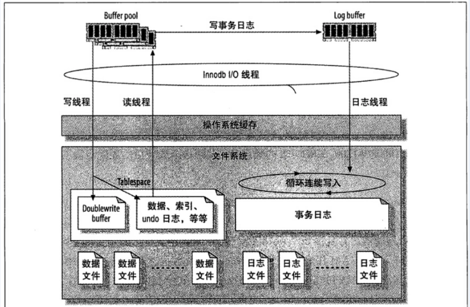

<!-- TOC -->

- [1、InnoDB存储引擎工作原理](#1innodb存储引擎工作原理)
    - [0、体系架构](#0体系架构)
        - [1、线程](#1线程)
        - [2、内存](#2内存)
    - [1、innodb存储结构](#1innodb存储结构)
    - [2、如何存储表](#2如何存储表)
        - [1.frm 文件](#1frm-文件)
        - [2.ibd 文件](#2ibd-文件)
        - [3、独立表空间(较好)和共享表空间的区别](#3独立表空间较好和共享表空间的区别)

<!-- /TOC -->


# 1、InnoDB存储引擎工作原理


## 0、体系架构

InnoDB存储引擎是由内存池、后台线程、磁盘存储三大部分组成。


### 1、线程

InnoDB 使用的是多线程模型, 其后台有多个不同的线程负责处理不同的任务

- Master Thread:Master Thread是最核心的一个后台线程，主要负责将缓冲池中的数据异步刷新到磁盘，保证数据的一致性。包括脏页刷新、合并插入缓冲、UNDO页的回收等。

- IO Thread:在 InnoDB 存储引擎中大量使用了异步IO(Async IO)来处理写IO请求, IO Thread的工作主要是负责这些 IO 请求的回调。

- Purge Thread:事务提交后，其所使用的undo log可能不再需要，因此需要Purge Thread来回收已经分配并使用的UNDO页。InnoDB支持多个Purge Thread, 这样做可以加快UNDO页的回收，提高CPU的使用率以及提升存储引擎的性能。

- Page Cleaner Thread:Page Cleaner Thread的作用是取代Master Thread中脏页刷新的操作，其目的是减轻原Master Thread的工作及对于用户查询线程的阻塞，进一步提高InnoDB存储引擎的性能。


默认情况下，InnoDB 的后台线程有 7 个，其中 4 个 IO thread, 1 个 Master thread, 1 个 Lock monitor thread, 一个 Error monitor thread。InnoDB 的主要工作都是在一个单独的 Master 线程里完成的。Master 线程的优先级最高，它主要分为以下几个循环：主循环（loop）、后台循环（background loop）、刷新循环（flush loop）、暂停循环（suspend loop）。




其中主循环的伪代码如下：

```c 
void master_thread() (
    loop:
    for (int i =0; i <10; i++){
        do thing once per second
        sleep 1 second if necessary
    }
    do things once per ten seconds
    goto loop;
}
```

- 其中每秒一次的操作包括：刷新日志缓冲区（总是），合并插入缓冲（可能），至多刷新 100 个脏数据页（可能），如果没有当前用户活动，切换至 background loop （可能）。

- 其中每 10 秒一次的操作包括：合并至多 5 个插入缓冲（总是），刷新日志缓冲（总是），刷新 100 个或 10 个脏页到磁盘（总是），产生一个检查点（总是），删除无用 Undo 页 （总是）。

- 后台循环，若当前没有用户活动或数据库关闭时，会切换至该循环执行以下操作：删除无用的 undo 页（总是），合并 20 个插入缓冲（总是），跳回到主循环（总是），不断刷新 100 个页，直到符合条件跳转到 flush loop（可能）。

- 如果 flush loop 中也没有什么事情可做，边切换到 suspend loop，将 master 线程挂起。


### 2、内存


nnoDB 的内存主要有以下几个部分组成：缓冲池 (buffer pool)、重做日志缓冲池(redo log buffer）以及额外的内存池（additional memory pool），如图所示：

其中缓冲池占最大块内存，用来缓存各自数据，数据文件按页（每页 16K）读取到缓冲池，按最近最少使用算法（`LRU`）保留缓存数据。缓冲池缓冲的数据类型有：数据页、索引页、插入缓冲、自适应哈希索引、锁信息、数据字典信息等，其中数据页和索引页占了绝大部分内存。日志缓冲将重做日志信息先放入这个缓冲区，然后按一定频率（默认为 1s）将其刷新至重做日志文件。

InnoDB 通过一些列后台线程将相关操作进行异步处理，同时借助缓冲池来减小 CPU 和磁盘速度上的差异。当查询的时候会先通过索引定位到对应的数据页，然后检测数据页是否在缓冲池内，如果在就直接返回，如果不在就去聚簇索引中通过磁盘 IO 读取对应的数据页并放入缓冲池。一个数据页会包含多个数据行。缓存池通过 LRU 算法对数据页进行管理，`也就是最频繁使用的数据页排在列表前面，不经常使用的排在队尾`，当缓冲池满了的时候会淘汰掉队尾的数据页。`从磁盘新读取到的数据页并不会放在队列头部而是放在中间位置，这个中间位置可以通过参数进行修`。缓冲池也可以设置多个实例，数据页根据哈希算法决定放在哪个缓冲池。


## 1、innodb存储结构

InnoDB 存储引擎的逻辑存储结构和 Oracle 大致相同，所有数据都被逻辑地存放在一个空间中，我们称之为表空间（tablespace）。表空间又由段（segment）、区（extent）、页（page）组成。页在一些文档中有时也称为块（block），1 extent = 64 pages，InnoDB 存储引擎的逻辑存储结构大致如图所示：


表空间作为存储结构的最高层，所有数据都存放在表空间中，默认情况下用一个共享表空间 ibdata1 ，如果开启了 innodb_file_per_table 则每张表的数据将存储在单独的表空间中，也就是每张表都会有一个文件，

表空间由各个段构成，InnoDB 存储引擎由索引组织的，而索引中的叶子节点用来记录数据，存储在`数据段`，而非叶子节点用来构建索引，存储在`索引段`。区是由连续的页组成，`任何情况下一个区都是 1MB???(所以一个区包含多少页和每页设置大小有关)`，一个区中可以有多个页，每个页默认为 16KB ，所以默认情况下一个区中可以包含 64 个连续的页，页的大小是可以通过 innodb_page_size 设置，页中存储的是具体的行记录。一行记录最终以二进制的方式存储在文件里。

从物理意义上来看，InnoDB 表由共享表空间、日志文件组（更准确地说，应该是 Redo 文件组）、表结构定义文件组成。若将 innodb_file_per_table 设置为 on，则每个表将独立地产生一个表空间文件，以 ibd 结尾，数据、索引、表的内部数据字典信息都将保存在这个单独的表空间文件中。`表结构定义文件以 frm 结尾，这个是与存储引擎无关的，任何存储引擎的表结构定义文件都一样，为 .frm 文件。`


同一个数据库实例的所有表空间都有相同的页大小；默认情况下，表空间中的页大小都为 16KB，当然也可以通过改变 innodb_page_size 选项对默认大小进行修改，需要注意的是不同的页大小最终也会导致区大小的不同：


从图中可以看出，在 InnoDB 存储引擎中，一个区的大小最小为 1MB，页的数量最少为 64 个。


MySQL的基本存储结构是页(记录都存在页里边)


备注：infimum最小记录，supremum最大记录


各个数据页可以组成一个双向链表

每个数据页中的记录又可以组成一个单向链表

- 每个数据页都会为存储在它里边儿的记录生成一个页目录，在通过主键查找某条记录的时候可以在`页目录page directory`中使用二分法快速定位到对应的槽，然后再遍历该槽对应分组中的记录即可快速找到指定的记录

- 以其他列(非主键)作为搜索条件：只能从最小记录开始依次遍历单链表中的每条记录。


所以说，如果我们写select * from user where indexname = 'xxx'这样没有进行任何优化的sql语句，默认会这样做：

- 1、定位到记录所在的页：需要遍历双向链表，找到所在的页；
- 2、从所在的页内中查找相应的记录：由于不是根据主键查询，只能遍历所在页的单链表了；

很明显，在数据量很大的情况下这样查找会很慢！这样的时间复杂度为O（n）。

索引做了些什么可以让我们查询加快速度呢？其实就是将无序的数据变成有序(相对)：


要找到id为8的记录简要步骤：


> 总结

- 1、针对innodb引擎来说，如果使用主键索引查找，自己根据主键id去B+树查询；

- 2、使用辅助索引，先在辅助索引的B+树查找得到主键id，然后回表，剩下的步骤同1；

- 3、没有任何索引可用，直接遍历全表，遍历全表的页，页内的记录；


## 2、如何存储表

MySQL 使用 InnoDB 存储表时，会将表的定义和数据索引等信息分开存储，其中前者存储在 .frm 文件中，后者存储在 .ibd 文件中，这一节就会对这两种不同的文件分别进行介绍。


### 1.frm 文件

无论在 MySQL 中选择了哪个存储引擎，所有的 MySQL 表都会在硬盘上创建一个 .frm 文件用来描述表的格式或者说定义；.frm 文件的格式在不同的平台上都是相同的。

```sql
CREATE TABLE test_frm(
    column1 CHAR(5), 
    column2 INTEGER
);
```

当我们使用上面的代码创建表时，会在磁盘上的 datadir 文件夹中生成一个 test_frm.frm 的文件.


### 2.ibd 文件

InnoDB 中用于存储数据的文件总共有两个部分，一是系统表空间文件，包括 ibdata1、ibdata2 等文件，其中存储了 InnoDB 系统信息和用户数据库表数据和索引，是所有表公用的。

当打开 innodb_file_per_table 选项时，.ibd 文件就是每一个表独有的表空间，文件存储了当前表的数据和相关的索引数据。


### 3、独立表空间(较好)和共享表空间的区别

MySQL5.6.7之后默认开启独立表空间。

也就是在my.cnf中，有这么一条配置：innodb_file_per_table = 1

查看表空间状态，用下面的命令：show variables like '%per_table'; 

- 如果innodb_file_per_table的value值为OFF，代表采用的是共享表空间。

- 如果innodb_file_per_table的value值为ON ，代表采用的是独立表空间。

独立表空间和共享表空间的区别？

- 共享表空间：某一个数据库的所有的表数据，索引文件全部放在一个文件中，默认这个共享表空间的文件路径在data目录下。 默认的文件名为:ibdata1(此文件，可以扩展成多个)。注意，在这种方式下，运维超级不方便。你看，所有数据都在一个文件里，要对单表维护，十分不方便。另外，你在做delete操作的时候，文件内会留下很多间隙，ibdata1文件不会自动收缩。换句话说，`使用共享表空间来存储数据，会遭遇drop table之后，空间无法释放的问题。`

- 独立表空间:每一个表都以独立方式来部署，每个表都有一个.frm表描述文件，还有一个.ibd文件。
    - .frm文件：保存了每个表的元数据，包括表结构的定义等，该文件与数据库引擎无关。
    - .ibd文件：保存了每个表的数据和索引的文件。
    - 注意，在这种方式下，每个表都有自已独立的表空间，这样运维起来方便，可以实现单表在不同数据库之间的移动。另外，在执行drop table操作的时候，是可以自动回收表空间。在执行delete操作后，可以通过alter table TableName engine=innodb可以整理碎片，回收部分表空间。

ps：my.cnf中的datadir就是用来设置数据存储目录

在绝大部分情况下，运维一定会为mysql选择独立表空间的存储方式，因为采用独立表空间的方式，从性能优化和运维难易角度来说，实在强太多。


> 参考

- [『浅入浅出』MySQL 和 InnoDB](https://mp.weixin.qq.com/s?__biz=MzI4NDY5Mjc1Mg==&mid=2247486871&idx=1&sn=df2adfad945bd34d27dee557537a0782&chksm=ebf6d5e8dc815cfee8b282b31580ba8504f76b052f3ac9431b26f4f7e057a0cff5f57dfbead6&mpshare=1&scene=24&srcid=0128P4c2FcNE0OHu310gHh61##)

- [MySQL InnoDB 存储引擎探秘](https://segmentfault.com/a/1190000018229752)

- [MySQL 索引的原理与应用：索引类型，存储结构与锁](https://segmentfault.com/a/1190000019366328)

- [从根儿上理解MySQL：10年老DBA告诉你1条记录在表中是如何存储的](https://baijiahao.baidu.com/s?id=1644888989326529522&wfr=spider&for=pc)

- [Innodb中mysql如何快速删除2T的大表](https://www.cnblogs.com/rjzheng/p/9497109.html)
