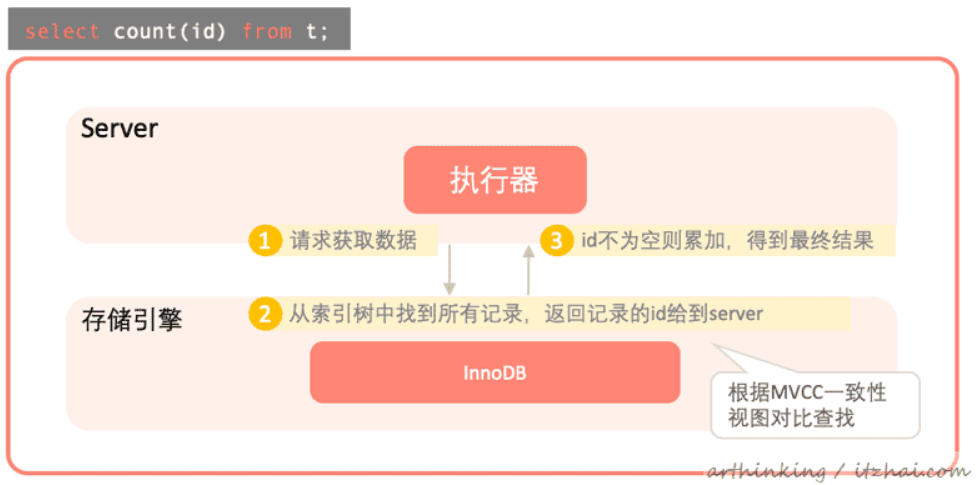

<!-- TOC -->

- [1、count(主键)](#1count主键)
- [2、count(1)](#2count1)
- [3、count(字段)](#3count字段)
- [4、count(*)](#4count)

<!-- /TOC -->

> 统计列与统计行？

COUNT()是一个特殊的函数，有两种不同的作用，它可以统计某个列值的数量，也可以统计行数。

- 在统计列值的时候要求列值是非空的，也就是不统计null。
- 当我们统计行的时候，常见的是COUNT(*)，这种情况下，通配符*并不会像我们猜想的那样扩展成所有的列，实际上，它会忽略所有的列而直接统计所有的行数

```
mysql> EXPLAIN SELECT COUNT(*) FROM sys_user;
+----+-------------+----------+------------+-------+---------------+----------+---------+------+------+----------+-------------+
| id | select_type | table    | partitions | type  | possible_keys | key      | key_len | ref  | rows | filtered | Extra       |
+----+-------------+----------+------------+-------+---------------+----------+---------+------+------+----------+-------------+
|  1 | SIMPLE      | sys_user | NULL       | index | NULL          | username | 152     | NULL |    2 |   100.00 | Using index |
+----+-------------+----------+------------+-------+---------------+----------+---------+------+------+----------+-------------+
1 row in set, 1 warning (0.00 sec)

mysql> EXPLAIN SELECT COUNT(1) FROM sys_user;
+----+-------------+----------+------------+-------+---------------+----------+---------+------+------+----------+-------------+
| id | select_type | table    | partitions | type  | possible_keys | key      | key_len | ref  | rows | filtered | Extra       |
+----+-------------+----------+------------+-------+---------------+----------+---------+------+------+----------+-------------+
|  1 | SIMPLE      | sys_user | NULL       | index | NULL          | username | 152     | NULL |    2 |   100.00 | Using index |
+----+-------------+----------+------------+-------+---------------+----------+---------+------+------+----------+-------------+
1 row in set, 1 warning (0.00 sec)

mysql> EXPLAIN SELECT COUNT(username) FROM sys_user;
+----+-------------+----------+------------+-------+---------------+----------+---------+------+------+----------+-------------+
| id | select_type | table    | partitions | type  | possible_keys | key      | key_len | ref  | rows | filtered | Extra       |
+----+-------------+----------+------------+-------+---------------+----------+---------+------+------+----------+-------------+
|  1 | SIMPLE      | sys_user | NULL       | index | NULL          | username | 152     | NULL |    2 |   100.00 | Using index |
+----+-------------+----------+------------+-------+---------------+----------+---------+------+------+----------+-------------+
1 row in set, 1 warning (0.00 sec)
```
EXPLAIN SELECT COUNT(*) FROM sys_user;

EXPLAIN SELECT COUNT(1) FROM sys_user;

EXPLAIN SELECT COUNT(username) FROM sys_user;

上面三种语句执行过程是一样的。


> 存储引擎的区别

- MyISAM是`Indexed Sequential Access Method （有索引的顺序访问方法) `引擎每张表中存放了一个meta信息，里面包含了row_count属性，内存和文件中各有一份，内存的count变量值通过读取文件中的count值来进行初始化。`但是如果带有where条件，还是必须得进行表扫描。`

- InnoDB引擎执行count()的时候，需要把数据一行行从引擎里面取出来进行统计。


> InnoDB中为何不像MyISAM那样维护一个row_count变量呢？

InnoDB为了实现事务，是需要MVCC支持的。MVCC的关键是一致性视图。一个事务开启瞬间，所有活跃的事务(未提交)构成了一个视图数组，InnoDB就是通过这个视图数组来判断行数据是否需要undo到指定的版本。


> 执行count会影响其他页面buffer pool的命中率吗？

我们知道buffer pool中的LRU算法是是经过改进的，默认情况下，旧子列表(old区)占3/8，count加载的页面一直往旧子列表中插入，在旧子列表中淘汰，不会晋升到新子列表中。所以不会影响其他页面buffer pool的命中率。


# 1、count(主键)

count(主键)执行流程如下：

- 执行器请求存储引擎获取数据；
- 为了保证扫描数据量更少，`存储引擎找到最小的那颗索引树获取所有记录`，返回记录的id给到server。返回记录之前会进行MVCC及其可见性的判断，只返回当前事务可见的数据；
- server获取到记录之后，判断id如果不为空，则累加到结果记录中。




# 2、count(1)

count(1)与count(主键)执行流程基本一致，区别在于，针对查询出的每一条记录，不会取记录中的值，而是直接返回一个"1"用于统计累加。统计了所有的行。


# 3、count(字段)

与count(主键)类似，会筛选非空的字段进行统计。`如果字段没有添加索引，那么会扫描聚集索引树，导致扫描的数据页会比较多，效率相对慢点。`


# 4、count(*)

count(*)不会取记录的值，与count(1)类似。

执行效率对比：count(字段) < count(主键) < count(1)