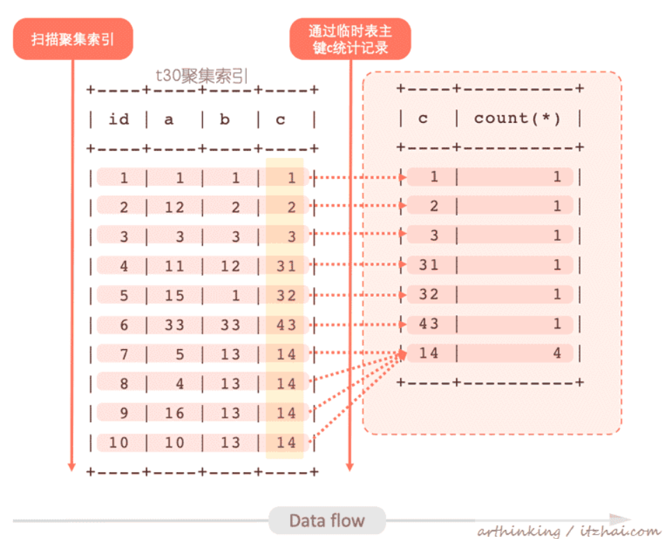
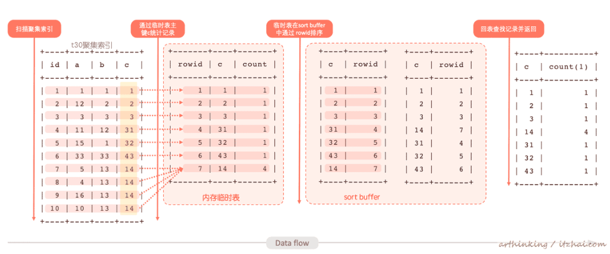
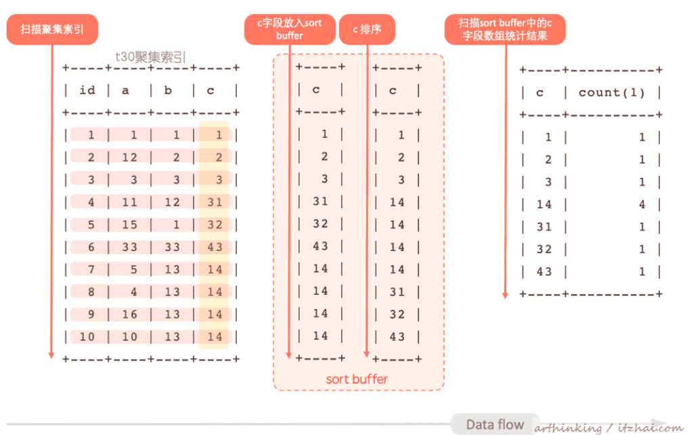

<!-- TOC -->

- [1、完全走索引](#1完全走索引)
- [2、临时表](#2临时表)
- [3、临时表 + 排序](#3临时表--排序)
- [4、直接排序](#4直接排序)
- [5、distinct](#5distinct)
- [6、其他知识点](#6其他知识点)
    - [1、为什么group by后面不能使用列的别名](#1为什么group-by后面不能使用列的别名)
    - [2、group by多字段的顺序不影响结果，只影响结果出现的顺序](#2group-by多字段的顺序不影响结果只影响结果出现的顺序)
    - [3、group by需要注意的事项](#3group-by需要注意的事项)

<!-- /TOC -->


```sql
CREATE TABLE `t30` (
	`id` INT (11) NOT NULL AUTO_INCREMENT,
	`a` INT (11) NOT NULL,
	`b` INT (11) NOT NULL,
	`c` INT (11) NOT NULL,
	PRIMARY KEY (`id`),
	KEY idx_a (a)
) ENGINE = INNODB CHARSET = utf8mb4;

CREATE TABLE `t31` (
	`id` INT (11) NOT NULL AUTO_INCREMENT,
	`a` INT (11) NOT NULL,
	`f` INT (11) NOT NULL,
	`c` INT (11) NOT NULL,
	PRIMARY KEY (`id`),
	KEY idx_a (a)
) ENGINE = INNODB CHARSET = utf8mb4;

INSERT INTO t30 (a, b, c)
VALUES
	(1, 1, 1),
	(12, 2, 2),
	(3, 3, 3),
	(11, 12, 31),
	(15, 1, 32),
	(33, 33, 43),
	(5, 13, 14),
	(4, 13, 14),
	(16, 13, 14),
	(10, 13, 14);

INSERT INTO t31 (a, f, c)
VALUES
	(1, 1, 1),
	(21, 2, 2),
	(3, 3, 3),
	(12, 1, 1),
	(31, 20, 2),
	(4, 10, 3),
	(2, 23, 24),
	(22, 23, 24),
	(5, 23, 24),
	(20, 23, 24);


```

# 1、完全走索引

我们给t30加一个索引：

alter table t30 add index idx_c(c);

执行以下group by sql：

select c, count(*) from t30 group by c;

执行计划如下：

```sql
EXPLAIN select c, count(*) from t30 group by c;

+----+-------------+-------+------------+-------+---------------+-------+---------+------+------+----------+-------------+
| id | select_type | table | partitions | type  | possible_keys | key   | key_len | ref  | rows | filtered | Extra       |
+----+-------------+-------+------------+-------+---------------+-------+---------+------+------+----------+-------------+
|  1 | SIMPLE      | t30   | NULL       | index | idx_c         | idx_c | 4       | NULL |   10 |   100.00 | Using index |
+----+-------------+-------+------------+-------+---------------+-------+---------+------+------+----------+-------------+


```

发现这里只用到了索引，原因是idx_c索引本身就是按照c排序好的，那么直接顺序扫描idx_c索引，可以直接统计到每一个c值有多少条记录，无需做其他的统计了。


# 2、临时表

现在我们把刚刚的idx_c索引给删掉，执行以下sql：

ALTER TABLE t30 drop INDEX idx_c;

select c, count(*) from t30 group by c order by null;

`为了避免排序，所以我们这里添加了 order by null，表示不排序。`

```sql
mysql> explain select c, count(*) from t30 group by c order by null;
+----+-------------+-------+------------+------+---------------+------+---------+------+------+----------+-----------------+
| id | select_type | table | partitions | type | possible_keys | key  | key_len | ref  | rows | filtered | Extra           |
+----+-------------+-------+------------+------+---------------+------+---------+------+------+----------+-----------------+
|  1 | SIMPLE      | t30   | NULL       | ALL  | NULL          | NULL | NULL    | NULL |   10 |   100.00 | Using temporary |
+----+-------------+-------+------------+------+---------------+------+---------+------+------+----------+-----------------+
```

可以发现，这里用到了内存临时表。其执行流程如下：

- 1、扫描t30聚集索引；
- 2、建立一个临时表，以字段c为主键，依次把扫描t30的记录通过临时表的字段c进行累加；
- 3、把最后累加得到的临时表返回给客户端。




# 3、临时表 + 排序

如果我们把上一步的order by null去掉，默认情况下，group by的结果是会通过c字段排序的。我们看看其执行计划：

```sql
mysql> explain select c, count(*) from t30 group by c;
+----+-------------+-------+------------+------+---------------+------+---------+------+------+----------+---------------------------------+
| id | select_type | table | partitions | type | possible_keys | key  | key_len | ref  | rows | filtered | Extra                           |
+----+-------------+-------+------------+------+---------------+------+---------+------+------+----------+---------------------------------+
|  1 | SIMPLE      | t30   | NULL       | ALL  | NULL          | NULL | NULL    | NULL |   10 |   100.00 | Using temporary; Using filesort |
+----+-------------+-------+------------+------+---------------+------+---------+------+------+----------+---------------------------------+
```

可以发现，这里除了用到临时表，还用到了排序。

我们进一步看看其执行的OPTIMIZER_TRACE日志：

```sql
"steps": [ 
    { "creating_tmp_table": 
        { "tmp_table_info": 
            { "table": "intermediate_tmp_table", // 创建中间临时表 
              "row_length": 13, 
              "key_length": 4, 
              "unique_constraint": false, 
              "location": "memory (heap)", 
              "row_limit_estimate": 1290555 } } }, 
    { "filesort_information": [ { "direction": "asc", "table": "intermediate_tmp_table", "field": "c" } ], "filesort_priority_queue_optimization": 
        { "usable": false, 
        "cause": "not applicable (no LIMIT)" // 由于没有 limit，不采用优先级队列排序 
        }, 
    "filesort_execution": [ ], 
    "filesort_summary": 
    { "rows": 7, 
      "examined_rows": 7, 
      "number_of_tmp_files": 0, 
      "sort_buffer_size": 344, 
      "sort_mode": "<sort_key, rowid>" // rowid排序模式 } } ]

```

通过日志也可以发现，这里用到了中间临时表，由于没有limit限制条数，这里没有用到优先级队列排序，这里的排序模式为sort_key, rowid。其执行流程如下：

- 1、扫描t30聚集索引；
- 2、建立一个临时表，以字段c为主键，依次把扫描t30的记录通过临时表的字段c进行累加；
- 3、把得到的临时表放入sort buffer进行排序，这里通过rowid进行排序；
- 4、通过排序好的rowid回临时表查找需要的字段，返回给客户端。



备注：这里的rowid应该指的是临时内存表的id，为什么不采用直接排序c字段和统计结果呢？

> 临时表是存放在磁盘还是内存？

tmp_table_size 参数用于设置内存临时表的大小，如果临时表超过这个大小，那么会转为磁盘临时表：

```sql
mysql> show variables like 'tmp_table_size';
+----------------+----------+
| Variable_name  | Value    |
+----------------+----------+
| tmp_table_size | 10485760 |
+----------------+----------+
1 row in set, 1 warning (0.01 sec)
```

可以通过以下sql设置当前session中的内存临时表大小：SET tmp_table_size = 102400;


# 4、直接排序

查看官方文档的 SELECT Statement，可以发现SELECT后面可以使用许多修饰符来影响SQL的执行效果：

```sql
SELECT [ALL | DISTINCT | DISTINCTROW ] [HIGH_PRIORITY] [STRAIGHT_JOIN] [SQL_SMALL_RESULT] [SQL_BIG_RESULT] [SQL_BUFFER_RESULT] [SQL_CACHE | SQL_NO_CACHE] [SQL_CALC_FOUND_ROWS] select_expr [, select_expr] ... [into_option] [FROM table_references [PARTITION partition_list]] [WHERE where_condition] [GROUP BY {col_name | expr | position} [ASC | DESC], ... [WITH ROLLUP]] [HAVING where_condition] [ORDER BY {col_name | expr | position} [ASC | DESC], ...] [LIMIT {[offset,] row_count | row_count OFFSET offset}] [PROCEDURE procedure_name(argument_list)] [into_option] [FOR UPDATE | LOCK IN SHARE MODE] into_option: { INTO OUTFILE 'file_name' [CHARACTER SET charset_name] export_options | INTO DUMPFILE 'file_name' | INTO var_name [, var_name] ... }
```

这里我们重点关注下这两个：

- SQL_BIG_RESULT：可以在包含group by 和distinct的SQL中使用，提醒优化器查询数据量很大，这个时候MySQL会直接选用磁盘临时表取代内存临时表，避免执行过程中发现内存不足才转为磁盘临时表。这个时候更倾向于使用排序取代二维临时表统计结果。

- SQL_SMALL_RESULT：可以在包含group by 和distinct的SQL中使用，提醒优化器数据量很小，提醒优化器直接选用内存临时表，这样会通过临时表统计，而不是排序。
当然，在平时工作中，不是特定的调优场景，以上两个修饰符还是比较少用到的。

接下来我们就通过例子来说明下使用了SQL_BIG_RESULT修饰符的SQL执行流程。

有如下SQL：

```sql
mysql> explain select SQL_BIG_RESULT c, count(*) from t30 group by c;
+----+-------------+-------+------------+------+---------------+------+---------+------+------+----------+----------------+
| id | select_type | table | partitions | type | possible_keys | key  | key_len | ref  | rows | filtered | Extra          |
+----+-------------+-------+------------+------+---------------+------+---------+------+------+----------+----------------+
|  1 | SIMPLE      | t30   | NULL       | ALL  | NULL          | NULL | NULL    | NULL |   10 |   100.00 | Using filesort |
+----+-------------+-------+------------+------+---------------+------+---------+------+------+----------+----------------+
1 row in set, 1 warning (0.00 sec)
```

可以发现，这里只用到了排序，没有用到索引或者临时表。这里用到了SQL_BIG_RESULT修饰符，告诉优化器group by的数据量很大，直接选用磁盘临时表，但磁盘临时表存储效率不高，最终优化器使用数组排序的方式来完成这个查询。（当然，这个例子实际的结果集并不大，只是作为演示用）

其执行结果如下：

- 1、扫描t30表，逐行的把c字段放入sort buffer；
- 2、在sort buffer中对c字段进行排序，得到一个排序好的c数组；
- 3、遍历这个排序好的c数组，统计结果并输出。



> group by 优化建议

- 尽量让group by走索引，能最大程度的提高效率；
- 如果group by结果不需要排序，那么可以加上group by null，避免进行排序；
- 如果group by的数据量很大，可以使用SQL_BIG_RESULT修饰符，提醒优化器应该使用排序算法得到group的结果。


# 5、distinct

在大多数情况下，DISTINCT可以考虑为GROUP BY的一个特殊案例，如下两个SQL是等效的：

select distinct a, b, c from t30; 

select a, b, c from t30 group by a, b, c order by null;

这两个SQL的执行计划如下：

```sql
mysql> explain  select a, b, c from t30 group by a, b, c order by null;
+----+-------------+-------+------------+------+---------------+------+---------+------+------+----------+-----------------+
| id | select_type | table | partitions | type | possible_keys | key  | key_len | ref  | rows | filtered | Extra           |
+----+-------------+-------+------------+------+---------------+------+---------+------+------+----------+-----------------+
|  1 | SIMPLE      | t30   | NULL       | ALL  | NULL          | NULL | NULL    | NULL |   10 |   100.00 | Using temporary |
+----+-------------+-------+------------+------+---------------+------+---------+------+------+----------+-----------------+
1 row in set, 1 warning (0.00 sec)

mysql> explain select distinct a, b, c from t30;
+----+-------------+-------+------------+------+---------------+------+---------+------+------+----------+-----------------+
| id | select_type | table | partitions | type | possible_keys | key  | key_len | ref  | rows | filtered | Extra           |
+----+-------------+-------+------------+------+---------------+------+---------+------+------+----------+-----------------+
|  1 | SIMPLE      | t30   | NULL       | ALL  | NULL          | NULL | NULL    | NULL |   10 |   100.00 | Using temporary |
+----+-------------+-------+------------+------+---------------+------+---------+------+------+----------+-----------------+
```

由于这种等效性，适用于Group by的查询优化也适用于DISTINCT。

`区别：distinct是在group by之后的每组中取出一条记录，distinct分组之后不进行排序。`


> Extra中的distinct

在一个关联查询中，如果您只是查询驱动表的列，并且在驱动表的列中声明了distinct关键字，那么优化器会进行优化，在被驱动表中查找到匹配的第一行时，将停止继续扫描。如下SQL：

explain select distinct t30.a from t30, t31 where t30.c=t30.c;

执行计划如下，可以发现Extra列中有一个distinct，该标识即标识用到了这种优化：


```sql
mysql> explain select distinct t30.a from t30, t31 where t30.c=t30.c;
+----+-------------+-------+------------+-------+---------------+-------+---------+------+------+----------+--------------------------------------------------------------+
| id | select_type | table | partitions | type  | possible_keys | key   | key_len | ref  | rows | filtered | Extra                                                        |
+----+-------------+-------+------------+-------+---------------+-------+---------+------+------+----------+--------------------------------------------------------------+
|  1 | SIMPLE      | t30   | NULL       | ALL   | idx_a         | NULL  | NULL    | NULL |   10 |   100.00 | Using temporary                                              |
|  1 | SIMPLE      | t31   | NULL       | index | NULL          | idx_a | 4       | NULL |   10 |   100.00 | Using index; Distinct; Using join buffer (Block Nested Loop) |
+----+-------------+-------+------------+-------+---------------+-------+---------+------+------+----------+--------------------------------------------------------------+
```


# 6、其他知识点

## 1、为什么group by后面不能使用列的别名

一个问题：

```sql
select count(billingdate),to_char(billingdate,'YYYYmm') month  from tu_trade
where to_char(billingdate,'YYYY') ='2017'and reportstat = 30
group by month; 

-----执行报错，can't resolve month............

```

因为Sql语句执行顺序：

```
(7)    SELECT
(8)    DISTINCT <select_list>
(1)    FROM <left_table>
(3)    <join_type> JOIN <right_table>
(2)    ON <join_condition>
(4)    WHERE <where_condition>
(5)    GROUP BY <group_by_list>
(6)    HAVING <having_condition>
(9)    ORDER BY <order_by_condition>
(10)   LIMIT <limit_number> 
```

Group by不能用别名的原因，因为执行到groupby（5）时，还没执行到select中的别名，所以别名还没生效。所以别名只能放到（7）之后，比如order中，distinct中。遇到这种问题可以使用子查询替代

```sql
SELECT
	MONTH,
	count(MONTH)
FROM
	(
		select
		count (billingdate),
		to_char (billingdate, 'YYYYmm')   AS MONTH
	FROM
		tu_trade 
		where to_char (billingdate, 'YYYY') = '2017'
	AND reportstat = 30
	) a
GROUP BY MONTH
```

[注意]
- 在mysql中，group by中可以使用别名；where中不能使用别名；order by中可以使用别名。
- 其余像oracle，hive中别名的使用都是严格遵循sql执行顺序的，groupby后面不能用别名。mysql特殊是因为mysql中对查询做了加强。


## 2、group by多字段的顺序不影响结果，只影响结果出现的顺序

group by 后面的字段顺序只是影响了结果的顺序，不会影响结果的值。如果是 group by a,b那么就是按照 order by a,b 的顺序分组，因为分组是需要先排序的；反之 group by b,a 就是按照b,a的顺序分组

测试
```sql
#建表
CREATE TABLE tb(col1 INT,col2 INT,col3 INT)

#插入数据
INSERT tb
SELECT 1,3,5 UNION ALL
SELECT 1,3,5 UNION ALL
SELECT 2,1,8 UNION ALL
SELECT 2,1,8 UNION ALL
SELECT 3,2,3 UNION ALL
SELECT 3,2,3 UNION ALL
SELECT 4,0,NULL UNION ALL
SELECT 4,0,NULL

#表中的数据
SELECT * FROM tb
1	3	5
1	3	5
2	1	8
2	1	8
3	2	3
3	2	3
4	0	
4	0	


# 不同字段顺序分组结果分析
SELECT * FROM tb GROUP BY col1 ,col2 ,col3
SELECT * FROM tb GROUP BY col2 ,col3 ,col1
SELECT * FROM tb GROUP BY col3 ,col2 ,col1

# 结果1
1	3	5
2	1	8
3	2	3
4	0	
# 结果2
4	0	
2	1	8
3	2	3
1	3	5
# 结果3
4	0	
3	2	3
1	3	5
2	1	8


 
SELECT * FROM tb GROUP BY col1 ,col2 ,col3 ORDER BY col1 ,col2 ,col3
SELECT * FROM tb GROUP BY col2 ,col3 ,col1 ORDER BY col1 ,col2 ,col3
SELECT * FROM tb GROUP BY col3 ,col2 ,col1 ORDER BY col1 ,col2 ,col3
# 上面三条SQL得到的是同样的结果
1	3	5
2	1	8
3	2	3
4	0	

```

## 3、group by需要注意的事项

- 1、过滤分组：对分组过于采用HAVING子句。HAVING子句支持所有WHERE的操作。HAVING与WHERE的区别在于WHERE是过滤行的，而HAVING是用来过滤分组。另一种理解WHERE与HAVING的区别的方法是，WHERE在分组之前过滤，而HAVING在分组之后以每组为单位过滤。


