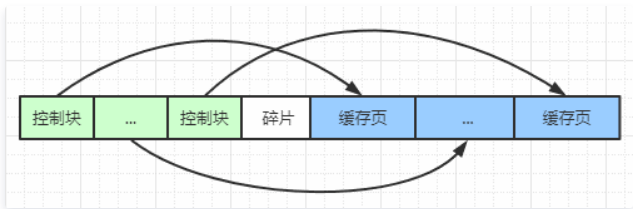
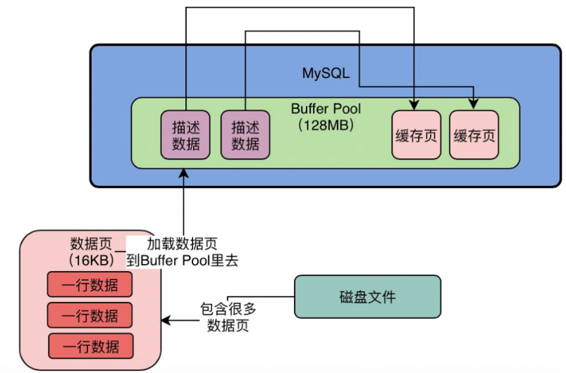
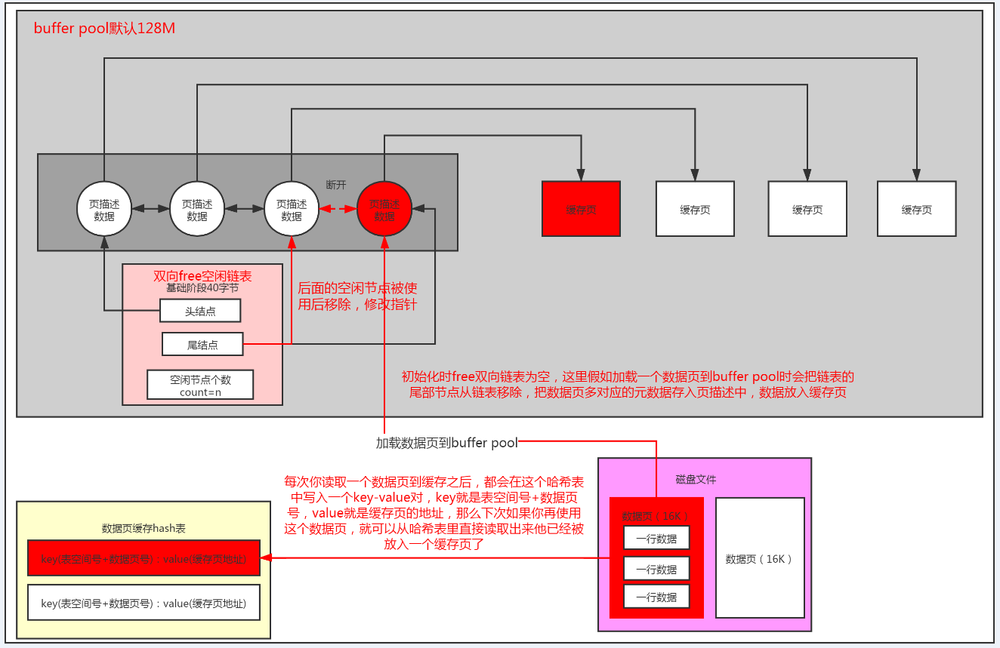
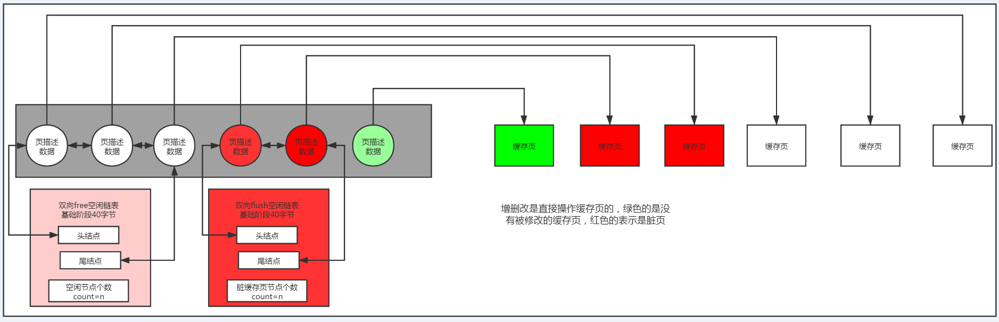
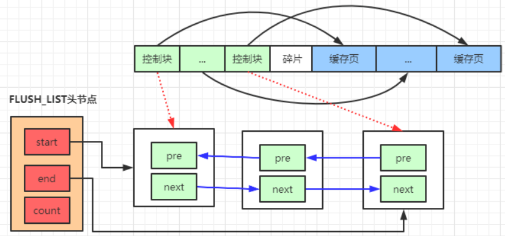
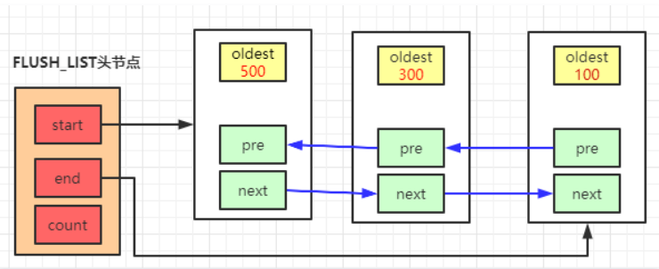
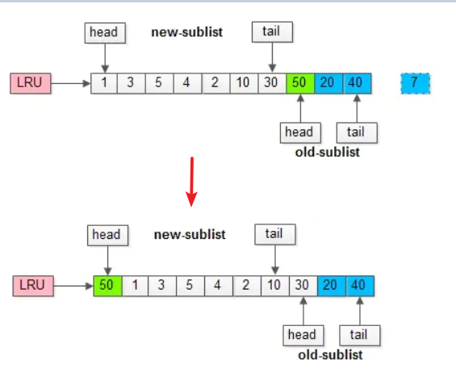
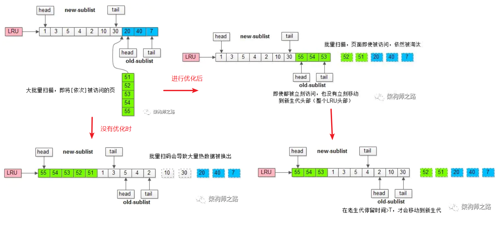
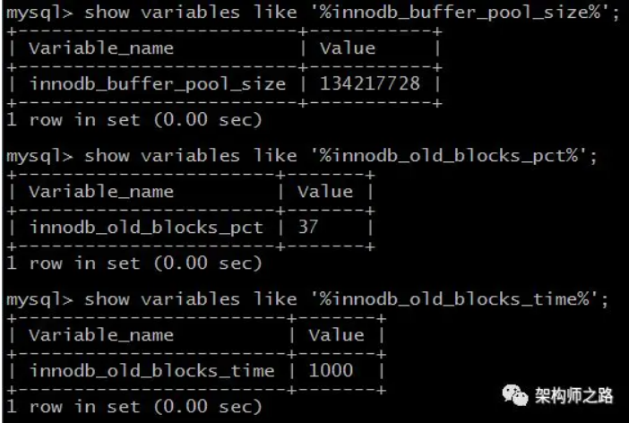

<!-- TOC -->

- [1、Buffer Pool解析](#1buffer-pool解析)
    - [1、缓存页](#1缓存页)
    - [2、buffer pool的初始化](#2buffer-pool的初始化)
    - [3、怎么知道哪些缓存页是空闲的呢？](#3怎么知道哪些缓存页是空闲的呢)
    - [4、怎么知道那些缓存页的数据和磁盘不一致需要进行刷盘？](#4怎么知道那些缓存页的数据和磁盘不一致需要进行刷盘)
    - [5、当Buffer Pool中的缓存页不够的时候，如何基于LRU算法淘汰部分缓存？](#5当buffer-pool中的缓存页不够的时候如何基于lru算法淘汰部分缓存)
        - [1、优化1：预读失效](#1优化1预读失效)
        - [2、优化2：缓冲池污染，即类似全表扫描造成热点缓存失效](#2优化2缓冲池污染即类似全表扫描造成热点缓存失效)
        - [3、innodb的lru算法中三个比较重要的参数](#3innodb的lru算法中三个比较重要的参数)
- [参考](#参考)

<!-- /TOC -->

> Buffer Pool中的三个链表

- free链表
- lru链表
- flush链表

这三个重要列表（LRU list， free list，flush list）的关系可以用下图表示：


Free链表跟LRU链表的关系是相互流通的，页在这两个链表间来回置换。而FLUSH链表记录了脏页数据，也是通过指针指向了LRU链表，所以图中FLUSH链表被LRU链表包裹。


# 1、Buffer Pool解析

innodb buffer pool内存构成如下：



备注：控制块概念等同于`描述数据`

可以看到，buffer pool是由"控制块"和"缓存数据页"组成的，二者一一对应，其中：

- 1、控制块中的内容主要是缓存数据页的页号、表空间号、数据页所在buffer pool中的地址等一系列信息；

- 2、单个控制块的大小约为缓存数据页的5%左右；

- 3、控制块的大小不计入buffer pool的分配空间中，所以，假如你分配了1G的buffer pool，那么实际占用的内存大小可能大于1G，因为MySQL实例启动的时候，需要记入控制块的大小。


> 1、InnoDB的缓冲池缓存作用

缓存表数据与索引数据，把磁盘上的数据加载到缓冲池，避免每次访问都进行磁盘IO，起到加速访问的作用。

> 2、预读

磁盘读写，并不是按需读取，而是按页读取，一次至少读一页数据（一般是4K`指的Linux默认中内存的页大小是4kb，即linux操作系统和磁盘交互是以4kb交互`），如果未来要读取的数据就在页中，就能够省去后续的磁盘IO，提高效率。预读为什么有效？“局部性原理”


因为Buffer Pool本质其实就是数据库的一个内存组件，你可以理解为他就是一片内存数据结构，所以这个内存数据结构肯定是有一定的大小的，不可能是无限大的。`这个Buffer Pool默认情况下是128MB`，还是有一点偏小了，我们实际生产环境下完全可以对Buffer Pool进行调整。

```sql
mysql> select @@innodb_buffer_pool_size;
+---------------------------+
| @@innodb_buffer_pool_size |
+---------------------------+
|                   8388608 |
+---------------------------+
1 row in set (0.03 sec)
```

8388608 = 8M

## 1、缓存页

MySQL对数据抽象出来了一个数据页的概念，他是把很多行数据放在了一个数据页里，也就是说我们的磁盘文件中就是会有很多的数据页，每一页数据里放了很多行数据。

实际上默认情况下，磁盘中存放的数据页的大小是16KB，也就是说，一页数据包含了16KB的内容。而`Buffer Pool中存放的一个一个的数据页，我们通常叫做缓存页`，因为毕竟Buffer Pool是一个缓冲池，里面的数据都是从磁盘缓存到内存去的。`而Buffer Pool中默认情况下，一个缓存页的大小和磁盘上的一个数据页的大小是一一对应起来的，都是16KB。`


对于每个缓存页，他实际上都会有一个描述信息，这个描述信息大体可以认为是用来描述这个缓存页的。比如包含如下的一些东西：这个数据页所属的表空间、数据页的编号、这个缓存页在Buffer Pool中的地址以及别的一些杂七杂八的东西。

每个缓存页都会对应一个描述信息，这个描述信息本身也是一块数据，在Buffer Pool中，每个缓存页的描述数据放在最前面，然后各个缓存页放在后面。如下图所示




而且这里我们要注意一点，Buffer Pool中的描述数据大概相当于缓存页大小的5%左右，也就是每个描述数据大概是800个字节左右的大小，然后假设你设置的buffer pool大小是128MB，实际上Buffer Pool真正的最终大小会超出一些，可能有个130多MB的样子，因为他里面还要存放每个缓存页的描述数据。


## 2、buffer pool的初始化


数据库启动时，会按照你设置的Buffer Pool大小，稍微再加大一点，去找操作系统申请一块内存区域，作为Buffer Pool的内存区域。然后当内存区域申请完毕之后，数据库就会按照默认的缓存页的16KB的大小以及对应的800个字节左右的描述数据的大小，在Buffer Pool中划分出来一个一个的缓存页和一个一个的他们对应的描述数据。然后当数据库把Buffer Pool划分完毕之后，看起来就是上图所示的那样。只不过这个时候，`Buffer Pool中的一个一个的缓存页都是空的`，里面什么都没有，要等数据库运行起来之后，当我们要对数据执行增删改查的操作的时候，才会把数据对应的页从磁盘文件里读取出来，放入Buffer Pool中的缓存页中。


## 3、怎么知道哪些缓存页是空闲的呢？



通过维护一个free双向链表来记录那些缓存页是空闲的可以使用，空闲链表的外部节点记录还有多少个空闲页以及空闲页的头部和尾部指针；


## 4、怎么知道那些缓存页的数据和磁盘不一致需要进行刷盘？



通过维护一个flush双向链表来记录那些缓存页的数据和磁盘不一致需要进行刷盘，结构同free链表；

Innodb存储引擎会将脏页的控制块放入一个flush list的链表中，注意，这里链表中不是真实的缓存数据页，而是数据页对应的控制块。用图来表示就是：



其中，start指向flush链表头节点的地址，end指向flush链表尾节点的地址，控制块节点之间通过pre和next指针相连，组成双向链表。如果再有新的控制块加入到当前列表，则采用"头插法"来插入到flush 列表中。


`问题：控制块信息会同时存在lru链表和flush链表吗？`


当某个数据页在内存中第一次被修改的时候，会将它加入到flush链表中，后续如果这个页面再次被改动，那么不再再次插入flush链表。在将控制块加入到flush链表的过程中，会记录该控制块的2条属性：oldest_modification值和newest_modification值

顾名思义，oldest是指修改该页面的mtr（` MTR全称是Mini-Transaction，顾名思义，可以理解为"最小的事务"，MySQL中把对底层页面的一次原子访问的过程称之为一个Mini-Transaction`）第一次开始时候的lsn(`LSN（log sequence number）日志序列号`)号，newest是指最后一次修改该页面的mtr结束时候的lsn号。这样，你能够理解，在flush链表生成过程中，由于使用'头插法'进行插入，控制块的oldest_modification这个值应该是从右到左有序的，举例如下：




## 5、当Buffer Pool中的缓存页不够的时候，如何基于LRU算法淘汰部分缓存？

淘汰机制就是淘汰那些缓存命中率低即不经常被访问的缓存页，就是你怎么知道哪些缓存页经常被访问，哪些缓存页很少被访问？此时就要引入一个新的LRU链表了，这个所谓的LRU就是Least Recently Used，最近最少使用的意思。

这个LRU链表大致是怎么个工作原理呢？简单来说，假设我们从磁盘加载一个数据页到缓存页的时候，就把这个缓存页的描述数据块放到LRU链表头部去，那么只要有数据的缓存页，他都会在LRU里了，而且最近被加载数据的缓存页，`都会放到LRU链表的头部去。`然后假设某个缓存页的描述数据块本来在LRU链表的尾部，后续你只要查询或者修改了这个缓存页的数据，也要把这个缓存页挪动到LRU链表的头部去，也就是说最近被访问过的缓存页，一定在LRU链表的头部。

那么这样的话，当你的缓存页没有一个空闲的时候，你是不是要找出来那个最近最少被访问的缓存页去刷入磁盘？`此时你就直接在LRU链表的尾部找到一个缓存页，他一定是最近最少被访问的那个缓存页！`然后你就把LRU链表尾部的那个缓存页刷入磁盘中，然后把你需要的磁盘数据页加载到腾出来的空闲缓存页中就可以了！

`传统的LRU缓冲池算法十分直观，OS，memcache等很多软件都在用，MySQL为啥这么矫情，不能直接用呢？`


这里有两个问题：（1）预读失效；（2）缓冲池污染；


### 1、优化1：预读失效

什么是预读失效？由于预读(Read-Ahead)，提前把页放入了缓冲池，但最终MySQL并没有从页中读取数据，称为预读失效。


如何对预读失效进行优化？要优化预读失效，思路是：

- （1）让预读失败的页，停留在缓冲池LRU里的时间尽可能短；

- （2）让真正被读取的页，才挪到缓冲池LRU的头部；

以保证，真正被读取的热数据留在缓冲池里的时间尽可能长。具体方法是：

- （1）将LRU分为两个部分：新生代(new sublist)和老生代(old sublist)

- （2）新老生代收尾相连，即：新生代的尾(tail)连接着老生代的头(head)；

- （3）新页（例如被预读的页）加入缓冲池时，只加入到老生代头部：

如果数据真正被读取（预读成功），才会加入到新生代的头部。如果数据没有被读取，则会比新生代里的“热数据页”更早被淘汰出缓冲池


举个例子，整个缓冲池LRU如上图：

- （1）整个LRU长度是10；

- （2）前70%是新生代；

- （3）后30%是老生代；

- （4）新老生代首尾相连；

假如有一个页号为50的新页被预读加入缓冲池：

- （1）50只会从老生代头部插入，老生代尾部（也是整体尾部）的页会被淘汰掉；

- （2）假设50这一页不会被真正读取，即预读失败，它将比新生代的数据更早淘汰出缓冲池；

假如50这一页立刻被读取到，例如SQL访问了页内的行row数据：

- （1）它会被立刻加入到新生代的头部；

- （2）新生代的页会被挤到老生代，此时并不会有页面被真正淘汰；

改进版缓冲池LRU能够很好的解决“预读失败”的问题。如下图所示：




### 2、优化2：缓冲池污染，即类似全表扫描造成热点缓存失效

什么是MySQL缓冲池污染？当某一个SQL语句，要批量扫描大量数据时，可能导致把缓冲池的所有页都替换出去，导致大量热数据被换出，MySQL性能急剧下降，这种情况叫缓冲池污染。

例如，有一个数据量较大的用户表，当执行：

select * from user where name like "%shenjian%";

虽然结果集可能只有少量数据，但这类like不能命中索引，必须全表扫描，就需要访问大量的页：
- （1）把页加到缓冲池（插入老生代头部）；
- （2）从页里读出相关的row（插入新生代头部）；
- （3）row里的name字段和字符串shenjian进行比较，如果符合条件，加入到结果集中；
- （4）…直到扫描完所有页中的所有row…

如此一来，所有的数据页都会被加载到新生代的头部，但只会访问一次，真正的热数据被大量换出。

怎么解决这类扫描大量数据导致的缓冲池污染问题呢？

MySQL缓冲池加入了一个`“老生代停留时间窗口”`的机制：

- （1）假设T=老生代停留时间窗口；

- （2）插入老生代头部的页，即使立刻被访问，并不会立刻放入新生代头部；

- （3）只有满足“被访问”并且“在老生代停留时间”大于T，才会被放入新生代头部；




继续举例，假如批量数据扫描，有51，52，53，54，55等五个页面将要依次被访问。如果没有“老生代停留时间窗口”的策略，这些批量被访问的页面，会换出大量热数据。加入“老生代停留时间窗口”策略后，短时间内被大量加载的页，并不会立刻插入新生代头部，而是优先淘汰那些，短期内仅仅访问了一次的页。而只有在老生代呆的时间足够久，停留时间大于T，才会被插入新生代头部。


### 3、innodb的lru算法中三个比较重要的参数



- innodb_buffer_pool_size：配置缓冲池的大小，在内存允许的情况下，DBA往往会建议调大这个参数，越多数据和索引放到内存里，数据库的性能会越好。

- innodb_old_blocks_pct：老生代占整个LRU链长度的比例，默认是37，即整个LRU中新生代与老生代长度比例是63:37。`如果把这个参数设为100，就退化为普通LRU了`

- innodb_old_blocks_time：老生代停留时间窗口，单位是毫秒，默认是1000，即同时满足“被访问”与“在老生代停留时间超过1秒”两个条件，才会被插入到新生代头部。

> 总结

缓冲池(buffer pool)是一种常见的降低磁盘访问的机制；缓冲池通常以页(page)为单位缓存数据；缓冲池的常见管理算法是LRU，memcache，OS，InnoDB都使用了这种算法；InnoDB对普通LRU进行了优化：

- 将缓冲池分为老生代和新生代，入缓冲池的页，优先进入老生代，页被访问，才进入新生代，以解决预读失效的问题

- 页被访问，且在老生代停留时间超过配置阈值的，才进入新生代，以解决批量数据访问，大量热数据淘汰的问题


# 参考

- [缓冲池(buffer pool)，这次彻底懂了！！！](https://juejin.cn/post/6844903874172551181)

- [Innodb buffer pool的flush链表](https://cloud.tencent.com/developer/article/1670731)