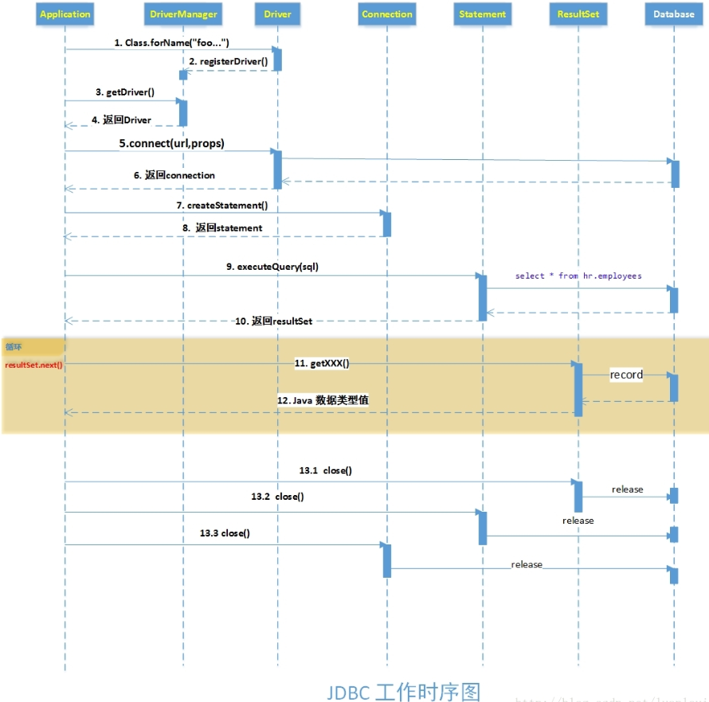
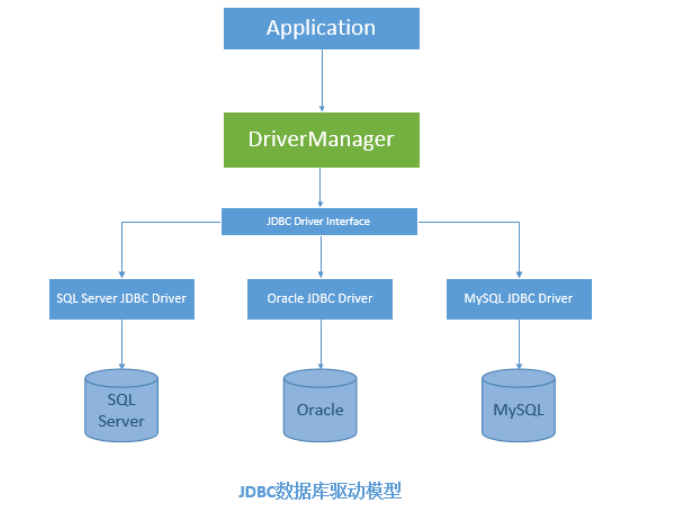
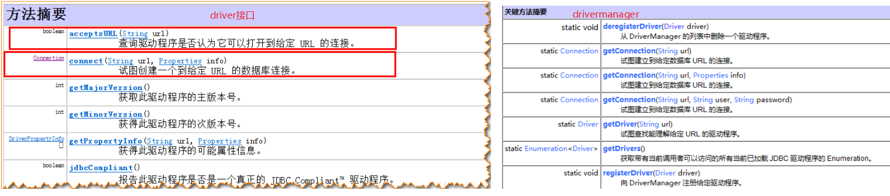
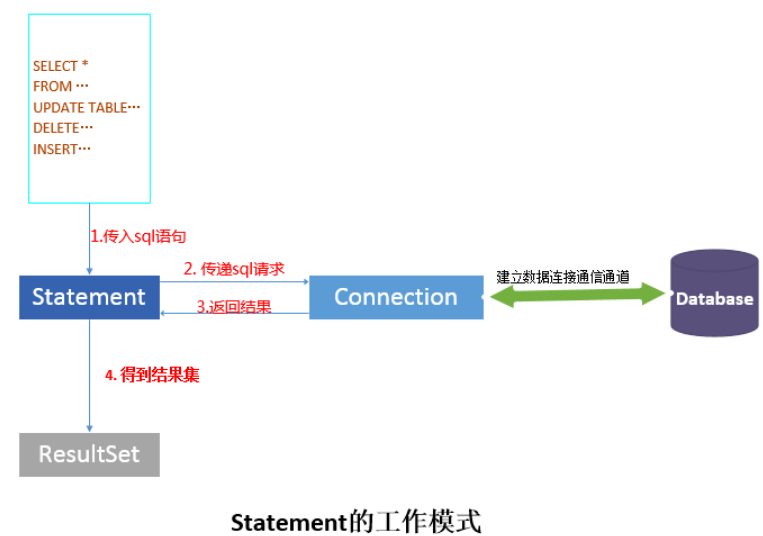
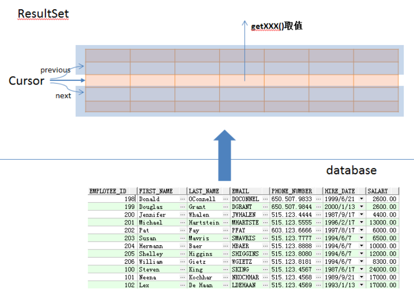

<!-- TOC -->

- [1、驱动加载原理](#1驱动加载原理)
- [2、JDBC层次结构和基本构成](#2jdbc层次结构和基本构成)
    - [1、Connection](#1connection)
        - [1.创建可以执行sql语句或者存储过程的对象statement，用来和数据库进行交互；](#1创建可以执行sql语句或者存储过程的对象statement用来和数据库进行交互)
        - [2.控制sql语句的事务:](#2控制sql语句的事务)
        - [3.获取数据库连接的元数据DatabaseMetaData，即数据库的整体综合信息。](#3获取数据库连接的元数据databasemetadata即数据库的整体综合信息)
    - [2、Statement](#2statement)
        - [1.对sql语句类型不进行区分，执行sql语句的方法](#1对sql语句类型不进行区分执行sql语句的方法)
        - [2.对查询类型的sql语句的执行方法](#2对查询类型的sql语句的执行方法)
        - [3.对更新类的sql语句 的执行方法](#3对更新类的sql语句-的执行方法)
        - [4.批量sql的执行方法](#4批量sql的执行方法)
    - [3、ResultSet](#3resultset)
        - [1、ResultSet游标的移动和定位](#1resultset游标的移动和定位)
        - [2、ResultSet结果集的元数据信息](#2resultset结果集的元数据信息)
        - [3、ResultSet.getXXX(param) 、ResultSet.updateXXX()的XXX问题](#3resultsetgetxxxparam-resultsetupdatexxx的xxx问题)
- [3、源码解析](#3源码解析)
    - [1、Driver](#1driver)
        - [1、NonRegisteringDriver类[MySQL货物connection的关键类]](#1nonregisteringdriver类mysql货物connection的关键类)
- [9、其他](#9其他)
- [参考](#参考)

<!-- /TOC -->


> JDBC典型应用

下面是个最简单的使用JDBC取得数据的应用。主要能分成几个步骤，分别是:
- 1.加载特定数据库驱动器实现类，并注册驱动器（Driver会注册到DriverManager中）；[根据SPI机制，这一步可以省略]
- 2.根据特定的URL，返回可以接受此URL的数据库驱动对象Driver；
- 3.使用数据库驱动 Driver 创建数据库连接Connection会话；
- 4.使用 Connection对象创建 用于操作sql的Statement对象；
- 5.statement对象 执行 sql语句，返回结果ResultSet 对象；
- 6.处理ResultSet中的结果；
- 7.关闭连接，释放资源。

典型的代码示例：
```java
 public class DBConnection {
 
	static final String  URL = "jdbc:mysql://localhost:3306/test";
	static final String USER_NAME ="admin";
	static final String PASSWORD = "123456";
	
	public static void main(String[] args) {
		connectionTest();
	}
	
	public static void connectionTest(){
		
		Connection connection = null;
		Statement statement = null;
		ResultSet resultSet = null;
		
		try {
			//1.加载类，并注册驱动器（Driver会注册到DriverManager中）
			
			//加载Oracle数据库驱动
			Class.forName("com.mysql.jdbc.Driver").newInstance();
			
			//2.根据特定的URL，返回可以接受此URL的数据库驱动对象
			Driver driver = DriverManager.getDriver(URL);
			Properties props = new Properties();
			props.put("user", USER_NAME);
			props.put("password", PASSWORD);
			
			//3.使用数据库驱动创建数据库连接Connection会话
			connection = driver.connect(URL, props);
			
			//4.获得Statement对象
			statement = connection.createStatement();
			//5.执行 sql语句，返回结果
			resultSet = statement.executeQuery("select * from hr.employees");
			//6.处理结果，取出数据
			while(resultSet.next())
			{
				System.out.println(resultSet.getString(2));
			}
			
			//7.关闭链接，释放资源
		} catch (ClassNotFoundException e) {
			System.out.println("加载mysql类失败！");
			e.printStackTrace();
		} catch (SQLException e) {
			e.printStackTrace();
		} catch (InstantiationException e) {
			// TODO Auto-generated catch block
			e.printStackTrace();
		} catch (IllegalAccessException e) {
			// TODO Auto-generated catch block
			e.printStackTrace();
		}finally{
			    //使用完成后管理链接，释放资源，释放顺序应该是： ResultSet ->Statement ->Connection
				try {
					resultSet.close();
				} catch (SQLException e) {
					e.printStackTrace();
				}
				
				try {
					statement.close();
				} catch (SQLException e) {
					e.printStackTrace();
				}
				
				try {
					connection.close();
				} catch (SQLException e) {
					e.printStackTrace();
				}
		}
	}
}
```




# 1、驱动加载原理

一般情况下，在应用程序中进行数据库连接，调用JDBC接口，首先要将特定厂商的JDBC驱动实现加载到系统内存中，然后供系统使用。基本结构图如下：



驱动加载入内存的过程：这里所谓的驱动，其实就是实现了java.sql.Driver接口的类。如mysql的驱动类是 com.mysql.jdbc.Driver.class（此类可以在oracle提供的JDBC jar包中找到），此类实现了java.sql.Driver接口。

由于驱动本质上还是一个class，将驱动加载到内存和加载普通的class原理是一样的:使用Class.forName("driverName")。以下是将常用的数据库驱动加载到内存中的代码：

```java
//加载MySQL 数据库驱动
Class.forName("com.mysql.jdbc.Driver");
```

注意：Class.forName()将对应的驱动类加载到内存中，然后执行内存中的static静态代码段，代码段中，会创建一个驱动Driver的实例，放入DriverManager中，供DriverManager使用。

事实上，一般我们操作Driver，获取Connection对象都是交给DriverManager统一管理的。DriverManger可以注册和删除加载的驱动程序，可以根据给定的url获取符合url协议的驱动Driver或者是建立Conenction连接，进行数据库交互。





DriverManager 内部持有这些注册进来的驱动 Driver，由于这些驱动都是 java.sql.Driver 类型，那么怎样才能获得指定厂商的驱动Driver呢？答案就在于：java.sql.Driver接口规定了厂商实现该接口，并且定义自己的URL协议。厂商们实现的Driver接口通过acceptsURL(String url)来判断此url是否符合自己的协议，如果符合自己的协议，则可以使用本驱动进行数据库连接操作，查询驱动程序是否认为它可以打开到给定 URL 的连接。

对于驱动加载后，如何获取指定的驱动程序呢？这里，DriverManager的静态方法getDriver(String url)可以通过传递给的URL，返回可以打开此URL连接的Driver。


# 2、JDBC层次结构和基本构成

总体而言，JDBC包含以下几大角色 : Driver、DriverManager、Connection、Statement、ResultSet。这几大角色之间的层次关系如下图所示：

- Connection：Driver 或者 DriverManager根据连接的url 和参数信息创建Connection实例，用来维持和数据库的数据通信，如果没有销毁或者调用close()对象，此对象和数据库的对象会一直保持连接；

- Statement：Connection创建Statement对象，表示需要执行的sql语句或者存储过程；

- ResultSet： 表示Statement执行完SQL语句后返回的结果集。


## 1、Connection

Connection表示与特定数据库的连接，可以获取到数据库的一些信息，这些信息包括：其表信息，应该支持的SQL语法，数据库内有什么存储过程，此链接功能的信息等等。

在一般实际使用情况下，我们关注的Connection的功能有以下几点：

### 1.创建可以执行sql语句或者存储过程的对象statement，用来和数据库进行交互；


```java
//加载Oracle数据库驱动
Class.forName("com.mysql.jdbc.Driver");

//根据特定的URL，返回可以接受此URL的数据库驱动对象
Driver driver = DriverManager.getDriver(URL);

//使用数据库驱动创建数据库连接Connection会话
Connection connection = driver.connect(URL, props);

//创建静态的sql语句  Statement 对象来将 SQL 语句发送到数据库。
Statement staticStatement= connection.createStatement();

//创建CallableStatement 对象来调用数据库存储过程。
CallableStatement callableStatement = connection.prepareCall(sqlString);

//创建参数化的Statement对象
PreparedStatement preparedStatement = connection.prepareStatement(sqlString);
```


### 2.控制sql语句的事务: 

Connection默认情况下，对于创建的statement执行的sql语句都是自动提交的，即在statement语句执行完后，自动执行commit操作，将结果影响到物理数据库。为了满足更好地事务控制需求，我们也可以手动地控制事务，手动地对statement 的sql语句执行进行提交(commit)或者回滚(rollback)。

```java
String sqlString="insert into tableName(column1,column2) values(value1,value2)";
//加载Oracle数据库驱动
Class.forName("com.mysql.jdbc.Driver");

//根据特定的URL，返回可以接受此URL的数据库驱动对象
Driver driver = DriverManager.getDriver(URL);

//使用数据库驱动创建数据库连接Connection会话
connection = driver.connect(URL, props);
//使用自定义的事务，要设置connection不自动提交
connection.setAutoCommit(false);

//创建静态的sql语句  Statement 对象来将 SQL 语句发送到数据库。
Statement staticStatement= connection.createStatement();
try{
    //执行插入操作
    staticStatement.execute(sqlString);
    staticStatement.getConnection().commit();//和上面的connection等价，statement只有一个创建自身的connection的引用
}catch(Exception e){
    //有异常，则rollback
    staticStatement.getConnection().rollback();
}
```


### 3.获取数据库连接的元数据DatabaseMetaData，即数据库的整体综合信息。

连接的数据库整体信息被封装在了一个 DatabaseMetaData类型的对象上，可以通过以下代码获得：DatabaseMetaData databaseMetaData = connection.getMetaData();

## 2、Statement

Statement 的功能在于根据传入的sql语句，将传入sql经过整理组合成数据库能够识别的sql语句(对于静态的sql语句，不需要整理组合；而对于预编译sql语句和批量语句，则需要整理)，然后传递sql请求，之后会得到返回的结果。对于查询sql，结果会以ResultSet的形式返回。



SQL语句可以分为增删改查（CRUD，Create，Read，Update，Delete）四种形式，JDBC 从对数据更新与否的角度上看，将上面的四种形式分为两类：查询类别和更新类别。即：

- 查询类别：select 语句

- 更新类别：Insert 、update、delete语句

对应地，Statement执行sql的几种形式：

### 1.对sql语句类型不进行区分，执行sql语句的方法

statement提供了execute(String sql)方法支持此种形式，定义如下：

execute(String sql) 执行给定的 SQL 语句，该语句可能返回多个结果。

如果是执行的sql是查询类型的select语句，此方法会返回true，需要自己再调用 statement.getResultSet() 方法来获取 Resultset结果集；

如果是执行的更新类的sql语句如 update，delete，insert语句，此方法会返回false，自己调用statement.getUpdateCount()  返回sql语句影响的行数。


### 2.对查询类型的sql语句的执行方法

statement提供了executeQuery(String sql)方法支持此形式，定义如下：

ResultSet	executeQuery(String sql)

执行给定的 SQL 语句，该语句返回单个 ResultSet 对象。

### 3.对更新类的sql语句 的执行方法

statement提供了executeQuery(String sql)方法支持此形式，定义如下：

int	executeUpdate(String sql)

执行给定 SQL 语句，该语句可能为 INSERT、UPDATE 或 DELETE 语句，或者不返回任何内容的 SQL 语句（如 SQL DDL 语句）。

### 4.批量sql的执行方法

有时候需要将一些sql语句一起提交给数据库，批量执行，statement提供了一些方法，对批量sql的支持：

void addBatch(String sql)

将给定的 SQL 命令添加到此 Statement 对象的当前命令列表中。

int[]	executeBatch()

将一批命令提交给数据库来执行，如果全部命令执行成功，则返回更新计数组成的数组。


## 3、ResultSet

当Statement查询sql执行后，会得到ResultSet对象，ResultSet对象是sql语句查询的结果，作为数据库结果的映射，其映射关系如下图所示。

ResultSet对从数据库返回的结果进行了封装，使用迭代器的模式逐条取出结果集中的记录。其遍历结果集的基本形式如下：

```java
while(resultSet.next()){
    //传入列名称或者列索引获取记录中对应列的值
    resultSet.getXXX(param);
}
```




### 1、ResultSet游标的移动和定位

Resultset 提供了很多游标定位的方法，部分方法已经在下面列出：

- boolean absolute(int row)：将光标移动到此 ResultSet 对象的给定行编号。

- void afterLast()：将光标移动到此 ResultSet 对象的末尾，正好位于最后一行之后。
 
- void	beforeFirst()：将光标移动到此 ResultSet 对象的开头，正好位于第一行之前。

- boolean	first()：将光标移动到此 ResultSet 对象的第一行。

- int	getRow()：获取当前行编号。

- boolean	isAfterLast()：判断光标是否位于此 ResultSet 对象的最后一行之后。

- boolean	isBeforeFirst()：判断光标是否位于此 ResultSet 对象的第一行之前。

- boolean	isFirst()：获取光标是否位于此 ResultSet 对象的第一行。

- boolean	isLast()：获取光标是否位于此 ResultSet 对象的最后一行。

- boolean	last()：将光标移动到此 ResultSet 对象的最后一行。
 
- boolean	next()：将光标从当前位置向前移一行。

-  boolean	previous()：将光标移动到此 ResultSet 对象的上一行。
 
- boolean	relative(int rows)：按相对行数（或正或负）移动光标。


### 2、ResultSet结果集的元数据信息

元信息是指关于 ResultSet 对象中列的类型和属性信息的对象。可以通过以下方法获取：

ResultSetMetaData	getMetaData()：获取此 ResultSet 对象的列的编号、类型和属性。

### 3、ResultSet.getXXX(param) 、ResultSet.updateXXX()的XXX问题

JDBC中定义了数据库中的数据类型和java数据类型的映射，用于数据库和Java数据类型之间的转换。在使用ResultSet去记录中的某一列值的时候，用户要根据数据库对应列的数据类型地应的java数据类型，否则的话有可能抛出异常。下图定义了数据库和Java类型之间的映射：


# 3、源码解析


jdbc源码设计解析：桥接设计模式和动态代理


## 1、Driver

```java
public interface Driver {
	 Connection connect(String url, java.util.Properties info) throws SQLException;  //核心方法

}
```

mysql实现的驱动
```java
public class Driver extends NonRegisteringDriver implements java.sql.Driver {
    public Driver() throws SQLException {
    }

    static {
        try {
            DriverManager.registerDriver(new Driver());
        } catch (SQLException var1) {
            throw new RuntimeException("Can't register driver!");
        }
    }
}
```


每个具体的数据库连接驱动类必须实现这个接口，DriverManager在启动的时候，通过[SPI机制，JDBC4.0以后的功能，可以不使用Class.forName装载驱动]，ServiceLoader<Driver> loadedDrivers = ServiceLoader.load(Driver.class);加载每个jar包下的`META-INF/services`下文件名java.sql.Driver文件，一般每个文件只有一行（多个写多行即可），内容为该驱动类的实现的全限定名。如：

- MySQL 5.1.38有一下两行
```
com.mysql.jdbc.Driver
com.mysql.fabric.jdbc.FabricMySQLDriver
```

- ClickHouse 0.1.34有下面一行:ru.yandex.clickhouse.ClickHouseDriver

- Presto 0.132有下面一行:com.facebook.presto.jdbc.PrestoDriver

这样会加载到系统中引入的所有驱动类的实例，DriverManager内部维护一个[CopyOnWriteArrayList]保存所有驱动类，然后在获取connection的时候会遍历这个list中所有驱动类，找到合适的驱动类根据URL获得connection，在遍历的过程中通过不匹配的返回null来跳过。


```java
public interface Driver {

	//1、当使用不匹配的驱动获得链接的时候，建议返回null，这样在DriverManager在遍历驱动找到合适的去创建连接，不匹配的统一返回null，跳过；
	//2、当驱动类和目标URL匹配，但是在连接数据库的时候出现问题的时候，抛出SQLException异常；
	//3、连接数据库的配置可以通过Properties来实现，至少包含用户名和密码，如何一个属性在URL和Properties都出现，则系统会根据实际情况来选择，但是不建议一个属性值在两个地方都设置。
    Connection connect(String url, java.util.Properties info) throws SQLException;

    //判断目标URL和驱动支持的协议是否匹配，匹配的话返回true，否则返回false
    boolean acceptsURL(String url) throws SQLException;

    //链接数据库需要的参数
    DriverPropertyInfo[] getPropertyInfo(String url, java.util.Properties info) throws SQLException;

    //获取驱动的主版本号，初始化为1，MySQL的标准实现为5；
    int getMajorVersion();

    //获取驱动的次版本号，初始化为0，MySQL的标准实现为1；
    int getMinorVersion();

    //来标识该驱动类的实现是不是标准的驱动类，支持所有的数据库，则为true，否则为false（一般的实现都是false，MySQL的标准实现就是false，应该没有一个驱动类的实现可以满足链接所有的数据库吧）
    boolean jdbcCompliant();

   	//获取日志类（MySQL的标准实现没有这个方法）
    public Logger getParentLogger() throws SQLFeatureNotSupportedException;
}
```


### 1、NonRegisteringDriver类[MySQL货物connection的关键类]

```java
public class NonRegisteringDriver implements Driver {

 public NonRegisteringDriver() throws SQLException { }  //构造函数

 public static String getOSName() ;     //获取系统的类型，如Windows 7
 public static String getPlatform();    //获取系统的类型，32位还是64位，如amd64
 static int getMajorVersionInternal();  //主版本
 static int getMinorVersionInternal(); //此版本

 protected static String[] parseHostPortPair(String hostPortPair) throws SQLException {}

 //解析URL
 //1、判断URL是否和驱动类匹配,不匹配返回null
public Properties parseURL(String url, Properties defaults) throws SQLException {}   //重要

//获取数据库真实的Connection
public Connection connect(String url, Properties info) throws SQLException {}

//创建负载均衡的连接
private Connection connectLoadBalanced(String url, Properties info) throws SQLException {
    Properties parsedProps = this.parseURL(url, info);
    if (parsedProps == null) {
        return null;
    } else {
        parsedProps.remove("roundRobinLoadBalance");   //轮流负载均衡
        int numHosts = Integer.parseInt(parsedProps.getProperty("NUM_HOSTS"));  //负载均衡的主机个数
        List<String> hostList = new ArrayList();

        for(int i = 0; i < numHosts; ++i) {
            int index = i + 1;
            hostList.add(parsedProps.getProperty("HOST." + index) + ":" + parsedProps.getProperty("PORT." + index));
        }

        return LoadBalancedConnectionProxy.createProxyInstance(hostList, parsedProps);
    }
}


//创建主从结构的连接
 protected Connection connectReplicationConnection(String url, Properties info) throws SQLException {
        Properties parsedProps = this.parseURL(url, info);
        if (parsedProps == null) {
            return null;
        } else {
            Properties masterProps = (Properties)parsedProps.clone();
            Properties slavesProps = (Properties)parsedProps.clone();
            slavesProps.setProperty("com.mysql.jdbc.ReplicationConnection.isSlave", "true");
            int numHosts = Integer.parseInt(parsedProps.getProperty("NUM_HOSTS"));
            if (numHosts < 2) {   //注解的个数必须大于2
                throw SQLError.createSQLException("Must specify at least one slave host to connect to for master/slave replication load-balancing functionality", "01S00", (ExceptionInterceptor)null);
            } else {
                List<String> slaveHostList = new ArrayList();
                List<String> masterHostList = new ArrayList();
                String firstHost = masterProps.getProperty("HOST.1") + ":" + masterProps.getProperty("PORT.1");
                boolean usesExplicitServerType = isHostPropertiesList(firstHost);

                for(int i = 0; i < numHosts; ++i) {
                    int index = i + 1;
                    masterProps.remove("HOST." + index);
                    masterProps.remove("PORT." + index);
                    slavesProps.remove("HOST." + index);
                    slavesProps.remove("PORT." + index);
                    String host = parsedProps.getProperty("HOST." + index);
                    String port = parsedProps.getProperty("PORT." + index);
                    if (usesExplicitServerType) {
                        if (this.isHostMaster(host)) {
                            masterHostList.add(host);
                        } else {
                            slaveHostList.add(host);
                        }
                    } else if (i == 0) {
                        masterHostList.add(host + ":" + port);
                    } else {
                        slaveHostList.add(host + ":" + port);
                    }
                }

                slavesProps.remove("NUM_HOSTS");
                masterProps.remove("NUM_HOSTS");
                masterProps.remove("HOST");
                masterProps.remove("PORT");
                slavesProps.remove("HOST");
                slavesProps.remove("PORT");
                return ReplicationConnectionProxy.createProxyInstance(masterHostList, masterProps, slaveHostList, slavesProps);
            }
        }
    }


// NUM_HOSTS属性不为1的时候，
 private Connection connectFailover(String url, Properties info) throws SQLException {
        Properties parsedProps = this.parseURL(url, info);
        if (parsedProps == null) {
            return null;
        } else {
            parsedProps.remove("roundRobinLoadBalance");
            int numHosts = Integer.parseInt(parsedProps.getProperty("NUM_HOSTS"));
            List<String> hostList = new ArrayList();

            for(int i = 0; i < numHosts; ++i) {
                int index = i + 1;
                hostList.add(parsedProps.getProperty("HOST." + index) + ":" + parsedProps.getProperty("PORT." + index));
            }

            return FailoverConnectionProxy.createProxyInstance(hostList, parsedProps);
        }
    }
    
     //做的主要事情是，根据parseURL解析得到的Properties，来把host、user、pwd必须的；port、db非必须的放到数组中
     public DriverPropertyInfo[] getPropertyInfo(String url, Properties info) throws SQLException {}
    
    }
```


# 9、其他

```xml
  <!-- mysql 5.7的数据库需要8的驱动 -->
        <dependency>
             <groupId>mysql</groupId>
             <artifactId>mysql-connector-java</artifactId>
             <version>8.0.11</version>
         </dependency>
```

url配置：useSSL=false&characterEncoding=utf-8&serverTimezone=UTC


# 参考

- [老调重弹：JDBC系列 之 <驱动加载原理全面解析>](https://blog.csdn.net/luanlouis/article/details/29850811)


