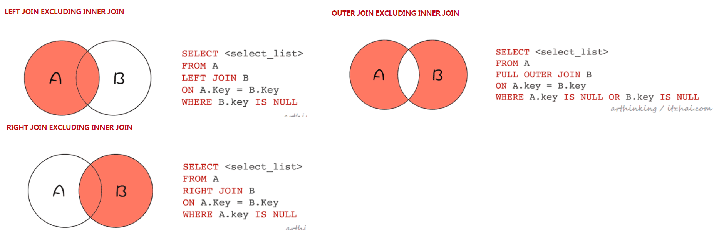

<!-- TOC -->

- [1、join走索引（Index Nested-Loop Join）](#1join走索引index-nested-loop-join)
    - [1、INDEX NESTED-LOOP JOIN](#1index-nested-loop-join)
    - [2、INDEX NESTED-LOOP JOIN的优化](#2index-nested-loop-join的优化)
        - [1、Multi-Range Read优化](#1multi-range-read优化)
        - [2、Batched Key Access](#2batched-key-access)
- [2、join不走索引（Block Nested-Loop Join）](#2join不走索引block-nested-loop-join)
    - [1、BLOCK NESTED-LOOP JOIN (BNL)](#1block-nested-loop-join-bnl)
    - [2、BNL问题](#2bnl问题)
    - [3、BNL问题解决方案](#3bnl问题解决方案)
- [3、各种join](#3各种join)
- [4、union](#4union)
    - [1、union all](#1union-all)
    - [2、union](#2union)

<!-- /TOC -->


为了演示join，接下来我们需要用到这两个表：

```sql
CREATE TABLE `t30` (
	`id` INT (11) NOT NULL AUTO_INCREMENT,
	`a` INT (11) NOT NULL,
	`b` INT (11) NOT NULL,
	`c` INT (11) NOT NULL,
	PRIMARY KEY (`id`),
	KEY idx_a (a)
) ENGINE = INNODB CHARSET = utf8mb4;

CREATE TABLE `t31` (
	`id` INT (11) NOT NULL AUTO_INCREMENT,
	`a` INT (11) NOT NULL,
	`f` INT (11) NOT NULL,
	`c` INT (11) NOT NULL,
	PRIMARY KEY (`id`),
	KEY idx_a (a)
) ENGINE = INNODB CHARSET = utf8mb4;

INSERT INTO t30 (a, b, c)
VALUES
	(1, 1, 1),
	(12, 2, 2),
	(3, 3, 3),
	(11, 12, 31),
	(15, 1, 32),
	(33, 33, 43),
	(5, 13, 14),
	(4, 13, 14),
	(16, 13, 14),
	(10, 13, 14);

INSERT INTO t31 (a, f, c)
VALUES
	(1, 1, 1),
	(21, 2, 2),
	(3, 3, 3),
	(12, 1, 1),
	(31, 20, 2),
	(4, 10, 3),
	(2, 23, 24),
	(22, 23, 24),
	(5, 23, 24),
	(20, 23, 24);


```


在MySQL官方文档中 8.8.2 EXPLAIN Output Format 提到：MySQL使用Nested-Loop Loin算法处理所有的关联查询。使用这种算法，意味着这种执行模式：

- 1、从第一个表中读取一行，然后在第二个表、第三个表...中找到匹配的行，以此类推；
- 2、处理完所有关联的表后，MySQL将输出选定的列，如果列不在当前关联的索引树中，那么会进行回表查找完整记录；
- 3、继续遍历，从表中取出下一行，重复以上步骤。

下面我们所讲到的都是Nested-Loop Join算法的不同实现。

> 多表join

不管多少个表join，都是用的Nested-Loop Join实现的。如果有第三个join的表，那么会把前两个表的join结果集作为循环基础数据，再执行一次Nested-Loop Join，到第三个表中匹配数据，更多多表同理。


# 1、join走索引（Index Nested-Loop Join）

## 1、INDEX NESTED-LOOP JOIN

我们执行以下sql：

select * from t30 straight_join t31 on t30.a=t31.a;

查看执行计划：

```sql
mysql> explain select * from t30 straight_join t31 on t30.a=t31.a;;
+----+-------------+-------+------------+------+---------------+-------+---------+------------+------+----------+-------+
| id | select_type | table | partitions | type | possible_keys | key   | key_len | ref        | rows | filtered | Extra |
+----+-------------+-------+------------+------+---------------+-------+---------+------------+------+----------+-------+
|  1 | SIMPLE      | t30   | NULL       | ALL  | idx_a         | NULL  | NULL    | NULL       |   10 |   100.00 | NULL  |
|  1 | SIMPLE      | t31   | NULL       | ref  | idx_a         | idx_a | 4       | test.t30.a |    1 |   100.00 | NULL  |
+----+-------------+-------+------------+------+---------------+-------+---------+------------+------+----------+-------+
2 rows in set, 1 warning (0.01 sec)
```

可以发现：

- t30作为驱动表，t31作为被驱动表；
- 通过a字段关联，去t31表查找数据的时候用到了索引。

该sql语句的执行流程如下图：

- 1、首先遍历t30聚集索引；
- 2、针对每个t30的记录，找到a的值，去t31的idx_a索引中找是否存在记录；
- 3、如果存在则拿到t31对应索引记录的id回表查找完整记录；
- 4、分别取t30和t31的所有字段作为结果返回。


由于这个过程中用到了idx_a索引，所以这种算法也称为：Index Nested-Loop(索引嵌套循环join)。其伪代码结构如下：

```java
// A 为t30聚集索引 
// B 为t31聚集索引 
// BIndex 为t31 idx_a索引 
void indexNestedLoopJoin()
{ 
    List result; 
    for(a in A) 
        { for(bi in BIndex) 
            { if (a satisfy condition bi) 
                { output <a, b>; } 
            } 
        } 
}
```

假设t30记录数为m，t31记录数为n，每一次查找索引树的复杂度为log2(n)，所以以上场景，总的复杂度为：m + m*2*log2(n)。

`也就是说驱动表越小，复杂度越低，越能提高搜索效率。`

## 2、INDEX NESTED-LOOP JOIN的优化

我们可以发现，以上流程，每次从驱动表取一条数据，然后去被驱动表关联取数，表现为磁盘的随记读，效率是比较低低，有没有优化的方法呢？

这个就得从MySQL的MRR（Multi-Range Read）优化机制说起了。

### 1、Multi-Range Read优化

我们执行以下代码，强制开启MMR功能：

set optimizer_switch="mrr_cost_based=off"

然后执行以下SQL，其中a是索引：

select * from t30 force index(idx_a) where a<=12 limit 10;

可以得到如下执行计划：

```sql
mysql> explain select * from t30 force index(idx_a) where a<=12 limit 10;
+----+-------------+-------+------------+-------+---------------+-------+---------+------+------+----------+----------------------------------+
| id | select_type | table | partitions | type  | possible_keys | key   | key_len | ref  | rows | filtered | Extra                            |
+----+-------------+-------+------------+-------+---------------+-------+---------+------+------+----------+----------------------------------+
|  1 | SIMPLE      | t30   | NULL       | range | idx_a         | idx_a | 4       | NULL |    7 |   100.00 | Using index condition; Using MRR |
+----+-------------+-------+------------+-------+---------------+-------+---------+------+------+----------+----------------------------------+
1 row in set, 1 warning (0.01 sec)

mysql> explain select * from t30  where a<=12 limit 10;
+----+-------------+-------+------------+------+---------------+------+---------+------+------+----------+-------------+
| id | select_type | table | partitions | type | possible_keys | key  | key_len | ref  | rows | filtered | Extra       |
+----+-------------+-------+------------+------+---------------+------+---------+------+------+----------+-------------+
|  1 | SIMPLE      | t30   | NULL       | ALL  | idx_a         | NULL | NULL    | NULL |   10 |    70.00 | Using where |
+----+-------------+-------+------------+------+---------------+------+---------+------+------+----------+-------------+
1 row in set, 1 warning (0.00 sec)
```

可以发现，Extra列提示用到了MRR优化。

这里为了演示走索引的场景，所以加了force index关键词。正常不加force index的情况下，MySQL优化器会检查到这里即使走了索引还是需要回表查询，并且表中的数据量不多，那干脆就直接扫描全表，不走索引，效率更加高了。


如果没有MRR优化，那么流程是这样的：

- 1、在idx_a索引中找到a<10的记录；
- 2、取前面10条，拿着id去回表查找完整记录，这里回表查询是随机读，效率较差；
- 3、取到的结果通过net buffer返回给客户端。


使用了MRR优化之后，这个执行流程是这样的：

- 1、在idx_abc索引中找到a<10的记录；
- 2、取10条，把id放入read rnd buffer;
- 3、read rnd buffer中的id排序；
- 4、排序之后回表查询完整记录，id越多，排好序之后越有可能产生连续的id，去磁盘顺序读；
- 5、查询结果写入net buffer返回给客户端；


### 2、Batched Key Access

与Multi-Range Read的优化思路类似，MySQL也是通过把随机读改为顺序读，让Index Nested-Loop Join提升查询效率，这个算法称为Batched Key Access(BKA)算法。

我们知道，默认情况下，是扫描驱动表，一行一行的去被驱动表匹配记录。这样就无法触发MRR优化了，为了能够触发MRR，于是BKA算法登场了。

在BKA算法中，驱动表通过使用join buffer批量在被驱动表的辅助索引中关联匹配数据，得到一批结果，一次性传递个数据库引擎的MRR接口，从而可以利用到MRR对磁盘读的优化。

为了启用这个算法，我们执行以下命令（BKA依赖于MRR）：

set optimizer_switch='mrr=on,mrr_cost_based=off,batched_key_access=on';

我们再次执行以下关联查询sql：

select * from t30 straight_join t31 on t30.a=t31.a;

我们可以得到如下的执行计划：

```sql
mysql> explain select * from t30 straight_join t31 on t30.a=t31.a;
+----+-------------+-------+------------+------+---------------+-------+---------+------------+------+----------+----------------------------------------+
| id | select_type | table | partitions | type | possible_keys | key   | key_len | ref        | rows | filtered | Extra                                  |
+----+-------------+-------+------------+------+---------------+-------+---------+------------+------+----------+----------------------------------------+
|  1 | SIMPLE      | t30   | NULL       | ALL  | idx_a         | NULL  | NULL    | NULL       |   10 |   100.00 | NULL                                   |
|  1 | SIMPLE      | t31   | NULL       | ref  | idx_a         | idx_a | 4       | test.t30.a |    1 |   100.00 | Using join buffer (Batched Key Access) |
+----+-------------+-------+------------+------+---------------+-------+---------+------------+------+----------+----------------------------------------+

mysql> explain select * from t30 join t31 on t30.a=t31.a;
+----+-------------+-------+------------+------+---------------+-------+---------+------------+------+----------+----------------------------------------+
| id | select_type | table | partitions | type | possible_keys | key   | key_len | ref        | rows | filtered | Extra                                  |
+----+-------------+-------+------------+------+---------------+-------+---------+------------+------+----------+----------------------------------------+
|  1 | SIMPLE      | t30   | NULL       | ALL  | idx_a         | NULL  | NULL    | NULL       |   10 |   100.00 | NULL                                   |
|  1 | SIMPLE      | t31   | NULL       | ref  | idx_a         | idx_a | 4       | test.t30.a |    1 |   100.00 | Using join buffer (Batched Key Access) |
+----+-------------+-------+------------+------+---------------+-------+---------+------------+------+----------+----------------------------------------+
```

可以发现，这里用到了：Using join buffer(Batched Key Access)。

执行流程如下：

- 1、把驱动表的数据批量放入join buffer中；
- 2、在join buffer中与被驱动表的辅助索引匹配结果，得到一个结果集；
- 3、把上一步的结果集批量提交给引擎的MRR接口；
- 4、MRR接口处理同上一节，主要进行了磁盘顺序读的优化；
- 5、组合输出最终结果，可以看到，这里的结果与没有开启BKA优化的顺序有所不同，这里使用了t31被驱动表的id排序作为输出顺序，因为最后一步对被驱动表t31读取进行MRR优化的时候做了排序。


`问题：如果驱动表比较大，一次放多少到join buffer中？那个参数可以进行设置？`


如果join条件没走索引，又会是什么情况呢，接下来我们尝试执行下对应的sql。


# 2、join不走索引（Block Nested-Loop Join）


## 1、BLOCK NESTED-LOOP JOIN (BNL)


我们执行以下sql：

select * from t30 straight_join t31 on t30.c=t31.c;

查看执行计划：

```sql
mysql> explain select * from t30 straight_join t31 on t30.c=t31.c;
+----+-------------+-------+------------+------+---------------+------+---------+------+------+----------+----------------------------------------------------+
| id | select_type | table | partitions | type | possible_keys | key  | key_len | ref  | rows | filtered | Extra                                              |
+----+-------------+-------+------------+------+---------------+------+---------+------+------+----------+----------------------------------------------------+
|  1 | SIMPLE      | t30   | NULL       | ALL  | NULL          | NULL | NULL    | NULL |   10 |   100.00 | NULL                                               |
|  1 | SIMPLE      | t31   | NULL       | ALL  | NULL          | NULL | NULL    | NULL |   10 |    10.00 | Using where; Using join buffer (Block Nested Loop) |
+----+-------------+-------+------------+------+---------------+------+---------+------+------+----------+----------------------------------------------------+


mysql> explain select * from t30 join t31 on t30.c=t31.c;
+----+-------------+-------+------------+------+---------------+------+---------+------+------+----------+----------------------------------------------------+
| id | select_type | table | partitions | type | possible_keys | key  | key_len | ref  | rows | filtered | Extra                                              |
+----+-------------+-------+------------+------+---------------+------+---------+------+------+----------+----------------------------------------------------+
|  1 | SIMPLE      | t30   | NULL       | ALL  | NULL          | NULL | NULL    | NULL |   10 |   100.00 | NULL                                               |
|  1 | SIMPLE      | t31   | NULL       | ALL  | NULL          | NULL | NULL    | NULL |   10 |    10.00 | Using where; Using join buffer (Block Nested Loop) |
+----+-------------+-------+------------+------+---------------+------+---------+------+------+----------+----------------------------------------------------+
```

可以发现：

- t30作为驱动表，t31作为被驱动表；
- 通过c字段关联，去t31表查找数据的时候没有用到索引；
- join的过程中用到了join buffer，这里提示用到了Block Nested Loop Join；


该语句的执行流程如下图：

- 1、t30驱动表中的数据分批(分块)存入join buffer，如果一次可以全部存入，则这里会一次性存入；
- 2、t31被驱动表中扫描记录，依次取出与join buffer中的记录对比(内存中对比，快)，判断是否满足c相等的条件；
- 3、满足条件的记录合并结果输出到net buffer中，最终传输给客户端。
- 4、然后清空join buffer，存入下一批t30的数据，重复以上流程。


显然，每批数据都需要扫描一遍被驱动表，批次越多，扫描越多，但是内存判断总次数是不变的。所以总批次越小，越高效。所以，跟上一个算法一样，`驱动表越小，复杂度越低，越能提高搜索效率。`

## 2、BNL问题

MySQL Buffer Pool的LRU算法，如下：


默认情况下，同一个数据页，在一秒钟之后再次访问，那么就会晋升到新子列表(young区)。

恰巧，如果我们用到了BNL算法，那么分批执行的话，就会重复扫描被驱动表去匹配每一个批次了。

考虑以下两种会影响buffer pool的场景：

- 如果这个时候join扫描了一个很大的冷表，那么在join这段期间，会持续的往旧子列表(old区)写数据页，淘汰队尾的数据页，这会影响其他业务数据页晋升到新子列表，因为很可能在一秒内，其他业务数据就从旧子列表中被淘汰掉了；
- 而如果这个时候BNL算法把驱动表分为了多个批次，每个批次扫描匹配被驱动表，都超过1秒钟，那么这个时候，被驱动表的数据页就会被晋升到新子列表，这个时候也会把其他业务的数据页提前从新子列表中淘汰掉。

## 3、BNL问题解决方案

- 1、调大 join_buffer_size：针对以上这种场景，为了避免影响buffer pool，最直接的办法就是增加join_buffer_size的值，以减少对被驱动表的扫描次数。

- 2、把BNL转换为BKA：我们可以通过把join的条件加上索引，从而避免了BNL算法，转而使用BKA算法，这样也可以加快记录的匹配速度，以及从磁盘读取被驱动表记录的速度。

- 3、通过添加临时表：有时候，被驱动表很大，但是关联查询又很少使用，直接给关联字段加索引太浪费空间了，这个时候就可以通过把被驱动表的数据放入临时表，在临时表中添加索引的方式，以达成BKA的优化效果。

- 4、使用hash join：什么是hash join呢，简单来说就是这样的一种模型（把驱动表满足条件的数据取出来，放入一个hash结构中，然后把被驱动表满足条件的数据取出来，一行一行的去hash结构中寻找匹配的数据，依次找到满足条件的所有记录。类似于clickhouse的字典表）。

一般情况下，MySQL的join实现都是以上介绍的各种nested-loop算法的实现，但是从MySQL 8.0.18[6]开始，我们可以使用hash join来实现表连续查询了。


# 3、各种join





> join使用总结

- join优化的目标是尽可能减少join中Nested-Loop的循环次数，所以请让小表做驱动表；
- 关联字段尽量走索引，这样就可以用到Index Nested-Loop Join了；
- 如果有order by，请使用驱动表的字段作为order by，否则会使用 using temporary；
- 如果不可避免要用到BNL算法，为了减少被驱动表多次扫描导致的对Buffer Pool利用率的影响，那么可以尝试把 join_buffer_size调大；
- 为了进一步加快BNL算法的执行效率，我们可以给关联条件加上索引，转换为BKA算法；如果加索引成本较高，那么可以通过临时表添加索引来实现；
- 如果您使用的是MySQL 8.0.18，可以尝试使用hash join，如果是较低版本，也可以自己在程序中实现一个hash join。


# 4、union

通过使用union可以把两个查询结果合并起来，注意：union all不会去除重复的行，union则会去除重复读的行。


## 1、union all

执行下面sql：

(select id from t30 order by id desc limit 10) union all (select c from t31 order by id desc limit 10)

```sql
mysql> explain (select id from t30 order by id desc limit 10) union all (select c from t31 order by id desc limit 10);
+----+-------------+-------+------------+-------+---------------+---------+---------+------+------+----------+-------------+
| id | select_type | table | partitions | type  | possible_keys | key     | key_len | ref  | rows | filtered | Extra       |
+----+-------------+-------+------------+-------+---------------+---------+---------+------+------+----------+-------------+
|  1 | PRIMARY     | t30   | NULL       | index | NULL          | PRIMARY | 4       | NULL |   10 |   100.00 | Using index |
|  2 | UNION       | t31   | NULL       | index | NULL          | PRIMARY | 4       | NULL |   10 |   100.00 | NULL        |
+----+-------------+-------+------------+-------+---------------+---------+---------+------+------+----------+-------------+
```

执行流程如下：

- 1、从t30表查询出结果，直接写出到net buffer，传回给客户端；
- 2、从331表查询出结果，直接写出到net buffer，传回给客户端。


## 2、union

执行下面sql：

(select id from t30 order by id desc limit 10) union (select c from t31 order by id desc limit 10)

该sql执行计划如下图：

```sql
mysql> explain (select id from t30 order by id desc limit 10) union (select c from t31 order by id desc limit 10);
+----+--------------+------------+------------+-------+---------------+---------+---------+------+------+----------+-----------------+
| id | select_type  | table      | partitions | type  | possible_keys | key     | key_len | ref  | rows | filtered | Extra           |
+----+--------------+------------+------------+-------+---------------+---------+---------+------+------+----------+-----------------+
|  1 | PRIMARY      | t30        | NULL       | index | NULL          | PRIMARY | 4       | NULL |   10 |   100.00 | Using index     |
|  2 | UNION        | t31        | NULL       | index | NULL          | PRIMARY | 4       | NULL |   10 |   100.00 | NULL            |
| NULL | UNION RESULT | <union1,2> | NULL       | ALL   | NULL          | NULL    | NULL    | NULL | NULL |     NULL | Using temporary |
+----+--------------+------------+------------+-------+---------------+---------+---------+------+------+----------+-----------------+
```

执行流程如下：

- 1、从t30查询出记录，写入到临时表；
- 2、从t30查询出记录，写入临时表，在临时表中通过唯一索引去重；
- 3、把临时表的数据通过net buffer返回给客户端。


