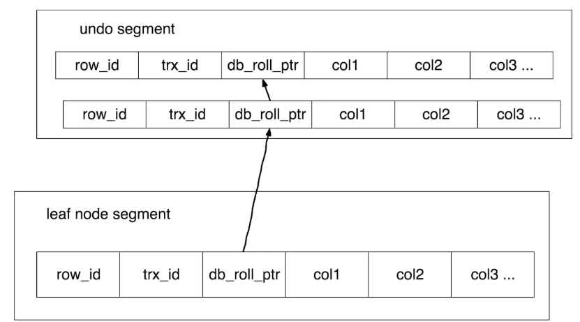

<!-- TOC -->

- [1、mvcc](#1mvcc)
    - [1、快照读](#1快照读)
    - [2、当前读](#2当前读)
    - [3、快照读是怎么实现的(mvcc)](#3快照读是怎么实现的mvcc)

<!-- /TOC -->

# 1、mvcc

InnoDB 里面每个事务有一个唯一的事务 ID，叫作 transaction id。它是在事务开始的时候向 InnoDB 的事务系统申请的，是按申请顺序严格递增的。

而每行数据也都是有多个版本的。每次事务更新数据的时候，都会生成一个新的数据版本，并且把 transaction id 赋值给这个数据版本的事务 ID，记为 row trx_id。同时，旧的数据版本要保留，并且在新的数据版本中，能够有信息可以直接拿到它。

也就是说，数据表中的一行记录，其实可能有多个版本 (row)，每个版本有自己的 row trx_id。

事务的可重复读的能力是怎么实现的？

可重复读的核心就是一致性读（consistent read）；而事务更新数据的时候，只能用当前读。如果当前的记录的行锁被其他事务占用的话，就需要进入锁等待。

而读提交的逻辑和可重复读的逻辑类似，它们最主要的区别是：

- 在可重复读隔离级别下，只需要在事务开始的时候创建一致性视图，之后事务里的其他查询都共用这个一致性视图；

- 在读提交隔离级别下，每一个语句执行前都会重新算出一个新的视图。

## 1、快照读

select id,name from student t where t.name = '张三';

这种普通的select查询就叫快照读（Mysql的RC和RR隔离级别下普通的select查询都是快照读），无须加锁，即使有别的事务在修改本条数据也不影响，提升读取速度.不过RC和RR隔离级别下快照的定义有所区别：

- RR和RC隔离级别的差别是创建snapshot时机不同， RR隔离级别是在事务开始时，确切地说是第一个读操作时创建read view的（所以此后所有的读都是同样的数据）

- RC隔离级别是在每个语句开始时创建read view的（每次读获取的比较事务数组都是最新的，所以能拿到最新的commit数据）。

## 2、当前读

select id,name from student t where t.name = '张三' lock in share mode;

select id,name from student t where t.name = '张三' for update;

上面的两条语句加了`共享读锁`和`排它写锁`，就成了当前读，要和其他事务竞争锁了。

除了上面这两种select，insert/update/delete也是当前读，需要加锁，有锁就有竞争，为了保证同步，设计一般会采用顺序（如队列）或者加锁（多线程）的方式，加锁的话，粒度要尽可能的小

Mysql（InnoDB）有行锁、表锁、间隙锁、NEXT-KEY锁、意向锁等，具体使用哪种锁和具体的语句是否包含索引（聚簇索引、非聚簇索引、insert时是否有自增主键）以及事务隔离级别有关

- [Select查询是否需要主动处理事务](https://www.jianshu.com/p/76c6176321fc)

## 3、快照读是怎么实现的(mvcc)

快照读并不是将所有数据复制了一份，那数据库容量很快就不够了，而且设计复杂度也更高。快照读是记录了当前活跃的事务集合，用于查询数据时判断是否能够看到该条记录：也就是在某一时刻给事务系统trx_sys打snapshot（快照），把当时trx_sys状态（包括活跃读写事务数组）记下来，之后的所有读操作根据其事务ID（即trx_id）与snapshot中的trx_sys的状态作比较，以此判断事务可见性。

我能知道哪些事务比我早了，但怎么就能持续读到一样的数据呢？

- InnoDB中通过undo log实现了数据的多版本，undo log除了实现MVCC外，还用于事务的回滚

- InnoDB行记录中除了rowid外，还包含trx_id和db_roll_ptr字段, trx_id表示最近修改的事务的id（trx_id能够代表事务开始的先后顺序）

- db_roll_ptr指向最近一次更新所创建的回滚段，每条undo log也会指向更早版本的undo log，从而形成一条更新链，通过这个更新链，不同事务可以找到其对应版本的undo log，根据之前创建的快照，就可以判断出来哪条最新数据可读，也就实现了MVCC