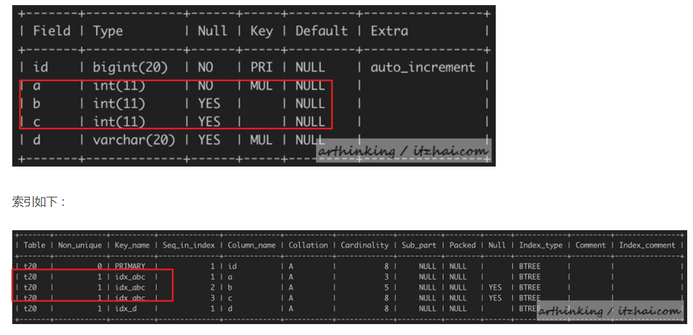
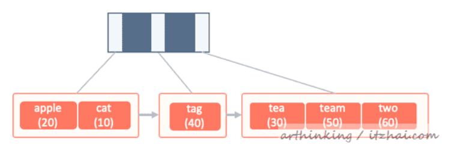
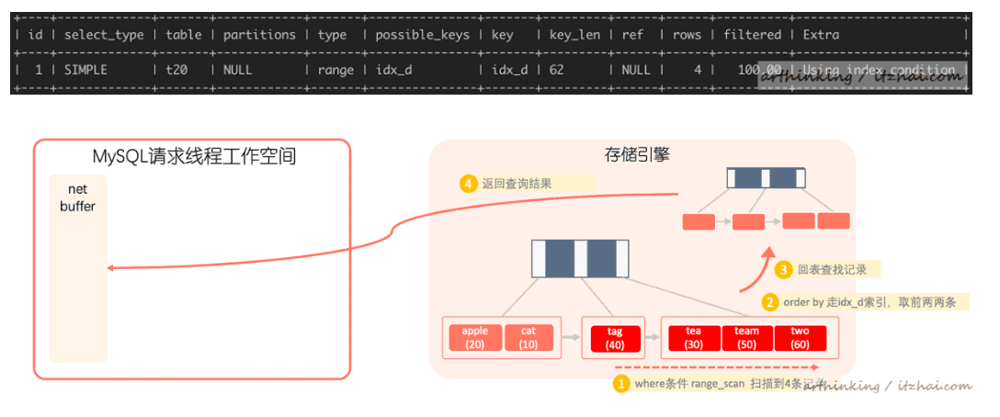
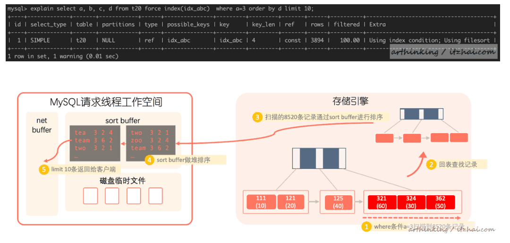
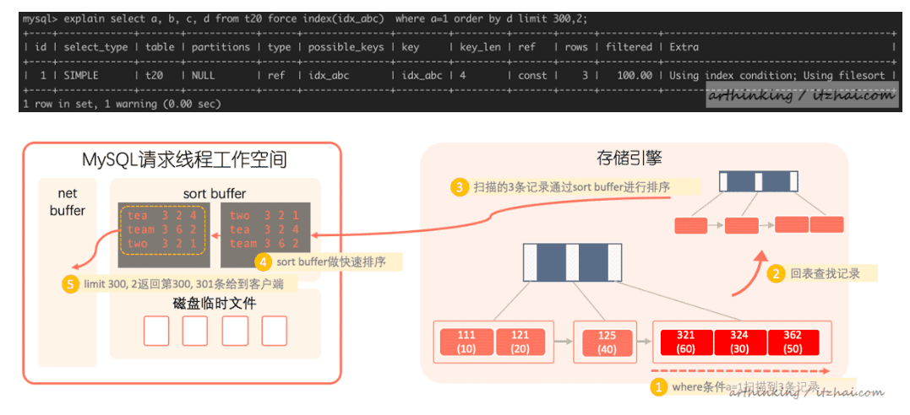
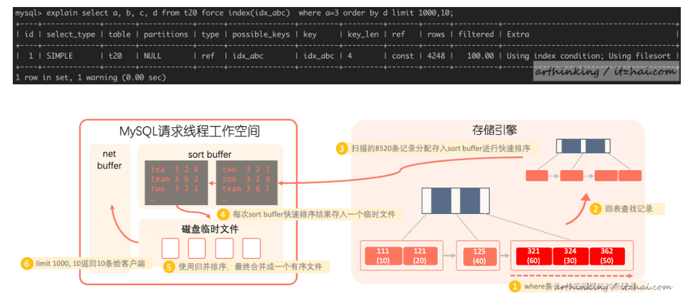
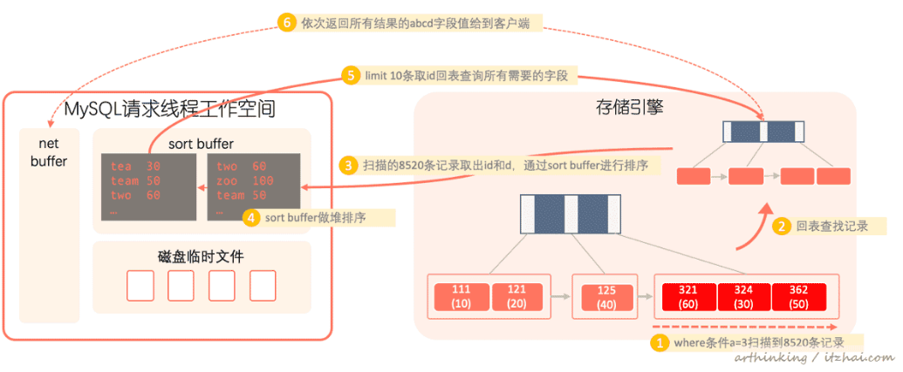

<!-- TOC -->

- [1、排序模式](#1排序模式)
    - [1、如何选择排序模式](#1如何选择排序模式)
- [2、排序算法](#2排序算法)
- [3、order by走索引避免排序](#3order-by走索引避免排序)
- [4、如何查看和修改sort buffer大小？](#4如何查看和修改sort-buffer大小)
- [5、排序算法案例](#5排序算法案例)
    - [1、使用优先级队列进行堆排序](#1使用优先级队列进行堆排序)
    - [2、内部快速排序](#2内部快速排序)
    - [3、外部归并排序](#3外部归并排序)
- [6、排序模式案例](#6排序模式案例)
    - [1、<SORT_KEY, ADDITIONAL_FIELDS>模式](#1sort_key-additional_fields模式)
    - [2、<SORT_KEY, PACKED_ADDITIONAL_FIELDS>模式](#2sort_key-packed_additional_fields模式)
    - [3、<SORT_KEY, ROWID>模式](#3sort_key-rowid模式)
- [7、order by优化总结](#7order-by优化总结)
- [参考](#参考)

<!-- /TOC -->


以下是我们本节作为演示例子的表，假设我们有如下表

```sql
CREATE TABLE `t20` (
  `id` bigint(20) NOT NULL AUTO_INCREMENT,
  `a` int(11) NOT NULL,
  `b` int(11) DEFAULT NULL,
  `c` int(11) DEFAULT NULL,
  `d` varchar(255) CHARACTER SET latin1 DEFAULT NULL,
  PRIMARY KEY (`id`),
  KEY `idx_abc` (`a`,`b`,`c`) USING BTREE,
  KEY `idx_d` (`d`) USING BTREE
) ENGINE=InnoDB DEFAULT CHARSET=utf8;

```



备注：组合索引(a,b,c)，普通索引字段d。

对应的idx_d索引结构如下(这里我们做了一些夸张的手法，让一个页数据变小，为了展现在索引树中的查找流程)：




为了方便分析sql的执行流程，我们可以在当前session中开启 optimizer_trace:

SET optimizer_trace='enabled=on';

然后执行sql，执行完之后，就可以通过以下堆栈信息查看执行详情了：

SELECT * FROM information_schema.OPTIMIZER_TRACE\G;


以下是

select a, b, c, d from t20 force index(idx_abc) where a=3 order by d limit 100,2;

的执行结果，其中符合a=3的有8457条记录，针对order by重点关注以下属性：

```
    "filesort_priority_queue_optimization": { // 是否启用优先级队列 
        "limit": 102, // 排序后需要取的行数，这里为 limit 100,2，也就是100+2=102 
        "rows_estimate": 24576, // 估计参与排序的行数 
        "row_size": 123, // 行大小 
        "memory_available": 32768, // 可用内存大小，即设置的sort buffer大小
        "chosen": true // 是否启用优先级队列 
     }, 
    ... 
    "filesort_summary": { 
         "rows": 103, // 排序过程中会持有的行数 
         "examined_rows": 8457, // 参与排序的行数，InnoDB层返回的行数 
         "number_of_tmp_files": 0, // 外部排序时，使用的临时文件数量 
         "sort_buffer_size": 13496, // 内存排序使用的内存大小 
         "sort_mode": "sort_key, additional_fields" // 排序模式
    }

```

# 1、排序模式


其中 sort_mode有如下几种形式：

- sort_key, rowid：表明排序缓冲区元组包含排序键值和原始表行的行id，排序后需要使用行id进行回表，这种算法也称为`original filesort algorithm(回表排序算法)`；

- sort_key, additional_fields：表明排序缓冲区元组包含排序键值和查询所需要的列，排序后直接从缓冲区元组取数据，无需回表，这种算法也称为modified filesort algorithm(不回表排序)；

- sort_key, packed_additional_fields：类似上一种形式，但是附加的列(如varchar类型)紧密地打包在一起，而不是使用固定长度的编码。

## 1、如何选择排序模式

选择哪种排序模式，与`max_length_for_sort_data`这个属性有关，这个属性默认值大小为1024字节：

- 如果查询列和排序列占用的大小超过这个值，那么会转而使用sort_key, rowid模式；
- 如果不超过，那么所有列都会放入sort buffer中，使用sort_key, additional_fields或者sort_key, packed_additional_fields模式；
- 如果查询的记录太多，那么会使用sort_key, packed_additional_fields对可变列进行压缩。

`问题：max_length_for_sort_data具体含义？全部排序数据大小？和sort buffer之间的关系？`

# 2、排序算法

基于参与排序的数据量的不同，可以选择不同的排序算法：

1、如果排序取的结果很小，小于内存，那么会使用`优先级队列进行堆排序`；

例如，以下只取了前面10条记录，会通过优先级队列进行排序：

select a, b, c, d from t20 force index(idx_abc) where a=3 order by d limit 10;

2、如果排序limit n, m，n太大了，也就是说需要取排序很后面的数据，那么会使用sort buffer进行`快速排序`：

如下，表中a=1的数据有三条，但是由于需要limit到很后面的记录，MySQL会对比优先级队列排序和快速排序的开销，选择一个比较合适的排序算法，这里最终放弃了优先级队列，转而使用sort buffer进行快速排序：

select a, b, c, d from t20 force index(idx_abc) where a=1 order by d limit 300,2;

3、如果参与排序的数据sort buffer装不下了，那么我们会一批一批的给sort buffer进行内存快速排序，结果放入排序临时文件，最终使对所有排好序的临时文件进行`归并排序`，得到最终的结果;

如下，a=3的记录超过了sort buffer，我们要查找的数据是排序后1000行起，sort buffer装不下1000行数据了，最终MySQL选择使用sort buffer进行分批快排，把最终结果进行归并排序：

select a, b, c, d from t20 force index(idx_abc) where a=3 order by d limit 1000,10;


# 3、order by走索引避免排序

执行如下sql：

select a, b, c, d from t20 force index(idx_d) where d like 't%' order by d limit 2;



发现Extra列为：Using index condition，也就是这里只走了索引。

通过idx_d索引进行range_scan查找，扫描到4条记录，然后order by继续走索引，已经排好序，直接取前面两条，然后去聚集索引查询完整记录，返回最终需要的字段作为查询结果。这个过程只需要借助索引。


# 4、如何查看和修改sort buffer大小？

我们看一下当前的sort buffer大小：

```sql
mysql> show variables like '%sort_buffer%';
+-------------------------+----------+
| Variable_name           | Value    |
+-------------------------+----------+
| innodb_sort_buffer_size | 1048576  |
| myisam_sort_buffer_size | 12582912 |
| sort_buffer_size        | 262144   |
+-------------------------+----------+
3 rows in set, 1 warning (0.01 sec)

```

我们可以设置这个属性的大小：

SET GLOBAL sort_buffer_size = 32*1024;

或者

SET sort_buffer_size = 32*1024;

下面我们统一把sort buffer设置为32k

SET sort_buffer_size = 32*1024;


# 5、排序算法案例

## 1、使用优先级队列进行堆排序

如果排序取的结果很小，并且小于sort buffer，那么会使用优先级队列进行堆排序；

例如，以下只取了前面10条记录：

select a, b, c, d from t20 force index(idx_abc) where a=3 order by d limit 10;

a=3的总记录数：8520。查看执行计划：



发现这里where条件用到了索引，order by limit用到了排序。我们进一步看看执行的optimizer_trace日志：

```sql
"filesort_priority_queue_optimization": 
    { "limit": 10, 
    "rows_estimate": 27033, 
    "row_size": 123,
    "memory_available": 32768, 
    "chosen": true // 使用优先级队列进行排序 
    }, 
"filesort_execution": [ ], 
"filesort_summary": 
    { 
    "rows": 11, 
    "examined_rows": 8520, 
    "number_of_tmp_files": 0, 
    "sort_buffer_size": 1448,
     "sort_mode": "sort_key, additional_fields" 
    }
```

发现这里是用到了优先级队列进行排序。排序模式是：sort_key, additional_fields，即先回表查询完整记录，把排序需要查找的所有字段都放入sort buffer进行排序。

所以这个执行流程如下所示：

- 1、通过where条件a=3扫描到8520条记录；
- 2、回表查找记录；
- 3、把8520条记录中需要的字段放入sort buffer中；
- 4、在sort buffer中进行堆排序；
- 5、在排序好的结果中取limit 10前10条，写入net buffer，准备发送给客户端。


## 2、内部快速排序

如果排序limit n, m，n太大了，也就是说需要取排序很后面的数据，那么会使用sort buffer进行快速排序。MySQL会对比优先级队列排序和归并排序的开销，选择一个比较合适的排序算法。

> 如何衡量究竟是使用优先级队列还是内存快速排序？

一般来说，快速排序算法效率高于堆排序，但是堆排序实现的优先级队列，无需排序完所有的元素，就可以得到order by limit的结果。MySQL源码中声明了快速排序速度是堆排序的3倍，在实际排序的时候，会根据待排序数量大小进行切换算法。如果数据量太大的时候，会转而使用快速排序。

有如下SQL：

select a, b, c, d from t20 force index(idx_abc) where a=1 order by d limit 300,2;

我们把sort buffer设置为32k：

SET sort_buffer_size = 32*1024;

其中a=1的记录有3条。查看执行计划：



可以发现，这里where条件用到了索引，order by limit 用到了排序。我们进一步看看执行的optimizer_trace日志：

```sql
"filesort_priority_queue_optimization": 
{ 
    "limit": 302, 
    "rows_estimate": 27033, 
    "row_size": 123, 
    "memory_available": 32768, 
    "strip_additional_fields": { 
        "row_size": 57, 
        "sort_merge_cost": 33783, 
        "priority_queue_cost": 61158, 
        "chosen": false // 对比发现快速排序开销成本比优先级队列更低，这里不适用优先级队列 
    } 
}, 
"filesort_execution": [ ], 
"filesort_summary": 
{ 
    "rows": 3, 
    "examined_rows": 3, 
    "number_of_tmp_files": 0, 
    "sort_buffer_size": 32720, 
    "sort_mode": "<sort_key, packed_additional_fields>" 
}

```
可以发现这里最终放弃了优先级队列，转而使用sort buffer进行快速排序。

所以这个执行流程如下所示：

- 1、通过where条件a=1扫描到3条记录；
- 2、回表查找记录；
- 3、把3条记录中需要的字段放入sort buffer中；
- 4、在sort buffer中进行快速排序；
- 5、在排序好的结果中取limit 300, 2第300、301条记录，写入net buffer，准备发送给客户端。


## 3、外部归并排序

当参与排序的数据太多，一次性放不进去sort buffer的时候，那么我们会一批一批的给sort buffer进行内存排序，结果放入排序临时文件，最终使对所有排好序的临时文件进行归并排序，得到最终的结果。

有如下sql：

select a, b, c, d from t20 force index(idx_abc) where a=3 order by d limit 1000,10;

其中a=3的记录有8520条。执行计划如下：



可以发现，这里where用到了索引，order by limit用到了排序。进一步查看执行的optimizer_trace日志：

我们可以看到，由于limit 1000，要返回排序后1000行以后的记录，显然sort buffer已经不能支撑这么大的优先级队列了，所以转而使用sort buffer内存排序，而这里需要在sort buffer中分批执行快速排序，得到多个排序好的外部临时文件，最终执行归并排序。（外部临时文件的位置由tmpdir参数指定）

```sql
"filesort_priority_queue_optimization": 
{ 
"limit": 1010, 
"rows_estimate": 27033, 
"row_size": 123, 
"memory_available": 32768, 
"strip_additional_fields": 
    { 
        "row_size": 57, 
        "chosen": false, 
        "cause": "not_enough_space" // sort buffer空间不够，无法使用优先级队列进行排序了 
    } 
}, 
"filesort_execution": [ ], 
"filesort_summary": 
    { 
    "rows": 8520, 
    "examined_rows": 8520,
    "number_of_tmp_files": 24, // 用到了24个外部文件进行排序 
    "sort_buffer_size": 32720, 
    "sort_mode": "<sort_key, packed_additional_fields>" 
    }

```


# 6、排序模式案例


## 1、<SORT_KEY, ADDITIONAL_FIELDS>模式

sort_key, additional_fields，排序缓冲区元组包含排序键值和查询所需要的列（先回表取需要的数据，存入排序缓冲区中），排序后直接从缓冲区元组取数据，无需再次回表。上面 5.1、5.2的例子都是这种排序模式


## 2、<SORT_KEY, PACKED_ADDITIONAL_FIELDS>模式

sort_key, packed_additional_fields：类似上一种形式，但是附加的列(如varchar类型)紧密地打包在一起，而不是使用固定长度的编码。

5.3的例子就是这种排序模式，由于参与排序的总记录大小太大了，因此需要对附加列进行紧密地打包操作，以节省内存。


## 3、<SORT_KEY, ROWID>模式

前面我们提到，选择哪种排序模式，与max_length_for_sort_data这个属性有关，max_length_for_sort_data规定了排序行的最大大小，这个属性默认值大小为1024字节.

也就是说如果查询列和排序列占用的大小小于这个值，这个时候会走sort_key, additional_fields或者sort_key, packed_additional_fields算法，否则，那么会转而使用sort_key, rowid模式。

现在我们特意把这个值设置小一点，模拟sort_key, rowid模式：

SET max_length_for_sort_data = 100;

这个时候执行sql：

select a, b, c, d from t20 force index(idx_abc) where a=3 order by d limit 10;

这个时候再查看sql执行的optimizer_trace日志：


```sql
"filesort_priority_queue_optimization": 
{ 
    "limit": 10, 
    "rows_estimate": 27033, 
    "row_size": 49, 
    "memory_available": 32768, 
    "chosen": true 
}, 
"filesort_execution": [ ], 
"filesort_summary": 
{ 
    "rows": 11, 
    "examined_rows": 8520, 
    "number_of_tmp_files": 0, 
    "sort_buffer_size": 632, 
    "sort_mode": "<sort_key, rowid>" 
}

```

可以发现这个时候切换到了sort_key, rowid模式，在这个模式下，执行流程如下：

- 1、where条件a=3扫描到8520条记录；
- 2、回表查找记录；
- 3、找到这8520条记录的id和d字段，放入sort buffer中进行堆排序；
- 4、排序完成后，取前面10条；
- 5、取这10条的id回表查询需要的a，b，c，d字段值；
- 6、依次返回结果给到客户端。




# 7、order by优化总结

> MySQL的排序方式

- 1.第一种通过有序索引返回数据，这种方式的extra显示为Using Index,不需要额外的排序，操作效率较高。

- 2.第二种是对返回的数据进行排序，也就是通常看到的Using filesort，filesort是通过相应的排序算法，将数据放在sort_buffer_size系统变量设置的内存排序区中进行排序，如果内存装载不下，它就会将磁盘上的数据进行分块，再对各个数据块进行排序，然后将各个块合并成有序的结果集。

根据以上的介绍，我们可以总结出以下的order by语句的相关优化手段：

- order by字段尽量使用固定长度的字段类型，因为排序字段不支持压缩；

- order by字段如果需要用可变长度，应尽量控制长度，道理同上；

- 查询中尽量不用用select *，避免查询过多，导致order by的时候sort buffer内存不够导致外部排序，或者行大小超过了max_length_for_sort_data导致走了sort_key, rowid排序模式，使得产生了更多的磁盘读，影响性能；

- 尝试给排序字段和相关条件加上联合索引，能够用到覆盖索引最佳。


# 参考

- [SQL运行内幕：从执行原理看调优的本质](https://www.cnblogs.com/arthinking/p/13205303.html)