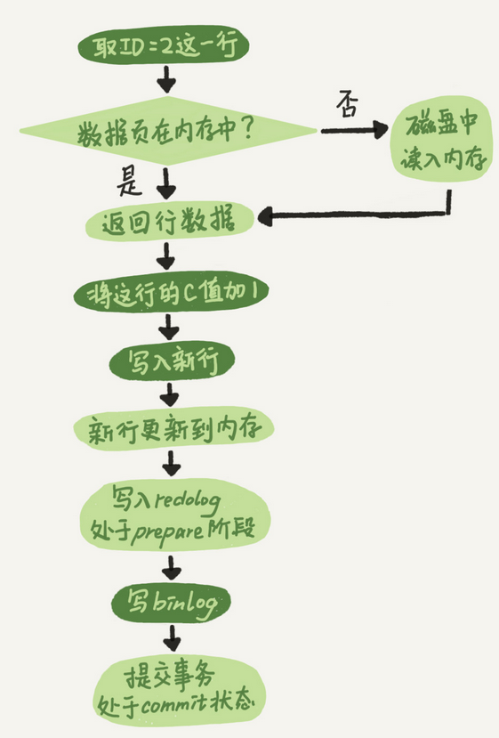
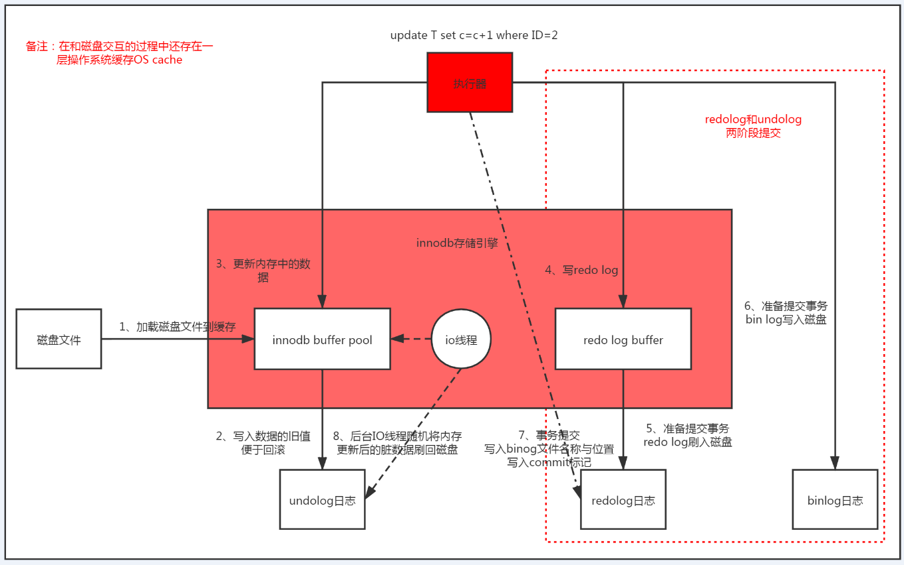
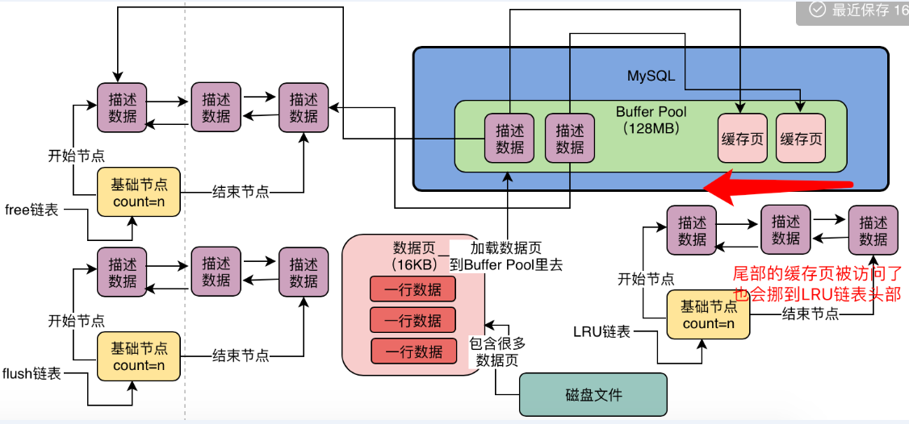
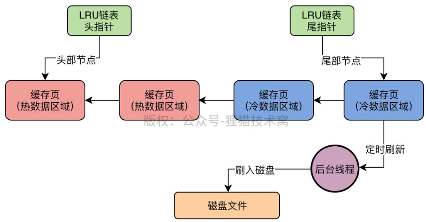

`增删改为了减少耗时（随机IO操作），操作完成的返回的时候，其实只是修改了内存中的数据以及写redolog、binlog到磁盘（顺序IO，保存更新数据不丢失），然后由后台线程把内存的数据随机IO写入磁盘的数据文件中`

update T set c=c+1 where ID=2;

看执行器和 InnoDB 引擎在执行这个简单的 update 语句时的内部流程。

- 1、执行器先找引擎取 ID=2 这一行(`比如调用接口传递参数2`)。ID 是主键，存储引擎直接用树搜索找到这一行。如果 ID=2 这一行所在的数据页本来就在内存中，就直接返回给执行器；否则，需要先从磁盘读入内存，然后再返回。

- 2、执行器拿到引擎给的行数据，把这个值加上 1，比如原来是 N，现在就是 N+1，得到新的一行数据，再调用引擎接口写入这行新数据。

- 3、引擎将这行新数据更新到内存中，同时将这个更新操作记录到 redo log 里面，此时 redo log 处于 prepare 状态。然后告知执行器执行完成了，随时可以提交事务。

- 4、执行器生成这个操作的 binlog，并把 binlog 写入磁盘。

- 5、执行器调用引擎的提交事务接口，引擎把刚刚写入的 redo log 改成提交（commit）状态，更新完成。

这里给出这个 update 语句的执行流程图，图中浅色框表示是在 InnoDB 内部执行的，深色框表示是在执行器中执行的。

你可能注意到了，最后三步看上去有点“绕”，将 redo log 的写入拆成了两个步骤：prepare 和 commit，这就是"两阶段提交"。

下面描述更加细分步骤：

- 1、判断innodb缓存池中该天记录对应的数据页是否在缓存中，如果不在则去磁盘中加载；
- 2、记录undo日志文件，可以实现事务回滚；
- 3、更新buffer pool中的缓存数据；
- 4、写Redo Log Buffer，把内存值在数据页的修改记录进去；
- 5、redolog刷磁盘，保证宕机数据不丢失。刷盘策略根据参数innodb_flush_log_at_trx_commit决定：
    - innodb_flush_log_at_trx_commit= 0，提交事务时不进行刷盘，存在数据丢失风险；
    - innodb_flush_log_at_trx_commit=1，你提交事务的时候，就必须把redo log从内存刷入到磁盘文件里去，只要事务提交成功，那么redo log就必然在磁盘里了；
    - innodb_flush_log_at_trx_commit=2，提交事务的时候，把redo日志写入磁盘文件对应的os cache缓存里去，而不是直接进入磁盘文件，可能1秒后才会把os cache里的数据写入到磁盘文件里去，可能存在事务丢失；
- 6、提交事务的时候，同时会写入binlog；binlog日志的刷盘策略由sync_binlog参数控制；
    - sync_binlog=0，默认值，此时你把binlog写入磁盘的时候，其实不是直接进入磁盘文件，而是进入os cache内存缓存，存在丢失风险；
    - sync_binlog=1，会强制在提交事务的时候，把binlog直接写入到磁盘文件里去，那么这样提交事务之后，哪怕机器宕机，磁盘上的binlog是不会丢失的。
- 7、事务提交，写入binog文件名称与位置、写入commit标记到redolog;目的是保证redo log日志与binlog日志一致。`两阶段提交`
- 8、后台IO线程随机将内存更新后的脏数据刷回磁盘

优化LRU，采用冷热数据分离的方式，而且并非访问过的数据就立刻移动到表头而是有个1分钟之后再次被访问的门限判断

