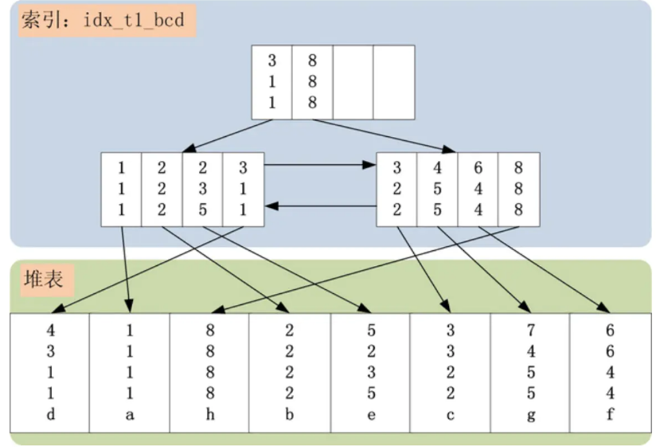
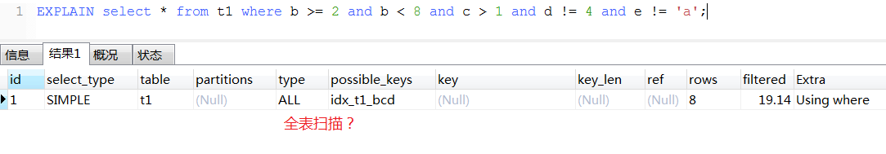
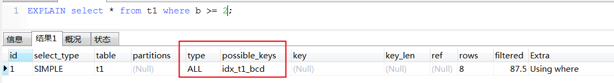
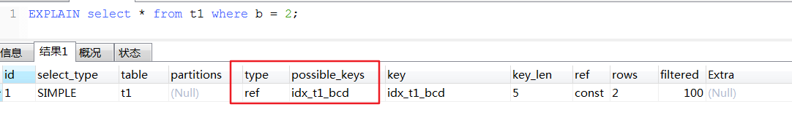
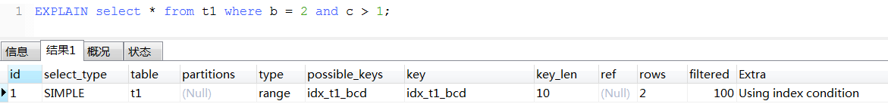
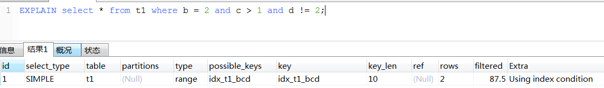

<!-- TOC -->

- [1、问题](#1问题)
- [2、关系型数据库中的数据组织](#2关系型数据库中的数据组织)
- [3、SQL的where条件提取](#3sql的where条件提取)
    - [0、explain解析](#0explain解析)
    - [1、Index Key](#1index-key)
        - [1、Index First Key](#1index-first-key)
        - [2、Index Last Key](#2index-last-key)
    - [2、Index Filter](#2index-filter)
    - [3、Table Filter](#3table-filter)
    - [4、总结](#4总结)
- [4、Index Condition Pushdown](#4index-condition-pushdown)
- [参考](#参考)

<!-- /TOC -->


# 1、问题


- 1、给定一条SQL，如何提取其中的where条件？where条件中的每个子条件，在SQL执行的过程中有分别起着什么样的作用？

- 2、MySQL 5.6中一个重要的优化——Index Condition Pushdown，究竟push down了什么？

# 2、关系型数据库中的数据组织

关系型数据库中，数据组织涉及到两个最基本的结构：表与索引。

表中存储的是完整记录，一般有两种组织形式：堆表(所有的记录无序存储)，或者是聚簇索引表(所有的记录，按照记录主键进行排序存储)。

索引中存储的是完整记录的一个子集，用于加速记录的查询速度，索引的组织形式，一般均为B+树结构。


我们创建一张测试表，为表新增几个索引，然后插入几条记录，最后看看表的完整数据组织、存储结构式怎么样的。

```sql
drop table t1;
create table t1 (a int primary key, b int, c int, d int, e varchar(20));
create index idx_t1_bcd on t1(b, c, d);
insert into t1 values (4,3,1,1,"d");
insert into t1 values (1,1,1,1,"a");
insert into t1 values (8,8,8,8,"h");
insert into t1 values (2,2,2,2,"b");
insert into t1 values (5,2,3,5,"e");
insert into t1 values (3,3,2,2,"c");
insert into t1 values (7,4,5,5,"g");
insert into t1 values (6,6,4,4,"f");
```

t1表的存储结构如下图所示(只画出了idx_t1_bcd索引与t1表结构，没有包括t1表的主键索引)：



idx_t1_bcd索引上有[b,c,d]三个字段（若是InnoDB类的聚簇索引表，idx_t1_bcd上还会包括主键a字段），idx_t1_bcd索引，首先按照b字段排序，b字段相同，则按照c字段排序，以此类推


# 3、SQL的where条件提取

考虑以下的一条SQL，会走idx_t1_bcd索引

```sql
select * from t1 where b >= 2 and b < 8 and c > 1 and d != 4 and e != 'a';
```

## 0、explain解析

type类型好坏：`system>const>eq_ref>ref>fulltext>ref_or_null>index_merge>unique_subquery>index_subquery>range>index>ALL`


- 1、select * from t1 where b >= 2 and b < 8 and c > 1 and d != 4 and e != 'a';



type = all

- 2、EXPLAIN select * from t1 where b >= 2 ;



type = all

`疑问：这里不应该是all全表扫描？至少b应该走索引`

- 3、EXPLAIN select * from t1 where b = 2；



type = ref

- 4、EXPLAIN select * from t1 where b = 2 and c > 1;



type=range

extra = using index condition

- 5、EXPLAIN select * from t1 where b = 2 and c > 1 and d != 2;



type=range

extra = using index condition


思考这条SQL的几个关键性问题：

> 1、SQL覆盖索引idx_t1_bcd上的哪个范围？

- 起始范围：记录[2,2,2]是第一个需要检查的索引项。索引起始查找范围由b >= 2，c > 1决定。

- 终止范围：记录[8,8,8]是第一个不需要检查的记录，而之前的记录均需要判断。索引的终止查找范围由b < 8决定；

> 2、在确定了查询的起始、终止范围之后，SQL中还有哪些条件可以使用索引idx_t1_bcd过滤？

固定了索引的查询范围[(2,2,2),(8,8,8))之后，此索引范围中并不是每条记录都是满足where查询条件的。例如：(3,1,1)不满足c > 1的约束；(6,4,4)不满足d != 4的约束。而c，d列，均可在索引idx_t1_bcd中过滤掉不满足条件的索引记录的。因此，SQL中还可以使用c > 1 and d != 4条件进行索引记录的过滤。

> 3、在确定了索引中最终能够过滤掉的条件之后，还有哪些条件是索引无法过滤的？

显而易见，e !='a'这个查询条件，无法在索引idx_t1_bcd上进行过滤，因为索引并未包含e列。e列只在堆表上存在，为了过滤此查询条件，必须将已经满足索引查询条件的记录回表，取出表中的e列，然后使用e列的查询条件e != ‘a’进行最终的过滤。

在理解以上的问题解答的基础上，做一个抽象，可总结出一套放置于所有SQL语句而皆准的where查询条件的提取规则,可归纳为3大类：`Index Key (First Key & Last Key)，Index Filter，Table Filter。`

## 1、Index Key

用于确定SQL查询在索引中的连续范围的查询条件，被称之为Index Key。一个范围包含一个起始与一个终止，因此Index Key也被拆分为Index First Key和Index Last Key，分别用于定位索引查找的起始，以及索引查询的终止条件。

### 1、Index First Key

提取规则：从索引的第一个键值开始，检查其在where条件中是否存在，若存在并且条件是=、>=，则将对应的条件加入Index First Key之中，继续读取索引的下一个键值，使用同样的提取规则；若存在并且条件是>，则将对应的条件加入Index First Key中，然后终止Index First Key的提取。针对上面的SQL，应用这个提取规则，提取出来的Index First Key为(b >= 2, c > 1)。由于c的条件为 >，提取结束，不包括d。

### 2、Index Last Key

与Index First Key正好相反，用于确定索引查询的终止范围。提取规则：从索引的第一个键值开始，检查其在where条件中是否存在，若存在并且条件是=、<=，则将对应条件加入到Index Last Key中，继续提取索引的下一个键值，使用同样的提取规则；若存在并且条件是 < ，则将条件加入到Index Last Key中，同时终止提取；若不存在，同样终止Index Last Key的提取。针对上面的SQL，应用这个提取规则，提取出来的Index Last Key为(b < 8)，由于是 < 符号，因此提取b之后结束。

## 2、Index Filter

在Index Key的提取之后固定了索引的查询范围，但是此范围中的项，并不都是满足查询条件的项。在上面的SQL用例中，(3,1,1)，(6,4,4)均属于范围中，但是均不满足SQL的查询条件。

Index Filter的提取规则：同样从索引列的第一列开始，检查其在where条件中是否存在：
- 1 若存在并且where条件仅为 =，则跳过第一列继续检查索引下一列，下一索引列采取与索引第一列同样的提取规则；
- 2 若where条件为 >=、>、<、<= 其中的几种，则跳过索引第一列，将其余where条件中索引相关列全部加入到Index Filter之中；
- 3 若索引第一列的where条件包含 =、>=、>、<、<= 之外的条件，则将此条件以及其余where条件中索引相关列全部加入到Index Filter之中；
- 4 若第一列不包含查询条件，则将所有索引相关条件均加入到Index Filter之中。

针对上面的用例SQL，索引第一列只包含 >=、< 两个条件，因此第一列可跳过，将余下的c、d两列加入到Index Filter中。因此获得的Index Filter为 c > 1 and d != 4 。

## 3、Table Filter

Table Filter是最简单，也是提取最为方便的。提取规则：所有不属于索引列的查询条件，均归为Table Filter之中。针对上面的用例SQL，Table Filter就为 e != 'a'。

## 4、总结

SQL语句中的where条件，使用以上的提取规则，最终都会被提取到Index Key (First Key & Last Key)，Index Filter与Table Filter之中。

- Index First Key，只是用来定位索引的起始范围，在索引第一次Search Path(沿着索引B+树的根节点一直遍历，到索引正确的叶节点位置)时使用，一次判断即可；

- Index Last Key，用来定位索引的终止范围，因此对于起始范围之后读到的每一条索引记录，均需要判断是否已经超过了Index Last Key的范围，若超过，则当前查询结束；

- Index Filter，用于过滤索引查询范围中不满足查询条件的记录，因此对于索引范围中的每一条记录，均需要与Index Filter进行对比，若不满足Index Filter则直接丢弃，继续读取索引下一条记录；

- Table Filter，最后一道where条件的防线，用于过滤通过前面索引的层层考验的记录，判断完整记录是否满足Table Filter中的查询条件，若不满足，跳过当前记录，继续读取索引的下一条记录，若满足，则返回记录，此记录满足了where的所有条件。

# 4、Index Condition Pushdown

MySQL 5.6中引入的Index Condition Pushdown，究竟是将什么Push Down到索引层面进行过滤呢？对了，答案是Index Filter。在MySQL 5.6之前，并不区分Index Filter与Table Filter，统统将Index First Key与Index Last Key范围内的索引记录，回表读取完整记录，然后返回给MySQL Server层进行过滤。而在MySQL 5.6之后，Index Filter与Table Filter分离，Index Filter下降到InnoDB的索引层面进行过滤，减少了回表与返回MySQL Server层的记录交互开销，提高了SQL的执行效率。


# 参考

- SQL中的where条件,在数据库中提取与应用浅析