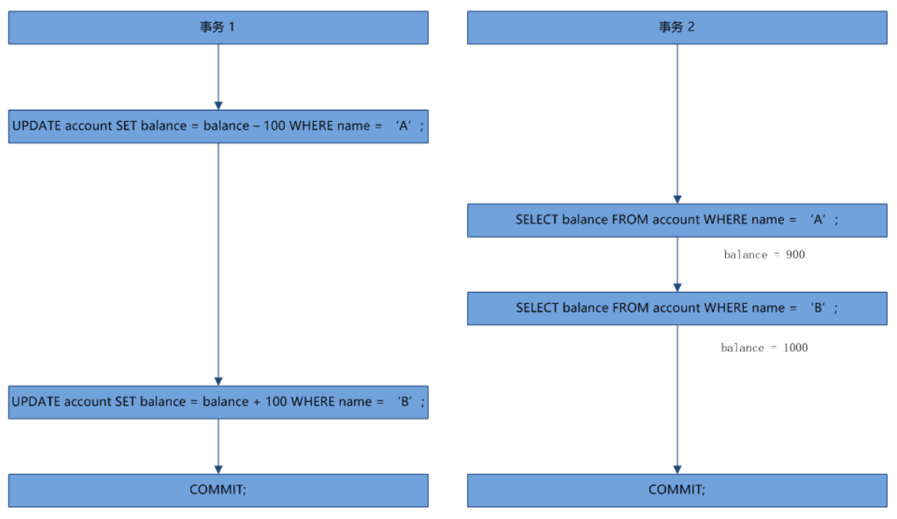
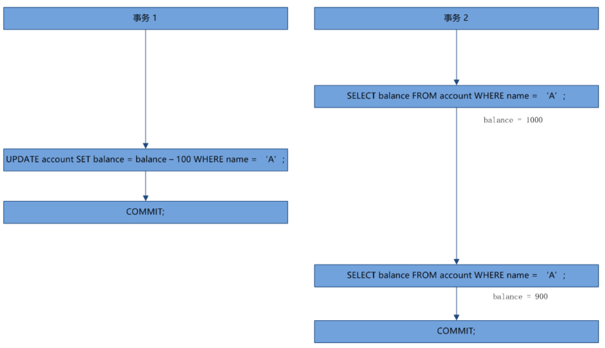
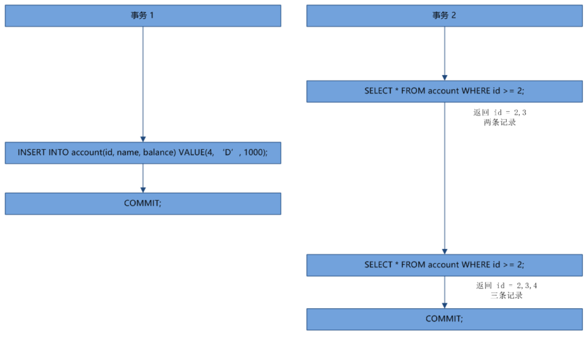
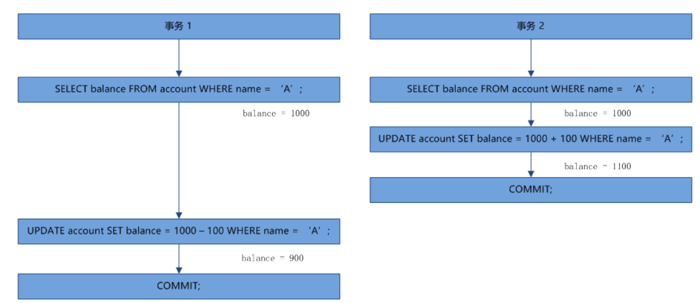
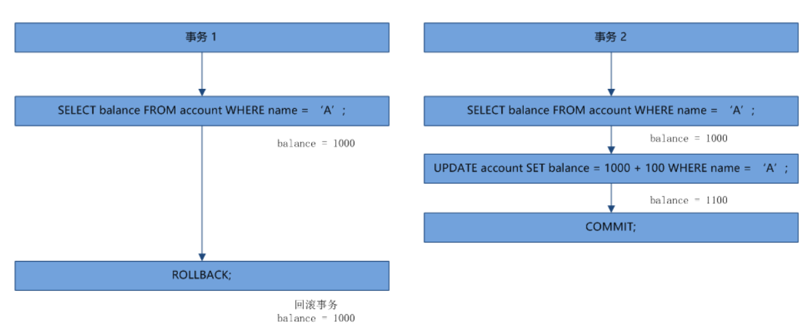
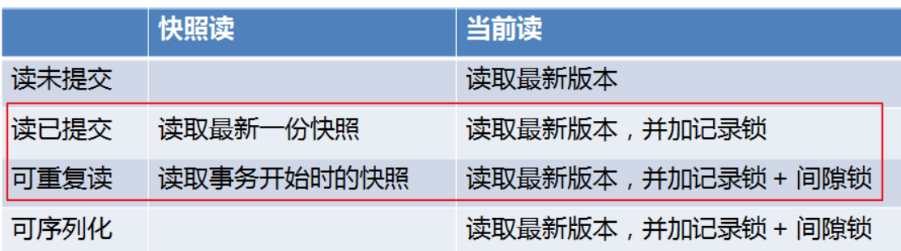

<!-- TOC -->

- [1、事务](#1事务)
    - [1、事务的特性（ACID）](#1事务的特性acid)
    - [2、Mysql怎么保证一致性的？](#2mysql怎么保证一致性的)
    - [3、Mysql怎么保证原子性的？](#3mysql怎么保证原子性的)
    - [4、Mysql怎么保证持久性的？](#4mysql怎么保证持久性的)
    - [5、Mysql怎么保证隔离性的？](#5mysql怎么保证隔离性的)
    - [6、事务隔离级别的含义](#6事务隔离级别的含义)
- [2、事务并发存在的问题](#2事务并发存在的问题)
    - [1、脏读（dirty read）](#1脏读dirty-read)
    - [2、不可重复读（unrepeatable read）](#2不可重复读unrepeatable-read)
    - [3、幻读（phantom read）](#3幻读phantom-read)
    - [4、丢失更新（lost update）](#4丢失更新lost-update)
- [3、隔离级别的实现](#3隔离级别的实现)
    - [1、传统的隔离级别](#1传统的隔离级别)
    - [2、MySQL 的隔离级别](#2mysql-的隔离级别)
- [4、查看和设置 MySQL 的隔离级别](#4查看和设置-mysql-的隔离级别)

<!-- /TOC -->


总结：数据库并发读写问题，引出通过事务级别四种隔离级别来解决各个事务可见性问题，锁/mvcc只是事务隔离级别的一种实现。


# 1、事务


## 1、事务的特性（ACID）

- 原子性：要么都成功，要么都失败。保证不了就会出现数据不一致；

- 一致性：一个事务单元需要提交之后才会被其他事务可见；

- 隔离性：本事务的操作结果对其它事务的可见性；

- 持久性：事务提交了，对数据库的改变就是永久的，Mysql通过Redo日志保证，在一个事务中的每一次SQL更新操作之后都会写一个redo log到buffer中，在最后commit时，必须先将该事务的所有日志写入到redo log file进行持久化（顺序写，保证性能）


但是对于我们了解死锁来说，我们还是应该把注意力放在 “I” 上面，因为不同的隔离级别，可能对应的加锁过程也不一样，而正是由于引入了各种各样的隔离级别，才让锁问题变得格外复杂。解决和分析死锁问题，首先得知道当前数据库的隔离级别。那么隔离级别是个什么东西呢？其实从上面也看的出来，隔离性和一致性是有冲突的，有时候为了提高性能，会适度的破坏一致性，可能会出现一个事务还没提交，它的修改就被其他事务看见了，这其实就是传说中的 脏读，它属于最低级的隔离级别：读未提交 。

## 2、Mysql怎么保证一致性的？

从数据库层面，数据库通过原子性、隔离性、持久性来保证一致性。也就是说ACID四大特性之中，C(一致性)是目的，A(原子性)、I(隔离性)、D(持久性)是手段，是为了保证一致性，数据库提供的手段。数据库必须要实现AID三大特性，才有可能实现一致性。

## 3、Mysql怎么保证原子性的？

是利用Innodb的undo log实现的。undo log名为回滚日志，是实现原子性的关键，当事务回滚时能够撤销所有已经成功执行的sql语句，他需要记录你要回滚的相应日志信息。例如

- (1)当你delete一条数据的时候，就需要记录这条数据的信息，回滚的时候，insert这条旧数据
- (2)当你update一条数据的时候，就需要记录之前的旧值，回滚的时候，根据旧值执行update操作
- (3)当年insert一条数据的时候，就需要这条记录的主键，回滚的时候，根据主键执行delete操作

undo log记录了这些回滚需要的信息，当事务执行失败或调用了rollback，导致事务需要回滚，便可以利用undo log中的信息将数据回滚到修改之前的样子。

## 4、Mysql怎么保证持久性的？

是利用Innodb的redo log。

更新数据时，Mysql是先把磁盘上的数据以数据页为单位加载到内存中的缓存页中，在内存中对数据进行修改，再刷回磁盘上。如果此时突然宕机，内存中的数据就会丢失。怎么解决这个问题？简单啊，事务提交前直接把数据写入磁盘就行啊。

这么做有什么问题？

- 1、只修改一个页面里的一个字节，就要将整个页面刷入磁盘，太浪费资源了。毕竟一个页面16kb大小，你只改其中一点点东西，就要将16kb的内容刷入磁盘，听着也不合理。

- 2、毕竟一个事务里的SQL可能牵涉到多个数据页的修改，而这些数据页可能不是相邻的，也就是属于随机IO。显然操作随机IO，速度会比较慢。

于是，决定采用redo log解决上面的问题。当做数据修改的时候，不仅在内存中操作，还会在redo log中记录这次操作。当事务提交的时候，会将redo log日志进行刷盘(redo log一部分在内存中，一部分在磁盘上)。当数据库宕机重启的时候，会将redo log中的内容恢复到数据库中，再根据undo log和binlog内容决定回滚数据还是提交数据。

采用redo log的好处？

其实好处就是将redo log进行刷盘比对数据页刷盘效率高，具体表现如下

- 1、redo log体积小，毕竟只记录了哪一页修改了啥，因此体积小，刷盘快。

- 2、redo log是一直往末尾进行追加，属于顺序IO。效率显然比随机IO来的快。


## 5、Mysql怎么保证隔离性的？

利用的是锁和MVCC机制。

至于MVCC,即多版本并发控制(Multi Version Concurrency Control),一个行记录数据有多个版本对快照数据，这些快照数据在undo log中。

如果一个事务读取的行正在做DELELE或者UPDATE操作，读取操作不会等行上的锁释放，而是读取该行的快照版本。

由于MVCC机制在可重复读(Repeateable Read)和读已提交(Read Commited)的MVCC表现形式不同.

但是有一点说明一下，在事务隔离级别为读已提交(Read Commited)时，一个事务能够读到另一个事务已经提交的数据，是不满足隔离性的。但是当事务隔离级别为可重复读(Repeateable Read)中，是满足隔离性的。

> 参考

- [Mysql中事务ACID实现原理](https://www.cnblogs.com/rjzheng/p/10841031.html)


## 6、事务隔离级别的含义

根据事务的隔离级别不同，会有三种情况发生。即脏读、不可重复读、幻读。


那么，这张图怎么理解呢？即，如果发生了脏读，那么不可重复读和幻读是一定发生的。因为拿脏读的现象，用不可重复读，幻读的定义也能解释的通。但是反过来，拿不可重复读的现象，用脏读的定义就不一定解释的通了！


```
隔离级别	                脏读	不可重复读	幻读
读未提交	                是	是	是
不可重复读(也称读提交)	否	是	是
可重复读	                否	否	是
串行化	                否	否	否

```


- 1、Read Uncommitted（RU）读未提交是指，一个事务还没提交时，它做的变更就能被别的事务看到。[检索操作出来的数据是不可靠的，是可以被另一个未提交的事务修改的！]

- 2、Read Committed（RC）读提交是指，一个事务提交之后，它做的变更才会被其他事务看到。[一个查询语句检索数据，随后又有一个查询语句在同一个事务中检索数据，两个数据应该是一样的，但是实际情况返回了不同的结果。]

- 3、Read Repeatable（RR）可重复读是指，一个事务执行过程中看到的数据，总是跟这个事务在启动时看到的数据是一致的。当然在可重复读隔离级别下，未提交变更对其他事务也是不可见的。[在一次查询的结果集里出现了某一行数据，但是该数据并未出现在更早的查询结果集里。例如，在一次事务里进行了两次查询，同时另一个事务插入某一行或更新某一行数据后(该数据符合查询语句里where后的条件)，并提交了]

**InnoDB默认用了REPEATABLE READ。在这种情况下，使用next-key locks解决幻读问题**

- 4、串行化，顾名思义是对于同一行记录，“写”会加“写锁”，“读”会加“读锁”。当出现读写锁冲突的时候，后访问的事务必须等前一个事务执行完成，才能继续执行。`在该隔离级别下，所有的select语句后都自动加上lock in share mode。因此，在该隔离级别下，无论你如何进行查询，都会使用next-key locks。所有的select操作均为当前读!`


在实现上，数据库里面会创建一个视图，访问的时候以视图的逻辑结果为准。在“可重复读”隔离级别下，这个视图是在事务启动时创建的，整个事务存在期间都用这个视图。在“读提交”隔离级别下，这个视图是在每个 SQL 语句开始执行的时候创建的。这里需要注意的是，“读未提交”隔离级别下直接返回记录上的最新值，没有视图概念；而“串行化”隔离级别下直接用加锁的方式来避免并行访问。


为了调和事务的安全性和性能之间的冲突，适当的降低隔离级别，可以有效的提高数据库的并发性能。于是便有了四种不同的隔离级别。针对这四种隔离级别，应该根据具体的业务来取舍，如果某个系统的业务里根本就不会出现重复读的场景，完全可以将数据库的隔离级别设置为 RC，这样可以最大程度的提高数据库的并发性。不同的隔离级别和可能发生的并发现象如下表：


在 可重复读（RR） 隔离级别下，是否可能出现第二类丢失更新问题（提交覆盖）比较有争议。其实也是因为 MySQL 的实现和 ANSI-SQL 标准之间的差异，在标准的传统实现中，RR 隔离级别是使用持续的 X 锁和持续的 S 锁来实现的（参看下面的 “隔离级别的实现” 一节），由于是持续的 S 锁，所以避免了其他事务有写操作，也就不存在提交覆盖问题。但是 MySQL 在 RR 隔离级别下，普通的 SELECT 语句只是快照读，没有任何的加锁，和标准的 RR 是不一样的。如果要让 MySQL 在 RR 隔离级别下不发生提交覆盖，可以使用 SELECT ... LOCK IN SHARE MODE 或者 SELECT ... FOR UPDATE 。


# 2、事务并发存在的问题


我们先来看一下下面这张表，以及几个对这个表的操作，瞧瞧在多事务并发处理数据的时候可能会发生哪些意想不到的情况。

表很简单，就三个字段，主键 id、姓名 name 和余额 balance，其中 name 为二级索引，如下：


```
id  name    balance
1   A       1000
2   B       1000
3   C       1000  
```

## 1、脏读（dirty read）

假设有两个事务，一个在进行转账操作，将 A 账户的 100 元转到 B 账户，同时有另一个事务在对 A 和 B 的账户余额进行求和统计，如下图所示：



我们不考虑任何加锁机制，仅仅从程序运行的角度来看，事务 1 执行成功之后，A 成功转了 100 元到 B 账户，这时 A 余额还剩 900 元，B 余额剩 1100，总和为 2000；但是事务 2 的统计求和算出来的结果却是 A + B = 1900。这个就是上面说的，没有提交的事务被其他事务读取到了，这叫做 脏读 。

## 2、不可重复读（unrepeatable read）

如下图所示，事务 2 第一次获取 A 的账户余额为 1000 元，这个时候事务 1 对 A 的账户余额进行操作减去了 100 元，事务 2 再去查询 A 的账户余额发现变成了 900 元，这样就出现了同一个事务对同一条记录读取两遍，两次读出来的结果竟然不一样。



不可重复读和脏读的区别在于，脏读是读取了另一个事务未提交的修改，而不可重复读是读取了另一个事务提交之后的修改，本质上都是其他事务的修改影响了本事务的读取。那么不可重复读有什么问题呢？假设上面的事务 2 存在着两个子例程，第一个例程是读取所有账户的余额计算总和，可以得到所有人的余额总和为 3000，第二个例程是再次读取所有账户的余额计算平均值，3 个人总和 3000 按理应该是平均每人 1000 才对，却计算出了 2900/3 = 966，这就导致了数据不一致。

## 3、幻读（phantom read）

对于幻读，最简单的解释就是：同样的条件，第一次和第二次读出来的记录数不一样。幻读和不可重复读的区别在于，后者是两次读取同一条记录，得到不一样的结果；而前者是两次读取同一个范围内的记录，得到不一样的记录数（这种说法其实只是便于理解，但并不准确，因为可能存在另一个事务先插入一条记录然后再删除一条记录的情况，这个时候两次查询得到的记录数也是一样的，但这也是幻读，所以严格点的说法应该是：两次读取得到的结果集不一样）。很显然，不可重复读是因为其他事务进行了 UPDATE 操作，幻读是因为其他事务进行了 INSERT 或者 DELETE 操作。同样的，下面举一个幻读的例子：



事务 2 的两次查询，第一次查出 2 条记录，第二次却查出 3 条记录，多出来的这条记录，正如 phantom（幽灵，幻影，错觉） 的意思，就像幽灵一样。


## 4、丢失更新（lost update）

上面说的三种情况，都是一个事务写，一个事务读，由于一个事务的写导致另一个事务读到了不该读的数据；那么如果两个事务都是写，又会发生什么呢？

假设两个事务同时对 A 的余额进行修改，他们都查出 A 的当前余额为 1000，然后事务 2 修改 A 的余额，将 A 的余额加 100 变成 1100 并提交，这个时候 A 的余额应该是 1100，但是这个时候事务 1 并不知道 A 的余额已经变动，而是继续在 1000 的基础上进行减 100 的操作并提交事务，就这样事务 2 的提交被覆盖掉了，事务 1 提交之后 A 的余额变成了 900 元。这就是说事务 1 的提交覆盖了事务 2 的提交，事务 2 的 UPDATE 操作完全丢失了，整个过程如下图所示：



这就是经典的 丢失更新 问题，由于最后一步是提交操作，所以又叫做 `提交覆盖`，有时候又叫 Read-Modify-Write 问题。一个典型的场景是并发对某个变量进行自增或自减，譬如商品表的库存字段，每次下单之后库存值需要减 1，大概的流程如下：

- 1、SELECT name, stock FROM product WHERE id = 100;
- 2、判断 stock 值是否足够，如果足够，则下单：if (stock > n) process order;
- 3、更新 stock 值，减去下单的商品数量：new_stock = stock - n;
- 4、UPDATE product SET stock = new_stock WHERE id = 100;


如果两个线程同时下单，很可能就会出现下面这样的情况：

- 线程 A 获取库存值为 10；
- 线程 B 获取库存值为 10；
- 线程 A 需要买 5 个商品，校验通过，并下单；
- 线程 B 需要买 5 个商品，校验通过，并下单；
- 线程 A 下单完成，更新库存值为 10 - 5 = 5；
- 线程 B 下单完成，更新库存值为 10 - 5 = 5；
- 两个线程下单结束后，商品的库存还剩 5 个，而实际上 10 个商品都已经卖光了。


和提交覆盖相对的，还有另一个 丢失更新 问题，叫做 `回滚覆盖`，如下图所示：



操作和提交覆盖情景基本上一样，只是最后一步事务 1 的提交变成了回滚，这样 A 的余额恢复成原始值 1000，事务 2 的 UPDATE 操作也完全没有生效，想一想这真的是非常可怕，一个事务的回滚操作竟然影响了另一个正常提交的事务。回滚覆盖问题可以说是程序 bug 了，因此几乎所有的数据库都不允许回滚覆盖。

`问题：怎么解决回滚覆盖问题的？`


有时候我们把回滚覆盖称之为 第一类丢失更新 问题，提交覆盖称为 第二类丢失更新 问题。

上面说了这么多并发场景下数据操作可能遇到的问题，那么要如何解决呢？我们能想到的最简单的方法就是对操作的数据进行加锁，写的时候不允许其他事务读，读的时候不允许其他事务写，这样是不是就完美解决了？确实如此。这其实就是四大隔离级别里的 序列化，在序列化隔离级别下，可以保证事务的安全执行，数据库的一致性得以保障，但是它大大降低了事务的并发能力，性能最低。


# 3、隔离级别的实现

上面所说的事务和隔离级别的概念，其实都是 SQL 标准中通用的概念，但是不同的数据库产品对标准的实现也会有很大的不同。譬如在 SQL 标准中，RR 隔离级别解决了不可重复读问题，但是依然存在幻读现象；而在 MySQL 的 RR 隔离级别下，通过多版本快照读和间隙锁技术解决了幻读问题。


## 1、传统的隔离级别

总结：`通过对锁的类型（读锁还是写锁），锁的粒度（行锁还是表锁），持有锁的时间（临时锁还是持续锁）合理的进行组合，就可以实现四种不同的隔离级别；`

SQL 规范中定义的四种隔离级别，分别是为了解决事务并发时可能遇到的四种问题，至于如何解决，实现方式是什么，规范中并没有严格定义。锁作为最简单最显而易见的实现方式，可能被广为人知，所以大家在讨论某个隔离级别的时候，往往会说这个隔离级别的加锁方式是什么样的。其实，`锁只是实现隔离级别的几种方式之一，除了锁，实现并发问题的方式还有时间戳，多版本控制等等，这些也可以称为无锁的并发控制。`


传统的隔离级别是基于锁实现的，这种方式叫做 基于锁的并发控制`（Lock-Based Concurrent Control，简写 LBCC）`。通过对读写操作加不同的锁，以及对释放锁的时机进行不同的控制，就可以实现四种隔离级别。传统的锁有两种：读操作通常加共享锁（Share locks，S锁，又叫读锁），写操作加排它锁（Exclusive locks，X锁，又叫写锁）；加了共享锁的记录，其他事务也可以读，但不能写；加了排它锁的记录，其他事务既不能读，也不能写。另外，对于锁的粒度，又分为行锁和表锁，行锁只锁某行记录，对其他行的操作不受影响，表锁会锁住整张表，所有对这个表的操作都受影响。

归纳起来，四种隔离级别的加锁策略如下：

- 读未提交（Read Uncommitted）：事务读不阻塞其他事务读和写，事务写阻塞其他事务写但不阻塞读；通过对写操作加 “持续X锁”，对读操作不加锁 实现；

- 读已提交（Read Committed）：事务读不会阻塞其他事务读和写，事务写会阻塞其他事务读和写；通过对写操作加 “持续X锁”，对读操作加 “临时S锁” 实现；不会出现脏读；

- 可重复读（Repeatable Read）：事务读会阻塞其他事务事务写但不阻塞读，事务写会阻塞其他事务读和写；通过对写操作加 “持续X锁”，对读操作加 “持续S锁” 实现；

- 序列化（Serializable）：为了解决幻读问题，行级锁做不到，需使用表级锁。


结合上面介绍的每种隔离级别分别是用来解决事务并发中的什么问题，再来看看它的加锁策略其实都挺有意思的。其中 读未提交 网上有很多人认为不需要加任何锁，这其实是错误的，我们上面讲过，有一种并发问题在任何隔离级别下都不允许存在，那就是第一类丢失更新（回滚覆盖），如果不对写操作加 X 锁，当两个事务同时去写某条记录时，可能会出现丢失更新问题，这里 有一个例子可以看到写操作不加 X 锁发生了回滚覆盖。再看 读已提交，它是为了解决脏读问题，只能读取已提交的记录，要怎么做才可以保证事务中的读操作读到的记录都是已提交的呢？很简单，对读操作加上 S 锁，这样如果其他事务有正在写的操作，必须等待写操作提交之后才能读，因为 S 和 X 互斥，如果在读的过程中其他事务想写，也必须等事务读完之后才可以。这里的 S 锁是一个临时 S 锁，表示事务读完之后立即释放该锁，可以让其他事务继续写，如果事务再读的话，就可能读到不一样的记录，这就是 不可重复读 了。为了让事务可以重复读，加在读操作的 S 锁变成了持续 S 锁，也就是直到事务结束时才释放该锁，这可以保证整个事务过程中，其他事务无法进行写操作，所以每次读出来的记录是一样的。最后，序列化 隔离级别下单纯的使用行锁已经实现不了，因为行锁不能阻止其他事务的插入操作，这就会导致幻读问题，这种情况下，我们可以把锁加到表上（也可以通过范围锁来实现，但是表锁就相当于把表的整个范围锁住，也算是特殊的范围锁吧）。


从上面的描述可以看出，通过对锁的类型（读锁还是写锁），锁的粒度（行锁还是表锁），持有锁的时间（临时锁还是持续锁）合理的进行组合，就可以实现四种不同的隔离级别。这四种不同的加锁策略实际上又称为 封锁协议（Locking Protocol），所谓协议，就是说不论加锁还是释放锁都得按照特定的规则来。读未提交 的加锁策略又称为 一级封锁协议，后面的分别是二级，三级，序列化 的加锁策略又称为 四级封锁协议。

其中三级封锁协议在事务的过程中为写操作加持续 X 锁，为读操作加持续 S 锁，并且在事务结束时才对锁进行释放，像这种加锁和解锁明确的分成两个阶段我们把它称作 两段锁协议（2-phase locking，简称 2PL）。在两段锁协议中规定，加锁阶段只允许加锁，不允许解锁；而解锁阶段只允许解锁，不允许加锁。这种方式虽然无法避免死锁，但是两段锁协议可以保证事务的并发调度是串行化的（关于串行化是一个非常重要的概念，尤其是在数据恢复和备份的时候）。在两段锁协议中，还有一种特殊的形式，叫 一次封锁，意思是指在事务开始的时候，将事务可能遇到的数据全部一次锁住，再在事务结束时全部一次释放，这种方式可以有效的避免死锁发生。但是这在数据库系统中并不适用，因为事务开始时并不知道这个事务要用到哪些数据，一般在应用程序中使用的比较多。


## 2、MySQL 的隔离级别

虽然数据库的四种隔离级别通过 LBCC 技术都可以实现，但是它最大的问题是它只实现了并发的读读，对于并发的读写还是冲突的，写时不能读，读时不能写，当读写操作都很频繁时，数据库的并发性将大大降低，针对这种场景，MVCC 技术应运而生。MVCC 的全称叫做 Multi-Version Concurrent Control（多版本并发控制），InnoDb 会为每一行记录增加几个隐含的“辅助字段”，（实际上是 3 个字段：一个隐式的 ID 字段，一个事务 ID，还有一个回滚指针），事务在写一条记录时会将其拷贝一份生成这条记录的一个原始拷贝，写操作同样还是会对原记录加锁，但是读操作会读取未加锁的新记录(其实就是拷贝的undo log)，这就保证了读写并行。要注意的是，生成的新版本其实就是 undo log，它也是实现事务回滚的关键技术。

InnoDb 通过 MVCC 实现了读写并行，但是在不同的隔离级别下，读的方式也是有所区别的。首先要特别指出的是，在 read uncommit 隔离级别下，每次都是读取最新版本的数据行，所以不能用 MVCC 的多版本，而 serializable 隔离级别每次读取操作都会为记录加上读锁，也和 MVCC 不兼容，`所以只有 RC 和 RR 这两个隔离级别才有 MVCC`。下面我们通过两个例子，来看看这两个隔离级别下 MVCC 有什么区别。


还是使用上面的 account 表，首先将 MySQL 的事务隔离级别设置为 RR，然后开启一个事务，执行下面的 SQL：

```sql
mysql> begin;
Query OK, 0 rows affected (0.00 sec)
 
mysql> select * from account where id = 1;
+----+----------+---------+
| id |     name | balance |
+----+----------+---------+
|  1 |        A |  1000   |
+----+----------+---------+
1 row in set (0.00 sec)
 
mysql> update account set balance = 2000 where id = 1;
Query OK, 1 row affected (0.00 sec)
Rows matched: 1  Changed: 1  Warnings: 0
 
mysql> select * from account where id = 1;
+----+----------+---------+
| id |     name | balance |
+----+----------+---------+
|  1 |        A |  2000   |
+----+----------+---------+
1 row in set (0.00 sec)
```

开启第二个事务，如下：

```sql
mysql> begin;
Query OK, 0 rows affected (0.00 sec)
 
mysql> select * from account where id = 1;
+----+----------+---------+
| id |     name | balance |
+----+----------+---------+
|  1 |        A |  1000   |
+----+----------+---------+
1 row in set (0.00 sec)
```

可以看到事务 2 查询出来的还是 A 原始的信息，这个时候事务 1 使用 commit 提交：

```sql
mysql> commit;
Query OK, 0 rows affected (0.05 sec)
```

并在事务 2 中再查询一次，发现查询出来的结果不变，还是原始值：

```sql
mysql> select * from account where id = 1;
+----+----------+---------+
| id |     name | balance |
+----+----------+---------+
|  1 |        A |  1000   |
+----+----------+---------+
1 row in set (0.00 sec)
```

同样的，我们将数据库的隔离级别设置为 RC，重新做一次这个实验，第一步都是一样的，只是第二步当事务 1 commit 之后，事务 2 再查一次发现查询出来的是最新提交的记录了：

```sql
mysql> select * from account where id = 1;
+----+----------+---------+
| id |     name | balance |
+----+----------+---------+
|  1 |        A |  2000   |
+----+----------+---------+
1 row in set (0.00 sec)
```

通过这个实验可以知道，尽管 RR 和 RC 隔离级别都实现了 MVCC 来满足读写并行，但是读的实现方式是不一样的：`RC 总是读取记录的最新版本，如果该记录被锁住，则读取该记录最新的一次快照，而 RR 是读取该记录事务开始时的那个版本`。虽然这两种读取方式不一样，但是它们读取的都是快照数据，并不会被写操作阻塞，所以这种读操作称为 快照读（Snapshot Read），有时候也叫做 非阻塞读（Nonlocking Read），RR 隔离级别下的叫做 一致性非阻塞读（Consistent Nonlocking Read）。


除了 快照读 ，MySQL 还提供了另一种读取方式：当前读（Current Read），有时候又叫做 加锁读（Locking Read） 或者 阻塞读（Blocking Read），这种读操作读的不再是数据的快照版本，而是数据的最新版本，并会对数据加锁，根据加锁的不同，又分成两类：

- SELECT ... LOCK IN SHARE MODE：加 S 锁
- SELECT ... FOR UPDATE：加 X 锁
- INSERT / UPDATE / DELETE：加 X 锁

当前读在 RR 和 RC 两种隔离级别下的实现也是不一样的：`RC 只加记录锁，RR 除了加记录锁，还会加间隙锁，用于解决幻读问题`，关于记录锁和间隙锁的概念后面再讲，有兴趣的同学可以和上面一样，通过两个例子来感受一下。

首先在 RC 隔离级别下，开启一个事务，执行下面的 SQL 查询所有 id > 3 的记录，使用当前读而不是快照读：

```sql
mysql> begin;
Query OK, 0 rows affected (0.00 sec)
 
mysql> select * from account where id > 3 lock in share mode;
+----+----------+---------+
| id |     name | balance |
+----+----------+---------+
|  4 |        D |  1000   |
+----+----------+---------+
1 row in set (0.00 sec)
```

同时，开启另一个事务，向 account 表中新增一条记录，然后修改 id = 4 的记录：

```sql
mysql> begin;
Query OK, 0 rows affected (0.00 sec)
 
mysql> insert into account(name, balance) value('E', 1000);
Query OK, 1 row affected (6.24 sec)
 
mysql> update account set balance = 2000 where id = 4;
```

可以看到事务 2 在事务 1 当前读之后，仍然可以新增记录，但是在执行 update 操作的时候被阻塞，这说明了事务 1 在执行当前读的时候在 id = 4 这条记录上加了锁，但是并没有对 id > 3 这个范围加锁。然后我们切换到事务 1 中，再次查询：

```sql
mysql> select * from account where id > 3 lock in share mode;
ERROR 1213 (40001): Deadlock found when trying to get lock; try restarting transaction
```

这个时候事务 1 直接死锁了，原因其实很简单，事务 2 在 insert 新纪录的时候（id = 5）会在新纪录上加锁，所以事务 1 再次执行当前读，想获取 id > 3 的记录，就需要在 id = 4 和 id = 5 这两条记录上加锁，但是 id = 5 这条记录已经被事务 2 锁住了，于是事务 1 被事务 2 阻塞，同时事务 2 还在等待 事务 1 释放 id = 4 上的锁，于是便产生了死锁。

接下来把隔离级别设置成 RR，再重复事务 1 刚刚的操作：

```sql
mysql> begin;
Query OK, 0 rows affected (0.00 sec)
 
mysql> select * from account where id > 3 lock in share mode;
+----+----------+---------+
| id |     name | balance |
+----+----------+---------+
|  4 |        D |  1000   |
+----+----------+---------+
1 row in set (0.00 sec)
```

同时，事务 2 向 account 表中新增一条记录：

```sql
mysql> begin;
Query OK, 0 rows affected (0.00 sec)
 
mysql> insert into account(name, balance) value('E', 1000);
```

我们发现，这个时候事务 2 就被阻塞了，很显然事务 1 在执行 select ... lock in share mode 的时候，不仅在 id = 4 这条记录上加了锁，而且在 id > 3 这个范围上也加了锁。

关于 MySQL 不同的隔离级别，读操作的差异总结起来如下图所示（其中，读未提交和可序列化都和 MVCC 不兼容，可以暂且认为它们都属于当前读）：




# 4、查看和设置 MySQL 的隔离级别

可以通过查看 MySQL 中的系统变量 tx_isolation 的值来确定当前 MySQL 正在使用什么隔离级别。使用下面的 SQL 查询当前数据库的隔离级别：

```sql
mysql> select @@tx_isolation;
+-----------------+
| @@tx_isolation  |
+-----------------+
| REPEATABLE-READ |
+-----------------+
```

这里要注意的是在 MySQL 中变量一般分为两类：用户变量 和 系统变量，用户变量的变量名格式为 @variable，而系统变量的格式为 @@variable，tx_isolation 是系统变量，所以变量名为 @@tx_isolation。其中，系统变量又可以分为 全局变量 和 会话变量，默认情况下使用 select @@variable 查询出来的是会话变量的值，也可以写作 select @@session.variable 或者 select @@local.variable，如果要查询全局变量的值，则使用 select @@global.variable。

所以通常使用下面的 SQL 查询数据库的隔离级别：

```sql
mysql> select @@session.tx_isolation, @@global.tx_isolation;
+------------------------+-----------------------+
| @@session.tx_isolation | @@global.tx_isolation |
+------------------------+-----------------------+
| REPEATABLE-READ        | REPEATABLE-READ       |
+------------------------+-----------------------+
```

另外可以使用 SET TRANSACTION 命令修改 MySQL 的隔离级别，譬如下面的 SQL 修改隔离级别为 RC：

mysql> set transaction isolation level read committed;

同样其他的隔离级别可以使用下面的 SQL 进行修改：

- set transaction isolation level read uncommitted;
- set transaction isolation level read committed;
- set transaction isolation level repeatable read;
- set transaction isolation level serializable;

找到了一种可以查看事务隔离级别的方法，那就是查 information_schema.INNODB_TRX 表。这种方式有一个不方便的地方在于，事务里必须要先执行一条 SQL 语句，才会在 INNODB_TRX 表中有记录，如下所示：

```sql
mysql> select * from information_schema.INNODB_TRX\G
*************************** 1. row ***************************
                    trx_id: 282133714024240
                 trx_state: RUNNING
               trx_started: 2017-10-14 23:12:58
     trx_requested_lock_id: NULL
          trx_wait_started: NULL
                trx_weight: 0
       trx_mysql_thread_id: 40
                 trx_query: NULL
       trx_operation_state: NULL
         trx_tables_in_use: 0
         trx_tables_locked: 0
          trx_lock_structs: 0
     trx_lock_memory_bytes: 1136
           trx_rows_locked: 0
         trx_rows_modified: 0
   trx_concurrency_tickets: 0
       trx_isolation_level: READ COMMITTED
         trx_unique_checks: 1
    trx_foreign_key_checks: 1
trx_last_foreign_key_error: NULL
 trx_adaptive_hash_latched: 0
 trx_adaptive_hash_timeout: 0
          trx_is_read_only: 0
trx_autocommit_non_locking: 0
1 row in set (0.00 sec)
```

如果要修改当前会话的隔离级别，而不是仅仅下一个事务的隔离级别（这在做实验时挺有用的），需要使用下面命令：

set session transaction isolation level read committed;

另外，也可以使用修改系统变量的方法来修改隔离级别：

mysql> set @@session.tx_isolation = 'READ-COMMITTED';

如果要修改全局变量的话，则使用命令 set global transaction isolation level ... 或者 set @@global.tx_isolation = ...，方法与上面类似，不再赘述。不过要注意的是，这个命令不会改变当前会话的隔离级别，而是对新的会话有影响，所以要关闭当前会话，重新开启一个会话才能看到效果。


> 参考

- [新说Mysql事务隔离级别](https://www.cnblogs.com/rjzheng/p/9955395.html)

- [解决死锁之路 - 学习事务与隔离级别](https://www.aneasystone.com/archives/2017/10/solving-dead-locks-one.html)