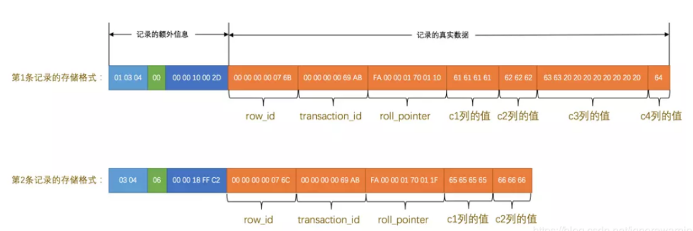
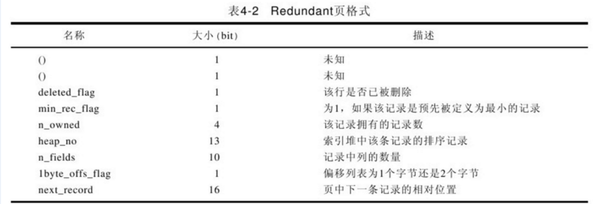

<!-- TOC -->

- [1、行记录格式的分类和介绍](#1行记录格式的分类和介绍)
- [2、InnoDB行存储](#2innodb行存储)
- [3、row_format格式详解](#3row_format格式详解)
    - [1、COMPACT](#1compact)
    - [2、Redundant](#2redundant)
    - [3、Compressed 和 Dynamic](#3compressed-和-dynamic)
- [参考](#参考)

<!-- /TOC -->


在MYSQL中， 若一张表里面不存在varchar、text以及其变形、blob以及其变形的字段的话，那么张这个表其实也叫静态表[static/fixed ]，即该表的row_format是fixed，就是说每条记录所占用的字节一样。其优点读取快，缺点浪费额外一部分空间。

那么实际开发中,这种表很少,大部分表的字段类型都是有很多种的,那么这种表就叫做:dynamic :动态表 ,优点是节省空间,缺点是读取的时间的开销

ROW_FORMAT 的值如下:

- DEFAULT

- FIXED

- DYNAMIC

- COMPRESSED

- REDUNDANT

- COMPACT

修改row_format的参数:

`ALTER TABLE table_name ROW_FORMAT = DEFAULT`


命令执行的结果:

- fixed--->dynamic: 这会导致CHAR变成VARCHAR

- dynamic--->fixed: 这会导致VARCHAR变成CHAR


# 1、行记录格式的分类和介绍

在早期的InnoDB版本中，由于文件格式只有一种，因此不需要为此文件格式命名。随着InnoDB引擎的发展，开发出了不兼容早期版本的新文件格式，用于支持新的功能。为了在升级和降级情况下帮助管理系统的兼容性，以及运行不同的MySQL版本，InnoDB开始使用命名的`文件格式`。


Antelope 是 InnoDB 最开始支持的文件格式，它包含两种行格式 Compact 和 Redundant，它最开始并没有名字；Antelope 的名字是在新的文件格式 Barracuda 出现后才起的，Barracuda 的出现引入了两种新的行格式 Compressed 和 Dynamic；InnoDB 对于文件格式都会向前兼容，而官方文档中也对之后会出现的新文件格式预先定义好了名字：Cheetah、Dragon、Elk 等等。

- 1.Antelope: 先前未命名的，原始的InnoDB文件格式。它支持两种行格式：COMPACT 和 REDUNDANT。MySQL5.6的默认文件格式。可以与早期的版本保持最大的兼容性。不支持 Barracuda 文件格式。

- 2.Barracuda: 新的文件格式。它支持InnoDB的所有行格式，包括新的行格式：COMPRESSED 和 DYNAMIC。与这两个新的行格式相关的功能包括：InnoDB表的压缩，长列数据的页外存储和索引建前缀最大长度为3072字节。

在 msyql 5.7.9 及以后版本，`默认行格式由innodb_default_row_format变量决定，它的默认值是DYNAMIC`，也可以在 create table 的时候指定ROW_FORMAT=DYNAMIC。用户可以通过命令 SHOW TABLE STATUS LIKE'table_name' 来查看当前表使用的行格式，其中 row_format 列表示当前所使用的行记录结构类型。

```sql
mysql> select @@innodb_default_row_format;
ERROR 2006 (HY000): MySQL server has gone away
No connection. Trying to reconnect...
Connection id:    21
Current database: *** NONE ***

+-----------------------------+
| @@innodb_default_row_format |
+-----------------------------+
| dynamic                     |
+-----------------------------+
1 row in set (0.03 sec)
```


PS：如果要修改现有表的行模式为compressed或dynamic，必须先将文件格式设置成Barracuda：set global innodb_file_format=Barracuda;，再用ALTER TABLE tablename ROW_FORMAT=COMPRESSED;去修改才能生效。

```sql
mysql> select @@innodb_file_format;
+----------------------+
| @@innodb_file_format |
+----------------------+
| Barracuda            |
+----------------------+
1 row in set (0.00 sec)
```


备注：字符编码占用字节：ASCII编码是定长编码字符集1字节，而gbk中一个字符表示1-2个字节和utf-8中一个字符表示1-3个字节；


# 2、InnoDB行存储

InnoDB表的数据存储在页（page=16K）中，每个页可以存放多条记录。这些页以树形结构组织，这颗树称为B+树索引。表中数据和辅助索引都是使用B+树结构。维护表中所有数据的这颗B+树索引称为聚簇索引，通过主键来组织的。聚簇索引的叶子节点包含行中所有字段的值，辅助索引的叶子节点包含索引列和主键列。

变长字段是个例外，例如对于BLOB和VARCHAR类型的列，当页不能完全容纳此列的数据时，会将此列的数据存放在称为溢出页(overflow page)的单独磁盘页上，称这些列为页外列(off-page column)。这些列的值存储在以单链表形式存在的溢出页列表中，每个列都有自己溢出页列表。某些情况下，为了避免浪费存储空间和消除读取分隔页，列的所有或前缀数据会存储在B+树索引中。

# 3、row_format格式详解

## 1、COMPACT

Compact行格式的首部是一个非NULL变长字段长度列表，而且是按照列的顺序逆序放置的。当列的长度小于255字节，用1字节表示，若大于255个字节，用2个字节表示，`变长字段的长度最大不可以超过2个字节（这也很好地解释了为什么MySQL中varchar的最大长度为65 535，因为2个字节为16位，即216=1=65 535）`。第二个部分是NULL标志位，该位指示了该行数据中是否有NULL值，用1表示。该部分所占的字节应该为bytes。接下去的部分是为记录头信息（record header），固定占用5个字节（40位），每位的含义见下表4-1。最后的部分就是实际存储的每个列的数据了，需要特别注意的是，NULL不占该部分任何数据，即NULL除了占有NULL标志位，实际存储不占有任何空间。`另外有一点需要注意的是，每行数据除了用户定义的列外，还有两个隐藏列，事务ID列和回滚指针列，分别为6个字节和7个字节的大小。若InnoDB表没有定义Primary Key，每行还会增加一个6字节的RowID列。(即innodb会存在6+7+6=19个额外的字节)`


Compact行记录是在MySQL 5.0时被引入的，其设计目标是能高效存放数据。简单来说，如果一个页中存放的行数据越多，其性能就越高。Compact行记录以如下方式进行存储：


记录头信息：用于描述记录的记录头信息，它是由固定的5个字节组成。也就是40个二进制位，不同的位代表不同的意思。


除了我们自定义的数据信息外系统还会为每条记录添加默认的列，也成为隐藏列


备注：实际上这几个列的真正名称其实是：DB_ROW_ID、DB_TRX_ID、DB_ROLL_PTR，我们为了美观才写成了row_id、transaction_id和roll_pointer。

样例：



> InoDB引擎对表的主键生成策略为：

优先使用用户自定义的主键作为主键，如果用户没有定义主键，则选取一个unique键作为主键，如果连 unique主键都没有的话，则InoDB会默认添加一个名为row_ID的隐藏列作为主键。


## 2、Redundant


Compact 和 Redundant 格式最大的不同就是记录格式的第一个部分；在 Compact 中，`行记录的第一部分倒序存放了一行数据中列的长度（Length），而 Redundant 中存的是每一列的偏移量（Offset）`，从总体上上看，Compact 行记录格式相比 Redundant 格式能够减少 20% 的存储空间。


Redundant是MySQL 5.0版本之前InnoDB的行记录存储方式，MySQL 5.0支持Redundant是为了向前兼容性。Redundant行记录以如下方式存储：


从上图可以看到，不同于Compact行记录格式，Redundant行格式的首部是一个字段长度偏移列表，`同样是按照列的顺序逆序放置的。`当列的长度小于255字节，用1字节表示；若大于255个字节，用2个字节表示。第二个部分为记录头信息（record header），不同于Compact行格式，Redundant行格式固定占用6个字节（48位），每位的含义见表4-2。从表中可以看到，`n_fields值代表一行中列的数量，占用10位，这也很好地解释了为什么MySQL一个行支持最多的列为1023。`另一个需要注意的值为1byte_offs_flags，该值定义了偏移列表占用1个字节还是2个字节。最后的部分就是实际存储的每个列的数据了。



## 3、Compressed 和 Dynamic

InnoDB1.0x开始引入心的文件格式（file format，用户可以理解位新的页格式）——Barracuda（图1），这个新的格式拥有两种新的行记录格式：Compressed和Dynamic。

新的两种记录格式对于存放BLOB中的数据采用了完全的行溢出的方式。如图：


Dynamic行格式，列存储是否放到off-page页，主要取决于行大小，他会把行中最长的一列放到off-page，直到数据页能存放下两行。TEXT或BLOB列<=40bytes时总是存在于数据页。这种方式可以避免compact那样把太多的大列值放到B-tree Node（数据页中只存放20个字节的指针，实际的数据存放在Off Page中，之前的Compact 和 Redundant 两种格式会存放768个字前缀字节）。

Compressed物理结构上与Dynamic类似，Compressed行记录格式的另一个功能就是存储在其中的行数据会以zlib的算法进行压缩，因此对于BLOB、TEXT、VARCHAR这类大长度数据能够进行有效的存储（减少40%，但对CPU要求更高）。


# 参考

- [Mysql Row_Format 参数讲解](https://www.cnblogs.com/bing-yu12/p/7735652.html)

- [《MySQL是怎么运行的：从根儿上理解MySQL》——InnoDB存储引擎](https://blog.csdn.net/ignorewarnings/article/details/90664793)


- [InnoDB的行记录格式, Compact, Redundant, Compressed, Dynamic](https://www.cnblogs.com/wade-luffy/p/6289183.html)

- [MySQL InnoDB 行记录格式（ROW_FORMAT）](https://www.cnblogs.com/wilburxu/p/9435818.html)


